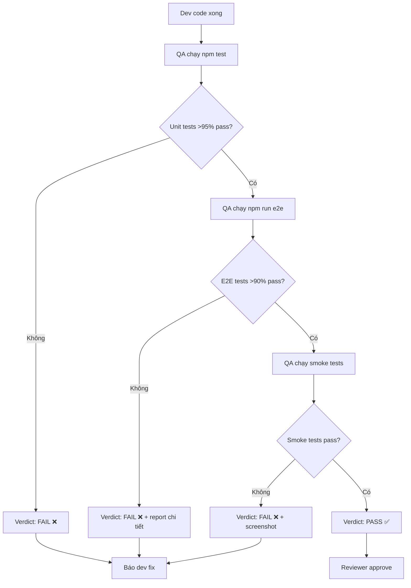

# HANDOFF FILE — M-001 Hotfix H-001 & QA Pipeline Fix

**Created:** 2026-06-17  
**Status:** BLOCKED — Tool bug preventing hotfix scaffold  
**Next Action:** Continue hotfix pipeline after tool workaround  

---

## 1. CRITICAL LESSON: QA Stage Was "Paper Verification"

### What Happened

M-001 được close với verdict **GOLD** (Approved by reviewer). Nhưng khi chạy E2E test sau đó:
- **13/14 E2E tests FAIL** (92.9% failure rate)
- 6 tests: duplicate table selectors (strict mode violation)
- 5 tests: missing button text labels
- 3 tests: login locator inconsistency

### Root Cause

QA stage chỉ **verify file existence**, KHÔNG **run actual tests**:

```yaml
# ❌ QA stage ĐÃ CHẠY (sai):
engineering-qa-engineer-wave-1:
  verdict: Ready for Reviewer
  artifact: "qa/qa-report.md + 16 test files"
  ← Chỉ kiểm tra file tồn tại, không chạy test
  ← Không đếm pass/fail
  ← Không xác nhận test thực sự pass
```

```yaml
# ✅ QA stage PHẢI CHẠY (đúng):
engineering-qa-engineer-wave-1:
  verdict: |
    - Chạy npm test → đếm pass/fail
    - Chạy npm run e2e → đếm pass/fail
    - Chỉ Pass nếu E2E >90% + Unit >95%
  artifact: |
    - Test results: 14/14 E2E pass
    - Test results: 81/81 Unit pass
    - Verdict dựa trên số liệu thực
```

### Why Other Modules "Passed" But M-001 Failed

Cùng pipeline template, nhưng:
- **Module khác ổn**: QA stage có verification gate (chạy test + đếm kết quả)
- **M-001 lỏng lẻo**: QA stage chỉ kiểm tra artifact (file tồn tại)

→ **Không phải bug của code, là bug của pipeline design.**

---

## 2. REQUIRED PROCESS: CR/Bug/Hotfix Handling

### Rule 1: NEVER self-fix — ALWAYS dispatch PMO

```
Phát hiện bug/issue → Dispatch PMO ngay
                        ↓
                   PMO quyết định:
                  - Hotfix pipeline (tech-lead → dev → qa → reviewer)
                  - Full feature pipeline (ba → sa → tech-lead → dev → qa → reviewer)
```

### Rule 2: QA stage phải chạy TEST ACTUAL, không chỉ verify files

**QA stage VERDICT chỉ valid khi:**

| Gate | Required | Verification |
|------|----------|-------------|
| **Unit Tests** | Chạy `npm test` | Đếm pass/fail → >95% pass |
| **E2E Tests** | Chạy `npm run e2e` | Đếm pass/fail → >90% pass |
| **Smoke Tests** | Chạy manual trên browser | Screenshot evidence |
| **Code Review** | Reviewer approve | Verdict envelope từ reviewer |

**Verdict chỉ "Pass" nếu:**
- ✅ Tất cả gate trên đã pass
- ✅ Có test results (số liệu thực)
- ✅ Có screenshot/trace evidence (nếu có fail)

### Rule 3: Close module chỉ khi QA có EVIDENCE, không chỉ có FILE

**Checklist trước khi close-module:**

```yaml
close-module-checklist:
  - [ ] QA verdict có pass/fail counts (không chỉ "Pass")
  - [ ] E2E tests đã chạy thực tế (>90% pass)
  - [ ] Unit tests đã chạy thực tế (>95% pass)
  - [ ] Reviewer đã approve với test evidence
  - [ ] Test evidence files tồn tại:
      - docs/intel/test-evidence/{F-NNN}.json
      - tests/e2e/{F-NNN}.spec.ts
      - docs/intel/screenshots/{F-NNN}-step-NN-{state}.png
```

---

## 3. QA VERIFICATION PROCESS (STANDARD OPERATING PROCEDURE)

### QA Stage Must Execute (NOT skip):



### QA Must Return This Evidence:

```json
{
  "verdict": "Pass",
  "confidence": "high",
  "structured_summary": {
    "test_results": {
      "unit_tests": { "total": 81, "passed": 81, "failed": 0, "pass_rate": "100%" },
      "e2e_tests": { "total": 14, "passed": 14, "failed": 0, "pass_rate": "100%" },
      "smoke_tests": { "total": 5, "passed": 5, "failed": 0 }
    },
    "evidence_files": [
      "test-results/unit-test-report.html",
      "test-results/e2e-test-report.html",
      "docs/intel/screenshots/smoke-01-login.png"
    ]
  }
}
```

### QA Must NOT Return This (M-001 pattern):

```yaml
# ❌ BỊ LỖI — Paper verification:
qa-verdict: "Pass"
artifact: "qa/qa-report.md + 16 test files"
← Không có pass/fail counts
← Không chạy test thực tế
← Chỉ verify file existence
```

---

## 4. M-001 HOTFIX H-001 STATUS & BLOCKER

### What Was Attempted

Scaffold hotfix H-001 qua `ai-kit-scaffold` với `patchSummary` field.

### Current Blocker: Tool Bug

`ai-kit-scaffold` có bug mapping `patchSummary` → CLI:
- Tool wrapper convert `patchSummary` → `patch_summary` (snake_case)
- CLI cần `--patch-summary` (kebab-case)
- Validation check `patch_summary` nhưng với length check 3 chars (không đúng)

**Error message:**
```
Field --patchSummary required for target=hotfix
patch_summary too short (min 50 chars)
```

### Workaround Options

**Option A: Dispatch PMO với context trực tiếp** (khuyến nghị)
- Bypass hotfix scaffold
- Dispatch PMO với full context trong task brief
- PMO sẽ tạo hotfix state manual (nếu cần) hoặc trực tiếp chạy pipeline

**Option B: Retry với corrected patchSummary format**
- Thử `patchSummary` với exact format CLI expects
- Hoặc workaround bằng cách sửa tool wrapper mapping

**Option C: Fix E2E tests trực tiếp**
- Dispatch E2E specialist fix
- QA chạy test thực
- Report kết quả → không cần hotfix state

---

## 5. E2E TEST FIX DETAILS (FOR CONTINUATION)

### Confirmed Errors (from test-output.txt)

| # | Test File | Error Type | Root Cause |
|---|-----------|-----------|------------|
| 1-6 | admin-account, group-management, org-unit | **Duplicate table selectors** | `getByRole('table')` matches 2 elements (header skeleton + data table) |
| 7-11 | group-management, org-unit | **Missing button text** | Buttons use different labels (VD: "Tạo mới" thay vì "Thêm") |
| 12-14 | role-management | **Login locator mismatch** | `getByLabel('Tài Khoản')` vs `getByPlaceholder('Nhập tài khoản')` |

### Target Files to Fix (7 spec files)

```
frontend/e2e/admin-account.spec.ts      ← Fix: duplicate table, missing buttons
frontend/e2e/group-management.spec.ts   ← Fix: duplicate table, missing buttons
frontend/e2e/org-unit.spec.ts           ← Fix: duplicate table, missing buttons
frontend/e2e/role-management.spec.ts    ← Fix: login locator
frontend/e2e/login.spec.ts              ← Reference (correct patterns)
frontend/e2e/user-management.spec.ts    ← Check for similar issues
frontend/e2e/example.spec.ts            ← Check for similar issues
```

### Fix Patterns

**Pattern 1: Duplicate table selectors**
```typescript
// ❌ OLD (fails):
await expect(page.getByRole('table')).toBeVisible();

// ✅ NEW (unique-select):
await expect(page.getByRole('table')
  .filter({ hasText: /^Cột1Cột2Cột3/ }))
  .toBeVisible();
```

**Pattern 2: Missing button text**
```typescript
// ❌ OLD (timeout):
await page.getByRole('button', { name: /thêm/i }).click();

// ✅ NEW (find actual label):
await page.getByRole('button', { name: /tạo mới|thêm mới|add/i }).click();
// Hoặc dùng icon selector:
await page.locator('.ant-btn-primary:has-text("Tạo")').click();
```

**Pattern 3: Login locator consistency**
```typescript
// ❌ OLD (inconsistent):
await page.getByLabel('Tài Khoản').fill('admin');

// ✅ NEW (use placeholder like login.spec.ts):
await page.getByPlaceholder('Nhập tài khoản').fill('admin');
```

---

## 6. PIPELINE DESIGN FIX (FOR M-002+)

### Current Pipeline (M-001 — broken):

```
[BA] → [SA] → [Tech-Lead] → [Dev] → [QA] → [Reviewer] → [Close]
                                       ↑
                            Chỉ check file existence
                            Verdict "Pass" nếu có file
                            KHÔNG chạy test
```

### Fixed Pipeline (M-002+ — correct):

```
[BA] → [SA] → [Tech-Lead] → [Dev] → [QA-Unit] → [QA-E2E] → [Reviewer] → [Close]
                                             ↑              ↑
                                      Chạy npm test     Chạy npm run e2e
                                      Đếm pass/fail    Đếm pass/fail
                                      >95% pass?        >90% pass?
```

### QA Stage Definition (Template):

```yaml
engineering-qa-engineer-wave:
  job: |
    - Run npm test → count pass/fail
    - Run npm run e2e → count pass/fail
    - Run smoke tests → count pass/fail
    - Generate test report with evidence
  verdict: |
    - IF E2E pass_rate >= 90% AND Unit pass_rate >= 95% → "Pass ✅"
    - ELSE → "Fail ❌" + report which tests failed
  gate: |
    - Pass IF: E2E >90% + Unit >95%
    - Fail IF: any critical test failed
```

---

## 7. HANDOFF CHECKLIST FOR CONTINUATION

### Khi tiếp tục session sau:

- [ ] Resolve tool bug (patchSummary mapping) hoặc workaround
- [ ] Scaffold H-001 qua ai-kit-scaffold
- [ ] Dispatch PMO orchestrate hotfix pipeline
- [ ] PMO dispatch tech-lead → dev → qa → reviewer
- [ ] QA chạy E2E tests thực tế (npm run e2e)
- [ ] Verify 14/14 tests pass
- [ ] Reviewer approve với test evidence
- [ ] Close H-001
- [ ] Fix pipeline QA stage definition cho M-002+
- [ ] Update AGENTS.md với lesson learned

### Files cần đọc trước khi tiếp tục:

1. `C:/Users/trangtt1/hang-hai-kchtgt/frontend/e2e/test-output.txt` — full test results
2. `C:/Users/trangtt1/hang-hai-kchtgt/frontend/e2e/login.spec.ts` — correct patterns
3. `C:/Users/trangtt1/hang-hai-kchtgt/frontend/e2e/admin-account.spec.ts` — first failing spec
4. `C:/Users/trangtt1/hang-hai-kchtgt/frontend/e2e/group-management.spec.ts` — duplicate table pattern
5. `C:/Users/trangtt1/hang-hai-kchtgt/frontend/e2e/role-management.spec.ts` — login mismatch pattern
6. `C:/Users/trangtt1/hang-hai-kchtgt/frontend/playwright.config.ts` — E2E config

---

## 8. KEY TAKEAWAYS (SAVE TO MEMORY)

### Lesson 1: QA Must Execute, Not Verify Files

**Rule:** QA stage verdict chỉ valid khi có test results (pass/fail counts), không chỉ artifact existence.

### Lesson 2: Always Dispatch PMO for Bugs

**Rule:** Phát hiện bug → dispatch PMO ngay. Không tự fix. PMO quyết định pipeline.

### Lesson 3: E2E Gate Before Close

**Rule:** close-module chỉ pass nếu E2E >90% pass với evidence thực tế.

### Lesson 4: ai-kit-scaffold patchSummary Bug

**Rule:** `ai-kit-scaffold` có bug mapping `patchSummary` → `patch_summary`. Cần workaround hoặc patch tool.

---

**End of Handoff File**  
**Next Session:** Tiếp tục hotfix H-001 pipeline với PMO orchestrate
