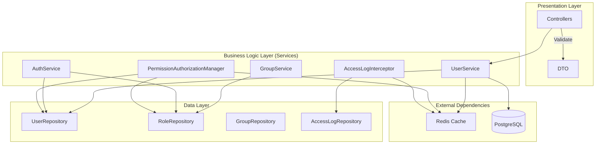
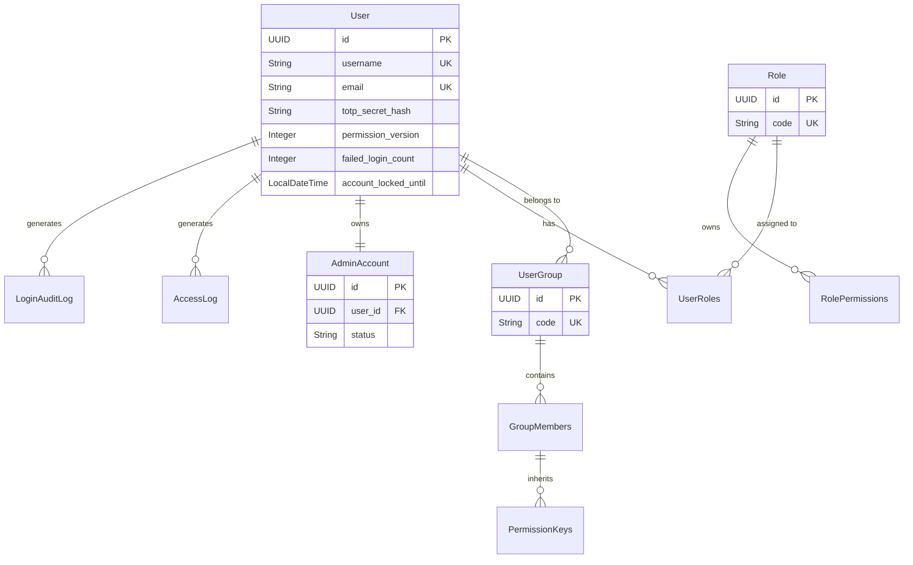

# SA Spec: Quản trị hệ thống (M-001)

## 1. Tổng quan kiến trúc (Architecture Overview)

Mô-đun M-001 được thiết kế theo kiến trúc **Service-Oriented** kết hợp **CQRS-lite** (cho AccessLog) trên nền tảng **Spring Boot**.
Hệ thống hoạt động chủ yếu dựa trên **Stateless API** (JWT) và **In-Memory/Redis Caching** để tối ưu hiệu năng cho các phép kiểm tra phân quyền (RBAC).

### Mục tiêu phi chức năng
1. **Hiệu năng (Performance):** Thời gian phản hồi cho các API RBAC phải < 50ms (sau khi cache hóa).
2. **Tính nhất quán (Consistency):** Quyền hạn được cập nhật phải có hiệu lực ngay lập tức hoặc qua cơ chế "Permission Drift" (JWT Invalidation).
3. **Bảo mật (Security):** Tuân thủ chuẩn xác thực 2FA (TOTP), Rate Limiting và Immutable Audit Logs.

---

## 2. Sơ đồ thành phần (Component Diagram)

---

## 3. Phân lớp kiến trúc (Layered Architecture)

| Layer | Thành phần chính | Nhiệm vụ |
|---|---|---|
| **Presentation** | `UserController`, `AuthController`, `GroupController` | Tiếp nhận request, validate input, trả về ApiResponse. |
| **Service** | `UserService`, `AuthService`, `GroupService`, `TotpAuthService` | Thực thi Business Rules (CRUD, Password Policy, Approval Workflow). |
| **Security** | `JwtAuthFilter`, `PermissionAuthorizationManager`, `TotpValidator` | Xác thực JWT, phân quyền (RBAC), xác thực MFA. |
| **Data Access** | `UserRepository`, `RoleRepository`, `GroupRepository` | Truy vấn DB, ánh xạ JPA. |
| **Logging** | `AccessLogInterceptor` (AOP), `AsyncLogAppender` | Ghi log bất đồng bộ vào DB (Immutability). |

---

## 4. Mô hình dữ liệu chính (Data Model)

Hệ thống sử dụng **Materialized Path** cho tổ chức (OrgUnit) và **Join Tables** chuẩn cho phân quyền.

---

## 5. Chiến lược bảo mật & Phân quyền (Security & RBAC)

### 5.1. Xác thực (Authentication Flow)
Hệ thống sử dụng **2-Phase MFA (TOTP)** để đảm bảo bảo mật cao nhất.

1. **Phase 1 (Login):** User gửi `username/password`. Server kiểm tra mật khẩu + Lockout Policy. Nếu đúng -> Trả về `MfaChallengeResponse`.
2. **Phase 2 (TOTP Verify):** User gửi mã TOTP 6 số. Server xác thực -> Sinh cặp `JWT Access Token` (ngắn hạn) + `Refresh Token` (dài hạn).

### 5.2. Phân quyền (Authorization Flow)
Sử dụng `@PreAuthorize` của Spring Security kết hợp với `PermissionAuthorizationManager` tùy chỉnh.

**Quy trình kiểm tra quyền:**
1. Extract `permission_code` từ annotation (ví dụ: `user:read`).
2. Tra cứu quyền trong Redis Cache (`user_perms:{user_id}`).
3. Nếu Cache Hit -> Kiểm tra sự tồn tại của `permission_code`.
4. Nếu Cache Miss -> Tính toán quyền từ DB (Role + Group + Override) -> Lưu vào Redis -> Kiểm tra.

**Permission Invalidation Strategy:**
- Khi `permission_version` thay đổi -> Invalide Redis Cache ngay lập tức.
- `JwtAuthFilter` so sánh `version` trong Token vs `version` trong DB -> Reject nếu khác.

### 5.3. Rate Limiting & Lockout
- **Login/Verify/Reset:** Áp dụng Redis Rate Limiter (ví dụ: 10 req/5 phút).
- **Lockout:** Khi `failed_login_count >= 5` -> Khóa tài khoản (`account_locked_until`) -> Không cho phép đăng nhập dù password đúng.

---

## 6. Chiến lược hiệu năng & Caching (Performance Strategy)

Để giảm tải cho cơ sở dữ liệu khi thực hiện phân quyền:

1. **Permission Cache:**
   - Key: `user_perms:{userId}`
   - Type: Set (String)
   - TTL: 5 phút (hoặc xóa ngay khi có thay đổi quyền).
2. **Permission Versioning:**
   - Trường `permission_version` trong bảng `app_users` là "nguồn sự thật" (Source of Truth) cho việc đồng bộ trạng thái quyền hạn.
3. **Async Logging (CQRS-lite):**
   - `AccessLog` được ghi bất đồng bộ thông qua `AsyncLogAppender`.
   - Không chặn thread xử lý chính khi ghi log.

---

## 7. Quy trình nghiệp vụ chính (Key Business Flows)

### 7.1. Tạo Admin Account (2-Step Workflow)
1. Tạo User mới trong `app_users` (Trạng thái: ACTIVE).
2. Tạo AdminAccount trong `admin_accounts` (Liên kết với `user_id` ở bước 1).
3. Gán `Role` tương ứng (ADMIN/SUPER_ADMIN/VIEWER).
4. Ghi `AdminAuditLog` để theo dõi hành động tạo.

### 7.2. Xử lý Permission Drift (Permission Versioning)
1. Admin thêm User vào Group mới.
2. Hệ thống: Tăng `permission_version` của User + Xóa cache Redis.
3. Request tiếp theo của User:
   - JWT cũ chứa `version` thấp -> Bị `JwtAuthFilter` Reject.
   - User phải đăng nhập lại -> Lấy JWT mới chứa `version` mới -> Cập nhật cache.

### 7.3. Quy trình AccessLog Immutability (BR-025)
1. Mọi request qua hệ thống -> `AccessLogInterceptor` ghi nhận metadata (IP, URL, Status, Time).
2. `AsyncLogAppender` ghi vào DB.
3. REST API chỉ cho phép `GET` (đọc) và `POST /export` (xuất file).
4. Các lệnh POST/PUT/DELETE trực tiếp trên API `/access-logs` sẽ bị trả về **403 Forbidden**.
