# Lean Spec: Quản lý tài sản Báo hiệu & Thông tin (M-004)

## Domain Glossary

### Entities

| Entity | Table | Description | Key Fields |
|--------|-------|-------------|------------|
| **BeaconLight** | `beacon_light` | Đèn biển — lighthouse, beacon light, beacon mark equipment (94 units) | code, name, type (BeaconLightType), latitude, longitude, lightRange, lightColor, lightCharacteristic, range, description, unitId, lastMaintenanceDate, nextMaintenanceDate, isActive |
| **Buoy** | `buoy` | Phao tiêu — cardinal, sector, special, safe water, isolated danger (1452 units) | code, name, type (BuoyType), latitude, longitude, color, shape, lightCharacteristic, range, description, unitId, lastInspectionDate, nextInspectionDate, isActive |
| **NhaTramPhao** | `nha_tram_phao` | Nhà trạm phao — buoy station buildings | extends BaseNhaTram, type (BuoyType), color, shape, lightCharacteristic, range, lastInspectionDate, nextInspectionDate |
| **NhaTramDen** | `nha_tram_den` | Nhà trạm đèn — beacon station buildings | extends BaseNhaTram, type (BeaconLightType), lightRange, lightColor, lightCharacteristic, range, lastMaintenanceDate, nextMaintenanceDate |
| **CoastalStationVTS** | `coastal_station_vts` | Đài Thông tin Duyên hải — VTS coastal communication stations | frequencyBand, transmitPower, equipmentType, locationAddress, contactPerson, contactPhone |
| **CoastalStationInmarsat** | `coastal_station_inmarsat` | Đài Inmarsat — satellite communication stations | deviceCode, modemType, frequency, coverageZone, sarCode |
| **CoastalStationCospasSarsat** | `coastal_station_cospas_sarsat` | Đài COSPAS-SARSAT — search and rescue satellite stations | frequency, coverageArea, beaconProtocol, emergencyChannel, antennaType, signalRange, operatingMode |
| **CoastalStationLRIT** | `coastal_station_lrit` | Đài LRIT — Long Range Identification and Tracking stations | terminalId, imoNumber, reportingInterval, antennaHeight, powerOutput, antennaType, dataFormat, communicationChannel, coverageArea |
| **CoastalStationHaiphong** | `coastal_station_haiphong` | Đài TT Hàng hải Hải Phòng — Haiphong Maritime Affairs stations | portName, district, ward, operationalLicense, licenseExpiry, inspectorName, inspectorPhone, lastInspectionDate, nextInspectionDate, coverageArea, equipmentType, communicationFrequency |

### Enums

| Enum | Values | Used By |
|------|--------|---------|
| **BeaconLightType** | LIGHTHOUSE, BEACON_LIGHT, BEACON_MARK | BeaconLight.type, NhaTramDen.type |
| **BuoyType** | CARDINAL, SECTOR, SPECIAL, SAFE_WATER, ISOLATED_DANGER | Buoy.type, NhaTramPhao.type |
| **BeaconStatus** | DRAFT, PENDING_APPROVAL, APPROVED_L1, APPROVED_L2, PUBLISHED, REJECTED, DELETED | BeaconLight.status, Buoy.status |
| **NhaTramStatus** | DRAFT, PENDING_APPROVAL, APPROVED_L1, APPROVED_L2, PUBLISHED, DELETED | NhaTramPhao.status, NhaTramDen.status |
| **StationStatus** | DRAFT, PENDING_APPROVAL, APPROVED_L1, APPROVED_L2, PUBLISHED, DELETED | All CoastalStation*.status |
| **BeaconApprovalStatus** | PENDING, APPROVED, REJECTED | BeaconLight.approvalStatus, Buoy.approvalStatus |
| **NhaTramApprovalStatus** | PENDING, APPROVED, REJECTED | NhaTramPhao.approvalStatus, NhaTramDen.approvalStatus |
| **StationApprovalStatus** | PENDING, APPROVED_L1, APPROVED_L2, REJECTED | All CoastalStation*.approvalStatus |
| **BeaconType** | BEACON_LIGHT, BUOY | BeaconHistory.beaconType (discriminator) |
| **NhaTramType** | PHAO, DEN | NhaTramHistory.tramType (discriminator) |

### History / Audit Structures

| Entity | Table | Key Fields | Actions |
|--------|-------|------------|---------|
| BeaconHistory | `beacon_history` | id, beaconType, entityId, actionType, changedField, previousValue, newValue, changedBy, changedAt, reason, diffData (JSON) | CREATE, UPDATE, APPROVE_L1, APPROVE_L2, REJECT, SOFT_DELETE |
| NhaTramHistory | `nha_tram_history` | id, tramType, entityId, actionType, changedField, previousValue, newValue, changedBy, changedAt, reason, diffData | CREATE, UPDATE, APPROVE_L1, APPROVE_L2, REJECT, SOFT_DELETE |
| Station history | Per-station service + `HistoryService` | entityId, actionType, changedBy, changedAt, details | CREATE, UPDATE, DELETE, APPROVE_L1, APPROVE_L2, REJECT |

## Entity-Relationship Diagram

```mermaid
classDiagram
    class BaseEntity {
        <<abstract>>
        +UUID id
        +LocalDateTime createdAt
        +LocalDateTime updatedAt
        +LocalDateTime deletedAt
        +String createdBy
        +String updatedBy
        +softDelete()
    }
    class BeaconLight {
        +String code
        +String name
        +BeaconLightType type
        +Double latitude
        +Double longitude
        +Double lightRange
        +String lightColor
        +String lightCharacteristic
        +Double range
        +String description
        +UUID unitId
        +LocalDate lastMaintenanceDate
        +LocalDate nextMaintenanceDate
        +Boolean isActive
        +BeaconStatus status
        +BeaconApprovalStatus approvalStatus
        +Integer approvalLevel
        +Long approvedBy
        +LocalDateTime approvedDate
        +String rejectionReason
    }
    class Buoy {
        +String code
        +String name
        +BuoyType type
        +Double latitude
        +Double longitude
        +String color
        +String shape
        +String lightCharacteristic
        +Double range
        +String description
        +UUID unitId
        +LocalDate lastInspectionDate
        +LocalDate nextInspectionDate
        +Boolean isActive
        +BeaconStatus status
        +BeaconApprovalStatus approvalStatus
        +Integer approvalLevel
        +Long approvedBy
        +LocalDateTime approvedDate
        +String rejectionReason
    }
    class BaseNhaTram {
        <<abstract>>
        +UUID id
        +String code
        +String name
        +Double latitude
        +Double longitude
        +String description
        +UUID unitId
        +Boolean isActive
        +NhaTramStatus status
        +NhaTramApprovalStatus approvalStatus
        +Integer approvalLevel
        +Long approvedBy
        +LocalDateTime approvedDate
        +String rejectionReason
        +LocalDateTime createdAt
        +LocalDateTime updatedAt
        +LocalDateTime deletedAt
        +softDelete()
    }
    class NhaTramPhao {
        +BuoyType type
        +String color
        +String shape
        +String lightCharacteristic
        +Double range
        +LocalDate lastInspectionDate
        +LocalDate nextInspectionDate
    }
    class NhaTramDen {
        +BeaconLightType type
        +Double lightRange
        +String lightColor
        +String lightCharacteristic
        +Double range
        +LocalDate lastMaintenanceDate
        +LocalDate nextMaintenanceDate
    }
    class BaseStation {
        <<abstract>>
        +UUID id
        +String code
        +String name
        +Double latitude
        +Double longitude
        +String description
        +UUID unitId
        +Boolean isActive
        +StationStatus status
        +StationApprovalStatus approvalStatus
        +Integer approvalLevel
        +Long approvedBy
        +LocalDateTime approvedDate
        +String rejectionReason
        +LocalDateTime createdAt
        +LocalDateTime updatedAt
        +LocalDateTime deletedAt
        +softDelete()
    }
    class CoastalStationVTS {
        +String frequencyBand
        +Double transmitPower
        +String equipmentType
        +String locationAddress
        +String contactPerson
        +String contactPhone
    }
    class CoastalStationInmarsat {
        +String deviceCode
        +String modemType
        +String frequency
        +String coverageZone
        +String sarCode
        +String locationAddress
        +String contactPerson
        +String contactPhone
    }
    class CoastalStationCospasSarsat {
        +String frequency
        +String coverageArea
        +String beaconProtocol
        +String emergencyChannel
        +String antennaType
        +String locationAddress
        +String contactPerson
        +String contactPhone
        +Double signalRange
        +String operatingMode
    }
    class CoastalStationLRIT {
        +String terminalId
        +String imoNumber
        +Integer reportingInterval
        +Double antennaHeight
        +Double powerOutput
        +String antennaType
        +String locationAddress
        +String contactPerson
        +String contactPhone
        +String dataFormat
        +String communicationChannel
        +String coverageArea
    }
    class CoastalStationHaiphong {
        +String portName
        +String district
        +String ward
        +String operationalLicense
        +String licenseExpiry
        +String inspectorName
        +String inspectorPhone
        +String lastInspectionDate
        +String nextInspectionDate
        +String coverageArea
        +String equipmentType
        +String communicationFrequency
        +String locationAddress
        +String contactPerson
        +String contactPhone
    }

    BaseEntity <|-- BeaconLight
    BaseEntity <|-- Buoy
    BaseNhaTram <|-- NhaTramPhao
    BaseNhaTram <|-- NhaTramDen
    BaseStation <|-- CoastalStationVTS
    BaseStation <|-- CoastalStationInmarsat
    BaseStation <|-- CoastalStationCospasSarsat
    BaseStation <|-- CoastalStationLRIT
    BaseStation <|-- CoastalStationHaiphong
```



## Cross-Cutting Concerns

### 1. Approval Workflow (2-Level)

All 9 entity groups follow a shared approval pipeline:

```
User Tạo mới (DRAFT/PENDING)
    → Gửi phê duyệt (PENDING_APPROVAL)
        → Phê duyệt L1 (APPROVED_L1)
            → Phê duyệt L2 (PUBLISHED)
Hoặc Từ chối (REJECTED) từ bất kỳ bước phê duyệt nào
```

**Approval flow details (from code):**
- **BeaconLight/Buoy**: Uses `BeaconStatus` (DRAFT → PENDING_APPROVAL → APPROVED_L1 → APPROVED_L2 → PUBLISHED) with `BeaconApprovalStatus` (PENDING → APPROVED → REJECTED). Endpoints: `/submit-approval`, `/approve-l1`, `/approve-l2`, `/reject`.
- **NhaTramPhao/NhaTramDen**: Uses `NhaTramStatus` with `NhaTramApprovalStatus`. Same 4 approval endpoints.
- **CoastalStation***: Uses `StationStatus` with `StationApprovalStatus` (PENDING → APPROVED_L1 → APPROVED_L2 → REJECTED). Endpoints: `/approve`, `/reject` with `LevelEnum` in request body.

### 2. Soft-Delete Pattern

All entities use `@SQLRestriction("deleted_at IS NULL")`. When deleted:
- `deletedAt` timestamp is set to current time
- Data remains in database but filtered from all queries
- BeaconLight/Buoy sync: associated `PointObject` in M-007 is hidden (not deleted)

### 3. GIS Integration (M-007)

`PointObjectSyncService` in beacon package syncs BeaconLight and Buoy to M-007 GIS `point_objects` table when approved to L2/PUBLISHED status. The sync maps:
- `code`, `name`, `longitude`, `latitude`, `description` → PointObject fields
- `BeaconLight` → `ObjectType.LIGHTHOUSE`, `Buoy` → `ObjectType.BUOY`
- Status → `PUBLISHED`, approval → `APPROVED`

### 4. Audit History

Every entity has a dedicated history entity recording:
- Action type (CREATE, UPDATE, APPROVE_L1, APPROVE_L2, REJECT, SOFT_DELETE/DELETE)
- Changed field, previous value, new value
- Who changed (changedBy), when (changedAt)
- Full diff data stored as JSON for complex changes

## Actor / Role Analysis

| Role | Permissions | Actions |
|------|-------------|---------|
| **admin** (Quản trị viên) | Full CRUD + approval | Create, Read, Update, Delete, Approve L1, Approve L2, Reject, View history |
| **operator** (Cán bộ nghiệp vụ) | CRUD + submit for approval | Create, Read, Update, Delete (own), Submit for approval, View history |
| **approver_L1** (Phê duyệt viên cấp 1) | Read + Approve L1 | View detail, Approve L1, Reject with reason |
| **approver_L2** (Phê duyệt viên cấp 2) | Read + Approve L2 | View detail, Approve L2, Reject with reason |
| **viewer** (Người xem) | Read-only | View detail, View history, Search/List |

## Business Rules (Module-Level)

| ID | Rule | Source | Applies To |
|----|------|--------|------------|
| BR-001 | Mã (code) phải là duy nhất, không được để trống, tối đa 50 ký tự | `@Column(unique=true)`, `@NotBlank`, `@Size(max=50)` | BeaconLight, Buoy, NhaTramPhao, NhaTramDen, all CoastalStation* |
| BR-002 | Tên (name) không được để trống, tối đa 200 ký tự | `@NotBlank`, `@Size(max=200)` | BeaconLight, Buoy, NhaTramPhao, NhaTramDen |
| BR-003 | Vĩ độ (latitude) phải trong khoảng -90.0 đến 90.0 | `@DecimalMin("-90.0")`, `@DecimalMax("90.0")` | BeaconLight, Buoy, NhaTramPhao, NhaTramDen, CoastalStationInmarsat |
| BR-004 | Kinh độ (longitude) phải trong khoảng -180.0 đến 180.0 | `@DecimalMin("-180.0")`, `@DecimalMax("180.0")` | BeaconLight, Buoy, NhaTramPhao, NhaTramDen, CoastalStationInmarsat |
| BR-005 | Tầm hiệu lực ánh sáng (lightRange) phải từ 0.01 đến 60.0 hải lý | `@DecimalMin("0.01")`, `@DecimalMax("60.0")` | BeaconLight, NhaTramDen |
| BR-006 | Tầm nhìn xa (range) phải từ 0.01 đến 100.0 hải lý | `@DecimalMin("0.01")`, `@DecimalMax("100.0")` | BeaconLight, Buoy, NhaTramPhao, NhaTramDen |
| BR-007 | Mô tả (description) tối đa 1000 ký tự | `@Size(max=1000)` | BeaconLight, Buoy, NhaTramPhao, NhaTramDen, all CoastalStation* |
| BR-008 | Mã code không thể thay đổi sau khi tạo (immutable) | Code comment in UpdateBeaconLightRequest | BeaconLight, Buoy, NhaTramPhao, NhaTramDen, all CoastalStation* |
| BR-009 | Không thể xóa vĩnh viễn — chỉ soft-delete (đặt deleted_at) | `softDelete()`, `@SQLRestriction` | All entities |
| BR-010 | Phê duyệt L1 yêu cầu entity ở trạng thái PENDING_APPROVAL | Service implementation | All entities |
| BR-011 | Phê duyệt L2 yêu cầu entity đã được phê duyệt L1 | Service implementation | All entities |
| BR-012 | Từ chối (reject) yêu cầu lý do từ chối (rejectionReason) | `@RequestParam String rejectReason` | All entities |
| BR-013 | Sau khi phê duyệt L2, BeaconLight/Buoy được đồng bộ lên GIS M-007 | PointObjectSyncService | BeaconLight, Buoy |
| BR-014 | Khi xóa BeaconLight/Buoy, điểm GIS tương ứng bị ẩn (không xóa) | PointObjectSyncService | BeaconLight, Buoy |
| BR-015 | Trạng thái khởi tạo mặc định là DRAFT (beacon/nhatram) hoặc PENDING_APPROVAL (stations) | `@Builder.Default status = DRAFT`, `setDefaultStatus()` | All entities |
| BR-016 | Màu sắc (color) tối đa 50 ký tự (Buoy, NhaTramPhao) | `@Size(max=50)` | Buoy, NhaTramPhao |
| BR-017 | Hình dáng (shape) tối đa 50 ký tự (Buoy, NhaTramPhao) | `@Size(max=50)` | Buoy, NhaTramPhao |
| BR-018 | Đặc tính ánh sáng (lightCharacteristic) tối đa 100 ký tự | `@Size(max=100)` | BeaconLight, Buoy, NhaTramPhao, NhaTramDen |
| BR-019 | Màu ánh sáng (lightColor) tối đa 50 ký tự | `@Size(max=50)` | BeaconLight, NhaTramDen |

## Feature Inventory (54 features)

### Đèn biển (BeaconLight) — F-068 to F-073

| Feature ID | Name | Endpoint | Controller Method |
|------------|------|----------|-------------------|
| F-068 | Quản lý Đèn biển - Tạo mới | POST /api/beacon-lights | create() |
| F-069 | Quản lý Đèn biển - Cập nhật | PUT /api/beacon-lights/{id} | update() |
| F-070 | Quản lý Đèn biển - Xóa | DELETE /api/beacon-lights/{id} | delete() |
| F-071 | Phê duyệt Đèn biển | POST /submit-approval, /approve-l1, /approve-l2, /reject | submitForApproval(), approveL1(), approveL2(), reject() |
| F-072 | Xem chi tiết Đèn biển | GET /api/beacon-lights/{id} | findById() |
| F-073 | Quản lý Đèn biển - Lịch sử | GET /api/beacon-history?type=BEACON_LIGHT | getHistory() |

### Phao tiêu (Buoy) — F-074 to F-079

| Feature ID | Name | Endpoint | Controller Method |
|------------|------|----------|-------------------|
| F-074 | Quản lý Phao tiêu - Tạo mới | POST /api/buoys | create() |
| F-075 | Quản lý Phao tiêu - Cập nhật | PUT /api/buoys/{id} | update() |
| F-076 | Quản lý Phao tiêu - Xóa | DELETE /api/buoys/{id} | delete() |
| F-077 | Phê duyệt Phao tiêu | POST /submit-approval, /approve-l1, /approve-l2, /reject | submitForApproval(), approveL1(), approveL2(), reject() |
| F-078 | Xem chi tiết Phao tiêu | GET /api/buoys/{id} | findById() |
| F-079 | Quản lý Phao tiêu - Lịch sử | GET /api/beacon-history?type=BUOY | getHistory() |

### Nhà trạm phao (NhaTramPhao) — F-080 to F-085

| Feature ID | Name | Endpoint | Controller Method |
|------------|------|----------|-------------------|
| F-080 | Quản lý Nhà trạm phao - Tạo mới | POST /api/v1/nhatram/phao | create() |
| F-081 | Quản lý Nhà trạm phao - Cập nhật | PUT /api/v1/nhatram/phao/{id} | update() |
| F-082 | Quản lý Nhà trạm phao - Xóa | DELETE /api/v1/nhatram/phao/{id} | delete() |
| F-083 | Phê duyệt Nhà trạm phao | POST /submit-approval, /approve-l1, /approve-l2, /reject | submitForApproval(), approveL1(), approveL2(), reject() |
| F-084 | Xem chi tiết Nhà trạm phao | GET /api/v1/nhatram/phao/{id} | findById() |
| F-085 | Quản lý Nhà trạm phao - Lịch sử | GET /api/v1/nhatram/history?type=PHAO | getHistory() |

### Nhà trạm đèn (NhaTramDen) — F-086 to F-091

| Feature ID | Name | Endpoint | Controller Method |
|------------|------|----------|-------------------|
| F-086 | Quản lý Nhà trạm đèn - Tạo mới | POST /api/v1/nhatram/den | create() |
| F-087 | Quản lý Nhà trạm đèn - Cập nhật | PUT /api/v1/nhatram/den/{id} | update() |
| F-088 | Quản lý Nhà trạm đèn - Xóa | DELETE /api/v1/nhatram/den/{id} | delete() |
| F-089 | Phê duyệt Nhà trạm đèn | POST /submit-approval, /approve-l1, /approve-l2, /reject | submitForApproval(), approveL1(), approveL2(), reject() |
| F-090 | Xem chi tiết Nhà trạm đèn | GET /api/v1/nhatram/den/{id} | findById() |
| F-091 | Quản lý Nhà trạm đèn - Lịch sử | GET /api/v1/nhatram/history?type=DEN | getHistory() |

### Đài TTDH (CoastalStationVTS) — F-092 to F-097

| Feature ID | Name | Endpoint | Controller Method |
|------------|------|----------|-------------------|
| F-092 | Quản lý Đài TTDH - Tạo mới | POST /api/v1/stations/coastal | createStation() |
| F-093 | Quản lý Đài TTDH - Cập nhật | PUT /api/v1/stations/coastal/{id} | updateStation() |
| F-094 | Quản lý Đài TTDH - Xóa | DELETE /api/v1/stations/coastal/{id} | deleteStation() |
| F-095 | Phê duyệt Đài TTDH | POST /approve, /reject | approveStation(), rejectStation() |
| F-096 | Xem chi tiết Đài TTDH | GET /api/v1/stations/coastal/{id} | getStationById() |
| F-097 | Quản lý Đài TTDH - Lịch sử | GET /api/v1/stations/coastal/{id}/history | getHistory() |

### Đài Inmarsat (CoastalStationInmarsat) — F-098 to F-103

| Feature ID | Name | Endpoint | Controller Method |
|------------|------|----------|-------------------|
| F-098 | Quản lý Đài Inmarsat - Tạo mới | POST /api/v1/stations/inmarsat | createStation() |
| F-099 | Quản lý Đài Inmarsat - Cập nhật | PUT /api/v1/stations/inmarsat/{id} | updateStation() |
| F-100 | Quản lý Đài Inmarsat - Xóa | DELETE /api/v1/stations/inmarsat/{id} | deleteStation() |
| F-101 | Phê duyệt Đài Inmarsat | POST /approve, /reject | approveStation(), rejectStation() |
| F-102 | Xem chi tiết Đài Inmarsat | GET /api/v1/stations/inmarsat/{id} | getStationById() |
| F-103 | Quản lý Đài Inmarsat - Lịch sử | GET /api/v1/stations/inmarsat/{id}/history | getHistory() |

### Đài COSPAS-SARSAT (CoastalStationCospasSarsat) — F-104 to F-109

| Feature ID | Name | Endpoint | Controller Method |
|------------|------|----------|-------------------|
| F-104 | Quản lý Đài COSPAS-SARSAT - Tạo mới | POST /api/v1/stations/cospas-sarsat/create | createStation() |
| F-105 | Quản lý Đài COSPAS-SARSAT - Cập nhật | PUT /api/v1/stations/cospas-sarsat/{id} | updateStation() |
| F-106 | Quản lý Đài COSPAS-SARSAT - Xóa | DELETE /api/v1/stations/cospas-sarsat/{id} | deleteStation() |
| F-107 | Phê duyệt Đài COSPAS-SARSAT | POST /approve, /reject | approveStation(), rejectStation() |
| F-108 | Xem chi tiết Đài COSPAS-SARSAT | GET /api/v1/stations/cospas-sarsat/{id} | getStationById() |
| F-109 | Quản lý Đài COSPAS-SARSAT - Lịch sử | GET /api/v1/stations/cospas-sarsat/{id}/history | getHistory() |

### Đài LRIT (CoastalStationLRIT) — F-110 to F-115

| Feature ID | Name | Endpoint | Controller Method |
|------------|------|----------|-------------------|
| F-110 | Quản lý Đài LRIT - Tạo mới | POST /api/v1/stations/lrit/create | createStation() |
| F-111 | Quản lý Đài LRIT - Cập nhật | PUT /api/v1/stations/lrit/{id} | updateStation() |
| F-112 | Quản lý Đài LRIT - Xóa | DELETE /api/v1/stations/lrit/{id} | deleteStation() |
| F-113 | Phê duyệt Đài LRIT | POST /approve, /reject | approveStation(), rejectStation() |
| F-114 | Xem chi tiết Đài LRIT | GET /api/v1/stations/lrit/{id} | getStationById() |
| F-115 | Quản lý Đài LRIT - Lịch sử | GET /api/v1/stations/lrit/{id}/history | getHistory() |

### Đài TT Hàng hải HN (CoastalStationHaiphong) — F-116 to F-121

| Feature ID | Name | Endpoint | Controller Method |
|------------|------|----------|-------------------|
| F-116 | Quản lý Đài TT Hàng hải HN - Tạo mới | POST /api/v1/stations/haiphong/create | createStation() |
| F-117 | Quản lý Đài TT Hàng hải HN - Cập nhật | PUT /api/v1/stations/haiphong/{id} | updateStation() |
| F-118 | Quản lý Đài TT Hàng hải HN - Xóa | DELETE /api/v1/stations/haiphong/{id} | deleteStation() |
| F-119 | Phê duyệt Đài TT Hàng hải HN | POST /approve, /reject | approveStation(), rejectStation() |
| F-120 | Xem chi tiết Đài TT Hàng hải HN | GET /api/v1/stations/haiphong/{id} | getStationById() |
| F-121 | Quản lý Đài TT Hàng hải HN - Lịch sử | GET /api/v1/stations/haiphong/{id}/history | getHistory() |

## Pipeline Triage

| Question | Answer | Rationale |
|----------|--------|-----------|
| Q1: Creates new domain elements? | **Yes** — 9 entity groups with 3 distinct inheritance hierarchies | Entities defined in `beacon`, `nhatram`, `station` packages with separate repositories and services |
| Q2: Affects system architecture? | **No** — all entities follow shared BaseEntity/BaseNhaTram/BaseStation patterns within a single bounded context | Architecture is well-defined with standard controller → service → repository pattern |
| Q3: Approach clear from existing architecture? | **Yes** — each entity group replicates the same CRUD + approval + history pattern | Clear template from BeaconLightController's 9 endpoints pattern |

**Triage Verdict**: Route to `engineering-technical-lead` after Phase 2 (domain model written). The 6-endpoint CRUD + approval pattern is fully established and repeatable across all 9 entity groups.
