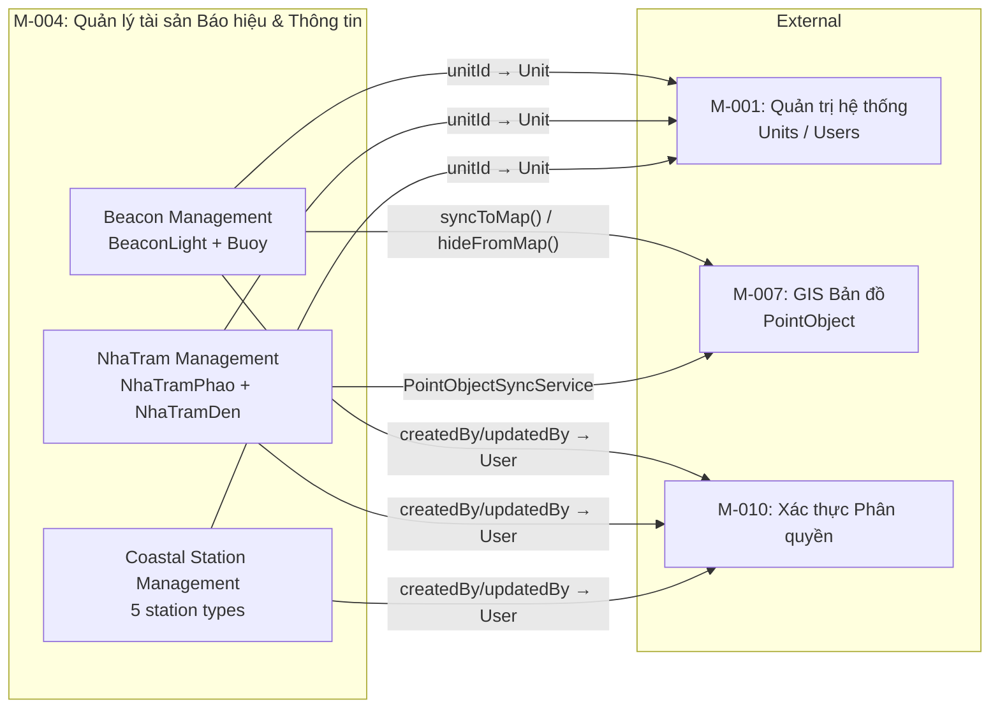

# Domain Model: Quản lý tài sản Báo hiệu & Thông tin (M-004)

## Bounded Contexts

| Context | Description | Packages |
|---------|-------------|----------|
| **Beacon Management** | Quản lý đèn biển (BeaconLight) và phao tiêu (Buoy) - tài sản báo hiệu hàng hải | `beacon.entity`, `beacon.service`, `beacon.controller`, `beacon.repository`, `beacon.dto` |
| **NhaTram Management** | Quản lý nhà trạm phao (NhaTramPhao) và nhà trạm đèn (NhaTramDen) - cơ sở hạ tầng nhà trạm | `nhatram.entity`, `nhatram.service`, `nhatram.controller`, `nhatram.repository`, `nhatram.dto` |
| **Coastal Station Management** | Quản lý 5 loại đài thông tin duyên hải: VTS, Inmarsat, COSPAS-SARSAT, LRIT, Hải Phòng | `station.entity`, `station.service`, `station.controller`, `station.repository`, `station.dto` |
| **GIS Integration** | Đồng bộ tài sản báo hiệu lên bản đồ GIS (module M-007) | `beacon.service.PointObjectSyncService` (beacon), `nhatram.service.PointObjectSyncService` (nhatram) |

## Aggregates

### Aggregate: BeaconLight (Root)

**Root Entity:** BeaconLight

| Field | Type | Constraints |
|-------|------|-------------|
| code | String | @NotBlank, @Size(max=50), unique |
| name | String | @NotBlank, @Size(max=200) |
| type | BeaconLightType (enum) | @NotNull — LIGHTHOUSE/BEACON_LIGHT/BEACON_MARK |
| latitude | Double | @NotNull, @DecimalMin(-90.0), @DecimalMax(90.0) |
| longitude | Double | @NotNull, @DecimalMin(-180.0), @DecimalMax(180.0) |
| lightRange | Double | @NotNull, @DecimalMin(0.01), @DecimalMax(60.0) |
| lightColor | String | @Size(max=50) |
| lightCharacteristic | String | @Size(max=100) |
| range | Double | @DecimalMin(0.01), @DecimalMax(100.0) |
| unitId | UUID | Đơn vị quản lý |
| lastMaintenanceDate | LocalDate | |
| nextMaintenanceDate | LocalDate | |
| isActive | Boolean | Default: true |
| status | BeaconStatus (enum) | Default: DRAFT |
| approvalStatus | BeaconApprovalStatus (enum) | Default: PENDING |
| approvalLevel | Integer | |
| approvedBy | Long | |
| approvedDate | LocalDateTime | |
| rejectionReason | String | @Size(max=500) |

**Base entity fields (from BaseEntity):** id (UUID), createdAt, updatedAt, deletedAt, createdBy, updatedBy

### Aggregate: Buoy (Root)

**Root Entity:** Buoy

| Field | Type | Constraints |
|-------|------|-------------|
| code | String | @NotBlank, @Size(max=50), unique |
| name | String | @NotBlank, @Size(max=200) |
| type | BuoyType (enum) | @NotNull — CARDINAL/SECTOR/SPECIAL/SAFE_WATER/ISOLATED_DANGER |
| latitude | Double | @NotNull, @DecimalMin(-90.0), @DecimalMax(90.0) |
| longitude | Double | @NotNull, @DecimalMin(-180.0), @DecimalMax(180.0) |
| color | String | @Size(max=50) |
| shape | String | @Size(max=50) |
| lightCharacteristic | String | @Size(max=100) |
| range | Double | @NotNull, @DecimalMin(0.01), @DecimalMax(100.0) |
| unitId | UUID | |
| lastInspectionDate | LocalDate | |
| nextInspectionDate | LocalDate | |
| isActive | Boolean | Default: true |
| status | BeaconStatus (enum) | Default: DRAFT |
| approvalStatus | BeaconApprovalStatus (enum) | Default: PENDING |
| approvalLevel | Integer | |
| approvedBy | Long | |
| approvedDate | LocalDateTime | |
| rejectionReason | String | @Size(max=500) |

### Aggregate: NhaTramPhao (Root)

**Root Entity:** NhaTramPhao (extends BaseNhaTram)

| Field | Type | Constraints |
|-------|------|-------------|
| code | String | |
| name | String | |
| type | BuoyType (enum) | CARDINAL/SECTOR/SPECIAL/SAFE_WATER/ISOLATED_DANGER |
| latitude | Double | |
| longitude | Double | |
| color | String | |
| shape | String | |
| lightCharacteristic | String | |
| range | Double | |
| isActive | Boolean | |
| status | NhaTramStatus (enum) | |
| approvalStatus | NhaTramApprovalStatus (enum) | |

**Base entity fields (from BaseNhaTram):** id (UUID), description, unitId, approvalLevel, approvedBy, approvedDate, rejectionReason, createdAt, updatedAt, deletedAt

### Aggregate: NhaTramDen (Root)

**Root Entity:** NhaTramDen (extends BaseNhaTram)

| Field | Type | Constraints |
|-------|------|-------------|
| code | String | |
| name | String | |
| type | BeaconLightType (enum) | LIGHTHOUSE/BEACON_LIGHT/BEACON_MARK |
| latitude | Double | |
| longitude | Double | |
| lightRange | Double | |
| lightColor | String | |
| lightCharacteristic | String | |
| range | Double | |
| isActive | Boolean | |
| status | NhaTramStatus (enum) | |
| approvalStatus | NhaTramApprovalStatus (enum) | |

### Aggregate: CoastalStationVTS (Root)

**Root Entity:** CoastalStationVTS (extends BaseStation)

| Field | Type | Notes |
|-------|------|-------|
| frequencyBand | String | Dải tần hoạt động |
| transmitPower | Double | Công suất phát |
| equipmentType | String | Loại thiết bị |
| locationAddress | String | Địa chỉ |
| contactPerson | String | Người liên hệ |
| contactPhone | String | Số điện thoại |

**Base entity fields (from BaseStation):** id (UUID), code, name, latitude, longitude, description, unitId, isActive, status (StationStatus), approvalStatus (StationApprovalStatus), approvalLevel, approvedBy, approvedDate, rejectionReason, createdAt, updatedAt, deletedAt

### Aggregate: CoastalStationInmarsat (Root)

**Root Entity:** CoastalStationInmarsat (extends BaseStation)

| Field | Type | Notes |
|-------|------|-------|
| deviceCode | String | Mã thiết bị |
| modemType | String | Loại modem |
| frequency | String | Tần số |
| coverageZone | String | Vùng phủ sóng |
| sarCode | String | Mã SAR |
| locationAddress | String | |
| contactPerson | String | |
| contactPhone | String | |

### Aggregate: CoastalStationCospasSarsat (Root)

**Root Entity:** CoastalStationCospasSarsat (extends BaseStation)

| Field | Type | Notes |
|-------|------|-------|
| frequency | String | Tần số |
| coverageArea | String | Vùng phủ |
| beaconProtocol | String | Giao thức beacon |
| emergencyChannel | String | Kênh khẩn cấp |
| antennaType | String | Loại anten |
| signalRange | Double | Tầm tín hiệu |
| operatingMode | String | Chế độ hoạt động |
| locationAddress | String | |
| contactPerson | String | |
| contactPhone | String | |

### Aggregate: CoastalStationLRIT (Root)

**Root Entity:** CoastalStationLRIT (extends BaseStation)

| Field | Type | Notes |
|-------|------|-------|
| terminalId | String | Mã terminal LRIT |
| imoNumber | String | Số IMO |
| reportingInterval | Integer | Khoảng thời gian báo cáo (phút) |
| antennaHeight | Double | Chiều cao anten |
| powerOutput | Double | Công suất phát |
| antennaType | String | Loại anten |
| dataFormat | String | Định dạng dữ liệu |
| communicationChannel | String | Kênh truyền thông |
| coverageArea | String | Vùng phủ |
| locationAddress | String | |
| contactPerson | String | |
| contactPhone | String | |

### Aggregate: CoastalStationHaiphong (Root)

**Root Entity:** CoastalStationHaiphong (extends BaseStation)

| Field | Type | Notes |
|-------|------|-------|
| portName | String | Tên cảng |
| district | String | Quận/huyện |
| ward | String | Phường/xã |
| operationalLicense | String | Giấy phép hoạt động |
| licenseExpiry | String | Ngày hết hạn giấy phép |
| inspectorName | String | Tên thanh tra viên |
| inspectorPhone | String | SĐT thanh tra viên |
| lastInspectionDate | String | Ngày kiểm tra gần nhất |
| nextInspectionDate | String | Ngày kiểm tra tiếp theo |
| coverageArea | String | Vùng phủ sóng |
| equipmentType | String | Loại thiết bị |
| communicationFrequency | String | Tần số liên lạc |
| locationAddress | String | |
| contactPerson | String | |
| contactPhone | String | |

## Domain Events

| Event | Producer | Description | Action Type |
|-------|----------|-------------|-------------|
| BeaconLightCreated | BeaconLightService | Đèn biển được tạo mới | BeaconHistory.CREATE |
| BeaconLightUpdated | BeaconLightService | Đèn biển được cập nhật | BeaconHistory.UPDATE |
| BeaconLightSoftDeleted | BeaconLightService | Đèn biển bị xóa mềm | BeaconHistory.SOFT_DELETE |
| BeaconLightApprovedL1 | BeaconLightService | Đèn biển được duyệt cấp 1 | BeaconHistory.APPROVE_L1 |
| BeaconLightApprovedL2 | BeaconLightService | Đèn biển được duyệt cấp 2 + sync GIS | BeaconHistory.APPROVE_L2 |
| BeaconLightRejected | BeaconLightService | Đèn biển bị từ chối phê duyệt | BeaconHistory.REJECT |
| BuoyCreated | BuoyService | Phao tiêu được tạo mới | BeaconHistory.CREATE |
| BuoyUpdated | BuoyService | Phao tiêu được cập nhật | BeaconHistory.UPDATE |
| BuoySoftDeleted | BuoyService | Phao tiêu bị xóa mềm | BeaconHistory.SOFT_DELETE |
| BuoyApprovedL1 | BuoyService | Phao tiêu được duyệt cấp 1 | BeaconHistory.APPROVE_L1 |
| BuoyApprovedL2 | BuoyService | Phao tiêu được duyệt cấp 2 + sync GIS | BeaconHistory.APPROVE_L2 |
| BuoyRejected | BuoyService | Phao tiêu bị từ chối | BeaconHistory.REJECT |
| NhaTramPhaoCreated | NhaTramPhaoService | Nhà trạm phao được tạo | NhaTramHistory.CREATE |
| NhaTramDenCreated | NhaTramDenService | Nhà trạm đèn được tạo | NhaTramHistory.CREATE |
| NhaTramUpdated | NhaTramService | Nhà trạm được cập nhật | NhaTramHistory.UPDATE |
| NhaTramSoftDeleted | NhaTramService | Nhà trạm bị xóa mềm | NhaTramHistory.SOFT_DELETE |
| NhaTramApprovedL1 | NhaTramService | Nhà trạm được duyệt cấp 1 | NhaTramHistory.APPROVE_L1 |
| NhaTramApprovedL2 | NhaTramService | Nhà trạm được duyệt cấp 2 | NhaTramHistory.APPROVE_L2 |
| NhaTramRejected | NhaTramService | Nhà trạm bị từ chối | NhaTramHistory.REJECT |
| StationCreated | *StationService | Đài thông tin được tạo | StationHistory.CREATE |
| StationUpdated | *StationService | Đài thông tin được cập nhật | StationHistory.UPDATE |
| StationDeleted | *StationService | Đài thông tin bị xóa mềm | StationHistory.DELETE |
| StationApprovedL1 | *StationService | Đài duyệt cấp 1 | StationHistory.APPROVE_L1 |
| StationApprovedL2 | *StationService | Đài duyệt cấp 2 | StationHistory.APPROVE_L2 |
| StationRejected | *StationService | Đài bị từ chối | StationHistory.REJECT |
| PointObjectSynced | PointObjectSyncService | Tài sản được đồng bộ vào GIS | Pointsync event |

## Commands

| Command | Handler | Preconditions | Postconditions |
|---------|---------|---------------|----------------|
| CreateBeaconLight | BeaconLightService.create() | Code unique, validation pass | Entity created, history CREATE recorded |
| UpdateBeaconLight | BeaconLightService.update() | Entity exists, not soft-deleted | Entity updated, history UPDATE recorded |
| DeleteBeaconLight | BeaconLightService.delete() | Entity exists, not soft-deleted | Entity soft-deleted, history SOFT_DELETE, GIS hidden |
| SubmitBeaconLight | BeaconLightService.submitForApproval() | Status=DRAFT | Status=PENDING_APPROVAL |
| ApproveL1BeaconLight | BeaconLightService.approveL1() | Status=PENDING_APPROVAL | Status=APPROVED_L1, history APPROVE_L1 |
| ApproveL2BeaconLight | BeaconLightService.approveL2() | Status=APPROVED_L1 | Status=PUBLISHED, GIS sync, history APPROVE_L2 |
| RejectBeaconLight | BeaconLightService.reject() | Status in approval flow | Status=REJECTED, rejectionReason set |
| CreateBuoy | BuoyService.create() | Code unique, validation pass | Entity created, history CREATE |
| UpdateBuoy | BuoyService.update() | Entity exists | Entity updated, history UPDATE |
| DeleteBuoy | BuoyService.delete() | Entity exists | Soft-deleted, GIS hidden |
| ApproveBuoy | BuoyService.approveL1/L2 | Proper status | Status advanced, GIS sync on L2 |
| (*same pattern for all 9 entity groups*) | | | |

## Context Map

## Data Ownership

| Schema / Table | Owner | Description |
|----------------|-------|-------------|
| `beacon_light` | Beacon Management | Đèn biển |
| `buoy` | Beacon Management | Phao tiêu |
| `beacon_history` | Beacon Management | Lịch sử đèn biển & phao tiêu |
| `nha_tram_phao` | NhaTram Management | Nhà trạm phao |
| `nha_tram_den` | NhaTram Management | Nhà trạm đèn |
| `nha_tram_history` | NhaTram Management | Lịch sử nhà trạm |
| `coastal_station_vts` | Coastal Station Management | Đài TTDH VTS |
| `coastal_station_inmarsat` | Coastal Station Management | Đài Inmarsat |
| `coastal_station_cospas_sarsat` | Coastal Station Management | Đài COSPAS-SARSAT |
| `coastal_station_lrit` | Coastal Station Management | Đài LRIT |
| `coastal_station_haiphong` | Coastal Station Management | Đài TT Hàng hải HN |
| `station_history` | Coastal Station Management | Lịch sử đài thông tin |

## Ubiquitous Language

| Thuật ngữ | English | Định nghĩa |
|-----------|---------|-----------|
| Đèn biển | BeaconLight | Thiết bị báo hiệu hàng hải dạng đèn (hải đăng, đèn báo, cọc tiêu) |
| Phao tiêu | Buoy | Thiết bị báo hiệu hàng hải dạng phao nổi |
| Nhà trạm phao | NhaTramPhao | Nhà trạm quản lý và vận hành phao tiêu |
| Nhà trạm đèn | NhaTramDen | Nhà trạm quản lý và vận hành đèn biển |
| Đài TTDH | CoastalStationVTS | Đài Thông tin Duyên hải (Vessel Traffic Service) |
| Đài Inmarsat | CoastalStationInmarsat | Đài thông tin vệ tinh Inmarsat |
| Đài COSPAS-SARSAT | CoastalStationCospasSarsat | Đài thông tin vệ tinh cứu hộ COSPAS-SARSAT |
| Đài LRIT | CoastalStationLRIT | Đài định vị và theo dõi tầm xa |
| Đài TT Hàng hải HN | CoastalStationHaiphong | Đài Thông tin Hàng hải Hải Phòng |
| Mã tài sản | Code | Mã định danh duy nhất của tài sản (unique) |
| Duyệt cấp 1 | Approve L1 | Phê duyệt cấp 1 do phê duyệt viên cấp 1 thực hiện |
| Duyệt cấp 2 | Approve L2 | Phê duyệt cấp 2 (cuối cùng) do phê duyệt viên cấp 2 thực hiện |
| Công bố | PUBLISHED | Trạng thái tài sản đã được duyệt và chính thức hoạt động |
| Nháp | DRAFT | Trạng thái tài sản đang được soạn thảo, chưa gửi duyệt |
| Tầm hiệu lực ánh sáng | LightRange | Khoảng cách tối đa ánh sáng có thể quan sát (hải lý) |
| Đặc tính ánh sáng | LightCharacteristic | Đặc điểm nhận dạng ánh sáng (chớp, liên tục, nhóm chớp...) |
| Đơn vị quản lý | Unit | Đơn vị (phòng/ban) chịu trách nhiệm quản lý tài sản |
| Xóa mềm | Soft Delete | Đánh dấu xóa bằng cách đặt thời gian xóa (deletedAt) |
| Đồng bộ GIS | GIS Sync | Đồng bộ dữ liệu tài sản lên bản đồ GIS (M-007) |
