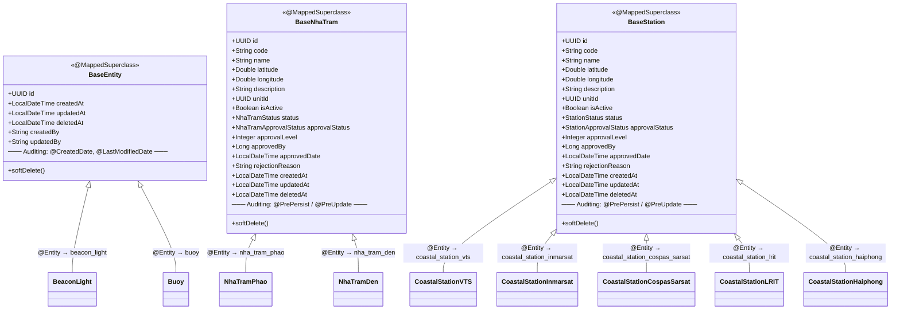
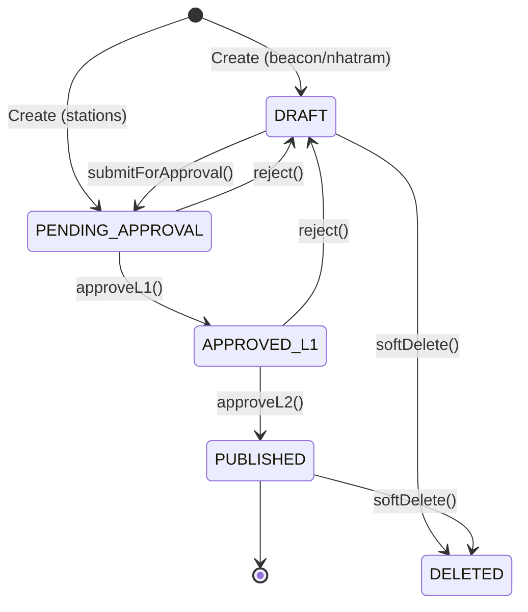
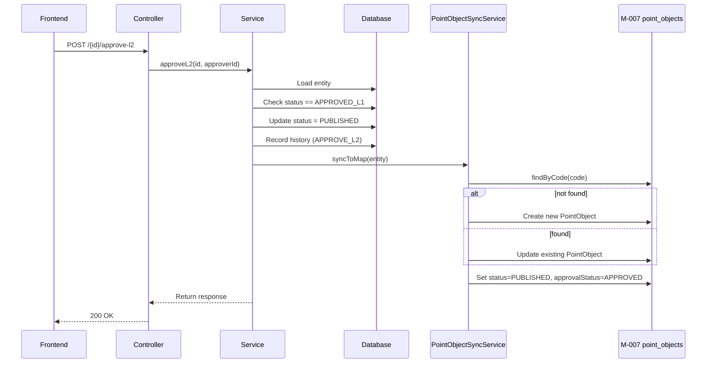

# Lean Architecture: M-004 Quản lý tài sản Báo hiệu & Thông tin

- **Module**: M-004
- **Domain**: Báo hiệu hàng hải (Đèn biển, Phao tiêu, Nhà trạm, Đài thông tin duyên hải)
- **Tech Stack**: Spring Boot 3.x, JPA/Hibernate, PostgreSQL, Flyway, Ant Design (frontend)
- **Last Updated**: 2026-07-08

---

## 1. Package Structure

Module M-004 spans three top-level backend packages plus one frontend directory tree. Each backend package owns its own layer sub-packages.

### 1.1 Backend Packages

```
com.hanghai.kchtg
├── beacon/                              # Đèn biển & Phao tiêu (beacon & buoy assets)
│   ├── controller/
│   │   ├── BeaconLightController.java   # F-068 to F-072
│   │   └── BuoyController.java          # F-074 to F-078
│   ├── service/
│   │   ├── BeaconLightService.java      # CRUD + 2-level approval
│   │   ├── BuoyService.java             # CRUD + 2-level approval
│   │   ├── BeaconHistoryService.java    # History query
│   │   ├── PointObjectSyncService.java  # M-007 GIS sync (beacon types)
│   │   └── NotificationService.java     # Approval notification
│   ├── repository/
│   │   ├── BeaconLightRepository.java
│   │   ├── BuoyRepository.java
│   │   └── BeaconHistoryRepository.java
│   ├── entity/
│   │   ├── BeaconLight.java             # @Entity → beacon_light
│   │   ├── Buoy.java                    # @Entity → buoy
│   │   ├── BeaconHistory.java           # @Entity → beacon_history
│   │   ├── BeaconLightType.java         # enum: LIGHTHOUSE, BEACON_LIGHT, BEACON_MARK
│   │   ├── BuoyType.java               # enum: CARDINAL, SECTOR, SPECIAL, SAFE_WATER, ISOLATED_DANGER
│   │   ├── BeaconStatus.java            # shared lifecycle: DRAFT→...→PUBLISHED, REJECTED, DELETED
│   │   ├── BeaconApprovalStatus.java    # PENDING, APPROVED, REJECTED
│   │   ├── BeaconType.java             # discriminator: BEACON_LIGHT, BUOY
│   │   └── BeaconHistoryActionType.java # CREATE, UPDATE, APPROVE_L1, APPROVE_L2, REJECT, SOFT_DELETE
│   └── dto/
│       ├── beacon_light/
│       │   ├── CreateBeaconLightRequest.java
│       │   ├── UpdateBeaconLightRequest.java
│       │   └── BeaconLightResponse.java
│       ├── buoy/
│       │   ├── CreateBuoyRequest.java
│       │   ├── UpdateBuoyRequest.java
│       │   └── BuoyResponse.java
│       └── history/
│           └── BeaconHistoryResponse.java
│
├── nhatram/                             # Nhà trạm phao & nhà trạm đèn (station buildings)
│   ├── controller/
│   │   ├── NhaTramPhaoController.java   # F-080 to F-085
│   │   ├── NhaTramDenController.java    # F-086 to F-091
│   │   └── NhaTramHistoryController.java
│   ├── service/
│   │   ├── NhaTramPhaoService.java      # CRUD + 2-level approval
│   │   ├── NhaTramDenService.java       # CRUD + 2-level approval
│   │   ├── NhaTramHistoryService.java
│   │   ├── PointObjectSyncService.java  # M-007 GIS sync (nhatram types) - named "nhatramPointObjectSyncService"
│   │   └── NotificationService.java
│   ├── repository/
│   │   ├── NhaTramPhaoRepository.java
│   │   ├── NhaTramDenRepository.java
│   │   └── NhaTramHistoryRepository.java
│   ├── entity/
│   │   ├── BaseNhaTram.java             # @MappedSuperclass
│   │   ├── NhaTramPhao.java             # @Entity → nha_tram_phao
│   │   ├── NhaTramDen.java              # @Entity → nha_tram_den
│   │   ├── NhaTramHistory.java          # @Entity → nha_tram_history
│   │   ├── NhaTramStatus.java           # enum: DRAFT, PENDING_APPROVAL, APPROVED_L1, APPROVED_L2, PUBLISHED, DELETED
│   │   ├── NhaTramApprovalStatus.java   # PENDING, APPROVED, REJECTED
│   │   ├── NhaTramType.java             # PHAO, DEN
│   │   ├── NhaTramHistoryActionType.java
│   │   ├── BuoyType.java                # (mirror of beacon's BuoyType)
│   │   └── BeaconLightType.java         # (mirror of beacon's BeaconLightType)
│   └── dto/
│       ├── phao/
│       │   ├── CreateNhaTramPhaoRequest.java
│       │   ├── UpdateNhaTramPhaoRequest.java
│       │   └── NhaTramPhaoResponse.java
│       ├── den/
│       │   ├── CreateNhaTramDenRequest.java
│       │   ├── UpdateNhaTramDenRequest.java
│       │   └── NhaTramDenResponse.java
│       └── history/
│           ├── NhaTramHistoryResponse.java
│           └── NhaTramHistoryQuery.java
│
├── station/                             # Đài thông tin duyên hải (5 types)
│   ├── controller/
│   │   ├── CoastalStationVTSController.java       # F-092 to F-097
│   │   ├── CoastalStationInmarsatController.java  # F-098 to F-103
│   │   ├── CoastalStationCospasSarsatController.java # F-104 to F-109
│   │   ├── CoastalStationLRITController.java      # F-110 to F-115
│   │   └── CoastalStationHaiphongController.java  # F-116 to F-121
│   ├── service/
│   │   ├── CoastalStationVTSService.java
│   │   ├── CoastalStationInmarsatService.java
│   │   ├── CoastalStationCospasSarsatService.java
│   │   ├── CoastalStationLRITService.java
│   │   ├── CoastalStationHaiphongService.java
│   │   └── HistoryService.java           # In-memory history store (Wave 1)
│   ├── repository/
│   │   └── (per-type JpaRepository)
│   ├── entity/
│   │   ├── BaseStation.java              # @MappedSuperclass
│   │   ├── CoastalStationVTS.java        # @Entity → coastal_station_vts
│   │   ├── CoastalStationInmarsat.java   # @Entity → coastal_station_inmarsat
│   │   ├── CoastalStationCospasSarsat.java # @Entity → coastal_station_cospas_sarsat
│   │   ├── CoastalStationLRIT.java       # @Entity → coastal_station_lrit
│   │   ├── CoastalStationHaiphong.java   # @Entity → coastal_station_haiphong
│   │   ├── StationStatus.java            # enum: DRAFT, PENDING_APPROVAL, APPROVED_L1, APPROVED_L2, PUBLISHED, DELETED
│   │   ├── StationApprovalStatus.java    # PENDING, APPROVED_L1, APPROVED_L2, REJECTED
│   │   └── StationHistoryActionType.java # enum
│   └── dto/
│       ├── coastal/
│       ├── inmarsat/
│       ├── cospas/
│       ├── lrit/
│       └── haiphong/           (each has Request, UpdateRequest, Response DTOs)
│
├── common/                                # Shared infrastructure
│   ├── entity/
│   │   └── BaseEntity.java               # @MappedSuperclass (UUID, createdAt, updatedAt, deletedAt)
│   ├── dto/
│   │   └── ApiResponse.java              # Generic {success, message, data, timestamp} envelope
│   ├── exception/
│   │   └── (GlobalExceptionHandler, etc.)
│   ├── scheduler/
│   └── util/
│
└── gis/                                   # M-007 GIS subsystem (integration target)
    └── point/
        ├── entity/
        │   ├── PointObject.java           # @Entity → point_objects
        │   └── ...
        └── repository/
            └── PointObjectRepository.java
```

### 1.2 Frontend Packages

```
frontend/src/
├── pages/
│   ├── nhatram/
│   │   ├── NhaTramPhaoList.tsx    # Danh sách nhà trạm phao
│   │   └── NhaTramDenList.tsx     # Danh sách nhà trạm đèn
│   ├── station/
│   │   ├── CoastalStationList.tsx  # Đài duyên hải VTS
│   │   └── SpecialStationList.tsx  # Đài Inmarsat / COSPAS-SARSAT / LRIT / Hải Phòng
│   └── history/
│       └── BeaconHistoryList.tsx   # Lịch sử thay đổi
├── services/
│   ├── nhatram/
│   │   ├── api.ts                  # HTTP calls for nhatram endpoints
│   │   └── types.ts                # TypeScript interfaces
│   └── station/
│       ├── api.ts                  # HTTP calls for station endpoints
│       └── types.ts                # TypeScript interfaces
```

---

## 2. Layer Architecture

Every backend domain (beacon, nhatram, station) follows a strict Controller → Service → Repository → Entity pattern.

### 2.1 Layered Stack

```
┌──────────────────────────────────────────┐
│              Controller                    │  @RestController, @RequestMapping
│  - Maps HTTP verbs to service methods     │  - Returns ResponseEntity<ApiResponse<T>>
│  - Validation via @Valid on @RequestBody  │
├──────────────────────────────────────────┤
│                Service                     │  @Service, @Transactional(readOnly = true)
│  - Business logic & validation            │  - Orchestrates approval workflow
│  - Maps entity ↔ response DTO            │  - Calls PointObjectSyncService, NotificationService
│  - Records history via HistoryRepo       │
├──────────────────────────────────────────┤
│              Repository                    │  JpaRepository<Entity, UUID>
│  - Spring Data JPA auto-implemented      │  - Custom @Query methods for filtered search
│  - Built-in soft-delete via @SQLRestriction│
├──────────────────────────────────────────┤
│                Entity                      │  @Entity, @Table, @SQLRestriction
│  - JPA mapping to PostgreSQL tables      │  - Extends BaseEntity / BaseNhaTram / BaseStation
│  - Lombok @Getter/@Setter/@Builder       │
└──────────────────────────────────────────┘
```

### 2.2 Standard Endpoint Pattern

Every entity group exposes 9 endpoints following this exact pattern:

| Method | Endpoint | Purpose | Controller Method |
|--------|----------|---------|-------------------|
| GET | / | List all active entities | `findAll()` |
| GET | /{id} | Get by ID | `findById()` / `getById()` |
| GET | /search | Filtered search | `search()` |
| POST | / | Create | `create()` |
| PUT | /{id} | Update | `update()` |
| DELETE | /{id} | Soft delete | `delete()` |
| POST | /{id}/submit-approval | Submit for approval | `submitForApproval()` |
| POST | /{id}/approve-l1 | Level 1 approval | `approveL1()` |
| POST | /{id}/approve-l2 | Level 2 approval | `approveL2()` |
| POST | /{id}/reject | Reject with reason | `reject()` |

**Station controllers** collapse approve-l1/approve-l2 into a single `/approve` endpoint with a `LevelEnum` in the request body.

### 2.3 ApiResponse Envelope

All beacon and nhatram controllers wrap responses in a common envelope:

```json
{
  "success": true,
  "message": "Tạo đèn biển thành công",
  "data": { ... },
  "timestamp": "2026-07-08T10:30:00"
}
```

**Exception**: Station controllers return the entity/DTO directly (not wrapped). This is a discrepancy that should be addressed.

### 2.4 Request/Response DTO Pattern

- **CreateRequest**: Contains all writable fields + an optional `action` field (`"draft"` or `"submit"`) that determines initial status.
- **UpdateRequest**: Contains only mutable fields (code is immutable after creation).
- **Response**: Contains all readable fields plus `unitName` (resolved from OrgUnit) and audit timestamps.
- **No entity exposed directly**: Controllers never return or accept entity objects in beacon/nhatram. Station controllers are inconsistent here — some return `CoastalStationVTS` directly.

---

## 3. Inheritance Hierarchy

Module M-004 has **three independent inheritance hierarchies**. Each uses a different base class with different auditing strategies.

### 3.1 Hierarchy Overview



### 3.2 BaseEntity (common chain)

- **Package**: `com.hanghai.kchtg.common.entity`
- **Annotations**: `@MappedSuperclass`, `@EntityListeners(AuditingEntityListener.class)`, `@SQLRestriction("deleted_at IS NULL")`
- **ID strategy**: `@GeneratedValue(strategy = GenerationType.UUID)` — Hibernate 6 native UUID generation (no `@GenericGenerator`)
- **Auditing**: Uses Spring Data JPA `@CreatedDate` / `@LastModifiedDate` → requires `@EnableJpaAuditing` on the application class
- **Soft-delete**: `deletedAt` field + `softDelete()` method
- **Extras**: `createdBy`, `updatedBy` (String, not resolved from security context in Wave 1)
- **Used by**: `BeaconLight`, `Buoy`

### 3.3 BaseNhaTram (nhatram chain)

- **Package**: `com.hanghai.kchtg.nhatram.entity`
- **Annotations**: `@MappedSuperclass`, `@SQLRestriction("deleted_at IS NULL")`, `@SuperBuilder`
- **ID strategy**: Same UUID strategy
- **Auditing**: Manual `@PrePersist` / `@PreUpdate` lifecycle callbacks — does **not** use Spring Data auditing
- **Missing fields vs BaseEntity**: Does **not** have `createdBy` / `updatedBy`
- **Additional fields vs BaseEntity**: code, name, latitude, longitude, description, unitId, isActive, status, approvalStatus, approvalLevel, approvedBy, approvedDate, rejectionReason
- **Used by**: `NhaTramPhao`, `NhaTramDen`

### 3.4 BaseStation (station chain)

- **Package**: `com.hanghai.kchtg.station.entity`
- **Annotations**: `@MappedSuperclass`, `@SQLRestriction("deleted_at IS NULL")`, `@Accessors(chain = true)`
- **ID strategy**: Same UUID strategy
- **Auditing**: Manual `@PrePersist` / `@PreUpdate` lifecycle callbacks
- **Fields**: Identical structure to BaseNhaTram
- **Stations set default status to `PENDING_APPROVAL`** (not DRAFT) via `@PrePersist` override
- **Used by**: All 5 CoastalStation* entities

### 3.5 Design Inconsistency

The three base classes have **duplicated field definitions** rather than sharing a common ancestor. This is acceptable for a bounded context boundary, but note:
- `BaseNhaTram` and `BaseStation` are structurally identical but in different packages
- `BaseEntity` uses Spring Data auditing; the other two use manual `@PrePersist`
- Enums are duplicated: `BeaconLightType` and `BuoyType` exist in both `beacon.entity` and `nhatram.entity` packages with identical definitions

### 3.6 History Entities (standalone, no inheritance)

History entities do **not** extend any base class — they must remain queryable even for soft-deleted entities:

- `BeaconHistory` — standalone `@Entity`, no `@SQLRestriction`, uses `@Builder`
- `NhaTramHistory` — standalone `@Entity`, no `@SQLRestriction`, uses `@Builder`
- Station history — in-memory `HistoryService` (Wave 1), will migrate to DB table in Wave 3

---

## 4. Cross-cutting Patterns

### 4.1 Two-Level Approval Workflow

All 9 entity groups share a consistent approval pipeline, though with minor variations:



**Variation by domain:**

| Aspect | Beacon | NhaTram | Station |
|--------|--------|---------|---------|
| Status enum | `BeaconStatus` (7 values: includes REJECTED) | `NhaTramStatus` (6 values: no REJECTED) | `StationStatus` (6 values: no REJECTED) |
| Approval status | `BeaconApprovalStatus`: PENDING, APPROVED, REJECTED | `NhaTramApprovalStatus`: PENDING, APPROVED, REJECTED | `StationApprovalStatus`: PENDING, APPROVED_L1, APPROVED_L2, REJECTED |
| Approve endpoint | Separate: `/approve-l1`, `/approve-l2` | Same as beacon | Single: `/approve` with `LevelEnum` |
| Default status on create | DRAFT (via `@Builder.Default`) | DRAFT (via `@Builder.Default`) | PENDING_APPROVAL (via `@PrePersist`) |
| Self-approval guard | Blocks creator from approving own L1 | Blocks creator from approving own L1 | Not implemented |
| GIS sync on L2 | Yes → `PointObjectSyncService.syncToMap()` | Yes → `PointObjectSyncService.syncToMapDen()`/`syncToMapPhao()` | No GIS sync |

**Validation rules across all domains:**
- Reject requires `rejectionReason` ≥ 10 characters
- Approval L1 requires entity in `PENDING_APPROVAL` status
- Approval L2 requires entity in `APPROVED_L1` status
- Approved entities cannot be deleted (soft-delete only)
- Deleting an entity that is in the approval process throws `IllegalStateException`

### 4.2 Soft-Delete Pattern

Every data entity carries `@SQLRestriction("deleted_at IS NULL")`:

```java
// In BaseEntity, BaseNhaTram, BaseStation
protected LocalDateTime deletedAt;

public void softDelete() {
    this.deletedAt = LocalDateTime.now();
}
```

- **Deleted entities remain in the database** but are filtered from all JPA queries
- **Code field uniqueness constraint** (`@Column(unique = true)`) may prevent re-creating with the same code after soft-delete
- **Beacon/Buoy soft-delete triggers** `PointObjectSyncService.hideFromMap()` — sets GIS point status to `DELETED` (not actually removed)
- **History is preserved**: History entities have no `@SQLRestriction` so they remain queryable

### 4.3 Audit History

**Beacon history** (`beacon_history` table):
- Shared for both `BeaconLight` and `Buoy`, discriminated by `beacon_type` field
- Uses `@JdbcTypeCode(SqlTypes.JSON)` for `diff_data` column (JSON storage for complex diffs)
- Calculates actual field-level diffs using Jackson JsonNode comparison
- Records: `changedField`, `previousValue`, `newValue` (full JSON snapshots)

**NhaTram history** (`nha_tram_history` table):
- Shared for both `NhaTramPhao` and `NhaTramDen`, discriminated by `tram_type` field
- Same structure as BeaconHistory but stores `diffData` as plain TEXT
- Uses manual `@PrePersist` for timestamps (no Spring Data auditing)

**Station history** (in-memory, Wave 1):
- `HistoryService` stores entries in an `ArrayList` (volatile — lost on restart)
- Uses simple `stationCode` lookup string
- Will be migrated to a proper database table in Wave 3

### 4.4 Notification Service

Each domain (beacon, nhatram) has a local `NotificationService` called during:
- Submit for approval → `sendApprovalNotification()`
- Level 1 approval → `sendL2ApprovalNotification()`
- Rejection → `sendRejectionNotification()`

In Wave 1 these are stubs; Wave 2 will integrate with real notification channels.

---

## 5. API Design

### 5.1 Base URL Mapping

| Domain | Base Path | Prefix Convention |
|--------|-----------|-------------------|
| Đèn biển | `/api/beacon-lights` | No version prefix |
| Phao tiêu | `/api/buoys` | No version prefix |
| Nhà trạm phao | `/api/v1/nhatram/phao` | v1 version prefix |
| Nhà trạm đèn | `/api/v1/nhatram/den` | v1 version prefix |
| Lịch sử nhà trạm | `/api/v1/nhatram/history` | v1 version prefix |
| Đài duyên hải VTS | `/api/v1/stations/coastal` | v1 version prefix |
| Đài Inmarsat | `/api/v1/stations/inmarsat` | v1 version prefix |
| Đài COSPAS-SARSAT | `/api/v1/stations/cospas-sarsat` | v1 version prefix |
| Đài LRIT | `/api/v1/stations/lrit` | v1 version prefix |
| Đài Hải Phòng | `/api/v1/stations/haiphong` | v1 version prefix |
| Lịch sử đài | `/api/v1/stations/{type}/{id}/history` | v1 version prefix |

**API inconsistency**: Beacon endpoints use `/api/beacon-lights` and `/api/buoys` (no `/api/v1/` prefix), while nhatram and station endpoints use `/api/v1/`. This should be unified in a future wave.

### 5.2 Request DTOs

Beacon/nhatram DTOs carry `jakarta.validation` constraints matching entity-level rules:

```java
// CreateBeaconLightRequest
@NotBlank @Size(max = 50) String code;
@NotBlank @Size(max = 200) String name;
@NotNull BeaconLightType type;
@NotNull @DecimalMin("-90.0") @DecimalMax("90.0") Double latitude;
@NotNull @DecimalMin("-180.0") @DecimalMax("180.0") Double longitude;
@NotNull @DecimalMin("0.01") @DecimalMax("60.0") Double lightRange;
@Builder.Default String action = "draft"; // "draft" | "submit"
```

Station DTOs are simpler (plain POJOs with @Getter/@Setter, no validation annotations on the DTO itself — validation is handled in the service).

### 5.3 Response DTOs

Beacon/nhatram responses include resolved display fields:

```java
// BeaconLightResponse
UUID id, String code, String name, BeaconLightType type,
Double latitude, Double longitude, Double lightRange,
String lightColor, String lightCharacteristic, Double range,
String description, UUID unitId, String unitName,  // unitName resolved from OrgUnit
LocalDate lastMaintenanceDate, LocalDate nextMaintenanceDate,
Boolean isActive,
BeaconStatus status, BeaconApprovalStatus approvalStatus,
Integer approvalLevel, Long approvedBy, LocalDateTime approvedDate,
String rejectionReason,
LocalDateTime createdAt, LocalDateTime updatedAt
```

### 5.4 Approval Endpoint Differences

**Beacon / NhaTram** (4 endpoints):

| Endpoint | Method | Params |
|----------|--------|--------|
| `/{id}/submit-approval` | POST | path: id |
| `/{id}/approve-l1` | POST | path: id, query: approverId |
| `/{id}/approve-l2` | POST | path: id, query: approverId |
| `/{id}/reject` | POST | path: id, query: rejectReason, approverId |

**Station** (2 endpoints):

| Endpoint | Method | Body |
|----------|--------|------|
| `/{id}/approve` | POST | `{ "approved": boolean, "rejectionReason": string }` |
| `/{id}/reject` | POST | `{ "approved": boolean, "rejectionReason": string }` |

Station endpoint collapses both L1 and L2 into a single `/approve` endpoint — the service increments `approvalLevel` based on current state (`0→1→2`).

---

## 6. Database

### 6.1 Entity Tables

| Table | Entity | Parent | Primary Domain | Key Constraints |
|-------|--------|--------|----------------|-----------------|
| `beacon_light` | `BeaconLight` | BaseEntity | Đèn biển | code UNIQUE, lat/lng range |
| `buoy` | `Buoy` | BaseEntity | Phao tiêu | code UNIQUE, lat/lng range |
| `nha_tram_phao` | `NhaTramPhao` | BaseNhaTram | Nhà trạm phao | code UNIQUE |
| `nha_tram_den` | `NhaTramDen` | BaseNhaTram | Nhà trạm đèn | code UNIQUE |
| `coastal_station_vts` | `CoastalStationVTS` | BaseStation | Đài TTDH | code UNIQUE |
| `coastal_station_inmarsat` | `CoastalStationInmarsat` | BaseStation | Đài Inmarsat | code UNIQUE |
| `coastal_station_cospas_sarsat` | `CoastalStationCospasSarsat` | BaseStation | Đài COSPAS-SARSAT | code UNIQUE |
| `coastal_station_lrit` | `CoastalStationLRIT` | BaseStation | Đài LRIT | code UNIQUE |
| `coastal_station_haiphong` | `CoastalStationHaiphong` | BaseStation | Đài Hải Phòng | code UNIQUE |

### 6.2 History Tables

| Table | Entity | Source Domain | Records |
|-------|--------|--------------|---------|
| `beacon_history` | `BeaconHistory` | Beacon + Buoy | CREATE, UPDATE, APPROVE_L1, APPROVE_L2, REJECT, SOFT_DELETE |
| `nha_tram_history` | `NhaTramHistory` | NhaTramPhao + NhaTramDen | Same 6 action types |
| (in-memory) | — | CoastalStation* | CREATE, UPDATE, DELETE, APPROVE_L1, APPROVE_L2, REJECT |

### 6.3 Column Naming Conventions

- `snake_case` for all table and column names (defined via `@Table(name = ...)` and `@Column(name = ...)`)
- `code` — business identifier (short text, unique, immutable after creation)
- `created_at`, `updated_at`, `deleted_at` — audit timestamps
- `is_active` — boolean active flag (not `active`)
- `unit_id` — foreign key to organization unit (UUID, no FK constraint in JPA)
- All floating-point coordinate fields stored as `Double`

### 6.4 @SQLRestriction Mechanism

All data entities are annotated with `@SQLRestriction("deleted_at IS NULL")`, which Hibernate appends as `WHERE deleted_at IS NULL` to all queries and lazy-loading operations. This is a compile-time filter — direct native queries and `@Query(nativeQuery = true)` methods must add the filter manually.

### 6.5 Flyway Migrations

This module currently has **no dedicated Flyway migrations**. The database tables for beacon, nhatram, and station entities are created via Hibernate `ddl-auto` (or were created externally). The existing Flyway migrations (V1–V31) cover other modules (auth, org units, GIS, ports, cảng biển). Adding M-004-specific Flyway scripts is deferred to a future wave.

---

## 7. Integration Points

### 7.1 GIS Synchronization with M-007

Module M-004 integrates with **M-007 (GIS Point Objects)** through the `PointObjectSyncService`. There are two independent instances, one per domain:

#### Beacon Domain Integration

**Class**: `com.hanghai.kchtg.beacon.service.PointObjectSyncService`
**Bean name**: `beaconPointObjectSyncService`
**Target**: `point_objects` table via `PointObjectRepository`

**Trigger points in `BeaconLightService`:**
- `approveL2()` → calls `syncToMap(entity)` — upserts a PointObject with `ObjectType.LIGHTHOUSE`
- `delete()` → calls `hideFromMap(entity)` — sets PointObject status to `DELETED`

**Trigger points in `BuoyService`:**
- `approveL2()` → calls `syncToMapBuoy(entity)` — upserts a PointObject with `ObjectType.BUOY`
- `delete()` → calls `hideFromMapBuoy(entity)` — sets PointObject status to `DELETED`

#### NhaTram Domain Integration

**Class**: `com.hanghai.kchtg.nhatram.service.PointObjectSyncService`
**Bean name**: `nhatramPointObjectSyncService`
**Target**: Same `point_objects` table via `PointObjectRepository`

**Trigger points in `NhaTramDenService`:**
- `approveL2()` → calls `syncToMapDen(entity)` — upserts with `ObjectType.LIGHTHOUSE`
- `delete()` → calls `hideFromMapDen(entity)` 

**Trigger points in `NhaTramPhaoService`:**
- `approveL2()` → calls `syncToMapPhao(entity)` — upserts with `ObjectType.BUOY`
- `delete()` → calls `hideFromMapPhao(entity)`

#### Mapping Rules

| Source Entity | ObjectType | PointObject Fields Mapped |
|--------------|------------|--------------------------|
| `BeaconLight` | `LIGHTHOUSE` | code, name, longitude, latitude, description, unitId, approvedBy, approvedDate |
| `Buoy` | `BUOY` | Same as above |
| `NhaTramDen` | `LIGHTHOUSE` | Same as above |
| `NhaTramPhao` | `BUOY` | Same as above |

After sync, the PointObject has: `status = PUBLISHED`, `approvalStatus = APPROVED`.

### 7.2 Integration Flow Diagram



### 7.3 Station Domain — No GIS Integration

CoastalStation entities (VTS, Inmarsat, COSPAS-SARSAT, LRIT, Hải Phòng) do **not** sync to GIS. They are communication stations with no visual point representation on the maritime map.

---

## 8. Frontend Integration

### 8.1 Frontend Architecture

The frontend is a React/TypeScript SPA using Ant Design components. Module M-004 has dedicated page components and service modules:

### 8.2 Page Components

| Page | File | Backend API |
|------|------|-------------|
| NhaTramPhaoList | `pages/nhatram/NhaTramPhaoList.tsx` | `/api/v1/nhatram/phao` |
| NhaTramDenList | `pages/nhatram/NhaTramDenList.tsx` | `/api/v1/nhatram/den` |
| CoastalStationList | `pages/station/CoastalStationList.tsx` | `/api/v1/stations/coastal` |
| SpecialStationList | `pages/station/SpecialStationList.tsx` | `/api/v1/stations/inmarsat` |
| BeaconHistoryList | `pages/history/BeaconHistoryList.tsx` | `/api/beacon-history` |

### 8.3 Service Modules

### `services/nhatram/api.ts`
- `fetchNhaTramDenList(params)` — GET with pagination + filters
- `fetchNhaTramDenById(id)` — GET single
- `createNhaTramDen(payload)` — POST
- `updateNhaTramDen(id, payload)` — PUT
- `deleteNhaTramDen(id)` — DELETE
- `fetchNhaTramPhaoList(params)` — same pattern
- `fetchNhaTramPhaoById(id)`, `createNhaTramPhao`, `updateNhaTramPhao`, `deleteNhaTramPhao`

### `services/nhatram/types.ts`
- `CreateNhaTramDenRequest` / `NhaTramDenResponse`
- `CreateNhaTramPhaoRequest` / `NhaTramPhaoResponse`
- `PageResponse<T>` (generic wrapper)

### `services/station/api.ts`
- `fetchCoastalVTSList(params)` — search with `keyword`
- `fetchCoastalVTSById(id)`, `createCoastalVTS`, `updateCoastalVTS`, `deleteCoastalVTS`
- `fetchInmarsatList(params)`, `fetchInmarsatById(id)`, `createInmarsat`, `updateInmarsat`, `deleteInmarsat`

### `services/station/types.ts`
- `CoastalStationVTSRequest` / `CoastalStationVTSResponse`
- `CoastalStationInmarsatRequest` / `CoastalStationInmarsatResponse`
- `PageResponse<T>`

### 8.4 Frontend-Backend Mapping Notes

**Pagination handling**: Backend endpoints return flat lists (not Spring Data `Page`). The frontend service layer wraps them into a `PageResponse<T>` shape with `totalElements`, `totalPages`, `size`, `number`, and `content` — all computed client-side from the flat array.

**Field name mapping**: There is a naming divergence between frontend DTOs and backend entities:
- Frontend `stationCode` → Backend `code` (CoastalStation)
- Frontend `stationName` → Backend `name` (CoastalStation)
- Frontend `deviceCode` → Backend `code` (Inmarsat)

The frontend API module normalizes these with `.map()` calls.

**Response envelope handling**: 
- Nhatram services unwrap `res.data.data` (ApiResponse envelope)
- Station services use `res.data` directly (no ApiResponse wrapper)

### 8.5 Missing Frontend Pages

The following backend entity groups have **no dedicated frontend pages** yet:
- `BeaconLight` management (backend `/api/beacon-lights`)
- `Buoy` management (backend `/api/buoys`)
- `CoastalStationCospasSarsat`, `CoastalStationLRIT`, `CoastalStationHaiphong` — only CoastalStationList and SpecialStationList exist

---

## Appendix A: Enum Summary

| Enum | Values | Package | Used By |
|------|--------|---------|---------|
| `BeaconLightType` | LIGHTHOUSE, BEACON_LIGHT, BEACON_MARK | beacon.entity (mirrored in nhatram.entity) | BeaconLight.type, NhaTramDen.type |
| `BuoyType` | CARDINAL, SECTOR, SPECIAL, SAFE_WATER, ISOLATED_DANGER | beacon.entity (mirrored in nhatram.entity) | Buoy.type, NhaTramPhao.type |
| `BeaconStatus` | DRAFT, PENDING_APPROVAL, APPROVED_L1, APPROVED_L2, PUBLISHED, REJECTED, DELETED | beacon.entity | BeaconLight.status, Buoy.status |
| `NhaTramStatus` | DRAFT, PENDING_APPROVAL, APPROVED_L1, APPROVED_L2, PUBLISHED, DELETED | nhatram.entity | NhaTramPhao.status, NhaTramDen.status |
| `StationStatus` | DRAFT, PENDING_APPROVAL, APPROVED_L1, APPROVED_L2, PUBLISHED, DELETED | station.entity | All CoastalStation*.status |
| `BeaconApprovalStatus` | PENDING, APPROVED, REJECTED | beacon.entity | BeaconLight/Buoy.approvalStatus |
| `NhaTramApprovalStatus` | PENDING, APPROVED, REJECTED | nhatram.entity | NhaTramPhao/Den.approvalStatus |
| `StationApprovalStatus` | PENDING, APPROVED_L1, APPROVED_L2, REJECTED | station.entity | All CoastalStation*.approvalStatus |
| `BeaconType` | BEACON_LIGHT, BUOY | beacon.entity | BeaconHistory.beaconType |
| `NhaTramType` | PHAO, DEN | nhatram.entity | NhaTramHistory.tramType |

## Appendix B: Business Rules (from code)

Refer to BA spec section "Business Rules" (BR-001 through BR-019) for the complete rule set with entity-level `@Column`/`@Valid` constraints.
