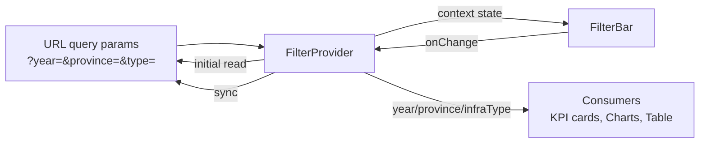

# Lean Spec: Thanh bộ lọc Dashboard (F-280)

## Summary

The Dashboard Filter Bar is a horizontal control strip at the top of the Dashboard page. It acts as the **single source of truth** for all downstream data — KPIs, charts, tables, and map. It provides three dropdowns (Year, Province, Infrastructure Type) and a last-updated timestamp. Filter state is synced to URL query params so pages are shareable and survive refresh.

## Actors

| Actor | Role |
|---|---|
| **Dashboard User** | Views the dashboard; selects year/province/infra-type to filter all data blocks. No special permissions required — the filter bar is visible to all authenticated users. |

## Functional Requirements

| ID | Requirement | Priority (MoSCoW) | Source |
|---|---|---|---|
| FR-01 | Bar displays full-width below the page header, with `surfacePage` (#F8F9FA) background and `radiusLg` (12px) corners | Must-have | feature-brief AC1 |
| FR-02 | Year dropdown defaults to 2026; options = [2020..2026] (hardcoded static list) | Must-have | AC2 |
| FR-03 | Province dropdown includes "Tất cả" + 6 provinces (hardcoded static list); selecting "Tất cả" sets `province=null` | Must-have | AC3 |
| FR-04 | Infrastructure-type dropdown includes "Tất cả" + 7 types (hardcoded static list); selecting "Tất cả" sets `infraType=null` | Must-have | AC4 |
| FR-05 | Timestamp "Cập nhật lúc {HH:mm}" displayed at the right edge, using `metaStyle` tokens | Must-have | AC5 |
| FR-06 | Any dropdown change updates all dashboard blocks immediately (refetch/recalc driven by `FilterContext`) | Must-have | AC7 |
| FR-07 | Responsive wrapping: `flexWrap: 'wrap'` on the container; dropdowns wrap on narrow screens | Must-have | AC8 |
| FR-08 | Dropdowns use Ant Design `<Select size="small">` with fixed widths (100/180/170px) | Must-have | Code inspection |
| FR-09 | Filter icon (`FilterOutlined`) + "Bộ lọc" label precedes the dropdowns | Should-have | Code inspection |
| FR-10 | Error/retry state: not implemented in current code (all data is static mock — feature-brief AC10 is aspirational, not delivered) | Won't-have (v1) | AC10 (deferred) |

## Data Flow

**Flow steps:**
1. **Mount:** `FilterProvider` reads `?year`, `?province`, `?type` from URL via `useSearchParams()`. Missing params fall back to defaults (year=2026, province=null, infraType=null).
2. **Rendering:** `FilterBar` consumes `FilterContext` via `useFilter()` hook — displays current values in three `<Select>` dropdowns.
3. **User action:** Dropdown `onChange` calls `setYear`/`setProvince`/`setInfraType` which update context state + set `lastUpdated` to current time.
4. **URL sync:** A `useEffect` watches `[year, province, infraType]` and calls `setSearchParams(…, { replace: true })`. Non-default year is omitted from URL (clean URLs).
5. **Consumers re-render:** All child components (`KpiCard`, `TrendChartCard`, table, map) consuming `useFilter()` re-render with new filter values.

## States

| State | Behaviour | Evidence in code |
|---|---|---|
| **Normal** | 3 dropdowns with selected values + timestamp right-aligned. Background `surfacePage`, radius `radiusLg` (12px). | FilterBar.tsx lines 41–86 |
| **Loading (dropdown data)** | Static hardcoded arrays (`YEAR_OPTIONS`, `PROVINCE_OPTIONS`, `INFRA_TYPE_OPTIONS`) — no async loading in v1. No loading spinner shown. | FilterBar.tsx lines 10–30 |
| **Empty** | `province=null` or `infraType=null` display as "Tất cả" in the dropdown, pass `null` to context consumers. | FilterBar.tsx lines 60, 66 |
| **Error / Retry** | **Not implemented.** AC10 (error state with retry button) is deferred — no `catch`/`retry` UI exists. Current code has no API calls to fail. | Deferred |
| **URL restore** | On fresh page load, `readFromUrl()` parses URL params; only `year` is persisted as non-default URL param. | FilterContext.tsx lines 21–30 |

## Token Compliance Summary

All visual tokens used in `FilterBar.tsx` are imported from `tokens.ts` — zero hardcoded hex/px values:

| Element | Token(s) used | Token role |
|---|---|---|
| Container background | `surfacePage` | Surface — page background |
| Container border-radius | `radiusLg` | Radius — 12px |
| Container padding | `spaceSm` + `spaceMd` | Spacing — 8px + 12px |
| Container flex gap | `spaceSm` (8px) | Spacing |
| Filter icon color | `textSecondary` | Text — description/metadata |
| Filter icon font-size | `fontSizeLg` | Font — 15px |
| "Bộ lọc" label color | `textSecondary` | Text |
| "Bộ lọc" label font-size | `fontSizeMd` | Font — 13px |
| Timestamp icon color | `textTertiary` | Text — lowest hierarchy |
| Timestamp icon font-size | `fontSizeSm` | Font — 11px (meta) |
| Timestamp text color | `textTertiary` | Text |
| Timestamp text font-size | `fontSizeSm` | Font — 11px |
| Margin bottom | `spaceLg` (16px) | Spacing |

**Accent budget:** FilterBar uses 0 `actionPrimary` occurrences — no accent budget consumed.

## Dependencies

| Module / Component | Dependency type | Purpose |
|---|---|---|
| `M-022` (Trang chủ Dashboard) | Parent module | FilterBar is embedded in `Home.tsx` |
| `FilterProvider` (`FilterContext.tsx`) | Required | Provides filter state to all consumers |
| `react-router-dom` (`useSearchParams`) | Library | URL query param sync |
| `antd` (`Select`) | Library | Dropdown UI components |
| `@ant-design/icons` (`FilterOutlined`, `ClockCircleOutlined`) | Library | Icons |
| `tokens.ts` | Design system | All visual tokens |

## Pipeline Triage

| Question | Answer | Rationale |
|---|---|---|
| Q1: Creates new domain elements? | No | FilterBar is purely UI — no new entities, aggregates, or domain events |
| Q2: Affects system architecture? | No | FilterBar fits within existing `FilterProvider` → `FilterBar` → `Home.tsx` pattern; no new architectural layers |
| Q3: Approach clear from existing architecture? | Yes | Pattern is already built and working — standard React Context + URL sync |
| **Triage verdict** | → `engineering-technical-lead` | Feature is purely frontend UI, no domain/architectural change needed |
