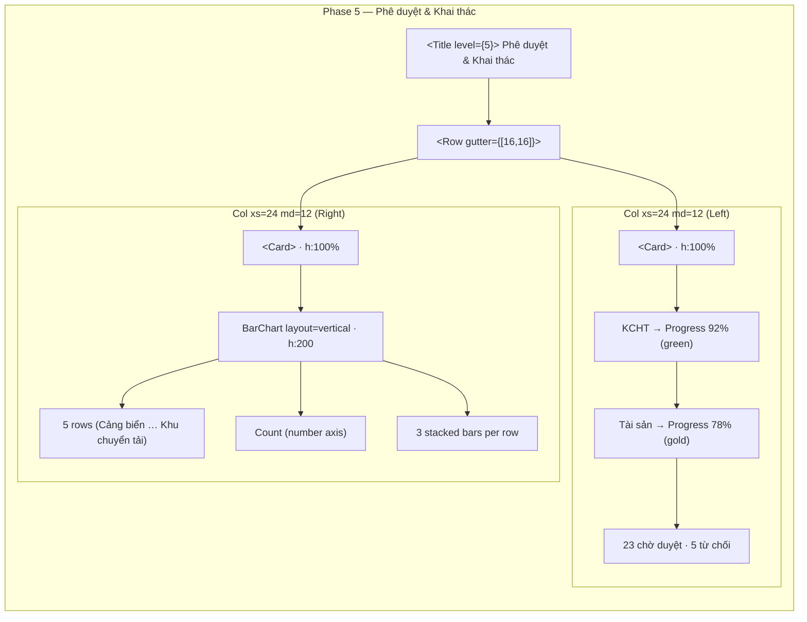

# Lean Spec — Phê duyệt & Tình trạng khai thác

## 1. Summary

Two supplementary information blocks below the KPI row and chart row on the Trang chủ Dashboard. **Approval section** shows 2 Progress bars (KCHT 92%, Tài sản 78%) with status-count summary. **Exploitation section** shows a horizontal stacked bar chart covering 5 KCHT types across 3 exploitation states. Both sit inside a 2-column `Row/Col` layout at Ant Design's gutter spacing.

## 2. Scope

- **Actors:** A-001 Admin, A-002 Leader, A-003 Specialist (read-only dashboard viewers)
- **In scope:** Approval Progress bars + status counts; exploitation horizontal stacked bar chart; card layout
- **Out of scope:** Real data fetching (currently mock), drill-down navigation, export, edit actions

## 3. User Story

> As a **dashboard viewer** (Admin / Leader / Specialist), I want to see approval completion rates for KCHT and Tài sản, along with exploitation state breakdowns for each KCHT type, so I can monitor operational status at a glance without navigating to detail pages.

## 4. Acceptance Criteria

| ID | Criterion | Type | Verification |
|---|---|---|---|
| AC-01 | Display Ant Design `<Progress>` bar for **KCHT** at 92% with `strokeColor={statusOperational}` (#1BAF7A) | Positive | Visual: green progress bar at 92% |
| AC-02 | Display Ant Design `<Progress>` bar for **Tài sản** at 78% with `strokeColor={statusAttention}` (#EDA100) | Positive | Visual: gold progress bar at 78% |
| AC-03 | Show label "KCHT" and "Tài sản" above each bar in `fontSizeMd` / `textSecondary` | Positive | Text rendered per spec |
| AC-04 | Show status-count line: "23 chờ duyệt" (color `statusAttention` #EDA100) and "5 từ chối" (color `statusCritical` #E34948) below the progress bars, spaced by `spaceLg` (16px) | Positive | Counts visible, colored correctly |
| AC-05 | Show horizontal stacked `BarChart` (layout="vertical") with 5 Y-axis category rows: Cảng biển, Khu neo đậu, Luồng HH, Bến cảng, Khu chuyển tải | Positive | 5 rows rendered |
| AC-06 | 3 stacked series: `dangKhaiThac` (fill `statusOperational` #1BAF7A), `chuaKhaiThac` (fill `statusAttention` #EDA100), `dungKhaiThac` (fill `statusCritical` #E34948) | Positive | 3 series visible, correct colors |
| AC-07 | Tooltip on Bar hover: shows Vietnamese labels "Đang khai thác" / "Chưa khai thác" / "Dừng khai thác" with locale-formatted values | Positive | Tooltip renders correct text |
| AC-08 | Show "Phê duyệt & Khai thác" section title as `<Title level={5}>` with `fontSizeLg` / `fontWeightMedium` | Positive | Title rendered |
| AC-09 | Data loading state: empty array → chart renders 0-height bars, not crash | Negative | No JS error |
| AC-10 | Data error state: no catch boundary in code; error will propagate to nearest React error boundary — noted as a gap | Negative | No explicit error handling |
| AC-11 | Empty exploitation data `[]` shows blank chart area with gridlines but zero bars | Negative | No bars, no crash |
| AC-12 | No `<Skeleton>` or loading spinner implemented for this section — listed as a state gap | Negative | No loading indicator |

## 5. Layout & Structure



## 6. Mock Data Structure

### ExploitationItem

```ts
interface ExploitationItem {
  name: string;          // "Cảng biển", "Khu neo đậu", etc.
  dangKhaiThac: number;  // Currently operating
  chuaKhaiThac: number;  // Not yet exploited
  dungKhaiThac: number;  // Stopped exploitation
}
```

### Runtime values

| name | dangKhaiThac | chuaKhaiThac | dungKhaiThac |
|---|---|---|---|
| Cảng biển | 12 | 3 | 2 |
| Khu neo đậu | 8 | 4 | 1 |
| Luồng HH | 32 | 5 | 0 |
| Bến cảng | 28 | 7 | 3 |
| Khu chuyển tải | 6 | 2 | 1 |

## 7. Token Compliance

| Element | Token Used | Resolved Value |
|---|---|---|
| KCHT Progress `strokeColor` | `statusOperational` | #1BAF7A |
| Tài sản Progress `strokeColor` | `statusAttention` | #EDA100 |
| "23 chờ duyệt" color | `statusAttention` | #EDA100 |
| "5 từ chối" color | `statusCritical` | #E34948 |
| Bar `dangKhaiThac` fill | `statusOperational` | #1BAF7A |
| Bar `chuaKhaiThac` fill | `statusAttention` | #EDA100 |
| Bar `dungKhaiThac` fill | `statusCritical` | #E34948 |
| Progress label color | `textSecondary` | #6B7280 |
| Progress card background | `cardStyle` (`surfaceCard` + `borderDefault` + `radiusLg` + `spaceMd`) | #FFFFFF / #E5E7EB / 12px / 12px |
| Section title | `sectionTitleStyle` (`fontSizeLg` + `fontWeightMedium` + `marginBottom: spaceMd`) | 15px / 500 / 12px |
| Status text size | `fontSizeSm` | 11px |
| Progress label size | `fontSizeMd` | 13px |
| Axis ticks | `fontSizeSm` / `textSecondary` | 11px / #6B7280 |
| Gutter/Spacing | `spaceLg` | 16px |
| Accent budget (`actionPrimary`) | Not used in this block | 0 uses (within budget) |

The implementation uses **zero hardcoded hex values**. All colors, spacing, font sizes, and border radii reference tokens from `tokens.ts`.

## 8. Non-Functional Requirements

| Area | Requirement | Status |
|---|---|---|
| Performance | Chart renders < 20 DOM elements; no performance concern | Met |
| Usability | BarChart tooltip shows Vietnamese labels with number formatting | Met |
| Accessibility | No explicit aria-labels; color-contrast check TBD | Gap |
| Maintainability | All colors via tokens, bar data via typed array, testable | Met |
| Error Handling | No error boundary, no loading skeleton, no empty-state message | Gap (noted) |

## 9. Test Scenarios

| Scenario | Input | Expected Outcome |
|---|---|---|
| Normal data | `exploitationData` with 5 items | 5 rows, correct bar widths |
| Empty state | `exploitationData = []` | Chart area clean, no bars, no crash |
| Single-item data | `[{name:'Cảng biển', dang:1, chua:0, dung:0}]` | 1 row, green bar only |
| Zero across all categories | All counts = 0 | Gridlines visible, all bars at 0 |
| Very large counts | Values in thousands | Axis auto-scales |

## 10. Pipeline Triage

| Question | Answer | Rationale |
|---|---|---|
| Q1: Creates new domain elements? | No | Trang chủ is a read-only dashboard consuming domain data; `ExploitationItem` is a UI-presentation type, not a domain entity |
| Q2: Affects system architecture? | No | Pure UI component addition within existing M-022 |
| Q3: Approach clear from existing architecture? | Yes | Follows existing TrendChartCard + card style patterns |
| **Verdict (route to)** | **engineering-technical-lead** | |

## 11. Notable Gaps

1. **No loading state** — No `<Skeleton />` or spinner before data arrives
2. **No empty state message** — Empty `exploitationData` shows blank chart without explanatory text
3. **No error boundary** — A failed Recharts render would propagate unhandled
4. **No API integration** — All data is inline mock; no React Query / fetch abstraction
