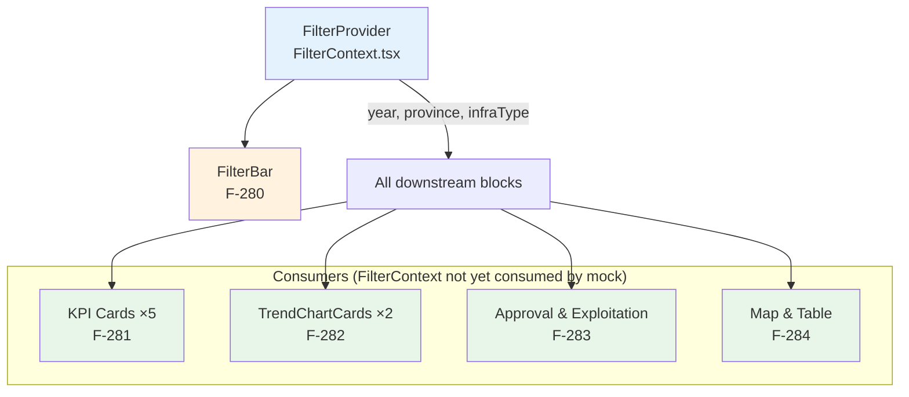

# Module-Level Lean Spec: Trang chủ Dashboard (M-022)

## 1. Module Overview

| Field | Value |
|---|---|
| **Id** | M-022 |
| **Name** | Trang chủ Dashboard |
| **Slug** | trang-chu-dashboard |
| **Route** | `/` (HomePage) |
| **Type** | Read-only analytics dashboard |
| **Page file** | `frontend/src/pages/Home.tsx` |
| **Wraps** | `FilterProvider` → `HomeDashboard` (6 visual blocks) |

M-022 is the landing page of the maritime infrastructure management system. It provides a **single-pane-of-glass** overview of operational KPIs, monthly trends, exploitation status, and infrastructure details — all driven by a shared filter bar. **Business value:** leadership and port operators can assess the state of all KCHT (maritime infrastructure) at a glance without navigating to detail modules.

## 2. Feature Inventory (5 features)

| Feature | ID | Slug | 1-Line Description | Prio | Lines of code |
|---|---|---|---|---|---|
| FilterBar | F-280 | thanh-bo-loc-dashboard | Horizontal control strip with Year/Province/Infra-type dropdowns, synced to URL query params, driving all downstream blocks | High | ~100 (FilterBar.tsx + FilterContext.tsx) |
| KPI Cards | F-281 | the-kpi-dashboard | Row of 5 KPI cards (ship calls, cargo volume, passengers, operating infra, pending docs) with trend arrows and variants | High | ~80 (KpiCard.tsx) |
| Trend Charts | F-282 | bieu-do-xu-huong-dashboard | 2 TrendChartCards: stacked bar (cargo, 4 series) + line (passengers, 2 series), monthly | High | ~120 (TrendChartCard.tsx) |
| Approval & Exploitation | F-283 | phe-duyet-tinh-trang-khai-thac | 2 Progress bars (KCHT 92%, Tài sản 78%) + horizontal stacked bar (5 KCHT types × 3 statuses) | Medium | inline in Home.tsx (~50) |
| Map & Table | F-284 | ban-do-bang-chi-tiet-dashboard | Map placeholder (300px, centered icon + label) + scrollable Ant Table (no pagination, 10 mock rows) | Medium | inline in Home.tsx (~80) |

## 3. Cross-Feature Architecture



### 3.1 Dependency Graph

| Feature | Depends on | Consumed by | Provider |
|---|---|---|---|
| F-280 FilterBar | `FilterProvider` (FilterContext.tsx) | F-281, F-282, F-283, F-284 | `react-router-dom` (URL) |
| F-281 KPI Cards | — (sibling context, not yet consumed) | — | — |
| F-282 Trend Charts | — (sibling context, not yet consumed) | — | Recharts |
| F-283 Approval & Exploit | — | — | Recharts + Ant Progress |
| F-284 Map & Table | — | — | Ant Table |

**Key insight:** The `FilterProvider` → `FilterBar` data flow is fully wired. But **no downstream feature (F-281–F-284) currently reads `useFilter()`** — all data is inline mock. This is the single biggest gap for v2.

## 4. Shared Components

| Component | File | Props | Used in | Variants | States |
|---|---|---|---|---|---|
| `FilterBar` | `components/FilterBar.tsx` | None (reads FilterContext) | Home.tsx | — | Normal only (mock data, no loading) |
| `KpiCard` | `components/KpiCard.tsx` | label, value, subLabel?, trend?, variant?, onClick? | Home.tsx ×5 | default (×4), action (×1), warning (defined but unused) | Normal only (no loading/empty/error) |
| `TrendChartCard` | `components/TrendChartCard.tsx` | title, legendItems?, loading?, empty?, error?, onRetry?, height, children | Home.tsx ×2 | — | ✅ Loading (Skeleton), ✅ Empty, ✅ Error + Retry button |

### 4.1 Component Sharing Summary

| Component | Tech | Token-compliant? | Loading | Empty | Error |
|---|---|---|---|---|---|
| FilterBar | Ant Select | ✅ 100% | ❌ Not implemented (static data) | ✅ Null→"Tất cả" | ❌ Aspirational (brief AC) |
| KpiCard | Custom div | ✅ 100% | ❌ Not implemented | ❌ Not implemented | ❌ Not implemented |
| TrendChartCard | Ant Card + Recharts | ✅ 100% | ✅ Skeleton active | ✅ 📭 icon + text | ✅ Warning + Thử lại |
| Approval Progress | Ant Progress | ✅ 100% | ❌ Not implemented | N/A (hardcoded) | ❌ Not implemented |
| Map placeholder | Custom div | ✅ 100% | ❌ Not implemented | N/A | N/A |
| Infra Table | Ant Table | ✅ 100% | ❌ `loading` prop not set | ✅ Ant default empty | ❌ Not implemented |

## 5. Data Flow

```
[URL query params] ←→ [FilterProvider] ←→ [FilterBar]
                            |
          [year=2026, province=null, infraType=null]
                            |
                   [Future: API call]
                            |
     ┌──────────────┬───────┴───────┬──────────────┐
     ▼              ▼               ▼              ▼
  KPI Cards    Trend Charts    Approval &      Map & Table
  (mock)        (mock)        Exploitation      (mock)
                               (mock)
```

### 5.1 Current Data Sources (all mock)

| Block | Data type | Source | Filter-aware? |
|---|---|---|---|
| KPI Cards | 5 inline numbers | Home.tsx: `value={28450}` etc | ❌ |
| Cargo chart | `CargoMonth[]` (12 months) | Home.tsx: `cargoData` | ❌ |
| Passenger chart | `PassengerMonth[]` (12 months) | Home.tsx: `passengerData` | ❌ |
| Approval | `Progress percent={92/78}` | Home.tsx: inline | ❌ |
| Exploitation | `ExploitationItem[]` (5 items) | Home.tsx: `exploitationData` | ❌ |
| Infra Table | `InfraRow[]` (10 rows) | Home.tsx: `infraData` | ❌ |

## 6. Semantic Token Architecture Summary

All blocks in M-022 are **100% token-compliant** — zero hardcoded hex values, font sizes, spacing, or radii. Source: `frontend/src/tokens.ts` (closed 13-color palette, 4 radius values, 6 spacing steps, 5 font sizes, 3 font weights).

### Color Budget (13 tokens)

| Category | Tokens | Used in |
|---|---|---|
| **Action** (≤3 uses/screen) | `actionPrimary` (#1B84FF) | KpiCard #5 (1 use) |
| **Status** | `statusOperational` (#1BAF7A), `statusAttention` (#EDA100), `statusCritical` (#E34948) | Trend arrows, Progress bars, bar fills, Tag colors |
| **Data** | `dataPrimary` (#2A78D6), `dataSecondary` (#E87BA4) | Stacked bar: Nội địa + Chuyển tải |
| **Surface** | `surfaceCard` (#FFF), `surfacePage` (#F8F9FA) | Card backgrounds, FilterBar bg, map placeholder |
| **Text** | `textPrimary` (#1F2937), `textSecondary` (#6B7280), `textTertiary` (#9CA3AF) | KPI values, labels, timestamps, placeholder |
| **Border** | `borderDefault` (#E5E7EB) | Card borders, grid lines, separator |

### Accent Budget: **1 use** (KpiCard action variant). Within the ≤3 limit per `tokens.ts`.

### Recharts Palette Mapping (F-282, F-283)

| Semantic role | Token | Chart element |
|---|---|---|
| dataPrimary | #2A78D6 | Stacked bar: Nội địa |
| statusOperational | #1BAF7A | Stacked bar: Xuất khẩu; Line: Đến cảng; Exploitation: đang khai thác |
| statusAttention | #EDA100 | Stacked bar: Nhập khẩu; Exploitation: chưa khai thác |
| dataSecondary | #E87BA4 | Stacked bar: Chuyển tải |
| statusCritical | #E34948 | Line: Rời cảng; Exploitation: dừng khai thác |

## 7. Current Limitations (v1 gaps)

| # | Limitation | Affects | Impact |
|---|---|---|---|
| CL-01 | **All data is inline mock** — no API, no React Query, no fetch | All features (F-281–F-284) | Dashboard shows sample numbers, not real data |
| CL-02 | **FilterContext not consumed downstream** — KPI/charts/table ignore filter state | F-281, F-282, F-283, F-284 | Changing year/province/infra-type has zero visible effect |
| CL-03 | **Missing loading states** — KpiCard, Progress bars, Table have no skeleton/spinner | F-281, F-283, F-284 | Blocks below FilterBar appear instantly with old data on real API |
| CL-04 | **Missing empty/error states** — Only TrendChartCard has empty+error; others have none | F-281, F-283, F-284 | No graceful degradation on API failure |
| CL-05 | **Map is a placeholder div** — no GIS/map library integrated | F-284 | No geographic context visible |
| CL-06 | **`warning` KpiCard variant unused** — coded but not instantiated | F-281 | Confuses expected vs actual behavior; AC from brief says yellow bg |
| CL-07 | **No error boundary** — React error boundary not configured per-block or page-wide | All | Any render crash takes down the whole dashboard |

## 8. Cross-Feature Acceptance Criteria (consolidated smoke tests)

| ID | Scenario | Steps | Covers |
|---|---|---|---|
| AC-01 | Dashboard renders all 6 sections | Navigate to `/` → see FilterBar, KPI, Charts, Approval, Map, Table | All |
| AC-02 | FilterBar changes persist in URL | Select year=2025 → URL shows `?year=2025`; refresh → dropdown shows 2025 | F-280 |
| AC-03 | KPI cards render with formatted numbers | 5 cards visible, numbers use `toLocaleString('vi-VN')`, trend arrows correct | F-281 |
| AC-04 | Charts render without crash | Stacked bar + line chart render; hover shows tooltip with Vietnamese labels | F-282 |
| AC-05 | TrendChartCard states work | Pass `loading=true` → Skeleton; `empty=true` → 📭; `error=true` → Warning + Thử lại | F-282 |
| AC-06 | Approval progress bars render | KCHT 92% green, Tài sản 78% gold, status counts colored correctly | F-283 |
| AC-07 | Exploitation horizontal bar renders | 5 rows, 3 bars per row, correct colors, tooltip shows Vietnamese labels | F-283 |
| AC-08 | Map placeholder visible | 300px grey area with `EnvironmentOutlined` icon + label | F-284 |
| AC-09 | Infrastructure table renders | 10 rows, scrollable (y=300px), no pagination, status → Tag color map | F-284 |
| AC-10 | All layout is responsive | Narrow screen (<768px) → sections stack vertically | All |

## 9. Pipeline Triage

| Question | Answer | Rationale |
|---|---|---|
| **Q1: Creates new domain elements?** | **No** | All 5 features are pure UI — they consume domain data via mock. Types (`CargoMonth`, `ExploitationItem`, `InfraRow`) are local inline interfaces, not backend domain entities. |
| **Q2: Affects system architecture?** | **No** | Module sits inside existing `FilterProvider` → `HomeDashboard` pattern. No new routes, no new architectural layers, no backend changes. |
| **Q3: Approach clear from existing architecture?** | **Yes** (with a caveat) | The component tree, token system, FilterContext pattern, and Recharts usage are all proven in the codebase. **Caveat:** upstream data integration (API → FilterContext → consumers) needs an architectural decision on data-fetching strategy (React Query vs. vanilla `useEffect`). |
| **Triage Verdict** | → `engineering-technical-lead` | For v1 mock work: purely frontend. For API integration: needs FE lead to decide data-fetching approach and API contract design. |

## 10. Triage Justification

| Decision | Why |
|---|---|
| Not → SA | No new aggregates, entities, domain events, bounded contexts, or context maps. All data is UI-presentation types. |
| Not → TL (direct) for ALL | The downstream FilterContext integration (CL-02) and API binding (CL-01) require architectural guidance on: (a) whether to use React Query or TanStack Query, (b) API endpoint contract design for filter-parameterized data, (c) whether data comes from M-002/M-008 or a dedicated dashboard aggregation endpoint. |
| → TL for now | v1 mock work is clear: no domain/arch changes needed. TL can scope the API integration wave separately. |
