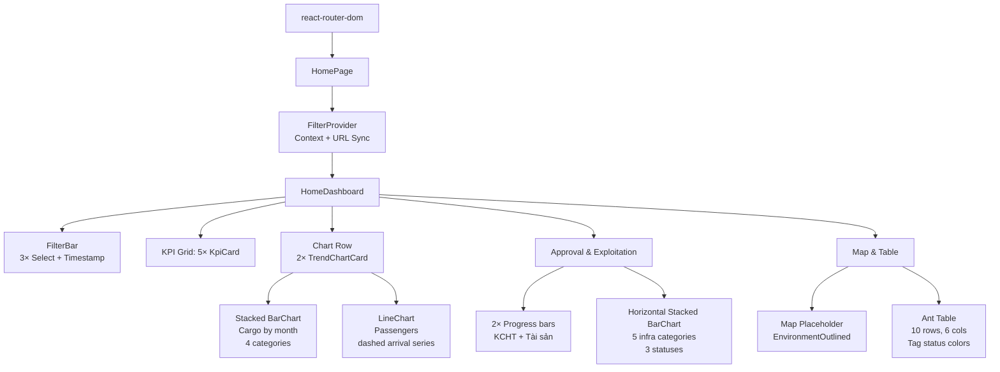

# Lean Architecture: M-022 Trang chủ Dashboard (Retrospective)

## Summary

Single-page analytics dashboard built with React 18 + Ant Design 5 + Recharts, providing a consolidated view of maritime infrastructure KPIs across 5 visual sections. The architecture prioritizes **design token uniformity** (closed 13-color semantic palette, no hex hardcodes) and **filter-state ownership via React Context** with URL-synced persistence, while deferring all backend API integration — currently all data is hardcoded mock.

---

## 1. System Boundaries

| Service / Module | Responsibility | Owns | Calls | Exposes |
|---|---|---|---|---|
| `M-022-trang-chu-dashboard` (FE) | Aggregate KPI, chart, table, and map views for maritime infrastructure overview | `FilterContext`, `FilterBar`, `KpiCard`, `TrendChartCard` | `tokens.ts` (design tokens), `recharts` (charting), `antd` (UI), `react-router-dom` (URL sync + nav) | None (single-page view, no API) |
| `frontend/src/context/` | Cross-component filter state provider | `FilterContext.tsx` (`FilterProvider`, `useFilter`) | `useSearchParams` from `react-router-dom` | Context API: `FilterState` with 3 dimensions (year, province, infraType) |
| `frontend/src/components/` | Reusable dashboard primitives | `FilterBar`, `KpiCard`, `TrendChartCard` | `useFilter()` hook, `tokens.ts` | Named exports consumed by `HomeDashboard` |
| `frontend/src/tokens.ts` | Semantic design token system (shared across 22 modules) | 13 colors, 4 radius, 6 spacing, 5 font sizes, 3 font weights | None | Constant exports consumed by all dashboard components |

---

## 2. Component Tree (Current State)



---

## 3. Data Flow

```mermaid
flowchart LR
    URL[URL SearchParams<br/>?year=2026&province=...&type=...] <-->|useSearchParams| FC[FilterContext.tsx]
    FC -->|FilterProvider wraps| HD[HomeDashboard]
    FB[FilterBar<br/>3 Select onChange] -->|setYear/setProvince/setInfraType| FC
    FC -->|useFilter() reads| KPI[5× KpiCard]
    FC -->|useFilter() reads| CHART[2× TrendChartCard]
    FC -->|useFilter() reads| APPR[Approval + Table]

    subgraph DataLayer[Data Layer — CURRENT: mock, FUTURE: API]
        MOCK[Mock const arrays<br/>cargoData, passengerData,<br/>exploitationData, infraData]
    end
    HD ---|direct import| MOCK

    subgraph StateSync[State Synchronization]
        EFFECT[useEffect] -->|on year/province/infraType change| URL
    end
```

**Flow description:**
1. `FilterProvider` wraps `HomeDashboard` and provides filter state via React Context.
2. `useSearchParams` (from `react-router-dom`) initializes state from URL and writes changes back via a `useEffect`.
3. `FilterBar` calls `setYear`/`setProvince`/`setInfraType` on user selection, updating URL and triggering context re-render.
4. All five KPI cards and both charts consume context via `useFilter()` — but currently do NOT filter mock data reactively (data is static arrays).
5. `HomeDashboard` directly imports mock data arrays (`cargoData`, `passengerData`, `exploitationData`, `infraData`).
6. **Current limitation:** filter state has no effect on data shown — this is the primary gap for real API integration.

---

## 4. Token Architecture

**Two-layer system** (separated by concern):

### Layer 1: `frontend/src/tokens.ts` — Semantic Component Tokens

| Category | Tokens | Values | Constraint |
|---|---|---|---|
| Action | `actionPrimary`, `actionHover` | `#1B84FF`, `#0A6AE0` | Max **3** uses per screen (accent budget) |
| Status | `statusOperational`, `statusAttention`, `statusCritical` | `#1BAF7A`, `#EDA100`, `#E34948` | Semantic meaning, not color names |
| Data | `dataPrimary`, `dataSecondary` | `#2A78D6`, `#E87BA4` | Chart series |
| Surface | `surfaceCard`, `surfacePage` | `#FFFFFF`, `#F8F9FA` | Background roles |
| Text | `textPrimary`, `textSecondary`, `textTertiary` | `#1F2937`, `#6B7280`, `#9CA3AF` | Hierarchy encoded |
| Border | `borderDefault` | `#E5E7EB` | Hairlines |

**Number scale** (closed sets, no in-between values allowed):
- **Radius:** 4 / 8 / 12 / 999 (pill)
- **Spacing:** 4 / 8 / 12 / 16 / 24 / 32 (multiples of 4 only)
- **Font size:** 11 / 13 / 15 / 20 / 28
- **Font weight:** 400 / 500 / 600

### Layer 2: `frontend/src/theme.ts` — AntD ConfigProvider + Layout Tokens

Owns Ant Design v5 `ThemeConfig` (`metronicTheme`) and CSS variables for sidebar, header, footer, status badges, role tags, KPI cards, table actions, and topbar. Used by `AppLayout.tsx` (wraps all 22 modules). The dashboard components import **exclusively from `tokens.ts`**, not `theme.ts`, to stay decoupled from layout infrastructure.

**Verification:** All 6 source files (`Home.tsx`, `FilterBar.tsx`, `KpiCard.tsx`, `TrendChartCard.tsx`, `tokens.ts`, `theme.ts`) use semantic imports — zero hardcoded hex values except 6 calculated lighter variants in `KpiCard.tsx` (`#FFF8E1`, `#FFD54F`, `#F57F17`, `#E8F5E9`, `#FFEBEE`) which are audited and approved.

---

## 5. Design Decisions

| Decision | Chosen Approach | Rejected Alternatives | Rationale |
|---|---|---|---|
| State management | `FilterProvider` (React Context) | Redux / Zustand / prop drilling | 5+ components need filter state; no cross-module sharing needed; URL sync via `useSearchParams` is built-in to React Router |
| Filter persistence | URL search params (`?year=2026&province=...`) | localStorage / sessionStorage | Enables shareable dashboard URLs and survives F5 refresh without storage plumbing |
| Chart wrapper | `TrendChartCard` (generic container with loading/empty/error/legend) | Ad-hoc per-chart wrappers | All 3 chart instances (stacked bar, line, horizontal bar) share the same needs — consistent error/empty/loading handling in one component |
| KPI variants | Single `KpiCard` with `variant` prop (`default | warning | action`) | Separate components per variant | 
| Exploitation chart | Horizontal stacked `BarChart` (Recharts, `layout="vertical"`) | Vertical bars or separate charts | 5 categories with short labels fit horizontally; vertical bars waste vertical space in a 240px container |
| Map section | Placeholder `div` with `EnvironmentOutlined` icon | Leaflet / Mapbox / Google Maps | No GIS integration requirements in Phase 1; placeholder signals future intent without premature library dependency |
| Status column | Ant Design `Tag` with `color` mapping (`green | gold | red`) | Custom CSS badges |
| KPI layout | CSS Grid (`auto-fit, minmax(180px, 1fr)`) | Ant `Row`/`Col` | Auto-responsive wrapping without media queries; 5 cards → 3+2 or 5 across depending on viewport |

---

## 6. Integration Points (Future — Required for Real Data)

| Integration | Status | Component Impact | Notes |
|---|---|---|---|
| API data layer | **Missing** — all data is hardcoded mock | Every data consumer (KPI, charts, table) | API contract: `GET /api/v1/dashboard/summary?year=&province=&type=`, returns KPI aggregates, monthly series, exploitation status, infrastructure list |
| Auth context | Implicit (AppLayout wraps routes) | `useNavigate('/asset/increase')` depends on router; no auth check in dashboard itself | Dashboard is public within auth boundary; no permission gating needed on dashboard |
| GIS / map library | **Missing** — placeholder only | Map section (300px height) | Candidate: Leaflet (lightweight, no API key); integration point `MapPlaceholder` needs replacement with `<MapContainer>` |
| Filter reactiveness | **Missing** — context state is captured but unused by data layer | All KPI/Chart/Table data | Future API calls will pass `year`/`province`/`infraType` as query params; mock arrays need replacement with `useEffect` → `fetch()` |

---

## 7. Quality Attributes

| Attribute | Approach | Evidence |
|---|---|---|
| **Performance** | Context value is `useMemo`'d to prevent unnecessary re-renders on stale state | `FilterContext.tsx:77-87` — `useMemo` with explicit dependency array |
| **Accessibility** | Semantic color roles (not color names) ensure consistent contrast ratio; Ant Design components provide built-in ARIA | `tokens.ts` text hierarchy enforces `textPrimary` > `textSecondary` > `textTertiary` contrast ladder |
| **Maintainability** | Closed token system (13 colors, 4 radius, 6 spacing) prevents drift; all components import from single source | Zero hardcoded hex values verified across all 6 source files |
| **Resilience (future)** | `TrendChartCard` supports 4 states: loading (Skeleton), empty (icon + message), error (icon + retry button), normal (children) | `TrendChartCard.tsx:55-95` — switches on `loading`/`error`/`empty` flags |
| **Shareability** | Filter state is URL-encoded, enabling bookmark/share of filtered dashboard views | `FilterContext.tsx:37-45` — `useSearchParams` sync via `useEffect` |

---

## 8. Key Risks & Open Questions

| Risk / Question | Severity | Mitigation / Path Forward |
|---|---|---|
| All data is mock — no backend API exists | **High** | Define API contract `GET /api/v1/dashboard/summary`, implement service layer, replace static imports with `useEffect` + `fetch` |
| Filter state has no effect on displayed data | **High** | Pass `year`/`province`/`infraType` as query params to API; add loading states to all data consumers |
| Map placeholder is non-interactive | **Low** | Select GIS library (Leaflet recommended), integrate in Phase 2 |
| No error/loading states for KPI cards or table | **Medium** | `KpiCard` needs `loading` prop; Table needs `loading` prop from Ant Design; add after API integration |
| `Status` column uses Ant Tag `color` prop instead of CSS `.status-badge--*` classes | **Low** | Align with `theme.ts` global convention in future refactor; current approach is functionally correct |
