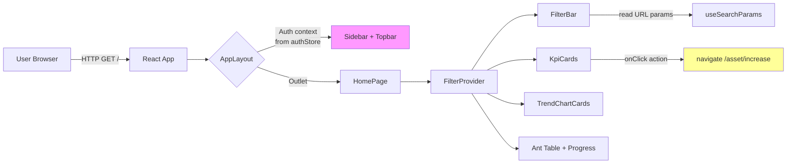

# Threat Model — M-022 Trang chủ Dashboard

| Field | Value |
|---|---|
| **Feature ID** | M-022 |
| **Stage** | Design (Retrospective) |
| **Agent** | utility-security-auditor |
| **Verdict** | Pass (with observations) |
| **Last Updated** | 2026-07-10 |

---

## 1. Review Scope & Threat Surface

**Mode:** `design` (retrospective on already-deployed code)

**Domains assessed:** Authentication context, authorization/routing, input validation & output encoding (XSS), data protection (information disclosure), URL state manipulation, clickjacking, secrets management.

**Threat surface summary:** The M-022 Dashboard is a **read-only frontend component** rendered inside `AppLayout`. It displays aggregated statistics from hardcoded mock data using Recharts, Ant Design, and React. No API/backend calls originate from this page. User interaction is limited to three Ant Design Select dropdowns (year, province, infraType) that update React state and URL query parameters, and a `navigate('/asset/increase')` call from one KpiCard.

---

## 2. Data Flow Diagram

**Trust boundaries:**

| # | Boundary | Direction | Description |
|---|---|---|---|
| TB1 | User ↔ Browser | Bidirectional | Standard web trust; dashboard relies on browser DOM security model |
| TB2 | Browser ↔ React SPA | Unidirectional | React renders data; no eval/dangerousInnerHTML patterns found |
| TB3 | Dashboard ↔ Backend | **None** | Dashboard makes zero API/backend calls |

---

## 3. Asset Inventory

| Asset | Location | Sensitivity | Notes |
|---|---|---|---|
| Mock dashboard data | `Home.tsx` lines 30-85 (static arrays) | **None** | All public domain port names + synthetic figures |
| Filter state (year, province, infraType) | `FilterContext.tsx` React state | **Low** | User-controlled, no PII/secret |
| URL search params (`?year=…&province=…&type=…`) | Browser address bar | **Low** | User-visible, publicly modifiable |
| lastUpdated timestamp | `FilterContext.tsx` line 44 | **None** | Current time formatted locale string |
| JWT auth token | `localStorage['auth_token']` (authStore.ts) | **Medium** | Managed by authStore — not read/used by dashboard |

---

## 4. Threat Analysis

### T-001: Cross-Site Scripting (XSS) via URL Query Parameters

| Attribute | Assessment |
|---|---|
| **Entry point** | `FilterContext.tsx` lines 23-29: `searchParams.get('year')`, `.get('province')`, `.get('type')` |
| **Vector** | Malicious URL: `/?province=` |
| **Render path** | URL param → React state → Ant Design `Select` component (controlled) |
| **Evidence** | `FilterBar.tsx` lines 61-67: `<Select value={province ?? 'Tất cả'} … options={PROVINCE_OPTIONS.map(…)}>` — Ant Design `Select` renders via React JSX, not innerHTML. No `dangerouslySetInnerHTML` exists anywhere in the component tree. No `eval`, `setTimeout(string)`, or `new Function()` patterns found. |
| **Severity** | **Low** |
| **Likelihood** | Low (requires crafted URL + no auto-execution pathway) |
| **Impact** | Low (React escapes all string content; at worst an unmatched label text is displayed) |
| **Residual risk** | Acceptable. Migrating to filtered/validated option-set further reduces risk. |

### T-002: URL Parameter Injection / State Manipulation

| Attribute | Assessment |
|---|---|
| **Vector** | Attacker crafts `/?year=NaN&province=INVALID_ADMIN&type=DELETE_ALL` |
| **Impact** | `parseInt('NaN', 10)` → `NaN` → Select shows empty/invalid value. `province` values not in the options set display as raw text in the Select label. No data mutation, no server request, no privilege escalation. |
| **Evidence** | `FilterContext.tsx` lines 23-29: `parseInt(yearParam, 10)` returns `NaN` for invalid strings; province/type are set directly as strings. `FilterBar.tsx` lines 59-73: Select uses pre-defined options — unmatched values display as-is but React-escaped. |
| **Severity** | **Low** |
| **Likelihood** | Medium (trivial to craft URL) |
| **Impact** | Low (cosmetic only; no data integrity impact) |
| **Mitigation** | Validate `province`/`type` against allowed option values before accepting into state (defense-in-depth). |
| **Residual risk** | Acceptable for current mock-data phase. Reassess when real API data is connected. |

### T-003: Information Disclosure

| Attribute | Assessment |
|---|---|
| **Vector** | Leak of sensitive business data through dashboard visuals |
| **Evidence** | All data in `Home.tsx` lines 30-85 is hardcoded mock arrays with publicly available port names (Hải Phòng, Cái Mép – Thị Vải, Đà Nẵng, etc.) and synthetic numeric figures (tonnage, passenger counts). No PII, no API keys, no secrets. |
| **Severity** | **None** |
| **Residual risk** | Acceptable for mock data. When real data is connected, conduct a data classification review. |

### T-004: Clickjacking / UI Redressing

| Attribute | Assessment |
|---|---|
| **Vector** | Attacker embeds the dashboard in an `<iframe>` from a malicious site, tricking users into clicking the "Hồ sơ chờ duyệt" card which navigates to `/asset/increase` |
| **Evidence** | `index.html` line 11: no `<meta http-equiv="Content-Security-Policy">` with `frame-ancestors`. No `X-Frame-Options` header set at the application level (server config not reviewed). `KpiCard.tsx` lines 54-57: `onClick={() => navigate('/asset/increase')}` is a client-side route navigation. |
| **Severity** | **Low** |
| **Likelihood** | Low (requires hosting setup; `/asset/increase` has PermissionGuard: `asset:yeu-cau-tang`) |
| **Impact** | Low (navigation target is gated by backend permission; no data-modifying action) |
| **Mitigation** | Deploy `Content-Security-Policy: frame-ancestors 'self'` at the web server / reverse proxy level. Not in application code scope. |
| **Residual risk** | Acceptable with server-side CSP. Add CSP meta tag in `index.html` for defense-in-depth. |

### T-005: Auth Bypass / Insufficient Route Protection

| Attribute | Assessment |
|---|---|
| **Vector** | The root route `/` (HomePage) has no `PermissionGuard` wrapper, unlike all other protected routes |
| **Evidence** | `App.tsx` line 145: `<Route path="/" element={<HomePage />} />` — no PermissionGuard. Compare with line 146: `<Route path="/users" element={<PermissionGuard permission="user:manage"><UsersPage /></PermissionGuard>}>`. AppLayout does not check `useAuthStore.isAuthenticated` before rendering; it only reads `user` for display. |
| **Severity** | **Low** |
| **Likelihood** | Low (catch-all route at line 304 redirects `*` to `/login`, but `/` is a defined route so the catch-all does not trigger) |
| **Impact** | Low (dashboard contains only mock data; no API calls expose real data) |
| **Mitigation** | Add `PermissionGuard` or auth redirect check to `/` route. Add `useEffect` in AppLayout to redirect unauthenticated users to `/login`. |
| **Residual risk** | Acceptable for current mock phase. **Must fix** before real data is connected. |

### T-006: JWT Token in localStorage

| Attribute | Assessment |
|---|---|
| **Vector** | XSS on any page exposes `localStorage['auth_token']` |
| **Evidence** | `authStore.ts` line 57: `localStorage.setItem('auth_token', token)`. The dashboard does not read or use this token directly. |
| **Severity** | **Medium** (frontend-wide, not dashboard-specific) |
| **Scope** | Out of scope for M-022 (managed by M-010 Auth module) |
| **Recommendation** | Consider `httpOnly` cookie strategy or short-lived tokens with refresh rotation for production. |

---

## 5. Compliance Considerations

| Standard | Requirement | Status | Gap |
|---|---|---|---|
| **OWASP ASVS V5** (Input Validation) | All input from URL params should be validated before use | Partial (year parsed via parseInt; province/type not validated against allowed set) | V5 gap: province/type not filtered to allowed options |
| **OWASP ASVS V6** (Output Encoding) | No XSS via stored/reflected content | Pass | React JSX + Ant Design controlled components |
| **OWASP ASVS V14** (Configuration) | CSP headers should be set | **Open** | No CSP `frame-ancestors` in index.html; relies on server config |
| **Nghị định 85/2016/NĐ-CP** (Bảo vệ dữ liệu cá nhân) | No PII collection | Pass | No PII on dashboard |
| **TT 12/2022/TT-BGTVT** (ATTT HTTT) | Authentication & access control | Partial | `/` route has no PermissionGuard |

---

## 6. Must-Fix Items

| ID | Finding | Owner | Expected Evidence | Closure Criteria |
|---|---|---|---|---|
| MF-001 | `/` route has no PermissionGuard; AppLayout does not check `isAuthenticated` | Engineering (frontend) | `App.tsx`: route `/` wrapped in `PermissionGuard` or AppLayout redirects unauthenticated users to `/login` | Code review shows auth guard on `/` before real data integration |

---

## 7. Should-Fix Items

| ID | Finding | Risk if Deferred | Priority |
|---|---|---|---|
| SF-001 | `province` and `type` URL params not validated against allowed option values | Unmatched Select label shown (cosmetic); no security impact | Low |
| SF-002 | No CSP `frame-ancestors` in index.html or server config | Clickjacking possible; low impact since `/asset/increase` is permission-gated | Medium |
| SF-003 | `parseInt(yearParam, 10)` accepts `NaN` rather than falling back to default year | Select shows blank/invalid year value for malformed param | Low |
| SF-004 | JWT stored in `localStorage` (frontend-wide) | Token exfiltration via XSS on any page; OOS for M-022 | Medium (tracked in M-010) |

---

## 8. Residual Risk Assessment

The M-022 Dashboard in its current form (mock data, no backend calls) has **minimal residual risk**. The most significant finding is **T-005 (auth bypass)** — the `/` route lacks a `PermissionGuard`, meaning any user who reaches the application (even without valid session) sees the dashboard. However, the dashboard contains only mock data, so the real-world impact is negligible at this stage. This **must be fixed before real API data is connected**.

All other threats are rated **Low** or lower. The architecture (React JSX + Ant Design controlled components) provides strong inherent XSS protection. The clickjacking vector is mitigated by the fact that the only actionable element navigates to a permission-gated route.

**Confidence: High** — conclusions are based on direct code review of all 6 source files, the route configuration, the auth store, and the AppLayout component.
