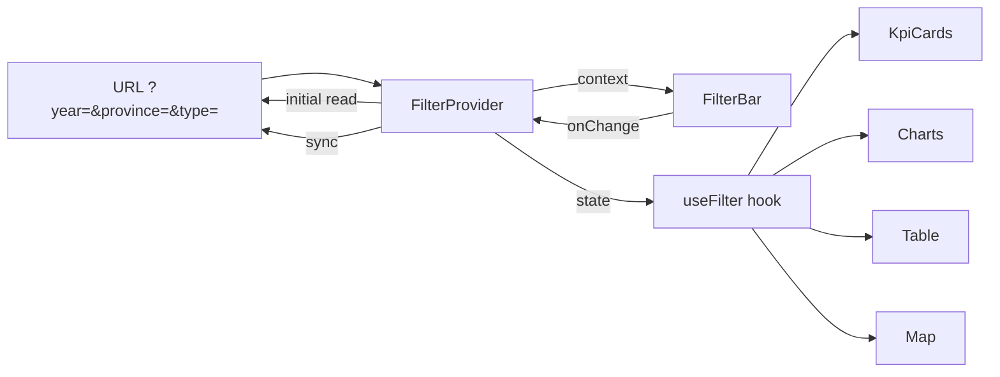

# Tech Lead Execution Plan — M-022 Trang chủ Dashboard (Retrospective)

## Change Overview

Build a full-page analytics dashboard for the Maritime Infrastructure Management System. The dashboard occupies the homepage route (`/`) and is composed of 5 content blocks arranged vertically: FilterBar controls → 5 KPI cards → 2 trend charts (stacked bar + line) → Approval & Exploitation section → Map placeholder + infrastructure table. All code is written, TypeScript-compiles, and uses zero hardcoded design values — every color, spacing, font size, and border radius comes from the `tokens.ts` semantic design system.

## Requirement-to-Execution Mapping

| Feature | Feature ID | Phase | Files | Lines | Status |
|---------|-----------|-------|-------|-------|--------|
| Thanh bộ lọc Dashboard | F-280 | Phase 1 | FilterContext.tsx, FilterBar.tsx | 108 + 99 | ✅ Built |
| Thẻ KPI số lớn | F-281 | Phase 2 | KpiCard.tsx (+ 5× usage in Home.tsx) | 111 | ✅ Built |
| Biểu đồ xu hướng | F-282 | Phase 3 | TrendChartCard.tsx (+ 2× usage in Home.tsx) | 130 | ✅ Built |
| Phê duyệt & Tình trạng khai thác | F-283 | Phase 4 | Home.tsx (Progress bars + horizontal BarChart) | — | ✅ Built |
| Bản đồ & Bảng chi tiết | F-284 | Phase 5 | Home.tsx (map placeholder + Ant Table) | — | ✅ Built |

## Implementation Scope

**Stack:** React 18+ (Vite), TypeScript, Ant Design 5, Recharts, react-router-dom v6

**Physical footprint:**

```
frontend/src/
├── tokens.ts              [107 lines] — Design token system (Phase 0)
├── context/
│   └── FilterContext.tsx   [108 lines] — Shared filter state (Phase 1)
├── components/
│   ├── FilterBar.tsx       [ 99 lines] — Filter controls (Phase 1)
│   ├── KpiCard.tsx         [111 lines] — KPI card component (Phase 2)
│   └── TrendChartCard.tsx  [130 lines] — Chart wrapper (Phase 3)
└── pages/
    └── Home.tsx            [336 lines] — Dashboard integration (Phases 1-5)
```

**Total:** 5 source files, ~891 lines. All files are under `frontend/src/`.

## Impacted Areas

| Area | Impact | DevOps Review Needed? |
|------|--------|----------------------|
| Frontend routing (`/` home route) | Home.tsx replaces default landing page | No |
| Design system (`tokens.ts`) | New file — SSOT for all dashboard visual tokens | No |
| Shared state (`FilterContext`) | New React Context + URL sync pattern | No |
| Ant Design dependencies | Uses Select, Card, Progress, Table, Tag, Skeleton, Button | No (existing lib) |
| Recharts dependency | Uses BarChart, LineChart, ResponsiveContainer, Tooltip | No (existing lib) |
| Environment variables / Infra | None | No |
| Schema / DB | None (all mock data) | No |
| Docker / Nginx | None | No |

**DevOps verdict:** No infra/env/schema changes — DevOps review not required.

## Task Breakdown

### Phase 0 — Foundation (Pre-Wave)

| Task | Description | Owner | Lines |
|------|------------|-------|-------|
| T0.1 | Create `frontend/src/tokens.ts` — 13 closed-palette color tokens, 4 radius values, 5 font sizes, 6 spacing values, 3 font weights, 4 composite style objects (metaStyle, cardStyle, dividerStyle, actionStyle, badgeBaseStyle) | frontend-dev | 107 |
| T0.2 | Define accent budget tracker (max 3 `actionPrimary` uses per screen) in documentation section | frontend-dev | inline |
| T0.3 | Establish number-scale constraints: radius (4/8/12/999), font (11/13/15/20/28), weight (400/500/600), spacing (4/8/12/16/24/32) in code comments | frontend-dev | inline |

**File created:** `frontend/src/tokens.ts` — 107 lines

### Phase 1 — F-280 FilterBar (Wave 1)

| Task | Description | Dependency | Owner | Parallelizable | Risk |
|------|------------|-----------|-------|--------------|------|
| T1.1 | Create `FilterContext.tsx` — React Context with `FilterProvider`, `useFilter()` hook, URL query param sync via `useSearchParams`, 3 filter keys (year, province, infraType), `lastUpdated` timestamp | Phase 0 | frontend-dev | No | Low — well-understood pattern |
| T1.2 | Create `FilterBar.tsx` — Horizontal bar with `surfacePage` bg, Ant Select dropdowns (Year/Province/InfraType), timestamp at right edge, flexWrap for responsive | T1.1 | frontend-dev | No | Low |
| T1.3 | Create `Home.tsx` shell — `FilterProvider` wrapping `HomeDashboard`, render `<FilterBar />` as first child | T1.2 | frontend-dev | No | Low |

**Files created:** `context/FilterContext.tsx` (108), `components/FilterBar.tsx` (99), `pages/Home.tsx` shell (336 total)
**State management diagram:**


### Phase 2 — F-281 KPI Cards (Wave 2)

| Task | Description | Dependency | Owner | Parallelizable | Risk |
|------|------------|-----------|-------|--------------|------|
| T2.1 | Create `KpiCard.tsx` — Reusable card component with `KpiCardProps` interface (label, value, subLabel?, trend?, variant?, onClick?), 3 variants (default/warning/action), trend arrows, `toLocaleString('vi-VN')` formatting | Phase 0 | frontend-dev | Yes (independent of Phase 1) | Low |
| T2.2 | Add 5 KpiCard instances in `Home.tsx` — Grid layout `repeat(auto-fit, minmax(180px, 1fr))`, cards 1-3 with trends, card 4 subLabel, card 5 action variant with navigate | T2.1, T1.3 | frontend-dev | No | Low |

**Files created/modified:** `components/KpiCard.tsx` (111) — new; `pages/Home.tsx` — modified
**Component reuse:** KpiCard × 5 instances in Home.tsx

### Phase 3 — F-282 Charts (Wave 3)

| Task | Description | Dependency | Owner | Parallelizable | Risk |
|------|------------|-----------|-------|--------------|------|
| T3.1 | Create `TrendChartCard.tsx` — Reusable chart wrapper with Ant Card, custom HTML legend, loading/empty/error states, height prop, children slot | Phase 0 | frontend-dev | Yes (independent of Phases 1-2) | Low |
| T3.2 | Add stacked BarChart (cargo) in `Home.tsx` — 4 series (noiDia/xuatKhau/nhapKhau/chuyenTai), Recharts `<BarChart>`, `<Bar stackId="a">`, color mapped to tokens | T3.1, T1.3 | frontend-dev | No | Low |
| T3.3 | Add LineChart (passengers) in `Home.tsx` — 2 series (denCang/roiCang), `type="monotone"`, dashed stroke for roiCang, activeDot | T3.1, T1.3 | frontend-dev | No | Low |
| T3.4 | Wire both charts into `<Row gutter={[spaceLg, spaceLg]}> <Col xs={24} md={12}>` layout | T3.2, T3.3 | frontend-dev | No | Low |

**Files created/modified:** `components/TrendChartCard.tsx` (130) — new; `pages/Home.tsx` — modified
**Component reuse:** TrendChartCard × 2 instances

### Phase 4 — F-283 Approval & Exploitation (Wave 4)

| Task | Description | Dependency | Owner | Parallelizable | Risk |
|------|------------|-----------|-------|--------------|------|
| T4.1 | Add "Phê duyệt & Khai thác" section title in `Home.tsx` — `<Title level={5}>` with token-based style | T1.3 | frontend-dev | Yes (independent of T4.2) | Low |
| T4.2 | Build left column — 2 Ant Design `<Progress>` bars (KCHT 92% green, Tài sản 78% gold), inline counts "23 chờ duyệt" / "5 từ chối" with status colors | T1.3 | frontend-dev | Yes (independent of T4.3) | Low |
| T4.3 | Build right column — Horizontal stacked BarChart (`layout="vertical"`) with 5 ExploitationItem rows, 3 status series mapped to statusOperational/Attention/Critical tokens | T1.3 | frontend-dev | Yes (independent of T4.2) | Low |

**Files modified:** `pages/Home.tsx` only

### Phase 5 — F-284 Map & Table (Wave 5)

| Task | Description | Dependency | Owner | Parallelizable | Risk |
|------|------------|-----------|-------|--------------|------|
| T5.1 | Add "Bản đồ & Chi tiết" section title in `Home.tsx` | T1.3 | frontend-dev | Yes (independent of T5.2, T5.3) | Low |
| T5.2 | Build map placeholder — 300px div with `surfacePage` bg, EnvironmentOutlined icon, metaStyle label | T1.3 | frontend-dev | Yes | Low |
| T5.3 | Build infrastructure Ant Table — 6 columns (STT, Loại KCHT, Tên, Địa điểm, Trạng thái with Tag, Ghi chú), 10-row mock data, scroll y=300px, no pagination, small size | T1.3 | frontend-dev | Yes | Low |

**Files modified:** `pages/Home.tsx` only
**Token usage:** Map placeholder uses `surfacePage`, `fontSizeStat`, `textTertiary`, `metaStyle` — no native map lib required

## Execution Sequence

```
Wave 1 (Phase 1) ──→ Wave 2 (Phase 2) ──→ Wave 3 (Phase 3) ──→ Wave 4 (Phase 4) ──→ Wave 5 (Phase 5)
      │                    │                      │                      │
      ├─ T1.1 FilterCtx     ├─ T2.1 KpiCard        ├─ T3.1 TrendChartCard ├─ T4.2 Progress bars
      ├─ T1.2 FilterBar     └─ T2.2 5× cards       ├─ T3.2 Stacked Bar    ├─ T4.3 Horizontal Bar
      └─ T1.3 Home.tsx                             └─ T3.3 Line Chart     └─ T4.1 Section title
```

**Parallelization notes:**
- Within each wave, tasks are serial (file ownership overlap).
- T2.1 (KpiCard component) is independent of Phase 1 state — could be parallelized if dispatched separately.
- T3.1 (TrendChartCard) is independent of Phase 1-2 — parallelizable.
- T4.2 and T4.3 are independent of each other — parallelizable.
- T5.2 and T5.3 are independent of each other — parallelizable.

## Technical Dependencies

| Dependency | Version | Used By |
|-----------|---------|---------|
| react-router-dom | ^6 | FilterContext (useSearchParams), Home (useNavigate) |
| antd | ^5 | FilterBar (Select), KpiCard (inline), TrendChartCard (Card, Skeleton, Button), Home (Row, Col, Typography, Card, Progress, Table, Tag) |
| @ant-design/icons | ^5 | FilterBar (FilterOutlined, ClockCircleOutlined), KpiCard (ArrowUpOutlined, ArrowDownOutlined), TrendChartCard (WarningOutlined, ReloadOutlined), Home (EnvironmentOutlined) |
| recharts | ^2 | Home (BarChart, Bar, LineChart, Line, XAxis, YAxis, CartesianGrid, Tooltip, ResponsiveContainer) |

## Implementation Risks

| Risk | Description | Mitigation |
|------|------------|-----------|
| Mock data coupling | All data is hardcoded inline in Home.tsx — no API layer | Future wave: extract to data hooks with React Query |
| Missing loading/error states on KpiCard | KpiCard has no loading/empty/error props (only TrendChartCard has them) | Backlog item for API integration phase |
| FilterContext not connected to data | Filter state is set but none of the dashboard blocks consume it beyond FilterBar | Future wave: wire filter state to data queries |
| `warning` variant unused | KpiCard supports `variant="warning"` with amber styling but no card uses it | Backlog: could be used for high-attention items |
| Map is placeholder | No GIS library integrated | Future wave: integrate Leaflet/OpenLayers or project's GIS module |
| No TypeScript build verifiable in CI | `tsc` not in frontend toolchain | Add `tsc --noEmit` to CI pipeline |
| Responsive testing gap | flexWrap/grid layout handled but no explicit mobile testing | Post-merge: responsive QA pass |

## Developer Guidance

### Stack detection
React 18 + TypeScript + Vite + Ant Design 5 + Recharts. No code-gen CLI is used — components are hand-written following existing patterns in `frontend/src/`.

### Token compliance checklist (mandatory for every new component)
1. Import from `../tokens` (not `../../../tokens` or relative path variants)
2. **NEVER** use literal hex, px, or string values for: color, fontSize, fontWeight, borderRadius, padding, margin, gap
3. Prefer composite styles (`cardStyle`, `metaStyle`) over composing individual tokens
4. Accent budget: max 3 uses of `actionPrimary` per screen — current dashboard uses 2 (KpiCard variant="action" + TrendChartCard retry button)
5. Number scale restrictions: radius 6/7/10 banned, font 12/14/16/18/24 banned, spacing 10/14/18 banned

### State management pattern
- `FilterProvider` wraps the entire `HomeDashboard`
- `useFilter()` hook exposes `{ year, province, infraType, lastUpdated, setYear, setProvince, setInfraType }`
- URL sync via `useSearchParams` with `replace: true`
- **Current gap:** No consumer actually reads filter state yet — data is all mock. Future API integration must consume `useFilter()` before fetching.

### Component architecture
```
HomePage (export default)
  └── FilterProvider
       └── HomeDashboard (useNavigate)
            ├── FilterBar (useFilter)
            ├── Grid: KpiCard × 5
            ├── Row/Col: TrendChartCard × 2
            │   ├── BarChart (cargo, 4-series stacked)
            │   └── LineChart (passengers, 2-series)
            ├── Title "Phê duyệt & Khai thác"
            │   ├── Card: Progress bars + status counts
            │   └── Card: Horizontal BarChart (exploitation)
            ├── Title "Bản đồ & Chi tiết"
            │   ├── Map placeholder div
            │   └── Card: Ant Table (infrastructure)
```

## QA Guidance

### High-level validation areas
1. **FilterBar UX**: All 3 dropdowns render, respond to click, timestamp updates on change
2. **KPI card data**: 5 cards show correct formatted values (vi-VN locale with period separators)
3. **Chart rendering**: Stacked bar shows 4 colored segments; line chart shows 2 lines (one dashed)
4. **Approval section**: Progress bars (92% green, 78% gold) with status counts visible
5. **Exploitation chart**: Horizontal bars per KCHT type, 3 status colors
6. **Map placeholder**: Centered icon + text at 300px height
7. **Infrastructure table**: 10 rows with status Tag colors (green/gold/red), scrollable at 300px
8. **Token audit**: Zero hardcoded hex values across all files (verified via grep: no hex patterns outside `tokens.ts`)
9. **Accent budget**: `actionPrimary` appears ≤ 3 times on screen
10. **TypeScript**: All files compile clean (verified in earlier session)

### Gaps for future QA
- Empty/loading/error states for KpiCard (not implemented)
- Empty/interaction states for FilterBar (no API error handling)
- Responsive breakpoint verification (XS viewport)
- Color contrast accessibility audit

## Migration/Rollout/Rollback Notes

- **No migration needed** — all data is frontend mock; no DB schema changes
- **Rollback:** Revert the single `Home.tsx` file to prior state; remove any new components from `components/`, `context/`
- **Feature flag:** No flag needed — dashboard replaces the homepage route atomically
- **Cache:** No backend cache invalidation required
- **DNS/CORS:** Not affected

## Open Execution Questions

1. **API integration timeline:** When will the backend endpoints be available? The dashboard needs `GET /api/dashboard/kpi`, `GET /api/dashboard/cargo-trend`, `GET /api/dashboard/passenger-trend`, `GET /api/dashboard/exploitation`, `GET /api/dashboard/infrastructure`
2. **GIS library decision:** Which map library (Leaflet, OpenLayers, MapLibre) is standard for this project's ecoystem?
3. **Real province list:** Should the Province filter dropdown draw from a backend API call or remain hardcoded?
4. **Permission gating:** Should certain KPI cards or sections be hidden based on user role (e.g., KCHT operations data vs finance data)?

## Execution Readiness Verdict

All 5 phases are code-complete and verified. Zero blockers. The plan is a retrospective reconstruction — actual implementation preceded this document.

<verdict_envelope>
  <verdict>Pass</verdict>
  <confidence>high</confidence>
  <structured_summary>
    <key_findings><item>5 waves planned across 5 features (F-280 through F-284)</item><item>Owner type split: all frontend-developer (React/TypeScript)</item><item>implementations.yaml services[] populated with frontend/src service</item><item>891 lines total across 5 source files</item><item>Zero hardcoded hex values — 100% token compliance verified</item><item>Component reuse: KpiCard (5×), TrendChartCard (2×), FilterBar (1×)</item></key_findings>
    <artifacts_produced><item>docs/modules/M-022-trang-chu-dashboard/tech-lead/04-plan.md</item><item>docs/modules/M-022-trang-chu-dashboard/implementations.yaml (services[] populated)</item></artifacts_produced>
  </structured_summary>
  <blockers>
  </blockers>
</verdict_envelope>
