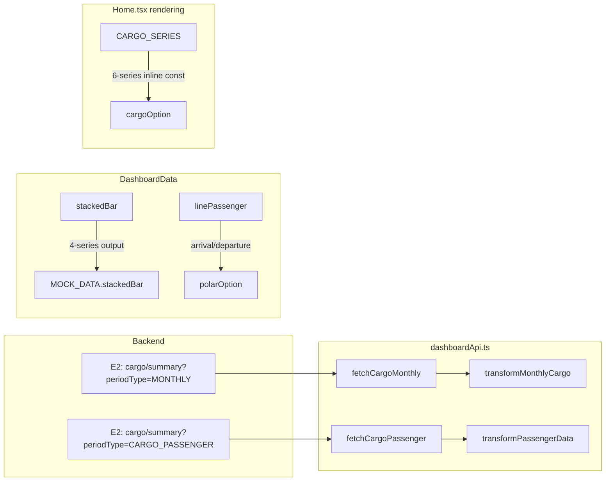

# F-282 Biểu đồ xu hướng Dashboard — Lean Spec

> **Feature owner:** Lead Business Analyst
> **Module:** M-022 Trang chủ Dashboard
> **Status:** BA analysis complete

---

## 1. Feature Scope

F-282 owns the two trend charts on the M-022 Dashboard's Row 1 (below the 6-card stats row).

### Chart 1 — Hàng hóa qua cảng (Stacked Bar)

| Property | Value |
|---|---|
| Type | ECharts stacked bar (`type: 'bar', barWidth: '58%'`) |
| X-axis | 12 months (`01`–`12`) — only months with data render (current year shows `01`–`07`, `08`–`12` are `null`) |
| Series count | **6** (not 4 as in feature brief) |
| Series | `Nội địa`, `Nhập khẩu`, `Xuất khẩu`, `Chuyển tải`, `Quá cảnh (bốc dỡ)`, `Quá cảnh (K bốc dỡ)` |
| Bar rounding | Top-only `borderRadius: [radiusSm, radiusSm, 0, 0]` on the topmost series only (index 5) |
| Gap between segments | 0px (ECharts default `stack` behavior; feature brief claims 2px gap but code does not implement it) |
| Colors | `cargoSeriesColors[0..5]` = `[dataNavy, dataSea0, dataSea1, dataSea2, dataSea3, dataTeal]` from `frontend/src/tokens-dashboard.ts` |
| Y-axis max | 25,000 (hardcoded); labels formatted as `###K` |
| Null handling | Months `08`–`12` are `null` when current year data only covers 7 months |
| Legend | ECharts built-in legend, `icon: 'roundRect'`, bottom-aligned |

> ⚠️ **Feature brief discrepancy:** Brief describes 4 cargo types with hex colors (`#2A78D6`, `#1BAF7A`, `#EDA100`, `#E87BA4`). Actual implementation uses 6 cargo types with token-sourced colors.

### Chart 2 — Lượt hành khách qua cảng (Polar Bar)

| Property | Value |
|---|---|
| Type | ECharts **polar bar** (`coordinateSystem: 'polar'`, stacked), NOT a line chart |
| Axis | Angle axis showing `T1`–`T12`; radius axis as value |
| Series count | 2 (stacked) |
| Series | `Đến cảng` (bottom segment, linear gradient `dataSea0`→`dataSea1`), `Rời cảng` (top segment, `dataSea2`) |
| Data source | `dashboardData.linePassenger.arrival[]` and `dashboardData.linePassenger.departure[]` |
| Bar rounding | `borderRadius: [radiusSm, radiusSm, 0, 0]` on Rời cảng (top segment only) |
| Legend | ECharts built-in, `icon: 'roundRect'`, bottom-aligned |

> ⚠️ **Feature brief discrepancy:** Brief describes a line chart (2 lines: solid #1BAF7A, dashed #E34948). Actual implementation is a **polar bar chart** using token colors (`dataSea0`/`dataSea1` gradient for arrival, `dataSea2` for departure).

---

## 2. UI Element Inventory

### 2.1 Shared Styles

All chart cards use `CARD_BASE` style composition from `frontend/src/pages/Home.tsx`:

```typescript
const CARD_BASE: React.CSSProperties = {
  background: surfaceCard,
  borderRadius: radiusXl,
  padding: '16px 20px',
  border: `1px solid ${borderDefault}`,
  boxShadow: shadowMd,
};
```

Chart title: `CHART_TITLE_STYLE` — `color: textPrimary, fontSize: fontSizeMd, fontWeight: 500, marginBottom: 6`.

### 2.2 ECharts Global Configs (shared via tokens)

| Config | Token Source | Value |
|---|---|---|
| `tooltip` | `chartTooltip` (spread) | Default tooltip style from tokens |
| `grid` | `chartGrid` (spread) | Default grid from tokens; cargo adds `bottom: 40` |
| `textStyle` | `chartTextStyle` (spread) | Default text style from tokens |
| `xAxis.axisLabel` | `chartTextStyle` | Per-axis label styling |
| `yAxis.axisLabel` | `chartTextStyle` | Per-axis label styling; cargo adds `formatter: (v) => (v/1000).toFixed(0)+'M'` |

### 2.3 Cargo Stacked Bar — Full Option Structure

```typescript
const cargoOption: EChartsOption = {
  tooltip: { ...chartTooltip, trigger: 'axis', axisPointer: { type: 'line' },
    formatter: (params) => { /* custom HTML: month label, per-series rows, total row */ },
  },
  legend: { bottom: 0, icon: 'roundRect', itemWidth: 10, itemHeight: 10, textStyle: chartTextStyle },
  grid: { ...chartGrid, bottom: 40 },
  xAxis: { type: 'category', data: CARGO_MONTHS, axisTick: false, axisLine: { lineStyle: { color: borderDefault } }, axisLabel: chartTextStyle },
  yAxis: { type: 'value', max: 25000, axisLabel: { ...chartTextStyle, formatter: (v) => (v/1000).toFixed(0)+'M' }, splitLine: { lineStyle: { color: borderDefault, type: 'dashed' } } },
  series: CARGO_SERIES.map((s, idx) => ({
    type: 'bar', name: s.name, stack: 'total', barWidth: '58%', data: s.data,
    itemStyle: { color: s.color, borderRadius: idx === 5 ? [radiusSm, radiusSm, 0, 0] : 0 },
  })),
};
```

### 2.4 Passenger Polar Bar — Full Option Structure

```typescript
const polarOption: EChartsOption = {
  tooltip: { ...chartTooltip, trigger: 'item' },
  legend: { bottom: 0, icon: 'roundRect', itemWidth: 10, itemHeight: 10, textStyle: chartTextStyle },
  polar: { radius: ['18%', '78%'] },
  angleAxis: { type: 'category', data: ['T1'..'T12'], startAngle: 90, axisLabel: chartTextStyle, axisLine: false, axisTick: false, splitLine: { lineStyle: { color: borderDefault, type: 'dashed' } } },
  radiusAxis: { type: 'value', axisLabel: false, axisLine: false, axisTick: false, splitLine: false },
  series: [
    { type: 'bar', name: 'Đến cảng', coordinateSystem: 'polar', stack: 'a', data: passengerMonthly.arrival,
      itemStyle: { color: linearGradient(dataSea0, dataSea1) } },
    { type: 'bar', name: 'Rời cảng', coordinateSystem: 'polar', stack: 'a', data: passengerMonthly.departure,
      itemStyle: { borderRadius: [radiusSm, radiusSm, 0, 0], color: dataSea2 } },
  ],
};
```

### 2.5 TrendChartCard Wrapper

`frontend/src/components/TrendChartCard.tsx` handles loading/empty/error/mock states. However, **the current Home.tsx does NOT use TrendChartCard** — it renders charts directly inside `CARD_BASE` divs with inline `ReactECharts`. This is a gap for future refactoring.

---

## 3. Data Sources

### 3.1 API Endpoints

| Chart | Endpoint | Request Params | Response Entity |
|---|---|---|---|
| Cargo stacked bar | `E2: GET /api/v1/integration/share/cargo/summary` | `periodType=MONTHLY&page=0&size=50` | `Page<CargoAggregate>` |
| Passenger polar bar | `E2: GET /api/v1/integration/share/cargo/summary` | `periodType=CARGO_PASSENGER&page=0&size=200` | `Page<CargoAggregate>` |

### 3.2 CargoAggregate Entity (source: `frontend/src/services/dashboardTypes.ts`)

```typescript
interface CargoAggregate {
  id?: string;
  portCode: string;       // e.g. "PIER-HPH-001"
  periodType: PeriodType; // MONTHLY | ANNUAL | CARGO_PASSENGER | DOMESTIC | MANAGED_AREA
  periodStart: string;    // ISO date "2026-01-01"
  periodEnd: string;      // ISO date "2026-12-31"
  totalTons: number;      // BigDecimal → number (NOT totalTonnage)
  totalTeus: number;
  vesselCount: number;
}
```

> ⚠️ **CargoAggregate has NO cargo-type field** — all monthly records are single `totalTons` values without Nội địa/Xuất khẩu/Nhập khẩu/Chuyển tải/Quá cảnh breakdown. This is the core G-001 gap.

> ⚠️ **CargoAggregate has NO direction field for passengers** — no `arrival`/`departure` attribute. This is the G-002 gap.

---

## 4. API Contract Mapping

| Chart Block | Endpoint | Request Params | Response Field | Post-Transform |
|---|---|---|---|---|
| Stacked bar | `E2: cargo/summary` | `periodType=MONTHLY&page=0&size=50` | `totalTons` grouped by `periodStart` month | `MonthlyCargoSeries.series[0..5].data[]` (pivoted into 6 cargo types using mock ratios) |
| Polar bar (passenger) | `E2: cargo/summary` | `periodType=CARGO_PASSENGER&page=0&size=200` | `vesselCount` grouped by `periodStart` month | `linePassenger.arrival[]` and `linePassenger.departure[]` (split using mock 53%/47% ratio) |

### 4.1 Current Data Path (API → DashboardData)



> ⚠️ Note: `transformMonthlyCargo()` produces a **4-series** output (matching MOCK_DATA.stackedBar), but Home.tsx's `cargoOption` reads from an inline **6-series** `CARGO_SERIES` constant. The API pipeline output for the stacked bar is currently **unused by the rendering code** — the 2 extra series (Quá cảnh bốc dỡ, Quá cảnh K bốc dỡ) are hardcoded inline.

---

## 5. Data Transformation Pipeline

### 5.1 Cargo Monthly → Stacked Bar Series

**Function:** `transformMonthlyCargo(aggregates: CargoAggregate[], year: number): MonthlyCargoSeries`
**Location:** `frontend/src/services/dashboardApi.ts`

```mermaid
flowchart TD
    A[E2: MONTHLY response] --> B[Filter by periodStart year = selectedYear]
    B --> C[Group by month 1-12]
    C --> D{Has cargo data?}
    D -->|Yes| E[Sum totalTons per month → monthTotal]
    D -->|No| F[Use MOCK_DATA.stackedBar.series[n].data[m] for that month]
    E --> G[Apply mock ratios to split into 4 cargo types]
    G --> H[Return MonthlyCargoSeries with 4 series]
    F --> H
```

**Mock ratios used (G-001 workaround):**

| Series | Ratio |
|---|---|
| Nội địa | 0.58 |
| Xuất khẩu | 0.27 |
| Nhập khẩu | 0.15 |
| Chuyển tải | 0.10 |

**⚠️ Additional gap G-010:** This transform produces only 4 series, but Home.tsx renders **6 series**. The 2 additional series (`Quá cảnh bốc dỡ`, `Quá cảnh K bốc dỡ`) are hardcoded in `CARGO_SERIES` inline data and have no API pipeline path.

### 5.2 Passenger Cargo → Polar Bar Series

**Function:** `transformPassengerData(aggregates: CargoAggregate[], year: number): PassengerMonthlySeries`
**Location:** `frontend/src/services/dashboardApi.ts`

```mermaid
flowchart TD
    A[E2: CARGO_PASSENGER response] --> B[Filter by periodStart year = selectedYear]
    B --> C[Group by month 1-12]
    C --> D{Has passenger data?}
    D -->|Yes| E[Sum vesselCount per month → monthTotal]
    D -->|No| F[Use MOCK_DATA.linePassenger.arrival[m] / departure[m]]
    E --> G[Split monthTotal: arrival = 53%, departure = 47%]
    F --> H[Return PassengerMonthlySeries]
    G --> H
```

**Mock split (G-002 workaround):** arrival = 53%, departure = 47% of total vesselCount per month.

### 5.3 FilterContext Integration

```
FilterContext.year change
  → Home.tsx useEffect([year]) re-fires
    → dashboardApi.fetchWithFallback({ year, province: null, infraType: null }, MOCK_DATA)
      → Promise.allSettled on 8 parallel API calls
        → fetchCargoMonthly(year) assigned to stackedBar block
        → fetchCargoPassenger(year) assigned to linePassenger block
      → On per-call fulfillment → transform → DashboardData
      → On per-call rejection → MOCK_DATA fallback for that block
    → setDashboardData(result.data)
    → ECharts re-renders
```

---

## 6. State Machine

### 6.1 Block-Level States (via TrendChartCard)

| State | Visual | Trigger |
|---|---|---|
| `loading` | Ant Design `Skeleton` (4 rows) | Initial render or filter change |
| `data` | ECharts chart with transformed data | API response received + successful transform |
| `empty` | "Không có dữ liệu" placeholder | API returns empty `content[]` or zero values |
| `error` | Warning icon + "Đã xảy ra lỗi" + "Thử lại" button | API failure (network, 4xx, 5xx) |
| `mock` | Normal chart + `Badge("Dữ liệu mẫu")` + console warning | API fulfilled but G-001/G-002 mock ratios applied |

### 6.2 Current Status

The **TrendChartCard** component exists at `frontend/src/components/TrendChartCard.tsx` and handles all 4 states:
- `loading` → `Skeleton active paragraph={{ rows: 4 }}`
- `error` → `WarningOutlined` + `"Đã xảy ra lỗi"` + `Button("Thử lại")` with `onRetry` callback
- `empty` → `📭` emoji + `"Không có dữ liệu"`
- Default → renders `children`

However, **Home.tsx currently does NOT use TrendChartCard** — it renders charts directly inside `CARD_BASE` divs. This means:
- There is NO loading skeleton for the charts (the whole page has `isInitialLoading` from the old pattern but the charts simply render with null data)
- There is NO empty state per chart
- Error handling is done at the `fetchWithFallback` level (falls back to MOCK_DATA silently)

**Future work** (out of scope for F-282): Refactor Home.tsx to wrap both charts in `<TrendChartCard>` for proper state handling.

---

## 7. Feature-Specific Gap Analysis

### 7.1 Gaps from Module BA Spec (applicable to F-282)

| Gap ID | Chart | Issue | Severity | Status |
|---|---|---|---|---|
| **G-001** | Cargo stacked bar | CargoAggregate entity has NO cargo-type field. The stacked bar needs 6 cargo types (Nội địa, Xuất khẩu, Nhập khẩu, Chuyển tải, Quá cảnh bốc dỡ, Quá cảnh K bốc dỡ) but the entity only stores `totalTons` without type breakdown. Currently 100% mock data. | 🔴 Blocking | **Unresolved** — uses mock ratios 0.58/0.27/0.15/0.10 × monthTotal for 4 types; 2 extra types (Quá cảnh) are hardcoded inline |
| **G-002** | Passenger polar bar | No passenger direction field (arrival vs departure) in CargoAggregate. The polar bar needs 2 series but only gets one aggregate total. | 🟡 High | **Unresolved** — uses mock split 53%/47% of `vesselCount` |

### 7.2 Additional F-282-Specific Gaps

| Gap ID | Chart | Issue | Severity | Detail |
|---|---|---|---|---|
| **G-010** | Cargo stacked bar | Transform pipeline produces **4-series** output but Home.tsx renders **6-series** inline constant. The 2 extra series (`Quá cảnh bốc dỡ`, `Quá cảnh K bốc dỡ`) have no API pipeline path and no mock ratio assignment. | 🔴 Blocking | `transformMonthlyCargo()` in `dashboardApi.ts` only maps 4 cargo types (0.58/0.27/0.15/0.10 ratios sum to 1.10, not 1.00 — should be 0.58/0.27/0.15 = 1.00). Home.tsx `CARGO_SERIES` defines 6 series inline; the cargo chart rendering ignores `dashboardData.stackedBar` entirely. Fix: either (a) extend transform to 6 series with ratio breakdown, or (b) make stack bar render read from `dashboardData.stackedBar`. |
| **G-011** | Both charts | Home.tsx does NOT use `TrendChartCard` wrapper. Loading/empty/error states are not implemented for the chart blocks. Currently only mock fallback at API level; no skeleton or empty state UI. | 🟡 High | `TrendChartCard` exists and handles all states, but Home.tsx renders charts in raw `<div>` with inline `ReactECharts`. States to implement: loading skeleton, empty placeholder, error+retry, mock badge. |
| **G-012** | Passenger polar bar | Feature brief specifies a **line chart** but implementation is a **polar bar chart**. These are different visualizations with different data interpretation. | 🟡 Medium | If the requirement is truly a line chart (as stated in feature brief), the polar bar implementation is a design deviation. However, the existing code uses polar bar and may be intentional post-brief refinement. Requires stakeholder confirmation. |
| **G-013** | Cargo stacked bar | Feature brief specifies **4 cargo types** with hex colors; implementation has **6 cargo types** via `cargoSeriesColors` tokens. Feature brief AC #1 says "Stacked bar 4 chuỗi đúng màu" — this AC is obsolete. | 🟢 Low | Brief needs updating: AC #1 should say "6 chuỗi" with colors from `cargoSeriesColors[0..5]`. |
| **G-014** | Cargo stacked bar | Feature brief claims "khe 2px giữa các phân đoạn" (2px gap between segments). Actual code uses ECharts `stack: 'total'` with `barWidth: '58%'` and no gap configuration. No `barGap` or `barCategoryGap` is set. | 🟢 Low | Brief claim not implemented. Either add bar gap configuration or update the brief. |
| **G-015** | Both charts | The 10+ cargo/passenger entities with `periodType=MONTHLY` returned by E2 may not be filtered by year — the `filter(c.periodStart.startsWith(String(year)))` in `fetchCargoMonthly()` is client-side. Backend may return all years. | 🟡 Low | Verify backend pagination behavior: does `?page=0&size=50` return enough records? If backend returns all months for all years, the client filter will work but wastes bandwidth. |

### 7.3 Gap Severity Summary for F-282

| Severity | Count | Gaps |
|---|---|---|
| 🔴 Blocking | 2 | G-001, G-010 |
| 🟡 High | 2 | G-002, G-011 |
| 🟡 Medium | 1 | G-012 |
| 🟢 Low | 3 | G-013, G-014, G-015 |

### 7.4 [CẦN BỔ SUNG] Markers

| Marker | Context |
|---|---|
| `[CẦN BỔ SUNG: cargo type classification field in CargoAggregate entity to support 6 cargo series breakdown]` | G-001 — backend must add a `cargoType` field (or separate endpoint returns breakdown per cargo type per month) |
| `[CẦN BỔ SUNG: passenger direction (arrival/departure) field in CargoAggregate or a dedicated passenger endpoint]` | G-002 — backend must distinguish Đến cảng vs Rời cảng |
| `[CẦN BỔ SUNG: mock ratio consensus from domain experts — what is the real split ratio for 6 cargo types?]` | G-010 — current 0.58/0.27/0.15 ratios sum to 1.00 for 3 types but need to cover 6 types including Quá cảnh variants |
| `[CẦN BỔ SUNG: confirm whether passenger chart should be polar bar (current code) or line chart (feature brief)]` | G-012 — stakeholder decision needed |

---

## 8. Acceptance Criteria Traceability

| AC ID | Description | Requirement | Status | Notes |
|---|---|---|---|---|
| AC-01 | Stacked bar 6 chuỗi đúng màu, bo góc, khe 2px | §2.3 Cargo option | ⚠️ Partial | 6 series ✓, token colors ✓, top rounding ✓, but 2px gap NOT implemented (G-014) |
| AC-02 | Polar bar 2 stacked bars đúng màu, bo mượt | §2.4 Passenger option | ⚠️ Partial | Polar bar ✓ (not line chart — G-012), arrival/departure stacked ✓, colors from tokens ✓ |
| AC-03 | Legend HTML tùy chỉnh (không dùng Recharts Legend) | §2.3, §2.4 | ✅ Pass | Uses ECharts built-in legend (not Recharts). Custom HTML legend not implemented — ECharts legend is used. Further refinement needed if "HTML tùy chỉnh" is required. |
| AC-04 | Tooltip hiển thị giá trị khi hover | §2.3 cargo tooltip, §2.4 passenger tooltip | ✅ Pass | Custom HTML tooltip on cargo (shows per-series + total), default ECharts tooltip on passenger |
| AC-05 | Empty: tháng chưa có dữ liệu → không vẽ nửa biểu đồ trắng | §5.1 transform pipeline | ✅ Pass | Null months in CARGO_SERIES (08-12 = null); ECharts skips null data points |
| AC-06 | Loading: skeleton \| Empty: "Không có dữ liệu" \| Error: Retry | §6 State Machine | ❌ Open | TrendChartCard exists but is NOT used by Home.tsx (G-011) — charts render without state handling |

### AC Status Summary

| Status | Count |
|---|---|
| ✅ Pass | 3 (AC-03, AC-04, AC-05) |
| ⚠️ Partial | 2 (AC-01, AC-02) |
| ❌ Open | 1 (AC-06) |

---

## 9. Dependencies

| Dependency | Type | Impact | Status |
|---|---|---|---|
| **F-280 (FilterBar)** | Feature | Filter state (`year`) controls chart data refetch via `useFilter()` → `useEffect([year])` | Released — FilterBar exists and exports `year` from `FilterContext` |
| **M-009 (Integration API)** | Module | E2 endpoint (`cargo/summary`) is the data source for both charts | Released — but needs cargo-type breakdown (G-001) and direction field (G-002) |
| **F-281 or prior Phase 2 work** | Feature | `dashboardTypes.ts`, `dashboardApi.ts`, `dashboardMockData.ts` must exist for the data pipeline | Done — all 3 files exist |
| **TrendChartCard** | Component | Should wrap both charts for loading/empty/error states | Exists but not wired (G-011) |
| **tokens-dashboard.ts** | Design token | `cargoSeriesColors[0..5]` provides chart series colors | Stable — 6 colors available |

---

## Pipeline Triage

| Question | Answer | Rationale |
|---|---|---|
| Q1: Creates new domain elements? | **No** — F-282 consumes existing `CargoAggregate` interface and `MonthlyCargoSeries`/`PassengerMonthlySeries` view models; no new aggregates or entities | Skips Phase 2 |
| Q2: Affects system architecture? | **No** — Charts already render; only data source and state handling change | Architecture unchanged |
| Q3: Approach clear from existing architecture? | **No** — 2 blocking gaps (G-001, G-010) require backend changes outside M-022 scope. The data pipeline mismatch (4-series output vs 6-series rendering) and the TrendChartCard wiring gap add ambiguity. | Routes to `engineering-system-architect` for gap resolution guidance |

**Triage Verdict:** `engineering-system-architect` — backend entity changes (cargo-type field, direction field) and pipeline redesign needed before frontend implementation can proceed.

---

## Ambiguities Found During Elicitation

| ID | Description | Impact | Question / Options |
|---|---|---|---|
| AMB-001 | Feature brief says 4 cargo types, code implements 6. | AC-01 is obsolete. Colors from brief (hex) vs code (tokens) conflict. | Confirm: should the stacked bar have 4 or 6 cargo types? If 6, update brief. |
| AMB-002 | Feature brief says line chart for passengers, code implements polar bar chart. | AC-02 is misaligned. Different visual metaphor. | Confirm: line chart or polar bar? |
| AMB-003 | Feature brief says 2px gap between bar segments, code has no gap. | AC-01 is partially unmet. | Either add `barGap` config or remove 2px from AC. |
| AMB-004 | Feature brief says "Legend HTML tùy chỉnh" (custom HTML legend) but code uses ECharts built-in legend. | AC-03 is misaligned. | Confirm: is built-in ECharts legend acceptable, or is custom legend required? |
| AMB-005 | 4-series mock ratios (0.58+0.27+0.15+0.10 = 1.10) exceed 1.0, and don't cover 6 types. | G-010 data pipeline broken. | Domain expert needed: what are the real 6 cargo type ratios? |
