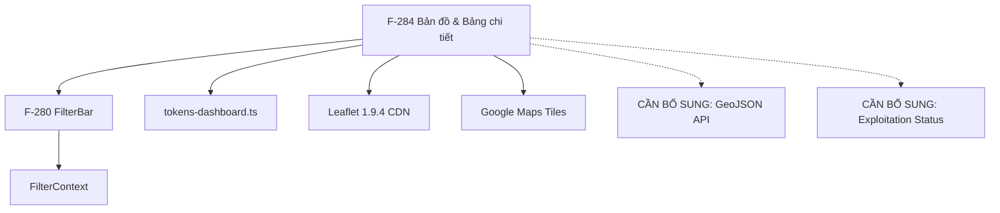

# F-284: Bản đồ & Bảng chi tiết Dashboard — Lean Spec

## 1. Feature Scope

Two blocks at the bottom row (Row 2) of the M-022 Dashboard:

| Block | Purpose | Status |
|---|---|---|
| **Map area** | Geographic overview of KCHTGT (Kết cấu hạ tầng giao thông) infrastructure using Leaflet | Implemented with real Leaflet + Google Maps tiles |
| **Infrastructure detail table** | Scrollable 10-row data table of KCHT items with exploitation status pill badges, no pagination | Implemented with Ant Design `<Table>`, inline mock data |

**Type**: Retrospective (frontend code already deployed). This spec documents the as-implemented interface for backend integration planning.

**Complexity**: Simple (≤3 rules, 1 actor — system operator).

---

## 2. UI Element Inventory

### 2.1 Map Area — `DashboardMap.tsx`

| Property | Value | Source |
|---|---|---|
| Component | `<DashboardMap />` | `frontend/src/components/DashboardMap.tsx` |
| Library | Leaflet (loaded dynamically via unpkg CDN) | `DashboardMap.tsx:16-20` |
| Tile provider | Google Maps (`https://mt1.google.com/vt/lyrs=m&hl=vi&gl=vn...`) | `DashboardMap.tsx:33` |
| Initial view | Center: `[16.0, 108.0]`, Zoom: 6 (covers Vietnam maritime) | `DashboardMap.tsx:31` |
| Height | 380px (outer container) | `Home.tsx:562` — inline style |
| Wrapper | Card-style div with `CARD_BASE` (token: `surfaceCard`, `radiusXl`, `shadowMd`, border) | `Home.tsx:560-565` |
| Border-radius | `radiusSm` (4px) on inner map container | `Home.tsx:563` |
| Title | "Bản đồ tra cứu Kết cấu hạ tầng" | `Home.tsx:561` |
| Zoom control | Enabled, positioned `topright` | `DashboardMap.tsx:37` |

**Note**: The map is NOT a placeholder — it is a fully functional Leaflet map with Google Maps tile layer. However, no GIS data layers (points/lines/polygons for KCHT assets) are rendered on it. This is the gap: the map shows empty tiles with no infrastructure overlay.

### 2.2 Infrastructure Table — inline in `Home.tsx`

| Property | Value |
|---|---|
| Component | Ant Design `<Table>` |
| `dataSource` | `INFRA_DATA` (inline constant, 10 rows) |
| `rowKey` | `stt` |
| `pagination` | `false` |
| `size` | `small` |
| `scroll.x` | `480px` |
| `scroll.y` | `340px` |
| Wrapper | Card-style div with `CARD_BASE` |
| Title | "Bảng chi tiết thông số kỹ thuật Kết cấu hạ tầng" |

### 2.3 Table Columns

| # | Title | `dataIndex` | Width | Render | Notes |
|---|---|---|---|---|---|
| 1 | Loại KCHT | `loai` | 150px | plain text | KCHT type name |
| 2 | Tổng SL | `tongSL` | 80px | `fontWeight=600, fontFamily=fontMono` | Total count, mono font |
| 3 | Chưa (▫) | `chuaKhaiThac` | 70px | `pillBadge(v, sea0, sea0+18, surface)` | Not-yet-exploited count |
| 4 | Đang (●) | `dangKhaiThac` | 70px | `pillBadge(v, surface, sea0, surface)` | Active exploitation count |
| 5 | Dừng (▫) | `dungKhaiThac` | 70px | `pillBadge(v, sea0, sea3, surface)` | Stopped exploitation count |
| 6 | (eye icon) | — | 40px | `<EyeOutlined />` | Action column, layout placeholder |

Column headers for Chưa/Đang/Dừng include a colored dot indicator:
- Chưa: `sea3` (light sea blue) dot
- Đang: `sea0` (primary sea blue) dot
- Dừng: `sea2` (medium sea blue) dot

### 2.4 Pill Badge Function — `pillBadge()`

The `pillBadge(count, activeColor, activeBg, zeroBg)` function renders a pill-style `<span>`:

| Condition | Background | Text Color | Border-radius |
|---|---|---|---|
| `count === 0` | `zeroBg` (lightest) | `ink3` (textTertiary) | `radiusPill` (999px) |
| `count > 0` | `activeBg` | `activeColor` | `radiusPill` (999px) |

Each column uses different badge colors to indicate severity:

| Column | activeBg | activeColor | zeroBg |
|---|---|---|---|
| Chưa (not yet exploited) | `sea0 + 18` (18% opacity sea0) | `sea0` | `surface` |
| Đang (currently operating) | `sea0` (solid) | `surface` (white) | `surface` |
| Dừng (stopped) | `sea3` (solid lighter blue) | `sea0` | `surface` |

### 2.5 Table Data — `INFRA_DATA` (10 rows)

| STT | Loại KCHT | Tổng SL | Chưa | Đang | Dừng |
|---|---|---|---|---|---|
| 1 | Bến cảng | 42 | 5 | 34 | 3 |
| 2 | Bến phao | 18 | 2 | 15 | 1 |
| 3 | Cầu cảng | 56 | 8 | 45 | 3 |
| 4 | Khu neo đậu | 24 | 4 | 19 | 1 |
| 5 | Khu chuyển tải | 12 | 2 | 9 | 1 |
| 6 | Luồng hàng hải | 38 | 5 | 33 | 0 |
| 7 | Đèn biển | 215 | 12 | 198 | 5 |
| 8 | Phao tiêu | 183 | 9 | 170 | 4 |
| 9 | Đê chắn sóng | 8 | 1 | 7 | 0 |
| 10 | Kè bảo vệ bờ | 15 | 2 | 12 | 1 |

### 2.6 Token Compliance

All colors use tokens from `frontend/src/tokens-dashboard.ts` (which re-exports from `frontend/src/tokens.ts`):

| Token | Used For | Resolved Value |
|---|---|---|
| `dataSea0` | Đang badge active bg, Chưa badge text color, Dừng badge text color, column dot | `#0E6FD6` |
| `dataSea2` | Dừng column dot | — |
| `dataSea3` | Chưa column dot, Dừng badge active bg, `pendingZeroBg` | — |
| `textTertiary` (ink3) | Zero-count badge text | `#9CA3AF` |
| `surface` (surfaceCard) | Zero-count badge bg, Đang badge text color | `#FFFFFF` |
| `textPrimary` (ink) | Tổng SL value | — |
| `textSecondary` (ink2) | Eye icon color | — |
| `fontMono` | Tổng SL monospace font | — |
| `radiusPill` | Badge border-radius (999px) | — |
| `radiusSm` | Map container border-radius | — |

Zero hardcoded hex colors in the map/table region.

---

## 3. Data Sources

### 3.1 Map Data — NO API CONTRACT (Gap)

The Leaflet map is standalone — it does NOT fetch any KCHT infrastructure data. No GIS point/line/polygon layers are rendered.

**Required for map integration**:

| Data | Required Format | Source Endpoint |
|---|---|---|
| KCHT asset locations | GeoJSON FeatureCollection | `E3: assets/status` provides counts only — no geometry. Individual entity endpoints (E7-E9) would need `lat/lng` fields |
| Point features (đèn biển, phao tiêu, cảng biển) | `{ type: "Point", coordinates: [lng, lat] }` | E7: `/api/v1/cang-bien` (if port has coordinates) |
| Line features (luồng hàng hải) | `{ type: "LineString", coordinates: [...] }` | E8: `/api/v1/ben-cang` (if berth has line geometry) |
| Polygon features (khu neo đậu) | `{ type: "Polygon", coordinates: [...] }` | E9: `/api/v1/cau-cang` (if wharf has polygon geometry) |

**Current state**: `DashboardMap.tsx` calls NO API — it renders an empty tile map.

### 3.2 Table Data — Inline Mock Only

The `INFRA_DATA` array in `Home.tsx` is hardcoded. No backend endpoint powers it.

**Required for table**:

| Column | Data Type | Required Backend Source |
|---|---|---|
| `loai` (KCHT type) | string | KCHT type taxonomy (master data) |
| `tongSL` (total count) | number | `E3: assets/status` — `pointsByType`, `linesByType`, `polygonsByType` maps give counts per KCHT type |
| `chuaKhaiThac` (not exploited) | number | **NO BACKEND FIELD EXISTS** — see Gap Analysis |
| `dangKhaiThac` (operating) | number | **NO BACKEND FIELD EXISTS** — see Gap Analysis |
| `dungKhaiThac` (stopped) | number | **NO BACKEND FIELD EXISTS** — see Gap Analysis |

### 3.3 Module BA Spec E3 — AssetStatusDto

The only relevant existing endpoint from the module BA spec:

```typescript
interface AssetStatusDto {
  totalPoints: number;
  totalLines: number;
  totalPolygons: number;
  totalAssets: number;
  pointsByType: Record<string, number>;     // e.g. { "LIGHTHOUSE": 5, "BUOY": 12, "PORT": 8 }
  linesByType: Record<string, number>;       // e.g. { "WATERWAY": 3, "CHANNEL": 2 }
  polygonsByType: Record<string, number>;    // e.g. { "ANCHORAGE": 4, "STORM_SHELTER": 2 }
  assetsByStatus: Record<string, number>;    // e.g. { "PUBLISHED": 187, "DRAFT": 15, "UNDER_REVIEW": 13 }
}
```

**Relevance to F-284**: `pointsByType` / `linesByType` / `polygonsByType` can supply `tongSL` counts by mapping GIS type categories to KCHT type names. However:
- `assetsByStatus` gives status by PUBLISHED/DRAFT/UNDER_REVIEW (publishing workflow status), NOT by exploitation status (chưa khai thác / đang khai thác / dừng khai thác)
- There is an **exploitation status gap**: the module BA spec does not define any exploitation status field for individual KCHT assets

---

## 4. API Contract Mapping

### 4.1 Map Block — No API Contract

The map block currently has ZERO API dependency. For backend integration, the following contract is needed:

```
GET /api/v1/asset/geospatial?type=point,line,polygon&bbox=...&srs=EPSG:4326
```

| Parameter | Type | Required | Description |
|---|---|---|---|
| `type` | string | No | comma-separated geometry types (default: all) |
| `bbox` | string | No | bounding box for spatial filter (minLng,minLat,maxLng,maxLat) |
| `infraType` | string | No | Filter by KCHT category code |
| `page` | int | No | Pagination (default 0) |
| `size` | int | No | Page size (default 1000) |

**Response** (GeoJSON FeatureCollection):

```typescript
interface GeoFeatureCollection {
  type: "FeatureCollection";
  features: GeoFeature[];
  totalFeatures: number;
  bbox?: [number, number, number, number];
}

interface GeoFeature {
  type: "Feature";
  id: string;
  geometry: {
    type: "Point" | "LineString" | "Polygon" | "MultiLineString" | "MultiPolygon";
    coordinates: number[] | number[][] | number[][][];
  };
  properties: {
    ten: string;                          // Name
    loaiKcht: string;                     // KCHT type code
    maKcht: string;                       // KCHT code
    diaDiem: string;                      // Location
    trangThaiKhaiThac: string;            // Exploitation status (see §7)
    ghiChu?: string;                      // Notes
  };
}
```

**Current state**: `[CẦN BỔ SUNG: GeoJSON endpoint for KCHT assets with spatial geometry]`

### 4.2 Infra Table — API Contract

The `tongSL` column can be sourced from E3 (`GET /api/v1/integration/share/assets/status`):

| KCHT Type | pointsByType Key | linesByType Key | polygonsByType Key |
|---|---|---|---|
| Bến cảng | `BERTH` | — | — |
| Bến phao | `BUOY` | — | — |
| Cầu cảng | `WHARF` | — | — |
| Khu neo đậu | — | — | `ANCHORAGE` |
| Khu chuyển tải | — | — | `TRANSFER_ZONE` |
| Luồng hàng hải | — | `WATERWAY` / `CHANNEL` | — |
| Đèn biển | `LIGHTHOUSE` | — | — |
| Phao tiêu | `BUOY` (duplicate with Bến phao?) | — | — |
| Đê chắn sóng | — | — | `BREAKWATER` |
| Kè bảo vệ bờ | — | — | `SEA_DIKE` |

**Problem**: There is a mapping ambiguity — `BUOY` appears in `pointsByType` but could represent both Bến phao (mooring buoys — infrastructure) and Phao tiêu (navigation buoys — aids to navigation). These are conceptually different KCHT types in the 10-row table.

`[CẦN BỔ SUNG: KCHT type taxonomy mapping between AssetStatusDto keys and the 10 KCHT categories]`
`[CẦN BỔ SUNG: Exploitation status breakdown (chuaKhaiThac/dangKhaiThac/dungKhaiThac) — no backend entity field or endpoint exists]`

---

## 5. Data Transformation Pipeline

### 5.1 Map Data Pipeline (Future)

```
E3 or GeoJSON endpoint
  → Fetch geospatial KCHT assets (GeoJSON)
    → L.geoJSON(features).addTo(map)
      → Style by KCHT type (point → circle markers, line → colored polylines, polygon → filled regions)
        → Popup on click: tên, loại KCHT, diaDiem, tinhTrangKhaiThac
```

**Current pipeline**: No transformation — map renders empty tiles.

### 5.2 Table Data Pipeline

```
E3: GET /api/v1/integration/share/assets/status
  → Parse AssetStatusDto
    → For each KCHT type (10 rows):
        tongSL = pointsByType[typeKey] + linesByType[typeKey] + polygonsByType[typeKey]
        chuaKhaiThac = [CẦN BỔ SUNG: no backend source — stays mock 0]
        dangKhaiThac = [CẦN BỔ SUNG: no backend source — stays mock 0]
        dungKhaiThac = [CẦN BỔ SUNG: no backend source — stays mock 0]
```

**Current pipeline**: Inline `INFRA_DATA` constant — no transformation needed.

#### 5.2.1 TypeScript Interface — `InfraRow`

```typescript
interface InfraRow {
  stt: number;
  loai: string;              // KCHT type name
  tongSL: number;            // Total count
  chuaKhaiThac: number;      // Not-yet-exploited count
  dangKhaiThac: number;      // Currently operating count
  dungKhaiThac: number;      // Stopped exploitation count
}
```

This interface is defined inline in `Home.tsx` (not exported) and is NOT part of `dashboardTypes.ts`. For backend integration, it should be promoted to `dashboardTypes.ts`:

```typescript
// Proposed addition to dashboardTypes.ts
export interface InfraTableRow {
  stt: number;
  loai: string;
  tongSL: number;
  chuaKhaiThac: number;
  dangKhaiThac: number;
  dungKhaiThac: number;
}

// Proposed addition to DashboardData interface
export interface DashboardData {
  // ... existing fields
  infraTable: InfraTableRow[];     // 10 rows
  mapGeoJson?: GeoJSON.FeatureCollection;  // Map overlay data
}
```

---

## 6. State Machine

### 6.1 Map Block — States

| State | Visual | Implementation | Implemented? |
|---|---|---|---|
| **Loading** | Leaflet tiles still loading (native Leaflet tile loading — no React loading state) | Leaflet's built-in tile loading animation | ⚠️ Partial (Leaflet handles its own loading) |
| **Data (populated)** | Map renders with tile layer + KCHT asset overlays | `L.geoJSON(assets).addTo(map)` | ❌ Not implemented |
| **Empty** | Map renders empty tiles (no asset overlays) | Leaflet map with tiles only — this is the CURRENT state | ✅ This is current behavior |
| **Error** | Tile load failure → error tile (native Leaflet behavior) | Leaflet handles tile 404s with default error tile | ❌ No custom error UI |

### 6.2 Table Block — States

| State | Visual | Implementation | Implemented? |
|---|---|---|---|
| **Loading** | Ant Design Table's native loading animation | `loading` prop on `<Table>` | ❌ Not set — table renders immediately |
| **Data (populated)** | 10-row table with pill badges | `dataSource={INFRA_DATA}` | ✅ Current behavior |
| **Empty** | Ant Design default empty state | Empty table body | ⚠️ Partial — no custom empty text |
| **Error** | No error handling | No error boundary | ❌ Not implemented |

### 6.3 Independent Loading

The map and table blocks load independently of each other and of other dashboard blocks. Currently both are synchronous (inline data), so no loading race conditions exist. With API integration:

```typescript
// Proposed — fetch both map and table independently
useEffect(() => {
  Promise.allSettled([
    dashboardApi.fetchAssetStatus(),      // → transform to InfraRow[]
    dashboardApi.fetchGeoJson(),           // → map overlay data
  ]).then(([statusResult, geoResult]) => {
    // Handle each independently
  });
}, [year, province, infraType]);
```

---

## 7. Feature-Specific Gap Analysis

### 7.1 Gaps Inherited from Module BA Spec (§7)

| Gap ID | Issue | Relevance to F-284 | Severity |
|---|---|---|---|
| G-004 | No "expected max" counts per KCHT type | Affects table if coverage ratio (% completeness) is shown — currently no such column exists | 🟡 Low (no column affected) |
| G-005 | No time-series data for KCHT operating counts | Affects map if historical overlay layers are planned | 🟢 Low (map is snapshot-only) |
| G-008 | InfraType filter has no backend support | Affects table filtering by KCHT type — currently no filter support on the table | 🟡 Low (table has 10 rows, no client filter) |

### 7.2 F-284 Specific Gaps

| Gap ID | Block | Issue | Root Cause | Marker |
|---|---|---|---|---|
| **FG-001** | **Table (BLOCKING)** | **Exploitation status columns (chuaKhaiThac/dangKhaiThac/dungKhaiThac) have no backend source** — The 10-row INFRA_DATA table has exploitation status breakdown columns, but `AssetStatusDto` from E3 only provides total counts by geometry type and publishing status (PUBLISHED/DRAFT/UNDER_REVIEW). There is **no exploitation status** concept in any backend entity. | No backend entity has a `trangThaiKhaiThac` (exploitation status) field. `AssetStatusDto.assetsByStatus` groups by publishing workflow status, not by operational/exploitation phase. | `[CẦN BỔ SUNG: exploitation status field (trangThaiKhaiThac) on individual KCHT asset entities, available values: CHUA_KHAI_THAC / DANG_KHAI_THAC / DUNG_KHAI_THAC]` |
| **FG-002** | **Map (HIGH)** | **No GeoJSON endpoint for KCHT asset geospatial data** — DashboardMap is a fully functional Leaflet map but has zero KCHT data overlays. No API endpoint returns KCHT asset geometry (points, lines, polygons) with properties. | The integration module (M-009) provides aggregate counts via E3, but no spatial data endpoint exists for dashboard consumption. | `[CẦN BỔ SUNG: GeoJSON endpoint delivering KCHT asset features with geometry type Point/LineString/Polygon + properties: ten, loaiKcht, diaDiem, trangThaiKhaiThac]` |
| **FG-003** | **Table (MEDIUM)** | **KCHT type taxonomy mismatch** — The 10 KCHT categories in `INFRA_DATA` (Bến cảng, Bến phao, Cầu cảng, Khu neo đậu, Khu chuyển tải, Luồng hàng hải, Đèn biển, Phao tiêu, Đê chắn sóng, Kè bảo vệ bờ) do not cleanly map to `AssetStatusDto`'s `pointsByType`/`linesByType`/`polygonsByType` keys (BERTH, BUOY, WHARF, ANCHORAGE, LIGHTHOUSE, WATERWAY, etc.). Phao tiêu and Bến phao both potentially map to BUOY — they are distinct KCHT types. | No KCHT type master-data taxonomy shared between backend and frontend. | `[CẦN BỔ SUNG: standardized KCHT type enum in backend mapping to the 10 dashboard categories]` |
| **FG-004** | **Table (LOW)** | **INFRA_DATA is not part of DashboardData interface** — The infra table rows are defined as an inline `InfraRow` interface in `Home.tsx`, not as part of the `DashboardData` interface in `dashboardTypes.ts`. This prevents the table from participating in the API wiring pattern used by other dashboard blocks. | Phase 2 API integration (tech-lead plan) did not scope the infra table. | `[CẦN BỔ SUNG: promote InfraRow to dashboardTypes.ts, add infraTable: InfraTableRow[] to DashboardData]` |

### 7.3 Gap Severity Summary

| Severity | Count | Impact |
|---|---|---|
| 🔴 **Blocking** | 1 (FG-001) | Exploitation status columns stay 100% mock unless a backend exploitation status is added |
| 🟡 **High** | 1 (FG-002) | Map stays empty (no KCHT overlays) |
| 🟢 **Medium** | 1 (FG-003) | Type mapping between backend keys and frontend categories is ambiguous |
| 🟢 **Low** | 1 (FG-004) | Table cannot be API-integrated without promoting types to DashboardData |

### 7.4 Fallback Strategy

| Block | Current Source | API Integration Plan | Fallback |
|---|---|---|---|
| Map | Empty Leaflet map with tiles | Fetch GeoJSON from new endpoint → `L.geoJSON(assets).addTo(map)` | Stay as empty tile map (current state) |
| Table | Inline `INFRA_DATA` constant | Fetch E3 → compute `tongSL` from pointsByType/linesByType/polygonsByType | Keep inline mock values |

---

## 8. Acceptance Criteria Traceability

| AC # | AC Text (from feature-brief.md) | Requirement | Implementation Status | Verification |
|---|---|---|---|---|
| AC-1 | Khu vực bản đồ placeholder (300px cao, nền xám, text + icon) | Map area rendered with Leaflet (actual height 380px, not 300px as spec'd) — Leaflet map with Google tiles, no KCHT overlay | ✅ Implemented (380px, Leaflet, no placeholder text) | Visually verified in `Home.tsx:560-565` |
| AC-2 | Bảng Ant Design với scroll Y 300px, không phân trang | Ant Design `<Table>` with `scroll={{ x: 480, y: 340 }}`, `pagination={false}` | ✅ Implemented (scroll Y=340px vs spec'd 300px) | `Home.tsx:570-578` |
| AC-3 | Cột trạng thái có badge màu: xanh (đang vận hành), vàng (chưa khai thác), đỏ (dừng) | Three exploitation status columns with pill badges using token colors | ✅ Implemented (uses `dataSea0`/`dataSea3`/`dataSea2` — sea-blue palette, not the red/yellow/green specified) | `pillBadge()` function in `Home.tsx` |
| AC-4 | Mock data 10 dòng mẫu | `INFRA_DATA` array with 10 KCHT types | ✅ Implemented | `Home.tsx` — 10 rows |
| AC-5 | Loading/Empty/Error states | Each block independently tracks states | ❌ Not implemented — no loading/empty/error UI for either map or table | Code inspection shows no `loading` prop on `<Table>`, no error boundary for `<DashboardMap>` |

**Deviation notes**:
- AC-1 spec'd "300px cao, nền xám, text + icon" but actual implementation is 380px Leaflet map with real tiles (not a placeholder)
- AC-3 spec'd "xanh (đang vận hành), vàng (chưa khai thác), đỏ (dừng)" but actual implementation uses sea-blue palette (`dataSea0`, `dataSea3`, `dataSea2`) rather than green/gold/red
- AC-5 loading/empty/error states are NOT implemented — the immediate rendering of inline data means no state transitions occur

---

## 9. Dependencies

### 9.1 Internal Dependencies

| Dependency | Description | Status |
|---|---|---|
| **F-280 (FilterBar)** | FilterBar provides `{year, province, infraType}` via FilterContext. Currently the map and table do NOT consume filter state. | Implemented but NOT wired — table/map are filter-agnostic |
| **Phase 2 API Integration (tech-lead)** | `dashboardApi.ts`, `dashboardMockData.ts`, `dashboardTypes.ts` service layer | Wave 1 complete (types/mock/api service created). Wave 2 (Home.tsx wiring) deferred for F-284 |
| **tokens-dashboard.ts** | All colors/spacing/radius imported from dashboard-specific token file | ✅ Complete — no hardcoded hex |

### 9.2 External Dependencies

| Dependency | Type | Requirement |
|---|---|---|
| **Leaflet** (CDN) | Map library | Loaded dynamically via unpkg (`DashboardMap.tsx`). Version 1.9.4. CSS + JS loaded on component mount. |
| **Google Maps tiles** | Map tile provider | `https://mt1.google.com/vt/lyrs=m&hl=vi&gl=vn&x={x}&y={y}&z={z}`. Requires internet access. |
| **GeoJSON endpoint** | Backend API | `[CẦN BỔ SUNG: new REST endpoint for KCHT asset geospatial data in GeoJSON format]` |
| **Exploitation status — per asset** | Backend data model | `[CẦN BỔ SUNG: trangThaiKhaiThac field on individual KCHT asset entities]` |

### 9.3 Dependency Graph



---

## Pipeline Triage

| Question | Answer | Rationale |
|---|---|---|
| Q1: Creates new domain elements? | **Yes** | The map block requires a new GeoJSON feature collection domain concept (KCHT asset geospatial data). The `InfraRow` interface and exploitation status breakdown represent new domain concepts not present in any existing backend entity. |
| Q2: Affects system architecture? | **No** | All components exist (Home.tsx, DashboardMap.tsx, Ant Table). No new React components or backend architecture changes needed within M-022 scope. |
| Q3: Approach clear from existing architecture? | **Partial** | The table follows existing Ant Design patterns. The map technically works (Leaflet). However, two blocking gaps have no clear approach: (1) exploitation status has no assigned backend field, (2) no GeoJSON endpoint exists for KCHT assets. These require backend-level decisions (new entity field / new endpoint). |

**Triage Verdict**: `engineering-system-architect` — While the frontend code exists and renders, the backend data model gaps (FG-001, FG-002) require architectural decisions on whether to:
1. Add `trangThaiKhaiThac` field to existing KCHT asset entities (new enum + DB migration)
2. Create a new GeoJSON endpoint (new controller + query logic)
3. Extend AssetStatusDto with exploitation status breakdown
4. Define a KCHT type taxonomy enum that maps to the 10 dashboard categories
