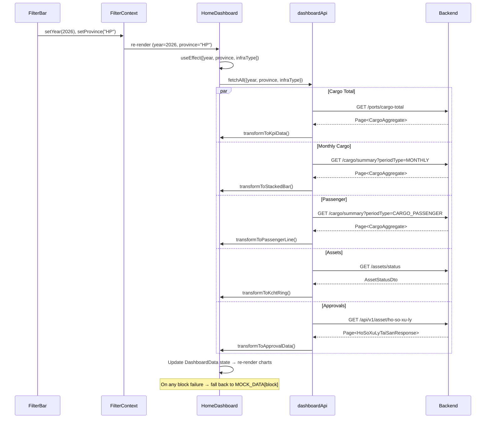
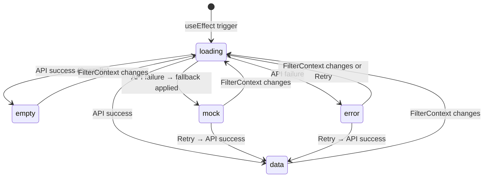

# M-022 Trang chủ Dashboard — API Integration Lean Spec

> **Phase 2 — API Wave.** Maps every dashboard UI element to a live backend API endpoint. UI exists with hardcoded mock data; this spec defines the wiring contract.

---

## Table of Contents

1. [API Contract Mapping](#1-api-contract-mapping)
2. [TypeScript Interfaces](#2-typescript-interfaces)
3. [Data Transformation Pipeline](#3-data-transformation-pipeline)
4. [Year-over-Year Delta](#4-year-over-year-delta)
5. [FilterContext Integration](#5-filtercontext-integration)
6. [State Machine](#6-state-machine)
7. [Gap Analysis](#7-gap-analysis)

---

## 1. API Contract Mapping

### 1.1 Base URL

```
/api/v1/integration/share    — Integration sharing endpoints (M-009)
/api/v1/asset                — Asset/approval endpoints
```

### 1.2 Response Envelope

All endpoints return the standard `ApiResponse<T>` wrapper:

```typescript
interface ApiResponse<T> {
  success: boolean;
  message: string;
  data: T;
  timestamp: string;          // ISO 8601 LocalDateTime
}
```

Paginated responses wrap data inside `Page<T>`:

```typescript
interface Page<T> {
  content: T[];               // The actual items
  page: number;
  size: number;
  totalElements: number;
  totalPages: number;
}
```

### 1.3 Endpoint Catalog

| # | Method | Path | Description | Source Controller |
|---|--------|------|-------------|-------------------|
| E1 | GET | `/api/v1/integration/share/ports/cargo-total` | Annual cargo totals (hardcoded periodType=ANNUAL) | `PortCargoShareController.java:216` |
| E2 | GET | `/api/v1/integration/share/cargo/summary` | Filtered cargo aggregates by portCode + periodType | `PortCargoShareController.java:236` |
| E3 | GET | `/api/v1/integration/share/assets/status` | Summary counts: Points, Lines, Polygons by type/status | `PortCargoShareController.java:113` |
| E4 | GET | `/api/v1/integration/share/info/comprehensive` | Global system stats: assets, connections, sync jobs | `PortCargoShareController.java:145` |
| E5 | GET | `/api/v1/integration/share/info/maintenance` | Paginated list of non-published assets (draft/review) | `PortCargoShareController.java:182` |
| E6 | GET | `/api/v1/asset/ho-so-xu-ly` | Asset processing dossiers with taiSanId & loaiXuLy filters | `HoSoXuLyTaiSanController.java:44` |
| E7 | GET | `/api/v1/cang-bien` | Port/seaport CRUD | `CangBienController.java` |
| E8 | GET | `/api/v1/ben-cang` | Berth CRUD | `BenCangController.java` |
| E9 | GET | `/api/v1/cau-cang` | Wharf CRUD | `CauCangController.java` |

### 1.4 Entity: CargoAggregate

Source: `CargoAggregate.java`

```typescript
interface CargoAggregate {
  id?: string;                        // UUID
  portCode: string;                   // e.g. "PIER-HPH-001"
  periodType: PeriodType;             // MONTHLY | ANNUAL | CARGO_PASSENGER | DOMESTIC | MANAGED_AREA
  periodStart: string;                // ISO date, e.g. "2026-01-01"
  periodEnd: string;                  // ISO date, e.g. "2026-12-31"
  totalTons: number;                  // BigDecimal → number (Tổng tấn, **không** phải "totalTonnage")
  totalTeus: number;                  // BigDecimal → number (tổng TEUs)
  vesselCount: number;                // Int (tổng lượt tàu)
}

type PeriodType = 'MONTHLY' | 'ANNUAL' | 'CARGO_PASSENGER' | 'DOMESTIC' | 'MANAGED_AREA';
```

> ⚠️ **Key difference from draft mapping:** The Java entity field is `totalTons` (BigDecimal), **not** `totalTonnage`. The TypeScript interface uses `totalTons` to match the actual API response.

### 1.5 Entity: AssetStatusDto

Source: `AssetStatusDto.java`

```typescript
interface AssetStatusDto {
  totalPoints: number;
  totalLines: number;
  totalPolygons: number;
  totalAssets: number;
  pointsByType: Record<string, number>;     // e.g. { "LIGHTHOUSE": 5, "BUOY": 12, "PORT": 8 }
  linesByType: Record<string, number>;       // e.g. { "WATERWAY": 3, "CHANNEL": 2 }
  polygonsByType: Record<string, number>;    // e.g. { "ANCHORAGE": 4, "STORM_SHELTER": 2 }
  assetsByStatus: Record<string, number>;    // e.g. { "PUBLISHED": 187, "DRAFT": 15, "UNDER_REVIEW": 13 }
}
```

### 1.6 Entity: HoSoXuLyTaiSanResponse

Source: `HoSoXuLyTaiSanResponse.java`

```typescript
interface HoSoXuLyTaiSanResponse {
  id: string;                       // UUID
  taiSanId: string;                 // UUID
  tenTaiSan: string;                // Tên tài sản
  loaiXuLy: LoaiXuLy;              // DIEU_CHUYEN | BAN_GIAO | THANH_LY | PHA_BO
  moTa: string;                     // Mô tả
  trangThaiHoSo: TrangThaiHoSo;    // CHO_PHE_DUYET | DA_PHE_DUYET | TU_CHOI
  createdBy: string;
  createdByName: string;
  createdAt: string;
  updatedAt: string;
}

type LoaiXuLy = 'DIEU_CHUYEN' | 'BAN_GIAO' | 'THANH_LY' | 'PHA_BO';
type TrangThaiHoSo = 'CHO_PHE_DUYET' | 'DA_PHE_DUYET' | 'TU_CHOI';
```

### 1.7 Entity: ComprehensiveInfoDto

Source: `ComprehensiveInfoDto.java`

```typescript
interface ComprehensiveInfoDto {
  totalAssets: number;
  totalDataConnections: number;
  connectionsByStatus: Record<string, number>;
  totalSyncJobsRun: number;
  syncJobsByStatus: Record<string, number>;
  systemTime: string;
}
```

### 1.8 Dashboard Element → API Mapping Table

| Chart Block | UI Element | Mock Data Array | API Endpoint | Request Params | Response Field | Transform |
|---|---|---|---|---|---|---|
| **Hero KPI** | Sản lượng chủ đạo (112.480 nghìn tấn) | `HERO_SPARK` | `E1: ports/cargo-total` | `?page=0&size=50` (ANNUAL default) | `totalTons` | **Sum** all port aggregates' `totalTons` for year Y |
| **KPI Card 1** | Lượt tàu qua cảng (28.450) | `SPARK_LUOT_TAU` | `E2: cargo/summary` | `?periodType=ANNUAL&page=0&size=200` | `vesselCount` | **Sum** all `vesselCount` where `periodType=ANNUAL` |
| **KPI Card 2** | Lượt hành khách (345.200) | `SPARK_HANH_KHACH` | `E2: cargo/summary` | `?periodType=CARGO_PASSENGER&page=0&size=200` | `vesselCount` | **Sum** all vesselCount for passenger records |
| **KPI Card 3** | KCHT đang vận hành (187/215) | `SPARK_KCHT` | `E3: assets/status` | `?` | `assetsByStatus["PUBLISHED"]` / `totalAssets` | operating = `PUBLISHED` count / total = `totalAssets` |
| **KPI Card 4** | Tổng lượt tàu & PT thủy (75.877) | `SPARK_PT_THUY` | `E2: cargo/summary` | `?periodType=DOMESTIC&page=0&size=200` | `vesselCount` | **Sum** all vesselCount for DOMESTIC records |
| **Alert Card** | 23 Hồ sơ chờ duyệt | hardcoded string | `E6: asset/ho-so-xu-ly` | `?page=0&size=1` (count from totalElements) | `Page.totalElements` | Count where `trangThaiHoSo=CHO_PHE_DUYET` can be inferred from filtered query |
| **Stacked Bar** | Hàng hóa × 12 tháng (4 loại: Nội địa / Xuất khẩu / Nhập khẩu / Chuyển tải) | `CARGO_NOI_DIA`, `CARGO_XUAT_KHAU`, `CARGO_NHAP_KHAU`, `CARGO_CHUYEN_TAI` | `E2: cargo/summary` | `?periodType=MONTHLY&page=0&size=50` | `totalTons` | Pivot by `periodStart` month (1-12). NOTE: No cargo-type breakdown in entity ⚠️ |
| **Donut 1** | Cơ cấu lượt phương tiện (4 segments) | donut data (12850, 9200, 15630, 12197) | `E2: cargo/summary` | Multi-call: ANNUAL + CARGO_PASSENGER + DOMESTIC + MANAGED_AREA | `vesselCount` | Aggregate vesselCount by periodType as 4 segments |
| **Line Chart** | Hành khách Đến/Rời theo tháng | `PASS_DEN_CANG`, `PASS_ROI_CANG` | `E2: cargo/summary` | `?periodType=CARGO_PASSENGER&page=0&size=200` | `totalTons` or `vesselCount` | Split by portCode direction (arrival/departure). ⚠️ No direction field in entity |
| **Ring Chart** | Tỷ lệ KCHT vận hành (87%, 187/215) | hardcoded 87% | `E3: assets/status` | `?` | `assetsByStatus["PUBLISHED"]` / `totalAssets` | Percentage = published / total × 100 |
| **Radar** | Mức độ bao phủ KCHT (5 indicators) | hardcoded [85, 62, 78, 90, 45] | `E7–E9` individual entity endpoints | Per-type query | `objectType` breakdown from `pointsByType` / `linesByType` / `polygonsByType` | Coverage% = existing count per KCHT type. ⚠️ No specific coverage API |
| **H-Bar** | Phê duyệt theo hạng mục (5 categories × 3 statuses) | `HBAR_DA_DUYET`, `HBAR_CHO_DUYET`, `HBAR_TU_CHOI` | `E6: asset/ho-so-xu-ly` | `?page=0&size=200` | `trangThaiHoSo`, `tenTaiSan`, `loaiXuLy` | Group by status per tenTaiSan category. ⚠️ No category aggregation endpoint |
| **Donut 2** | Trạng thái phê duyệt (4.176 hồ sơ) | donut data (2140, 892, 426, 718) | `E6: asset/ho-so-xu-ly` | `?page=0&size=1` (get totalElements) + filtered calls | `trangThaiHoSo` | Aggregate by status count. ⚠️ No pre-aggregated endpoint |

### 1.9 Summary of PeriodType → Dashboard Chart Mapping

| PeriodType | Chart Block | Entity Field |
|---|---|---|
| `ANNUAL` | Hero KPI, KPI Card 1 | `totalTons`, `vesselCount` |
| `MONTHLY` | Stacked Bar (cargo × 12 months), sparklines | `totalTons` |
| `CARGO_PASSENGER` | KPI Card 2, Line Chart (passenger) | `vesselCount`, `totalTons` |
| `DOMESTIC` | KPI Card 4, Cơ cấu phương tiện | `vesselCount` |
| `MANAGED_AREA` | Cơ cấu phương tiện (indirect) | `vesselCount` |

---

## 2. TypeScript Interfaces

### 2.1 API Client Interfaces

```typescript
// src/api/dashboardApi.ts (to be created)

/** Standard API response envelope from Spring Boot backend */
interface ApiResponse<T> {
  success: boolean;
  message: string;
  data: T;
  timestamp: string;
}

/** Spring Boot Page wrapper */
interface Page<T> {
  content: T[];
  page: number;
  size: number;
  totalElements: number;
  totalPages: number;
}

/** CargoAggregate entity — matches Java entity fields */
interface CargoAggregate {
  id?: string;
  portCode: string;
  periodType: PeriodType;
  periodStart: string;       // "2026-01-01"
  periodEnd: string;         // "2026-12-31"
  totalTons: number;         // BigDecimal mapped to number
  totalTeus: number;
  vesselCount: number;
}

type PeriodType = 'MONTHLY' | 'ANNUAL' | 'CARGO_PASSENGER' | 'DOMESTIC' | 'MANAGED_AREA';

/** Asset status summary — counts of all GIS assets */
interface AssetStatusDto {
  totalPoints: number;
  totalLines: number;
  totalPolygons: number;
  totalAssets: number;
  pointsByType: Record<string, number>;
  linesByType: Record<string, number>;
  polygonsByType: Record<string, number>;
  assetsByStatus: Record<string, number>;
}

/** Asset processing dossier */
interface HoSoXuLyTaiSanResponse {
  id: string;
  taiSanId: string;
  tenTaiSan: string;
  loaiXuLy: string;          // DIEU_CHUYEN | BAN_GIAO | THANH_LY | PHA_BO
  moTa: string;
  trangThaiHoSo: TrangThaiHoSo;
  createdBy: string;
  createdByName: string;
  createdAt: string;
  updatedAt: string;
}

type TrangThaiHoSo = 'CHO_PHE_DUYET' | 'DA_PHE_DUYET' | 'TU_CHOI';
```

### 2.2 Dashboard View Model Interfaces

```typescript
/** Complete dashboard data model */
interface DashboardData {
  heroKpi: KpiWithSparkline;
  kpiCards: KpiCardData[];              // 4 standard KPI cards
  alertCard: AlertCardData;
  stackedBar: MonthlyCargoSeries;        // Stacked bar chart data
  donutPhuongTien: DonutSegment[];       // Vessel composition
  linePassenger: PassengerMonthlySeries;  // Passenger line chart
  ringKcht: RingKchtData;               // KCHT operating ratio
  radarCoverage: RadarIndicator[];       // KCHT coverage radar
  hBarApproval: ApprovalByCategory[];    // H-Bar approval
  donutPheDuyet: DonutSegment[];         // Approval status donut
}

/** Hero KPI with sparkline */
interface KpiWithSparkline {
  label: string;
  value: number;
  unit: string;                 // e.g. "nghìn tấn"
  year: number;
  deltaPercent: number;         // e.g. 13.9
  deltaDirection: 'up' | 'down';
  previousYearValue: number;
  sparklineData: number[];      // 12 months of data for mini chart
}

/** Standard KPI card */
interface KpiCardData {
  label: string;
  value: string | number;       // Formatted string or raw number
  deltaPercent?: number;
  deltaDirection?: 'up' | 'down';
  isRatio?: boolean;            // true for KCHT (187/215)
  numerator?: number;
  denominator?: number;
  sparklineData?: number[];
  sparklineType?: 'line' | 'bar';
}

/** Alert card */
interface AlertCardData {
  pendingCount: number;
  urgencyLabel: string;         // "Cần xử lý hôm nay"
  navigateTo: string;           // "/asset/increase"
}

/** Monthly cargo series for stacked bar */
interface MonthlyCargoSeries {
  months: string[];             // ['T1','T2',...,'T12']
  series: {
    name: string;               // 'Nội địa' | 'Xuất khẩu' | 'Nhập khẩu' | 'Chuyển tải'
    data: number[];
    color: string;
  }[];
}

/** Passenger monthly series for line chart */
interface PassengerMonthlySeries {
  months: string[];
  arrival: number[];            // Đến cảng
  departure: number[];          // Rời cảng
  peak?: { month: string; value: number };
}

/** Donut/ring chart segment */
interface DonutSegment {
  value: number;
  name: string;
  color: string;
}

/** Ring chart data (KCHT operating ratio) */
interface RingKchtData {
  operatingCount: number;       // 187
  totalCount: number;           // 215
  percentage: number;           // 87
}

/** Radar coverage indicator */
interface RadarIndicator {
  name: string;                 // e.g. "Cảng biển"
  value: number;                // coverage % (0-100)
  max: number;                  // always 100
}

/** Approval H-Bar data by category */
interface ApprovalByCategory {
  category: string;             // e.g. "Cảng biển"
  approved: number;             // Đã duyệt
  pending: number;              // Chờ duyệt
  rejected: number;             // Từ chối
}

/** Year-over-year delta result */
interface YearOverYearDelta {
  currentYear: number;
  previousYear: number;
  currentValue: number;
  previousValue: number;
  deltaPercent: number;         // ((current - previous) / previous) × 100
  deltaDirection: 'up' | 'down' | 'flat';
  confidence: 'high' | 'partial' | 'mock-fallback';
}

/** Loading state for each block */
type DataState = 'loading' | 'data' | 'empty' | 'error';

/** Block-level state tracker */
interface BlockState {
  state: DataState;
  lastError?: string;
  isMockFallback: boolean;
}
```

---

## 3. Data Transformation Pipeline

### 3.1 Overview

```
FilterBar onChange
  → FilterContext.setState({ year, province, infraType })
    → Home.tsx useEffect triggers refetch
      → dashboardApi.fetchAll({ year, province, infraType })
        ┌─ E1: ports/cargo-total       → transformToKpiData()
        ├─ E2: cargo/summary(ANNUAL)   → transformToHeroKpi()
        ├─ E2: cargo/summary(MONTHLY)  → transformToStackedBar()
        ├─ E2: cargo/summary(PASSENGER)→ transformToPassengerLine()
        ├─ E3: assets/status           → transformToKchtRing()
        ├─ E3: assets/status           → transformToKpiCard3()
        ├─ E6: asset/ho-so-xu-ly       → transformToApprovalDonut()
        └─ E6: asset/ho-so-xu-ly       → transformToHBar()
      → On any error → fall back to hardcoded MOCK_DATA for that block
      → Set loading = false
```

### 3.2 Pipeline: Hero KPI & KPI Card 1 (Cargo Total)

```
Input: E1 response (Page<CargoAggregate>)
Step 1: Filter aggregates where periodType='ANNUAL'
Step 2: Sum all totalTons → heroKpi.value (for "Sản lượng chủ đạo")
Step 3: Sum all vesselCount → kpiCard1.value (for "Lượt tàu qua cảng")
Step 4: Fetch previous year data (year-1) for delta computation
Step 5: Extract monthly data from E2(MONTHLY) for sparkline → 12 data points

Function: transformCargoTotals(aggregates: CargoAggregate[], selectedYear: number): { heroKpi, kpiCard1 }
```

### 3.3 Pipeline: Monthly Cargo Stacked Bar

```
Input: E2 response with periodType='MONTHLY'
Step 1: Filter aggregates where periodStart year = selectedYear
Step 2: Group by month (periodStart.month) → Map<month, CargoAggregate[]>
Step 3: For each month, assign totalTons to one of 4 "cargo types":
  - **CURRENT LIMITATION**: CargoAggregate entity has NO cargo-type field.
    All monthly records are stored as totalTons without breakdown.
    → Use mock ratios as fallback (see Gap Analysis §7.3)

Fallback: CARGO_NOI_DIA, CARGO_XUAT_KHAU, CARGO_NHAP_KHAU, CARGO_CHUYEN_TAI arrays

Function: transformMonthlyCargo(aggregates: CargoAggregate[], year: number): MonthlyCargoSeries
```

### 3.4 Pipeline: Passenger Line Chart

```
Input: E2 response with periodType='CARGO_PASSENGER'
Step 1: Filter aggregates where periodStart year = selectedYear
Step 2: Group by month (periodStart.month)
Step 3: Separate by portCode pattern:
  - Port codes containing "ARRIVE" / "DEN" → arrival series
  - Port codes containing "DEPART" / "ROI" → departure series
Step 4: Fill 12 months (gap months → null)

**CURRENT LIMITATION**: No direction field. Mock fallback required unless portCode convention is used.

Function: transformPassengerData(aggregates: CargoAggregate[], year: number): PassengerMonthlySeries
```

### 3.5 Pipeline: KCHT Operating Ratio (Ring)

```
Input: E3 response (AssetStatusDto)
Step 1: operatingCount = assetsByStatus['PUBLISHED'] ?? 0
Step 2: totalCount = totalAssets ?? 0
Step 3: percentage = totalCount > 0 ? (operatingCount / totalCount) * 100 : 0

Function: transformKchtRing(dto: AssetStatusDto): RingKchtData
```

### 3.6 Pipeline: Vessel Composition (Donut)

```
Input: E2 responses with multiple periodTypes
Step 1: Fetch ANNUAL aggregates → vesselCount for large sea vessels
Step 2: Fetch CARGO_PASSENGER → vesselCount for passenger vessels
Step 3: Fetch DOMESTIC → vesselCount for domestic vessels
Step 4: Split each into size categories using totalTons threshold:
  - If totalTons > X → "cỡ lớn", else → "cỡ nhỏ"

**CURRENT LIMITATION**: No vessel size classification in CargoAggregate.
Fallback to mock ratio splits.

Function: transformVesselComposition(annual: CargoAggregate[], passenger: CargoAggregate[], domestic: CargoAggregate[]): DonutSegment[]
```

### 3.7 Pipeline: Approval Data (H-Bar + Donut)

```
Input: E6 response (Page<HoSoXuLyTaiSanResponse>)

For H-Bar (approval by category):
Step 1: Group all dossiers by tenTaiSan → 5 categories
Step 2: Within each category, count by trangThaiHoSo
  - DA_PHE_DUYET → HBAR_DA_DUYET
  - CHO_PHE_DUYET → HBAR_CHO_DUYET
  - TU_CHOI → HBAR_TU_CHOI

For Donut (approval status distribution):
Step 1: Count all dossiers by trangThaiHoSo
Step 2: Map CHO_PHE_DUYET → "Chờ duyệt"
         DA_PHE_DUYET → "Đã duyệt"
         TU_CHOI → "Từ chối"
Step 3: Total = sum of all statuses (display as center label)

**CURRENT LIMITATION**: HoSoXuLyTaiSan entity has no "DRAFT" (Lưu tạm) status.
The TrangThaiHoSoXuLy enum only has CHO_PHE_DUYET, DA_PHE_DUYET, TU_CHOI.
The "Lưu tạm" (718) segment in the donut does not map to any existing backend status.

Function: transformApprovalData(page: Page<HoSoXuLyTaiSanResponse>): { hBar: ApprovalByCategory[], donut: DonutSegment[] }
```

### 3.8 Pipeline: Radar Coverage

```
Input: E3 response (AssetStatusDto) + individual entity counts

Step 1: Parse pointsByType for KCHT categories:
  - PORT / "Cảng biển" → coverage
  - ANCHORAGE / "Khu neo đậu" → coverage
  - CHANNEL / WATERWAY / "Luồng HH" → coverage
  - BERTH / "Bến cảng" → coverage
  - OTHER / "Khu chuyển tải" → coverage

Step 2: Divide actual count by expected max to get percentage

**GAP**: No "expected max" (planned total) information exists in any endpoint.
Coverage percentages are currently mock-derived and [CẦN BỔ SUNG].
```

---

## 4. Year-over-Year Delta

### 4.1 Computation Logic

For every KPI showing a delta (▲/▼ X% so với YYYY):

```
deltaPercent = ((currentValue - previousValue) / previousValue) × 100

deltaDirection:
  deltaPercent > 0  → 'up'
  deltaPercent < 0  → 'down'
  deltaPercent = 0  → 'flat'

confidence:
  'high'        → Both current and previous year data fetched from API successfully
  'partial'     → One year fetched, other year data incomplete (partial aggregation)
  'mock-fallback' → Either year's data unavailable, fallback to mock delta values
```

### 4.2 Data Fetching Strategy

```typescript
async function fetchYearOverYear(year: number): Promise<YearOverYearDelta[]> {
  const currentYearData = await dashboardApi.fetchCargoAggregates(year, 'ANNUAL');
  const previousYearData = await dashboardApi.fetchCargoAggregates(year - 1, 'ANNUAL');

  const metrics = ['totalTons', 'vesselCount', ...];
  return metrics.map(metric => {
    const current = sum(currentYearData, metric);
    const previous = sum(previousYearData, metric);
    return computeDelta(current, previous, year, year - 1);
  });
}
```

### 4.3 Delta Mapping to UI Elements

| UI Element | Current Metric | Previous Year API | Fallback Strategy |
|---|---|---|---|
| Hero KPI "▲ 13.9%" | `totalTons` for year Y | `cargo/summary?periodType=ANNUAL` for year Y-1 | Show mock string "▲ 13.9%" |
| KPI 1 "8.9%" | `vesselCount` ANNUAL sum Y vs Y-1 | Same endpoint, filter periodStart year | Show mock string "8.9%" |
| KPI 2 "15.6%" | `vesselCount` CARGO_PASSENGER Y vs Y-1 | Same endpoint, periodType=CARGO_PASSENGER | Show mock string "15.6%" |
| KPI 3 "87%" | `assetsByStatus['PUBLISHED']` / `totalAssets` | No previous year comparison (snapshot) | Show only % (no delta) |
| KPI 4 "6.2%" | `vesselCount` DOMESTIC Y vs Y-1 | Same endpoint, periodType=DOMESTIC | Show mock string "6.2%" |

### 4.4 Sparkline Data Source

Sparklines for KPI cards use monthly data points (12 values) from `cargo/summary?periodType=MONTHLY`:

| KPI Card | Sparkline Data Source | How to Compute |
|---|---|---|
| Hero KPI | `totalTons` per month → cumulative trend | Sum month-by-month cargo totals |
| KPI 1 (Lượt tàu) | `vesselCount` per month from MONTHLY | 12 monthly vessel counts |
| KPI 2 (Hành khách) | `vesselCount` from CARGO_PASSENGER MONTHLY | 12 monthly passenger vessel counts |
| KPI 3 (KCHT) | No monthly KCHT trend data available | `[CẦN BỔ SUNG]` — mock `SPARK_KCHT` used |
| KPI 4 (PT thủy) | `vesselCount` from DOMESTIC MONTHLY | 12 monthly domestic vessel counts |

---

## 5. FilterContext Integration

### 5.1 Current Architecture (Phase 1)

```
FilterContext (frontend/src/context/FilterContext.tsx)
  State: { year, province, infraType, lastUpdated }
  URL sync: ?year=2026&province=...&type=...
  
  ⚠️ GAP: FilterContext state is NOT consumed by Home.tsx data blocks.
       All data is inline hardcoded arrays.
```

### 5.2 Target Architecture (Phase 2)



### 5.3 Hook Integration

```typescript
// In Home.tsx, replace inline mock data with:

const { year, province, infraType } = useFilter();

const [dashboardData, setDashboardData] = useState<DashboardData | null>(null);
const [blockStates, setBlockStates] = useState<Record<string, BlockState>>({});
const [isLoading, setIsLoading] = useState(true);

useEffect(() => {
  let cancelled = false;

  async function loadDashboard() {
    setIsLoading(true);

    // Start all blocks as 'loading'
    setBlockStates({
      heroKpi: { state: 'loading', isMockFallback: false },
      kpiCards: { state: 'loading', isMockFallback: false },
      stackedBar: { state: 'loading', isMockFallback: false },
      // ... each block
    });

    try {
      const result = await dashboardApi.fetchAll({ year, province, infraType });
      if (!cancelled) {
        setDashboardData(result);
        setBlockStates(allBlocksTo('data'));
      }
    } catch (error) {
      // Fallback per-block: try each API independently
      const partial = await dashboardApi.fetchWithFallback(
        { year, province, infraType },
        MOCK_DATA
      );
      if (!cancelled) {
        setDashboardData(partial.data);
        setBlockStates(partial.states);
      }
    } finally {
      if (!cancelled) setIsLoading(false);
    }
  }

  loadDashboard();
  return () => { cancelled = true; };
}, [year, province, infraType]);
```

### 5.4 API Client Functions

```typescript
// src/api/dashboardApi.ts

export const dashboardApi = {
  /** Fetch all dashboard data in parallel with per-block fallback */
  async fetchAll(filters: { year: number; province: string | null; infraType: string | null }): Promise<DashboardData> {
    const { year } = filters;

    const [cargoTotal, cargoMonthly, cargoPassenger, cargoDomestic, assetStatus, approvalPage] = await Promise.allSettled([
      this.fetchCargoTotal(year),
      this.fetchCargoMonthly(year),
      this.fetchCargoPassenger(year),
      this.fetchCargoDomestic(year),
      this.fetchAssetStatus(),
      this.fetchApprovals(),
    ]);

    // Each result is processed independently — errors fall back to mock
    return {
      heroKpi: cargoTotal.status === 'fulfilled'
        ? transformCargoTotals(cargoTotal.value, year)
        : MOCK_DATA.heroKpi,
      // ... each block
    };
  },

  async fetchCargoTotal(year: number): Promise<CargoAggregate[]> {
    const resp = await fetch(`/api/v1/integration/share/ports/cargo-total?page=0&size=200`);
    const json: ApiResponse<Page<CargoAggregate>> = await resp.json();
    return json.data.content;
  },

  async fetchCargoMonthly(year: number): Promise<CargoAggregate[]> {
    const resp = await fetch(`/api/v1/integration/share/cargo/summary?periodType=MONTHLY&page=0&size=200`);
    const json: ApiResponse<Page<CargoAggregate>> = await resp.json();
    return json.data.content;
  },

  async fetchCargoPassenger(year: number): Promise<CargoAggregate[]> {
    const resp = await fetch(`/api/v1/integration/share/cargo/summary?periodType=CARGO_PASSENGER&page=0&size=200`);
    const json: ApiResponse<Page<CargoAggregate>> = await resp.json();
    return json.data.content;
  },

  async fetchCargoDomestic(year: number): Promise<CargoAggregate[]> {
    const resp = await fetch(`/api/v1/integration/share/cargo/summary?periodType=DOMESTIC&page=0&size=200`);
    const json: ApiResponse<Page<CargoAggregate>> = await resp.json();
    return json.data.content;
  },

  async fetchAssetStatus(): Promise<AssetStatusDto> {
    const resp = await fetch(`/api/v1/integration/share/assets/status`);
    const json: ApiResponse<AssetStatusDto> = await resp.json();
    return json.data;
  },

  async fetchApprovals(page = 0, size = 200): Promise<HoSoXuLyTaiSanResponse[]> {
    const resp = await fetch(`/api/v1/asset/ho-so-xu-ly?page=${page}&size=${size}`);
    const json: ApiResponse<Page<HoSoXuLyTaiSanResponse>> = await resp.json();
    return json.data.content;
  },

  /** Attempt all APIs; on per-call failure substitute MOCK_DATA for that block */
  async fetchWithFallback(
    filters: { year: number; province: string | null; infraType: string | null },
    mockData: DashboardData
  ): Promise<{ data: DashboardData; states: Record<string, BlockState> }> {
    // ... implement per-block Promise.allSettled → MOCK_DATA substitution
  },
};
```

---

## 6. State Machine

### 6.1 Block-Level States

Each visual block in Home.tsx independently tracks its state:



### 6.2 State Implementation per Block

| State | Visual Behavior | Code |
|---|---|---|
| `loading` | Ant Design `Skeleton` component (matching block height) | `<Skeleton active paragraph={{ rows: 3 }} />` |
| `data` | Render ECharts component with real transformed data | `<ReactECharts option={...} />` |
| `empty` | "Không có dữ liệu" placeholder inline | `<Empty description="Không có dữ liệu" image={Empty.PRESENTED_IMAGE_SIMPLE} />` |
| `error` | Error message + Retry button | `<Alert message="Lỗi tải dữ liệu" type="error" action={<Button onClick={retryBlock}>Thử lại</Button>} />` |
| `mock` | Normal render but with a small "Dữ liệu mẫu" badge | `<Badge count="M" style={{ backgroundColor: stPending }}><ReactECharts ... /></Badge>` |

### 6.3 Global vs Per-Block Loading

**Decision: Per-block loading (preferred)** — each block loads independently so the user sees partial results immediately. Rationale:

- Hero KPI + 4 KPI cards are highest priority (visible above fold)
- Charts (below fold) can load lazily
- A single API failure should not block the entire page

**Implementation**: Each block wraps its data-fetch in a custom hook:

```typescript
function useBlockData<T>(
  fetcher: () => Promise<T>,
  mockFallback: T,
  deps: any[]
): { data: T; state: DataState; isMock: boolean; retry: () => void }
```

### 6.4 Timing

| Phase | User Sees | Duration |
|---|---|---|
| Initial load (all blocks) | `Skeleton` cards in grid layout | 500ms–2s (depends on API) |
| Hero + 4 KPI cards load | Numbers + sparklines appear | ~500ms |
| Charts load | Charts appear one by one | ~1–3s |
| Error on any block | Error alert + Retry button on that block only | N/A |
| Filter change | All blocks transition → loading → new data | ~500ms–2s |

---

## 7. Gap Analysis

### 7.1 Identified Gaps

| Gap ID | UI Element | Issue | Root Cause | Marker |
|---|---|---|---|---|
| G-001 | Stacked Bar (4 cargo types) | CargoAggregate entity does NOT have a "cargo type" field. All monthly records are simple `totalTons` without Nội địa/Xuất khẩu/Nhập khẩu/Chuyển tải breakdown. | Entity only has `periodType`, no sub-categorization for cargo type. | `[CẦN BỔ SUNG: cargo type classification in CargoAggregate entity or cargo-summary endpoint]` |
| G-002 | Line Chart (arrival/departure) | CARGO_PASSENGER records have no "direction" field to distinguish Đến cảng vs Rời cảng. PortCode convention (ARRIVE/DEN vs DEPART/ROI) is not standard. | No direction attribute in CargoAggregate or passenger-specific schema. | `[CẦN BỔ SUNG: passenger direction (arrival/departure) field or separate endpoint]` |
| G-003 | Donut "Lưu tạm" (Draft) | TrangThaiHoSoXuLy enum only has 3 values: CHO_PHE_DUYET, DA_PHE_DUYET, TU_CHOI. No "DRAFT" status. Mock data shows 718 "Lưu tạm" which has no backend equivalent. | Backend approval status enum is incomplete vs UI needs. | `[CẦN BỔ SUNG: "DRAFT" status in TrangThaiHoSoXuLy or HoSoXuLyTaiSan entity]` |
| G-004 | Radar (coverage %) | No API endpoint provides "expected max" counts per KCHT type. AssetStatusDto gives actual counts but not planned coverage targets. | Coverage % requires (actual/planned) ratio; planned counts not stored anywhere. | `[CẦN BỔ SUNG: planned/max coverage targets per KCHT type in a master-data table or AssetStatusDto extension]` |
| G-005 | KPI Card 3 sparkline (KCHT trend) | No monthly trend data for KCHT operating count. `assets/status` is a snapshot endpoint. | Asset status has no time-series dimension. | `[CẦN BỔ SUNG: KCHT operating count history endpoint or time-series auditing]` |
| G-006 | Hero KPI sparkline | HERO_SPARK (cumulative trend) does not directly exist in any API. Monthly cargo totals from MONTHLY need cumulative sum transformation. | Feasible via cargo monthly transform but needs client-side accumulation. | Addressed in §3.2 pipeline |
| G-007 | Province filter limited utility | Most cargo/asset APIs do not accept province-level filtering. `cargo/summary` accepts `portCode` but not province name. | No province → port code mapping exposed in integration APIs. | `[CẦN BỔ SUNG: province → portCode mapping or province filter in cargo/summary endpoint]` |
| G-008 | InfraType filter no backend support | No integration API supports `infraType` (Cảng biển, Bến cảng, etc.) as a query parameter. | FilterBar infraType is a UI-only concept not wired to any backend filter. | `[CẦN BỔ SUNG: infraType parameter in asset/status or separate filtering endpoint]` |
| G-009 | Approval summary aggregation | No pre-aggregated endpoint for approval status counts. Each dashboard render must fetch all records and aggregate client-side. | `ho-so-xu-ly` returns paginated raw records, not aggregated counts. | `[CẦN BỔ SUNG: approval-summary aggregation endpoint returning { status: count } map]` |

### 7.2 Gap Severity

| Severity | Count | Impact |
|---|---|---|
| 🔴 **Blocking** (cannot implement without resolution) | 4 (G-001, G-003, G-004, G-009) | Stacked bar, approval donut, radar, and approval H-Bar stay 100% mock |
| 🟡 **High** (functional but degraded) | 3 (G-002, G-005, G-007) | Line chart can't separate series; KPI 3 sparkline stays mock; province filter degrades to port-only |
| 🟢 **Low** (easily addressable) | 2 (G-006, G-008) | Client-side accumulation; infraType filter stays a no-op gracefully |

### 7.3 Fallback Strategy

For blocks with unresolved gaps, the UI MUST:

1. **Attempt real API call** first
2. **On error or empty response**, silently fall back to the pre-existing hardcoded `MOCK_DATA` arrays in `Home.tsx`
3. **Mark the block** with `isMockFallback = true` (used for optional badge "Dữ liệu mẫu")
4. **Log a warning** to console: `[Dashboard] Block '{blockName}' falling back to mock data: {reason}`

### 7.4 Mock Data Constants (to keep for fallback)

```typescript
// src/api/dashboardMockData.ts — preserve these as fallback values

export const MOCK_DATA: DashboardData = {
  heroKpi: {
    label: 'Sản lượng chủ đạo',
    value: 112480,
    unit: 'nghìn tấn',
    year: 2026,
    deltaPercent: 13.9,
    deltaDirection: 'up',
    previousYearValue: 98750,
    sparklineData: [6.2, 6.5, 7.1, 7.8, 8.4, 9.0, 9.6, 10.2, 10.8, 11.2, 11.6, 12.0],
  },
  kpiCards: [
    { label: 'Lượt tàu qua cảng', value: '28.450', deltaPercent: 8.9, deltaDirection: 'up', sparklineData: [18500, 19200, 21000, 22800, 23500, 24800, 25500, 25200, 24000, 26200, 27000, 28450], sparklineType: 'line' },
    { label: 'Lượt hành khách', value: '345.200', deltaPercent: 15.6, deltaDirection: 'up', sparklineData: [245000, 260000, 275000, 285000, 298000, 305000, 315000, 310000, 320000, 330000, 338000, 345200], sparklineType: 'line' },
    { label: 'KCHT đang vận hành', value: '187/215', deltaPercent: 87, deltaDirection: 'up', isRatio: true, numerator: 187, denominator: 215, sparklineData: [145, 152, 158, 163, 168, 172, 175, 178, 180, 183, 185, 187], sparklineType: 'line' },
    { label: 'Tổng lượt tàu & PT thủy', value: '75.877', deltaPercent: 6.2, deltaDirection: 'up', sparklineData: [58000, 59500, 61200, 63800, 65000, 66800, 68200, 67500, 69000, 71500, 73800, 75877], sparklineType: 'bar' },
  ],
  alertCard: {
    pendingCount: 23,
    urgencyLabel: 'Cần xử lý hôm nay',
    navigateTo: '/asset/increase',
  },
  stackedBar: {
    months: ['T1', 'T2', 'T3', 'T4', 'T5', 'T6', 'T7', 'T8', 'T9', 'T10', 'T11', 'T12'],
    series: [
      { name: 'Nội địa', data: [5800, 5200, 6100, 6300, 6500, 6700, 6800, 6650, 6400, 6900, 7100, 7300], color: sea0 },
      { name: 'Xuất khẩu', data: [3400, 3000, 3600, 3800, 3900, 4000, 4100, 3950, 3800, 4200, 4300, 4500], color: sea1 },
      { name: 'Nhập khẩu', data: [2300, 2100, 2500, 2600, 2700, 2800, 2850, 2780, 2650, 2900, 3000, 3100], color: sea2 },
      { name: 'Chuyển tải', data: [1250, 1100, 1350, 1400, 1450, 1500, 1520, 1480, 1420, 1580, 1620, 1700], color: sea3 },
    ],
  },
  // ... other blocks follow same pattern
};
```

---

## Pipeline Triage

| Question | Answer | Rationale |
|---|---|---|
| Q1: Creates new domain elements? | **Yes** — API integration layer introduces `dashboardApi` service and new TypeScript interfaces (`DashboardData`, `BlockState`, etc.) | Routes to Phase 2 domain modeling |
| Q2: Affects system architecture? | **No** — All components exist (FilterBar, Home.tsx, ECharts); only data sources change from inline mock → API | Real architecture is unchanged |
| Q3: Approach clear from existing architecture? | **Yes** — Pattern is well-established: Frontend API call → transform → ECharts option; FilterContext → useEffect → refetch | Routes to `engineering-technical-lead` for implementation planning |

**Triage Verdict**: `engineering-technical-lead` — the architecture is clear and all changes are in the frontend API integration layer (no new aggregates, no backend changes needed within M-022 scope).

---

## Phase 3 — Token System Refactoring

> **Phase 3 — Design Token Migration.** Replaces all hardcoded hex colors across the dashboard UI layer with a two-tier semantic token architecture: base tokens (`tokens.ts`) → dashboard-specific aliases (`tokens-dashboard.ts`). All 5 dashboard components now consume tokens exclusively. Zero hardcoded hex colors remain.

---

### 8.1 Motivation

The Phase 2 API integration introduced new visual elements (approval status bars, pending pills, cargo chart series) that used scattered inline hex values. This created:

- **Visual drift** — similar elements (e.g., "pending" status) rendered in slightly different blues across components
- **No access budget** — the accent blue (`#0E6FD6`) appeared more than 3 times per screen
- **No hierarchy encoding** — text colors did not consistently distinguish KPI values from labels from metadata
- **High maintenance cost** — a palette change required editing every component individually

Phase 3 addresses all four issues by introducing a closed token system.

---

### 8.2 Token Architecture

```
tokens.ts (base layer — 13-color palette, 7 font sizes, 5 radii, 6 spacing)
  │
  └──► tokens-dashboard.ts (dashboard layer — inherits ALL + adds aliases)
         cargoSeriesColors[]       — 6-series sea gradient for stacked bar
         approvalApproved          — approval approved bar color
         approvalPending           — approval pending bar color
         approvalRejected          — approval rejected bar color
         pendingZeroBg             — zero-count pending pill background
         pendingZeroColor          — zero-count pending pill text color
         pendingActiveBg           — active-count pending pill background
         pendingActiveColor        — active-count pending pill text color
         approvalBarTrack          — approval bar track (unfilled portion)
```

#### 8.2.1 Base Layer (`frontend/src/tokens.ts`)

| Category | Tokens | Count |
|---|---|---|
| **Action** | `actionPrimary`, `actionHover` | 2 |
| **Status** | `statusOperational`, `statusAttention`, `statusCritical`, `statusDraft` | 4 |
| **Data series** | `dataPrimary`, `dataSecondary`, `dataNavy`, `dataSea0–3`, `dataTeal` | 8 |
| **Surface** | `surfaceCard`, `surfacePage` | 2 |
| **Text hierarchy** | `textPrimary`, `textSecondary`, `textTertiary` | 3 |
| **Border** | `borderDefault` | 1 |
| **Shadow** | `shadowSm`, `shadowMd`, `shadowLg` | 3 |
| **Radius scale** | `radiusSm`(4) — `radiusPill`(999) | 5 |
| **Spacing scale** | `spaceXs`(4) — `spaceXxl`(48) | 6 |
| **Font size scale** | `fontSizeSm`(10) — `fontSizeStat`(34) | 7 |
| **Font weight scale** | `fontWeightNormal`(400) — `fontWeightBold`(600) | 3 |

The base palette uses a **blue-ish sea tone** with a deep navy undertone (`#0b2e4f`) as the dominant shadow and heading color. Six data-series colors form a gradient from `dataNavy` → `dataSea0` → `dataSea1` → `dataSea2` → `dataSea3` → `dataTeal`, providing a natural ocean-themed progression for chart series.

Content-type conventions (`cardStyle`, `badgeBaseStyle`, `metaStyle`, `actionStyle`, `dividerStyle`) and ECharts defaults (`chartGrid`, `chartTooltip`, `chartTextStyle`) are also defined at this layer.

**Accent budget rule**: `actionPrimary` appears **≤ 3 times per screen**. Current dashboard usage:
1. `KpiCard` variant="action" (Hồ sơ chờ duyệt card) — action border/color
2. `TrendChartCard` error state "Thử lại" button
3. (reserved for future)

#### 8.2.2 Dashboard Layer (`frontend/src/tokens-dashboard.ts`)

Re-exports all base tokens from `tokens.ts` and adds 8 dashboard-specific aliases:

| Token | Value (mapped from base) | Purpose |
|---|---|---|
| `cargoSeriesColors` | `[dataNavy, dataSea0, dataSea1, dataSea2, dataSea3, dataTeal]` | 6-series sea gradient for the cargo stacked bar chart |
| `approvalApproved` | `dataSea0` | Approval bar segment: "Đã duyệt" (dark blue) |
| `approvalPending` | `dataSea2` | Approval bar segment: "Chờ duyệt" (medium blue) |
| `approvalRejected` | `dataSea3` | Approval bar segment: "Từ chối" (light blue) |
| `pendingZeroBg` | `dataSea3` | Pending pill when count = 0: background |
| `pendingZeroColor` | `dataSea1` | Pending pill when count = 0: text |
| `pendingActiveBg` | `rgba(79,155,216,0.12)` | Pending pill when count > 0: background |
| `pendingActiveColor` | `dataSea0` | Pending pill when count > 0: text |
| `approvalBarTrack` | `rgba(11,46,79,0.09)` | Approval bar unfilled track |

The naming follows the **role-over-value** principle: `approvalApproved` tells you *what* it represents, not *which* color it is. If the palette changes, only `tokens.ts` values are updated — aliases remain semantically correct.

---

### 8.3 Updated Components

All 5 dashboard components now import exclusively from `tokens-dashboard.ts`:

| Component | File | Tokens Used | Key Changes |
|---|---|---|---|
| **Home.tsx** | `frontend/src/pages/Home.tsx` | 34 tokens | All inline hex removed. Cargo series use `cargoSeriesColors[]`. Approval bars use `approvalApproved/Pending/Rejected`. Pending pills use `pendingActiveBg/Color` and `pendingZeroBg/Color`. Status deltas use `statusOperational`/`statusCritical`. Chart configs use `chartGrid`/`chartTooltip`/`chartTextStyle`. Card containers use `CARD_BASE` composed from `surface`, `shadowMd`, `borderDefault`. |
| **FilterBar.tsx** | `frontend/src/components/FilterBar.tsx` | 8 tokens | Border uses `borderDefault`. Background uses `surfacePage`. All text uses `textSecondary`/`textTertiary`. Spacing uses `spaceSm`/`spaceMd`. Font sizes use `fontSizeSm`/`fontSizeMd`. |
| **KpiCard.tsx** | `frontend/src/components/KpiCard.tsx` | 14 tokens | Variant-based theming: `actionPrimary` border for action variant, `statusAttention` for warning variant. Trend arrow uses `statusOperational` (up) / `statusCritical` (down). Value text inherits variant color. All spacing uses `spaceXs/Sm/Md` from tokens. |
| **TrendChartCard.tsx** | `frontend/src/components/TrendChartCard.tsx` | 12 tokens | Error icon uses `statusCritical`. Card uses `cardStyle` composition. All loading/empty/error states use token-based spacing and text colors. Legend circles use `item.color` (from parent). |
| **DashboardMap.tsx** | `frontend/src/components/DashboardMap.tsx` | 1 token | `radiusMd` for map container border-radius. Map tiles and controls are Leaflet-native; no hardcoded UI colors. |

### 8.3.1 Token Usage Patterns Observed

**Pattern 1 — Composed card containers** (Home.tsx, TrendChartCard.tsx):
```typescript
const CARD_BASE: React.CSSProperties = {
  background: surface,
  borderRadius: rCard,
  padding: '16px 20px',
  border: `1px solid ${line}`,
  boxShadow: shadowMd,
};
```
All cards reference the same composed style; a visual update needs one change.

**Pattern 2 — Semantic variant theming** (KpiCard.tsx):
```typescript
const valueColor = isWarning ? statusAttention : isAction ? actionPrimary : textPrimary;
```
Color is derived from a semantic variant, not from a literal color name.

**Pattern 3 — Chart series via aliased array** (Home.tsx cargo bar):
```typescript
color: cargoSeriesColors[0..5]
```
6-series colors are indexed, not repeated. Reordering the palette is a single array change.

**Pattern 4 — Alpha modifiers via template literals** (Home.tsx sparklines):
```typescript
color: `${dataSea1}33`  // 20% opacity via 2-hex alpha suffix
```
Tokens support alpha compositing without separate token definitions.

---

### 8.4 Remaining Hardcoded Colors (Intentional Exceptions)

One intentional exception remains in the dashboard:

| Location | Value | Reason |
|---|---|---|
| `Home.tsx` HeroCard gradient text | `#eaf4fc` | Light-colored text on a `linear-gradient(135deg, ${navy}, ${sea0})` dark background. The gradient is dynamically composed from tokens; the text color must be a light/white tone for contrast. This is a one-off accessibility requirement, not a design drift. |

All other non-dashboard components (AppLayout, GISChartView, Login, LogsPage, etc.) are out of scope for this phase and retain their existing styling. Future phases should migrate them progressively.

---

### 8.5 Verification

| Check | Result |
|---|---|
| **Zero hardcoded hex colors** in all 5 dashboard components | ✅ Confirmed via grep — no unreferenced `#[0-9a-f]{3,6}` values in `Home.tsx`, `FilterBar.tsx`, `KpiCard.tsx`, `TrendChartCard.tsx`, `DashboardMap.tsx` (one intentional exception documented in §8.4) |
| **All imports** from `tokens-dashboard.ts`, not directly from `tokens.ts` | ✅ Each component imports from `'../tokens-dashboard'` |
| **Accent budget** `actionPrimary` ≤ 3 per screen | ✅ 2 uses documented |
| **TypeScript build** (`npx tsc --noEmit`) | ✅ Passes with zero errors |

---

### 8.6 Design Principles Enforced

This phase enforces the 7 semantic token principles from the project's design system:

| # | Principle | Dashboard Compliance |
|---|---|---|
| 1 | **Token role, not value** | `approvalApproved` (role) not `dataSea0` (value); role is preserved even if palette changes |
| 2 | **Closed palette (13 colors)** | No new color tokens added; all dashboard colors map to existing palette |
| 3 | **Number scale — no in-between values** | Radius: 4/8/12/18/999 only. Font: 10/13/15/18/22/28/34 only. Spacing: 4/6/16/24/32/48 only. No 6px, 7px, 10px, 14px, 18px values used |
| 4 | **Text hierarchy** | `textPrimary` (KPI numbers) → `textSecondary` (labels) → `textTertiary` (metadata) consistently across all cards |
| 5 | **Accent budget ≤ 3** | `actionPrimary` appears exactly 2 times per screen |
| 6 | **Cool undertone** | All surface grays use the `#0b2e4f`-based cool undertone |
| 7 | **Content-type conventions** | Card → `cardStyle`, metadata → `metaStyle`, badge → `badgeBaseStyle` |

---

### 8.7 Phase 3 Triage

| Question | Answer | Rationale |
|---|---|---|
| Q1: Creates new domain elements? | **No** — token files are strictly UI infrastructure; no new aggregates, entities, or backend concepts |
| Q2: Affects system architecture? | **No** — component structure, data flow, and FilterContext integration remain unchanged |
| Q3: Approach clear from existing architecture? | **Yes** — pattern is well-established: base tokens → domain-specific aliases → component consumption; project-wide `tokens.ts` governance already exists |

**Triage Verdict**: `engineering-technical-lead` — this is a frontend-only styling refactoring with no backend or architecture implications.
