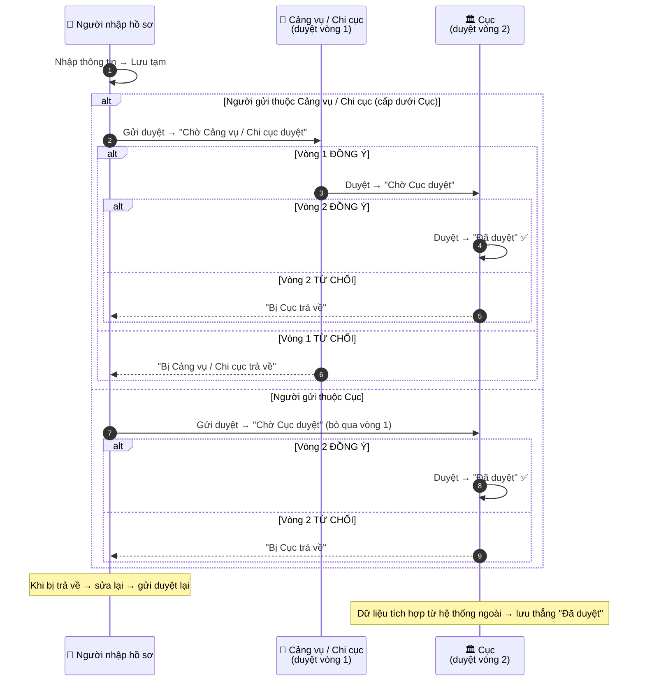
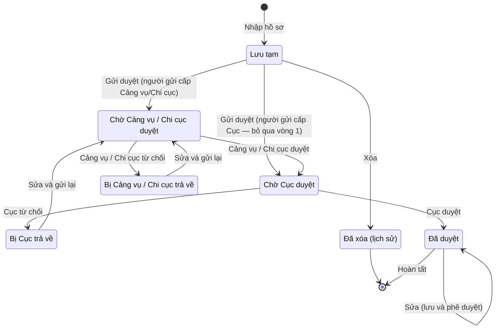

# Quy trình nghiệp vụ: Nhập và phê duyệt hồ sơ Kết cấu hạ tầng hàng hải (tối đa 2 cấp)

> Tài liệu mô tả nghiệp vụ, dùng chung cho BA / DEV / Test.
> Phạm vi: quy trình nhập và phê duyệt hồ sơ của **28 loại kết cấu hạ tầng hàng hải**. Quy trình **giống nhau cho mọi loại**; số vòng duyệt (1 hoặc 2) phụ thuộc vào **đơn vị gửi**, không phụ thuộc loại.
> Phần thân tài liệu viết thuần nghiệp vụ, không dùng mã kỹ thuật. Chi tiết kỹ thuật (mã trạng thái, tên bảng, tên chương trình) được tách riêng ở **Phụ lục cuối cùng** dành cho DEV.

---

## 1. Các trạng thái của một hồ sơ (thuần nghiệp vụ)

Một hồ sơ kết cấu hạ tầng trải qua **7 trạng thái** (6 trạng thái hoạt động + 1 trạng thái lưu trữ) sau:

| # | Tên trạng thái | Diễn giải cho người làm nghiệp vụ |
|---|---|---|
| 1 | **Lưu tạm** | Hồ sơ đang soạn dở, chỉ người nhập nhìn thấy, chưa ai duyệt |
| 2 | **Chờ Cảng vụ / Chi cục duyệt** | Đã gửi đi, đang nằm chờ cấp thứ nhất xử lý |
| 3 | **Chờ Cục duyệt** | Hồ sơ đang chờ cấp Cục xử lý (do cấp Cảng vụ/Chi cục chuyển lên, hoặc do chính cấp Cục gửi đi) |
| 4 | **Bị Cảng vụ / Chi cục trả về** | Cấp thứ nhất từ chối, trả lại cho người nhập |
| 5 | **Bị Cục trả về** | Cấp cuối từ chối, trả lại cho người nhập |
| 6 | **Đã duyệt** | Hoàn tất toàn bộ quy trình, hồ sơ chính thức có hiệu lực |
| 7 | **Đã xóa (lịch sử)** | Hồ sơ đã bị xóa (chỉ xóa được khi đang "Lưu tạm"); lưu lại để đối chiếu, không hiển thị trên màn hình |

---

## 2. Người tham gia quy trình

| Vai trò | Ai đảm nhận | Làm gì trong quy trình |
|---|---|---|
| **Người nhập hồ sơ** | Nhân viên tại đơn vị quản lý | Tạo hồ sơ, lưu tạm, gửi duyệt, sửa lại khi bị trả về |
| **Cấp duyệt thứ nhất** | Lãnh đạo Cảng vụ hàng hải hoặc Chi cục | Duyệt hoặc trả về ở vòng 1 |
| **Cấp duyệt cuối** | Lãnh đạo Cục | Duyệt hoặc trả về ở vòng 2 (quyết định cuối) |

> Quyền duyệt gắn với **chức vụ của người duyệt** (lãnh đạo Cảng vụ/Chi cục duyệt vòng 1, lãnh đạo Cục duyệt vòng 2), không phụ thuộc vào loại kết cấu hạ tầng. Số vòng duyệt phụ thuộc **đơn vị của người gửi** (xem quy tắc 14).

---

## 3. Sơ đồ quy trình

### 3.1. Sơ đồ tuần tự (đọc từ trái sang phải)

### 3.2. Sơ đồ vòng đời trạng thái

---

## 4. Mô tả quy trình bằng lời

**Luồng bình thường (người gửi thuộc Cảng vụ / Chi cục — cấp dưới Cục):**
1. Nhân viên nhập hồ sơ, có thể **Lưu tạm** (soạn dần) hoặc **Gửi duyệt** ngay.
2. Hồ sơ sang trạng thái **"Chờ Cảng vụ / Chi cục duyệt"**.
3. Lãnh đạo Cảng vụ / Chi cục xem xét. Nếu **đồng ý**, hồ sơ sang **"Chờ Cục duyệt"**. Nếu **từ chối**, hồ sơ về **"Bị Cảng vụ / Chi cục trả về"**.
4. Lãnh đạo Cục xem xét. Nếu **đồng ý**, hồ sơ sang **"Đã duyệt"** — kết thúc. Nếu **từ chối**, hồ sơ về **"Bị Cục trả về"**.
5. Hồ sơ bị trả về ở bất kỳ vòng nào: nhân viên **sửa lại rồi gửi duyệt lại**, quy trình lặp lại.

**Trường hợp phân cấp (người gửi thuộc Cục):**
- Hồ sơ do cấp Cục gửi đi sẽ **bỏ qua vòng 1**, vào thẳng **"Chờ Cục duyệt"** — chỉ còn 1 vòng duyệt.

**Trường hợp đặc biệt:**
- Dữ liệu từ hệ thống ngoài (tích hợp) đưa vào có thể được lưu thẳng ở trạng thái **"Đã duyệt"**, không qua vòng duyệt.
- Khi sửa một hồ sơ **đã duyệt** (bằng thao tác "Lưu và phê duyệt"), bản cũ được ghi vào **nhật ký thay đổi**, hồ sơ được cập nhật và vẫn giữ trạng thái **"Đã duyệt"**.
- Hồ sơ đang **"Lưu tạm"** có thể bị **xóa** (chuyển sang trạng thái "Đã xóa").

---

## 5. Bảng mô tả ca sử dụng

### Ca dùng 1 — Tạo mới / lưu tạm hồ sơ

| Mục | Nội dung |
|---|---|
| Người thực hiện | Người nhập hồ sơ |
| Điều kiện trước | Đã chọn **loại kết cấu hạ tầng** và **đơn vị quản lý**; nếu loại đó thuộc về một công trình cấp trên thì phải chọn **công trình cha** |
| Các bước | 1. Nhập thông tin → 2. Chọn "Lưu tạm" |
| Kết quả | Hồ sơ ở trạng thái "Lưu tạm", có thể sửa tiếp |

### Ca dùng 2 — Gửi duyệt

| Mục | Nội dung |
|---|---|
| Người thực hiện | Người nhập hồ sơ |
| Điều kiện trước | Hồ sơ đang "Lưu tạm" (hoặc đang bị trả về), đã điền đủ thông tin bắt buộc |
| Các bước | 1. Chọn "Gửi duyệt" → 2. Hệ thống ghi lại người và thời điểm gửi |
| Kết quả | Người gửi thuộc Cảng vụ/Chi cục → "Chờ Cảng vụ / Chi cục duyệt"; người gửi thuộc Cục → "Chờ Cục duyệt" |

### Ca dùng 3 — Duyệt vòng 1 (Cảng vụ / Chi cục)

| Mục | Nội dung |
|---|---|
| Người thực hiện | Lãnh đạo Cảng vụ / Chi cục |
| Điều kiện trước | Hồ sơ đang "Chờ Cảng vụ / Chi cục duyệt" |
| Các bước | 1. Xem hồ sơ → 2. Chọn "Đồng ý" hoặc "Từ chối" → 3. Hệ thống ghi lại người và thời điểm duyệt |
| Kết quả | Đồng ý → "Chờ Cục duyệt"; Từ chối → "Bị Cảng vụ / Chi cục trả về" |

### Ca dùng 4 — Duyệt vòng 2 (Cục)

| Mục | Nội dung |
|---|---|
| Người thực hiện | Lãnh đạo Cục |
| Điều kiện trước | Hồ sơ đang "Chờ Cục duyệt" |
| Các bước | 1. Xem hồ sơ → 2. Chọn "Đồng ý" hoặc "Từ chối" → 3. Hệ thống ghi lại người và thời điểm duyệt |
| Kết quả | Đồng ý → "Đã duyệt"; Từ chối → "Bị Cục trả về" |

### Ca dùng 5 — Trả về (từ chối)

| Mục | Nội dung |
|---|---|
| Người thực hiện | Lãnh đạo vòng 1 hoặc vòng 2 |
| Các bước | Chọn "Từ chối" trên hồ sơ đang chờ |
| Kết quả | Hồ sơ trở về tay người nhập với trạng thái "Bị ... trả về" |

### Ca dùng 6 — Sửa lại và gửi lại sau khi bị trả về

| Mục | Nội dung |
|---|---|
| Người thực hiện | Người nhập hồ sơ |
| Điều kiện trước | Hồ sơ ở trạng thái "Bị ... trả về" |
| Các bước | 1. Sửa nội dung → 2. Gửi duyệt lại |
| Kết quả | Hồ sơ quay về "Chờ Cảng vụ / Chi cục duyệt", lặp lại quy trình |

### Ca dùng 7 — Dữ liệu tích hợp lưu thẳng trạng thái "Đã duyệt" (trường hợp đặc biệt)

| Mục | Nội dung |
|---|---|
| Người thực hiện | Dữ liệu tích hợp từ hệ thống ngoài đẩy vào |
| Các bước | 1. Hệ thống ngoài đẩy dữ liệu hồ sơ vào → 2. Hệ thống lưu thẳng ở trạng thái "Đã duyệt" |
| Kết quả | Hồ sơ ở ngay trạng thái "Đã duyệt", không qua 2 vòng duyệt |

### Ca dùng 8 — Sửa hồ sơ đã duyệt

| Mục | Nội dung |
|---|---|
| Người thực hiện | Người có quyền phê duyệt (dùng thao tác "Lưu và phê duyệt") |
| Điều kiện trước | Hồ sơ đang "Đã duyệt" |
| Các bước | 1. Sửa nội dung → 2. Chọn "Lưu và phê duyệt" → 3. Bản cũ ghi vào nhật ký thay đổi, hồ sơ cập nhật và giữ trạng thái "Đã duyệt" |
| Kết quả | Hồ sơ vẫn "Đã duyệt" (không phải duyệt lại); bản cũ lưu trong nhật ký để đối chiếu |

### Ca dùng 9 — Xóa hồ sơ nháp

| Mục | Nội dung |
|---|---|
| Người thực hiện | Người nhập hồ sơ |
| Điều kiện trước | Hồ sơ đang "Lưu tạm" |
| Các bước | 1. Chọn "Xóa" → 2. Hồ sơ chuyển sang trạng thái "Đã xóa (lịch sử)" |
| Kết quả | Hồ sơ không còn hiển thị trên màn hình, chỉ lưu để đối chiếu |

---

## 6. Quy tắc nghiệp vụ

| # | Quy tắc |
|---|---|
| 1 | Mọi hồ sơ kết cấu hạ tầng **bắt buộc phải chọn loại** và **đơn vị quản lý** khi tạo |
| 2 | Hồ sơ chỉ có 7 trạng thái như mục 1, không có trạng thái nào khác |
| 3 | Hành động "Gửi duyệt" đưa hồ sơ về trạng thái chờ duyệt theo đơn vị gửi: người gửi thuộc cấp Cục → "Chờ Cục duyệt"; còn lại → "Chờ Cảng vụ / Chi cục duyệt" |
| 4 | Phê duyệt **tối đa 2 vòng theo đúng thứ tự, không được nhảy vòng**: vòng 1 (Cảng vụ/Chi cục) duyệt trước, vòng 2 (Cục) duyệt sau |
| 5 | Vòng 1 từ chối → "Bị Cảng vụ / Chi cục trả về"; vòng 2 từ chối → "Bị Cục trả về" |
| 6 | Hồ sơ bị trả về **bắt buộc sửa rồi gửi lại**, không thể giữ nguyên gửi thẳng |
| 7 | Mỗi lần gửi duyệt và mỗi lần duyệt **đều phải ghi lại người thực hiện và thời điểm** (để truy vết) |
| 8 | Quyền duyệt theo chức vụ: lãnh đạo Cảng vụ/Chi cục chỉ duyệt vòng 1, lãnh đạo Cục duyệt vòng 2 |
| 9 | Trường hợp lưu thẳng "Đã duyệt" (không qua 2 vòng) chỉ dành cho dữ liệu tích hợp từ hệ thống ngoài |
| 10 | Quy trình **áp dụng giống nhau cho cả 28 loại** kết cấu hạ tầng |
| 11 | Mọi thay đổi trên hồ sơ đều được ghi nhật ký (bản cũ lưu trong nhật ký thay đổi); hồ sơ "Lưu tạm" có thể bị xóa và chuyển sang trạng thái "Đã xóa (lịch sử)" |
| 12 | Chỉ hồ sơ ở trạng thái **"Đã duyệt"** mới được đưa vào báo cáo tổng hợp |
| 13 | Quy trình phê duyệt **tài sản** (không phải kết cấu hạ tầng) có thêm 2 trạng thái riêng cho việc "thay đổi nguyên giá" — cần phân biệt, không nhập nhằng với quy trình này |
| 14 | **Phân cấp theo đơn vị gửi**: nếu người gửi thuộc **cấp Cục**, hồ sơ bỏ qua vòng 1 vào thẳng "Chờ Cục duyệt" (chỉ còn 1 vòng); nếu thuộc cấp Cảng vụ/Chi cục trở xuống thì đi đủ 2 vòng |

---

## 7. Bảng chuyển trạng thái (cho DEV và Test)

| Từ trạng thái | Hành động | Sang trạng thái | Ai thực hiện |
|---|---|---|---|
| (mới) | Lưu tạm | Lưu tạm | Người nhập |
| (mới) | Gửi duyệt ngay | Chờ Cảng vụ / Chi cục duyệt | Người nhập |
| Lưu tạm | Gửi duyệt | Chờ Cảng vụ / Chi cục duyệt | Người nhập |
| Chờ Cảng vụ / Chi cục duyệt | Đồng ý | Chờ Cục duyệt | Cảng vụ / Chi cục |
| Chờ Cảng vụ / Chi cục duyệt | Từ chối | Bị Cảng vụ / Chi cục trả về | Cảng vụ / Chi cục |
| Chờ Cục duyệt | Đồng ý | Đã duyệt | Cục |
| Chờ Cục duyệt | Từ chối | Bị Cục trả về | Cục |
| Bị Cảng vụ / Chi cục trả về | Sửa + gửi lại | Chờ Cảng vụ / Chi cục duyệt | Người nhập |
| Bị Cục trả về | Sửa + gửi lại | Chờ Cảng vụ / Chi cục duyệt | Người nhập |
| Đã duyệt | Sửa (lưu và phê duyệt) | Đã duyệt | Người có quyền phê duyệt |
| Lưu tạm | Xóa | Đã xóa (lịch sử) | Người nhập |
| Bất kỳ | Dữ liệu tích hợp lưu thẳng | Đã duyệt | Hệ thống ngoài |

> **Lưu ý phân cấp:** khi người gửi thuộc **cấp Cục**, các hành động "Gửi duyệt" ở bảng trên đưa hồ sơ thẳng vào "Chờ Cục duyệt" (bỏ qua "Chờ Cảng vụ / Chi cục duyệt").
>
> **Case test bắt buộc:** không được phép "nhảy vòng" (Chờ Cảng vụ/Chi cục → Đã duyệt), không được duyệt ngược (Chờ Cục → Chờ Cảng vụ/Chi cục), không được gửi duyệt khi chưa điền đủ thông tin bắt buộc, không được xóa hồ sơ khi không ở trạng thái "Lưu tạm".

---

## 8. Phân công đọc theo vai

- **BA**: đọc mục 1, 3, 4, 5, 6 (trạng thái, sơ đồ, luồng, ca dùng, quy tắc) để đặc tả và phản biện với người dùng.
- **DEV**: đọc mục 6, 7 (quy tắc + bảng chuyển trạng thái) để code đúng vòng đời, quyền duyệt và ghi nhật ký; tham khảo thêm Phụ lục kỹ thuật.
- **Test**: lập case theo mục 7 (mỗi dòng = 1 case), kiểm thêm quyền duyệt (quy tắc 8) và nhật ký thay đổi (quy tắc 11).

---

## Phụ lục kỹ thuật — chỉ dành cho DEV (không cần đọc nếu chỉ làm nghiệp vụ)

Đây là nguồn gốc kỹ thuật của các mô tả ở trên, để DEV đối chiếu khi code:

| Nội dung nghiệp vụ | Nguồn kỹ thuật trong hệ thống cũ |
|---|---|
| 7 trạng thái hồ sơ | Enum `EnumTrangThaiKcht` (giá trị 0..6) trong tệp `TsktConstAndEnum.java` |
| Các hành động (lưu tạm, gửi duyệt, duyệt, nhập-và-duyệt) | Enum `EnumActionKcht` (cùng tệp trên) |
| Ghi dấu "ai duyệt, lúc nào" | Cột `PD_GUI_DUYET_*`, `PD_CHI_CUC_DUYET_*`, `PD_CUC_DUYET_*` trên 4 bảng hồ sơ |
| Luồng duyệt 2 vòng | Thủ tục `SP_APPROVAL_OR_REJECT` (cờ `@P_IS_CHI_CUC` phân biệt vòng 1 / vòng 2) |
| Quyền duyệt theo chức vụ | Danh mục `CHUC_VU` (Chi cục trưởng, Phó, Cục trưởng, Phó) |
| Phân cấp theo đơn vị gửi | `ConstantVmdMtisApi`: `AUTH_ORG_ORG_LEVEL_1_CODE = "G17.43"` (Cục Hàng hải và Đường thủy VN) |
| Chỉ hồ sơ "Đã duyệt" vào báo cáo | Thủ tục báo cáo `BCKCHT_163` (điều kiện lọc theo trạng thái 6) |

**Ghi chú xác minh (đã đối chiếu code):** (1) đường "lưu thẳng Đã duyệt" dùng cho dữ liệu tích hợp (`LgspThdlService`); (2) luồng "bị trả về → sửa lại → gửi lại" là tường minh trong `WebUtilService.getLstAllowUpdate` — hành động "Lưu và gửi duyệt" chỉ cho phép ở trạng thái "Lưu tạm" / "Bị Cảng vụ-Chi cục trả về" / "Bị Cục trả về"; (3) trạng thái "Lịch sử" (0) là trạng thái **xóa mềm** — thủ tục xóa (`SP_DELETE`) đặt trạng thái 0 và chỉ xóa được hồ sơ "Lưu tạm"; còn khi **sửa**, bản cũ lưu vào bảng nhật ký (`QlkcBaseService` gọi `comDataLogService.insert` với bản cũ trước khi cập nhật); (4) quy tắc phân cấp ở `WebUtilService.getStatusWhenInsertOrUpdate` và màn phê duyệt `QlkcBaseService.searchValidate`.
