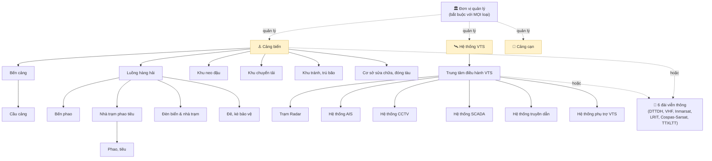

# Sơ đồ & Ma trận quan hệ cha – con 28 loại KCHT (bản đã hiệu đính)

> **Lý do sửa:** bản trước vẽ quan hệ phẳng (Cảng biển → tất cả), SAI. Thực tế là quan hệ **nhiều lớp** (3–4 lớp).
> **Bằng chứng gốc:** thủ tục `PKG_WEB_QLKC_037___SP_GET_CHILD` (định nghĩa cha→con theo từng trường FK), `PKG_WEB_BC_COMMON___SP_DETAIL___BCKCHT_163` (Cầu cảng nối Bến cảng qua `FK_BEN_CANG`), `PKG_WEB_QLKC_052___SP_DETAIL` (Nhà trạm theo Luồng, Phao tiêu theo Nhà trạm).

---

## 1. Sơ đồ nhiều lớp (đã sửa)

**Mũi tên liền `→` = cha–con chặt** (con BẮT BUỘC chọn cha khi nhập). **Mũi tên đứt = gắn lỏng** (chọn 1 trong 2).

Các chuỗi cha–con nhiều lớp (đã xác minh):

| Chuỗi | Số lớp |
|---|---|
| Cảng biển → **Bến cảng** → **Cầu cảng** | 3 lớp |
| Cảng biển → **Luồng hàng hải** → **Nhà trạm phao tiêu** → **Phao tiêu** | 4 lớp |
| Cảng biển → **Luồng hàng hải** → **Đèn biển / Đê kè** | 3 lớp |
| Cảng biển → **Luồng hàng hải** → **Bến phao** | 3 lớp |
| Hệ thống VTS → **Trung tâm điều hành VTS** → **Radar / AIS / CCTV / SCADA / Truyền dẫn / Phụ trợ** | 3 lớp |

---

## 2. Ma trận cha – con (có cột "trường bắt buộc nhập")

Cột **"Trường bắt buộc nhập"** = trường phải chọn/nhập khi tạo bản ghi để **xác lập quan hệ cha** (nếu bỏ trống, không xác định được nó thuộc đâu).

| # | Loại KCHT | Cấp | Cha trực tiếp | Trường bắt buộc nhập (tên hiển thị → cột) |
|---|---|---|---|---|
| 1 | Cảng biển | 0 | — (đỉnh) | Đơn vị quản lý (`FK_DON_VI_QL`) |
| 2 | Bến cảng | 1 | Cảng biển | **Cảng biển** (`FK_CANG_BIEN`) |
| 3 | Cầu cảng | 2 | **Bến cảng** | **Bến cảng** (`FK_BEN_CANG`) |
| 4 | Bến phao | 2 | Luồng hàng hải (thuộc Cảng biển) | **Cảng biển** (`FK_CANG_BIEN`) + **Luồng hàng hải** (`FK_LUONG_HH`) |
| 5 | Luồng hàng hải | 1 | Cảng biển | **Cảng biển** (`FK_CANG_BIEN`) |
| 6 | Khu neo đậu | 1 | Cảng biển | **Cảng biển** (`FK_CANG_BIEN`) |
| 7 | Khu chuyển tải | 1 | Cảng biển | **Cảng biển** (`FK_CANG_BIEN`) |
| 8 | Khu tránh, trú bão | 1 | Cảng biển | **Cảng biển** (`FK_CANG_BIEN`) |
| 9 | Cơ sở sửa chữa, đóng tàu | 1 | Cảng biển | **Cảng biển** (`FK_CANG_BIEN`) |
| 10 | Cảng cạn | 0 | — (đỉnh) | Đơn vị quản lý (`FK_DON_VI_QL`) |
| 11 | Hệ thống VTS | 0 | — (đỉnh) | Đơn vị quản lý (`FK_DON_VI_QL`) |
| 12 | Trung tâm điều hành VTS | 1 | Hệ thống VTS | **Hệ thống VTS** (`FK_HT_VTS`) |
| 13 | Trạm Radar | 2 | Trung tâm điều hành VTS | **Trung tâm điều hành VTS** (`FK_TT_DH_VTS`) |
| 14 | Hệ thống AIS | 2 | Trung tâm điều hành VTS | **Trung tâm điều hành VTS** (`FK_TT_DH_VTS`) |
| 15 | Hệ thống CCTV | 2 | Trung tâm điều hành VTS | **Trung tâm điều hành VTS** (`FK_TT_DH_VTS`) |
| 16 | Hệ thống SCADA | 2 | Trung tâm điều hành VTS | **Trung tâm điều hành VTS** (`FK_TT_DH_VTS`) |
| 17 | Hệ thống truyền dẫn | 2 | Trung tâm điều hành VTS | **Trung tâm điều hành VTS** (`FK_TT_DH_VTS`) |
| 18 | Hệ thống phụ trợ VTS | 2 | Trung tâm điều hành VTS | **Trung tâm điều hành VTS** (`FK_TT_DH_VTS`) |
| 19 | Đèn biển & nhà trạm | 2 | Luồng hàng hải | **Luồng hàng hải** (`FK_LUONG_HH`) |
| 20 | Phao, tiêu | 2 | Nhà trạm phao tiêu | **Nhà trạm** (`FK_NHA_TRAM`) |
| 21 | Nhà trạm quản lý vận hành phao tiêu | 1 | Luồng hàng hải | **Luồng hàng hải** (`FK_LUONG_HH`) |
| 22 | Đê chắn sóng, đê chắn cát, kè | 2 | Luồng hàng hải | **Luồng hàng hải** (`FK_LUONG_HH`) |
| 23 | Đài TTDH | 1–2 | Trung tâm VTS **hoặc** Cảng biển | `FK_TT_DH_VTS` **hoặc** `FK_CANG_BIEN` |
| 24 | Hệ thống VHF | 1–2 | Trung tâm VTS **hoặc** Cảng biển | `FK_TT_DH_VTS` **hoặc** `FK_CANG_BIEN` |
| 25 | Đài Inmarsat | 1–2 | Trung tâm VTS **hoặc** Cảng biển | `FK_TT_DH_VTS` **hoặc** `FK_CANG_BIEN` |
| 26 | Đài LRIT | 1–2 | Trung tâm VTS **hoặc** Cảng biển | `FK_TT_DH_VTS` **hoặc** `FK_CANG_BIEN` |
| 27 | Đài Cospas-Sarsat | 1–2 | Trung tâm VTS **hoặc** Cảng biển | `FK_TT_DH_VTS` **hoặc** `FK_CANG_BIEN` |
| 28 | Đài TTXLTT Hà Nội | 1–2 | Trung tâm VTS **hoặc** Cảng biển | `FK_TT_DH_VTS` **hoặc** `FK_CANG_BIEN` |

---

## 3. Bằng chứng (procedure → dòng → kết luận)

| Bằng chứng | Nội dung | Kết luận |
|---|---|---|
| `QLKC_037___SP_GET_CHILD` dòng 42–46 | `PARENT='BC' → FK_BEN_CANG`; `'CC' → FK_CAU_CANG`; `'CB' → FK_CANG_BIEN` | Bến cảng là cha của Cầu cảng (Cầu cảng trỏ `FK_BEN_CANG`) |
| `BC_COMMON___SP_DETAIL___BCKCHT_163` dòng 109, 153 | `INNER JOIN ben_cang b ON a.FK_BEN_CANG = b.MA`; `left join cau_cang b on b.FK_BEN_CANG = a.MA` | Cầu cảng (NHOM='CC') nối vào Bến cảng (NHOM='BC') |
| `QLKC_037___SP_GET_CHILD` dòng 65–70 | `PARENT='VTS' → FK_HT_VTS`; `'TTDH' → FK_TT_DH_VTS`; `'NT' → FK_NHA_TRAM`; `'LHH' → FK_LUONG_HH` | VTS→Trung tâm; Trung tâm→trạm con; Nhà trạm→Phao tiêu; Luồng→đèn/đê/nhà trạm |
| `QLKC_037___SP_GET_CHILD` dòng 89–91 | MVT: `'TTDH' → FK_TT_DH_VTS`; `'CB' → FK_CANG_BIEN` | 6 đài viễn thông gắn Trung tâm VTS **hoặc** Cảng biển |
| `QLKC_052___SP_DETAIL` dòng 23, 29 | `NT.FK_LUONG_HH`; `NT.MA = KA.FK_NHA_TRAM` | Nhà trạm theo Luồng; Phao tiêu theo Nhà trạm |
| Frontend `SelectKcht.tsx` dòng 100–121 | `BP` cần `fkCangBien && fkLuongHh`; `TTDH` cần `fkDonViQl && fkHtVts` | Quy tắc "bắt buộc nhập" khi chọn cha trên form |

---

## 4. Hai lưu ý khi dùng ma trận này

1. **"Bắt buộc" là quy tắc nghiệp vụ (frontend), không phải ràng buộc DB.** Trong CSDL, mọi cột `FK_*` đều cho phép NULL, chỉ có `NHOM` (loại) là NOT NULL. Nghĩa là dữ liệu cũ có thể có bản ghi **thiếu cha** — khi phân tích phải kiểm tra, đừng mặc định quan hệ luôn đúng.

2. **Cầu cảng có thể vừa trỏ `FK_BEN_CANG` vừa trỏ `FK_CANG_BIEN`** (nhiều form lưu cả 2 để tiện tra cứu). Cha "chính thức" xét theo thủ tục cha–con là **Bến cảng**; `FK_CANG_BIEN` chỉ là bổ sung.
