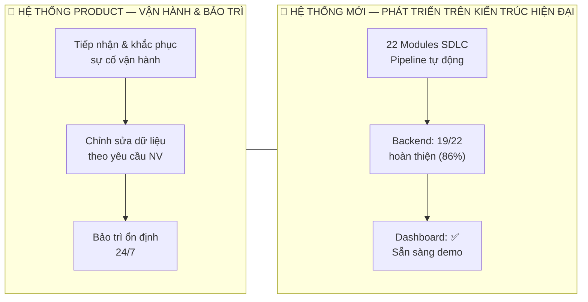
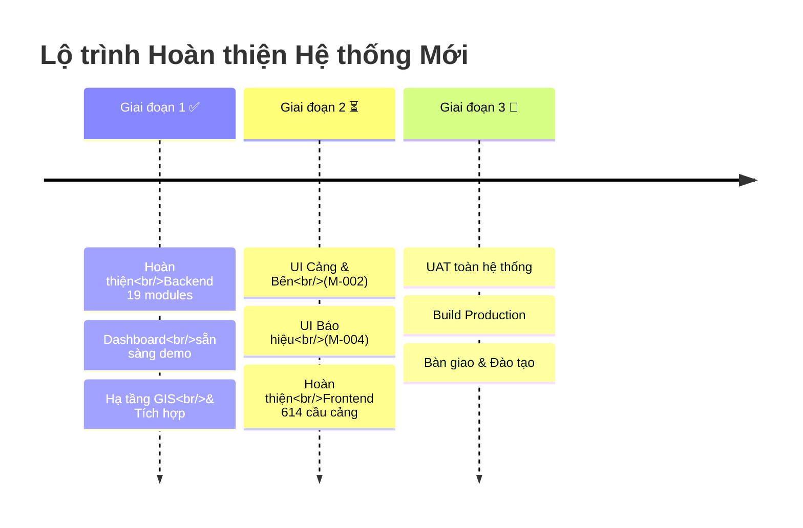

# BÁO CÁO TIẾN ĐỘ — Hệ thống Quản trị KCHTGT Hàng hải

**Ngày:** 20/07/2026 | **Đơn vị thực hiện:** Nhóm Phát triển

---

## TỔNG QUAN HAI HỆ THỐNG



---

## 1. HỆ THỐNG PRODUCT — VẬN HÀNH & BẢO TRÌ

| Hạng mục | Nội dung | Trạng thái |
|----------|----------|-----------|
| **Tiếp nhận hệ thống** | Tiếp quản toàn bộ hệ thống product đang chạy từ đơn vị cũ | ✅ Hoàn thành |
| **Vận hành ổn định** | Duy trì uptime, xử lý sự cố phát sinh | ✅ Đang vận hành |
| **Chỉnh sửa dữ liệu** | Cập nhật, hiệu chỉnh thông tin tài sản KCHTGT theo yêu cầu nghiệp vụ | ⏳ Thường xuyên |
| **Hỗ trợ người dùng** | Hướng dẫn, giải đáp, xử lý lỗi phát sinh | ⏳ Thường xuyên |

> **Thông điệp:** Song song với phát triển hệ thống mới, nhóm vẫn đảm bảo vận hành ổn định product hiện tại, không gián đoạn nghiệp vụ của Cục.

---

## 2. HỆ THỐNG MỚI — PHÁT TRIỂN HIỆN ĐẠI HÓA

### 2.1 Tiến độ tổng quan

| Chỉ số | Giá trị |
|--------|---------|
| Tổng số module | **22** |
| Hoàn thành (Backend + QA + Review) | **19 modules (86%)** |
| Đang triển khai | **2 modules** |
| Chưa khởi động | **1 module** |
| Dashboard (giao diện chính) | ✅ **Sẵn sàng demo** |
| Tổng test cases | **>1,500 unit tests** |

### 2.2 Chi tiết từng module

#### ✅ HOÀN THÀNH TOÀN DIỆN (19 modules)

| # | Module | Backend | Test | UI | Nghiệp vụ cốt lõi |
|---|--------|---------|------|----|--------------------|
| M-001 | Quản trị hệ thống | ✅ | ✅ | ✅ | RBAC, User/Group/OrgUnit, Audit log |
| M-003 | Khu nước & VTS | ✅ | 241 tests | ✅ | 56 luồng, 85 đê/kè, 411 cơ sở SC, 12 VTS |
| M-005 | Biến động tài sản | ✅ | 15+ tests | — | Tăng/giảm, kiểm kê, khai thác |
| M-006 | Văn bản & Thông tin NV | ✅ | ✅ | — | 65 files: pháp lý, vận hành, bảo trì, sự cố |
| M-007 | GIS Bản đồ | ✅ | 263 tests | — | Map rendering, layers, S-57/S-63 |
| M-008 | Báo cáo & Thống kê | ✅ | 790 tests | ✅ | 49 mẫu báo cáo, 4 E2E tests |
| M-009 | Liên thông & Tích hợp | ✅ | 262 tests | — | 81 APIs (37 share + 44 sync), LGSP |
| M-010 | Xác thực & Phân quyền | ✅ | 230 tests | ✅ | MFA TOTP, JWT, 3-level ACL |
| M-011 | Nhật ký & Backup | ✅ | ✅ | — | 5 nhóm log, sao lưu tự động |
| M-012 | Hải đồ & GIS Integration | ✅ | 646 tests | — | S-57/S-63, S-52, WGS84 |
| M-013 | Báo hiệu Hàng hải | ✅ | 122 tests | — | Phao tiêu, Đèn biển, 2-level approval |
| M-014 | Nhà trạm | ✅ | 68 tests | — | 29 source files |
| M-015 | Đài thông tin duyên hải | ✅ | ✅ | — | Inmarsat, Cospas-Sarsat, LRIT |
| M-016 | Báo cáo & Tổng hợp | ✅ | 84 tests | — | Data sync foundation |
| M-017 | Thống kê chuyên đề | ✅ | 33 tests | — | 28 biểu chuẩn (TT48/TT67/ND43) |
| M-018 | Chia sẻ dữ liệu KCHTGT | ✅ | 33 tests | — | 19 endpoints RESTful |
| M-019 | Tích hợp tài sản & Hệ thống | ✅ | 25 tests | — | 27 hệ thống hàng hải, 33 endpoints |
| M-020 | Tích hợp dữ liệu NV | ✅ | 25 tests | — | 17 đặc tả tích hợp |
| M-021 | Chia sẻ DL tổng hợp | ✅ | 29 tests | — | 527 công trình KCHTGT, 29 endpoints |

#### ⏳ ĐANG TRIỂN KHAI (2 modules)

| # | Module | Đã xong | Đang làm | Dự kiến |
|---|--------|---------|----------|---------|
| M-002 | **Cảng & Bến** | ✅ Backend (36 cảng, 301 bến, 614 cầu cảng, 14 cảng cạn, 77 vùng nước) | ⏳ UI designer | Theo kế hoạch |
| M-004 | **Báo hiệu & Thông tin** | ✅ BA Lean Spec | ⏳ Kiến trúc hệ thống | Theo kế hoạch |

#### 📅 CHƯA KHỞI ĐỘNG (1 module)

| # | Module | Ghi chú |
|---|--------|---------|
| M-022 | Dashboard | ✅ **Đã hoàn thành sớm** — 5 khối (KPI, Trend chart, Bản đồ, Phê duyệt, Bộ lọc) |

> 📌 *M-022 Dashboard đã được hoàn thiện vượt tiến độ để phục vụ demo cho Lãnh đạo.*

### 2.3 Quy mô dữ liệu được quản lý

```
🏗️ Cảng biển         36       ⚓ Bến cảng          301
🏗️ Cầu cảng          614      🚢 Luồng hàng hải     56
🛡️ Đê / Kè           85       🔧 Cơ sở sửa chữa    411
📡 Trạm radar         18       🖥️ Hệ thống VTS       12
💡 Đèn biển           94       🔴 Phao tiêu        1,452
🏢 Nhà trạm           —        📻 Đài thông tin       9
━━━━━━━━━━━━━━━━━━━━━━━━━━━━━━━━━━━━━━━━━━━━━━━━
   TỔNG              ~3,200+ tài sản KCHTGT
```

### 2.4 Dashboard — Minh chứng kết quả

> **Màn hình Trang chủ (Dashboard) là sản phẩm hữu hình nhất để Lãnh đạo Cục kiểm chứng tiến độ.**

| Khối chức năng | Mô tả | Trạng thái |
|---------------|-------|-----------|
| Thanh bộ lọc | Lọc theo đơn vị, loại tài sản, năm | ✅ |
| Thẻ KPI | Tổng số tài sản, đang khai thác, cần duyệt | ✅ |
| Biểu đồ xu hướng | Tăng trưởng tài sản theo thời gian | ✅ |
| Phê duyệt & Khai thác | Danh sách chờ duyệt, trạng thái vận hành | ✅ |
| Bản đồ & Bảng chi tiết | GIS map + danh sách chi tiết | ✅ |

---

## 3. KẾ HOẠCH GIAI ĐOẠN TIẾP THEO



| Giai đoạn | Nội dung | Mục tiêu | Dự kiến |
|-----------|----------|----------|---------|
| **1** ✅ | Backend + Dashboard | Hạ tầng hoàn chỉnh, demo được | Đã xong |
| **2** ⏳ | UI toàn bộ danh mục tài sản | Người dùng thao tác trực tiếp | Đang triển khai |
| **3** 📅 | UAT — Production — Bàn giao | Go-live toàn hệ thống | Theo cam kết |

---

## 4. THÔNG ĐIỆP CHỐT

> **"Hệ thống đang tiến triển trên 2 mặt trận song song: Product hiện tại được duy trì ổn định, không gián đoạn; Hệ thống mới đã hoàn thiện 86% backend, Dashboard sẵn sàng demo. 3.200+ tài sản KCHTGT toàn quốc đã được số hóa trong nền tảng mới. Giai đoạn tiếp theo tập trung hoàn thiện giao diện người dùng — đây là lớp cuối cùng trước khi bàn giao."**

---

*Báo cáo được tổng hợp từ dữ liệu thực tế trong SDLC pipeline ngày 20/07/2026.*
