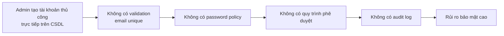
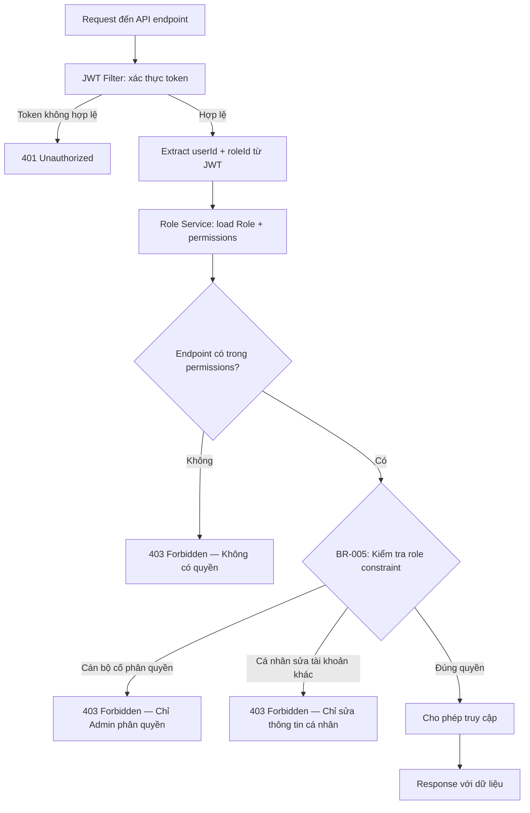

# F-001 — Quản lý tài khoản người dùng (Lean BA Spec)

## 1. Summary

| Field | Value |
|---|---|
| Feature ID | F-001 |
| Name | Quản lý tài khoản người dùng |
| Module | M-001 (Quản trị hệ thống) |
| Classification | local |
| Priority | high |
| Status | proposed |
| Tech Stack | Spring Boot + Spring Security + JWT / ReactJS / MSSQL 2022 |

**Business intent:** Hệ thống cần cơ chế quản lý tài khoản người dùng an toàn và linh hoạt, cho phép các vai trò Quản trị hệ thống, Lãnh đạo và Chuyên viên thực hiện đầy đủ các thao tác tạo, sửa, xóa, khóa/mở khóa tài khoản theo quy trình nghiệp vụ được thiết định.

**Complexity:** Complex (19 business rules total: 7 high-level + 12 granular, 4 actors, RBAC + soft-delete + registration approval workflow).

---

## 2. Scope

### In Scope

| # | Capability | Notes |
|---|---|---|
| 1 | Tạo mới tài khoản người dùng (CRUD) | Với validation email unique, password policy (BR-001, BR-002) |
| 2 | Chỉnh sửa thông tin tài khoản | Họ tên, email, vai trò, đơn vị |
| 3 | Xóa mềm tài khoản | Không xóa nếu có dữ liệu nghiệp vụ liên quan (BR-003) |
| 4 | Khóa / Mở khóa tài khoản | Ngăn/tiếp tục truy cập (BR-004) |
| 5 | Đặt lại mật khẩu | Admin reset + self-reset với link token (BR-006) |
| 6 | Phân quyền theo vai trò (RBAC) | Admin, Lãnh đạo, Cán bộ, Cá nhân (BR-005) |
| 7 | Tìm kiếm & lọc người dùng | Theo tên, email, vai trò, trạng thái (AC-008) |
| 8 | Phân trang danh sách người dùng | Default 20 items/page, max 100 |

### Out of Scope

| # | Capability | Reason |
|---|---|---|
| 1 | Quản lý SSO/OAuth (tích hợp bên thứ ba) | Không thuộc phạm vi F-001 |
| 2 | Quản lý Multi-Factor Authentication (MFA) | Không thuộc phạm vi F-001 |
| 3 | Audit log cho hoạt động quản lý tài khoản | F-005 (Quản lý log truy cập) sẽ đảm nhận |
| 4 | Tự động provision từ danh bạ công ty | Không yêu cầu trong giai đoạn này |
| 5 | Quản lý 2FA/TOTP | Thuộc module bảo mật độc lập |
| 6 | Đồng bộ LDAP/Active Directory | Không yêu cầu trong giai đoạn này |

---

## 3. Actors & Permissions

| Role | Level | Permissions | Actor ID |
|---|---|---|---|
| **Admin** | Full access | Tạo, sửa, xóa, khóa/mở khóa, reset mật khẩu, phân quyền | A-001 (Quản trị hệ thống) |
| **Lanh dao** (Lãnh đạo) | View + Approve | Xem danh sách, duyệt yêu cầu tạo/xóa tài khoản | A-002 (Lãnh đạo) |
| **Can bo** (Cán bộ) | View + Edit | Xem danh sách, chỉnh sửa thông tin, khóa/mở khóa | A-003 (Chuyên viên) |
| **Ca nhan** (Cá nhân) | Self only | Chỉ xem và sửa thông tin cá nhân của chính mình | A-005 (Cá nhân/Tổ chức bên ngoài) |

---

## 4. Business Process

### 4.1 AS-IS (Quy trình hiện tại)

Hệ thống hiện tại chưa có module quản lý tài khoản người dùng tập trung. Việc tạo/sửa/xóa tài khoản được thực hiện thủ công qua cơ sở dữ liệu, không có quy trình phê duyệt, không có kiểm tra quyền hạn, và không có audit trail.



### 4.2 TO-BE (Quy trình mục tiêu)

```mermaid
flowchart TD
    A[Admin/Lãnh đạo truy cập module<br/>Quản lý tài khoản từ sidebar] --> B{Thao tác}
    B -->|Tạo mới| C[Nhập thông tin: tên, email,<br/>mật khẩu, vai trò, đơn vị]
    B -->|Chỉnh sửa| D[Chọn tài khoản → chỉnh sửa<br/>thông tin hoặc phân quyền]
    B -->|Xóa| E[Xác nhận xóa mềm<br/>kiểm tra dữ liệu liên quan]
    B -->|Khóa/Mở khóa| F[Nhập lý do → xác nhận]
    B -->|Reset mật khẩu| G[Admin đặt mật khẩu mới<br/>hoặc gửi link tự động]

    C --> H{Kiểm tra validation}
    H -->|Email trùng| H1[Hiển thị lỗi "Email đã tồn tại"]
    H -->|Mật khẩu yếu| H2[Hiển thị lỗi validation mật khẩu]
    H -->|Hợp lệ| I[Tạo tài khoản → ghi log → toast thành công]

    D --> J[Cập nhật thông tin → ghi log<br/>→ toast thành công]

    E --> K{Kiểm tra dữ liệu liên quan}
    K -->|Có phanhen/bao cao| K1[Hiển thị lỗi "Không thể xóa —<br/>tài khoản còn dữ liệu nghiệp vụ"]
    K -->|Không có| L[Xóa mềm (deletedAt = now)<br/>→ ghi log → toast thành công]

    F --> M[Thay đổi status → ghi log<br/>→ toast thành công]

    G --> N[Hash mật khẩu mới → lưu →<br/>invalidate token cũ → toast thành công]
```

### 4.3 Exception Flows

| Scenario | Trigger | System Response | Actor Action |
|---|---|---|---|
| Email trùng khi tạo | BR-001 | Hiển thị lỗi "Email đã tồn tại" | Nhập email khác |
| Mật khẩu yếu khi tạo | BR-002 | Hiển thị lỗi validation mật khẩu | Nhập mật khẩu đáp ứng yêu cầu |
| Xóa tài khoản có dữ liệu liên quan | BR-003 | Hiển thị lỗi "Không thể xóa — tài khoản còn dữ liệu nghiệp vụ" | Liên hệ quản trị viên để xử lý dữ liệu |
| Tài khoản bị khóa khi đăng nhập | BR-004 | Hiển thị lỗi "Tài khoản đã bị khóa" | Liên hệ Admin để mở khóa |
| Token reset mật khẩu hết hạn | BR-006 | Hiển thị lỗi "Link hết hạn" | Yêu cầu gửi link mới |
| Tài khoản tự động khóa sau 5 lần sai | BR-007 | Hiển thị lỗi "Tài khoản bị khóa do nhiều lần đăng nhập sai" | Đợi 30 phút hoặc liên hệ Admin |
| Cán bộ cố xóa tài khoản | BR-005 | Hiển thị lỗi 403 Forbidden | Không thể thực hiện |
| Cá nhân cố sửa tài khoản khác | BR-005 | Hiển thị lỗi 403 Forbidden | Chỉ sửa thông tin cá nhân |

---

## 5. User Stories (MoSCoW)

| ID | Story | Priority | Source |
|---|---|---|---|
| US-001 | Là **Admin**, tôi muốn tạo tài khoản người dùng mới với đầy đủ thông tin (tên, email, mật khẩu, vai trò, đơn vị) để quản lý người dùng mới vào hệ thống. | Must | Feature-brief AC-1 |
| US-002 | Là **Admin**, tôi muốn chỉnh sửa thông tin tài khoản (tên, email, vai trò, đơn vị) của người dùng để cập nhật thông tin. | Must | Feature-brief In Scope #2 |
| US-003 | Là **Admin**, tôi muốn xóa mềm tài khoản người dùng khi không còn cần thiết. | Must | Feature-brief In Scope #3 |
| US-004 | Là **Admin**, tôi muốn khóa/mở khóa tài khoản người dùng để ngăn/tiếp tục truy cập khi cần. | Must | Feature-brief In Scope #4 |
| US-005 | Là **Admin**, tôi muốn reset mật khẩu cho người dùng khi họ quên mật khẩu. | Must | Feature-brief In Scope #5 |
| US-006 | Là **Admin**, tôi muốn phân quyền theo vai trò (RBAC) để kiểm soát truy cập. | Must | Feature-brief In Scope #6 |
| US-007 | Là **Lanh dao**, tôi muốn xem danh sách người dùng và duyệt yêu cầu tạo/xóa tài khoản. | Should | Feature-brief Roles table |
| US-008 | Là **Can bo**, tôi muốn xem danh sách, chỉnh sửa thông tin và khóa/mở khóa tài khoản. | Must | Feature-brief Roles table |
| US-009 | Là **Ca nhan**, tôi muốn xem và chỉnh sửa thông tin cá nhân của chính mình. | Should | Feature-brief Roles table |
| US-010 | Là **người dùng hệ thống**, tôi muốn tìm kiếm và lọc danh sách người dùng theo tên, email, vai trò, trạng thái với phân trang chính xác. | Must | Feature-brief AC-4 |

---

## 6. Acceptance Criteria (BDD)

| ID | Scenario | Given | When | Then | Priority | Linked BR |
|---|---|---|---|---|---|---|
| AC-001 | Tạo tài khoản thành công | Người dùng đã đăng nhập với vai trò Admin | Nhập đầy đủ thông tin (tên, email, mật khẩu mạnh, vai trò, đơn vị) và nhấn Tạo | Tài khoản được tạo, email unique được xác nhận, mật khẩu được hash, toast "Tạo thành công" hiển thị | Critical | BR-001, BR-002 |
| AC-002 | Tạo tài khoản thất bại — email trùng | Người dùng đã đăng nhập với vai trò Admin | Nhập email đã tồn tại trong hệ thống và nhấn Tạo | Hệ thống hiển thị lỗi "Email đã tồn tại", tài khoản không được tạo | Critical | BR-001 |
| AC-003 | Tạo tài khoản thất bại — mật khẩu yếu | Người dùng đã đăng nhập với vai trò Admin | Nhập mật khẩu không đáp ứng yêu cầu (dưới 8 ký tự, thiếu chữ hoa, chữ thường, số) và nhấn Tạo | Hệ thống hiển thị lỗi validation mật khẩu, tài khoản không được tạo | Critical | BR-002 |
| AC-004 | Khóa tài khoản thành công | Người dùng đã đăng nhập với vai trò Admin hoặc Cán bộ | Chọn tài khoản cần khóa, nhập lý do, nhấn Khóa | Tài khoản chuyển sang trạng thái blocked, không thể đăng nhập, toast "Khóa thành công" hiển thị | Critical | BR-004 |
| AC-005 | Mở khóa tài khoản thành công | Người dùng đã đăng nhập với vai trò Admin hoặc Cán bộ | Chọn tài khoản blocked, nhập lý do, nhấn Mở khóa | Tài khoản chuyển sang active, có thể đăng nhập lại, toast "Mở khóa thành công" hiển thị | Critical | BR-004 |
| AC-006 | Xóa tài khoản thất bại — có dữ liệu liên quan | Người dùng đã đăng nhập với vai trò Admin | Chọn tài khoản còn dữ liệu phanhen/bao cao liên quan và nhấn Xóa | Hệ thống hiển thị lỗi "Không thể xóa — tài khoản còn dữ liệu nghiệp vụ", tài khoản không bị xóa | Critical | BR-003 |
| AC-007 | Xóa tài khoản thành công | Người dùng đã đăng nhập với vai trò Admin | Chọn tài khoản không có dữ liệu liên quan, xác nhận xóa | Tài khoản bị xóa mềm (deletedAt = current timestamp), toast "Xóa thành công" hiển thị | Major | BR-003 |
| AC-008 | Tìm kiếm & lọc danh sách người dùng | Người dùng đã đăng nhập | Nhập từ khóa tìm kiếm và chọn bộ lọc (vai trò, trạng thái) | Bảng hiển thị kết quả đúng, phân trang hoạt động, tổng số record hiển thị | Major | — |
| AC-009 | Reset mật khẩu thành công | Người dùng đã đăng nhập với vai trò Admin | Chọn tài khoản, nhập mật khẩu mới đáp ứng policy, nhấn Reset | Mật khẩu được hash và lưu, token cũ bị invalidate, toast "Reset thành công" hiển thị | Major | BR-006 |
| AC-010 | Không thể đăng nhập khi tài khoản bị khóa | Người dùng chưa đăng nhập | Nhập thông tin đăng nhập cho tài khoản đã bị khóa | Hệ thống hiển thị lỗi "Tài khoản đã bị khóa", không cho đăng nhập | Critical | BR-004 |
| AC-011 | Tự động khóa sau 5 lần đăng nhập sai | Người dùng chưa đăng nhập | Nhập sai mật khẩu 5 lần liên tiếp cho cùng một tài khoản | Tài khoản tự động bị khóa, thông báo hiển thị cho user, toast cảnh báo hiển thị | Critical | BR-007 |
| AC-012 | Chỉ Admin phân quyền cho vai trò khác | Người dùng đã đăng nhập với vai trò Cán bộ | Cố gắng thay đổi vai trò của người dùng khác thành Admin | Hệ thống từ chối (403 Forbidden), không có thay đổi | Critical | BR-005 |
| AC-013 | Cá nhân chỉ sửa thông tin của chính mình | Người dùng đã đăng nhập với vai trò Cá nhân | Cố gắng sửa thông tin tài khoản của người dùng khác | Hệ thống từ chối (403 Forbidden), chỉ cho phép sửa thông tin cá nhân | Critical | BR-005 |
| AC-014 | Token reset mật khẩu hết hạn | Người dùng đã yêu cầu reset mật khẩu | Đợi hơn 1 giờ rồi click vào link reset trong email | Hệ thống hiển thị lỗi "Link hết hạn", yêu cầu gửi link mới | Major | BR-006 |
| AC-015 | Lãnh đạo chỉ xem và duyệt, không sửa | Người dùng đã đăng nhập với vai trò Lãnh đạo | Cố gắng chỉnh sửa thông tin tài khoản hoặc khóa/mở khóa | Hệ thống từ chối (403 Forbidden), chỉ cho phép xem và duyệt | Major | Feature-brief Roles table |

---

## 7. Business Rules

### 7.1 High-Level Business Rules (from root feature-brief)

| ID | Rule | Applies-to | Source | Exception |
|---|---|---|---|---|
| **BR-001** | Email phải unique trong hệ thống; không cho phép trùng email khi tạo mới hoặc sửa | Tạo/Sửa UserAccount | Feature-brief BR-001 | — |
| **BR-002** | Mật khẩu tối thiểu 8 ký tự, có chữ hoa, chữ thường, số | Tạo/Sửa UserAccount | Feature-brief BR-002 | Admin reset password: chỉ yêu cầu ≥8 ký tự, có chữ và số (không bắt buộc ký tự đặc biệt) |
| **BR-003** | Không được xóa tài khoản có dữ liệu liên quan (phanhien, bao cao) | Delete UserAccount | Feature-brief BR-003 | — |
| **BR-004** | Tài khoản bị khóa không được đăng nhập | Login | Feature-brief BR-004 | — |
| **BR-005** | Chỉ Admin mới có quyền phân quyền cho vai trò khác; Cán bộ chỉ sửa thông tin và khóa/mở khóa; Cá nhân chỉ sửa thông tin cá nhân | Role Assignment | Feature-brief BR-005 | — |
| **BR-006** | Token reset mật khẩu hết hạn sau 1 giờ | Password Reset | Feature-brief BR-006 | — |
| **BR-007** | Tài khoản tự động khóa sau 5 lần đăng nhập sai | Login Security | Feature-brief BR-007 | Admin có thể mở khóa thủ công |

### 7.2 Granular Business Rules (from feature-brief.md)

| ID | Rule | Applies-to | Source |
|---|---|---|---|
| **BR-001-01** | Mật khẩu phải có ít nhất 8 ký tự, bao gồm chữ hoa, chữ thường, số và ký tự đặc biệt | Tạo/Sửa user | PDPD §24, Chính sách mật khẩu |
| **BR-001-02** | Tài khoản bị khóa sau 5 lần đăng nhập thất bại liên tiếp; tự mở khóa sau 30 phút hoặc do admin thao tác thủ công | Đăng nhập/Status | Chính sách bảo mật |
| **BR-001-03** | Email phải là duy nhất trong hệ thống; không cho phép trùng email khi tạo mới hoặc sửa | Tạo/Sửa user | Dữ liệu master |
| **BR-001-04** | Chỉ role `system-admin` mới được tạo hoặc xóa tài khoản `system-admin` | Role assignment | Phân quyền hệ thống |
| **BR-001-05** | Khi khóa tài khoản, mọi session đang hoạt động của user đó sẽ bị vô hiệu hóa ngay lập tức | Khóa tài khoản | Security module |
| **BR-001-06** | Khi tạo/reset password, mật khẩu mới phải khác 3 mật khẩu gần nhất của user | Reset password | Chính sách mật khẩu |
| **BR-001-07** | Mọi thay đổi trạng thái tài khoản (active/blocked) phải được ghi vào UserStatusLog với lý do | Lock/Unlock | Audit requirement |
| **BR-001-08** | User không thể tự thay đổi vai trò (role) của chính mình; chỉ admin/system-admin được phép gán/hủy vai trò | Role assignment | Phân quyền |
| **BR-001-09** | Tài khoản đăng ký tự động qua email/SĐT cần được admin phê duyệt trước khi kích hoạt | Đăng ký (F-271 M-010) | URD III.3.2 |
| **BR-001-10** | Admin được phân quyền truy cập module cụ thể (system-admin: tất cả, admin: phân hệ của mình, user: không) | Phân quyền | URD III.3.2 |
| **BR-001-11** | Khi admin phê duyệt tài khoản đăng ký, user account được kích hoạt và phân quyền theo vai trò đã chỉ định | Phê duyệt | URD III.3.2 |
| **BR-001-12** | Admin có thể xem và phê duyệt danh sách tài khoản đăng ký chờ xử lý, từ chối với lý do cụ thể | Phê duyệt | URD III.3.2 |

### 7.3 Rule Mapping (High-Level → Granular)

| High-Level | Granular Sub-rules | Notes |
|---|---|---|
| BR-001 (Email unique) | BR-001-03 | Same rule, more detailed |
| BR-002 (Password policy) | BR-001-01, BR-001-06 | BR-001-01: password complexity; BR-001-06: password history (3 previous) |
| BR-003 (Soft delete with FK check) | — | No granular sub-rule |
| BR-004 (Locked account login) | BR-001-02, BR-001-05 | BR-001-02: auto-lockout + auto-unlock after 30min; BR-001-05: session invalidation |
| BR-005 (RBAC constraints) | BR-001-04, BR-001-08, BR-001-10 | BR-001-04: system-admin only; BR-001-08: no self-role-change; BR-001-10: module-level access |
| BR-006 (Password reset token) | BR-001-06 | BR-001-06: password history constraint |
| BR-007 (Auto-lockout) | BR-001-02 | BR-001-02: 5 attempts → lock, auto-unlock 30min or admin manual |
| — | BR-001-07 | Audit: UserStatusLog for all state changes |
| — | BR-001-09, BR-001-10, BR-001-11, BR-001-12 | Registration approval workflow (F-271 M-010) |

---

## 8. Entities & Data Model

| Entity | Key Fields | FK References | Notes |
|---|---|---|---|
| **UserAccount** | id (BIGINT PK), username (VARCHAR 50 UNIQUE NOT NULL), email (VARCHAR 100 UNIQUE NOT NULL), passwordHash (VARCHAR 255 NOT NULL), displayName, phone, status (VARCHAR 20), roleId (BIGINT FK→Role), organizationId (BIGINT FK→Organization), createdAt, updatedAt, deletedAt (TIMESTAMP NULL), lastLoginAt | Role → roleId, Organization → organizationId | Soft delete via deletedAt; status: active, blocked |
| **Role** | id (BIGINT PK), name (VARCHAR 50 NOT NULL), code (VARCHAR 30 UNIQUE NOT NULL), description (TEXT), permissions (JSON), isSystem (BOOLEAN DEFAULT false) | — | System roles: Admin, Lanh dao, Can bo, Ca nhan |
| **Organization** | id (BIGINT PK), name (VARCHAR 100 NOT NULL), code (VARCHAR 30 UNIQUE NOT NULL), parentId (BIGINT FK→Organization), type (VARCHAR 30), status (VARCHAR 20), coefficient (DECIMAL 5,2), createdAt, updatedAt | Organization → parentId (self-ref) | Hierarchical org structure |
| **UserRole** | id (BIGINT PK), userId (BIGINT FK→UserAccount), roleId (BIGINT FK→Role), assignedBy (BIGINT FK→UserAccount), assignedAt (TIMESTAMP), expiresAt (TIMESTAMP NULL) | UserAccount → userId, UserAccount → assignedBy | Many-to-many bridge; BR-005 enforcement |
| **PasswordResetToken** | id (BIGINT PK), userId (BIGINT FK→UserAccount), token (VARCHAR 255 NOT NULL), expiresAt (TIMESTAMP NOT NULL), usedAt (TIMESTAMP NULL), createdAt (TIMESTAMP) | UserAccount → userId | Expires after 1 hour (BR-006) |
| **UserGroup** | id (BIGINT PK), name (VARCHAR 100 NOT NULL), code (VARCHAR 30 UNIQUE NOT NULL), groupType (VARCHAR 30), status (VARCHAR 20), createdAt, updatedAt | — | Optional grouping |
| **GroupMember** | id (BIGINT PK), groupId (BIGINT FK→UserGroup), userId (BIGINT FK→UserAccount), joinedBy (BIGINT FK→UserAccount), joinedAt (TIMESTAMP) | UserGroup → groupId, UserAccount → userId | Bridge table |
| **AdminAccount** | id (BIGINT PK), username (VARCHAR 50 UNIQUE NOT NULL), passwordHash (VARCHAR 255 NOT NULL), adminType (VARCHAR 30), moduleAccess (JSON), status (VARCHAR 20), mfaEnabled (BOOLEAN DEFAULT false), lastLoginAt | — | Separate admin account table |
| **AccessLog** | id (BIGINT PK), userId (BIGINT FK→UserAccount), username (VARCHAR 50), action (VARCHAR 30), targetResource (VARCHAR 100), ipAddress (VARCHAR 45), userAgent (TEXT), responseCode (INT), duration_ms (INT), status (VARCHAR 20), createdAt | UserAccount → userId | Audit log — handled by F-005 |

---

## 9. API Endpoints

| Method | Endpoint | Description | Auth |
|---|---|---|---|
| GET | `/api/v1/users` | Danh sách người dùng (phân trang) | JWT |
| GET | `/api/v1/users/{id}` | Chi tiết người dùng | JWT |
| POST | `/api/v1/users` | Tạo người dùng mới | Admin |
| PUT | `/api/v1/users/{id}` | Chỉnh sửa người dùng | Admin, Can bo |
| DELETE | `/api/v1/users/{id}` | Xóa người dùng (soft) | Admin |
| PUT | `/api/v1/users/{id}/lock` | Khóa/mở khóa tài khoản | Admin, Can bo |
| POST | `/api/v1/users/{id}/reset-password` | Reset mật khẩu | Admin |
| GET | `/api/v1/roles` | Danh sách vai trò | JWT |
| POST | `/api/v1/roles` | Tạo vai trò mới | Admin |
| PUT | `/api/v1/roles/{id}` | Chỉnh sửa vai trò | Admin |
| DELETE | `/api/v1/roles/{id}` | Xóa vai trò | Admin |
| GET | `/api/v1/organizations` | Danh sách đơn vị | JWT |
| POST | `/api/v1/organizations` | Tạo đơn vị mới | Admin |
| GET | `/api/v1/groups` | Danh sách nhóm | JWT |
| POST | `/api/v1/groups/{id}/members` | Thêm thành viên vào nhóm | Admin |
| DELETE | `/api/v1/groups/{id}/members/{userId}` | Xóa thành viên khỏi nhóm | Admin |
| GET | `/api/v1/admins` | Danh sách tài khoản admin | Super Admin |
| POST | `/api/v1/admins` | Tạo tài khoản admin | Super Admin |
| GET | `/api/v1/logs` | Danh sách log truy cập | Admin, Security |
| GET | `/api/v1/logs/export` | Xuất log CSV | Admin |

---

## 10. Non-Functional Requirements (5 Areas)

| Area | Requirement | Target |
|---|---|---|
| **Performance** | Danh sách người dùng trả về trong < 500ms với 1000 records; pagination default 20 items/page, max 100 | Response time < 500ms |
| **Security** | Mật khẩu hash bằng bcrypt/argon2; JWT access token 30 phút, refresh token 7 ngày; rate limiting login (50/15 phút), password reset (3/15 phút); tài khoản tự khóa sau 5 lần đăng nhập sai (BR-007) | OWASP Top 10 compliant |
| **Reliability** | Soft delete (deletedAt NULL) — không xóa cứng; transactional integrity cho CRUD + kiểm tra dữ liệu liên quan trước khi xóa (BR-003) | 99.9% uptime |
| **Usability** | Responsive sidebar (< 768px collapse); toast notification cho action feedback; form validation realtime; loading skeleton; modal xác nhận cho xóa/khóa | WCAG 2.1 AA |
| **Scalability** | Hỗ trợ tối thiểu 500 concurrent users; pagination default 20 items/page, max 100; database indexing trên email, username, status, roleId; connection pooling (HikariCP) | 1000+ users trong tương lai |
| **Compliance** | Dữ liệu cá nhân được bảo vệ theo chính sách bảo mật; mật khẩu không lưu plaintext; audit trail cho mọi thao tác quản lý tài khoản (F-005 đảm nhận) | Phù hợp với yêu cầu bảo vệ dữ liệu cá nhân |

---

## 11. Test Scenarios

| ID | Scenario | Type | Priority | Linked AC |
|---|---|---|---|---|
| TS-001 | Tạo user với email unique + password mạnh | Unit | Critical | AC-001 |
| TS-002 | Tạo user với email trùng → lỗi validation | Unit | Critical | AC-002 |
| TS-003 | Tạo user với mật khẩu yếu → lỗi validation | Unit | Critical | AC-003 |
| TS-004 | Khóa tài khoản → không thể đăng nhập | Integration | Critical | AC-004, AC-010 |
| TS-005 | Mở khóa tài khoản → đăng nhập lại được | Integration | Critical | AC-005 |
| TS-006 | Xóa user có dữ liệu liên quan → lỗi | Integration | Critical | AC-006 |
| TS-007 | Xóa user không có dữ liệu liên quan → thành công | Integration | Major | AC-007 |
| TS-008 | Reset password → token expiry 1 giờ | Unit | Major | AC-009, AC-014 |
| TS-009 | 5 lần đăng nhập sai → tự động khóa | Integration | Critical | AC-011 |
| TS-010 | Chỉ Admin phân quyền cho vai trò khác | Integration | Critical | AC-012 |
| TS-011 | Cá nhân chỉ sửa thông tin của chính mình | Integration | Critical | AC-013 |
| TS-012 | E2E: tạo user → login → verify permissions | E2E | Major | AC-001 |
| TS-013 | E2E: filter/search danh sách user với pagination | E2E | Major | AC-008 |
| TS-014 | E2E: lock/unlock với confirmation modal | E2E | Major | AC-004, AC-005 |
| TS-015 | E2E: Lãnh đạo chỉ xem và duyệt, không sửa | E2E | Major | AC-015 |
| TS-016 | Security: JWT không tiết lộ thông tin nhạy cảm | Security | Critical | — |
| TS-017 | Security: password hash không lưu plaintext | Security | Critical | — |
| TS-018 | UI: responsive sidebar trên mobile | UI | Normal | — |
| TS-019 | UI: permission-based button visibility | UI | Normal | — |
| TS-020 | UI: toast notification + loading skeleton | UI | Normal | — |

---

## 12. Pipeline Triage

| Question | Answer | Rationale |
|---|---|---|
| **Q1: Creates new domain elements?** | **Yes** | Entities: UserAccount, Role, UserRole, PasswordResetToken, UserGroup, GroupMember, AdminAccount — all new domain aggregates for account management |
| **Q2: Affects system architecture?** | **Yes** | Introduces Spring Security + JWT auth layer, RBAC permission matrix, soft-delete pattern — impacts cross-cutting architecture |
| **Q3: Approach clear from existing architecture?** | **No** | Requires system architect to define: JWT filter chain, RBAC permission matrix structure, session invalidation strategy, soft-delete implementation pattern |

**Triage verdict:** Route to **engineering-system-architect** (Q1=Yes + Q2=Yes + Q3=No).

---

## 13. Architecture Notes (from root feature-brief)

- **Pattern:** Repository Pattern (Spring Data JPA) cho data access
- **Auth:** Spring Security + JWT (Access token 30 phút, Refresh token 7 ngày)
- **RBAC:** Role-based với permission matrix (JSON column trong Role table)
- **Soft Delete:** `deletedAt` TIMESTAMP NULL trên tất cả bảng (không xóa cứng)
- **Pagination:** Spring Pageable → `Page<T>` với default 20 items/page, max 100
- **Validation:** Jakarta Validation (`@NotNull`, `@Email`, `@Size`) trên DTO
- **Audit:** `@CreatedDate`, `@LastModifiedBy` từ Spring Data JPA

---

## 14. UI/UX Requirements Summary

| Area | Requirement |
|---|---|
| Layout | Sidebar trái cố định (menu điều hướng), Header trên cùng (tên admin, avatar, logout), nội dung chính phía dưới |
| Responsive | Sidebar thu gọn thành hamburger menu trên thiết bị di động (< 768px) |
| Data Table | Sticky header, hover row, action column cuối bảng, pagination, search/filter toolbar |
| States | Loading skeleton, empty state với CTA, error state với retry, toast notification |
| Forms | Validation realtime, error message dưới mỗi trường, Submit disabled khi có lỗi |
| Permission UI | Ẩn/hiện nút hành động theo vai trò; disabled + tooltip khi không có quyền |
| Specific | Role management (CRUD + checkbox permissions), Lock/Unlock modal với lý do, Password reset với strength indicator |

---

## 15. Testing Strategy Summary

| Layer | Scope |
|---|---|
| **Unit (Backend)** | Password policy validation (BR-002), lockout logic (BR-007), email unique (BR-001), authorization per role (BR-005), token expiry (BR-006) |
| **Integration (Backend)** | Full CRUD flow, Spring Security + JWT auth, DB constraints (duplicate email, soft delete, FK integrity), data-related-check before delete (BR-003) |
| **E2E (Frontend + Backend)** | CRUD on ReactJS UI, filter/search with pagination, lock/unlock with modal, password reset with realtime validation, permission UI |
| **Security** | Rate limiting (login 50/15min, reset 3/15min), JWT payload safety, bcrypt/argon2 hashing, session invalidation on lock |
| **UI/UX** | Responsive sidebar, sticky header, loading skeleton, empty state, toast notifications, form validation |

---

## 16. Data Flow Diagrams

### 16.1 Create User Flow

```mermaid
flowchart TD
    A[Admin nhập form: tên, email, mật khẩu, vai trò, đơn vị] --> B{Frontend validation}
    B -->|Email trùng| B1[Hiển thị lỗi "Email đã tồn tại"]
    B -->|Mật khẩu yếu| B2[Hiển thị lỗi validation mật khẩu]
    B -->|Hợp lệ| C[POST /api/v1/users]
    C --> D[Backend: @Valid DTO]
    D --> E{BR-001: Email unique?}
    E -->|Không|unique_err[E: 409 Conflict — Email đã tồn tại]
    E -->|Có|F{BR-002: Password mạnh?}
    F -->|Không|pw_err[F: 400 Bad Request — Mật khẩu không đáp ứng yêu cầu]
    F -->|Có|G[Hash mật khẩu (bcrypt/argon2)]
    G --> H[Tạo UserAccount + UserRole]
    H --> I[Commit transaction]
    I --> J[Toast "Tạo tài khoản thành công"]
```

### 16.2 Lock Account Flow

```mermaid
flowchart TD
    A[Admin/Cán bộ chọn tài khoản → nhấn Khóa] --> B{Kiểm tra quyền hạn}
    B -->|Không phải Admin/Cán bộ| B1[403 Forbidden]
    B -->|Đúng quyền| C[PUT /api/v1/users/{id}/lock]
    C --> D{BR-004: Kiểm tra status hiện tại}
    D -->|Đã blocked| D1[400 Bad Request — Tài khoản đã bị khóa]
    D -->|Active| E[Update status = 'blocked']
    E --> F[Invalidate tất cả JWT token của user]
    F --> G[Toast "Khóa tài khoản thành công"]
```

### 16.3 RBAC Permission Check Flow



---

## 17. Dependencies

### 17.1 External Services

| Service | Type | Dependency | Notes |
|---|---|---|---|
| **SMTP Server** | Email | Gửi link reset mật khẩu | BR-006: token gửi qua email, hết hạn 1 giờ |
| **SIEM (He SIEM — A-009)** | Security Monitoring | Giám sát login attempts, lockout events | BR-007: 5 lần đăng nhập sai → SIEM cảnh báo |
| **National Bus (Trục NDXP — A-008)** | Integration | Chia sẻ dữ liệu tài khoản nếu yêu cầu liên thông | Không bắt buộc trong giai đoạn 1 |

### 17.2 Internal Feature Dependencies

| Feature | Dependency Type | Shared Entities | Notes |
|---|---|---|---|
| **F-002 (Quản lý vai trò & phân quyền)** | Entity shared | Role, UserRole | F-001 tạo user với vai trò; F-002 quản lý CRUD vai trò + permissions JSON |
| **F-003 (Quản lý đơn vị)** | Entity shared | Organization | F-001 gán user vào organization; F-003 quản lý CRUD đơn vị |
| **F-005 (Quản lý log truy cập)** | Entity shared | AccessLog | F-001 ghi log vào AccessLog; F-005 đảm nhận audit trail cho quản lý tài khoản |
| **F-004 (Quản lý nhóm người dùng)** | Entity shared | UserGroup, GroupMember | F-001 quản lý thành viên nhóm; F-004 quản lý CRUD nhóm |

### 17.3 Cross-Module Dependencies

| Module | Dependency | Notes |
|---|---|---|
| **M-002 (Xác thực & đăng nhập)** | JWT auth, login flow | F-001 tạo tài khoản → M-002 xử lý đăng nhập; BR-004, BR-007 enforcement tại M-002 |
| **M-003 (Quản lý dữ liệu nghiệp vụ)** | UserAccount FK | phanhen, bao cao tham chiếu UserAccount; BR-003 kiểm tra FK integrity trước khi xóa |

---

## 18. Compliance & Regulatory Notes

| Area | Requirement | Source |
|---|---|---|
| **Bảo vệ dữ liệu cá nhân** | Mật khẩu không lưu plaintext; hash bằng bcrypt/argon2 | Feature-brief Architecture Notes |
| **Kiểm toán truy cập** | Audit trail cho mọi thao tác quản lý tài khoản | Feature-brief Out of Scope #3 (F-005 đảm nhận) |
| **Chính sách mật khẩu** | Tối thiểu 8 ký tự, có chữ hoa, chữ thường, số | Feature-brief BR-002 |
| **KB Note** | KB returned no results for policy/legal domains — không có nghị định/thông tư cụ thể được trích xuất từ KB | — |

---

## 19. Ambiguities & Open Questions

| ID | Description | Impact | Question | Options |
|---|---|---|---|---|
| [AMBIGUITY-001] | Không rõ quy trình phê duyệt tạo/xóa tài khoản cho vai trò Lãnh đạo | Trung bình | Lãnh đạo "duyệt yêu cầu" — ai là người gửi yêu cầu? | (A) Admin gửi yêu cầu → Lãnh đạo duyệt; (B) Lãnh đạo tự tạo và tự duyệt; (C) Không cần phê duyệt, chỉ xem |
| [AMBIGUITY-002] | Không rõ thời gian tự động mở khóa sau 5 lần đăng nhập sai | Trung bình | BR-007 nói "tự động khóa" — có tự mở khóa sau thời gian nhất định không? | (A) Tự mở khóa sau 30 phút; (B) Chỉ Admin mở khóa thủ công; (C) Tự mở khóa sau 24 giờ |
| [AMBIGUITY-003] | AdminAccount — tách biệt hay tích hợp với UserAccount? | Thấp | Có bảng AdminAccount riêng — Admin có phải là một UserAccount đặc biệt hay là tài khoản độc lập? | (A) AdminAccount độc lập; (B) AdminAccount là UserAccount với roleId = Admin; (C) Không rõ, cần kiến trúc quyết định |
| [AMBIGUITY-004] | Không có yêu cầu về phân quyền chi tiết (permission granularity) | Thấp | JSON permissions trong Role — định nghĩa cụ thể như thế nào? | (A) Định nghĩa trong Phase 2 (SA); (B) Sử dụng permission matrix từ actor-registry.json; (C) Không rõ |

---

## 20. Pipeline Triage (Updated)

| Question | Answer | Rationale |
|---|---|---|
| **Q1: Creates new domain elements?** | **Yes** | Entities: UserAccount, Role, UserRole, PasswordResetToken, UserGroup, GroupMember, AdminAccount — all new domain aggregates for account management |
| **Q2: Affects system architecture?** | **Yes** | Introduces Spring Security + JWT auth layer, RBAC permission matrix, soft-delete pattern — impacts cross-cutting architecture |
| **Q3: Approach clear from existing architecture?** | **No** | Requires system architect to define: JWT filter chain, RBAC permission matrix structure, session invalidation strategy, soft-delete implementation pattern |

**Triage verdict:** Route to **engineering-system-architect** (Q1=Yes + Q2=Yes + Q3=No).
