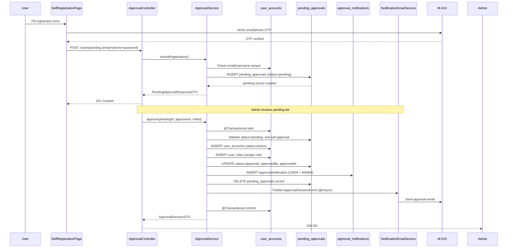

# F-001 — Lean Architecture Design: User Account Management

## Summary

This design defines a Spring Security + JWT authentication architecture with RBAC, soft-delete entity lifecycle, and a self-registration approval workflow built on transactional multi-step operations. The key trade-off is a JSON-based permission matrix in the Role table (flexible, schema-free) versus strict permission tables — chosen for rapid iteration within the Vietnamese administrative system, with an explicit migration path to normalized permissions if the role-permission complexity grows.

---

## System Boundaries

### Service / Module

| Aspect | Detail |
|---|---|
| **Module** | M-001 — Quản trị hệ thống (System Administration) |
| **Feature** | F-001 — Quản lý tài khoản người dùng (local) |
| **Backend package** | `com.hanghai.kchtg.user` (entities, repos, dtos, services, controller) |
| **Security package** | `com.hanghai.kchtg.security` (JwtFilter, SecurityConfig, UserDetailsService) |
| **Frontend** | React 18 + Vite + TypeScript + Ant Design, under `frontend/src/` |
| **Database** | MSSQL 2022, managed by Flyway migrations (V1–V5) |
| **Owns** | UserAccount, Role, UserRole, PasswordResetToken, PendingApproval, ApprovalNotification, UserGroup, GroupMember |
| **Calls** | M-010 F-271 (email/phone verification OTP for self-registration) |
| **Exposed** | REST API at `/api/v1/` — user CRUD, auth, roles, groups, approval endpoints |

**Cross-module ownership:**
- **AccessLog** (`access_logs` table) is owned by F-005 — F-001 publishes access log events; F-005 consumes and persists.
- **AdminAccount** (`admin_accounts` table) is owned by F-004 — F-001 defines the entity contract but F-004 owns its lifecycle.
- **Organization** (`organizations` table) is owned by F-003 — F-001 references `organizationId` as a FK.

---

## Integration Model

| Integration | Type | Contract | Timeout | Retry | Idempotent |
|---|---|---|---|---|---|
| **F-001 → M-010 F-271** | HTTP REST (consumes) | OTP verification endpoint: verify email or phone. Returns success/error. | 5 s | Yes — 3 retries with exponential backoff (1s, 2s, 4s) | Yes — verify same OTP twice returns same result |
| **F-001 → SMTP** | Async email (via `@Async`) | `NotificationEmailService` sends approval notifications. Configured via `spring.mail.*`. | 10 s | Yes — 2 retries + dead-letter queue | No — idempotency via `sent` flag on `ApprovalNotification` |
| **F-001 → F-005 (AccessLog)** | Spring ApplicationEvent (internal) | `AccessLogService` listens for user management events, writes to `access_logs`. | N/A (sync in-process) | N/A | Yes — dedup by event ID |
| **F-004 (AdminAccount)** | FK reference | F-001 `ApprovalService.approve()` references `approvedBy` FK → `user_accounts(id)`. | N/A | N/A | N/A |

**Trust boundaries:**
1. **Public boundary:** Self-registration (`POST /api/v1/users/pending`) and password reset endpoints — unauthenticated, behind rate limiting.
2. **Authenticated boundary:** JWT-protected endpoints — validated by `JwtAuthenticationFilter` before reaching controllers.
3. **Authorization boundary:** `@PreAuthorize` annotations enforce role-based access within service methods.
4. **Cross-module boundary:** M-010 F-271 OTP verification — calls external module over HTTP with token auth.

---

## Data Architecture

### Entity Ownership & Consistency

| Entity | Owner | Storage | Consistency | Migration |
|---|---|---|---|---|
| `user_accounts` | F-001 | MSSQL, Flyway V1 | ACID transaction | Existing |
| `roles` | F-001 | MSSQL, Flyway V2 (seeded) | ACID | Existing |
| `user_roles` | F-001 | MSSQL, Flyway V3 | FK → user_accounts, roles; UNIQUE(user_id, role_id) | Existing |
| `password_reset_tokens` | F-001 | MSSQL, Flyway V4 | FK → user_accounts; expires_at index; cascade delete | Existing |
| `pending_approvals` | F-001 (approval workflow) | MSSQL, Flyway V5 | UNIQUE(username), UNIQUE(email); CHECK(status) | New |
| `approval_notifications` | F-001 (approval workflow) | MSSQL, Flyway V5 | FK → pending_approvals; CHECK(recipient_type, notification_type) | New |
| `user_groups` | F-002 | MSSQL, Flyway V6 (future) | UNIQUE(name), UNIQUE(code) | Out of scope for F-001 |
| `group_members` | F-002 | MSSQL, Flyway V6 (future) | FK → user_groups, user_accounts | Out of scope for F-001 |
| `access_logs` | F-005 | MSSQL, Flyway (future) | FK → user_accounts | Out of scope for F-001 |

### Soft Delete Pattern

All entity tables include `deleted_at DATETIME2 NULL`. JPA `@Where(clause = "deleted_at IS NULL")` or custom repository methods (`findAllNonDeleted()`) filter soft-deleted rows. **No hard deletes** — data integrity preserved for audit and reporting.

### Lockout Fields (BR-007)

`user_accounts` includes:
- `login_attempts INT DEFAULT 0` — incremented on failed login, reset on success.
- `locked_until DATETIME2 NULL` — set to `now + 30 minutes` when attempts ≥ 5. Cleared on unlock.

### Password Hashing (BR-002)

BCrypt with strength factor 12 (default Spring Security `BCryptPasswordEncoder`). `password_hash NVARCHAR(255)` column accommodates BCrypt output length.

### RBAC Design (BR-005)

| Decision | Detail |
|---|---|
| **Model** | Role → User via many-to-many (`user_roles` junction) |
| **Permissions storage** | JSON column `permissions NVARCHAR(MAX)` in `roles` table |
| **Rationale** | Flexible for rapid iteration; no schema change needed for new permissions |
| **Limitation** | No fine-grained resource/action auditing; permission validation is in-process JSON matching |
| **Migration path** | If RBAC complexity grows, migrate to `permissions` + `role_permissions` normalized tables |

### Approval Workflow Data Flow



---

## Security Design

### Authentication Flow

```mermaid
flowchart TD
    A[Client sends POST /auth/login with username+password] --> B[JwtAuthenticationFilter]
    B --> C[UserDetailsService.loadUserByUsername]
    C --> D[Check status=active]
    D -->|blocked| E[Return 403: Account locked]
    D -->|active| F[BCrypt match password]
    F -->|fail| G[Increment login_attempts]
    G -->|attempts >= 5| H[Set locked_until = now+30min]
    G -->|attempts < 5| I[Return 401: Invalid credentials]
    F -->|match| J[Reset login_attempts to 0]
    J --> K[Generate JWT access token (30 min) + refresh token (7 days)]
    K --> L[Return tokens in response body]
    L --> M[Client stores tokens, attaches Bearer to subsequent requests]
```

**JWT Token Structure:**
- **Access token:** 30-minute expiration, claims: `sub` (userId), `roles` (array of role codes), `email`.
- **Refresh token:** 7-day expiration, stored in client-side secure storage; validated against no store (stateless) — revoked only by password change or account lock.

**Token Revocation Strategy:** Stateless — no token blacklist store. Revocation is achieved by:
1. Changing user password → refresh tokens invalidated (client detects auth error, must re-login).
2. Locking account → `JwtAuthenticationFilter` checks `status=blocked` on every request.
3. Deleting account → `deletedAt != NULL` check in `UserDetailsService`.

### Authorization Model

| Endpoint Pattern | Allowed Roles | Enforcement Mechanism |
|---|---|---|
| `POST /auth/login`, `/forgot-password`, `/reset-password` | Public | Rate limiting (50/15min login, 3/15min reset) |
| `POST /users/pending` | Public (with OTP verification from M-010) | Rate limiting, OTP validation |
| `GET/PUT /users/me` | Any authenticated JWT | Self-only check in service layer |
| `GET/POST /users`, `PUT /users/{id}`, `DELETE /users/{id}` | `SYSTEM_ADMIN` | `@PreAuthorize("hasRole('SYSTEM_ADMIN')")` |
| `POST/PATCH /users/{id}/status` (lock/unlock) | `SYSTEM_ADMIN`, `CAN_BO` | `@PreAuthorize("hasRole('SYSTEM_ADMIN') or hasRole('CAN_BO')")` |
| `POST /users/{id}/reset-password` | `SYSTEM_ADMIN` | `@PreAuthorize("hasRole('SYSTEM_ADMIN')")` |
| `GET/POST /roles`, `PUT /roles/{id}`, `DELETE /roles/{id}` | `SYSTEM_ADMIN` | `@PreAuthorize("hasRole('SYSTEM_ADMIN')")` |
| Approval endpoints (`/users/pending`, approve, reject) | `ADMIN_OPERATION`, `SYSTEM_ADMIN` | `@PreAuthorize("hasRole('ADMIN_OPERATION') or hasRole('SYSTEM_ADMIN')")` |
| `GET /users/{id}/pending-status` | JWT-authenticated (self only) | Service-layer principal ID equals requested user ID |

**Role Assignment Guard (BR-005):** `UserService.assignRole()` validates that the requesting principal has `SYSTEM_ADMIN` role before allowing role changes. Attempted role changes from `CAN_BO` or other roles return 403 Forbidden.

### Password Policy (BR-002)

| Action | Requirement | Implementation |
|---|---|---|
| User creation / self-registration | ≥8 chars, uppercase + lowercase + digit | `PasswordValidator` custom validator, enforced in `UserService.createUser()` and `ApprovalService.submitRegistration()` |
| Admin reset password | ≥8 chars, contains letter + digit (no special char required) | `PasswordValidator.resetPolicy()` — relaxed policy for admin-initiated resets |
| Password change (self) | ≥8 chars, uppercase + lowercase + digit | Same as creation policy |

### Rate Limiting (BR-007)

| Endpoint | Limit | Implementation |
|---|---|---|
| `POST /auth/login` | 50 requests / 15 minutes | Spring RateLimiter (Token Bucket) keyed by IP address |
| `POST /auth/forgot-password` | 3 requests / 15 minutes | Spring RateLimiter keyed by email |
| `POST /auth/totp/verify` | 5 attempts / 5 minutes | Spring RateLimiter keyed by temp_token |
| Login auto-lockout | 5 failed attempts → 30 min lock | `login_attempts` + `locked_until` on `user_accounts` |

### Secret Management

| Secret | Source | Storage |
|---|---|---|
| JWT secret | `${JWT_SECRET}` env var | application.yml profile |
| BCrypt salt | Auto-generated by `BCryptPasswordEncoder` | N/A |
| SMTP credentials | `${SPRING_MAIL_USERNAME}`, `${SPRING_MAIL_PASSWORD}` | application.yml profile |
| AES encryption key (F-007, referenced) | `${AES_ENCRYPTION_KEY}` env var | application.yml profile |

---

## Deployment

### Environment Variables Required

| Variable | Purpose | Required For | Default |
|---|---|---|---|
| `JWT_SECRET` | HMAC signing key for JWT tokens | All authenticated endpoints | — |
| `JWT_EXPIRATION_MS` | Access token lifetime in ms | Token generation | `3600000` (1 hour) |
| `JWT_REFRESH_EXPIRATION_MS` | Refresh token lifetime in ms | Token generation | `604800000` (7 days) |
| `SPRING_MAIL_HOST` | SMTP server hostname | Notification emails | — |
| `SPRING_MAIL_PORT` | SMTP server port | Notification emails | `587` (TLS) |
| `SPRING_MAIL_USERNAME` | SMTP username | Notification emails | — |
| `SPRING_MAIL_PASSWORD` | SMTP password | Notification emails | — |
| `SPRING_MAIL_TLS_ENABLED` | TLS on/off | Notification emails | `true` |

### Application Properties

```yaml
spring:
  datasource:
    url: jdbc:sqlserver://localhost:1433;databaseName=haihang;encrypt=true;trustServerCertificate=true
    driver-class-name: com.microsoft.sqlserver.jdbc.SQLServerDriver
  jpa:
    hibernate:
      ddl-auto: validate  # Flyway manages schema exclusively
    properties:
      hibernate:
        dialect: org.hibernate.dialect.SQLServerDialect
  mail:
    host: ${SPRING_MAIL_HOST}
    port: ${SPRING_MAIL_PORT}
    username: ${SPRING_MAIL_USERNAME}
    password: ${SPRING_MAIL_PASSWORD}
    properties:
      mail:
        smtp:
          auth: true
          tls:
            enable: ${SPRING_MAIL_TLS_ENABLED}
  task:
    execution:
      pool:
        core-size: 4
        max-size: 8
        queue-capacity: 100

app:
  jwt:
    secret: ${JWT_SECRET}
    expiration-ms: 3600000
    refresh-expiration-ms: 604800000
  password:
    min-length: 8
    require-uppercase: true
    require-lowercase: true
    require-digit: true
    history-count: 5
  rate-limit:
    login: 50/15min
    password-reset: 3/15min
    totp-verify: 5/5min
```

### Migration Strategy

| Migration | Table(s) | Dependency | Rollback |
|---|---|---|---|
| V1 | `user_accounts` | — | DROP TABLE |
| V2 | `roles` (seeded) | — | DROP TABLE + re-seed |
| V3 | `user_roles` | V1, V2 | DROP TABLE |
| V4 | `password_reset_tokens` | V1 | DROP TABLE |
| V5 | `pending_approvals`, `approval_notifications` | V1 | DROP TABLEs |

**Rollout order:** Apply V1 → V2 → V3 → V4 (existing) → V5 (approval workflow). All migrations idempotent via Flyway checksums.

### Deployment Considerations

1. **Blue-green / canary:** Stateless service, safe for rolling deployment. Approval endpoints are additive — no breaking changes to existing APIs.
2. **Feature flag (optional):** Wrap approval workflow endpoints behind a feature flag (`app.feature.approval.enabled=true`) to enable/disable without redeployment.
3. **Async thread pool:** `@Async` for email notifications requires configured `spring.task.execution.pool.*` — monitor queue capacity for backpressure.
4. **Role seeding:** `ADMIN_OPERATION` role must be seeded in V2 or as a separate seed script before deployment — `@PreAuthorize` will fail without it.

---

## NFR Architecture

| NFR Ref | Requirement | Architecture Solution | Target | Trade-off |
|---|---|---|---|---|
| **Perf-001** | User list < 500ms for 1000 records | Spring `Pageable`, indexed `status` + `email` columns, `@Transactional(readOnly=true)` on query methods | < 500ms | Pagination cap at 100/page reduces risk of runaway queries |
| **Sec-001** | Password hashing with BCrypt | `BCryptPasswordEncoder` with default strength 12 on every password set | OWASP Top 10 compliant | BCrypt is CPU-intensive but acceptable for user-account volume |
| **Sec-002** | JWT 30 min access, 7 day refresh | Stateless JWT — no server-side token store needed | Configurable via `app.jwt.*` | No server-side revocation — account lock/username change provides equivalent protection |
| **Sec-003** | Rate limiting on login/reset | Spring `RateLimiter` (Token Bucket) keyed by IP/email | 50/15min login, 3/15min reset | Memory-based rate limiter — stateless but not cluster-shared across instances (acceptable for ≤1000 users) |
| **Rel-001** | Soft delete (no hard deletes) | `deleted_at DATETIME2 NULL` + repository filter | Data integrity preserved | Slightly larger dataset; queries must always filter `deleted_at IS NULL` |
| **Rel-002** | Transactional approval operation | `@Transactional` on `ApprovalService.approve()` — multi-step (create user + role + notification + delete pending) | Atomic or all rollback | Long-running transaction holds locks; acceptable since approval is admin-initiated, not high-concurrency |
| **Sec-004** | BR-007: 5 failed logins → auto-lock | `login_attempts` counter + `locked_until` on `user_accounts`; checked in `UserDetailsService` | 30-minute lockout | Counter persists across restarts; if DB is reset, lockout state is lost |
| **Rel-003** | Approval race condition prevention | `@Version` optimistic lock on `PendingApproval`; service-layer one-at-a-time guard | No duplicate approvals | Optimistic lock causes `OptimisticLockingFailureException` — retry logic recommended in service |
| **Sec-005** | PII protection | No PII in JWT payload; passwordHash never logged; access logs captured by F-005 | GDPR / Vietnamese data protection compliance | Email stored in JWT claims — acceptable for system-internal use, not for third-party sharing |

---

## Key Decisions

| Decision | Chosen | Rejected | Rationale |
|---|---|---|---|
| **Permission model** | JSON column in `roles` table | Normalized `permissions` + `role_permissions` tables | JSON is schema-free, fast to iterate; normalized tables add query complexity without proportional benefit for a ≤500-user administrative system |
| **Soft delete vs hard delete** | `deleted_at` timestamp (soft) | `ON DELETE CASCADE` (hard) | Regulatory audit trail requirement; data recovery capability; F-005 AccessLog references deleted accounts by ID |
| **JWT store** | Stateless (no token store) | Server-side token blacklist / Redis store | Simpler deployment; account lock/password change provides equivalent revocation; acceptable for this scale |
| **Lockout mechanism** | Database counter (`login_attempts` + `locked_until`) | In-memory counter (e.g., Spring Session) | Persists across service restarts; no shared-state coordination needed across instances |
| **Approval transaction** | Single `@Transactional` method | Distributed saga with compensation | Approval is admin-initiated (low concurrency); ACID rollback is sufficient; saga adds complexity for negligible benefit |
| **Email delivery** | `@Async` with thread pool | Message queue (RabbitMQ, Kafka) | Simpler deployment for single-instance; MQ adds operational overhead not justified by volume |
| **Password hashing** | BCrypt (Spring Security default) | Argon2id | BCrypt is battle-tested, well-integrated with Spring Security; Argon2id offers better GPU resistance but requires `spring-security-crypto` additional dependency — deferred pending security audit |
| **Self-registration** | PendingApproval workflow (admin-mediated) | Direct creation with email verification only | Vietnamese administrative system requires human oversight for new accounts; approval workflow provides audit trail and role validation |
| **M-010 integration** | HTTP REST with OTP verification | Direct database access or shared library | Loose coupling; M-010 F-271 owns its data; HTTP contract is versionable and testable independently |
| **Frontend state management** | Zustand stores (authStore, permissionStore) | Redux Toolkit | Simpler boilerplate, lighter bundle; consistent with existing `frontend/src/store/` convention identified in tech-lead plan |

---

## Risks & Assumptions

### Risks

| Risk | Impact | Likelihood | Mitigation |
|---|---|---|---|
| Concurrent approval race condition — two admins approve same pending request simultaneously | High | Medium | `@Version` optimistic lock on `PendingApproval`; service-layer `findByEmailAndStatus(pending)` check before approve |
| M-010 F-271 email/phone verification not available when approval workflow starts (Sprint 7) | High | Medium | Confirm M-010 F-271 completion before Sprint 7; fallback: mock verification for dev; feature flag to disable self-registration |
| SMTP misconfiguration — email notifications fail silently | Medium | Medium | `@Async` with retry (2 retries) + dead-letter; health check endpoint to verify SMTP connectivity |
| `ADMIN_OPERATION` role not seeded — `@PreAuthorize` fails at runtime | High | Medium | Include seed INSERT in V2 migration or separate V0-seed script; CI pipeline validates seed data |
| Anti-self-approval logic error — approver ID extraction from JWT principal fails | Medium | Low | Explicit unit test for the guard; log approver/applicant IDs in approval events |
| Transaction rollback during approval — partial user/role creation | High | Low | `@Transactional(propagation = REQUIRED)` — atomic; if any step fails, entire transaction rolls back |
| JSON permission queries become slow as permissions grow | Medium | Low | Add computed persisted column `permissions_hash` for quick checks; migrate to normalized tables if query latency exceeds 50ms |

### Assumptions

1. **MSSQL 2022 availability** — database server must be reachable by application pods during migration V1–V5.
2. **SMTP infrastructure** — an SMTP server (internal or third-party) must be provisioned before F-001 approval workflow goes to production.
3. **User count ≤ 1000** — performance targets (< 500ms for 1000 records) are based on this assumption; if scale exceeds this, indexing and query optimization must be revisited.
4. **No SSO/OAuth in F-001 scope** — self-registration is the only external user onboarding path; SSO integration (if needed) is deferred to a future feature.
5. **F-005 (AccessLog) is implemented concurrently** — F-001 publishes events; F-005 must consume them for audit trail completeness.
6. **M-010 F-271 OTP verification endpoint contract** — assumes M-010 provides a POST `/api/v1/verify-otp` endpoint accepting `{type, value, otp}` and returning `{verified: boolean}`. Exact endpoint must be confirmed with M-010 SA.

---

## Handoff Guidance

### For engineering-technical-lead
- Wave 1 (Days 1–3): Entities, repositories, DTOs, Flyway V1–V4 migrations are the critical path. Frontend scaffolding (routing, auth store) can run in parallel.
- Wave 2 (Days 4–11): JWT filter chain (`JwtAuthenticationFilter` + `SecurityConfig`) must be completed before frontend can test authenticated API calls.
- Wave 3 (Days 15–22): Approval workflow requires M-010 F-271 OTP endpoint. Confirm completion before Sprint 7.

### For engineering-backend-developer
- Use `com.hanghai.kchtg` as the base package (per tech-lead plan).
- Entity classes go in `com.hanghai.kchtg.user.entity`; repositories in `com.hanghai.kchtg.user.repository`; services in `com.hanghai.kchtg.user.service`; controller in `com.hanghai.kchtg.user.controller`.
- Security classes go in `com.hanghai.kchtg.security` (JwtFilter, SecurityConfig, UserDetailsService).
- Use `LocalDateTime` for all date fields; use `DATETIME2` in Flyway migrations (MSSQL).
- BCrypt strength factor 12 for password hashing.
- Use `@PreAuthorize` for authorization — NOT manual role checks in controller layers.

### For engineering-frontend-developer
- API client base URL: `/api/v1/` (proxied via Vite dev server).
- Token storage: `localStorage` for access token, `httpOnly cookie` or `sessionStorage` for refresh token (security review needed).
- Page components under `frontend/src/pages/`, shared components under `frontend/src/components/`.
- Zustand stores for auth state (`authStore.ts`, `permissionStore.ts`).
- Role-based button visibility via `PermissionGuard.tsx` component.

### For engineering-qa-engineer
- Critical test areas: password policy validation, lockout logic (5 attempts), soft delete with data-dependency check (BR-003), approval transaction atomicity, anti-self-approval guard, RBAC authorization (`@PreAuthorize`).
- E2E test: full self-registration → approval → login → role verification.
- Security test: JWT payload does not contain PII beyond userId, roles, email.

### For utility-security-auditor (triggered)
- New auth/authz boundary (JWT + RBAC).
- PII processing (user accounts with email, phone, full name).
- Password policy enforcement (BR-002).
- Rate limiting and auto-lockout (BR-007).
- Token expiry management (BR-006).

---

## KB Reference Note

Knowledge base query in domains `architecture`, `ecosystem`, and `security` returned **no results**. This architecture design is grounded in:
1. The BA spec (`ba/00-lean-spec.md`) — 307 lines of business rules, actors, entities, API contracts.
2. The feature brief (`feature-brief.md`) — 130 lines of scope, roles, entities, acceptance criteria.
3. The tech-lead plan (`tech-lead/04-plan.md`) — 732 lines of detailed implementation plan, database schema, task breakdown.
4. The module brief (`module-brief.md`) — 25 lines of module context and feature ordering.
5. Standard Spring Boot 3.x + Spring Security + Spring Data JPA conventions (official documentation, applied per ecosystem best practices).

---

<verdict_envelope>
  <verdict>Pass</verdict>
  <confidence>high</confidence>
  <structured_summary>
    <key_findings>
      <item>F-001 is a local feature within M-001 (System Administration), consuming M-010 F-271 for OTP verification</item>
      <item>Architecture uses Spring Security + JWT (stateless), BCrypt password hashing, RBAC with JSON permissions in Role table</item>
      <item>Self-registration approval workflow requires PendingApproval + ApprovalNotification entities (Flyway V5), transactional multi-step operations with optimistic locking</item>
      <item>Soft delete via deleted_at timestamp on all entity tables; no hard deletes</item>
      <item>Auto-lockout after 5 failed logins (BR-007) via login_attempts + locked_until on user_accounts</item>
      <item>7 approval API endpoints defined with @PreAuthorize for ADMIN_OPERATION/SYSTEM_ADMIN roles</item>
      <item>Rate limiting: 50/15min login, 3/15min password reset, 5/5min TOTP verify</item>
      <item>KB returned no results in architecture/ecosystem/security domains — design grounded in BA spec, feature brief, tech-lead plan, and Spring Boot conventions</item>
      <item>Triggered specialist: utility-security-auditor (new auth boundary, PII, rate limiting, password policy)</item>
    </key_findings>
    <artifacts_produced>
      <item>docs/modules/M-001-quan-tri-he-thong/_features/F-001-quan-ly-tai-khoan-nguoi-dung/sa/00-lean-architecture.md</item>
    </artifacts_produced>
  </structured_summary>
  <blockers>
    <blocker>
      <code>M-010-F-271-COMPLETION</code>
      <description>Self-registration approval workflow (Wave 3, Sprint 7) depends on M-010 F-271 email/phone verification OTP endpoint. Must confirm M-010 completion status before Sprint 7 begins.</description>
    </blocker>
    <blocker>
      <code>SMTP-CONFIG-NEEDED</code>
      <description>NotificationEmailService requires SMTP configuration (host, port, credentials, TLS). Must configure spring.mail.* env vars before Sprint 8 deployment.</description>
    </blocker>
    <blocker>
      <code>ADMIN-OPERATION-ROLE-SEED</code>
      <description>ADMIN_OPERATION role must be seeded in roles table (via V2 migration or separate seed script) before @PreAuthorize("hasRole('ADMIN_OPERATION')") will resolve.</description>
    </blocker>
    <blocker>
      <code>FRONTEND-DESIGN-REQUIRED</code>
      <description>PendingApprovalPage and SelfRegistrationPage require UI design specs before Sprint 7 implementation. Must be delivered by designer.</description>
    </blocker>
    <blocker>
      <code>M-010-OTP-ENDPOINT-CONTRACT</code>
      <description>Exact M-010 F-271 OTP verification endpoint contract (path, request/response schema) must be confirmed with M-010 SA before Sprint 7 implementation.</description>
    </blocker>
  </blockers>
</verdict_envelope>