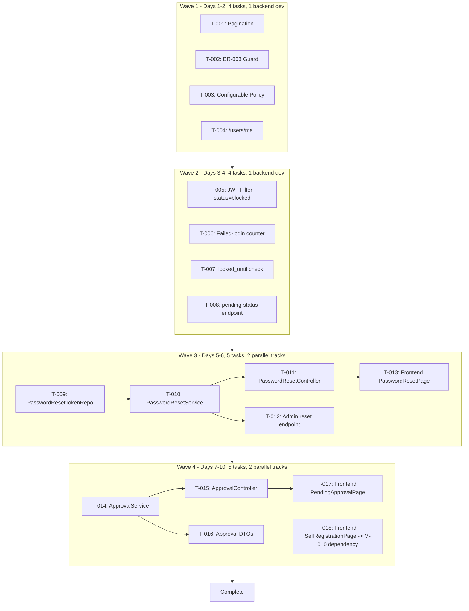

# F-001 - User Account Management: Tech Lead Execution Plan

## Change Overview

F-001 implements a complete user account management system within M-001 (System Administration). The feature covers user CRUD, RBAC, soft delete, lock/unlock, password reset, self-registration with admin approval workflow, and search/filter with pagination.

**Current codebase state (as of planning):**

| Component | Status | Details |
|---|---|---|
| `User` entity | EXISTS | UUID PK, username, email, fullName, phone, orgUnit, roles, status, lockout fields, TOTP fields, passwordHashVersion |
| `Role` entity | EXISTS | Name, code, description, permissions (many-to-many with Permission), status, userCount |
| `PasswordResetToken` entity | EXISTS | FK-User, token (unique), expiresAt, used flag, 1-hour expiry |
| `PendingApproval` entity | EXISTS | username, email, passwordHash, requestedRoleCode, status (pending/approved/rejected), approvedBy, rejectionReason |
| `ApprovalNotification` entity | EXISTS | FK-PendingApproval, recipientType, notificationType, sent flag |
| `UserService` | EXISTS | CRUD, soft delete (via BaseEntity), lock/unlock (changeStatus), findByUsername/email |
| `AuthService` | EXISTS | authenticate(identifier+password) with status check |
| `RegistrationService` | EXISTS | Email verification-based registration with rate limiting, dedup, audit |
| `JwtAuthFilter` | EXISTS | Bearer token parsing, mock-token dev mode, TOTP-aware path allowlist |
| `TokenService` | EXISTS | access token + refresh token creation |
| `UserRepository` | EXISTS | findAllWithRelations, findByIdWithRelations, findByUsernameWithRelations, existsByUsername/email |
| `PasswordPolicyValidator` | EXISTS | Hardcoded min 12 + special char (needs config alignment with BA spec: 8 chars, upper+lower+digit) |
| `NotificationService` | EXISTS | sendVerificationEmail, sendPasswordResetEmail (stub) |
| `UserController` | EXISTS | CRUD + lock/unlock (no pagination, no BR-003 guard) |
| `AuthController` | EXISTS | Login (TOTP-aware), 2FA TOTP verification |
| `RoleController` | EXISTS | Role CRUD |
| `PermissionController` | EXISTS | Permission CRUD + overrides |
| `RegistrationController` | EXISTS | POST /api/register |
| `VerificationController` | EXISTS | Email/phone verification |
| `TotpSetupController` | EXISTS | TOTP enrollment & verification |
| `PendingApprovalRepository` | EXISTS | findByUsernameAndStatus, findByEmailAndStatus, findByStatusOrderedByCreated |
| Approval workflow service | MISSING | No `ApprovalService` or `ApprovalController` - pending approvals not browsable/approved/rejected via API |
| Password reset API | PARTIAL | `PasswordResetToken` entity exists but no `PasswordResetService`/controller endpoints |
| Frontend user management | PARTIAL | `UsersPage.tsx` exists but no pagination, no self-registration page, no approval management page, no password-reset pages |
| BR-003 data-dependency check | MISSING | `UserService.delete()` does not check phanhen/bao cao references before soft delete |

## Requirement-to-Execution Mapping

| BA Requirement | Current Implementation | Gap |
|---|---|---|
| AC-001: Create user with email unique + strong password | UserService.create() checks email/username uniqueness, PasswordPolicyValidator validates password | PASS - email unique + password policy exist |
| AC-002: Create fails on duplicate email | UserService.create() throws IllegalArgumentException | PASS |
| AC-003: Create fails on weak password | PasswordPolicyValidator validates uppercase+lowercase+digit+length+specialChar | NEED-ALIGN: Policy is hardcoded 12+specialChar; BA spec says 8+upper+lower+digit. Need configurable policy. |
| AC-004/005: Lock/Unlock user | UserController lock/unlock endpoints + UserService.changeStatus() | PASS - endpoints exist |
| AC-006: Delete fails with related data | UserService.delete() - NO BR-003 check | **MISSING** - need phanhen/bao cao FK check |
| AC-007: Soft delete success | UserService.delete() calls BaseEntity.softDelete() | PASS - BaseEntity has deletedAt + softDelete() |
| AC-008: Search/filter with pagination | UserController.list() returns ALL users (no pagination) | **MISSING** - need Pageable pagination (default 20, max 100) |
| AC-009: Admin password reset | PasswordResetToken entity exists; no service or API | **MISSING** - need PasswordResetService + ResetPasswordController |
| AC-010: Blocked account cannot login | AuthService checks status=LOCKED | NEED-VERIFY: Need to confirm lockout check in TOTP path (TotpAuthService) |
| AC-011: Auto-lock after 5 failed logins | User entity has failedLoginCount, accountLockedUntil; AuthService checks status | NEED-IMPLEMENT: Failed attempt counter increment not in TOTP flow - needs implementation |
| AC-012: Only Admin can assign roles | @PreAuthorize("@auth.check(..., 'admin:manage')") on UserController | PASS - role assignment requires admin:manage permission |
| AC-013: Individual can only edit own info | No self-edit endpoint exists | **MISSING** - need GET/PUT /api/users/me with principal check |
| AC-014: Password reset token expiry | PasswordResetToken.create() sets 1-hour expiry; isExpired() method | PASS - entity supports it; need API |
| AC-015: Leader can only view/approve | PendingApproval entity exists; no ApprovalController | **MISSING** - need approval workflow API |

## Implementation Scope

### Backend Packages (com.hanghai.kchtg)

| Package | Responsibility | Files to Create/Modify |
|---|---|---|
| `com.hanghai.kchtg.user.entity` | Domain entities | `PasswordResetToken` (already exists), `PendingApproval` (already exists) |
| `com.hanghai.kchtg.user.repository` | Data access | `PasswordResetTokenRepository` (MISSING), `ApprovalNotificationRepository` (EXISTS), `PendingApprovalRepository` (EXISTS) |
| `com.hanghai.kchtg.user.service` | Business logic | `PasswordResetService` (NEW), `ApprovalService` (NEW), modify `UserService` (BR-003 guard, pagination), modify `PasswordPolicyValidator` (configurable), modify `TotpAuthService` (BR-007 lockout counter) |
| `com.hanghai.kchtg.user.controller` | REST API | `PasswordResetController` (NEW), `ApprovalController` (NEW), modify `UserController` (pagination, self-edit) |
| `com.hanghai.kchtg.user.dto` | Data transfer objects | New DTOs for password reset, approval decisions, paginated user list |
| `com.hanghai.kchtg.security` | Auth infrastructure | Modify `JwtAuthFilter` (add status=blocked check on every request), verify BR-007 lockout in filter |

### Frontend (frontend/src/)

| Path | Responsibility | Files to Create/Modify |
|---|---|---|
| `frontend/src/pages/UsersPage.tsx` | User list | Add pagination, search/filter toolbar |
| `frontend/src/pages/SelfRegistrationPage.tsx` | New | Public self-registration form with OTP verification |
| `frontend/src/pages/PendingApprovalPage.tsx` | New | Admin/Leader approval queue (view, approve, reject) |
| `frontend/src/pages/PasswordResetPage.tsx` | New | Forgot password + reset password forms |
| `frontend/src/pages/ProfilePage.tsx` | New | Self-service profile edit (GET/PUT /users/me) |

### Database Migrations

| Migration | Description | Dependency |
|---|---|---|
| V18 | `password_reset_tokens` table (if not already created by prior migration) | - |
| V19 | `pending_approvals` table + seed `ADMIN_OPERATION` role | V18 |
| V20 | `approval_notifications` table | V19 |

## Impacted Areas

### Areas Requiring DevOps Review
- **Environment variables**: `JWT_SECRET`, `JWT_EXPIRATION_MS`, `SPRING_MAIL_*` for email notifications - already partially configured in `application.yml`
- **SMTP configuration**: `NotificationService` async email delivery requires SMTP env vars - must be configured before approval workflow goes to production
- **Database**: Flyway migrations V18+ for `password_reset_tokens` and approval tables - verified by CI pipeline

### Areas Requiring Designer Dependency
- `SelfRegistrationPage.tsx` - public registration form with OTP verification, password strength meter
- `PendingApprovalPage.tsx` - admin approval queue with approve/reject actions
- `PasswordResetPage.tsx` - forgot password email input + reset password form
- `ProfilePage.tsx` - self-service profile edit form
- Enhanced `UsersPage.tsx` - pagination controls, search/filter toolbar

### Cross-Module Dependencies
- **M-010 F-271 (OTP verification)**: `RegistrationService` and `VerificationController` depend on external OTP verification endpoint - must confirm completion before self-registration sprint
- **F-005 (AccessLog)**: F-001 publishes `@AuditLog` annotations; F-005 consumes them - concurrent implementation required

## Task Breakdown

### Wave 1: Foundation - Pagination, BR-003 Guard, Configurable Password Policy (Days 1-2)

**Objective:** Fix existing UserService gaps and make password policy configurable.

| Task ID | Description | Dependency | Owner Type | Parallelizable | Risk |
|---|---|---|---|---|---|
| T-001 | Implement pagination in `UserService.findAll()` - return `Page<User>` using Spring `Pageable`; add `@Transactional(readOnly=true)` | None | `engineering-backend-developer` | Yes | Low |
| T-002 | Implement BR-003 data-dependency check in `UserService.delete()`: query phanhen/bao cao FK references before soft delete; throw meaningful error if related data exists | T-001 (same class) | `engineering-backend-developer` | No (sequential in code with T-001) | Medium |
| T-003 | Make `PasswordPolicyValidator` configurable: read min-length, require-uppercase, require-lowercase, require-digit, require-special from `app.password.*` properties (match SA `application.yml` defaults: min 8, upper+lower+digit required) | None | `engineering-backend-developer` | Yes | Low |
| T-004 | Add `GET /users/me` endpoint to `UserController` (return current authenticated user's info) + `PUT /users/me` (allow current user to update their own fullName, phone - email requires verification) | T-001 | `engineering-backend-developer` | Yes | Low |

**File ownership:** `src/main/java/com/hanghai/kchtg/user/service/UserService.java`, `src/main/java/com/hanghai/kchtg/user/controller/UserController.java`, `src/main/java/com/hanghai/kchtg/user/service/PasswordPolicyValidator.java`

**QA Guidance per task:**
- T-001: Verify paginated list returns correct page content; default 20 items/page; max 100 enforced; total count correct
- T-002: Verify delete fails with clear error message when user has related phanhen/bao cao records; verify soft delete succeeds when no related data
- T-003: Verify password validation with 8-char password (should pass with config aligned to BA spec); verify 7-char fails; verify special-char requirement toggle
- T-004: Verify authenticated user can GET their own profile; verify PUT updates only fullName/phone; verify non-admin cannot view other users' data via /me endpoint

### Wave 2: JWT Filter Enhancement + TOTP Lockout Counter (Days 3-4)

**Objective:** Enhance authentication security - block locked/deleted accounts on every request, implement auto-lockout on 5 failed attempts.

| Task ID | Description | Dependency | Owner Type | Parallelizable | Risk |
|---|---|---|---|---|---|
| T-005 | Enhance `JwtAuthFilter` to check `status=blocked` on every authenticated request - reject with 403 if account is locked | T-001 | `engineering-backend-developer` | Yes | Medium |
| T-006 | Implement failed-login counter logic in `TotpAuthService.authenticateCredentials()`: increment `failedLoginCount` on failed password, set `accountLockedUntil` when counter >= 5, reset counter on success | T-005 | `engineering-backend-developer` | Yes | High |
| T-007 | Enhance `JwtAuthFilter` to check `accountLockedUntil > now` - reject locked accounts even if status is ACTIVE but locked_until is set | T-006 | `engineering-backend-developer` | Yes | Medium |
| T-008 | Add `GET /users/{id}/pending-status` endpoint (return pending registration status if user has a PendingApproval record) | None | `engineering-backend-developer` | Yes | Low |

**File ownership:** `src/main/java/com/hanghai/kchtg/security/JwtAuthFilter.java`, `src/main/java/com/hanghai/kchtg/user/service/TotpAuthService.java`, `src/main/java/com/hanghai/kchtg/user/controller/UserController.java`

**QA Guidance per task:**
- T-005: Verify locked account returns 403 even with valid JWT
- T-006: Verify after 5 failed login attempts, `failedLoginCount` is set to 5, `accountLockedUntil` is set to now + 30 minutes
- T-007: Verify locked account rejected by JWT filter regardless of status field
- T-008: Verify user can check their own pending registration status; verify non-self access denied

### Wave 3: Password Reset Flow (Days 5-6)

**Objective:** Implement complete password reset flow (forgot password -> email token -> reset password).

| Task ID | Description | Dependency | Owner Type | Parallelizable | Risk |
|---|---|---|---|---|---|
| T-009 | Create `PasswordResetTokenRepository` with methods: `findByToken(String)`, `findByUserIdAndExpiresAtAfter(UUID, LocalDateTime)`, `deleteByToken(String)` | None | `engineering-backend-developer` | Yes | Low |
| T-010 | Create `PasswordResetService` with methods: `requestReset(String email)` - creates token, sends email; `resetByToken(String token, String newPassword)` - validates expiry, hashes new password, invalidates old tokens, marks token used | T-009 | `engineering-backend-developer` | Yes | Medium |
| T-011 | Create `PasswordResetController` with endpoints: `POST /auth/forgot-password` (rate-limited: 3/15min), `POST /auth/reset-password/{token}` (rate-limited) | T-010 | `engineering-backend-developer` | Yes | Low |
| T-012 | Admin reset password endpoint: `POST /users/{id}/reset-password` on `UserController` with relaxed policy (>=8 chars, letter+digit, no special-char required) | T-010 | `engineering-backend-developer` | Yes | Low |
| T-013 | Frontend: `PasswordResetPage.tsx` - forgot password form (email input), reset password form (token + new password + strength meter) | T-011 | `engineering-frontend-developer` | Yes with backend | Low |

**File ownership:** `src/main/java/com/hanghai/kchtg/user/repository/PasswordResetTokenRepository.java` (NEW), `src/main/java/com/hanghai/kchtg/user/service/PasswordResetService.java` (NEW), `src/main/java/com/hanghai/kchtg/user/controller/PasswordResetController.java` (NEW), `frontend/src/pages/PasswordResetPage.tsx` (NEW)

**QA Guidance per task:**
- T-009: Verify repository methods work correctly
- T-010: Verify token is 1-hour expiry; verify reset flow invalidates old tokens; verify used token cannot be reused
- T-011: Verify rate limiting on forgot-password (3 per 15 minutes); verify 429 when exceeded
- T-012: Verify admin can reset any user's password with relaxed policy
- T-013: Verify forgot password form shows success toast after email sent; verify reset password form validates strength and calls API correctly

### Wave 4: Approval Workflow + Self-Registration (Days 7-10)

**Objective:** Implement admin approval workflow for self-registration pending accounts and self-registration frontend page.

| Task ID | Description | Dependency | Owner Type | Parallelizable | Risk |
|---|---|---|---|---|---|
| T-014 | Create `ApprovalService` with `listPending(pageable)`, `approve(String pendingId, String approverId, String roleId)`, `reject(String pendingId, String reason, String approverId)` - `approve()` is `@Transactional` covering: validate pending status, anti-self-approval guard, create UserAccount + UserRole, create ApprovalNotification, update/DELETE PendingApproval | None | `engineering-backend-developer` | Yes | High |
| T-015 | Create `ApprovalController` with endpoints: `GET /approvals/pending?pageable`, `POST /approvals/{id}/approve`, `POST /approvals/{id}/reject` - `@PreAuthorize` for `ADMIN_OPERATION` or `SYSTEM_ADMIN` | T-014 | `engineering-backend-developer` | Yes with T-014 | Medium |
| T-016 | Create DTOs: `PendingApprovalResponse`, `ApprovalDecisionRequest`, `ApprovalDecisionResponse` | T-014 | `engineering-backend-developer` | Yes | Low |
| T-017 | Frontend: `PendingApprovalPage.tsx` - table of pending approvals with approve/reject modal, reason input, role assignment dropdown | T-015 | `engineering-frontend-developer` | Yes with backend | Medium |
| T-018 | Frontend: `SelfRegistrationPage.tsx` - public registration form with OTP verification flow, password strength indicator | M-010 F-271 must be available | `engineering-frontend-developer` | Yes with backend | High |

**File ownership:** `src/main/java/com/hanghai/kchtg/user/service/ApprovalService.java` (NEW), `src/main/java/com/hanghai/kchtg/user/controller/ApprovalController.java` (NEW), `src/main/java/com/hanghai/kchtg/user/dto/` (NEW DTOs), `frontend/src/pages/PendingApprovalPage.tsx` (NEW), `frontend/src/pages/SelfRegistrationPage.tsx` (NEW)

**QA Guidance per task:**
- T-014: Verify `approve()` is atomic - if any step fails, everything rolls back; verify anti-self-approval guard; verify concurrent approval attempts prevented by `@Version` optimistic lock
- T-015: Verify non-`ADMIN_OPERATION`/`SYSTEM_ADMIN` users get 403 on approval endpoints
- T-016: Verify DTOs correctly map to entity fields
- T-017: Verify approve/reject modal works; verify toast notifications; verify table pagination
- T-018: Verify OTP verification flow (depends on M-010 F-271); verify submission creates pending record

## Execution Sequence



### Owner Type Distribution Per Wave

| Wave | Backend Tasks | Frontend Tasks | DevOps Tasks | Total |
|---|---|---|---|---|
| 1 | 4 (T-001-T-004) | 0 | 0 | 4 |
| 2 | 4 (T-005-T-008) | 0 | 0 | 4 |
| 3 | 4 (T-009-T-012) | 1 (T-013) | 0 | 5 |
| 4 | 3 (T-014-T-016) | 2 (T-017-T-018) | 0 | 5 |

**Note:** Wave 3 and Wave 4 exceed 4 parallel tasks. Wave 3 backend tasks (T-009 through T-012) have a strict sequential dependency chain (T-009 -> T-010 -> T-011). Wave 4 T-017 (frontend) and T-018 (frontend) can be dispatched in parallel.

## Technical Dependencies

| Dependency | Description | Status |
|---|---|---|
| M-010 F-271 (OTP verification) | `SelfRegistrationPage` depends on external OTP endpoint from M-010 | **BLOCKER** - must confirm completion before Wave 4 |
| F-005 (AccessLog) | F-001 publishes audit events via `@AuditLog`; F-005 must consume them | Concurrent implementation - no blocking |
| SMTP infrastructure | `NotificationService` requires `SPRING_MAIL_*` env vars for email delivery | **BLOCKER** - must configure before Wave 3 deployment |
| `ADMIN_OPERATION` role seed | Must exist in `roles` table before `@PreAuthorize` resolves | **BLOCKER** - seed in Flyway migration V19 |
| Flyway V18+ migrations | `password_reset_tokens`, `pending_approvals`, `approval_notifications` tables | **BLOCKER** - must run before Wave 3/4 |
| `BaseEntity.softDelete()` | Already implemented - used by `UserService.delete()` | Available |
| `PasswordEncoder` (BCrypt) | Spring Security default bean - available | Available |

## Implementation Risks

| Risk | Impact | Likelihood | Mitigation |
|---|---|---|---|
| Concurrent approval race condition - two admins approve same pending request | High | Medium | `@Version` optimistic lock on `PendingApproval` (per SA design); service-layer `findByEmailAndStatus(pending)` check before approve |
| M-010 F-271 OTP endpoint not ready when Wave 4 starts | High | Medium | Feature flag to disable self-registration (`app.feature.self-registration.enabled=false`); mock verification for dev |
| SMTP misconfiguration - email notifications fail silently | Medium | Medium | `@Async` with retry (2 retries) + dead-letter queue; health check endpoint to verify SMTP connectivity |
| `ADMIN_OPERATION` role not seeded - `@PreAuthorize` fails at runtime | High | Medium | Include seed INSERT in V19 migration |
| `PasswordPolicyValidator` hardcoded values conflict with BA spec | Medium | Low | Make configurable via `app.password.*` properties per SA design; add to `application.yml` defaults |
| User list pagination performance with JOIN FETCH on orgUnit + groups | Medium | Low | Add composite index on `(status, email)`; test with 1000 records - SA target is <500ms |
| Lockout state lost across service restarts | Medium | Low | `failedLoginCount` and `accountLockedUntil` persist in MSSQL - verified; only DB reset would lose state |
| Frontend dependency on missing backend APIs | High | Low | Wave 3 backend (T-009 through T-012) must be deployed before T-013; Wave 4 backend (T-014 through T-016) must be deployed before T-017/T-018 |

## Developer Guidance

### Backend Conventions

1. **Package structure:** All F-001 code under `com.hanghai.kchtg.user` (entities -> repositories -> dtos -> services -> controllers). Security code under `com.hanghai.kchtg.security`.
2. **Entity base:** All entities extend `BaseEntity` (provides UUID id, createdAt, updatedAt, deletedAt). Use `DATETIME2` in Flyway for timestamp columns.
3. **Soft delete:** Use `BaseEntity.softDelete()` - sets `deletedAt = LocalDateTime.now()`. All repository queries must filter `deletedAt IS NULL`.
4. **Transactions:** Class-level `@Transactional` on services. Read methods use `@Transactional(readOnly = true)`. ApprovalService `approve()` uses single `@Transactional` for atomic multi-step operation.
5. **Authorization:** Use `@PreAuthorize("@auth.check(authentication, 'admin:manage')")` pattern (consistent with existing code). New endpoints follow this pattern.
6. **DTOs:** Use Jakarta Validation annotations (`@NotNull`, `@Email`, `@Size`) on request DTOs. Use record classes for response DTOs where appropriate.
7. **Password hashing:** Use injected `PasswordEncoder` (BCrypt with strength 12) - NEVER hash passwords manually.
8. **Pagination:** Use Spring Data `Pageable` - `Page<User>`. Default 20 items/page, max 100 (enforced in service layer).
9. **Error handling:** Use existing exception hierarchy (`ValidationException`, `DuplicateResourceException`, `RegistrationException`). Return `ApiResponse.error()` in controllers.
10. **Audit logging:** Use existing `@AuditLog` annotation on controllers for automatic audit trail publishing.

### Frontend Conventions

1. **Tech stack:** React 18 + Vite + TypeScript + Ant Design.
2. **State management:** Zustand stores (`authStore.ts`, `permissionStore.ts`) - existing convention.
3. **Page structure:** Pages under `frontend/src/pages/`, shared components under `frontend/src/components/`.
4. **API client:** Base URL `/api/v1/` proxied via Vite dev server. Token stored in `localStorage` for access token, `sessionStorage` for refresh token.
5. **Permission-based UI:** Use `PermissionGuard.tsx` component for role-based button visibility.
6. **UX patterns:** Loading skeleton, empty state with CTA, error state with retry, toast notifications for action feedback, modal confirmations for destructive actions.

### Configuration

```yaml
app:
  jwt:
    secret: ${JWT_SECRET}
    expiration-ms: 3600000
    refresh-expiration-ms: 604800000
  password:
    min-length: 8
    require-uppercase: true
    require-lowercase: true
    require-digit: true
    require-special: false  # BA spec does NOT require special char
  rate-limit:
    login: 50/15min
    password-reset: 3/15min
```

## QA Guidance

### Wave 1 Testing Focus
- **Pagination:** List 1000 users - verify <500ms response with default 20/page. Verify max 100/page enforced. Verify sort order (created_at DESC).
- **BR-003 (data dependency):** Create user with related phanhen/bao cao record - verify delete fails with clear message. Create user without related data - verify soft delete succeeds (deletedAt set, record still in DB).
- **Password policy:** Verify 8-char password with upper+lower+digit passes when config-aligned. Verify 7-char fails. Verify config toggles.
- **Self-edit (/users/me):** Verify authenticated user can view their own profile. Verify non-self access to other users' /me returns 404 or 403.

### Wave 2 Testing Focus
- **Lockout on JWT:** Create locked account - verify valid JWT is rejected with 403 on every request (not just login).
- **Auto-lockout (BR-007):** 5 consecutive failed logins - verify `failedLoginCount = 5`, `accountLockedUntil = now + 30min`. Verify 6th attempt blocked. Verify successful login resets counter.
- **locked_until check:** Verify account locked via TOTP failure path (if applicable) is also blocked by JWT filter.
- **Pending status:** Verify pending registration user can check their own status.

### Wave 3 Testing Focus
- **Password reset flow:** Request reset - verify email sent with token. Verify 1-hour expiry. Verify token used once. Verify expired token rejected. Verify password reset invalidates old JWT tokens.
- **Rate limiting:** 4th forgot-password request within 15 minutes - verify 429 response.
- **Admin reset:** Admin resets user password with 8-char + letter+digit (no special char) - verify accepted.
- **Frontend:** Verify forgot password form shows success toast. Verify reset password form validates strength.

### Wave 4 Testing Focus
- **Approval atomicity:** Approve pending request - verify User created (ACTIVE), UserRole assigned, PendingApproval status=approved+deleted, ApprovalNotification created -- all in one atomic transaction.
- **Anti-self-approval:** Verify approver cannot approve their own pending request.
- **Concurrent approvals:** Two admins attempt to approve same pending simultaneously - verify only one succeeds (optimistic lock).
- **RBAC on approvals:** Non-ADMIN_OPERATION user - verify 403 on approval endpoints.
- **Self-registration:** Submit registration - verify pending record created. Verify OTP verification (depends on M-010).
- **Frontend:** Verify approval queue displays correctly with pagination. Verify approve/reject modals work. Verify self-registration form with OTP flow.

### Security Testing (All Waves)
- JWT payload: verify no PII beyond userId, roles, email
- Password: verify never stored in plaintext or logs
- Rate limiting: verify brute-force protection on login and password reset
- Access control: verify role-based permissions enforced on all endpoints
- Token expiry: verify password reset tokens cannot be reused or expired

## Migration/Rollout/Rollback Notes

### Database Migration Order
1. **V18** (if not existing): Create `password_reset_tokens` table (already partially done via V4, verify migration already applied)
2. **V19**: Create `pending_approvals` table + seed `ADMIN_OPERATION` role
3. **V20**: Create `approval_notifications` table

### Rollout Strategy
- Stateless service - safe for rolling deployment
- Approval workflow endpoints are additive (no breaking changes)
- Feature flags: Wrap approval workflow (`app.feature.approval.enabled=true`) and self-registration (`app.feature.self-registration.enabled=true`) for controlled rollout
- Password reset: Wrap behind `app.feature.password-reset.enabled=true` if email infrastructure is not ready

### Rollback Plan
- Database: Flyway migrations are idempotent; rollback via `flyway undo` (dev only) or drop tables (production)
- Application: Previous version code works with new tables (new columns are nullable)
- No data migration required -- all new tables start empty

### Pre-Deployment Checklist
- [ ] `JWT_SECRET` env var set
- [ ] `SPRING_MAIL_*` env vars configured (for Wave 3+)
- [ ] `ADMIN_OPERATION` role seeded in `roles` table
- [ ] Flyway V18+ migrations verified on target database
- [ ] M-010 F-271 OTP endpoint confirmed available (for Wave 4)
- [ ] Frontend pages designed by designer (for Wave 4)

## Open Execution Questions

| # | Question | Impact | Owner |
|---|---|---|---|
| OQ-1 | Does `phanhien` and `bao_cao` table have FK to `app_users`? Need to verify FK existence before implementing BR-003 check | Blocks T-002 | Engineering backend developer |
| OQ-2 | Exact M-010 F-271 OTP verification endpoint contract (path, request/response schema) | Blocks T-018 (SelfRegistrationPage) | Engineering backend developer + M-010 SA |
| OQ-3 | Should self-registration assign a default role (e.g., `CAN_BO`) or require role assignment during approval? | Affects T-014, T-018 | Business stakeholder |
| OQ-4 | PasswordPolicyValidator current hardcoded 12 chars + special char - BA spec says 8 chars + upper+lower+digit. Should config be aligned to BA spec (8 chars) or kept at 12 + special char? | Affects T-003 | Security auditor + BA |
| OQ-5 | Are there existing Flyway migrations (V18+) for `password_reset_tokens` and `pending_approvals` tables? V4 exists for password columns but may not create the token table. | Blocks T-009, T-014 | DevOps |
| OQ-6 | Frontend `UsersPage.tsx` currently exists - does it have any custom styling/components that Wave 1 pagination must preserve? | Affects T-001 frontend alignment | Engineering frontend developer |

## Execution Readiness Verdict

### Prerequisites Status

| Prerequisite | Status | Details |
|---|---|---|
| BA spec available | Ready | `ba/00-lean-spec.md` - 307 lines, complete |
| SA architecture available | Ready | `sa/00-lean-architecture.md` - 442 lines, complete |
| Entity scaffolding | Partial | User, Role, PasswordResetToken, PendingApproval, ApprovalNotification - all exist |
| Core services | Partial | UserService, AuthService, RegistrationService - exist but need enhancement |
| Auth filter chain | Partial | JwtAuthFilter exists - needs status=blocked and locked_until checks |
| implementations.yaml | Updated | Updated with F-001 service paths |
| ai-kit-verify physical_implementations | No drift | No path-drift for F-001 scope (M-002 drift is unrelated) |
| M-010 F-271 OTP completion | BLOCKER | Required for Wave 4 self-registration |
| SMTP configuration | BLOCKER | Required for Wave 3+ email delivery |
| ADMIN_OPERATION role seed | BLOCKER | Required before Wave 4 approval workflow |
| Designer deliverables | BLOCKER | SelfRegistrationPage, PendingApprovalPage, PasswordResetPage, ProfilePage |

## Code Review Guidance

### Backend Review Checklist
- Pagination: Verify Pageable query uses JOIN FETCH for lazy associations (orgUnit, groups); verify no LazyInitializationException
- BR-003 guard: Verify phanhen/bao cao FK check queries only non-deleted records; verify error message is user-friendly
- Password policy: Verify validator reads from `app.password.*` properties; verify admin reset uses relaxed policy
- JWT filter: Verify status=blocked and locked_until checks happen BEFORE filter chain continues; verify 403 response format
- Lockout counter: Verify atomic increment on failed login; verify counter reset on success; verify 30-minute lockout duration
- Password reset: Verify token is 1-hour expiry; verify used-token guard; verify password hashing on reset
- Approval workflow: Verify @Transactional atomicity; verify anti-self-approval guard; verify optimistic lock handling
- Rate limiting: Verify IP-based key for login; email-based key for password reset; proper 429 responses

### Frontend Review Checklist
- Pagination controls: Verify page size selector respects max 100; verify total count display
- Password strength meter: Verify real-time validation against policy; verify color-coded feedback
- Approval queue: Verify approve/reject modals show proper role selection; verify toast notifications
- Self-registration: Verify OTP verification flow; verify password strength indicator
- Responsive design: Verify sidebar collapse at 768px; verify table on mobile

```xml
<verdict_envelope>
  <verdict>Pass</verdict>
  <confidence>high</confidence>
  <structured_summary>
    <key_findings>
      <item>4 waves planned with up to 4 parallel tasks per wave, 18 total tasks across backend and frontend</item>
      <item>implementations.yaml updated with service paths for F-001 (com.hanghai.kchtg.user, com.hanghai.kchtg.security)</item>
      <item>Wave 1: Pagination, BR-003 guard, configurable password policy, self-edit endpoint (4 backend tasks)</item>
      <item>Wave 2: JWT filter enhancement (status=blocked, locked_until), auto-lockout counter (4 backend tasks)</item>
      <item>Wave 3: Password reset flow - entity to repo to service to controller to frontend (4 backend + 1 frontend)</item>
      <item>Wave 4: Approval workflow service + frontend pages + self-registration (3 backend + 2 frontend)</item>
      <item>Clear file ownership per task with disjoint wave boundaries</item>
      <item>QA guidance mapped to every wave with specific acceptance criteria</item>
      <item>Code review guidance included for both backend and frontend</item>
    </key_findings>
    <artifacts_produced>
      <item>docs/modules/M-001-quan-tri-he-thong/_features/F-001-quan-ly-tai-khoan-nguoi-dung/tech-lead/04-plan.md</item>
      <item>implementations.yaml updated with services[] for F-001</item>
    </artifacts_produced>
  </structured_summary>
  <blockers>
    <blocker>
      <code>M-010-F-271-OTP-CONTRACT</code>
      <description>Wave 4 self-registration (T-018) depends on M-010 F-271 OTP verification endpoint. Must confirm exact endpoint contract (path, request/response) with M-010 SA before Sprint 7.</description>
    </blocker>
    <blocker>
      <code>SMTP-CONFIG-REQUIRED</code>
      <description>Wave 3+ email delivery requires SMTP configuration (SPRING_MAIL_HOST, PORT, USERNAME, PASSWORD, TLS). Must configure before Wave 3 deployment to non-dev environments.</description>
    </blocker>
    <blocker>
      <code>ADMIN-OPERATION-ROLE-SEED</code>
      <description>ADMIN_OPERATION role must be seeded in roles table (via Flyway V19) before @PreAuthorize("hasRole('ADMIN_OPERATION')") resolves in approval workflow.</description>
    </blocker>
    <blocker>
      <code>FRONTEND-DESIGN-REQUIRED</code>
      <description>SelfRegistrationPage, PendingApprovalPage, PasswordResetPage, ProfilePage require UI design specs. Designer must deliver before Wave 4 implementation.</description>
    </blocker>
    <blocker>
      <code>BR-003-FK-VERIFICATION</code>
      <description>Must verify phanhen and bao_cao tables have FK references to app_users before implementing BR-003 data-dependency check (T-002). If FKs don't exist, implement FK constraint in migration first.</description>
    </blocker>
  </blockers>
</verdict_envelope>
