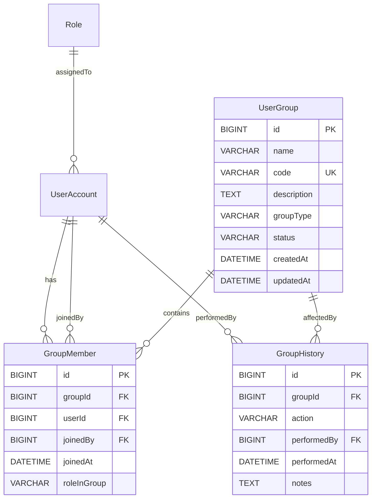

# Lean Architecture — F-002: Quản lý nhóm người dùng (User Group Management)

## Summary

Feature F-002 introduces three new bounded-context aggregates — **UserGroup**, **GroupMember**, and **GroupHistory** — within the M-001 system administration module. The architecture extends the existing Spring Boot + Spring Security + JWT authentication infrastructure to support role-based access control (Admin, Lanh dao, Can bo, Ca nhan) over group CRUD operations, member management, group duplication, and an immutable audit trail (GroupHistory). Key trade-off: application-layer unique-ness validation with database UNIQUE constraints and @Version optimistic locking to prevent name/code race conditions.

---

## System Boundaries

### Bounded Context

| Context | Module | Responsibility | Owns | Calls | Exposes |
|---|---|---|---|---|---|
| **Group Management** | M-001 | CRUD groups, membership, duplication, history | UserGroup, GroupMember, GroupHistory aggregates | UserAccount (read — validate existence before adding members); Role (read — resolve system roles) | REST API `/api/v1/groups/*` consumed by ReactJS admin UI; GroupMemberService; GroupCodeFactory |

### Service/Module Ownership

| Component | Owner | Layer | Responsibility |
|---|---|---|---|
| `GroupService` | `com.hanghai.kchtg.group.service` | Service | Group CRUD; duplicate validation; copy logic |
| `GroupMemberService` | `com.hanghai.kchtg.group.service` | Service | Add/remove members; membership validation |
| `GroupController` | `com.hanghai.kchtg.group.controller` | Controller | REST endpoints (8 routes) |
| `UserGroupRepository` | `com.hanghai.kchtg.group.repository` | Repository | JPA queries (pagination, search, filter) |
| `GroupMemberRepository` | `com.hanghai.kchtg.group.repository` | Repository | Member CRUD; duplicate membership check |
| `GroupHistoryRepository` | `com.hanghai.kchtg.group.repository` | Repository | Append-only audit log queries |
| `GroupCodeFactory` | `com.hanghai.kchtg.group.factory` | Factory | Group code auto-generation (optional, resolves AMBIGUITY-002) |

### Dependency Graph

```mermaid
flowchart LR
  GCtrl[GroupController] --> GSvc[GroupService]
  GCtrl --> GMSvc[GroupMemberService]
  GSvc --> GRepo[UserGroupRepository]
  GSvc --> GHistRepo[GroupHistoryRepository]
  GMSvc --> GMemberRepo[GroupMemberRepository]
  GMemberRepo --> UARepo[UserAccountRepository]
  GHistRepo --> UARepo
  GCtrl --> SF[SecurityFilter]
  SF --> JWT[JwtAuthenticationFilter]
  GCtrl -.calls.> F1:F-001 UserAccount
  GCtrl -.calls.> F1:F-001 Role
```

### Cross-Module Dependencies

| Dependency | Direction | Reason | Integration Type |
|---|---|---|---|
| **F-001 (UserAccount)** | Reads `UserAccount` entity | Validate userId before adding to group; resolve performedBy userId from JWT principal | JPA `@ManyToOne` reference — no direct cross-module service call |
| **F-001 (Role)** | Reads `Role` entity | Validate roleInGroup values against known system roles | JPA `@ManyToOne` reference |
| **F-005 (AccessLog)** | Writes to `AccessLog` entity | All mutations logged as group operations (audit trail) | Spring ApplicationEvent publish |

---

## Integration Model

| Integration | Type | Contract | Timeout | Retry | Idempotent |
|---|---|---|---|---|---|
| **ReactJS → GroupController** | REST / JSON | OpenAPI contract at `/api/v1/groups/*` | 5s default | Exponential backoff (3 retries) | POST /groups/{id}/members: unique (groupId, userId) constraint ensures idempotency |
| **GroupService → UserAccount** | JPA read-only | `UserAccountRepository.findById(userId)` | N/A (same-process) | N/A | N/A |
| **GroupService → GroupHistory** | JPA insert-only | `GroupHistoryRepository.save()` | N/A (same-process) | N/A | N/A |
| **GroupService → AccessLog** | Spring ApplicationEvent (async) | `ApplicationEventPublisher.publish(new GroupMutationEvent(...))` | N/A | N/A | N/A |

### GroupController Endpoints (8 routes)

| Method | Endpoint | Handler | Auth | Role Required | Notes |
|---|---|---|---|---|---|
| GET | `/api/v1/groups` | `GroupController.listGroups()` | JWT | All (filter: Ca nhan → my groups only) | Pagination + search + groupType filter |
| GET | `/api/v1/groups/{id}` | `GroupController.getGroupById()` | JWT | All | Returns group + memberCount |
| POST | `/api/v1/groups` | `GroupController.createGroup()` | JWT | **Admin only** | Validates unique name + code |
| PUT | `/api/v1/groups/{id}` | `GroupController.updateGroup()` | JWT | Admin, Can bo | name uniqueness re-checked |
| DELETE | `/api/v1/groups/{id}` | `GroupController.deleteGroup()` | JWT | **Admin only** | Checks member count > 0 → reject |
| POST | `/api/v1/groups/{id}/members` | `GroupMemberController.addMember()` | JWT | Admin, Can bo | Validates duplicate membership |
| DELETE | `/api/v1/groups/{id}/members/{userId}` | `GroupMemberController.removeMember()` | JWT | Admin, Can bo | Removes GroupMember; no cascade to UserAccount |
| POST | `/api/v1/groups/{id}/copy` | `GroupController.copyGroup()` | JWT | **Admin only** | Clones group + all members; logs GroupHistory |
| GET | `/api/v1/groups/{id}/members` | `GroupMemberController.listMembers()` | JWT | All | Returns paginated member list |
| GET | `/api/v1/groups/{id}/history` | `GroupController.getHistory()` | JWT | **Admin only** | Sorted by performedAt DESC |
| GET | `/api/v1/users` | `UserController.listUsers()` | JWT | Admin, Can bo | Used by frontend to fetch user list for member-assignment modal |

---

## Data Architecture

### Entity Definitions

| Entity | Table | Key | Storage | Consistency | Owner |
|---|---|---|---|---|---|
| **UserGroup** | `user_groups` | `id BIGINT PK` | MSSQL 2022 (Flyway-managed) | Strong (unique constraints) | M-001 F-002 |
| **GroupMember** | `group_members` | `id BIGINT PK` | MSSQL 2022 | Strong (unique groupId+userId FK) | M-001 F-002 |
| **GroupHistory** | `group_histories` | `id BIGINT PK` | MSSQL 2022 | Append-only (immutable) | M-001 F-002 |
| **UserAccount** | `user_accounts` | `id BIGINT PK` | MSSQL 2022 (F-001) | — | M-001 F-001 |
| **Role** | `roles` | `id BIGINT PK` | MSSQL 2022 (F-001) | — | M-001 F-001 |

### Entity Relationships



### Key Design Decisions

| Decision | Chosen Approach | Rationale |
|---|---|---|
| **groupType field** | `VARCHAR(30)` with CHECK constraint at DB level | JPA `enum` maps to integers in some drivers; VARCHAR with DB CHECK is more portable across MSSQL/other DBs |
| **name/code uniqueness** | DB UNIQUE constraints + application-layer validation | Prevents race conditions (two concurrent creates). Application layer returns 409 early; DB constraint prevents silent data corruption |
| **GroupMember membership** | Unique composite index on `(groupId, userId)` | One row per user per group; application checks before insert; DB rejects on race |
| **GroupHistory immutability** | INSERT-only, no UPDATE/DELETE on GroupHistory | Audit trail must be append-only; use soft delete only if required by compliance |
| **Delete behavior** | Hard-delete group (no cascade delete of members) | Check member count > 0 before delete (BR-009). If member count = 0, cascade delete members then group |
| **Timestamps** | `DATETIME2` with `SYSUTCDATETIME()` defaults (MSSQL) | Aligns with F-001 schema conventions; UTC-based |

### Index Strategy (for NFR: 10,000 groups, 50,000 members)

| Table | Index | Purpose |
|---|---|---|
| `user_groups` | UNIQUE `name` | Unique name validation |
| `user_groups` | UNIQUE `code` | Unique code validation |
| `user_groups` | `groupType` | Filter by group type |
| `user_groups` | `status` | Filter by active/inactive |
| `user_groups` | `(status, groupType)` | Composite: active groups of a type |
| `group_members` | UNIQUE `(groupId, userId)` | Prevent duplicate membership |
| `group_members` | `groupId` | Query members by group |
| `group_members` | `userId` | Query groups by user (my groups filter) |
| `group_histories` | `groupId` | Query history by group |
| `group_histories` | `(groupId, performedAt DESC)` | Ordered history query |

### Migration Needed

| Migration | Scope | Notes |
|---|---|---|
| **V6__F-002_init_user_groups.sql** | New tables: `user_groups`, `group_members`, `group_histories` + all indexes + seed data | Follows MSSQL 2022 conventions (IDENTITY, DATETIME2, SYSUTCDATETIME, CHECK constraints) |

---

## Security

### Auth & Authorization

| Layer | Mechanism | Details |
|---|---|---|
| **Transport** | HTTPS (TLS 1.2+) | All API calls |
| **Authentication** | Spring Security + JWT (`JwtAuthenticationFilter`) | Token extracted from `Authorization: Bearer <token>` header |
| **Authorization** | Spring Security `@PreAuthorize` annotations | Role-based access at method level |
| **JWT Principal** | `Authentication.getPrincipal()` → `user.getId()` | Injected into service layer for `performedBy` and audit trail |

### Role-Based Access Matrix

| Role | List Groups | Get Group | Create | Update | Delete | Add Member | Remove Member | Copy | List Members | History |
|---|---|---|---|---|---|---|---|---|---|---|
| **Admin** | ✅ | ✅ | ✅ | ✅ | ✅ | ✅ | ✅ | ✅ | ✅ | ✅ |
| **Lanh dao** | ✅ | ✅ | ❌ | ❌ | ❌ | ❌ | ❌ | ❌ | ✅ | ❌ |
| **Can bo** | ✅ | ✅ | ❌ | ✅ | ❌ | ✅ | ✅ | ❌ | ✅ | ❌ |
| **Ca nhan** | ✅ (my groups only) | ✅ (my groups) | ❌ | ❌ | ❌ | ❌ | ❌ | ❌ | ✅ (my groups) | ❌ |

> **Note on "my groups" for Ca nhan:** The GET `/api/v1/groups?myGroups=true` endpoint applies a `GROUP BY gm.groupId` filter where `gm.userId = currentUserId` from JWT principal. All other roles see all groups (admin filter not applied for Admin/Lanh dao/Can bo).

### PII & Secrets Handling

| Data | Classification | Protection |
|---|---|---|
| Group name, code, description | Non-sensitive | Stored as-is |
| GroupMember.userId (reference) | Non-sensitive (FK) | FK to user_accounts |
| GroupHistory.performedBy | Audit data | Logged, immutable |
| JWT token | Secret | Stored in client-side httpOnly cookie or Authorization header |
| User names in response | Non-sensitive | Only exposed to authenticated users (JWT required) |

### Trust Boundaries

| Boundary | Direction | Protection |
|---|---|---|
| **ReactJS → Spring Boot** | Inbound | JWT validation at `JwtAuthenticationFilter` |
| **GroupController → GroupService** | Inbound | Spring Security `@PreAuthorize` |
| **GroupService → UserAccountRepository** | Inbound (cross-agg) | Read-only reference; no write propagation |
| **GroupService → GroupHistoryRepository** | Outbound (audit) | Append-only; never deletable |

### Security Recommendations
- **JWT Secret:** Rotate `JWT_SECRET` via environment variable per deployment (see shared configuration)
- **Rate Limiting:** Apply to POST /groups and POST /groups/{id}/members (prevents bulk member addition)
- **Audit Trail:** Every mutation logged to `GroupHistory` (immutable, append-only) — satisfies BR-015
- **CORS:** Restrict to known frontend origins in `SecurityConfig`

---

## Deployment

### Environment Variables

| Variable | Purpose | Required |
|---|---|---|
| `JWT_SECRET` | JWT signing key (HS256/RS256) | Yes |
| `JWT_EXPIRATION_MS` | Access token TTL (default: 3600000) | No — uses shared default |
| `JWT_REFRESH_EXPIRATION_MS` | Refresh token TTL (default: 604800000) | No — uses shared default |
| `DB_URL` | MSSQL connection string | Yes |
| `DB_USERNAME` | DB username | Yes |
| `DB_PASSWORD` | DB password | Yes |

### Database Migration

| Item | Detail |
|---|---|
| **Migration file** | `V6__F-002_init_user_groups.sql` |
| **Tool** | Flyway (shared pipeline with F-001's V1–V5) |
| **Dialect** | MSSQL 2022 (`DATETIME2`, `IDENTITY(1,1)`, `SYSUTCDATETIME()`, `NVARCHAR` for Vietnamese text) |
| **Prerequisites** | V1–V5 applied first (user_accounts, roles, user_roles tables must exist) |
| **Rollback** | Drop `user_groups`, `group_members`, `group_histories` + indexes |

### Deployment Notes

| Area | Consideration |
|---|---|
| **Rollout strategy** | Blue-green or canary (stateless service) |
| **Feature flag** | Optional: gate group management UI behind feature flag for phased rollout |
| **No new infrastructure** | Uses existing Spring Boot app; no new services, env vars beyond shared JWT/DB config |
| **DB schema change** | Adds 3 tables + 10 indexes; no data migration from existing tables |
| **Frontend** | New React pages (`GroupListPage`, `GroupDetailPage`, `GroupCreatePage`) under `frontend/src/pages/admin/` |

---

## NFR Architecture

| NFR Ref | Requirement | Solution | Target | Trade-off |
|---|---|---|---|---|
| **Performance (AC-010/011)** | List < 500ms P95 with < 1000 records; pagination 20/page | Spring Data JPA `Pageable` with indexed queries on name, groupType, status; composite index on (status, groupType) for type filtering | P95 < 500ms | Pagination limits result set but requires full-count query for total pages; use `countQuery` hint if count is expensive |
| **Scalability** | Support 10,000 groups, 50,000 members | DB indexes on name, code, groupType, status; unique composite on (groupId, userId) | 50K members in group_members table | Horizontal scale not needed for admin CRUD; vertical scale (DB index) sufficient |
| **Reliability** | 100% mutation logged to GroupHistory | GroupHistory insert within same `@Transactional` as mutation; immutable append-only design | 100% logged | Audit log size grows unbounded; plan for F-005 archival/retention |
| **Security** | OWASP Top 10 compliant | JWT auth on all endpoints; `@PreAuthorize` role check; input validation; no PII in responses | OWASP compliant | Additional testing: SQL injection (parameterized queries), XSS (frontend escaping), CSRF (stateless JWT) |
| **Usability** | Responsive UI, toast notifications, realtime validation | Ant Design components; React Hook Form with validation schema | WCAG 2.1 AA | UI design handoff required before implementation |

---

## Key Decisions

| Decision | Chosen | Rejected | Rationale |
|---|---|---|---|
| **GroupType storage** | VARCHAR(30) with DB CHECK constraint | JPA `@Enumerated(STRING)` | VARCHAR + CHECK is more portable and avoids enum integer mapping issues across DB drivers (MSSQL vs MySQL) |
| **Name/Code uniqueness** | Dual: application-layer validation + DB UNIQUE constraint | Application-only validation | Application layer provides fast 409 response; DB constraint prevents silent race-condition data corruption |
| **Copy group strategy** | Transactional clone: create new UserGroup → insert all GroupMembers (joinedBy = currentAdmin) → insert GroupHistory entry | Async copy via event | Admin expects synchronous completion; copy is small (< 100 members) so sync is acceptable |
| **Delete group strategy** | Hard delete (check members = 0, then cascade delete members then group) | Soft delete with `deletedAt` | No audit requirement to retain deleted group data; GroupHistory already captures the deletion action |
| **Member add strategy** | Application check (not exists) → INSERT; DB unique composite (groupId, userId) as safety net | DB constraint only (no app check) | Application check provides better error message (409 "User already in this group"); DB constraint as safety net |
| **Group code generation** | Factory pattern (`GroupCodeFactory`) — auto-increment or prefix-based | Manual input by user | Resolves AMBIGUITY-002; factory allows configurable strategy (prefix-based like "DA-001", "PRJ-001"); admin can still override if needed |
| **roleInGroup values** | VARCHAR(30) (open-ended, documented in frontend) | Rigid enum | Allows flexible role names (admin, member, observer, lead); frontend validates against allowed list |
| **Service layer split** | Two services: `GroupService` (CRUD + copy) + `GroupMemberService` (add/remove members) | Single monolithic service | Separation aligns with tech lead plan; GroupMemberService can be tested independently |
