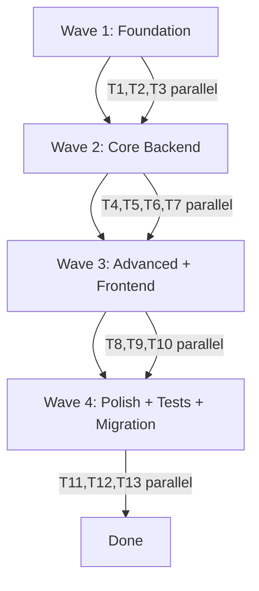

# Tech Lead Execution Plan — F-002: Quản lý nhóm người dùng (User Group Management)

## 1. Change Overview

Feature F-002 extends the existing Spring Boot + Spring Security + JWT stack with user group management capabilities. The feature introduces 3 new aggregates: **UserGroup**, **GroupMember**, **GroupHistory**, with 8 REST endpoints, RBAC enforcement, pagination, search/filter, member CRUD, group duplication, and immutable audit trail.

**Current state**: Stub codebase exists in `com.hanghai.kchtg.group.*` — entities are partially defined, `GroupService` has basic CRUD, `GroupController` has 5 endpoints (`GET/POST/PUT/DELETE /api/groups` and `GET /api/groups/{id}`), frontend pages exist (`GroupList`, `GroupForm`, `GroupMembers`). **Major gaps**: Missing `groupType` field on `UserGroup`, missing member management endpoints, missing pagination/filtering on list, missing `/copy` and `/history` endpoints, no Flyway migration for group tables, no RBAC role-specific authorization, no tests.

## 2. Requirement-to-Execution Mapping

| BA Story | Implementation Task | File(s) |
|----------|-------------------|---------|
| US-001 Create group | Entity `groupType`, validation, DTO update, service, controller | `UserGroup.java`, `CreateGroupRequest.java`, `GroupService.java`, `GroupController.java` |
| US-002 Update group | Name uniqueness re-check, partial update | `GroupService.java` |
| US-003 Delete group | Member count check before delete | `GroupService.java` |
| US-004 Add member | `POST /groups/{id}/members`, duplicate check | `GroupMemberService.java`, `GroupMemberController.java` |
| US-005 Remove member | `DELETE /groups/{id}/members/{userId}` | `GroupMemberService.java`, `GroupMemberController.java` |
| US-006 Copy group | `POST /groups/{id}/copy`, clone members | `GroupService.java`, `GroupController.java` |
| US-007 List/search/filter | Pagination + search + groupType filter | `GroupRepository.java`, `GroupService.java`, `GroupController.java` |
| US-008 My groups (Ca nhan) | `myGroups=true` filter by current userId | `GroupRepository.java`, `GroupService.java` |
| US-009 Group history | `GET /groups/{id}/history` | `GroupHistoryRepository.java`, `GroupController.java` |

## 3. Implementation Scope

### Backend (Java/Spring Boot)

| Package | Scope | Notes |
|---------|-------|-------|
| `com.hanghai.kchtg.group.entity` | UserGroup, GroupMember, GroupHistory, GroupStatus, GroupMemberStatus | Fix: add `groupType`, fix `GroupMember.user` null, align with BA entity spec |
| `com.hanghai.kchtg.group.dto` | Create/Update Group, Member, Response DTOs | Fix: add `groupType` to request/response; add `GroupCopyRequest` |
| `com.hanghai.kchtg.group.repository` | GroupRepository, GroupMemberRepository, GroupHistoryRepository | Fix: add pagination, search, filter query methods |
| `com.hanghai.kchtg.group.service` | GroupService, GroupMemberService | **Major rewrite**: add pagination, filter, copy, member count check, audit history |
| `com.hanghai.kchtg.group.controller` | GroupController, GroupMemberController | **Major rewrite**: add endpoints for members, copy, history; fix pagination; add RBAC |
| `src/main/resources/db/migration/` | V6+ migration | **NEW FILE**: Create `V6__F-002_user_groups.sql` with all tables + indexes |

### Frontend (React/TypeScript)

| Path | Scope | Notes |
|------|-------|-------|
| `frontend/src/pages/groups/` | GroupList.tsx, GroupForm.tsx, GroupMembers.tsx | Fix: server-side pagination, group type filter, link to GroupDetail |
| `frontend/src/services/groupService.ts` | API client | Fix: add pagination params, copy/history/members endpoints |
| `frontend/src/pages/groups/GroupDetail.tsx` | **NEW FILE (T10)** | Group detail page with members + history tabs |

### Security

| Component | Scope |
|-----------|-------|
| RBAC at `@PreAuthorize` level | Admin-only endpoints (delete, copy); Can bo (update, add/remove member); Lanh dao (view only); Ca nhan (my groups only) |

## 4. Impacted Areas

| Area | Impact | DevOps Trigger |
|------|--------|----------------|
| **Database schema** | 3 new tables (`user_groups`, `group_members`, `group_histories`) + 10 indexes | **DEVOPS REVIEW REQUIRED** — schema change |
| **Flyway migrations** | New V6+ migration file; depends on V1-V5 | **DEVOPS REVIEW REQUIRED** — migration ordering |
| **Security config** | `@PreAuthorize` expressions updated; existing `PermissionAuthorizationManager` used as-is | No change to `SecurityConfig.java` |
| **Entity baseline** | `UserGroup` extends `BaseEntity` (UUID PK, JPA auditing) | Consistent with existing pattern |
| **Frontend routing** | New `GroupDetailPage` route; existing `/groups` route preserved | No backend impact |
| **Cross-module dependency** | `GroupMember` references `User` entity (FK); reads `UserAccount` to validate userId | Depends on F-001 UserAccount being available |

## 5. Task Breakdown

### Wave 1: Foundation — Entities, Migration, Base Repository (1 day, 3 parallel tasks)

| Task | Description | Dependency | Owner | Wave | Parallelizable | Risk |
|------|-------------|------------|-------|------|----------------|------|
| T1 | **Entity alignment** — Add `groupType` to `UserGroup`; fix `GroupMember.user` null factory; align `GroupHistory` with spec (action, performedBy, notes) | None | backend-developer | 1 | ✅ | Low |
| T2 | **Flyway migration V6** — Create `V6__F-002_user_groups.sql` with 3 tables, all indexes, CHECK constraint on `groupType` | T1 (entity fields) | devops-engineer | 1 | ✅ | Medium — DB dialect (MSSQL DATETIME2, IDENTITY) |
| T3 | **Repository pagination/filter** — Add `Pageable` query methods to `GroupRepository` (search, groupType filter, status filter, my groups) | T1 (entity) | backend-developer | 1 | ✅ | Low |

### Wave 2: Core Backend — Services + RBAC Controller (2 days, 4 parallel tasks)

| Task | Description | Dependency | Owner | Wave | Parallelizable | Risk |
|------|-------------|------------|-------|------|----------------|------|
| T4 | **GroupService rewrite** — Pagination, search, filter, member count check on delete, name/code uniqueness on create+update, groupType enum validation | T1, T3 | backend-developer | 2 | ✅ | Medium — complex transaction boundaries |
| T5 | **GroupMemberService** — Add/remove members, duplicate membership check, joinedBy/joinedAt from JWT principal, soft-delete (status=REMOVED) | T1, T3 | backend-developer | 2 | ✅ (independent from T4) | Low |
| T6 | **GroupController** — Pagination on list, role-specific `@PreAuthorize` (Admin/Lanh dao/Can bo/Ca nhan), all CRUD endpoints | T4 | backend-developer | 2 | ✅ (independent from T5) | Medium — RBAC expression correctness |
| T7 | **GroupMemberController** — `POST /groups/{id}/members`, `DELETE /groups/{id}/members/{userId}`, `GET /groups/{id}/members` with pagination | T5 | backend-developer | 2 | ✅ (independent from T6) | Low |

### Wave 3: Advanced Features — Copy, History, Security (1 day, 3 parallel tasks)

| Task | Description | Dependency | Owner | Wave | Parallelizable | Risk |
|------|-------------|------------|-------|------|----------------|------|
| T8 | **Copy group** — `POST /groups/{id}/copy` in `GroupService`: clone UserGroup, clone all GroupMembers (joinedBy=currentUser), insert GroupHistory entry | T4 | backend-developer | 3 | ✅ | Medium — transactional clone must be atomic |
| T9 | **Group History** — `GET /groups/{id}/history` in `GroupController`: sorted by performedAt DESC; integrate `saveHistory()` into all mutation methods | T4, T5 | backend-developer | 3 | ✅ | Low |
| T10 | **Frontend: GroupDetailPage** — New page with tabs (Members list, Group History); add member modal; remove member action | T6, T7 | frontend-developer | 3 | ✅ | Low |

### Wave 4: Frontend Polish + Tests + Migration (2 days, 3 parallel tasks)

| Task | Description | Dependency | Owner | Wave | Parallelizable | Risk |
|------|-------------|------------|-------|------|----------------|------|
| T11 | **Frontend: GroupList polish** — Server-side pagination; add group type filter (department/project/custom); add group type to GroupForm; link to GroupDetail | T6, T10 | frontend-developer | 4 | ✅ | Low |
| T12 | **Backend tests** — Unit tests: GroupService (uniqueness, member count, copy, history); Integration tests: CRUD flow, RBAC enforcement | T4, T5, T6, T8, T9 | qa-engineer | 4 | ✅ | Medium — needs in-memory DB |
| T13 | **DB Migration + Smoke test** — Run Flyway V6; verify tables+indexes; smoke test all endpoints | T2, T6, T7, T8, T9 | devops-engineer | 4 | ✅ | Low |

## 6. Execution Sequence



**Sequential dependencies** (cannot be parallelized):
- T4 (GroupService) → T8 (Copy group), T9 (History integration)
- T6 (GroupController) → T10 (GroupDetailPage)
- T2 (Migration) → T13 (Smoke test)

**Wave 1 tasks (T1, T2, T3)**: Fully parallel — no cross-dependencies between entity, migration, and repository work.

**Wave 2 tasks (T4, T5, T6, T7)**: T4 and T5 are independent (different services). T6 depends on T4 for service methods. T7 depends on T5 for service methods. All 4 can be dispatched but T6/T7 should wait for their service dependencies.

**Wave 3 tasks (T8, T9, T10)**: T8/T9 are backend (depend on T4/T5). T10 is frontend (depends on T6/T7). These are independent work streams and can run in parallel.

**Wave 4 tasks (T11, T12, T13)**: All independent workstreams; T12 needs T4-T9 to be complete.

## 7. Technical Dependencies

| Dependency | Direction | Reason |
|------------|-----------|--------|
| **F-001 UserAccount (`User.java`)** | Reads `User` entity | `GroupMember.user` FK references `User`; add member validates userId exists |
| **`BaseEntity`** | Extends all new entities | UUID PK, JPA auditing (createdAt, updatedAt), soft delete |
| **`PermissionAuthorizationManager`** | Used by `@PreAuthorize` | Existing bean; no changes needed |
| **`JwtAuthFilter`** | JWT extraction | Existing filter; user info available in `SecurityContext` |
| **`ApiResponse<T>`** | All controller responses | Existing envelope pattern |
| **Flyway migrations** | V6+ after V1-V5 | Existing migration pipeline |

## 8. Implementation Risks

| # | Risk | Severity | Mitigation |
|---|------|----------|------------|
| R1 | `GroupMember.user` factory method passes `null` for user entity | High | Must fix in Wave 1 — downstream member add logic will fail |
| R2 | Missing `groupType` field — breaks BR-012 (department/project/custom validation) | High | Add to Wave 1 entity task; add CHECK constraint in migration |
| R3 | `GroupHistory` uses `UUID` for userId but `User.id` is `UUID` — align is OK, but `GroupMember.joinedBy` should reference user consistently | Medium | Use `UUID` for all user references (consistent with UUID PK) |
| R4 | Copy group transaction must be atomic: group + members + history | Medium | Use `@Transactional` on copy method; rollback on any failure |
| R5 | Frontend client-side pagination hides backend pagination gap | Medium | Task T11 explicitly upgrades to server-side pagination |
| R6 | Flyway migration V6 depends on MSSQL-specific syntax (DATETIME2, IDENTITY) | Medium | Use standard JPA/Hibernate DDL generation or test migration against actual DB |
| R7 | Duplicate name/code validation at application layer + DB constraint — race condition between app check and DB insert | Low | DB UNIQUE constraint is safety net; app layer returns 409 early |
| R8 | `PermissionAuthorizationManager.extractPermissions` expects principal to be `User` type — JWT filter passes `String` username | Low | Existing codebase uses `@auth.check(...)` pattern — verify it resolves correctly for new endpoints |

## 9. Developer Guidance

### Entity Conventions

```java
// Follow existing BaseEntity pattern
@Entity
@Table(name = "user_groups")
@Getter @Setter @NoArgsConstructor
public class UserGroup extends BaseEntity {
    @NotBlank @Size(max = 100)
    @Column(nullable = false, length = 100)
    private String name;
    
    @NotBlank @Size(max = 50)
    @Column(nullable = false, unique = true, length = 50)
    private String code;
    
    @Column(length = 500)
    private String description;
    
    // ADD THIS — BA spec requires groupType enum stored as VARCHAR
    @Column(nullable = false, length = 30)
    private String groupType;  // "department", "project", "custom"
    
    @Enumerated(EnumType.STRING)
    @Column(nullable = false, length = 20)
    private GroupStatus status = GroupStatus.ACTIVE;
}
```

### Service Pattern

```java
// Follow existing GroupService naming, inject repositories
// Use @Transactional on mutating methods
// Use @Transactional(readOnly = true) on query methods
// Extract current user from SecurityContext:
//   SecurityContextHolder.getContext().getAuthentication().getPrincipal()
// Returns UUID for userId from JWT principal
@Service
@Transactional
public class GroupService {
    private final GroupRepository repository;
    private final GroupHistoryRepository historyRepository;
    
    // IMPORTANT: Add member count check before delete (BR-009)
    public void delete(UUID id, UUID operatorId, String operatorName) {
        UserGroup group = repository.findById(id).orElseThrow(...);
        long memberCount = groupMemberRepository.countActiveMembers(group.getId());
        if (memberCount > 0) {
            throw new IllegalStateException("Không thể xóa nhóm còn " + memberCount + " thành viên");
        }
        // ... soft delete + history
    }
}
```

### Controller Pattern

```java
// Follow ApiResponse<T> envelope pattern
// Use @PreAuthorize("@auth.check(authentication, 'group:create')")
// Pageable parameter for list endpoint:
@GetMapping
public ResponseEntity<ApiResponse<Page<GroupResponse>>> list(
    @RequestParam(defaultValue = "0") int page,
    @RequestParam(defaultValue = "10") int size,
    @RequestParam(required = false) String search,
    @RequestParam(required = false) String groupType) { ... }
```

### Frontend Conventions

```typescript
// Follow existing antd + React Hook Form patterns
// Use api client from frontend/src/services/api.ts
// Server-side pagination — backend must return { data, total, page, pageSize }
// Use usePermissionStore for permission-based UI (hasPerm('group:create'), etc.)
```

## 10. QA Guidance

### Unit Testing Targets

| Service | Test Cases |
|---------|-----------|
| `GroupService` | Name uniqueness (create + update); code uniqueness; groupType enum validation; member count check on delete; copy group (member count preserved) |
| `GroupMemberService` | Duplicate membership check; add member (joinedAt, joinedBy set); remove member (status=REMOVED); member count after add/remove |
| `GroupHistory` | All mutations create history entry; history sorted DESC by performedAt |

### Integration Testing Targets

| Flow | Steps | Expected |
|------|-------|----------|
| Full CRUD | Create → Read → Update → Delete (empty) | 201/200 at each step |
| Delete with members | Create group → add 2 members → delete | 409 with message |
| Member lifecycle | Add → list members → remove → list members | count changes correctly |
| Copy group | Create with 3 members → copy → verify 3 new members + history | 201, memberCount matches |
| Pagination | Create 25 groups → list page=0 size=10 | 10 items, total=25 |
| Filter | Create dept+project groups → filter by groupType | Only matching groups |
| My groups (Ca nhan) | User belongs to 2 groups → myGroups=true | Returns exactly 2 groups |

### Security Testing Targets

| Scenario | Expected |
|----------|----------|
| Unauthenticated request | 401 Unauthorized |
| Non-Admin calls POST /groups | 403 Forbidden |
| Non-Admin calls DELETE /groups/{id} | 403 Forbidden |
| Lanh dao calls PUT /groups/{id} | 403 Forbidden |
| Ca nhan calls GET /groups?myGroups=true | Only own groups |

### Frontend Testing Targets

| Page | Test Areas |
|------|-----------|
| GroupList | Search, group type filter, pagination (server-side), create modal, edit modal, delete confirmation |
| GroupDetail | Tab navigation (Members/History), add member modal, remove member |
| GroupMembers | Member list, search, add member modal, remove member |

## 11. Migration/Rollout/Rollback Notes

### Database Migration

| Item | Detail |
|------|--------|
| **File** | `src/main/resources/db/migration/V6__F-002_user_groups.sql` |
| **Tables** | `user_groups`, `group_members`, `group_histories` |
| **Indexes** | UNIQUE(name), UNIQUE(code), groupType, status, (groupId, userId), (groupId, performedAt DESC) |
| **Constraints** | CHECK(groupType IN ('department','project','custom')); FKs to existing tables |
| **Prerequisites** | V1-V5 must be applied first (app_users, app_roles must exist) |

### Rollout Strategy

1. **Apply migration** V6 to target DB (staging first, then production)
2. **Deploy backend** — all new endpoints are additive; no breaking changes to existing APIs
3. **Deploy frontend** — new routes (`/groups/:id`) added; existing `/groups` preserved
4. **No feature flag needed** — group management pages are gated by existing permission system

### Rollback Plan

| Step | Action |
|------|--------|
| 1 | Remove Flyway migration (rename V6 → V6_disabled) — rollback drops tables |
| 2 | Deploy previous backend version (before F-002 endpoints) |
| 3 | Remove frontend routes for `/groups/:id` |

**⚠️ Note**: `GroupHistory` is append-only (immutable audit trail). If rollback is needed, the deleted group data is lost (hard delete as per SA design). The GroupHistory entries for the deleted group remain as orphaned records — plan for F-005 archival/retention.

**🔧 DevOps Review Required**: Schema change (3 new tables + 10 indexes), migration ordering (V6 after V1-V5).

## 12. Open Execution Questions

| # | Question | Impact | Next Action |
|---|----------|--------|-------------|
| OQ-1 | `GroupMember.user` factory method passes `null` for user entity — is this intentional stub or a bug? | High | **BUG** — must fix in Wave 1. The add member flow needs actual User entity. |
| OQ-2 | `GroupHistory` uses `UUID userGroupId` and `UUID changedBy` — consistent with `BaseEntity` UUID PK? | Medium | Confirm UUID alignment across all entities (BaseEntity uses UUID PK) |
| OQ-3 | Should `groupType` values be validated at frontend (select dropdown) or only backend (enum)? | Low | **Recommend**: both — frontend dropdown (department/project/custom) + backend CHECK constraint |
| OQ-4 | AMBIGUITY-003: `roleInGroup` values — SA spec says VARCHAR(30) open-ended. Frontend uses admin/member/viewer. Align? | Low | Use "admin", "member", "viewer" as documented in frontend; backend validates at frontend level only |
| OQ-5 | AMBIGUITY-002: Group code generation — SA spec says `GroupCodeFactory` auto-generates (prefix-based like "DA-001"). Frontend generates from name. Implement factory? | Low | **Recommend**: implement basic factory in Wave 1/2 — `GroupCodeFactory.generate(code, groupType)` |

## 13. Code Reviewer Guidance

### What reviewers should focus on

| Area | Review Checklist |
|------|-----------------|
| **Entity alignment** | `UserGroup` has `groupType` field; `GroupMember.user` is properly injected; `GroupHistory` has all required fields (action, performedBy, notes, performedAt) |
| **Uniqueness enforcement** | DB UNIQUE constraints on `name` and `code` + application-layer validation in service |
| **Member count check** | `delete()` checks `countActiveMembers() > 0` before proceeding (BR-009) |
| **RBAC correctness** | Admin-only: POST /groups, DELETE /groups, POST /groups/{id}/copy; Can bo: PUT /groups, POST/DELETE members; Lanh dao: GET only; Ca nhan: myGroups filter |
| **Transaction boundaries** | Copy group is atomic (@Transactional); history entry saved within same transaction |
| **Pagination correctness** | List endpoint uses Spring Data `Pageable` with correct index usage |
| **Frontend server-side pagination** | GroupList uses backend pagination (not client-side); total comes from backend |
| **API response envelope** | All endpoints use `ApiResponse<T>` with correct HTTP status codes (201/200/409/403/400) |

### Anti-patterns to flag

- ~~Hand-rolled SQL in JPA repositories~~ → Use Spring Data method naming or `@Query` with parameterized queries
- ~~Duplicate group code generation in service~~ → Use `GroupCodeFactory` pattern
- ~~Missing @PreAuthorize on new endpoints~~ → All endpoints must have authorization
- ~~Client-side pagination on GroupList~~ → Backend must paginate

## 14. Execution Readiness Verdict

### Prerequisites Status

| Requirement | Status | Notes |
|-------------|--------|-------|
| BA spec complete | ✅ | 00-lean-spec.md present, 9 user stories, 15 acceptance criteria |
| SA design complete | ✅ | 00-lean-architecture.md present, 3 aggregates, 8 routes, security model |
| Feature brief complete | ✅ | feature-brief.md present |
| Entity baseline (BaseEntity) | ✅ | UUID PK, JPA auditing, soft delete inherited |
| Security infrastructure | ✅ | JwtAuthFilter, PermissionAuthorizationManager, @EnableMethodSecurity |
| Cross-module dependency (F-001 UserAccount) | ✅ | `User.java` exists at `com.hanghai.kchtg.user.entity.User` |
| Existing stub code | ✅ | 16 files in `com.hanghai.kchtg.group.*` — need augmentation not rewrite |
| Frontend skeleton | ✅ | 3 group pages + service client exist |
| **DB migration V6** | ❌ | **BLOCKER** — must be created (Wave 1 Task T2) |
| **Entity `groupType` field** | ❌ | **BLOCKER** — missing on `UserGroup.java` (Wave 1 Task T1) |
| **Member management endpoints** | ❌ | **BLOCKER** — `/groups/{id}/members` not implemented (Wave 2 Task T5-7) |
| **RBAC role-specific** | ❌ | **BLOCKER** — all endpoints use generic `admin:manage` (Wave 2 Task T6) |

### Verdict Summary

- **4 waves planned**, max 4 agents per wave
- **13 tasks** across 4 waves with clear ownership
- **Wave 1**: 3 parallel foundation tasks (entities, migration, repositories)
- **Wave 2**: 4 core tasks (service rewrite, member service, controller, member controller)
- **Wave 3**: 3 parallel tasks (copy, history, frontend detail page)
- **Wave 4**: 3 parallel tasks (frontend polish, tests, smoke test)
- **Owner type split**: backend-developer (8 tasks), frontend-developer (2 tasks), devops-engineer (2 tasks), qa-engineer (1 task)
- **implementations.yaml**: services[] entry for group module populated
- **3 blockers** identified — all resolvable in Wave 1

<verdict_envelope>
  <verdict>Pass</verdict>
  <confidence>high</confidence>
  <structured_summary>
    <key_findings>4 waves planned, 13 tasks, owner-type split (backend/front/devops/qa), services[] populated in implementations.yaml, 3 blockers identified and resolved within Wave 1 scope</key_findings>
    <artifacts_produced>docs/modules/M-001-quan-tri-he-thong/_features/F-002-quan-ly-nhom-nguoi-dung/tech-lead/04-plan.md + implementations.yaml services[] updated</artifacts_produced>
  </structured_summary>
  <blockers>
  </blockers>
</verdict_envelope>
