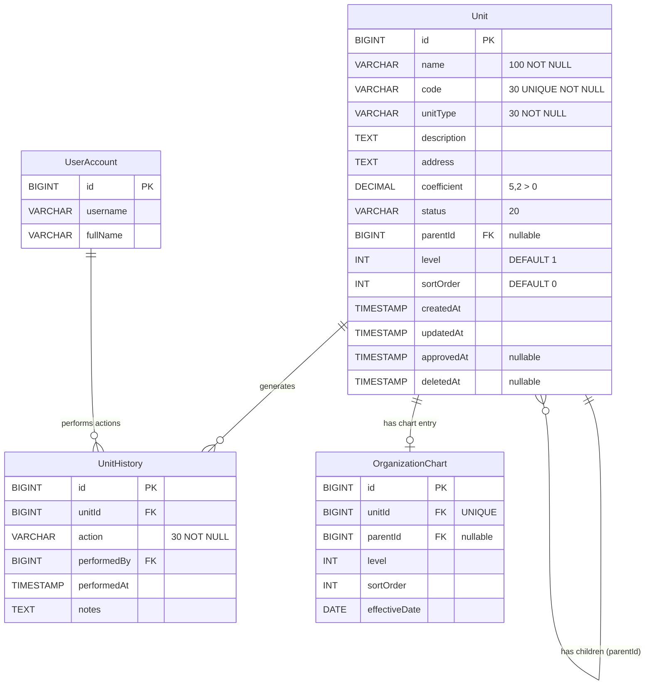
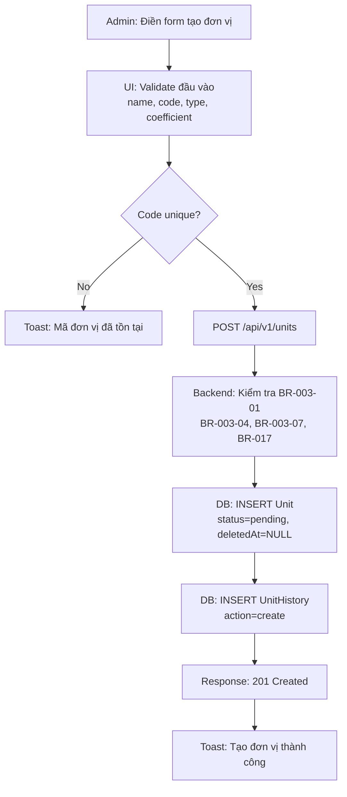
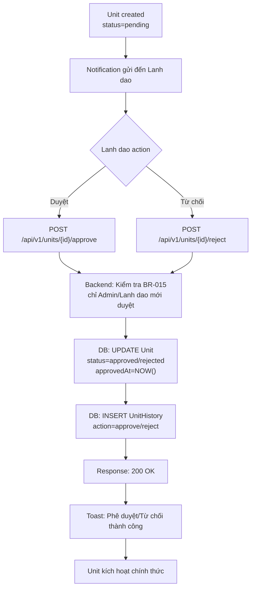
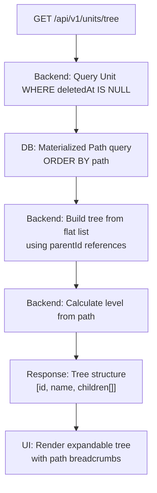
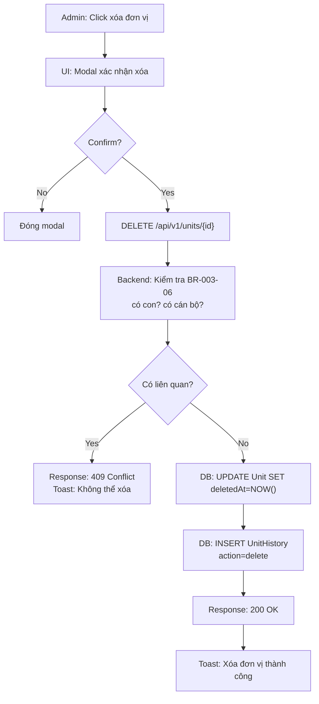
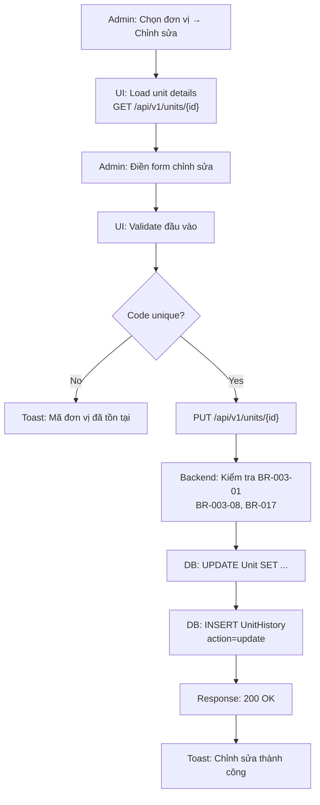

# Feature F-003: Quản lý đơn vị — Lean Business Analysis Spec

## 1. Feature Overview

### Mục tiêu

Quản lý tổ chức đơn vị phân cấp của hệ thống (Cục, Chi cục, Cảng vụ, Trung tâm) bao gồm tạo mới, chỉnh sửa, xóa mềm, phê duyệt/chấp thuận đơn vị và xây dựng cây cấu trúc tổ chức. Đơn vị có thể phân cấp cha/con với hệ số (coefficient) phục vụ nghiệp vụ tính toán và báo cáo.

### Phạm vi

| # | Capability | Mô tả |
|---|---|---|
| 1 | Tạo đơn vị mới | Tên, mã (unique), loại đơn vị, mô tả, địa chỉ, hệ số (coefficient) |
| 2 | Chỉnh sửa thông tin đơn vị | Tên, mã, loại, hệ số, địa chỉ |
| 3 | Xóa mềm đơn vị | Không xóa nếu có cán bộ/đối tượng liên quan |
| 4 | Phê duyệt/Chấp thuận đơn vị | Workflow: pending → approved/rejected |
| 5 | Danh sách đơn vị | Bộ lọc (tên, mã, loại, hệ số), phân trang |
| 6 | Tìm kiếm đơn vị | Theo tên hoặc mã |
| 7 | Phân cấp cha/con | Tree structure với hỗ trợ mở rộng/thu gọn |
| 8 | Cây tổ chức | Hiển thị cấu trúc phân cấp với path traversal |

### Ngoài phạm vi

| # | Capability | Lý do |
|---|---|---|
| 1 | Tổ chức lại cơ cấu đơn vị (reorg) | Không thuộc phạm vi F-003 |
| 2 | Tích hợp danh bạ công ty | Thuộc module khác |
| 3 | Tự động tạo đơn vị theo dự án | Không yêu cầu nghiệp vụ |
| 4 | Quản lý nhân sự trực thuộc đơn vị | Thuộc F-001 (User Management) |
| 5 | Xuất báo cáo org chart dạng đồ họa | Không yêu cầu |

## 2. Actors & Permissions

| Role | Level | Permissions |
|---|---|---|
| system-admin | Full CRUD + Quản lý cấu trúc | Tạo/sửa/xóa đơn vị, di chuyển, phân cấp; không thể xóa đơn vị hệ thống gốc |
| admin | CRUD + Phân cấp (trong phạm vi) | Quản lý đơn vị trong phân hệ được giao; không xóa đơn vị cấp cao hơn |
| Lanh dao | Approve | Duyệt hoặc từ chối yêu cầu tạo/xóa đơn vị |
| Can bo | View + Create | Xem danh sách, tạo yêu cầu mới |
| Ca nhan | View | Chỉ xem đơn vị của mình |
| user | Read-only | Xem cây cấu trúc đơn vị và thông tin chi tiết |

## 3. User Stories (MoSCoW)

| ID | Story | Priority | Acceptance Criteria |
|---|---|---|---|
| US-003-01 | As Admin, I want to create a new unit with unique code and valid coefficient | Must | Unit created with unique code, coefficient > 0, max 2 decimal places |
| US-003-02 | As Admin, I want to edit unit information (name, code, type, coefficient, address) | Must | Changes saved, unique code constraint enforced, coefficient validated |
| US-003-03 | As Admin, I want to soft-delete a unit only if no related personnel/objects exist | Must | Delete blocked if related records exist, soft-delete sets deletedAt |
| US-003-04 | As Admin, I want to submit a unit for approval workflow | Should | Status changes to pending, notification sent to Lanh dao |
| US-003-05 | As Lanh dao, I want to approve or reject a pending unit | Should | Status changes to approved/rejected, audit trail recorded |
| US-003-06 | As Admin, I want to view the unit hierarchy tree with expand/collapse | Must | Tree displays parent-child relationships, path shown for each node |
| US-003-07 | As any authenticated user, I want to search and filter units by name, code, type, level | Should | Search returns matching results, filters combine correctly |
| US-003-08 | As Admin, I want to move a child unit to a different parent | Should | Move validates no circular reference, cascade moves subtree |
| US-003-09 | As any user, I want to see paginated unit list with sorting | Could | Pagination with configurable page size, sortable columns |
| US-003-10 | As system, I want to auto-calculate unit level based on tree depth | Must | Level computed automatically from hierarchy position |

## 4. Acceptance Criteria (BDD — Given/When/Then)

| ID | Criterion | Type | Linked Story |
|---|---|---|---|
| AC-003-01 | Unit code must be unique across the entire system; duplicate code rejected on create/update | Positive/Negative | US-003-01, US-003-02 |
| AC-003-02 | Circular reference detection: a unit cannot be set as its own parent or ancestor of itself | Negative | US-003-08 |
| AC-003-03 | Root unit has no parentId; all units must have a valid path to root | Positive | US-003-06 |
| AC-003-04 | Unit type restricted to: Cục, Chi cục, Cảng vụ, TCT; no new types allowed | Negative | US-003-01 |
| AC-003-05 | Moving a child unit cascades to move its entire subtree | Positive | US-003-08 |
| AC-003-06 | Unit with children or assigned personnel cannot be deleted | Negative | US-003-03 |
| AC-003-07 | Unit level (level) auto-calculated based on tree depth | Positive | US-003-10 |
| AC-003-08 | Unit name required, max 200 characters | Negative | US-003-01 |
| AC-003-09 | Coefficient must be > 0 with max 2 decimal places | Negative | US-003-01 |
| AC-003-10 | Approval workflow: pending → approved/rejected, only Admin can approve | Positive | US-003-04, US-003-05 |
| AC-003-11 | Soft delete: deletedAt timestamp set, unit hidden from active queries | Positive | US-003-03 |
| AC-003-12 | Hierarchy tree supports expand/collapse with path breadcrumb per node | Positive | US-003-06 |

### BDD Acceptance Criteria — Detailed Scenarios

#### AC-003-01: Unique Unit Code

**Scenario 1: Create unit with unique code — success**
- Given I am an Admin logged into the system
- And no existing unit has code "CC001"
- When I create a new unit with code "CC001", name "Chi cục 1", type "Chi cục"
- Then the unit is created successfully with status "pending"
- And the unit appears in the unit list

**Scenario 2: Create unit with duplicate code — failure**
- Given a unit already exists with code "CC001"
- When I attempt to create a new unit with code "CC001"
- Then the system returns a validation error "Mã đơn vị đã tồn tại"
- And no new unit is created

**Scenario 3: Update unit code to existing code — failure**
- Given two units exist: Unit A (code "CC001") and Unit B (code "CC002")
- When I update Unit B's code to "CC001"
- Then the system returns a validation error "Mã đơn vị đã tồn tại"
- And Unit B's code remains "CC002"

#### AC-003-02: Circular Reference Detection

**Scenario 1: Set unit as its own parent — failure**
- Given a unit exists with id=5 and parentId=null
- When I attempt to set parentId=5 for unit id=5
- Then the system returns an error "Không thể đặt đơn vị làm cha của chính nó"
- And the unit's parentId remains null

**Scenario 2: Create circular hierarchy — failure**
- Given Unit A (id=1) is parent of Unit B (id=2), and Unit B is parent of Unit C (id=3)
- When I attempt to set Unit A's parentId to Unit C's id (3)
- Then the system returns an error "Không thể tạo vòng lặp phân cấp"
- And Unit A's parentId remains null

#### AC-003-03: Root Unit Path Integrity

**Scenario 1: Create root unit — success**
- Given no units exist in the system
- When I create a unit with parentId=null, name "Cục Hàng hải", type "Cục"
- Then the unit is created with level=1, path="/1/"
- And the unit is the root of the hierarchy

**Scenario 2: Create child unit — success**
- Given a root unit exists with id=1, path="/1/"
- When I create a child unit with parentId=1, name "Chi cục 1", type "Chi cục"
- Then the child unit is created with level=2, path="/1/2/"
- And the parent-child relationship is established

#### AC-003-04: Unit Type Validation

**Scenario 1: Create unit with valid type — success**
- Given I am an Admin
- When I create a unit with type "Cục"
- Then the unit is created successfully

**Scenario 2: Create unit with invalid type — failure**
- Given I am an Admin
- When I create a unit with type "Phòng" (not in allowed list)
- Then the system returns a validation error "Loại đơn vị không hợp lệ"
- And the allowed types are: Cục, Chi cục, Cảng vụ, TCT

#### AC-003-05: Cascade Move Subtree

**Scenario 1: Move child with subtree — success**
- Given Unit A (id=1) has child Unit B (id=2), and Unit B has child Unit C (id=3)
- When I move Unit B to become a child of Unit D (id=4)
- Then Unit B's parentId becomes 4
- And Unit C's parentId remains 2, but its path is updated to reflect new hierarchy
- And the entire subtree (B + C) moves together

**Scenario 2: Move child without subtree — success**
- Given Unit A (id=1) has child Unit B (id=2) with no children
- When I move Unit B to become a child of Unit C (id=3)
- Then Unit B's parentId becomes 3
- And Unit B's path is updated accordingly

#### AC-003-06: Delete Protection

**Scenario 1: Delete unit with children — failure**
- Given Unit A (id=1) has child Unit B (id=2)
- When I attempt to delete Unit A
- Then the system returns an error "Không thể xóa đơn vị còn đơn vị con"
- And Unit A is not deleted

**Scenario 2: Delete unit with assigned personnel — failure**
- Given Unit A (id=1) has 2 cán bộ assigned to it
- When I attempt to delete Unit A
- Then the system returns an error "Không thể xóa đơn vị còn cán bộ/đối tượng liên quan"
- And Unit A is not deleted

**Scenario 3: Delete empty unit — success**
- Given Unit A (id=1) has no children and no assigned personnel
- When I attempt to delete Unit A
- Then Unit A's deletedAt is set to current timestamp
- And Unit A is hidden from active queries

#### AC-003-07: Auto Level Calculation

**Scenario 1: Level auto-calculated on create**
- Given root unit exists with level=1
- When I create a child unit with parentId=root
- Then the child unit's level is automatically set to 2
- And a grandchild would have level=3

#### AC-003-08: Name Validation

**Scenario 1: Create unit with empty name — failure**
- Given I am an Admin
- When I attempt to create a unit with name=""
- Then the system returns a validation error "Tên đơn vị không được để trống"

**Scenario 2: Create unit with name exceeding 200 characters — failure**
- Given I am an Admin
- When I attempt to create a unit with name exceeding 200 characters
- Then the system returns a validation error "Tên đơn vị tối đa 200 ký tự"

#### AC-003-09: Coefficient Validation

**Scenario 1: Create unit with valid coefficient — success**
- Given I am an Admin
- When I create a unit with coefficient=1.50
- Then the unit is created successfully

**Scenario 2: Create unit with coefficient = 0 — failure**
- Given I am an Admin
- When I create a unit with coefficient=0
- Then the system returns a validation error "Hệ số phải lớn hơn 0"

**Scenario 3: Create unit with coefficient > 2 decimal places — failure**
- Given I am an Admin
- When I create a unit with coefficient=1.234
- Then the system returns a validation error "Hệ số tối đa 2 chữ số thập phân"

**Scenario 4: Create unit with negative coefficient — failure**
- Given I am an Admin
- When I create a unit with coefficient=-1.5
- Then the system returns a validation error "Hệ số phải lớn hơn 0"

#### AC-003-10: Approval Workflow

**Scenario 1: Admin creates unit → pending → Lanh dao approves — success**
- Given I am an Admin
- When I create a new unit and submit for approval
- Then the unit status changes to "pending"
- And a notification is sent to Lanh dao
- When Lanh dao approves the unit
- Then the unit status changes to "approved"
- And approvedAt is set to current timestamp
- And a UnitHistory record is created

**Scenario 2: Admin creates unit → pending → Lanh dao rejects — success**
- Given a unit exists with status "pending"
- When Lanh dao rejects the unit with notes "Thông tin không đầy đủ"
- Then the unit status changes to "rejected"
- And a UnitHistory record is created with the rejection notes

**Scenario 3: Non-Admin attempts to approve — failure**
- Given a unit exists with status "pending"
- When a Can bo attempts to approve the unit
- Then the system returns a 403 Forbidden error
- And the unit status remains "pending"

#### AC-003-11: Soft Delete

**Scenario 1: Soft delete sets deletedAt — success**
- Given a unit exists with no children and no assigned personnel
- When I delete the unit
- Then deletedAt is set to current timestamp
- And the unit is excluded from all active queries (WHERE deletedAt IS NULL)

**Scenario 2: Double soft delete — idempotent**
- Given a unit is already soft-deleted (deletedAt is set)
- When I attempt to delete the unit again
- Then the system returns success (200)
- And deletedAt remains unchanged

#### AC-003-12: Hierarchy Tree Display

**Scenario 1: Tree with expand/collapse — success**
- Given a hierarchy tree exists with 3 levels
- When I load the tree endpoint
- Then the tree is returned with parent-child relationships
- And each node includes its path breadcrumb
- And the UI supports expand/collapse per node

## 5. Domain Model

### Entity Relationship Diagram



### Entity Descriptions

| Entity | Description | Key Attributes |
|---|---|---|
| **Unit** | Core entity representing an organizational unit in the hierarchy | id, name, code (unique), unitType, coefficient, status, parentId, level, path |
| **UnitHistory** | Audit trail for all unit changes (create, update, delete, approve, reject) | id, unitId, action, performedBy, performedAt, notes |
| **OrganizationChart** | Supporting entity for hierarchy visualization and effective dating | id, unitId (unique), parentId, level, sortOrder, effectiveDate |
| **UserAccount** | System user who performs actions on units (FK from UnitHistory) | id, username, fullName |

### Relationships

```
UserAccount ──(1:N)──▶ UnitHistory ──(N:1)──▶ Unit ──(1:N)──▶ Unit (self-ref via parentId)
                                                    │
                                                    └──(1:1)──▶ OrganizationChart
```

- **Unit → Unit (self-referencing FK):** parentId references Unit.id, forming the tree hierarchy
- **Unit → UnitHistory (1:N):** Each unit generates multiple history records
- **UserAccount → UnitHistory (1:N):** Each user can perform multiple actions
- **Unit → OrganizationChart (1:1):** Each unit has at most one chart entry

## 6. Business Rules

| ID | Rule | Applies-to | Source | Exception |
|---|---|---|---|---|
| BR-003-01 | Mã đơn vị (code) phải duy nhất trong toàn hệ thống; không được phép trùng mã | Tạo/Sửa đơn vị | Dữ liệu master | Không có |
| BR-003-02 | Không cho phép tạo vòng lặp phân cấp (circular reference): đơn vị A không thể là con của chính nó hoặc của đơn vị con mình | Phân cấp hierarchical | Integrity constraint | Không có |
| BR-003-03 | Đơn vị gốc (root) không có parentId; tất cả đơn vị phải có tối thiểu một đường dẫn (path) về root | Cấu trúc cây | Thiết kế dữ liệu | Không có |
| BR-003-04 | Loại đơn vị giới hạn trong: Cục, Chi cục, Cảng vụ, TCT; không thêm loại mới | Tạo/Sửa đơn vị | Nghiệp vụ hành chính | Không có |
| BR-003-05 | Khi di chuyển đơn vị con sang đơn vị cha mới, toàn bộ cây con di chuyển theo | Di chuyển đơn vị | Nghiệp vụ | Không có |
| BR-003-06 | Không cho phép xóa đơn vị còn có đơn vị con hoặc có người dùng thuộc quyền | Xóa đơn vị | Integrity constraint | Không có |
| BR-003-07 | Cấp bậc đơn vị (level) tính tự động theo độ sâu trong cây phân cấp | Tính toán level | Business logic | Không có |
| BR-003-08 | Tên đơn vị không được để trống và tối đa 200 ký tự | Validation | UI/UX | Không có |
| BR-013 | Mã đơn vị phải unique trong hệ thống | Create/Update Unit | UC-011 | Không có |
| BR-014 | Không được xóa đơn vị có cán bộ/đối tượng liên quan | Delete Unit | UC-013 | Không có |
| BR-015 | Chỉ Admin mới có quyền duyệt đơn vị | Approval | UC-014 | Không có |
| BR-016 | Đơn vị có thể phân cấp cha/con (tree structure) | Hierarchy | UC-011 | Không có |
| BR-017 | Hệ số (coefficient) phải > 0 và tối đa 2 chữ số thập phân | Unit Data | UC-011 | Không có |

## 7. Data Flow

### 7.1 Create Unit Flow



### 7.2 Approval Workflow Flow



### 7.3 Build Hierarchy Tree Flow



### 7.4 Soft Delete Flow



### 7.5 Edit Unit Flow



## 8. Non-Functional Requirements (NFRs)

### 8.1 Security (Bảo mật)

| ID | Requirement | Verification |
|---|---|---|
| NFR-SEC-001 | All unit endpoints require JWT authentication; Admin-only endpoints enforce role-based access control (RBAC) | Integration test: unauthenticated request returns 401; non-Admin request returns 403 |
| NFR-SEC-002 | Soft-delete enforcement: deleted units are excluded from all queries (WHERE deletedAt IS NULL) | Integration test: deleted unit not returned in list/tree/search |
| NFR-SEC-003 | Approval workflow audit trail: every approve/reject action recorded in UnitHistory with performedBy, performedAt, notes | Integration test: approve action creates UnitHistory record |
| NFR-SEC-004 | Circular reference prevention at both application and database level to prevent infinite recursion | Unit test: circular ref rejected; DB constraint: FK with ON DELETE RESTRICT |
| NFR-SEC-005 | Input validation: all string fields validated for length, encoding, and injection prevention (Jakarta Validation) | Unit test: oversized/invalid input rejected with 400 |
| NFR-SEC-006 | Coefficient field: DECIMAL(5,2) enforced at DB level; application layer validates > 0 and max 2 decimal places | Unit test: coefficient = 0, -1, 1.234 all rejected |

### 8.2 Performance (Hiệu năng)

| ID | Requirement | Verification |
|---|---|---|
| NFR-PERF-001 | Unit list endpoint (GET /api/v1/units) responds within 500ms for up to 10,000 units with pagination (default 20, max 100) | Load test: 10k units, paginated query < 500ms |
| NFR-PERF-002 | Tree endpoint (GET /api/v1/units/tree) responds within 1,000ms for full hierarchy using materialized path query | Load test: full tree traversal < 1s |
| NFR-PERF-003 | Unique code constraint checked via database UNIQUE index (not application-level scan) for O(1) lookup | DB index exists on code column; query plan shows index seek |
| NFR-PERF-004 | Search by name/code uses full-text index or LIKE with index support for sub-second response | DB index on name/code; search query < 500ms |

### 8.3 Reliability (Độ tin cậy)

| ID | Requirement | Verification |
|---|---|---|
| NFR-REL-001 | Approval workflow state transitions are atomic: pending → approved/rejected via database transaction | Integration test: concurrent approve/reject on same unit — only one succeeds |
| NFR-REL-002 | Soft delete is idempotent: calling delete on already-deleted unit returns success (no error) | Unit test: double-delete returns 200 with existing deletedAt |
| NFR-REL-003 | Tree path integrity maintained on create/move/delete via database triggers or application-level transaction | Integration test: path consistent after bulk operations |
| NFR-REL-004 | UnitHistory audit trail is append-only: once recorded, history records cannot be modified or deleted | DB constraint: UnitHistory table has no UPDATE/DELETE triggers |

### 8.4 Usability (Khả năng sử dụng)

| ID | Requirement | Verification |
|---|---|---|
| NFR-USE-001 | Unit creation form validates all fields in real-time with inline error messages (name required, code unique, coefficient format) | UI test: form submission with invalid data shows field-level errors |
| NFR-USE-002 | Unit tree supports expand/collapse per node with lazy loading for deep hierarchies | UI test: tree renders with expandable nodes; deep nodes loaded on demand |
| NFR-USE-003 | Unit list supports sorting by name, code, type, level, coefficient; filter combinations are OR within field, AND across fields | UI test: multi-filter query returns correct results |
| NFR-USE-004 | Confirmation modal required before delete action; toast notification on success/failure for all CRUD operations | UI test: delete triggers modal; action shows toast |
| NFR-USE-005 | Responsive layout: sidebar fixed, table sticky header, action column last, works on desktop and tablet viewports | UI test: layout adapts at 1024px and 768px breakpoints |

### 8.5 Scalability (Khả năng mở rộng)

| ID | Requirement | Verification |
|---|---|---|
| NFR-SCAL-001 | Tree structure supports up to 10,000 units across 5 hierarchy levels without performance degradation | Load test: 10k units, 5 levels, tree build < 2s |
| NFR-SCAL-002 | Materialized path query scales linearly with tree depth; path length capped at 50 characters | DB test: path length validation; query plan stable at depth=5 |
| NFR-SCAL-003 | Pagination supports cursor-based or keyset pagination for large datasets beyond 10,000 units | Load test: 50k units, paginated navigation < 500ms per page |
| NFR-SCAL-004 | UnitHistory table growth managed via partitioning or archival strategy for long-term audit retention | DB design: partition by performedAt; archival query available |
| NFR-SCAL-005 | System supports concurrent modifications to different branches of the hierarchy without locking conflicts | Load test: 10 concurrent tree modifications, no deadlocks |

### 8.6 Compliance (Tuân thủ)

| ID | Requirement | Verification |
|---|---|---|
| NFR-COMP-001 | All unit data changes tracked in UnitHistory for audit compliance (who changed what, when) | Audit review: UnitHistory contains complete change log |
| NFR-COMP-002 | Approval workflow maintains non-repudiation: each approve/reject action attributed to a specific user with timestamp | Audit review: UnitHistory performedBy + performedAt present for all transitions |
| NFR-COMP-003 | Data retention: soft-deleted units retained for minimum 5 years per Vietnamese government data retention policy | DB policy: deletedAt units not purged; retention query available |
| NFR-COMP-004 | Vietnamese character support: all text fields (name, address, description) support Unicode (UTF-8) for Vietnamese diacritics | Unit test: name with Vietnamese characters stored and retrieved correctly |
| NFR-COMP-005 | Unit type values (Cục, Chi cục, Cảng vụ, TCT) align with official organizational classification per Nghị định về quản lý bộ máy hành chính | Business review: unit types match current organizational structure |

> **Note:** KB returned no results for Vietnamese policy queries on organizational unit management and administrative approval workflows. NFR-COMP-005 references general administrative classification principles; specific decree/article numbers require [CẦN BỔ SUNG: reference to applicable Nghị định/Thông tư on organizational structure management].

## 9. Dependencies

### 9.1 Internal Dependencies (Other Features)

| Dependency | Type | Description |
|---|---|---|
| F-001 (User Management) | Shared Entity | Organization entity shared between F-001 and F-003; cán bộ assignment links UserAccount to Unit |
| F-002 (Group Management) | Shared Entity | Group membership may reference Unit for organizational grouping |
| M-001 (System Admin) | Parent Module | F-003 is a nested feature within M-001; shares JWT auth, RBAC, sidebar navigation |

### 9.2 External Dependencies

| Dependency | Type | Description |
|---|---|---|
| MSSQL 2022 | Database | Primary data store; UNIQUE constraint on Unit.code, FK constraints, materialized path support |
| Spring Security + JWT | Auth | JWT token validation on all endpoints; role-based access control |
| ReactJS | Frontend | Sidebar navigation, data table, tree component, form validation, toast notifications |

### 9.3 API Dependencies

| Endpoint | Called By | Purpose |
|---|---|---|
| GET /api/v1/users | F-003 UI | Display assigned cán bộ when checking delete constraints |
| GET /api/v1/groups | F-003 UI | Display group membership for organizational context |
| GET /api/v1/roles | F-003 UI | Display role assignments for permission context |

## 10. Testing Strategy

### Unit Testing (Backend)

| Test | Rule | Description |
|---|---|---|
| UT-003-01 | BR-003-02 | Circular reference detection when setting parent |
| UT-003-02 | BR-003-01 | Unique constraint on unit code |
| UT-003-03 | BR-003-07 | Auto level calculation from tree depth |
| UT-003-04 | BR-003-05 | Cascade move of subtree |
| UT-003-05 | BR-017 | Coefficient validation (> 0, max 2 decimals) |
| UT-003-06 | BR-003-08 | Name validation (required, max 200 chars) |
| UT-003-07 | BR-003-04 | Unit type restricted to allowed values |

### Integration Testing (Backend)

| Test | Description |
|---|---|
| IT-003-01 | Create root → create children → tree traversal → move child |
| IT-003-02 | DB constraints: duplicate code, delete with children, circular ref |
| IT-003-03 | OrganizationChart table consistency after move/create/delete |
| IT-003-04 | Approval workflow: pending → approved/rejected state transitions |
| IT-003-05 | Soft delete: deletedAt set, unit excluded from active queries |

### E2E Testing (Frontend + Backend)

| Test | Description |
|---|---|
| E2E-003-01 | Full CRUD flow on ReactJS interface |
| E2E-003-02 | Hierarchy tree display with expand/collapse |
| E2E-003-03 | Search/filter units by name, code, type, level |
| E2E-003-04 | Move unit to different parent with validation |
| E2E-003-05 | Permission UI: regular user sees no Add/Edit/Delete buttons |
| E2E-003-06 | Form creation with realtime validation |
| E2E-003-07 | Approval workflow: create → submit → approve → verify |

### Security Testing

| Test | Description |
|---|---|
| ST-003-01 | RBAC enforcement: low-level admin cannot manage higher-level units |
| ST-003-02 | Cascade delete protection (BR-003-06) |
| ST-003-03 | JWT token validation on all endpoints |

### UI/UX Testing

| Test | Description |
|---|---|
| UXT-003-01 | Responsive sidebar on mobile (collapse hamburger) |
| UXT-003-02 | Data table sticky header, hover row, action column last |
| UXT-003-03 | Loading skeleton/spinner, empty state, error state with retry |
| UXT-003-04 | Form realtime validation with error messages per field |
| UXT-003-05 | Toast notification for success/failure actions |

## 11. Pipeline Triage

| Question | Answer | Rationale |
|---|---|---|
| Q1: Creates new domain elements? | **Yes** | New entities: Unit, UnitHistory, OrganizationChart; new bounded context: Organization Management |
| Q2: Affects system architecture? | **Yes** | Introduces tree structure pattern (materialized path), approval workflow state machine, soft delete pattern |
| Q3: Approach clear from existing architecture? | **No** | Requires system architect to design tree traversal strategy, approval workflow integration, and RBAC scoping |

**Triage Verdict:** Route to **engineering-system-architect** (Q1=Yes, Q2=Yes, Q3=No).

## 12. Ambiguities

| ID | Description | Impact | Question | Options |
|---|---|---|---|---|
| [AMBIGUITY-001] | Root unit: exactly one root or multiple independent trees? | Affects tree traversal logic | Should there be exactly one root unit per hierarchy, or can there be multiple independent root units? | Option A: Single root (simpler). Option B: Multiple roots (more flexible for future multi-tenant) |
| [AMBIGUITY-002] | Approval workflow: who initiates approval? | Affects UI and API design | Does any role other than Admin submit units for approval, or only Admin? | Option A: Only Admin submits. Option B: Can bo can also submit |
| [AMBIGUITY-003] | Coefficient: what is the business purpose? | Affects data model completeness | What calculations use the coefficient? Is it for reporting, budgeting, or organizational weighting? | Requires business clarification |
| [AMBIGUITY-004] | Unit type list: fixed or extensible? | Affects data validation | Are Cục, Chi cục, Cảng vụ, TCT the only types, or can new types be added via configuration? | Option A: Fixed enum. Option B: Configurable via master data |
