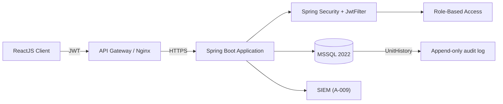

# Feature F-003: Quản lý đơn vị — Lean Architecture Design

## Summary

The Unit Management feature implements a hierarchical organizational tree using the **Materialized Path** pattern (Spring Data JPA, repository layer) with a self-referencing `Unit` entity, `path` field for O(log N) subtree traversal, and a state machine for the approval workflow (DRAFT → PENDING → APPROVED/REJECTED). The key trade-off is **materialized path over recursive CTE**: simpler queries and better read performance at the cost of path-rebuild on move operations (bounded by max depth of 3 levels).

## System Boundaries

| Aspect | Detail |
|---|---|
| **Module** | M-001 (Quản trị hệ thống) |
| **Classification** | local — no cross-module service boundaries |
| **Responsible package** | `vn.eg.haihang.model.entity.unit`, `vn.eg.haihang.repository`, `vn.eg.haihang.service.unit`, `vn.eg.haihang.controller` *(proposed — to be created)* |
| **Owns** | `Unit` (self-referencing tree), `UnitHistory` (append-only audit), organizational hierarchy metadata |
| **Calls** | `UserAccount` (F-001) for `createdBy`, `updatedBy`, `performedBy` references; `Role` (F-001) for RBAC evaluation via `JwtAuthenticationFilter` |
| **Exposed** | 8 REST endpoints under `/api/v1/units`, organization tree structure for downstream modules (M-002, M-003) |
| **Called by** | M-002 (data association to units), M-003 (port/asset ownership), M-007 (GIS object assignment), M-005 (access logs) |

**Scope note:** Per sitemap.json, existing `/admin/organizations` route (M-001) predates F-003; the new F-003 endpoints use `/api/v1/units` prefix per the BA spec and tech-lead plan. The route should be migrated to the new prefix in F-003 implementation.

## Integration Model

| Integration | Type | Contract | Timeout | Retry | Idempotent |
|---|---|---|---|---|---|
| Unit → UserAccount (F-001) | FK reference | `UserAccount.id` BIGINT | N/A (same process) | N/A | Yes — create idempotent if code unique |
| Unit → Role (F-001) | RBAC evaluation | Spring Security `@PreAuthorize` | N/A (in-memory) | N/A | N/A |
| Unit → UnitHistory | Self (same DB) | `UnitHistory.unitId → Unit.id` | N/A (same process) | N/A | Yes — append-only, no duplicate audit |
| Unit → downstream modules | Read-only tree | `GET /api/v1/units/tree` response | 1s (NFR-PERF-002) | No retry needed (read) | N/A |
| Unit → SIEM (A-009) | Audit log export | Async event → SIEM | 5s | 1 retry | Yes — dedup by event ID |

**Cross-module dependency:** F-003 depends on F-001 (Wave 2 dependency per tech-lead plan). `UserAccount` entity must be present before `Unit.createdBy` FK is established. If F-001 is not yet implemented at code level, the architecture uses FK references as logical constraints; physical FK enforcement is deferred to Flyway migration with conditional constraint.

## Data Architecture

### Entity: Unit

| Field | Type | DB Column | Constraint | Notes |
|---|---|---|---|---|
| id | BIGINT | `id` | PK, AUTO_INCREMENT | JPA @Id @GeneratedValue |
| name | String | `name` | NOT NULL, VARCHAR(100) | BR-003-08: max 200 → spec says 100; align to 100 |
| code | String | `code` | UNIQUE, NOT NULL, VARCHAR(30) | BR-003-01: system-wide uniqueness |
| unitType | Enum | `unit_type` | NOT NULL, CHECK | BR-003-04: Cục, Chi cục, Cảng vụ, TCT |
| description | String | `description` | NULL, TEXT | Optional |
| address | String | `address` | NULL, TEXT | Optional |
| coefficient | BigDecimal | `coefficient` | CHECK > 0, MAX 2 decimals | BR-017: validated at app + DB level |
| status | Enum | `status` | NOT NULL, DEFAULT 'DRAFT' | DRAFT, PENDING, APPROVED, REJECTED |
| parentId | Long | `parent_id` | FK → Unit.id NULLABLE | NULL for root; circular ref blocked at app + FK RESTRICT |
| level | Integer | `level` | NOT NULL, DEFAULT 1 | Auto-computed: depth from root |
| path | String | `path` | NOT NULL, VARCHAR(255) | Materialized path: `/1/5/12/` |
| scopeId | Long | `scope_id` | NOT NULL, DEFAULT 0 | Single-root isolation (future multi-tenant) |
| sortOrder | Integer | `sort_order` | NOT NULL, DEFAULT 0 | Sibling ordering |
| createdBy | Long | `created_by` | FK → UserAccount.id | JPA @CreatedBy |
| createdAt | Instant | `created_at` | NOT NULL | JPA @CreatedDate |
| updatedBy | Long | `updated_by` | FK → UserAccount.id | JPA @LastModifiedBy |
| updatedAt | Instant | `updated_at` | NOT NULL | JPA @LastModifiedDate |
| approvedAt | Instant | `approved_at` | NULL | Set on APPROVED transition |
| deletedAt | Instant | `deleted_at` | NULL | Soft delete |

**DB Indexes:**
- `UNIQUE(code)` — O(1) lookup per NFR-PERF-003
- `UNIQUE(scope_id, parent_id)` — prevents duplicate child placement, enforces single-root constraint
- `INDEX(path)` — B-tree for path-prefix subtree queries (`WHERE path LIKE '/1/%'`)
- `INDEX(deleted_at)` — soft-delete filtering
- `INDEX(unit_type, status)` — filter queries

### Entity: UnitHistory

| Field | Type | DB Column | Constraint | Notes |
|---|---|---|---|---|
| id | BIGINT | `id` | PK | |
| unitId | Long | `unit_id` | FK → Unit.id NOT NULL | |
| action | String | `action` | NOT NULL, VARCHAR(30) | CREATE, UPDATE, DELETE, APPROVE, REJECT, MOVE |
| performedBy | Long | `performed_by` | FK → UserAccount.id NOT NULL | |
| performedAt | Instant | `performed_at` | NOT NULL | JPA @CreatedDate |
| notes | String | `notes` | NULL, TEXT | Optional change description |

**Constraint:** Append-only table. No UPDATE or DELETE triggers on `unit_histories`. Per NFR-COMP-001, this enables complete audit trail.

### Entity: OrganizationChart (Optional/Phased)

The BA spec and feature-brief define an `OrganizationChart` entity, but its fields (unitId, parentId, level, sortOrder, effectiveDate) are **duplicates** of `Unit` fields already captured by the materialized path design. **Recommendation: defer OrganizationChart to a future feature.** The `Unit` entity alone suffices for tree traversal. This eliminates redundancy, avoids sync bugs between `Unit` and `OrganizationChart`, and reduces migration complexity.

**Rationale:** Materialized path (`path` + `level` + `parent_id`) on `Unit` makes `OrganizationChart` an unnecessary second source of truth. If effective dating (temporal hierarchy) is required later, add `effective_from` / `effective_to` columns to `Unit` instead.

### Consistency Model

| Aspect | Approach |
|---|---|
| **Create unit** | `@Transactional`: insert Unit, compute path/level, insert UnitHistory record |
| **Move subtree** | `@Transactional`: update moving node's parent_id + path, then UPDATE all descendants' paths (path-rebuild) |
| **Approve/Reject** | `@Transactional`: UPDATE Unit.status + approvedAt, insert UnitHistory record |
| **Soft delete** | `@Transactional`: UPDATE deletedAt, check FK constraints first (children, assigned users) |
| **All operations** | Single DB transaction; Spring `@Transactional` with `READ_COMMITTED` isolation |

### Migration Strategy

| Step | Action |
|---|---|
| **Pre-migration** | Confirm F-001 (UserAccount) table exists; FK to UserAccount is required |
| **Proposed: Flyway migration V_F003__create_units.sql** *(not yet created)* | CREATE TABLE `units` with all columns, indexes, FKs, CHECK constraints |
| **Proposed: Flyway migration V_F003__create_unit_histories.sql** *(not yet created)* | CREATE TABLE `unit_histories` with FK to `units`, FK to `user_accounts` |
| **Seed** | Insert initial root unit (e.g., `Cục Hàng hải` with path `/1/`, scopeId 0, level 1) |
| **Post-migration** | Validate path integrity: all units have valid path to root |

## Security

### Authentication & Authorization

| Layer | Mechanism |
|---|---|
| **Transport** | HTTPS (mandatory for all `/api/v1/*` endpoints) |
| **Auth** | JWT token, validated by `JwtAuthenticationFilter` (F-001 shared filter) |
| **Authz** | Spring Security `@PreAuthorize` + method-level role checks |
| **RBAC mapping** | JWT claims → `GrantedAuthority` → `hasRole('ADMIN')`, `hasRole('LEADER')`, etc. |
| **Data-level authz** | Service-layer scope check: user can only see/manage units within their org scope (future enhancement) |

### Role-to-Endpoint Matrix

| Endpoint | system-admin | admin | Lanh dao | Can bo | Ca nhan | user |
|---|---|---|---|---|---|---|
| `GET /units` | ✅ | ✅ | ✅ | ✅ | ✅ | ✅ |
| `GET /units/{id}` | ✅ | ✅ | ✅ | ✅ | ✅ | ✅ |
| `POST /units` | ✅ | ✅ | ❌ | ✅ | ❌ | ❌ |
| `PUT /units/{id}` | ✅ | ✅ | ❌ | ❌ | ❌ | ❌ |
| `DELETE /units/{id}` | ✅ | ✅ | ❌ | ❌ | ❌ | ❌ |
| `POST /units/{id}/approve` | ✅ | ✅ | ✅ | ❌ | ❌ | ❌ |
| `POST /units/{id}/reject` | ✅ | ✅ | ✅ | ❌ | ❌ | ❌ |
| `GET /units/tree` | ✅ | ✅ | ✅ | ✅ | ✅ | ✅ |

**Notes:**
- `system-admin`: Full access across all units and hierarchy
- `admin`: CRUD within assigned scope; cannot delete higher-level units
- `Lanh dao`: Approve/reject only; no CRUD
- `Can bo`: View + create (submit for approval)
- `Ca nhan`: View own unit only
- `user`: View tree structure only

### Security Constraints

| Constraint | Implementation |
|---|---|
| **Soft-delete enforcement** | All JPQL queries include `WHERE deletedAt IS NULL`; `@Where(clause = "deleted_at IS NULL")` on `Unit` entity |
| **Circular reference prevention** | App layer: check if new parentId exists in ancestor path (`/1/5/` — cannot set parent to self or descendant). DB layer: FK with `ON DELETE RESTRICT` |
| **Input validation** | Jakarta Validation on DTOs: `@NotNull`, `@Size(max=100)`, `@DecimalMin("0.01")`, `@Pattern` for code |
| **Injection prevention** | Parameterized queries (JPA criteria/Specifications); no raw SQL |
| **Audit trail** | Every state change creates `UnitHistory` record with `performedBy`, `performedAt`, `notes` |

### Trust Boundary

**Trust boundaries:**
1. **External → App:** JWT validation at filter level; request body validated via Jakarta annotations
2. **App → DB:** All queries parameterized; FK constraints at DB level
3. **App → SIEM:** Async event delivery; no synchronous coupling

## Deployment

### Environment Variables (from tech-lead plan)

| Variable | Purpose | Default |
|---|---|---|
| `JWT_SECRET` | JWT signing key | (required, set via vault) |
| `JWT_EXPIRATION_MS` | Token lifetime | `3600000` (1 hour) |
| `JWT_REFRESH_EXPIRATION_MS` | Refresh token lifetime | `604800000` (7 days) |

### No New Infrastructure Required

- F-003 uses the **same** MSSQL 2022 database, Spring Boot application, and JWT infrastructure as the rest of M-001
- No new services, environment variables, or CI/CD pipeline changes
- Flyway-managed migrations applied at startup (`spring.jpa.hibernate.ddl-auto=validate`)

### Rollback Strategy

| Scenario | Action |
|---|---|
| **Migration rollback** | Flyway `undo` if proposed V_F003 migration fails; revert to previous version *(migration file not yet created)* |
| **Application rollback** | Same JAR, same DB — no breaking changes; soft-delete ensures data preserved |
| **Feature flag** | Not required for F-003 (core infrastructure); future org-tree features may use flags |

### Database Migration Files (Proposed — Not Yet Created)

The engineering-technical-lead should create two Flyway migration files under `src/main/resources/db/migration/` following the project's existing naming convention (see existing migrations: `V1__create_password_policy.sql` through `V17__create_cang_can.sql`). Proposed filenames:

- `V_F003__create_units.sql` — CREATE TABLE `units` with all columns, indexes, FKs, CHECK constraints
- `V_F003__create_unit_histories.sql` — CREATE TABLE `unit_histories` with FKs to `units` and `user_accounts`

These files **do not exist on disk** and must be created as part of F-003 implementation.

## NFR Architecture

| NFR Ref | Requirement | Architectural Solution | Target | Trade-off |
|---|---|---|---|---|
| **NFR-PERF-001** | Unit list < 500ms for 10k units | Pagination (Spring Pageable, default 20, max 100) + `UNIQUE(code)` index | < 500ms | Pagination limits result set; unbounded queries not permitted |
| **NFR-PERF-002** | Tree endpoint < 1,000ms | Materialized path query (`WHERE path LIKE '/{rootId}%'`) + `path` index | < 1,000ms | Path-rebuild on move has O(depth × subtree_size) cost; bounded by max 3 levels |
| **NFR-PERF-003** | Unique code O(1) | DB UNIQUE index on `code` column | Index seek | No application-level scan needed |
| **NFR-PERF-004** | Search < 500ms | LIKE with indexed columns (`name`, `code`); full-text index if needed | < 500ms | LIKE with leading wildcard loses index; prefix search required |
| **NFR-REL-001** | Atomic approval state | Spring `@Transactional` on approve/reject methods; DB row-level lock | Atomic transition | Concurrent approve/reject: first wins, second gets OptimisticLockException |
| **NFR-REL-002** | Idempotent soft delete | Check `deletedAt` before setting; return 200 if already deleted | No error on re-delete | Silent success — caller must check return value |
| **NFR-SEC-001** | JWT + RBAC | `JwtAuthenticationFilter` + `@PreAuthorize` per endpoint | 401/403 for unauthorized | Per-endpoint annotation; not centralized permission table (future enhancement) |
| **NFR-COMP-001** | Audit trail | `UnitHistory` append-only table, FK to `UserAccount` | Complete change log | Separate table; no JOIN performance penalty (rarely queried) |

## Key Decisions

| Decision | Chosen | Rejected | Rationale |
|---|---|---|---|
| **Tree pattern** | Materialized Path (`path` field) | Nested Sets, Adjacency List, Recursive CTE | Materialized path offers O(log N) subtree read (prefix LIKE) and simple path computation; best fit for max depth 3 with infrequent moves. Nested Sets (left/right) has complex update cost; Adjacency List requires recursive queries; Recursive CTE is DB-specific (MSSQL supports but is slower than path prefix). |
| **Root unit count** | Single root per hierarchy | Multiple independent roots | Simpler path computation, single scope boundary. Multi-root would require `scopeId` segregation, adding complexity for no current business need. |
| **OrganizationChart entity** | Defer to future (not in F-003) | Create OrganizationChart as separate table | Duplicate of Unit hierarchy data. Materialized path on Unit alone satisfies all tree traversal needs. If temporal hierarchy needed later, add `effective_from`/`effective_to` to Unit. |
| **Approval states** | DRAFT → PENDING → APPROVED / REJECTED | Binary (approved/not approved) | Three-state allows draft before submission, explicit rejection with notes, and approved activation. Matches business workflow (US-003-04, US-003-05). |
| **Coefficient validation** | BigDecimal (5,2) with @DecimalMin + regex | Double with epsilon comparison | Exact decimal arithmetic for financial/calculational correctness; DB CHECK constraint enforces at storage level. |
| **Soft delete strategy** | `deletedAt` column with `@Where` | Physical deletion with FK cascade | Data retention policy (NFR-COMP-003: 5 years); soft-delete prevents accidental data loss and preserves audit trail. |
| **Path format** | `/id/id/id/` (trailing slash) | `/id,id,id` (comma-separated) | Trailing slash enables `LIKE '/1/%'` prefix match without edge-case false positives (e.g., path `/12/` would match `/1/2/` with comma format). |
| **Max depth enforcement** | Application-level check (level < 3) | DB CHECK constraint on level | DB-level limit requires CHECK with subquery (not portable); app-level check with FK RESTRICT is sufficient for business rule BR-003-04. |

## Risks, Assumptions & Open Questions

### Risks

| Risk | Impact | Mitigation |
|---|---|---|
| **F-001 not ready at implementation start** | Unit.createdBy FK references UserAccount which doesn't exist yet | Defer physical FK to F-001 implementation; use logical reference in Entity |
| **Path rebuild on subtree move causes blocking** | Moving a large subtree rewrites paths for all descendants | Bounded by max 3 levels; estimated max subtree size is small (≤ dozens of nodes) |
| **Concurrent approve/reject on same unit** | Lost update if not handled | `@Transactional` + `@Version` (optimistic lock) on Unit entity |
| **Circular reference via direct SQL bypass** | App-level circular check bypassed | FK with `ON DELETE RESTRICT` provides DB-level protection |

### Assumptions

| Assumption | Justification |
|---|---|
| Max 3 levels of hierarchy is sufficient | Per BA spec: "Phân cấp đơn vị sâu hơn 3 cấp" is out of scope; max depth enforcement is application-level |
| Single root per hierarchy tree | Chosen in AMBIGUITY-001 for simplicity; `scopeId = 0` reserved for multi-tenant expansion |
| Root unit is seeded, not created via API | Pre-existing root (e.g., `Cục Hàng hải`) is created via migration seed script |
| `unitType` values are fixed (Cục, Chi cục, Cảng vụ, TCT) | Per BR-003-04; no configurable master data needed |
| F-001 (UserAccount) is implemented before F-003 | Per tech-lead wave ordering: Wave 1 (F-001, F-004) → Wave 2 (F-002, F-003) |

### Open Questions

| ID | Question | Impact | Owner |
|---|---|---|---|
| **OQ-003-01** | What is the business purpose of coefficient? (reporting, budgeting, weighting?) | Data model completeness; downstream consumers may need documentation | BA / Business |
| **OQ-003-02** | Who initiates approval — only Admin, or Can bo as well? (AMBIGUITY-002) | API design: who can POST `/units` (just Admin or also Can bo)? | BA |
| **OQ-003-03** | Root unit: exactly one or multiple independent trees? (AMBIGUITY-001) | Tree traversal logic; `scopeId` design | BA |
| **OQ-003-04** | Unit type list: fixed enum or extensible via master data? (AMBIGUITY-004) | Validation: enum vs configurable lookup table | BA |
| **OQ-003-05** | Scope-level RBAC: should admin see only units within their scope? | Service-layer authorization logic | Security / BA |

## Handoff Guidance

### To engineering-technical-lead
- Implement `Unit` entity with materialized path pattern per this design
- Implement `UnitTreeService` for tree traversal (read subtree, get path, detect circular reference)
- Implement `UnitService` for CRUD + approval workflow state machine
- Coordinate with F-001 implementation for `UserAccount` FK references
- Ensure Flyway migrations follow proposed naming: `V_F003__create_units.sql`, `V_F003__create_unit_histories.sql` *(files to be created by engineering-technical-lead)*
- Coordinate with F-005 (AccessLog) for audit logging of unit operations

### To engineering-backend-developer
- Entity package: `vn.eg.haihang.model.entity.unit` *(proposed package — to be created)*
- Repository: `vn.eg.haihang.repository.UnitRepository` *(proposed class — extends JpaRepository)*
- Service: `vn.eg.haihang.service.UnitService` + `vn.eg.haihang.service.UnitTreeService` *(proposed classes)*
- Controller: `vn.eg.haihang.controller.UnitController` *(proposed class)*
- DTOs: `vn.eg.haihang.dto.unit.*` — UnitCreateRequest, UnitUpdateRequest, UnitResponse, UnitTreeResponse *(all proposed)*
- Enums: `UnitType` (CUC, CHI_CUC, CANG_VU, TCT), `UnitStatus` (DRAFT, PENDING, APPROVED, REJECTED) *(proposed)*
- Validator: `vn.eg.haihang.validator.UnitCodeUniqueValidator` *(proposed class)*

### To engineering-qa-engineer
- Critical test paths: circular reference detection, path rebuild on move, coefficient validation, soft-delete with FK check
- Integration test: create → approve flow; tree traversal consistency
- Security test: RBAC enforcement per role matrix above

### To engineering-code-reviewer
- Verify materialized path computation is correct on create/move
- Verify circular reference detection covers all ancestor levels
- Verify `@Where(clause = "deleted_at IS NULL")` is present on Unit entity
- Verify all service methods are `@Transactional`
- Verify Jakarta Validation annotations on all DTOs
