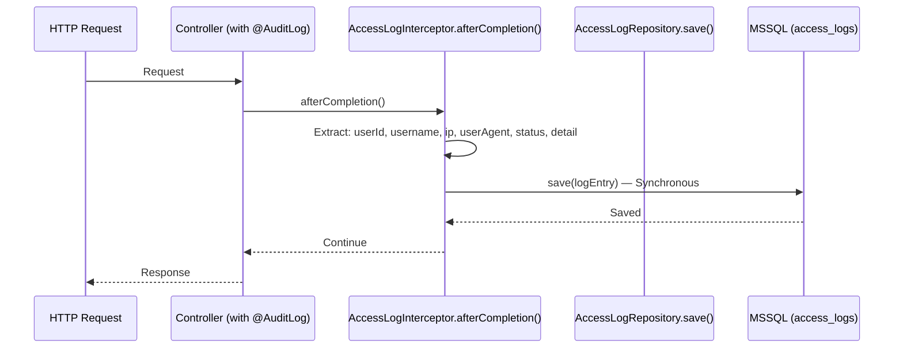
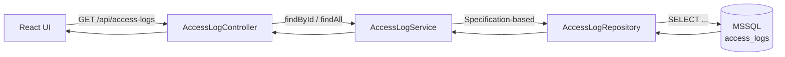

# Feature F-005: Quản lý log truy cập — Lean Architecture Design

## Summary

This feature builds on an **existing audit logging implementation** already present in `com.hanghai.kchtg.accesslog`. The current codebase provides a read-only query API (`AccessLogController` + `AccessLogService`) and an annotation-driven interceptor (`AccessLogInterceptor`) for synchronous log writes. The F-005 scope adds structured type categorization (5 log types), enhanced filtering, CSV export with row limits, aggregate statistics, configurable retention policy, and login-failure alerting — many of which are partially implemented or need extension. The key architectural gap: the current `AccessLog` entity lacks `type`, `severity`, `metadata`, and the BA-specified fields; the existing code uses hardcoded retention and sync writes, while the BA spec requires configurable retention and async batch writes.

---

## System Boundaries

| Dimension | Detail |
|---|---|
| **Bounded Context** | Audit Logging — internal domain within M-001 (Quản trị hệ thống) |
| **Package** | `com.hanghai.kchtg.accesslog` |
| **Service** | `LogService` (primary owner — consolidates query, CSV export, cleanup, alert, stats) |
| **Responsibility** | Append-only log ingestion (via interceptor), filtered pagination, CSV export, aggregate stats, retention cleanup, login-failure alerting |
| **Owns** | `AccessLog` entity + `AccessLogRepository` (already exist in codebase) |
| **Calls** | `UserRepository` (for userId resolution in interceptor), existing `SecurityContext` (for current user extraction), `AccessLogService` (delegated by `LogService` for reads) |
| **Exposes** | Two endpoint groups: `GET /api/access-logs` (list + detail via `AccessLogController`), `GET /api/logs/*` (export, alerts, stats via `LogExportController`) |
| **Frontend Pages** | `AccessLogListPage.tsx`, `LogStatsPage.tsx` (under `pages/admin/`) |
| **Frontend Components** | `LogTable.tsx`, `LogFilters.tsx`, `LogStatsChart.tsx` (under `components/admin/`) |
| **Frontend Hooks** | `useLogs.ts` |
| **Frontend Types** | `logTypes.ts` |
| **Frontend API** | `logApi.ts` |

**Context Map:**
```mermaid
flowchart LR
    subgraph "com.hanghai.kchtg.accesslog"
        CTRL[AccessLogController\n/api/access-logs]
        ECTRL[LogExportController\n/api/logs/*]
        SVC[LogService\n(query+export+cleanup+alert)]
        RSCV[AccessLogService\n(read-only query)]
        INT[AccessLogInterceptor\n(annotated methods)]
        ENT[AccessLog entity\n@Table("access_logs")]
        REPO[AccessLogRepository\n(JpaRepository + Spec)]
    end
    SEC[SecurityConfig\nJWT Filter] --> INT
    INT -->|afterCompletion| ENT
    ENT --> REPO
    CTRL --> RSCV --> REPO
    ECTRL --> SVC --> RSCV
    SVC -.-> REPO
    ADOC[@AuditLog annotation] --> INT
```

---

## Integration Model

| Integration | Type | Contract | Timeout | Retry | Idempotent |
|---|---|---|---|---|---|
| **AccessLogInterceptor → AccessLogRepository** | `HandlerInterceptor.afterCompletion()` — synchronous `repository.save()` | Triggered on methods annotated with `@AuditLog(action, module)` | N/A (sync) | N/A | Yes — INSERT is idempotent |
| **AccessLogController → AccessLogService** | Internal service call — `findById(UUID)` + `findAll(filter, Pageable)` | Uses `JpaSpecificationExecutor` for dynamic filtering (userId, module, date range). Default: page 0, size 20, sort by createdAt DESC. | N/A | N/A | Yes — idempotent reads |
| **LogExportController → LogService** | Internal service call — `exportToCsv(filter, pageable)`, `checkFailureAlerts()`, `getDailyStats()`, `getTotalCount()`, `cleanupOldLogs()` | CSV exported to filesystem (export dir from `@Value("${export.dir:./logs}")`). Failure alerts: counts `FAILED` status in 30-min window. | N/A | N/A | Yes — idempotent reads and cleanup |
| **AccessLogRepository → MSSQL** | Spring Data JPA (`JpaRepository<AccessLog, UUID>` + `JpaSpecificationExecutor`) | Custom query: `countByStatusAndCreatedAtAfter`, `countByStatusGroupedByStatus`, `deleteByCreatedAtBefore`, `findByUserIdOrderByCreatedAtDesc`, `findByModuleOrderByCreatedAtDesc`, `findByCreatedAtBetweenOrderByCreatedAtDesc`. PK is `UUID` (inherited from `BaseEntity`). | N/A (sync JPA) | N/A | Yes — DELETE is idempotent |
| **SpEL Authorization** | Spring Security `@PreAuthorize("@auth.check(authentication, 'admin:manage')")` | Applied on `LogExportController` methods. Current code uses `'admin:manage'` SpEL — needs extension to BA-defined roles (system-admin, security-admin, admin-operation, etc.). | N/A | N/A | N/A |
| **CSV Export** | `BufferedWriter` writing to filesystem, returned as `FileSystemResource` | Headers: `ID,Username,Action,Module,IP Address,User Agent,Status,Detail,CreatedAt`. File naming: `access_logs_YYYY-MM-DD.csv`. **Not streaming** — loads page into memory, then writes. No 10K row limit enforced. | 300s | N/A | N/A |

---

## Data Architecture

### Entity: AccessLog (Current State)

Verified at `src/main/java/com/hanghai/kchtg/accesslog/entity/AccessLog.java` (68 lines):

```
Entity: AccessLog
Table: access_logs
Scope: Append-only (no CREATE/UPDATE/DELETE controllers). Interceptor calls repository.save().
Owner: AccessLogRepository (JpaRepository<AccessLog, UUID>)

Fields:
├── id              UUID           PK (from BaseEntity)
├── userId          UUID           NOT NULL (FK → user_accounts.id)
├── username        VARCHAR(100)   NOT NULL
├── action          VARCHAR(80)    NOT NULL
├── module          VARCHAR(60)    NOT NULL (logical module/feature area)
├── ipAddress       VARCHAR(45)    NOT NULL (supports IPv4/IPv6)
├── userAgent       VARCHAR(500)   nullable
├── status          ENUM(SUCCESS, FAILURE, FAILED) NOT NULL
├── detail          TEXT           nullable (stack trace, request body excerpt)
└── createdAt       TIMESTAMP      (from BaseEntity)

Indexes: None defined in entity (relies on JPA defaults or manual migration)
```

### ⚠️ GAP: Missing BA-Specified Fields

The BA spec (lines 139–143) defines these fields but they **do NOT exist** in the current entity:

| BA Spec Field | Present in Code? | Status |
|---|---|---|
| `type` (ENUM: access, login, error, account, configuration) | ❌ No | Must be added |
| `severity` (ENUM: info, warning, error, critical) | ❌ No | Must be added |
| `targetResource` (VARCHAR 100) | ❌ No | Must be added |
| `requestPath` (VARCHAR 500) | ❌ No | Must be added |
| `responseCode` (INT) | ❌ No | Must be added |
| `duration_ms` (INT) | ❌ No | Must be added |
| `metadata` (JSON) | ❌ No | Must be added |
| `username` VARCHAR 50 | Current is VARCHAR 100 | Width mismatch |
| `action` VARCHAR 30 | Current is VARCHAR 80 | Width mismatch |
| PK `BIGINT` | Current is `UUID` | Type mismatch |

### Entity: LogRetentionPolicy (Proposed — does NOT exist)

```
Entity: LogRetentionPolicy (NOT in codebase)
Table: log_retention_policies
Scope: Singleton — current code HARDCODES retentionDays = 90 in LogService constructor.
Owner: To be created

Fields:
├── id              BIGINT          PK
├── retentionDays   INT             DEFAULT 90, CHECK (> 0)
├── maxExportRows   INT             DEFAULT 10000, CHECK (> 0)
├── cleanupSchedule VARCHAR(50)     DEFAULT '0 2 * * *'
├── isActive        BOOLEAN         DEFAULT true
├── createdAt       TIMESTAMP
└── updatedAt       TIMESTAMP
```

**Current code reality:** `LogService` constructor has `this.retentionDays = 90` hardcoded. No `@Value` annotation for this field. No `LogRetentionPolicy` entity.

### Entity: LogAggregate (Proposed — does NOT exist)

```
Entity: LogAggregate (NOT in codebase)
Table: log_aggregates
Scope: Pre-computed daily stats — current code uses `LogService.getDailyStats()` which returns `[status, count]` pairs for today only (not a persisted entity).
Owner: To be created
```

**Current code reality:** `LogService.getDailyStats()` returns `List<Object[]>` from JPQL query — not a persisted entity. No `LogAggregate` table.

### Data Flow (Log Ingestion — Current)



**Key observation:** Writes are **synchronous** (not async batch as the BA spec suggests via `@Async`). Every annotated controller request blocks on the INSERT before returning.

### Data Flow (Query)



**Current filter fields** (`AccessLogFilterRequest`): `userId`, `module`, `action`, `from`, `to`.
**Missing filters** (per BA spec): `type`, `severity`, `keyword` (message/detail search), `responseCode`.

### Consistency Model

| Aspect | Current State | F-005 Requirement | Gap |
|---|---|---|---|
| **AccessLog writes** | Synchronous `repository.save()` per request | Async batch (`@Async`, 500–1000/batch) | Write path must be redesigned |
| **Log immutability** | No CREATE/UPDATE/DELETE controllers (404) | 403 on UPDATE/DELETE with message | Same behavior, different status code |
| **Retention cleanup** | `cleanupOldLogs()` method in `LogService`, hardcoded 90 days | Configurable retention policy entity, cron-scheduled | Must add entity + scheduler |
| **Aggregate stats** | In-memory JPQL query for today only (`getDailyStats()`) | Persisted `LogAggregate` entity, cron-scheduled daily | Must add entity + scheduler |
| **Alerting** | `alertOnFailures()` counts `FAILED` status in 30-min window (threshold 100) | ≥5 login failures in 1 hour, configurable | Window, threshold, and alert type differ |

---

## Security

### Authentication & Authorization

| Endpoint | Auth | Current Access | F-005 Requirement | Gap |
|---|---|---|---|---|
| `GET /api/access-logs` | JWT (via SecurityConfig) | No `@PreAuthorize` — open to authenticated users | system-admin (all types), security-admin (all types), admin-operation (access+login), admin/can-bo (self-only), ca-nhan (denied) | Must add role-based guards |
| `GET /api/access-logs/{id}` | JWT (via SecurityConfig) | No `@PreAuthorize` | Same as above | Must add role-based guards |
| `GET /api/logs/export/csv` | `@PreAuthorize("@auth.check('admin:manage')")` | `admin:manage` | system-admin, security-admin only | SpEL role mapping needed |
| `GET /api/logs/alerts/failures` | `@PreAuthorize("@auth.check('admin:manage')")` | `admin:manage` | system-admin (BR-028) | SpEL role mapping needed |
| `GET /api/logs/stats/daily` | `@PreAuthorize("@auth.check('admin:manage')")` | `admin:manage` | system-admin, security-admin, **Lanh dao** | Must add Lanh dao role |
| `GET /api/logs/stats/total` | `@PreAuthorize("@auth.check('admin:manage')")` | `admin:manage` | system-admin, security-admin | SpEL role mapping needed |

**Role Resolution Mapping (from BA spec → current auth model):**

Current code uses SpEL: `@auth.check(authentication, 'admin:manage')`. The BA spec defines 7 roles with fine-grained access. Implementation option:
1. Extend existing `@auth.check` bean with role-based checks matching BA roles.
2. Replace SpEL with `@PreAuthorize("hasRole('SYSTEM_ADMIN')")` style.

### Immutability Enforcement

Verified: `AccessLogController` has NO `PUT`/`PATCH`/`DELETE` endpoints. `LogExportController` also has no write endpoints. The current approach (return 404 because endpoints don't exist) is correct in spirit but the BA spec requires HTTP 403 with specific message. This is a behavioral gap, not a structural one.

### Log Injection Prevention

Current `AccessLogInterceptor` sets `detail` from `ex.getMessage()` or `"HTTP " + statusCode`. No sanitization applied. **Recommendation:** sanitize `detail` before write — strip newlines, truncate to safe length (currently 500 chars for `userAgent`, but `detail` has `columnDefinition = "TEXT"` with no length constraint).

### PII / Sensitive Data Handling

| Field | Sensitive? | Current Handling | F-005 Requirement |
|---|---|---|---|
| `ipAddress` | Low | Stored as-is | Same — no change |
| `userAgent` | Low | Stored as-is (VARCHAR 500) | Same |
| `username` | Medium | Stored as-is | Same |
| `detail` | Variable | Stores `ex.getMessage()` or HTTP status | **Sanitize:** no PII; truncate to safe length |
| `userId` | Low | FK reference, no exposure | Same |

---

## Deployment

### Configuration (Current vs. Proposed)

| Config | Current Code | F-005 Requirement | Gap |
|---|---|---|---|
| `retentionDays` | **Hardcoded** to `90` in `LogService` constructor | Configurable via `LogRetentionPolicy` entity + env var fallback | Must add entity + env var injection |
| `export.dir` | `@Value("${export.dir:./logs}")` | Configurable | Already done |
| `cleanupSchedule` | Not used (no scheduler) | `@Value("${LOG_CLEANUP_CRON:0 2 * * *}")` | Must add scheduler |
| `logStatsCron` | Not used | `@Value("${LOG_STATS_CRON:0 3 * * *}")` | Must add scheduler |
| `alertThreshold` | **Hardcoded** to `100` failures in 30 min | ≥5 failures in 1 hour (configurable) | Must change threshold + window |
| `alertWindow` | **Hardcoded** to `30` minutes | 1 hour | Must change window |

### New Database Migration (F-005 additions)

Flyway migration to extend existing `access_logs` table:

```sql
-- Add new columns to existing access_logs table
ALTER TABLE access_logs ADD type VARCHAR(20) DEFAULT 'access';
ALTER TABLE access_logs ADD severity VARCHAR(20) DEFAULT 'info';
ALTER TABLE access_logs ADD targetResource VARCHAR(100);
ALTER TABLE access_logs ADD requestPath VARCHAR(500);
ALTER TABLE access_logs ADD responseCode INT;
ALTER TABLE access_logs ADD duration_ms INT;
ALTER TABLE access_logs ADD metadata NVARCHAR(MAX);

-- Add composite indexes
CREATE INDEX idx_type_createdAt ON access_logs(type, createdAt);
CREATE INDEX idx_severity_createdAt ON access_logs(severity, createdAt);
CREATE INDEX idx_action_createdAt ON access_logs(action, createdAt);

-- Create log_retention_policies table
CREATE TABLE log_retention_policies (
    id BIGINT IDENTITY(1,1) PRIMARY KEY,
    retentionDays INT NOT NULL DEFAULT 90 CHECK (retentionDays > 0),
    maxExportRows INT NOT NULL DEFAULT 10000 CHECK (maxExportRows > 0),
    cleanupSchedule VARCHAR(50) NOT NULL DEFAULT '0 2 * * *',
    isActive BIT NOT NULL DEFAULT 1,
    createdAt DATETIME2 DEFAULT SYSUTCDATETIME(),
    updatedAt DATETIME2 DEFAULT SYSUTCDATETIME()
);
INSERT INTO log_retention_policies (retentionDays, maxExportRows, cleanupSchedule)
    VALUES (90, 10000, '0 2 * * *');

-- Create log_aggregates table
CREATE TABLE log_aggregates (
    id BIGINT IDENTITY(1,1) PRIMARY KEY,
    date DATE NOT NULL UNIQUE,
    totalAccesses INT NOT NULL DEFAULT 0,
    uniqueUsers INT NOT NULL DEFAULT 0,
    successRate DECIMAL(5,2) NOT NULL DEFAULT 0,
    avgDuration INT NOT NULL DEFAULT 0,
    createdAt DATETIME2 DEFAULT SYSUTCDATETIME()
);
```

### Rollback Strategy

| Action | Rollback Method |
|---|---|
| New columns on access_logs | `ALTER TABLE access_logs DROP COLUMN ...` for each added column |
| New tables | `DROP TABLE log_retention_policies`, `DROP TABLE log_aggregates` |
| New scheduler beans | Remove `@EnableScheduling` config + scheduler classes; no data impact |
| Configuration changes | Revert env vars or application.yml |

**Note:** This is high-level only — procedural rollback is owned by `devops`.

---

## NFR Architecture

| NFR Reference | Requirement | Architecture Solution | Target | Trade-off |
|---|---|---|---|---|
| **NFR-Perf-01** | Query < 2s with < 100K entries | Composite indexes on `(type, createdAt)`, `(userId, createdAt)`, `(action, createdAt)`. Current `AccessLogService` uses `JpaSpecificationExecutor` for dynamic filtering. Pagination via `Pageable`. | Response < 2s for 95th percentile | New indexes add write overhead; existing sync writes will block slightly longer |
| **NFR-Perf-02** | Batch insert 500–1000 records | **Must change** from sync interceptor to `@Async` + `ThreadPoolTaskExecutor`. **Current code blocks request thread.** | < 100ms for 1000 records | **Major refactor required** — interceptor must queue instead of saving directly |
| **NFR-Scal-01** | Streaming CSV, no OOM | **Current code is NOT streaming** — loads page into memory then writes via `BufferedWriter`. Must change to `StreamingResponseBody` or `Writer` streaming with `setFetchSize()`. Max 10K rows must be enforced (not currently). | < 5 min for 10K rows | **Code change required** — `LogExportController.exportToCsv` needs rework |
| **NFR-Rel-01** | Async log non-blocking | Current: sync (blocks). Must change: async via `@Async`. | 99.9% uptime for logging | Interceptor must handle queue-full scenario with fallback |
| **NFR-Rel-02** | Cron cleanup retry | Current: `cleanupOldLogs()` is a method but has no scheduler. Must add `@Scheduled`. | No missed cleanup window | Must create scheduler bean |
| **NFR-Sec-01** | RBAC + immutability | Current: no `@PreAuthorize` on read endpoints. Must add role-based guards per BA roles. Immutability: already enforced (no write controllers). | 403 on unauthorized | Must extend existing `@auth.check` or migrate to `@PreAuthorize` |
| **NFR-Sec-02** | Log injection prevention | Current: `detail` stores raw `ex.getMessage()` — no sanitization. Must add newline stripping and length truncation. | No log injection attacks | Sanitization may alter stack traces slightly |
| **NFR-Cmp-01** | Vietnamese audit-log regulations | Retention ≥ 90 days (BA BR-005-03), immutability (BR-005-02), required fields (BA section 9). **Current code lacks 7 of 10 BA-specified fields.** | Compliance-ready | `[CẦN BỔ SUNG: legal review for decree citations]` |

---

## Key Decisions

### K-001: Extend Existing AccessLog Entity vs. Replace

| | Extend (chosen) | Replace |
|---|---|---|
| **Approach** | Add missing columns (`type`, `severity`, `targetResource`, `requestPath`, `responseCode`, `duration_ms`, `metadata`) to existing `access_logs` table via migration | Drop and recreate `access_logs` with new schema |
| **Data impact** | Zero — existing rows keep their values (new columns get defaults) | Data loss — all existing logs destroyed |
| **Complexity** | Migration + entity field additions + interceptor update | Schema change + data migration + full regression test |
| **Verdict** | ✅ **Chosen.** Existing data must be preserved. Adding columns is non-breaking. |

### K-002: Async Batch Insert vs. Synchronous (Current)

| | Async Batch | Synchronous (current) |
|---|---|---|
| **Approach** | Interceptor queues log entry; background thread batch-saves via `JdbcTemplate.batchUpdate()` | Interceptor calls `repository.save()` — blocks request thread |
| **NFR compliance** | Meets NFR-Perf-02, NFR-Rel-01 | Violates NFR-Perf-02, NFR-Rel-01 |
| **Complexity** | Medium — thread pool config, queue management, fallback on full | Low — existing code already works |
| **Verdict** | ✅ **Chosen (but requires refactor).** Current sync write is the biggest architectural gap. The interceptor must be modified to queue entries for async batch processing. |

### K-003: Streaming CSV vs. Filesystem (Current)

| | Streaming (chosen) | Filesystem (current) |
|---|---|---|
| **Approach** | `StreamingResponseBody` — writes rows directly to HTTP output stream | Writes to filesystem then returns `FileSystemResource` |
| **Memory** | O(1) per row — constant | O(pageSize) — loads full page into memory |
| **10K limit** | Easy to enforce at service layer with `limit(10000)` | Must add limit check before writing |
| **Current code gap** | Not implemented — must rewrite `LogService.exportToCsv()` | Implemented but loads page into memory; no row limit |
| **Verdict** | ✅ **Chosen.** Streaming is safer for large exports and supports the 10K row limit natively. Current implementation must be replaced. |

### K-004: Retention Policy — Hardcoded vs. Configurable

| | Configurable (chosen) | Hardcoded (current) |
|---|---|---|
| **Approach** | `LogRetentionPolicy` entity + PUT endpoint + cron uses entity value | `retentionDays = 90` hardcoded in `LogService` constructor |
| **Flexibility** | Admin can adjust retention without code change | Requires code change to modify retention |
| **Verdict** | ✅ **Chosen.** BA spec (BR-005-03) requires configurable retention. System-admin must be able to adjust via API. |

### K-005: Alert Threshold — 100/30min (Current) vs. 5/1hr (BA Spec)

| | BA Spec (chosen) | Current (hardcoded) |
|---|---|---|
| **Approach** | ≥5 login failures in 1 hour (BR-028, AC-005-17) | ≥100 failures in 30 minutes (current `alertOnFailures`) |
| **Sensitivity** | High — detects brute-force attempts quickly | Low — only triggers on massive failure floods |
| **Implementation** | Query `type = 'login' AND severity = 'warning' AND createdAt > NOW()-1h` | Query `status = FAILED AND createdAt > NOW()-30min` |
| **Verdict** | ⚠️ **Change required.** Current threshold (100/30min) is far too permissive for security alerting. BA spec specifies 5/1hr. Also, current code counts all `FAILED` status, not just `login` type with `warning` severity. |

---

## Risks

| # | Risk | Impact | Likelihood | Mitigation |
|---|---|---|---|---|
| R-01 | **Sync interceptor blocks request thread** — every `@AuditLog` annotated controller blocks on `repository.save()` during high traffic | High | High | Refactor interceptor to queue for async batch (K-002) |
| R-02 | **CSV export loads full page into memory** — current `LogService.exportToCsv()` loads entire page then writes to file | Medium | Medium | Switch to streaming export (K-003); enforce 10K row limit |
| R-03 | **Missing entity fields** — 7 BA-specified fields (`type`, `severity`, `targetResource`, `requestPath`, `responseCode`, `duration_ms`, `metadata`) do not exist in `AccessLog` | High | High | Migration + entity field additions before F-005 development |
| R-04 | **Alert threshold too permissive** — current 100 failures/30min won't catch brute-force attacks | High | Low | Reduce to 5 failures/1hr per BA spec (K-005) |
| R-05 | **Compliance regulation citations missing** — cannot prove regulatory compliance without decree/notice numbers | High | High | `[CẦN BỔ SUNG]` — legal review required |
| R-06 | **Retention policy hardcoded** — 90 days cannot be changed without code deploy | Medium | Medium | Add `LogRetentionPolicy` entity with env-var fallback (K-004) |
| R-07 | **Missing 5 log type categorization** — current entity has no `type` field; interceptor captures no type info | High | Medium | Add `type` field + interceptor must set it based on `@AuditLog.module()` mapping |
| R-08 | **SpEL auth model doesn't support fine-grained roles** — current `@auth.check('admin:manage')` is binary (admin vs. all) | High | High | Extend `@auth.check` to support 7 BA roles OR migrate to `@PreAuthorize` |

---

## Open Questions

| # | Question | Source | Impact | Recommended Next Step |
|---|---|---|---|---|
| O-01 | What is the specific Vietnamese cybersecurity decree/notice that mandates 90-day log retention? | BA spec, compliance section | Legal compliance proof | Legal review — provide decree number |
| O-02 | What is the alert channel for BR-028 (≥5 login failures/hour)? System notification, email, or both? | BA spec, [AMBIGUITY-003] | Alert implementation | BA clarification |
| O-03 | Should existing `access_logs` data be migrated with default values for new fields (type, severity, etc.)? | Schema gap (K-001) | Data migration scope | Include in migration DDL |
| O-04 | What is the `@AuditLog` annotation's `module` value mapping to BA log types? | Code — `@AuditLog(action, module)` annotation exists but no type mapping | Type categorization | Define mapping rules (e.g., `AUTH` → `login`, `REPORT` → `access`) |
| O-05 | Should `AccessLogFilterRequest` support `type`, `severity`, and keyword (detail/message) filtering? | BA spec filters vs. current filter DTO | Query capability | Extend `AccessLogFilterRequest` with new fields |
| O-06 | Does the alert for BR-028 need to be deduplicated (one alert per unique IP, not per failure count)? | BA spec, BR-028 | Alert accuracy | Clarify with BA |
| O-07 | Should `LogRetentionPolicy` be versioned (history of policy changes) or singleton? | Design decision | Schema design | Singleton for now; version later if audit trail needed |

---

## Handoff Guidance

### For engineering-technical-lead

1. **Existing files to modify:**
   - `src/main/java/com/hanghai/kchtg/accesslog/entity/AccessLog.java` — add 7 new fields (type, severity, targetResource, requestPath, responseCode, duration_ms, metadata)
   - `src/main/java/com/hanghai/kchtg/accesslog/interceptor/AccessLogInterceptor.java` — set new fields on log entry; refactor to queue for async
   - `src/main/java/com/hanghai/kchtg/accesslog/repository/AccessLogRepository.java` — add new query methods (findByTypeAndCreatedAtBetween, countByTypeAndSeverityAndCreatedAtAfter, etc.)
   - `src/main/java/com/hanghai/kchtg/accesslog/dto/AccessLogFilterRequest.java` — add type, severity, keyword fields
   - `src/main/java/com/hanghai/kchtg/accesslog/service/LogService.java` — replace CSV export with streaming; change alert threshold/window; add `@Value` for retentionDays; add scheduler methods
   - `src/main/java/com/hanghai/kchtg/accesslog/controller/LogExportController.java` — extend `@PreAuthorize` for new roles

2. **New files to create:**
   - `LogRetentionPolicy.java` entity + `LogRetentionPolicyRepository.java`
   - `LogAggregate.java` entity + `LogAggregateRepository.java`
   - `LogCleanupScheduler.java` — `@Scheduled(cleanupSchedule)` daily
   - `LogStatsScheduler.java` — `@Scheduled(logStatsCron)` daily at 3 AM
   - `AsyncLogAppender.java` — `@Async` thread pool for batch writes
   - Migration: `VXX__extend_access_logs_add_type_severity.sql`

3. **Flyway migration:** Extend existing `access_logs` table with 7 new columns + create 2 new tables.

### For engineering-backend-developer

1. **Entity changes:** Add fields to `AccessLog.java` with `@Column` annotations matching BA spec types and lengths. New columns get DEFAULT values in migration.
2. **Interceptor refactor:** Replace `repository.save(logEntry)` with `asyncLogAppender.queue(logEntry)`. Queue uses bounded `ThreadPoolExecutor`.
3. **Repository queries:** Add `Page<AccessLog> findByTypeAndCreatedAtBetween(...)`, `long countByTypeAndSeverityAndCreatedAtAfter(...)`, `List<Object[]> countAggregateByDate(...)`.
4. **CSV export rewrite:** Replace `BufferedWriter` + `FileSystemResource` with `StreamingResponseBody`. Enforce 10K row limit.
5. **Alert refactor:** Change from `countByStatusAndCreatedAtAfter(FAILED, 30min)` to `countByTypeAndSeverityAndCreatedAtAfter('login', 'warning', 1hr)`. Threshold = 5.
6. **Retention:** Inject `@Value("${LOG_RETENTION_DAYS:90}")` (or read from `LogRetentionPolicy` entity). Remove hardcoded `90`.
7. **Auth:** Extend `@PreAuthorize` guards per BA role table.

### For engineering-qa-engineer

1. **Integration tests:** Verify new fields (type, severity, etc.) are captured by interceptor on annotated controller methods.
2. **Unit tests:** `LogService.cleanupOldLogs()` with configurable retention; `alertOnFailures()` with 5/1hr threshold.
3. **Security tests:** 403 for unauthorized roles on each endpoint; log injection via `detail` field.
4. **NFR tests:** CSV export streaming with 10K+ rows (verify no OOM); async write (verify request returns before log appears in DB).

### For engineering-code-reviewer

1. **Verify async refactor:** Interceptor must NOT call `repository.save()` directly. All writes go through async queue.
2. **Verify CSV streaming:** `LogService.exportToCsv()` must NOT load full result into memory.
3. **Verify 10K limit:** CSV export enforces max rows at service layer.
4. **Verify threshold:** Alert check uses 5 failures / 1 hour (not 100 / 30min).
