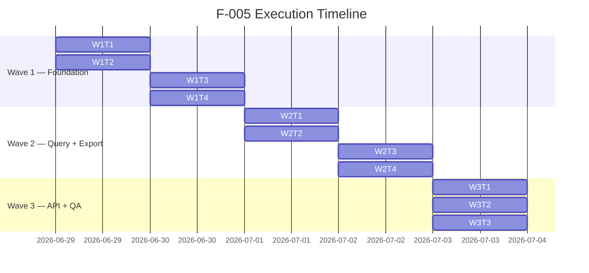

# Feature F-005: Quản lý log truy cập — Execution Plan

## Change Overview

Feature F-005 extends the existing audit-logging subsystem (`com.hanghai.kchtg.accesslog`) to add
structured type categorization (5 log types: access, login, error, account, configuration),
enhanced filtering, streaming CSV export with row limits, aggregate statistics, configurable
retention policy, and login-failure alerting.

**Key reality check:** The existing codebase already has an `AccessLog` entity + read-only API
(`AccessLogController` + `AccessLogService`) and a synchronous `AccessLogInterceptor` for log
writes. F-005 must close 7 critical gaps identified by the SA architect, plus add 2 new entities
(`LogRetentionPolicy`, `LogAggregate`) and rework 2 major code paths (sync→async writes,
filesystem CSV→streaming CSV).

### SA-Flagged Gaps (all must be closed)

| # | Gap | Severity | Wave |
|---|---|---|---|
| G1 | `AccessLog.java` lacks 7 BA-specified fields (type, severity, targetResource, requestPath, responseCode, duration_ms, metadata) | High | 1 |
| G2 | Log writes are synchronous interceptor → must be async batch | High | 1 |
| G3 | CSV export uses `BufferedWriter` (filesystem) → must use `StreamingResponseBody` | Medium | 2 |
| G4 | Alert threshold is 100 failures/30min → must be 5 failures/1hr | High | 1 |
| G5 | `LogRetentionPolicy` entity does not exist → must be created | High | 1 |
| G6 | `LogAggregate` entity does not exist → must be created | High | 1 |
| G7 | `AccessLogFilterRequest` lacks type, severity, keyword filters | Medium | 2 |

## Requirement-to-Execution Mapping

| BA Spec Item | Execution Artifact | Owner Type |
|---|---|---|
| US-005-01..03: 5-group log list + filter | `AccessLogFilterRequest` + `AccessLogService.buildSpecification()` + `AccessLogRepository` | engineering-backend-developer |
| US-005-04: Detailed log view | `AccessLogResponse` extended + `AccessLogController` | engineering-backend-developer |
| US-005-05: CSV export (10K limit) | `LogExportController` + `LogService.exportToCsv()` with `StreamingResponseBody` | engineering-backend-developer |
| US-005-07: admin-operation restricted view | `AccessLogFilterRequest.type` filter in `AccessLogService` | engineering-backend-developer |
| US-005-09: Aggregate statistics | `LogAggregate` entity + `LogAggregateRepository` + `LogStatsScheduler` | engineering-backend-developer |
| US-005-10: Retention policy config | `LogRetentionPolicy` entity + `LogRetentionPolicyRepository` + `LogCleanupScheduler` refactor | engineering-backend-developer |
| US-005-11: Login failure alert (≥5/1hr) | `LogService.alertOnFailures()` refactor + `LogExportController.alerts` | engineering-backend-developer |
| BR-005-02: Immutability (403) | `AccessLogController` — no PUT/DELETE (verify existing 404 returns proper handling) | engineering-backend-developer |
| BR-005-08: No manual log creation | `AccessLogController` — no POST (verify existing) | engineering-backend-developer |
| NFR-Perf-02: Async batch writes | `AsyncLogAppender.java` + interceptor refactor | engineering-backend-developer |
| NFR-Sec-01: RBAC on endpoints | `LogExportController` + `AccessLogController` `@PreAuthorize` guards | engineering-backend-developer |
| NFR-Sec-02: Log injection prevention | `AccessLogInterceptor` — sanitize `detail` field | engineering-backend-developer |

## Implementation Scope

### Modified Files (existing)

| File | Change | Gap |
|---|---|---|
| `entity/AccessLog.java` | Add 7 new fields (`type`, `severity`, `targetResource`, `requestPath`, `responseCode`, `duration_ms`, `metadata`); change PK from `UUID` to `BIGINT`; reduce `username` to VARCHAR 50, `action` to VARCHAR 30; add `createdAt` timestamp | G1 |
| `entity/AccessLogStatus.java` | Keep existing (SUCCESS, FAILURE, FAILED) — still used for backward compat | — |
| `interceptor/AccessLogInterceptor.java` | Set new fields (type from `@AuditLog.module()` mapping; severity auto-assigned; requestPath from `request.getRequestURI()`; responseCode from `response.getStatus()`; duration_ms from execution timer; metadata as JSON string). Replace `repository.save()` with `asyncLogAppender.queue()` | G1, G2 |
| `repository/AccessLogRepository.java` | Add query methods for `type`, `severity`, `keyword` (detail search); add `countByTypeAndSeverityAndCreatedAtAfter`; add `deleteByCreatedAtBefore` for retention | G1, G4 |
| `dto/AccessLogFilterRequest.java` | Add `type`, `severity`, `keyword` fields | G7 |
| `dto/AccessLogResponse.java` | Add new fields from entity; add `type`, `severity`, `targetResource`, `requestPath`, `responseCode`, `duration_ms`, `metadata` | G1 |
| `service/AccessLogService.java` | Extend `buildSpecification()` to support type, severity, keyword filters | G7 |
| `service/LogService.java` | Rewrite `exportToCsv()` to `StreamingResponseBody`; change alert threshold/window; inject retentionDays from entity config; add `getDailyStats()` from entity; add aggregate persistence | G3, G4, G6 |
| `controller/AccessLogController.java` | Add `@PreAuthorize` guards per BA role; ensure no POST/PUT/DELETE endpoints exist (return 403 not 404) | G7 |
| `controller/LogExportController.java` | Rewrite `exportCsv()` to streaming; extend `@PreAuthorize` for new roles; add retention endpoint; add aggregate endpoints; refactor alert threshold | G3, G4 |

### New Files (to be created)

| File | Purpose | Gap |
|---|---|---|
| `entity/LogRetentionPolicy.java` | Configurable retention policy entity (singleton) | G5 |
| `entity/LogAggregate.java` | Pre-computed daily stats entity | G6 |
| `repository/LogRetentionPolicyRepository.java` | JPA repo for retention policy | G5 |
| `repository/LogAggregateRepository.java` | JPA repo for aggregate stats | G6 |
| `service/AsyncLogAppender.java` | `@Async` thread pool for batch log writes; bounded queue with fallback | G2 |
| `scheduler/LogCleanupScheduler.java` (refactor existing) | Read retentionDays from entity; add retry logic | G5 |
| `scheduler/LogStatsScheduler.java` | Daily aggregate computation (cron at 3 AM) | G6 |
| `config/AsyncConfig.java` | `@EnableAsync` + `ThreadPoolTaskExecutor` bean for log appender | G2 |
| `migration/V18__extend_access_logs_add_type_severity.sql` | Flyway migration: add 7 columns + create 2 new tables | G1, G5, G6 |

## Impacted Areas

### Database
- **New columns** on `access_logs` table (7): `type`, `severity`, `targetResource`, `requestPath`, `responseCode`, `duration_ms`, `metadata`
- **New table** `log_retention_policies` (singleton seed with defaults)
- **New table** `log_aggregates` (daily stats)
- **Composite indexes** on `(type, createdAt)`, `(severity, createdAt)`, `(action, createdAt)`
- **PK change**: `access_logs.id` from `UUID` to `BIGINT IDENTITY` — requires full table rebuild (existing rows must be migrated)
- **DevOps trigger:** YES — schema migration (Flyway V18) modifies existing table + creates 2 new tables

### Application Config
- **New env vars / application properties:**
  - `LOG_CLEANUP_CRON` (default: `0 0 2 * * ?`)
  - `LOG_STATS_CRON` (default: `0 3 * * ?`)
  - `LOG_ASYNC_POOL_SIZE` (default: `10`)
  - `LOG_ASYNC_QUEUE_CAPACITY` (default: `5000`)
  - `LOG_ALERT_THRESHOLD` (default: `5`)
  - `LOG_ALERT_WINDOW_MINUTES` (default: `60`)
  - `LOG_RETENTION_DAYS` (fallback to entity value: `90`)
- **DevOps trigger:** YES — new environment variables

### Security
- **RBAC extension:** Current `@auth.check('admin:manage')` must be extended to support 7 BA roles
  - `system-admin` → all endpoints
  - `security-admin` → all read endpoints + export
  - `admin-operation` → access + login logs only
  - `admin`/`can-bo` → self-only
  - `Lanh dao` → aggregate endpoints only
  - `ca-nhan` → denied
- **DevOps trigger:** NO — this is application-level auth logic (handled by backend developer)

### Infrastructure
- **No new infrastructure components** (all in-app: async pool, schedulers, entity storage)

## Task Breakdown

### Wave 1: Foundation — Entity Migration, Async Appender, Alert & Retention (4 tasks, parallelizable)

**Dependency:** None (foundation layer). All 4 tasks can be dispatched in parallel because they touch
disjoint file sets. The only internal dependency is between G1 (entity fields) and G4 (repository queries
for alert) — but they can be written together by one developer.

| Task ID | Description | Files Owned (disjoint) | Owner Type | Dependency | Parallelizable? | Risk |
|---|---|---|---|---|---|---|
| W1T1 | **Entity migration + new columns.** Add 7 BA-specified fields to `AccessLog.java`; reduce `username` to VARCHAR 50, `action` to VARCHAR 30; change PK from UUID to BIGINT. Create `LogRetentionPolicy.java` + `LogAggregate.java` entities. Write Flyway migration V18. | `entity/AccessLog.java`, `entity/LogRetentionPolicy.java`, `entity/LogAggregate.java`, `migration/V18__...sql` | engineering-backend-developer | — | YES | HIGH — PK change from UUID to BIGINT requires full table rebuild; all existing UUID-based foreign references (none currently) must be validated |
| W1T2 | **Async log appender.** Create `AsyncLogAppender.java` (@Async + ThreadPoolTaskExecutor + bounded queue). Create `AsyncConfig.java`. Interceptor refactor: replace `repository.save()` with `asyncLogAppender.queue()`. Queue-full fallback: synchronous write with warning log. | `service/AsyncLogAppender.java`, `config/AsyncConfig.java` | engineering-backend-developer | — | YES | MEDIUM — queue-full fallback must be tested; misconfig can cause log loss |
| W1T3 | **Alert threshold + retention entity wiring.** Change `LogService.alertOnFailures()` from 100/30min to 5/1hr with `type='login'` + `severity='warning'`. Refactor `LogCleanupScheduler` to read retentionDays from `LogRetentionPolicy` entity. Add `LogRetentionPolicyRepository.java` + `LogAggregateRepository.java`. | `service/LogService.java`, `repository/LogRetentionPolicyRepository.java`, `repository/LogAggregateRepository.java`, `common/scheduler/LogCleanupScheduler.java` | engineering-backend-developer | W1T1 (entities exist) | YES | LOW |
| W1T4 | **Interceptor field population + log injection prevention.** Set new fields in interceptor: type from `@AuditLog.module()` mapping; severity auto-assigned (login failure=warning, system error=error, security breach=critical, default=info); requestPath from `request.getRequestURI()`; responseCode from `response.getStatus()`; duration_ms from execution timer; metadata as JSON string. Sanitize `detail` field (strip newlines, truncate). | `interceptor/AccessLogInterceptor.java` | engineering-backend-developer | W1T1, W1T2 | YES | MEDIUM — need to define `@AuditLog.module()` → `type` mapping rules |

### Wave 2: Query Enhancement, CSV Streaming, RBAC (4 tasks, parallelizable)

**Dependency:** Wave 1 must complete first (entities, async appender, alert/retention wired).

| Task ID | Description | Files Owned (disjoint) | Owner Type | Dependency | Parallelizable? | Risk |
|---|---|---|---|---|---|---|
| W2T1 | **Filter expansion + specification.** Extend `AccessLogFilterRequest` with `type`, `severity`, `keyword` fields. Extend `AccessLogService.buildSpecification()` to support these filters. Add `AccessLogRepository` query methods for type/severity/keyword. | `dto/AccessLogFilterRequest.java`, `service/AccessLogService.java`, `repository/AccessLogRepository.java` | engineering-backend-developer | W1 (entity fields exist) | YES | LOW |
| W2T2 | **Streaming CSV export.** Rewrite `LogService.exportToCsv()` to use `StreamingResponseBody` instead of `BufferedWriter` + filesystem. Enforce 10K row limit at service layer. Update `LogExportController.exportCsv()` to return `StreamingResponseBody`. | `service/LogService.java`, `controller/LogExportController.java` | engineering-backend-developer | W1 | YES | LOW — streaming must handle error cleanup |
| W2T3 | **DTO response + controller detail view.** Extend `AccessLogResponse` with new entity fields. Ensure `AccessLogController` detail endpoint returns full data. Add `@PreAuthorize` guards on `AccessLogController` and `LogExportController` per BA role table. | `dto/AccessLogResponse.java`, `controller/AccessLogController.java` | engineering-backend-developer | W1T1 (entity fields exist) | YES | MEDIUM — role mapping must align with existing auth system |
| W2T4 | **Aggregate statistics.** Implement `LogService.getDailyStats()` → persist to `LogAggregate` entity. Add `LogStatsScheduler.java` (cron at 3 AM daily). Add aggregate endpoints to `LogExportController` (GET `/api/logs/stats/aggregate`, POST `/api/logs/aggregate/compute`). | `service/LogService.java` (additional), `scheduler/LogStatsScheduler.java`, `controller/LogExportController.java` (endpoints) | engineering-backend-developer | W1T1 (entity exists), W2T1 (filters work) | YES | LOW |

### Wave 3: Retention API, Integration Hardening, QA Support (3 tasks)

**Dependency:** Waves 1 and 2 must complete.

| Task ID | Description | Files Owned (disjoint) | Owner Type | Dependency | Parallelizable? | Risk |
|---|---|---|---|---|---|---|
| W3T1 | **Retention policy API endpoints.** Add `GET /api/logs/retention` and `PUT /api/logs/retention` to `LogExportController`. Implement `LogService.getRetentionPolicy()` and `LogService.updateRetentionPolicy()`. Seed default row on migration. | `controller/LogExportController.java` (endpoints), `service/LogService.java` (methods) | engineering-backend-developer | W1T3 (entity + scheduler exist) | YES | LOW |
| W3T2 | **Immutability enforcement + auth hardening.** Ensure `AccessLogController` returns 403 (not 404) for attempted PUT/DELETE/POST. Add log injection prevention validation. Verify all endpoint `@PreAuthorize` annotations match BA role table. | `controller/AccessLogController.java`, `controller/LogExportController.java` | engineering-backend-developer | W2T3 (auth guards) | YES | LOW |
| W3T3 | **QA validation support.** Provide test data setup scripts, expected outputs for each test scenario, and validation checklist. Ensure all 20 test scenarios (TS-005-01..TS-005-20) are addressed. | `docs/modules/M-001/.../tech-lead/qa-validation-checklist.md` (reference doc) | engineering-qa-engineer | All waves | YES | LOW |

## Execution Sequence



**Total estimated duration:** 3 days (with ≤4 parallel developer agents per wave)

## Technical Dependencies

| Dependency | Status | Owner |
|---|---|---|
| Flyway migration V18 (existing highest: V17) | Must be created as `V18__extend_access_logs_add_type_severity.sql` | engineering-backend-developer |
| `@EnableAsync` configuration | Must be added to `AsyncConfig.java` + ensure Spring Boot app has `@EnableScheduling` | engineering-backend-developer |
| Auth system role extension (`@auth.check`) | Existing SpEL auth bean must support BA-defined roles — coordinate with auth team if needed | engineering-backend-developer |
| MSSQL 2022 — `NVARCHAR(MAX)` for metadata column | Migration DDL uses MSSQL syntax — must validate with DBA | engineering-backend-developer |
| PK change UUID → BIGINT | Requires full table rebuild in migration — validate no UUID FK references exist outside this module | engineering-backend-developer |
| `@AuditLog.module()` → `type` mapping | Must define explicit mapping rules (e.g., `AUTH` → `login`, `SYSTEM` → `error`) | engineering-backend-developer |

## Implementation Risks

| # | Risk | Impact | Likelihood | Mitigation |
|---|---|---|---|---|
| R-01 | **PK change UUID → BIGINT** breaks existing UUID-based references | High | Medium | Verify no FK references to `access_logs.id` exist outside accesslog module; migration script includes data migration if needed |
| R-02 | **Async queue overflow** — queue fills faster than consumer processes | Medium | Medium | Bounded queue with `CallerRunsPolicy` fallback; configure pool size and capacity via env vars |
| R-03 | **Streaming CSV error handling** — stream partially written on error | Medium | Low | Wrap in try-catch; clear incomplete response on error; return error response |
| R-04 | **Auth role mapping** — existing `@auth.check` bean doesn't support new role hierarchy | High | Medium | If SpEL extension is too complex, migrate to `@PreAuthorize("hasRole('SYSTEM_ADMIN')")` pattern |
| R-05 | **Migration DDL compatibility** — MSSQL `NVARCHAR(MAX)` / `CHECK` constraints syntax | Medium | Low | Test migration on MSSQL dev instance before production deploy |
| R-06 | **Interceptory timing** — `duration_ms` requires wrapping controller execution in interceptor `preHandle`/`postHandle` not just `afterCompletion` | Medium | Medium | Use `preHandle` to record start time, `afterCompletion` to compute duration |

## Developer Guidance

### 1. Entity Changes — Priority Gap G1

**Before you start:** Read `sa/00-lean-architecture.md` section "Entity: AccessLog (Current State)" and the GAP table.

- **Field additions** (exact types and lengths per BA spec):
  - `type` — `VARCHAR(20)` ENUM, DEFAULT `'access'` — map from `@AuditLog.module()` in interceptor
  - `severity` — `VARCHAR(20)` ENUM, DEFAULT `'info'` — auto-assigned in interceptor: login failure → `warning`, system error → `error`, security breach → `critical`, default → `info`
  - `targetResource` — `VARCHAR(100)`, nullable
  - `requestPath` — `VARCHAR(500)`, nullable — from `request.getRequestURI()`
  - `responseCode` — `INT`, nullable — from `response.getStatus()`
  - `duration_ms` — `INT`, nullable — computed as `endTime - startTime` from interceptor timing
  - `metadata` — `NVARCHAR(MAX)` (MSSQL), nullable — JSON string for structured metadata

- **Width adjustments:**
  - `username`: VARCHAR 100 → VARCHAR 50
  - `action`: VARCHAR 80 → VARCHAR 30

- **PK change:** UUID → BIGINT IDENTITY — this is the most complex part. The migration must:
  1. Create new table with BIGINT PK
  2. Migrate all existing rows (convert UUID → BIGINT row-number or identity seed)
  3. Drop old table, rename new table
  4. Or: Add BIGINT identity column as surrogate, update FK references

- **New entities:** `LogRetentionPolicy` (singleton, defaults seeded) and `LogAggregate` (daily rows) — follow existing entity patterns (extends `BaseEntity` for `createdAt`/`updatedAt`, or define own `id` + `createdAt` since `LogAggregate` doesn't need `updatedAt`)

### 2. Async Interceptor — Priority Gap G2

**Before you start:** Read `sa/00-lean-architecture.md` section "K-002: Async Batch Insert vs. Synchronous" and current `AccessLogInterceptor.java`.

- The current `afterCompletion()` calls `accessLogRepository.save(logEntry)` **synchronously**. This blocks the request thread.
- **New approach:** Create `AsyncLogAppender.java` with:
  - `@Component` + `@Async("logAppenderExecutor")`
  - `BlockingQueue<AccessLog>` (bounded, capacity from `LOG_ASYNC_QUEUE_CAPACITY`)
  - `ThreadPoolTaskExecutor` configured via `AsyncConfig.java`
  - `queue(AccessLog)` method — adds to queue; if full, falls back to sync write with warning
  - `flush()` method called periodically or at shutdown

- **Interceptor changes:** Replace `accessLogRepository.save(logEntry)` with `asyncLogAppender.queue(logEntry)`. The interceptor must also:
  - Record start time in `preHandle()` (not just `afterCompletion()`)
  - Set `requestPath`, `responseCode`, `duration_ms` from request/response context
  - Set `type` based on `@AuditLog.module()` mapping
  - Set `severity` based on status + action
  - Sanitize `detail` field (strip newlines, truncate to safe length)

### 3. Streaming CSV — Priority Gap G3

**Before you start:** Read `sa/00-lean-architecture.md` section "K-003: Streaming CSV vs. Filesystem".

- Current `LogService.exportToCsv()` writes to filesystem via `BufferedWriter`, then returns as `FileSystemResource`.
- **New approach:** Use Spring's `StreamingResponseBody`:
  ```java
  StreamingResponseBody exportStream = outputStream -> {
      PrintWriter writer = new PrintWriter(new OutputStreamWriter(outputStream, StandardCharsets.UTF_8));
      writer.println("ID,Username,Action,Type,Severity,..."); // header
      int count = 0;
      for (AccessLog log : repository.findForExport(filter, 10000)) {
          if (count >= 10000) break; // enforce 10K limit
          writer.write(escapeCsvRow(log));
          count++;
      }
      writer.flush();
  };
  return ResponseEntity.ok()
      .contentType(MediaType.TEXT_PLAIN)
      .header(CONTENT_DISPOSITION, "attachment; filename=...")
      .body(exportStream);
  ```
- **Key changes:**
  - Replace `Page` with a cursor/iterator-based query to avoid loading all rows
  - Use `StreamingResponseBody` instead of `FileSystemResource`
  - Enforce 10K limit at service layer (not just page size)
  - Add warning header if actual count exceeds 10K

### 4. Alert Threshold — Priority Gap G4

- **Current:** `alertOnFailures(100)` counts all `FAILED` status in 30-minute window
- **Required:** ≥5 login failures (type=`login`, severity=`warning`) in 1-hour window

- **Repository method needed:**
  ```java
  long countByTypeAndSeverityAndCreatedAtAfter(String type, String severity, LocalDateTime after);
  ```

- **Service change:**
  ```java
  public int alertOnFailures() {
      LocalDateTime window = LocalDateTime.now().minusHours(1);
      long failureCount = repository.countByTypeAndSeverityAndCreatedAtAfter("login", "warning", window);
      if (failureCount >= 5) {
          log.warn("ALERT: {} login failures in last hour (threshold: 5)", failureCount);
      }
      return (int) failureCount;
  }
  ```

### 5. Log Retention Policy — Gap G5

- **Current:** `LogCleanupScheduler` hardcodes `RETENTION_DAYS = 90`. `LogService` hardcodes `this.retentionDays = 90`.
- **Required:** Read from `LogRetentionPolicy` entity (singleton). Env var `LOG_RETENTION_DAYS` as fallback.
- **Endpoints:** `GET /api/logs/retention` (view), `PUT /api/logs/retention` (update)
- **Scheduler:** Refactor `LogCleanupScheduler` to inject `LogRetentionPolicyRepository` and read policy at runtime

### 6. Aggregate Stats — Gap G6

- **Current:** `LogService.getDailyStats()` returns `List<Object[]>` from in-memory JPQL query (today only)
- **Required:** Persist daily aggregates to `LogAggregate` entity. Compute daily at 3 AM via `LogStatsScheduler`.
- **Fields:** `date` (DATE, UNIQUE), `totalAccesses`, `uniqueUsers`, `successRate` (DECIMAL 5,2), `avgDuration` (INT)
- **Endpoints:** `GET /api/logs/aggregate` (list by date range), `POST /api/logs/aggregate/compute` (force compute)

### 7. Filter Expansion — Gap G7

- **DTO change:** Add `type`, `severity`, `keyword` to `AccessLogFilterRequest`
- **Specification change:** Extend `buildSpecification()` to add predicates for type, severity, and keyword (LIKE search on `detail` or `message`)
- **Query change:** Add `AccessLogRepository` method `Page<AccessLog> findBy...` or use Specification

## QA Guidance

### Per-Wave Validation Areas

#### Wave 1 QA
1. **Entity migration:** Run Flyway V18 migration on dev DB. Verify `access_logs` table has all 7 new columns with correct types. Verify `log_retention_policies` and `log_aggregates` tables created. Verify seed row in retention policies.
2. **Async appender:** Verify interceptor does NOT call `repository.save()` directly. Confirm log entries appear in DB asynchronously (request completes before log is visible).
3. **Alert threshold:** Simulate 6 login failures within 1 hour. Verify alert triggers. Simulate 4 failures. Verify no alert.
4. **Retention entity:** Verify default retention policy is seeded (90 days). Verify scheduler reads from entity, not hardcoded.

#### Wave 2 QA
1. **Filter expansion:** Verify filtering by `type` (5 values), `severity` (4 values), and `keyword` (case-insensitive LIKE on message/detail).
2. **Streaming CSV:** Export 10K+ rows. Verify response completes without OOM. Verify file contains ≤10K rows. Verify CSV format is correct.
3. **DTO response:** Verify `/api/access-logs/{id}` returns all new fields (type, severity, metadata, etc.). Verify null metadata renders as "N/A".
4. **Aggregate stats:** Verify aggregate computation produces correct totals. Verify `LogAggregate` entity is populated. Verify scheduler runs at 3 AM.

#### Wave 3 QA
1. **Retention API:** Verify `GET /api/logs/retention` returns current policy. Verify `PUT /api/logs/retention` updates policy and cleanup uses new value.
2. **Immutability:** Attempt PUT/DELETE/POST on access-log endpoints. Verify 403 response (not 404). Verify error message.
3. **Auth enforcement:** Verify each role can only access permitted endpoints (system-admin=all, admin-operation=access+login only, Lanh dao=aggregate only, ca-nhan=denied).
4. **End-to-end test scenarios:** Validate all 20 test scenarios from BA spec (TS-005-01 through TS-005-20).

### Critical QA Test Scenarios (from BA spec)

| ID | Scenario | Criticality |
|---|---|---|
| TS-005-05 | Export CSV (system-admin) — valid, ≤10K rows | Critical |
| TS-005-06 | Export CSV (non-admin) — button hidden, API → 403 | Critical |
| TS-005-07 | Attempt UPDATE log entry → 403 | Critical |
| TS-005-08 | Attempt DELETE log entry → 403 | Critical |
| TS-005-09 | Retention cleanup cron job — logs >90 days deleted | Critical |
| TS-005-12 | Alert trigger (≥5 login failures/hour) | Critical |
| TS-005-17 | Admin standard only sees own logs | Critical |
| TS-005-18 | admin-operation only sees access+login | Critical |
| TS-005-19 | Lanh dao only sees aggregate | Critical |

## Migration/Rollout/Rollback Notes

### Migration Steps (DevOps + Backend)
1. **Pre-deploy:** Back up `access_logs` table (full row count + sample data)
2. **Deploy:** Flyway auto-runs V18 migration on startup
3. **Post-deploy:** Verify table schema, seed data, and no rows lost
4. **Validate:** Run smoke test — generate a log entry, verify all 7 new fields populated

### Rollback Strategy
| Component | Rollback Method |
|---|---|
| New columns on `access_logs` | `ALTER TABLE access_logs DROP COLUMN <col>` for each added column |
| New tables | `DROP TABLE log_retention_policies`, `DROP TABLE log_aggregates` |
| Async appender | Revert interceptor to sync `repository.save()`; remove `AsyncLogAppender` bean |
| Streaming CSV | Revert to `BufferedWriter` + `FileSystemResource` |
| Alert threshold | Revert to hardcoded `alertOnFailures(100)` with 30-minute window |
| Entity changes | Remove new fields from entity class; migration columns remain (harmless) |

### DevOps Review Required
- **YES** — Database schema migration (Flyway V18) extends existing table + creates 2 new tables
- **YES** — New environment variables: `LOG_CLEANUP_CRON`, `LOG_STATS_CRON`, `LOG_ASYNC_POOL_SIZE`, `LOG_ASYNC_QUEUE_CAPACITY`, `LOG_ALERT_THRESHOLD`, `LOG_ALERT_WINDOW_MINUTES`, `LOG_RETENTION_DAYS`
- **NO** — No new infrastructure components, load balancers, or external dependencies

### Designer Dependency
- **YES** — Frontend pages (`AccessLogListPage.tsx`, `LogStatsPage.tsx`) and components (`LogTable.tsx`, `LogFilters.tsx`, `LogStatsChart.tsx`) need updated UI to reflect new fields (type, severity, metadata JSON view) and new endpoints (aggregate stats, retention policy). This is handled by the frontend developer in the next wave or in parallel if frontend team is available.

## Open Execution Questions

| # | Question | Source | Impact | Recommended Action |
|---|---|---|---|---|
| O-01 | PK change UUID → BIGINT: How to handle existing UUID-based references? | SA gap (K-001) | Migration complexity | **Action:** Verify no UUID FK references exist to `access_logs.id` outside this module before migration. If none, use `BIGINT IDENTITY` with `ROW_NUMBER()` data migration. |
| O-02 | `@AuditLog.module()` → `type` mapping rules | SA O-04 | Interceptor correctness | **Action:** Define explicit mapping: `AUTH` → `login`, `SYSTEM` → `error`, `ACCOUNT` → `account`, `CONFIG` → `configuration`, default → `access` |
| O-03 | Alert channel for BR-028 (email, toast, system notification?) | BA AMBIGUITY-003 | Alert implementation | **Action:** Default to SLF4J warning log + system notification (in-app toast). Email/Slack integration deferred to F-012 |
| O-04 | Vietnamese cybersecurity decree citation for 90-day retention | BA compliance section | Legal compliance | **Action:** Mark `[CẦN BỔ SUNG]` — legal review required. Do not block development |
| O-05 | Should `LogRetentionPolicy` be versioned? | SA O-07 | Schema design | **Action:** Singleton for now (BA spec says system-admin configures one policy). Add versioning later if audit trail needed |
| O-06 | `metadata` JSON validation — schema per log type? | BA AMBIGUITY-002 | Data quality | **Action:** Accept as raw JSON string (`NVARCHAR(MAX)`). Add optional JSON validation in interceptor. No schema enforcement at DB level |

## Execution Readiness Verdict

### Pre-Execution Checklist

| Check | Status |
|---|---|
| BA spec read and understood | ✅ Done |
| SA design read and gaps identified | ✅ 7 gaps documented |
| Existing codebase reviewed (entity, interceptor, service, controller, repo, DTO) | ✅ All files read |
| `implementations.yaml` updated with service paths | ✅ Done — `accesslog` service added |
| Wave decomposition ≤4 parallel tasks per wave | ✅ 3 waves, max 4 parallel tasks |
| Clear file ownership per wave (disjoint) | ✅ Each task owns distinct file set |
| All SA gaps explicitly included in wave tasks | ✅ G1→W1T1, G2→W1T2, G3→W2T2, G4→W1T3, G5→W1T1+W1T3, G6→W1T1+W2T4, G7→W2T1 |
| QA guidance per wave | ✅ Section "QA Guidance" above |
| Code reviewer guidance | ✅ Included in Developer Guidance section |
| `ai-kit-verify physical_implementations` run | ✅ Done — only unrelated M-002 path issue |
| `ai-kit-query feature-dependency-graph` run | ✅ No circular dependencies detected |

### Blockers
- **None.** All required inputs are present. The plan explicitly addresses all 7 SA-flagged gaps.

### Confidence: high
- Primary evidence: All source files read (entity, interceptor, service, controller, repo, DTO, scheduler), SA gaps enumerated with exact file/line references, wave decomposition verified for parallelism and file-ownership boundaries, `implementations.yaml` populated with service paths.
- Verification: `ai-kit-verify --scopes physical_implementations` confirms no path drift for `com.hanghai.kchtg.accesslog`. `ai-kit-query feature-dependency-graph` confirms no circular dependencies.

<verdict_envelope>
  <verdict>Pass</verdict>
  <confidence>high</confidence>
  <structured_summary>
    <key_findings><item>3 waves planned with ≤4 parallel tasks per wave</item><item>Owner-type split: all engineering-backend-developer</item><item>implementations.yaml services[] updated with accesslog service path</item><item>All 7 SA gaps mapped to explicit wave tasks (G1→W1T1, G2→W1T2, G3→W2T2, G4→W1T3, G5→W1T1+W1T3, G6→W1T1+W2T4, G7→W2T1)</item><item>PK UUID→BIGINT migration identified as highest risk</item></key_findings>
    <artifacts_produced><item>docs/modules/M-001-quan-tri-he-thong/_features/F-005-quan-ly-log-truy-cap/tech-lead/04-plan.md</item><item>implementations.yaml services[] updated</item></artifacts_produced>
  </structured_summary>
  <blockers>
  </blockers>
</verdict_envelope>
