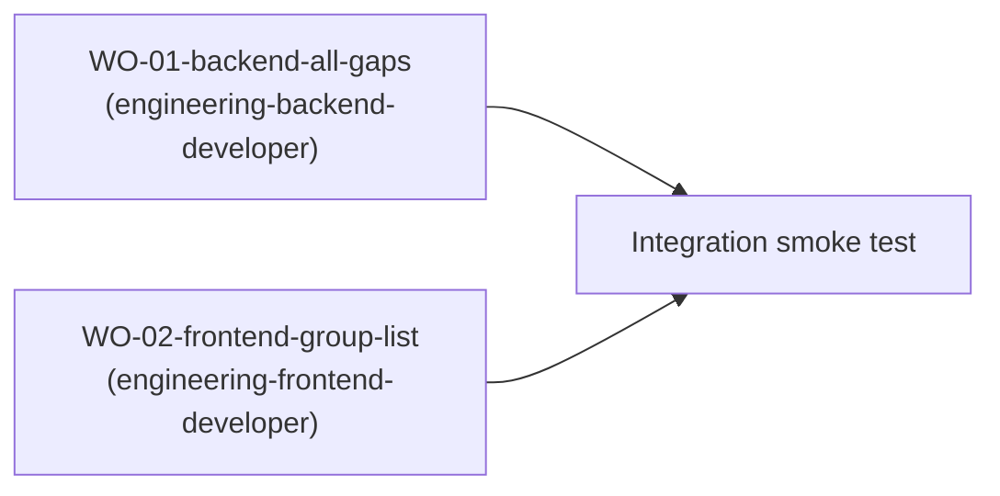

# F-002 Scope Expansion — Solution Design Plan

## Summary

Fix 4 scope-expansion gaps in the existing `UserGroup` domain (M-001 F-002) that were identified during reopen triage. The approach is a **single-wave, two-developer** plan: one backend developer applies all 4 gaps (API path prefix, lock endpoint, org-unit data scope, missing permissions) and one frontend developer updates the Group List UI. Key trade-off: `organizationId` on `UserGroup` is stored as UUID (not BIGINT as the BA spec's legacy schema suggests) to align with the project's UUID-predominant identity architecture (`GroupRepository.java:27` — `JpaRepository<UserGroup, UUID>`). Admin Cục data scope is enforced in the service layer via `SecurityUtils` role check, not via `@DataScope` AOP, to keep the filtering logic co-located with the paginated query.

## System Boundaries

| Service/Module | Responsibility | Owns | Calls | Exposes |
|---|---|---|---|---|
| `group` (M-001 F-002) | UserGroup CRUD, member mgmt, permissions, lock/unlock, history | `UserGroup`, `GroupMember`, `GroupHistory`, `GroupFunction` | `OrgUnitCacheService` (resolve org names), `GroupRepository` (persistence) | `GET/POST/PUT/PATCH/DELETE /api/v1/groups/*` |
| `config` (RolePermissionSeeder) | AuthZ permission registration | `Permission` records, `Role.permissions` | `permissionRepository`, `roleRepository` | startup seed + upsert |
| `orgunit` | Org unit directory | `OrgUnit`, `OrgUnitCacheService` | `OrgUnitRepository` | `getName(UUID)` cache |
| `frontend` (GroupList) | UI list + create/edit/delete/perm modals | `GroupList.tsx`, `groupService.ts` | `/api/v1/groups/*` | React page at `/groups` |

## Integration Model

| Integration | Type | Contract | Timeout | Retry | Idempotent |
|---|---|---|---|---|---|
| GroupController ↔ OrgUnitCacheService | sync method call | `getName(UUID) → String` | N/A (in-process) | N/A | read-only, yes |
| GroupList ↔ REST API | HTTP/JSON | `design/00-design-plan.md#api-contracts` | 5s (FE default) | 1 on network error | GET: yes; POST/PUT/PATCH: idempotent-key |
| GroupController ↔ GroupRepository | JPA | Spring Data repository methods | transaction timeout | tx rollback | write: keyed by PK |

## API Contracts

> **Canonical source for all endpoint paths, request/response shapes, and authZ rules.** Backend WO-01 and Frontend WO-02 cite anchors below.

### Endpoint paths (post-expansion)

| Method | Path | AuthZ | Description |
|---|---|---|---|
| GET | `/api/v1/groups` | JWT (data scope in service) | Paginated list with search, filter, org-scope |
| GET | `/api/v1/groups/{id}` | JWT | Group detail with org name |
| POST | `/api/v1/groups` | `group:create` | Create group (org context) |
| PUT | `/api/v1/groups/{id}` | `group:edit` | Update group (orgId + code read-only) |
| PATCH | `/api/v1/groups/{id}/lock` | `group:lock` | Toggle ACTIVE↔INACTIVE |
| DELETE | `/api/v1/groups/{id}` | `group:delete` | Soft-delete group |
| POST | `/api/v1/groups/{id}/members` | `groupmember:manage` | Add member |
| DELETE | `/api/v1/groups/{groupId}/members/{userId}` | `groupmember:manage` | Remove member |
| GET | `/api/v1/groups/{id}/members` | JWT | List members (paginated) |
| GET | `/api/v1/groups/{id}/permissions` | `group:permission` | List assigned roles (renamed from /roles) |
| PUT | `/api/v1/groups/{id}/permissions` | `group:permission` | Replace role assignments (renamed from /roles) |
| POST | `/api/v1/groups/{id}/copy` | `group:copy` | Copy group |
| GET | `/api/v1/groups/{id}/history` | `group:history` | Change history |
| GET | `/api/v1/groups/{id}/history/paginated` | `group:history` | History paginated |

### PATCH /{id}/lock contract

**Request:** no body (empty).
**Response:** `ApiResponse<UserGroupResponse>` — updated group with toggled status.
**Action recorded:** `LOCK` (ACTIVE→INACTIVE) or `UNLOCK` (INACTIVE→ACTIVE) in `GroupHistory.notes`.
**Errors:**
- 404 if group not found
- 403 if user lacks `group:lock`
- 409 if group already in target state (idempotent — return current state)

### Request/Response shape changes

#### CreateUserGroupRequest (add `organizationId`)

```java
@NotNull(message = "Đơn vị không được để trống")
private UUID organizationId;  // NEW — required
```

#### UpdateUserGroupRequest (add `organizationId` — ignored)

```java
private UUID organizationId;  // NEW — accepted but ignored (read-only per BA §10.7)
```

#### UserGroupResponse (add `organizationId` + `organizationName`)

```java
UUID organizationId;      // NEW
String organizationName;  // NEW — resolved via OrgUnitCacheService
```

#### GroupResponse (add `organizationId` + `organizationName`)

```java
UUID organizationId;      // NEW
String organizationName;  // NEW
```

### Data scope contract

| Caller role | Behavior |
|---|---|
| `ROLE_SYSTEM_ADMIN` (Admin Cục) | Sees ALL groups across all org units — no filtering |
| All other roles | Filtered to `UserGroup.organizationId = currentUser.organizationId` |

The current user's `organizationId` is resolved from the `Authentication` principal's user entity in `UserGroupService.list()` and `findMyGroups()`.

## Data Architecture

| Entity | Owner | Storage | Pre-existing `organizationId` | Migration needed |
|---|---|---|---|---|
| `UserGroup` | `group` | `user_groups` table | **No** — absent today | `ALTER TABLE user_groups ADD COLUMN organization_id UUID` |
| `GroupHistory` | `group` | `group_histories` table | No — no change | None (action constants extended: LOCK, UNLOCK) |
| `Permission` | `config` | `permissions` table | No — seed-time only | `group:lock` + `group:read` seeded at startup |

### Flyway migration

```sql
-- V20260805120000__add_organization_id_to_user_groups.sql
ALTER TABLE user_groups ADD COLUMN IF NOT EXISTS organization_id UUID;
CREATE INDEX IF NOT EXISTS idx_user_groups_organization_id ON user_groups(organization_id);
```

### OrgUnitCacheService integration

`organizationName` in responses is populated via `orgUnitCacheService.getName(organizationId)` in `UserGroupService.toGroupResponse()` — matching the pattern already used by M-002 port services (`workspace_memory: AM-407bf41218709cfd`).

## Security

| Concern | Control |
|---|---|
| Auth — lock endpoint | `@PreAuthorize("@auth.check(authentication, 'group:lock')")` — matches existing pattern at `GroupController.java:93` |
| Auth — read detail | No `@PreAuthorize` (same as existing GET /{id}); data scope by service |
| PII / secrets | `organizationId` is a UUID — no PII exposure |
| Trust boundary | No new external integrations; `OrgUnitCacheService` is in-process |
| Data scope (org isolation) | Enforced in `UserGroupService.list()` — filter by `organizationId` unless `ROLE_SYSTEM_ADMIN` |
| Missing permissions | `group:lock` + `group:read` registered in `RolePermissionSeeder` both `run()` and `upsertMissingPermissions()` |

### Permission assignments

| Permission | ROLE_SYSTEM_ADMIN | ROLE_ADMIN | ROLE_LEADER | ROLE_SPECIALIST | Others |
|---|---|---|---|---|---|
| `group:lock` | ✅ (all) | ✅ | ✅ | — | — |
| `group:read` | ✅ (all) | ✅ | ✅ | ✅ | ✅ |

`ROLE_SYSTEM_ADMIN` gets all permissions automatically (existing pattern at `RolePermissionSeeder.java:174`).

## Deployment

| Change | Impact | Rollback |
|---|---|---|
| Flyway V20260805120000 | ADD COLUMN — zero-downtime (PostgreSQL) | No rollback needed; column nullable by default |
| API path `/api/groups` → `/api/v1/groups` | **BREAKING** — FE updated simultaneously (same wave) | Revert both FE+BE |
| New entries in `permissions` table | Auto-seeded at startup via `upsertMissingPermissions()` | Manual DELETE from `permissions` |
| `PUT /{id}/roles` → `PUT /{id}/permissions` | **BREAKING** — FE updated simultaneously | Revert both FE+BE |

**Feature flag:** none needed — this is a scope expansion, not a kill-switch candidate.

## NFR Architecture

| NFR-ref | Solution | Target | Trade-off |
|---|---|---|---|
| Performance (BA §9.1) | `organizationId` index on `user_groups`; cache org names via `OrgUnitCacheService` | <500ms with <1000 groups | Cache invalidation needed on org unit mutation |
| Security (BA §9.3) | Every endpoint has `@PreAuthorize` or service-level data scope | No unauthorized access | Service-level scope is not declarative — needs integration test |
| Reliability (BA §9.4) | GroupHistory writes are synchronous (same transaction) | Audit trail never lost | Minor latency increase on lock/unlock |

## Key Decisions

| Decision | Chosen | Rejected | Rationale |
|---|---|---|---|
| `organizationId` data type | `UUID` | `BIGINT` (BA spec legacy) | All project IDs are UUID — `GroupRepository` extends `JpaRepository<UserGroup, UUID>` |
| Lock endpoint HTTP method | `PATCH` | `PUT` | BA spec §7 specifies `PATCH`; partial state change (only status toggled) |
| Admin Cục scope check location | `UserGroupService.list()` | `@DataScope` AOP | AOP filters post-query; service-layer filtering integrates with paginated `searchAndFilter()` query |
| Org name resolution | `OrgUnitCacheService.getName()` | JPQL JOIN | Cached, matches established M-002 pattern, avoids N+1 |
| `PUT /{id}/roles` → `PUT /{id}/permissions` rename | Rename BOTH path AND `@PreAuthorize` | Rename path only | BA §10.11 popup title is "Phân quyền"; endpoint should reflect domain language |

---

## Requirement-to-Execution Mapping

| BA AC | Covered by | Owner |
|---|---|---|
| AC-002-15 (Khóa nhóm) | Gap 1 — `PATCH /lock` endpoint + GroupHistory LOCK action | WO-01 |
| AC-002-16 (Mở khóa nhóm) | Gap 1 — same endpoint, UNLOCK action | WO-01 |
| AC-002-01 (Tạo nhóm — organizationId required) | Gap 2 — `organizationId` in CreateUserGroupRequest | WO-01 |
| AC-002-10 (Chỉnh sửa — code, orgId read-only) | Gap 2 — `organizationId` ignored in update | WO-01 |
| AC-002-08 (Xem list — org scope filtering) | Gap 3 — Admin Cục vs regular user filter | WO-01 |
| AC-002-14 (Xem chi tiết — org name display) | Gap 2 — `organizationName` in Response DTOs | WO-01 |
| BR-002-04 (Ghi nhận lịch sử LOCK/UNLOCK) | Gap 1 — GroupHistory action = LOCK/UNLOCK | WO-01 |
| UI §10.6 (Đơn vị column in list) | Gap 2 — organizationName in list response → WO-02 renders column | WO-02 |
| UI §10.7 (TreeSelect for Đơn vị in create form) | Gap 2 — organizationId → TreeSelect | WO-02 |
| UI §10.7 (Code read-only in edit mode) | Gap 2 — form field disabled when editing | WO-02 |
| UI §10.11 (Phân quyền popup — permissions path) | Gap 1 — `/v1/groups/{id}/permissions` | WO-02 |

## Task Breakdown

| Task | Description | Dependency | Owner type | Wave | Parallelizable |
|---|---|---|---|---|---|
| WO-01-backend-all-gaps | All 4 backend gaps: API v1 prefix, lock endpoint, organizationId, Admin Cục scope, missing permissions, Flyway migration | None | `engineering-backend-developer` | 1 | ✅ parallel with WO-02 |
| WO-02-frontend-group-list | Frontend: update API paths, TreeSelect for org, code read-only, organizationName column | None (runs against updated BE API) | `engineering-frontend-developer` | 1 | ✅ parallel with WO-01 |

> **Wave 1:** Both tasks run independently. WO-02 develops against the API contract defined in this design; BE deploy not required for FE to start.

---

## Work Orders

### WO-01-backend-all-gaps

- **goal:** All 4 backend gaps applied: API path `/api/v1/groups`, PATCH lock endpoint, UUID `organizationId` with org-scope filtering via `OrgUnitCacheService`, and `group:lock` + `group:read` permissions seeded.
- **assignee-role:** engineering-backend-developer
- **complexity:** novel
- **files:**
  - `src/main/java/com/hanghai/kchtg/group/controller/GroupController.java` — change `@RequestMapping("/api/groups")` to `"/api/v1/groups"`; rename `GET /{id}/roles` → `GET /{id}/permissions` and `PUT /{id}/roles` → `PUT /{id}/permissions`; add `PATCH /{id}/lock` endpoint with `@PreAuthorize("@auth.check(authentication, 'group:lock')")`.
  - `src/main/java/com/hanghai/kchtg/group/entity/UserGroup.java` — add `@Column(name = "organization_id") private UUID organizationId;`
  - `src/main/java/com/hanghai/kchtg/group/entity/GroupHistory.java` — no Java change needed (action is free-form VARCHAR); document that LOCK/UNLOCK are new action values.
  - `src/main/java/com/hanghai/kchtg/group/dto/CreateUserGroupRequest.java` — add `@NotNull(message = "Đơn vị không được để trống") private UUID organizationId;`
  - `src/main/java/com/hanghai/kchtg/group/dto/CreateGroupRequest.java` — add `private UUID organizationId;` (legacy path; used by GroupService.create())
  - `src/main/java/com/hanghai/kchtg/group/dto/UpdateUserGroupRequest.java` — add `private UUID organizationId;` (accepted but ignored)
  - `src/main/java/com/hanghai/kchtg/group/dto/UpdateGroupRequest.java` — add `private UUID organizationId;` (legacy path)
  - `src/main/java/com/hanghai/kchtg/group/dto/UserGroupResponse.java` — add `UUID organizationId;` and `String organizationName;` to constructor and `from()` factory
  - `src/main/java/com/hanghai/kchtg/group/dto/GroupResponse.java` — add `UUID organizationId;` and `String organizationName;`
  - `src/main/java/com/hanghai/kchtg/group/service/UserGroupService.java` — update `list()`, `findMyGroups()`, `create()`, `update()`, `findById()` to set/get `organizationId`; add `OrgUnitCacheService` dependency; add `lockGroup(UUID id, UUID operatorId, String operatorName)` method; add `toGroupResponse()` helper that resolves `organizationName` via cache; add Admin Cục data-scope check (`SecurityUtils.isAdminCuc()`) in `list()` and `findMyGroups()`.
  - `src/main/java/com/hanghai/kchtg/group/service/GroupService.java` — update `create()` and `update()` to handle `organizationId` from request DTOs; add `OrgUnitCacheService` dependency for response mapping.
  - `src/main/java/com/hanghai/kchtg/group/repository/GroupRepository.java` — add `Page<UserGroup> searchAndFilter(...)` overload with `@Param("organizationId") UUID organizationId` parameter and `AND (:organizationId IS NULL OR g.organizationId = :organizationId)` clause. Update existing queries.
  - `src/main/java/com/hanghai/kchtg/config/RolePermissionSeeder.java` — in BOTH `run()` and `upsertMissingPermissions()`: add `seedPermission("group:lock", "Khóa/Mở khóa nhóm người dùng")` and `seedPermission("group:read", "Xem chi tiết nhóm người dùng")`. Add `group:lock` and `group:read` to `ROLE_ADMIN` and `ROLE_LEADER` permission lists. Add `group:read` to `ROLE_SPECIALIST`, `ROLE_PORT_OPERATOR`, `ROLE_PUBLIC_USER`.
  - `src/main/resources/db/migration/V20260805120000__add_organization_id_to_user_groups.sql` — NEW: `ALTER TABLE user_groups ADD COLUMN IF NOT EXISTS organization_id UUID; CREATE INDEX IF NOT EXISTS idx_user_groups_organization_id ON user_groups(organization_id);`
- **contracts:**
  - API paths: `design/00-design-plan.md#endpoint-paths-post-expansion`
  - PATCH /lock: `design/00-design-plan.md#patch-idlock-contract`
  - Request/Response shapes: `design/00-design-plan.md#requestresponse-shape-changes`
  - Data scope: `design/00-design-plan.md#data-scope-contract`
  - Permission assignments: `design/00-design-plan.md#permission-assignments`
- **conventions:**
  - Follow existing `@PreAuthorize("@auth.check(...)")` pattern for new endpoints (not `hasAuthority()`)
  - Set `organizationId` on entity during `create()`; ignore it during `update()` (per BA §10.7)
  - Follow `OrgUnitCacheService.getName()` pattern from M-002 services
  - GroupHistory action values for lock: `"LOCK"`, unlock: `"UNLOCK"` (capitalized to match existing `"CREATED"`, `"UPDATED"`, etc.)
  - Seed `group:lock` + `group:read` in BOTH `run()` AND `upsertMissingPermissions()` — identical seedPermission calls
- **acceptance:**
  - AC-002-01: Create group with `organizationId` → success; without → 400
  - AC-002-10: Edit group with `organizationId` in payload → ignored (field unchanged)
  - AC-002-15: PATCH lock on ACTIVE group → INACTIVE, `LOCK` in GroupHistory
  - AC-002-16: PATCH lock on INACTIVE group → ACTIVE, `UNLOCK` in GroupHistory
  - AC-002-08: Admin Cục list → all groups; regular user list → only their org unit's groups
  - Missing permissions: `group:lock` + `group:read` appear in `permissions` table after startup
- **verify:**
  - `cd . && mvn clean compile -q` — zero compilation errors
  - Check `GET /api/v1/groups` returns paginated list with `organizationId` + `organizationName` per item
  - Check `PATCH /api/v1/groups/{id}/lock` toggles status and records LOCK/UNLOCK in `group_histories`
  - Check regular user sees only their org unit's groups
- **done-when:** `mvn clean compile -q` exits 0 AND manual verification of at least 3 of 4 gaps via curl/Postman (or integration test if one exists).

### WO-02-frontend-group-list

- **goal:** Frontend GroupList page updated: API calls use `/api/v1/groups`, TreeSelect for organizationId in create form, code field read-only in edit, organizationName displayed in list and detail modals, permissions path updated to `/permissions`.
- **assignee-role:** engineering-frontend-developer
- **complexity:** novel
- **files:**
  - `frontend/src/services/groupService.ts` — update ALL API paths from `/groups` to `/v1/groups`; add `PATCH /v1/groups/{id}/lock` method; rename `getRoles()` → `getPermissions()`, `updateRoles()` → `updatePermissions()`, and their paths from `/roles` to `/permissions`; add `lock(groupId: string): Promise<Group>` method; add `organizationId` + `organizationName` to `Group` interface; add `organizationId` to `CreateGroupPayload` and `UpdateGroupPayload`.
  - `frontend/src/pages/groups/GroupList.tsx` — add `organizationId` TreeSelect field to create/edit modal (required in create, disabled in edit); disable `code` field in edit mode (read-only per BA §10.7); add `organizationName` column to DataTable (after "Mã nhóm" column); add lock/unlock action button in `rowActions` (toggles label between "Khóa nhóm" and "Mở khóa nhóm"); update permission modal calls from `getRoles/updateRoles` to `getPermissions/updatePermissions`.
  - `frontend/src/pages/groups/GroupForm.tsx` — (if reused separately) same TreeSelect + code read-only logic.
- **contracts:**
  - API paths: `design/00-design-plan.md#endpoint-paths-post-expansion`
  - Field controls: `feature-brief.md` §10.7 — Đơn vị (TreeSelect, read-only when editing), Mã nhóm (read-only when editing)
  - Token & style: `AGENTS.md` UI Theme Convention; use `TreeSelect` from `antd` for org unit; `colors`/`tokens` imports for consistent styling; `OrgTreeSelect` component if one exists in `components/`
- **conventions:**
  - Read `frontend/src/theme.ts` and `frontend/src/tokens.ts` before coding — NO hardcoded colors/spacing
  - Use existing `FilterBar`, `DataTable`, `ScreenHeader` from `components/list-view/`
  - Follow existing `GroupList.tsx` patterns: `usePermissionStore`, `toast`, `confirm` modals
  - `organizationId` → TreeSelect: load org unit tree from `orgUnitService` if available; otherwise use `Select` with data fetched from backend `/api/v1/org-units`
- **acceptance:**
  - UI §10.6: Đơn vị column visible in list table (shows `organizationName`)
  - UI §10.7: Create form has TreeSelect for Đơn vị (required); Edit form: Đơn vị + Mã nhóm are disabled (read-only)
  - UI §10.7: Lock/Unlock button in row actions (label toggles based on status)
  - PATCH /lock: after confirm Modal → group status toggles, toast shown, list refreshes
  - Permissions path: calls now go to `/v1/groups/{id}/permissions` (not `/roles`)
- **verify:**
  - `cd frontend && npx tsc --noEmit` — zero TypeScript errors
  - Manual: create group with TreeSelect → success; edit → organizationId + code disabled; lock/unlock → status toggles
- **done-when:** `npx tsc --noEmit` exits 0 AND manual smoke test of create/edit/lock flow passes.

---

## Execution Sequence



Both WOs run in parallel (Wave 1). WO-02 develops against the API contract defined in this document — the backend deploy is not required for the frontend developer to start coding.

## Implementation Risks

| Risk | Likelihood | Impact | Mitigation |
|---|---|---|---|
| `organizationId` NULL on existing rows causes filter gaps | Medium | Low | Migration adds column nullable; existing groups visible to everyone until assigned org; Admin Cục sees all anyway |
| `@RequestMapping` prefix change breaks non-group endpoints | Low | High | Only `GroupController` changed; no cross-controller prefix sharing |
| Frontend TreeSelect component needs org unit data endpoint | Medium | Medium | Fall back to `Select` with `/api/v1/org-units` if TreeSelect or org unit tree API not available |

## Developer Guidance

### Backend (WO-01)
- Add `OrgUnitCacheService` as constructor dependency in `UserGroupService` — inject via `@RequiredArgsConstructor` (project standard)
- `toGroupResponse()` helper creates both `UserGroupResponse` and `GroupResponse` with `organizationName` resolved: `orgUnitCacheService.getName(entity.getOrganizationId())`
- Data scope check: `SecurityUtils.getCurrentUser().getOrganizationId()` for non-Admin-Cục callers; pass `null` as `organizationId` param to query when caller is Admin Cục
- `searchAndFilter()` query: add `AND (:organizationId IS NULL OR g.organizationId = :organizationId)` to the WHERE clause
- Lock endpoint: `@PreAuthorize("@auth.check(authentication, 'group:lock')")` (follows existing pattern at `GroupController.java:93`); write `GroupHistory` entry with action=`"LOCK"`/`"UNLOCK"` after status toggle

### Frontend (WO-02)
- API prefix: replace ALL `/groups` → `/v1/groups` in `groupService.ts` (search for `/groups` — replace every occurrence)
- TreeSelect for org unit: if `OrgUnitTreeSelect` component exists in `frontend/src/components/`, use it; otherwise use `antd` `TreeSelect` with data fetched from org unit API
- Lock action: add to `rowActions` array conditionally (`hasPerm('group:lock')`); show "Khóa nhóm người dùng" when `record.status === 'active'`, "Mở khóa nhóm người dùng" when `record.status === 'inactive'`
- Edit mode: check `editingGroup !== null` → disable `code` field and `organizationId` field via `disabled` prop

## Migration / Rollout / Rollback Notes

- **Migration:** `V20260805120000` runs on deploy — ADD COLUMN is non-blocking in PostgreSQL. Existing groups get NULL `organization_id`; assign via DB admin or UI edit.
- **Rollout:** Deploy backend first (Flyway runs, `upsertMissingPermissions()` seeds new perms), then frontend. Both can go out together if frontend is deployed immediately after backend.
- **Rollback:** Deploy previous backend JAR (no schema revert needed — new column is harmless), deploy previous frontend bundle.

## Open Execution Questions

- **TreeSelect data source:** Does a reusable `OrgUnitTreeSelect` component exist in `frontend/src/components/`? If not, WO-02 developer should check if `/api/v1/org-units` tree endpoint exists. [CẦN BỔ SUNG: Confirm org unit tree API availability before WO-02 dispatch.]
- **Existing `organization_id` columns:** Are there existing `organization_id` columns in `user_groups` from a prior incomplete migration? Developer should check `\d user_groups` before running migration.

## Execution Readiness Verdict

- Design complete for all 4 gaps
- Two work orders cover all ACs with traceable contracts
- `implementations.yaml` services[] already populated for M-001 (`docs/modules/M-001-quan-tri-he-thong/implementations.yaml:1-4`)
- **Ready for dispatch** — one wave, two parallel developers
