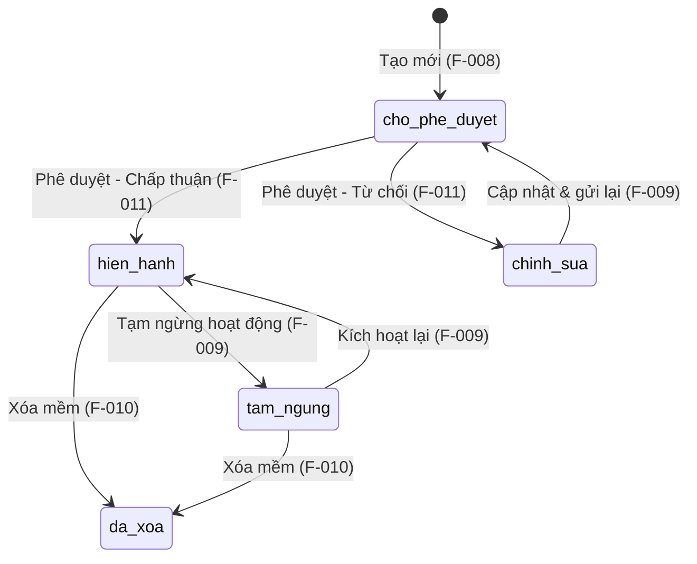

# Quản lý Cảng biển - Tạo mới

## Summary

Hệ thống quản lý tài sản KCHTGT hàng hải chưa có cơ chế số hóa việc đăng ký cảng biển theo chuẩn VN-36, dẫn đến rủi ro sai sót dữ liệu và khó tổng hợp báo cáo trên phạm vi quốc gia. Tính năng này cho phép người dùng có thẩm quyền nhập mới một Cảng biển vào hệ thống với đầy đủ thông tin mã số, tên, vị trí địa lý và thuộc tính kỹ thuật theo chuẩn dữ liệu quốc gia, kèm xác thực hợp lệ trước khi lưu. Thành công khi mỗi Cảng biển được lưu chính xác vào CSDL với trạng thái "Chờ phê duyệt", không có bản ghi trùng lặp mã cảng, và ghi nhật ký đầy đủ.

## Scope

| | Items |
|---|---|
| In scope | Biểu mẫu tạo mới Cảng biển với các trường thông tin cơ bản và mở rộng; Kiểm tra tính hợp lệ của mã cảng theo chuẩn VN-36; Kiểm tra trùng lặp mã cảng trong cơ sở dữ liệu; Lưu bản ghi với trạng thái mặc định "Chờ phê duyệt"; Thông báo kết quả thành công / lỗi cho người dùng; Ghi nhật ký tạo mới (audit log) |
| Out of scope | Quy trình phê duyệt Cảng biển (F-011); Cập nhật thông tin Cảng biển sau khi tạo (F-009); Xóa Cảng biển (F-010); Tích hợp API với hệ thống cơ sở dữ liệu cảng quốc gia; Nhập/Xuất dữ liệu Cảng biển hàng loạt |
| Assumptions | Mã cảng VN-36 là chuẩn mã hóa quốc gia áp dụng cho cảng biển Việt Nam; Hệ thống đã có cơ chế xác thực / phân quyền người dùng trước khi đến tính năng này; CSDL PostgreSQL hỗ trợ ràng buộc unique trên cột ma_cang |

## Domain Model

### Aggregate Root: CangBien

F-008 là tính năng gốc (aggregate root) của module M-002 — định nghĩa thực thể CangBien mà tất cả các tính năng khác trong module (F-009 Cập nhật, F-010 Xóa, F-011 Phê duyệt, F-012 Xem, F-013 Lịch sử) đều tham chiếu hoặc mở rộng.

| Thuộc tính | Kiểu dữ liệu | Ràng buộc | Mô tả |
|---|---|---|---|
| id | UUID | PK, auto-generated | Định danh duy nhất toàn hệ thống |
| maCang | string | UNIQUE, NOT NULL, 6-10 ký tự alphanumeric, uppercase | Mã cảng theo chuẩn VN-36 — khóa nghiệp vụ bất biến |
| tenCang | string | NOT NULL | Tên chính thức của Cảng biển |
| tinhThanh | string | NOT NULL | Tỉnh/thành phố nơi cảng tọa lạc |
| toDo | JSON `{lat, lng}` | lat ∈ [-90, 90], lng ∈ [-180, 180] | Tọa độ GPS của cảng |
| dienTich | decimal | > 0, ≤ 5000, đơn vị km² | Diện tích khu vực cảng |
| khaNangTiepNhanTau | string | Optional | Mô tả khả năng tiếp nhận tàu (trọng tải, loại tàu) |
| trangThai | enum | NOT NULL, default = `cho_phe_duyet` | Trạng thái vòng đời: `cho_phe_duyet`, `hien_hanh`, `tam_ngung`, `da_xoa` |
| ghiChu | text | Optional | Ghi chú bổ sung |
| createdAt | timestamp | Auto-generated, immutable | Thời điểm tạo bản ghi |
| updatedAt | timestamp | Auto-updated | Thời điểm cập nhật gần nhất |

### Lifecycle State Transitions

### Invariants

| # | Invariant | Nguồn | Cơ chế bảo vệ |
|---|---|---|---|
| I-001 | `maCang` là bất biến sau khi tạo — không API nào được phép cập nhật trường này | BR-001, feature-brief Entities | Backend validation: bỏ qua hoặc từ chối payload chứa maCang khác; UI: trường read-only ở chế độ cập nhật |
| I-002 | `trangThai` mặc định khi tạo mới luôn là `cho_phe_duyet` — người tạo không thể tự đặt `hien_hanh` | BR-004, AC-002 | Server-side ghi đè: bất kể payload gửi lên, trạng thái luôn được set = `cho_phe_duyet` khi INSERT |
| I-003 | `maCang` duy nhất trên toàn hệ thống — không tồn tại hai Cảng biển có cùng mã | BR-001, AC-003 | UNIQUE constraint tại DB + kiểm tra tồn tại trước INSERT ở tầng service |
| I-004 | Tọa độ GPS phải nằm trong phạm vi địa lý hợp lệ | BR-002 | Validation server-side bắt buộc |
| I-005 | `createdAt` do hệ thống tự sinh, không được phép người dùng thiết lập | AC-002 | Server-side set `createdAt = now()` khi INSERT, bỏ qua giá trị từ payload |

## User Stories

| US-ID | Actor | Goal | Value | Priority |
|---|---|---|---|---|
| US-001 | Chuyên viên (A-003) | Tạo mới một Cảng biển với đầy đủ thông tin bắt buộc | Đăng ký chính thức cảng biển vào hệ thống quản lý tài sản quốc gia | Must Have |
| US-002 | Chuyên viên (A-003) | Nhận thông báo lỗi rõ ràng khi mã cảng đã tồn tại | Tránh trùng lặp dữ liệu, bảo vệ tính toàn vẹn của CSDL | Must Have |
| US-003 | Quản trị hệ thống (A-001) | Truy cập chức năng tạo mới Cảng biển tương tự Chuyên viên | Cho phép quản trị viên can thiệp khi cần thiết | Must Have |
| US-004 | Chuyên viên (A-003) | Xem phản hồi xác thực theo từng trường ngay khi nhập liệu | Giảm thiểu lỗi nhập liệu, tăng tốc độ nhập dữ liệu | Should Have |

## Acceptance Criteria

| AC-ID | US-ref | Scenario | Given / When / Then | Constraints |
|---|---|---|---|---|
| AC-001 | US-001, US-003 | Truy cập chức năng tạo mới thành công | Given người dùng đã đăng nhập với vai trò Chuyên viên hoặc Quản trị hệ thống; When truy cập menu "Quản lý tài sản > Cảng biển > Tạo mới"; Then hệ thống hiển thị biểu mẫu tạo mới Cảng biển | Chỉ Chuyên viên (A-003) và Quản trị hệ thống (A-001) có quyền; Người dùng khác nhận HTTP 403 |
| AC-002 | US-001 | Lưu thành công khi đủ trường bắt buộc | Given biểu mẫu đã điền đầy đủ: mã cảng (hợp lệ VN-36, chưa tồn tại), tên cảng, tỉnh thành phố, tọa độ GPS (vĩ độ, kinh độ), diện tích (km²), trạng thái hoạt động; When người dùng nhấn "Lưu"; Then hệ thống lưu bản ghi mới với trạng thái "Chờ phê duyệt", ghi nhận createdAt tự động, trả về thông báo thành công | Trạng thái mặc định = cho_phe_duyet bất kể người dùng chọn gì; createdAt không được phép người dùng chỉnh sửa |
| AC-003 | US-002 | Từ chối khi mã cảng đã tồn tại | Given mã cảng nhập vào đã có trong CSDL; When người dùng nhấn "Lưu"; Then hệ thống trả về lỗi HTTP 409 kèm thông báo rõ ràng "Mã cảng [X] đã tồn tại trong hệ thống", không tạo bản ghi mới | Kiểm tra unique phải là server-side; thông báo lỗi hiển thị ở trường mã cảng |
| AC-004 | US-004 | Xác thực từng trường bắt buộc khi bỏ trống | Given biểu mẫu còn trường bắt buộc trống; When người dùng nhấn "Lưu"; Then hệ thống hiển thị thông báo lỗi tại từng trường tương ứng, không gửi request lên server | Xác thực client-side (front-end) trước; server-side validation là tuyến phòng thủ thứ hai |
| AC-005 | US-004 | Xác thực định dạng mã cảng VN-36 | Given mã cảng nhập vào không đúng định dạng VN-36 (6-10 ký tự); When người dùng rời khỏi trường hoặc nhấn "Lưu"; Then hệ thống hiển thị lỗi "Mã cảng phải có định dạng VN-36 (6-10 ký tự)" | Pattern: [A-Z0-9]{6,10} — cần làm rõ thêm với chủ đầu tư; tạm thời giả định uppercase alphanumeric |
| AC-006 | US-004 | Xác thực khoảng tọa độ GPS hợp lệ | Given vĩ độ nhập ngoài [-90, 90] hoặc kinh độ ngoài [-180, 180]; When người dùng rời khỏi trường hoặc nhấn "Lưu"; Then hệ thống hiển thị lỗi cụ thể cho từng trường tọa độ | Server-side validation bắt buộc để tránh dữ liệu sai vào CSDL |
| AC-007 | US-001 | Từ chối người dùng không có quyền | Given người dùng đăng nhập với vai trò Lãnh đạo hoặc Người dùng tại Cảng hoặc Public; When truy cập URL tạo mới Cảng biển; Then hệ thống trả về HTTP 403 Forbidden | Phân quyền dựa trên role: chỉ A-001, A-003 có quyền CREATE |

## Business Rules

| BR-ID | Rule | Applies to | Exception |
|---|---|---|---|
| BR-001 | Mã cảng phải tuân thủ chuẩn mã hóa VN-36, độ dài từ 6 đến 10 ký tự alphanumeric, không phân biệt hoa-thường (lưu theo uppercase), duy nhất trên toàn hệ thống | AC-002, AC-003, AC-005 | Không có ngoại lệ; mã cảng là khóa nghiệp vụ bất biến |
| BR-002 | Tọa độ GPS (vĩ độ, kinh độ) phải nằm trong khoảng chấp nhận: vĩ độ -90 đến 90, kinh độ -180 đến 180; giá trị số thực chính xác tới 6 chữ số thập phân | AC-006 | Không có ngoại lệ; tọa độ sai sẽ làm hỏng biểu đồ GIS |
| BR-003 | Diện tích cảng phải là giá trị dương, đơn vị km², không vượt quá 5000 km² | AC-002 | Nếu diện tích chưa xác định chính thức thì nhập tạm giá trị 0 và ghi rõ trong trường ghi chú |
| BR-004 | Trạng thái mặc định của Cảng biển sau khi tạo mới luôn là "Chờ phê duyệt" (cho_phe_duyet); người tạo không được tự thiết lập trạng thái "Hiện hành" | AC-002, AC-007 | Không có ngoại lệ; chỉ quy trình phê duyệt (F-011) mới đổi trạng thái |
| BR-005 | Mỗi hành động tạo mới Cảng biển phải được ghi vào bảng audit log: actor, thời gian, dữ liệu trước/sau, IP nguồn | AC-002 | Ngay cả khi tạo thất bại do lỗi ứng dụng, vẫn ghi log thất bại |
| BR-006 | Chỉ người dùng có vai trò Chuyên viên (A-003) hoặc Quản trị hệ thống (A-001) được phép tạo mới Cảng biển | AC-001, AC-007 | Quản trị hệ thống (A-001) có toàn quyền kể cả khi đơn vị tổ chức không phù hợp |

## Non-Functional Requirements

| Area | Requirement | Target |
|---|---|---|
| Performance | API tạo mới Cảng biển phải trả kết quả (thành công hoặc lỗi) trong thời gian chấp nhận được | ≤ 2 giây với tải trong bình thường (< 100 người dùng đồng thời) |
| Security | Kiểm tra phân quyền server-side trên mọi request; dữ liệu nhập phải được sanitize để ngăn SQL injection và XSS; HTTPS bắt buộc | Không có request nào bypass phân quyền; OWASP Top 10 compliance |
| Reliability | Hệ thống phải đảm bảo tính nhất quán dữ liệu khi có lỗi xảy ra ở giữa quá trình tạo mới | Transaction atomicity: nếu bất kỳ bước nào thất bại (lưu bản ghi, ghi log), rollback toàn bộ |
| Audit/Logging | Ghi nhật ký đầy đủ mỗi hành động tạo mới Cảng biển bao gồm actor, thời gian UTC, dữ liệu được tạo, IP nguồn | 100% coverage; log phải được giữ tối thiểu 2 năm theo quy định nhà nước |
| Operability | API endpoint phải có health check và trả về lỗi có cấu trúc (error code + message) để DevOps giám sát | Lỗi server trả về HTTP 4xx/5xx với JSON body chuẩn; không lộ stack trace ra bên ngoài |

## Test Scenarios

| TS-ID | AC-ref | Scenario | Type |
|---|---|---|---|
| TS-001 | AC-001 | Chuyên viên đăng nhập và truy cập biểu mẫu tạo mới thành công | Acceptance |
| TS-002 | AC-007 | Người dùng không có quyền (Lãnh đạo) nhận 403 khi truy cập | Security / Negative |
| TS-003 | AC-002 | Điền đầy đủ trường bắt buộc hợp lệ, lưu thành công, kiểm tra CSDL có bản ghi mới với trạng thái cho_phe_duyet | Integration |
| TS-004 | AC-003 | Nhập mã cảng đã tồn tại, hệ thống trả về lỗi 409 và thông báo đúng trường | Integration / Negative |
| TS-005 | AC-004 | Bỏ trống trường tên cảng, nhấn Lưu, kiểm tra lỗi hiển thị tại trường tên cảng | UI / Negative |
| TS-006 | AC-005 | Nhập mã cảng 5 ký tự (quá ngắn), kiểm tra lỗi định dạng | Unit / Negative |
| TS-007 | AC-005 | Nhập mã cảng 11 ký tự (quá dài), kiểm tra lỗi định dạng | Unit / Negative |
| TS-008 | AC-006 | Nhập vĩ độ = 91 (ngoài khoảng hợp lệ), kiểm tra lỗi xác thực | Unit / Negative |
| TS-009 | AC-006 | Nhập kinh độ = -181 (ngoài khoảng hợp lệ), kiểm tra lỗi xác thực | Unit / Negative |
| TS-010 | AC-002 | Kiểm tra audit log được ghi sau khi tạo Cảng biển thành công | Integration |
| TS-011 | AC-007 | Gửi POST request không có JWT token, kiểm tra 401 Unauthorized | Security / Negative |
| TS-012 | AC-002 | Diện tích nhập giá trị âm, kiểm tra lỗi xác thực BR-003 | Unit / Negative |

## Pipeline Triage

| Question | Answer | Rationale |
|---|---|---|
| Domain model affected? | Yes — now formalized | Tạo mới Aggregate Root CangBien chưa tồn tại trong hệ thống. Phase 2 (Domain Analysis) đã hoàn thành với tài liệu này: entity CangBien, lifecycle state transitions, và 5 invariants đã được định nghĩa chính thức. |
| Architecture affected? | Yes | Cần thiết kế REST endpoint mới, database table mới (cang_bien), audit log mechanism, RBAC permission mới (CANG_BIEN_CREATE) |
| Implementation clear? | No | Chưa có SA artifacts cho M-002; cần SA quyết định pattern (REST resource naming, transaction boundary, permission seed) |
| **Verdict** | `Ready for solution architecture` | Domain model đã được formalized (Phase 2 hoàn thành). SA cần quyết định các vấn đề kỹ thuật: REST endpoint, DB schema, permission seed, transaction pattern. |
