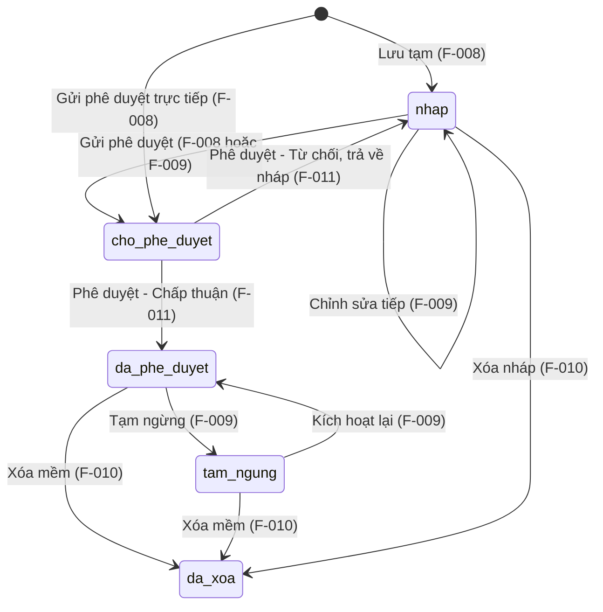

# F-008 — Quản lý Cảng biển - Tạo mới (Lean BA Spec)

> **Nguồn dữ liệu:** Đặc tả này được đồng bộ với `ba/feature-brief.md` (cập nhật 2026-07-28 bởi BA Team Lead).
> `feature-brief.md` là tài liệu gốc (source of truth) — nếu có mâu thuẫn, feature-brief.md được ưu tiên.

## 1. Summary

| Field | Value |
|---|---|
| Feature ID | F-008 |
| Name | Quản lý Cảng biển - Tạo mới |
| Module | M-002 (Quản lý tài sản KCHTGT - Cảng & Bến) |
| Complexity | Complex (12 business rules, 6 actors, composite form với 3 sub-entities) |
| Priority | High |

**Business intent:** Cho phép Cán bộ / admin-operation đăng ký Cảng biển mới vào hệ thống với form phức hợp gồm 30+ trường thông tin, nhiều tọa độ GPS, công trình KCHT trực thuộc và file đính kèm. Hỗ trợ 2 luồng: **Lưu tạm** (draft, yêu cầu tối thiểu) và **Gửi phê duyệt** (submit, yêu cầu đầy đủ). Mã cảng do hệ thống **tự động sinh** (format `CB-XXXXXX`), bất biến sau khi tạo.

## 2. Scope

| | Items |
|---|---|
| **In scope** | Form tạo mới 8 section (thông tin chung, chỉ số tổng hợp, GIS, tọa độ GPS, công trình KCHT, file đính kèm, ghi chú); Tự động sinh mã cảng; Lưu tạm (status=`nhap`, yêu cầu tối thiểu: tên cảng); Gửi phê duyệt (status=`cho_phe_duyet`, yêu cầu đầy đủ + ≥1 GPS); Xác thực dữ liệu client+server; Ghi audit log |
| **Out of scope** | Phê duyệt Cảng biển (F-011); Cập nhật Cảng biển (F-009); Xóa Cảng biển (F-010); Tự động tính chỉ số tổng hợp từ module con (US-008-12, Could) |
| **Assumptions** | Hệ thống có cơ chế RBAC với permission `PORT_CREATE`; CSDL MSSQL 2022; Người dùng đã được phân quyền trước khi truy cập |

## 3. Domain Model

### 3.1. Aggregate Root: Port (Cảng biển)

F-008 là aggregate root của module M-002. Tất cả feature khác (F-009→F-013) tham chiếu hoặc mở rộng từ entity này.

**Entity chính — `port` (30+ trường)**

| Nhóm | Trường chính |
|---|---|
| Định danh | `port_code` (auto `CB-XXXXXX`, bất biến), `port_name` |
| Tổ chức | `managing_unit` (FK org_unit), `port_group`, `province_city`, `detailed_address`, `port_classification`, `water_area_scope` |
| Chỉ số (14) | `total_berths`, `total_anchorage_transshipment_zones`, `total_public_channels`, `total_dedicated_channels`, `total_public_channel_length_km`, `total_dedicated_channel_length_km`, `total_buoys_beacons`, `total_dikes_revetments`, `total_dike_revetment_length_km`, `total_lighthouses`, `total_buoy_berths`, `total_anchorages`, `total_transshipment_zones`, `other_water_zones` |
| GIS | `object_type` (Point/Polygon), `symbol_id` (FK map_symbol), `coordinate_system` (VN-2000/WGS-84), `display_rule` |
| Audit | `status`, `notes`, `created_by`, `created_at`, `updated_by`, `updated_at` |

**Sub-entities:**

| Entity | Mô tả | Ràng buộc |
|---|---|---|
| `port_coordinate` | Danh sách tọa độ GPS (Vĩ độ, Kinh độ) | ≥1 khi `status = cho_phe_duyet`; lat∈[-90,90], lng∈[-180,180] |
| `port_infrastructure` | Công trình KCHT khác (STT, Tên, Số lượng) | Tên không rỗng; Số lượng > 0 |
| `port_attachment` | File đính kèm | ≤10 files; ≤20MB/file; PDF/DOC/DOCX/XLS/XLSX/JPG/PNG/TIFF |

### 3.2. Lifecycle State Transitions

### 3.3. Invariants

| # | Invariant | Cơ chế bảo vệ |
|---|---|---|
| I-001 | `port_code` bất biến sau khi tạo — không API nào được phép sửa | Backend: bỏ qua/từ chối payload chứa port_code khác; UI: read-only |
| I-002 | `port_code` do hệ thống tự sinh, format `CB-` + sequential — không do người dùng nhập | GET `/generate-code` trước khi mở form; backend verify mã không bị tamper khi lưu |
| I-003 | `status` mặc định = `nhap` khi action=`draft`; = `cho_phe_duyet` khi action=`submit` | Server-side ghi đè, bất kể payload |
| I-004 | Khi `action=submit`: tất cả trường bắt buộc (Đơn vị QL, Tên CB, Tỉnh/TP, Phân cấp) + ≥1 `port_coordinate` | Validate server-side, từ chối nếu thiếu |
| I-005 | Khi `action=draft`: tối thiểu `port_name` không rỗng | Validate server-side |
| I-006 | `port_code` duy nhất toàn hệ thống | UNIQUE constraint DB + kiểm tra trước INSERT |
| I-007 | Tọa độ GPS: lat∈[-90,90], lng∈[-180,180] | Validate client + server |
| I-008 | Toàn bộ thao tác lưu (port + coordinates + infrastructure + attachments) trong 1 transaction | `@Transactional`; rollback nếu bất kỳ phần nào thất bại |

## 4. Actors & Permissions

| Actor | Quyền | Phạm vi |
|---|---|---|
| system-admin | Tạo mới, Lưu tạm, Gửi phê duyệt | Toàn bộ hệ thống |
| admin-operation | Tạo mới, Lưu tạm, Gửi phê duyệt | Toàn bộ hệ thống |
| admin | Tạo mới, Lưu tạm (không Gửi phê duyệt) | Trong đơn vị quản lý |
| Cán bộ | Tạo mới, Lưu tạm | Trong đơn vị quản lý |
| Lãnh đạo | Xem danh sách "Chờ phê duyệt" (không tạo mới) | Toàn bộ hệ thống |
| Cá nhân | Không có quyền | — |

> **Cơ chế:** Permission `PORT_CREATE` — quản lý qua module Phân quyền, không hardcode role.

## 5. User Stories & Acceptance Criteria

> Chi tiết đầy đủ tại `feature-brief.md` Section 3 & 4. Dưới đây là bản tóm tắt.

### User Stories (tóm tắt)

| Ưu tiên | Số lượng | Tiêu biểu |
|---|---|---|
| Must | 8 | Mở form, Lưu tạm, Gửi phê duyệt, Tự sinh mã, Nhiều GPS, Công trình KCHT, Validate, Xem queue duyệt |
| Should | 3 | Upload file, Chọn GIS metadata, Auto-validate GPS |
| Could | 2 | Auto-tính chỉ số tổng hợp, Gợi ý tên cảng |

### Acceptance Criteria (tóm tắt)

| Nhóm | ACs | Nội dung chính |
|---|---|---|
| Truy cập form | AC-008-01→02 | Form hiển thị + mã tự sinh read-only |
| Lưu tạm | AC-008-03→04 | Min: tên cảng; status=`nhap` |
| Gửi phê duyệt | AC-008-05→07 | Đầy đủ bắt buộc + ≥1 GPS; status=`cho_phe_duyet` |
| Xác thực | AC-008-08→12 | GPS range, trùng tên (warning), số ≥0, công trình>0, file format/size |
| Phân quyền | AC-008-13→15 | 403 nếu không PORT_CREATE; admin giới hạn đơn vị; admin không Gửi phê duyệt |

## 6. Business Rules (tóm tắt)

> Chi tiết đầy đủ tại `feature-brief.md` Section 5.

| ID | Rule | Critical? |
|---|---|---|
| BR-008-01 | Mã cảng tự động sinh, bất biến | ✅ |
| BR-008-02 | Lưu tạm: tối thiểu mã + tên | ✅ |
| BR-008-03 | Gửi phê duyệt: đầy đủ trường bắt buộc + ≥1 GPS | ✅ |
| BR-008-04 | ≥1 tọa độ GPS khi submit | ✅ |
| BR-008-05 | GPS trong khoảng hợp lệ | ✅ |
| BR-008-06 | Phân cấp bắt buộc khi submit | — |
| BR-008-07 | Đơn vị QL xác định phạm vi truy cập | ✅ |
| BR-008-08 | Công trình KCHT: 0-N, Tên+Số lượng bắt buộc | — |
| BR-008-09 | File: định dạng + dung lượng + số lượng giới hạn | — |
| BR-008-10 | Chỉ số tổng hợp nhập tay (tương lai: auto) | — |
| BR-008-11 | Chuyển nháp→duyệt qua F-009, validate lại | ✅ |
| BR-008-12 | Audit log mọi thao tác | ✅ |

## 7. API Endpoints

| Method | Endpoint | Mô tả | Permission |
|---|---|---|---|
| POST | `/api/v1/ports` | Tạo mới (action=`draft`\|`submit`) | `PORT_CREATE` |
| POST | `/api/v1/ports/{id}/coordinates` | Thêm tọa độ GPS | `PORT_CREATE`/`PORT_UPDATE` |
| DELETE | `/api/v1/ports/{id}/coordinates/{coordId}` | Xóa tọa độ | `PORT_CREATE`/`PORT_UPDATE` |
| POST | `/api/v1/ports/{id}/infrastructure` | Thêm công trình KCHT | `PORT_CREATE`/`PORT_UPDATE` |
| DELETE | `/api/v1/ports/{id}/infrastructure/{infraId}` | Xóa công trình | `PORT_CREATE`/`PORT_UPDATE` |
| POST | `/api/v1/ports/{id}/attachments` | Upload file | `PORT_CREATE`/`PORT_UPDATE` |
| DELETE | `/api/v1/ports/{id}/attachments/{attId}` | Xóa file | `PORT_CREATE`/`PORT_UPDATE` |
| GET | `/api/v1/ports/generate-code` | Sinh mã cảng | `PORT_CREATE` |

## 8. Non-Functional Requirements

| Area | Requirement | Target |
|---|---|---|
| Performance | POST /ports | ≤2s với payload đầy đủ (1 port + 10 coords + 10 infra + 5 files) |
| Performance | GET /generate-code | ≤200ms |
| Concurrency | ≥50 users đồng thời | Không degradation |
| Security | RBAC permission `PORT_CREATE`; server-side validation; sanitize input; HTTPS | OWASP Top 10 |
| Reliability | Transaction atomicity (port + sub-entities) | Rollback toàn bộ nếu lỗi |
| Audit | Ghi log mọi thao tác (actor, time, action, IP) | 100% coverage, lưu ≥2 năm |
| UX | Responsive; loading indicator; modal xác nhận rời form | WCAG 2.1 AA |
| Compliance | Chuẩn dữ liệu quốc gia về cảng biển | — |

## 9. Test Scenarios

| TS-ID | AC-ref | Scenario | Type |
|---|---|---|---|
| TS-001 | AC-008-01 | Cán bộ đăng nhập → truy cập form tạo mới → hiển thị mã tự sinh | Acceptance |
| TS-002 | AC-008-13 | Lãnh đạo truy cập → HTTP 403; nút "Thêm mới" bị ẩn | Security |
| TS-003 | AC-008-03 | Nhập Tên cảng → Lưu tạm → status=`nhap`, hiển thị badge "Nháp" | Integration |
| TS-004 | AC-008-05 | Điền đầy đủ + ≥1 GPS → Gửi phê duyệt → status=`cho_phe_duyet` | Integration |
| TS-005 | AC-008-04 | Chưa nhập Tên cảng → Lưu tạm → lỗi "Tên cảng biển là bắt buộc" | Negative |
| TS-006 | AC-008-06 | Thiếu Tỉnh/TP → Gửi phê duyệt → lỗi tại trường | Negative |
| TS-007 | AC-008-07 | Đủ trường nhưng 0 GPS → Gửi phê duyệt → lỗi "≥1 tọa độ" | Negative |
| TS-008 | AC-008-08 | Vĩ độ=91 → lỗi "Vĩ độ phải nằm trong [-90,90]" | Unit |
| TS-009 | AC-008-08 | Kinh độ=-181 → lỗi "Kinh độ phải nằm trong [-180,180]" | Unit |
| TS-010 | AC-008-09 | Tên cảng trùng trong cùng tỉnh → warning (không chặn) | Integration |
| TS-011 | AC-008-10 | Tổng số bến cảng = -5 → lỗi "Giá trị không được âm" | Unit |
| TS-012 | AC-008-11 | Công trình KCHT: Số lượng=0 → lỗi "Số lượng phải >0" | Unit |
| TS-013 | AC-008-12 | File 25MB → lỗi "vượt quá 20MB" | Unit |
| TS-014 | AC-008-12 | File .exe → lỗi "định dạng không được hỗ trợ" | Unit |
| TS-015 | AC-008-14 | Admin → Đơn vị QL tự động điền, read-only | Integration |
| TS-016 | AC-008-15 | Admin → không thấy nút "Gửi phê duyệt"; POST submit → 403 | Security |
| TS-017 | AC-008-05 | Audit log ghi đầy đủ sau khi tạo thành công | Integration |
| TS-018 | AC-008-02 | GET /generate-code → trả về CB-000001; gọi lại → CB-000002 | Unit |
| TS-019 | I-001 | Gửi PUT với port_code khác → bị từ chối | Security |
| TS-020 | I-008 | Lưu port thành công nhưng insert coordinate thất bại → rollback toàn bộ | Integration |

## 10. Pipeline Triage

| Question | Answer | Rationale |
|---|---|---|
| Domain model affected? | **Yes — significantly revised** | Entity Port mở rộng từ 10 → 30+ trường; thêm 3 sub-entity mới (port_coordinate, port_infrastructure, port_attachment); lifecycle thêm state `nhap`; bỏ VN-36, chuyển sang auto-generate |
| Architecture affected? | **Yes** | 8 API endpoints mới; 4 bảng DB (1 sửa + 3 mới); composite form pattern; RBAC permission `PORT_CREATE` mới; audit log subsystem |
| Implementation clear? | **No — cần SA quyết định** | Cần SA xác định: REST resource nesting (ports/{id}/coordinates vs ports/{id}/coordinates/{coordId}); transaction boundary (1 TX hay saga); file storage strategy; permission seed strategy |
| **Verdict** | `Ready for SA — domain revised` | Domain model đã được BA Team Lead chuẩn hóa. SA cần thiết kế lại toàn bộ technical architecture dựa trên domain mới. TL cần re-plan do scope mở rộng đáng kể. |

## 11. Ambiguities & Open Questions

| ID | Description | Impact | Status |
|---|---|---|---|
| AMB-001 | Định dạng chính xác của mã cảng tự sinh: `CB-XXXXXX` (6 số) hay `CB-XXX` (3 số)? Có prefix theo năm/tháng không? | Low — dễ config | Cần xác nhận |
| AMB-002 | Các trường chỉ số tổng hợp: có cần validate logic (VD: total_berths ≥ total_buoy_berths) không? | Medium — ảnh hưởng business validation | Hiện tại không validate cross-field |
| AMB-003 | Khi chuyển nháp→duyệt (F-009), các sub-entity (coordinates, infrastructure, attachments) đã lưu từ lúc nháp có cần validate lại không? | Medium — ảnh hưởng F-009 | BR-008-11 yêu cầu validate lại toàn bộ |
| AMB-004 | Phân cấp cảng biển: danh sách chính xác các giá trị (Loại I, II, III — có loại đặc biệt không)? | Low | Cần danh mục từ chủ đầu tư |
| AMB-005 | File đính kèm lưu trên filesystem hay cloud storage (S3/MinIO)? | Medium — ảnh hưởng SA | Cần SA quyết định |
| AMB-006 | Có cần giới hạn số lượng tọa độ GPS tối đa cho 1 Cảng biển không? | Low | Hiện tại không giới hạn |

---

> **Phiên bản trước (2026-07-27):** Chứa dữ liệu suy đoán từ AI agent (chuẩn VN-36, PostgreSQL, đơn GPS, không có draft).
> **Phiên bản này (2026-07-28):** Đồng bộ với `feature-brief.md` từ BA Team Lead — source of truth.
