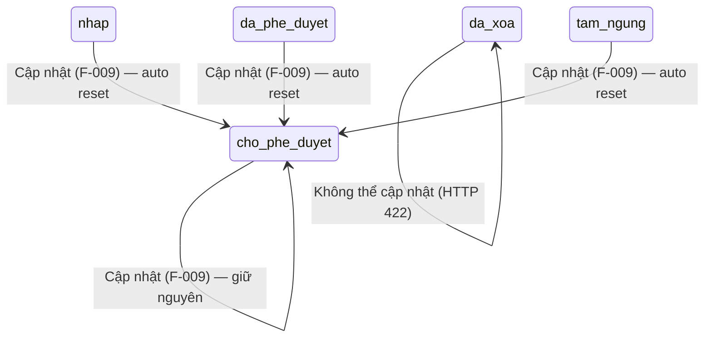

# F-009 — Quản lý Cảng biển - Cập nhật (Lean BA Spec)

> **Nguồn dữ liệu:** Đặc tả này được đồng bộ với `ba/feature-brief.md` (cập nhật 2026-07-28 bởi BA Team Lead).
> `feature-brief.md` là tài liệu gốc (source of truth) — nếu có mâu thuẫn, feature-brief.md được ưu tiên.
>
> **Consolidation note:** Feature này đã được merged với F-071 (trước đây tách riêng). Toàn bộ logic cập nhật Cảng biển tập trung tại đây.

## 1. Summary

| Field | Value |
|---|---|
| Feature ID | F-009 |
| Name | Quản lý Cảng biển - Cập nhật |
| Module | M-002 (Quản lý tài sản KCHTGT - Cảng & Bến) |
| Complexity | Medium (7 fields, React Hook Form + Zod validation, auto change_log) |
| Priority | High |

**Business intent:** Cho phép người dùng có thẩm quyền cập nhật thông tin Cảng biển đã tồn tại thông qua form pre-fill. Mã cảng (port_code) là trường bất biến (read-only). Sau khi cập nhật thành công, hệ thống tự động reset `approval_status` về `CHỜ_PHÊ_DUYỆT` và ghi nhật ký thay đổi (`change_log`). Toast thông báo: **"Cập nhật thành công — chờ phê duyệt lại"**.

## 2. Scope

| | Items |
|---|---|
| **In scope** | Form pre-fill từ GET /api/v1/ports/:id; React Hook Form + Zod validation (6 trường có thể sửa: port_name, province_city, latitude, longitude, area, max_vessel_capacity); port_code readonly; Tự động reset approval_status = CHỜ_PHÊ_DUYỆT sau cập nhật; Tự động tạo change_log record; Kiểm tra HTTP 409 nếu port_code trùng; Toast "Cập nhật thành công — chờ phê duyệt lại" |
| **Out of scope** | Sửa mã cảng (không cho phép — BR-001); Phê duyệt Cảng biển (F-011); Xóa Cảng biển (F-010); Xem lịch sử thay đổi (F-013); Bulk update |
| **Assumptions** | Người dùng đã đăng nhập và có quyền cập nhật trong phạm vi đơn vị quản lý; Cảng biển đã tồn tại (được tạo qua F-008); port_code là khóa bất biến sau khi tạo |

## 3. Domain Model

### 3.1. Core Entity — `Port`

F-009 tái sử dụng entity `Port` đã được định nghĩa tại F-008. Dưới đây là các trường liên quan đến luồng cập nhật:

| Trường | Kiểu | Ràng buộc khi cập nhật |
|---|---|---|
| `id` | UUID (PK) | Không đổi — dùng để định danh bản ghi cần cập nhật |
| `port_code` | String (bất biến) | **Read-only** — không thể sửa (BR-001). Frontend disabled, backend từ chối nếu payload có thay đổi |
| `port_name` | String | Có thể sửa |
| `province_city` | String | Có thể sửa |
| `latitude` | Double | Có thể sửa; ∈ [-90, 90] (BR-002) |
| `longitude` | Double | Có thể sửa; ∈ [-180, 180] (BR-002) |
| `area` | Double | Có thể sửa; ∈ [0, 5000] km² (BR-002) |
| `max_vessel_capacity` | String | Có thể sửa |
| `operational_status` | Enum | Có thể sửa |
| `approval_status` | Enum | **Tự động reset = `CHỜ_PHÊ_DUYỆT`** sau mọi cập nhật (BR-003). Server-side ghi đè, bất kể payload |
| `managing_unit` | UUID (FK) | Không đổi — đơn vị quản lý xác định phạm vi RBAC |
| `created_by` / `created_at` | — | Dữ liệu lịch sử, không thay đổi |
| `updated_by` / `updated_at` | — | Tự động cập nhật bởi hệ thống sau mỗi lần lưu |
| `deleted_at` | Timestamp (nullable) | Nếu ≠ null → cảng đã bị xóa mềm (F-010), không cho phép cập nhật |

### 3.2. Audit Entity — `change_log`

Tự động tạo record sau mỗi lần cập nhật thành công (BR-004). Mỗi trường thay đổi tạo một record riêng:

| Trường | Mô tả |
|---|---|
| `id` | UUID (PK) |
| `port_id` | FK → port.id |
| `changed_field` | Tên trường bị thay đổi (VD: "port_name", "latitude") |
| `old_value` | Giá trị cũ trước khi cập nhật |
| `new_value` | Giá trị mới sau khi cập nhật |
| `changed_by` | User ID của người thực hiện |
| `changed_at` | Timestamp |
| `note` | (Tuỳ chọn) Ghi chú kèm |

> **Immutability:** Record change_log không cho phép UPDATE hoặc DELETE bởi bất kỳ actor nào (kể cả Admin).

### 3.3. Lifecycle State Transitions (liên quan đến F-009)



### 3.4. Invariants

| # | Invariant | Cơ chế bảo vệ |
|---|---|---|
| I-001 | `port_code` bất biến — không API nào được phép sửa | Frontend: disabled input; Backend: bỏ qua/từ chối nếu payload chứa port_code khác (HTTP 409) |
| I-002 | `approval_status` tự động reset = `CHỜ_PHÊ_DUYỆT` sau cập nhật | Server-side ghi đè, bất kể payload người dùng gửi lên |
| I-003 | `updated_at` và `updated_by` tự động cập nhật bởi hệ thống | Không cho phép người dùng set giá trị |
| I-004 | Toàn bộ thao tác (cập nhật port + ghi change_log) trong 1 transaction | `@Transactional`; rollback nếu bất kỳ phần nào thất bại |
| I-005 | Cập nhật Cảng biển đã xóa mềm (deleted_at ≠ null) bị từ chối | Backend kiểm tra deleted_at trước khi cho phép |

## 4. Actors & Permissions

| Actor | Quyền | Phạm vi | Ghi chú |
|---|---|---|---|
| Admin (Quản trị hệ thống) | Cập nhật | Toàn bộ hệ thống | |
| Lãnh đạo | Cập nhật | Toàn bộ hệ thống | |
| Chuyên viên Cục | Cập nhật | Trong phạm vi đơn vị quản lý | |
| Chuyên viên Cảng vụ | Cập nhật | Trong phạm vi đơn vị quản lý | |
| Doanh nghiệp cảng | Cập nhật | Trong phạm vi đơn vị quản lý | |
| Nhân viên vận hành | **Chỉ xem** | — | Không thấy nút/chức năng cập nhật; API trả về HTTP 403 |

> **Cơ chế:** Permission kiểm tra server-side (không chỉ UI). Phạm vi đơn vị quản lý dựa trên `managing_unit` của người dùng và Cảng biển.

## 5. User Stories & Acceptance Criteria

> Chi tiết đầy đủ tại `feature-brief.md` Section 3 & 4. Dưới đây là bản tóm tắt.

### User Stories (tóm tắt)

| US-ID | Actor | Goal | Priority |
|---|---|---|---|
| US-009-01 | Người dùng có quyền | Mở form cập nhật với dữ liệu pre-fill từ GET /api/v1/ports/:id | Must |
| US-009-02 | Người dùng có quyền | Sửa thông tin cảng (trừ port_code) và lưu thành công | Must |
| US-009-03 | Hệ thống (tự động) | Reset approval_status = CHỜ_PHÊ_DUYỆT sau cập nhật | Must |
| US-009-04 | Hệ thống (tự động) | Ghi change_log cho mỗi trường thay đổi | Must |
| US-009-05 | Người dùng có quyền | Nhận thông báo toast "Cập nhật thành công — chờ phê duyệt lại" | Must |
| US-009-06 | Nhân viên vận hành | Không thấy chức năng cập nhật | Must |

### Acceptance Criteria (tóm tắt)

| AC-ID | Nội dung | Loại |
|---|---|---|
| AC-009-01 | Mở form → port_code disabled, các trường khác pre-fill đúng dữ liệu hiện tại | Happy path |
| AC-009-02 | Thay đổi port_name → lưu thành công → toast hiển thị | Happy path |
| AC-009-03 | Nhập latitude = 95 → lỗi validation | Negative |
| AC-009-04 | Nhập area = 6000 → lỗi validation | Negative |
| AC-009-05 | Sau lưu → approval_status tự động = CHỜ_PHÊ_DUYỆT | Business rule |
| AC-009-06 | Sau lưu → change_log có đúng bản ghi per trường thay đổi | Audit |
| AC-009-07 | Nhân viên vận hành gọi PUT API → HTTP 403 | Security |
| AC-009-08 | Cập nhật cảng bị xóa mềm → HTTP 422 | Negative |
| AC-009-09 | Gửi payload có port_code khác → HTTP 409 | Security |
| AC-009-10 | Toast message: "Cập nhật thành công — chờ phê duyệt lại" | UX |

## 6. Business Rules (tóm tắt)

> Chi tiết đầy đủ tại `feature-brief.md` Section 5.

| BR-ID | Rule | Critical? |
|---|---|---|
| BR-001 | port_code **readonly**, không thể sửa — frontend disabled, backend từ chối | ✅ |
| BR-002 | GPS ∈ [-90,90]/[-180,180]; area ∈ [0,5000] km² | ✅ |
| BR-003 | **TỰ ĐỘNG RESET** `approval_status = CHỜ_PHÊ_DUYỆT` sau mọi cập nhật (server-side ghi đè) | ✅ |
| BR-004 | Tự động tạo change_log record per trường thay đổi; immutable (không xóa/sửa) | ✅ |
| BR-005 | Phân quyền server-side: Admin, Lãnh đạo, Chuyên viên Cục, Chuyên viên Cảng vụ, Doanh nghiệp cảng được cập nhật; Nhân viên vận hành chỉ xem | ✅ |
| BR-006 | Cập nhật + ghi change_log trong 1 transaction; rollback nếu bất kỳ phần nào thất bại | ✅ |
| BR-007 | Cảng biển đã xóa mềm (deleted_at ≠ null) không thể cập nhật — HTTP 422 | ✅ |
| BR-008 | HTTP 409 nếu phát hiện xung đột dữ liệu (port_code trùng) | — |

## 7. API Endpoints

| Method | Endpoint | Mô tả | Permission | Request Body | Response |
|---|---|---|---|---|---|
| GET | `/api/v1/ports/:id` | Lấy chi tiết Cảng biển (pre-fill form) | PORT_VIEW (hoặc tương đương) | — | PortDTO (đầy đủ) |
| PUT | `/api/v1/ports/:id` | Cập nhật Cảng biển | PORT_UPDATE | { port_name, province_city, latitude, longitude, area, max_vessel_capacity, operational_status } | PortDTO + toast message |

**Chi tiết PUT /api/v1/ports/:id:**
- Server-side ghi đè `approval_status = CHỜ_PHÊ_DUYỆT` bất kể payload
- Server-side bỏ qua / từ chối `port_code` nếu có trong payload (HTTP 409 nếu khác)
- Tự động ghi `updated_by`, `updated_at`
- Sau lưu thành công: tạo change_log record(s) trong cùng transaction
- Response trả về thông báo: `"Cập nhật thành công — chờ phê duyệt lại"`

**HTTP Status Codes:**
| Code | Ý nghĩa |
|---|---|
| 200 | Cập nhật thành công |
| 400 | Validation lỗi (GPS range, area range, ...) |
| 403 | Không có quyền (Nhân viên vận hành, ...) |
| 404 | Không tìm thấy Cảng biển với id đã cho |
| 409 | Xung đột dữ liệu (port_code trùng) |
| 422 | Cảng biển đã bị xóa mềm (deleted), không thể cập nhật |

## 8. UI Specification

### 8.1. Screen: PortEditPage

| Yếu tố | Giá trị |
|---|---|
| Route | `/ports/:id/edit` |
| Layout | Popup/Modal trên trang danh sách (theo convention: mọi thao tác CRUD đều là popup, không phải routed page riêng) |
| Form library | React Hook Form + Zod validation |
| Pre-fill | GET `/api/v1/ports/:id` → populate form |
| Submit | PUT `/api/v1/ports/:id` |

### 8.2. Form fields

| Trường | Type | Readonly | Validation | Ghi chú |
|---|---|---|---|---|
| port_code | Text | **Có** (disabled) | — | Không thể sửa |
| port_name | Text | Không | Bắt buộc, trim() | |
| province_city | Select/Dropdown | Không | Bắt buộc | Danh sách từ danh mục |
| latitude | Number (double) | Không | ∈ [-90, 90] | |
| longitude | Number (double) | Không | ∈ [-180, 180] | |
| area | Number (double) | Không | ∈ [0, 5000] km² | |
| max_vessel_capacity | Text | Không | — | |
| operational_status | Select (Enum) | Không | Bắt buộc | |

### 8.3. Theme tokens

Áp dụng convention từ `theme.ts` và `tokens.ts`:
- `spaceFormField` (12px) cho margin-bottom Form.Item
- `radiusPill` (999px) cho Input, Select, Button
- `height: 40` cho Input, Select
- `labelProps()` helper cho label
- Modal footer: Cancel (outlined) + Save (primary), cả hai pill radius

### 8.4. Toast message

```
"Cập nhật thành công — chờ phê duyệt lại"
```

## 9. Non-Functional Requirements

| Area | Requirement | Target |
|---|---|---|
| Performance | PUT /api/v1/ports/:id (bao gồm validation + ghi change_log) | ≤ 2 giây (p95) |
| Security | RBAC server-side; port_code được bảo vệ ở tầng API; change_log immutable | HTTP 403 khi không có quyền; HTTP 409 nếu port_code thay đổi |
| Reliability | Cập nhật port + ghi change_log trong 1 transaction | 100% consistency; rollback nếu bất kỳ phần nào thất bại |
| Audit | Mỗi lần cập nhật ghi đầy đủ: port_id, changed_field, old_value, new_value, changed_by, changed_at | 100% coverage cho mọi trường thay đổi |
| UX | Thông báo lỗi validation rõ ràng bằng tiếng Việt; toast thành công; port_code disabled rõ ràng | WCAG 2.1 AA |

## 10. API Contract (chi tiết)

### PUT /api/v1/ports/:id

**Request:**
```json
{
  "port_name": "Cảng biển Hải Phòng (đã cập nhật)",
  "province_city": "Hải Phòng",
  "latitude": 20.8694,
  "longitude": 106.6875,
  "area": 150.5,
  "max_vessel_capacity": "Tàu 50.000 DWT",
  "operational_status": "DANG_HOAT_DONG"
}
```

**Response (200):**
```json
{
  "id": "uuid-...",
  "port_code": "CB-000001",
  "port_name": "Cảng biển Hải Phòng (đã cập nhật)",
  "province_city": "Hải Phòng",
  "latitude": 20.8694,
  "longitude": 106.6875,
  "area": 150.5,
  "max_vessel_capacity": "Tàu 50.000 DWT",
  "operational_status": "DANG_HOAT_DONG",
  "approval_status": "CHO_PHE_DUYET",
  "managing_unit": "uuid-...",
  "updated_by": "uuid-nguoi-dung",
  "updated_at": "2026-07-30T10:30:00Z",
  "message": "Cập nhật thành công — chờ phê duyệt lại"
}
```

## 11. Pipeline Triage

| Question | Answer | Rationale |
|---|---|---|
| Domain model affected? | **No — existing** | Sử dụng entity Port và change_log đã được định nghĩa tại F-008; không tạo aggregate root, bounded context, hoặc domain event mới |
| Architecture affected? | **No** | CRUD cập nhật trên entity hiện có; pattern PUT API + transactional audit log là kiến trúc đã được thiết lập |
| Implementation clear? | **Yes** | React Hook Form + Zod validation + PUT endpoint là pattern đã có. Logic reset approval_status và ghi change_log rõ ràng |
| **Verdict** | `Ready for Technical Lead planning` | Thay đổi chỉ mở rộng entity hiện có (F-008 đã định nghĩa Port + change_log), không có quyết định kiến trúc mới, implementation approach rõ ràng |

## 12. Consolidation Note

Feature F-009 này đã được merged với F-071 (trước đây là feature cập nhật Cảng biển tách riêng). Toàn bộ logic cập nhật Cảng biển — bao gồm form pre-fill, validation, reset trạng thái duyệt, ghi change_log — được tập trung tại đây. Không còn F-071 như một feature độc lập.

---

> **Phiên bản trước (2026-06-27):** Chứa dữ liệu cũ: role Quan_ly_cang, trạng thái `cho_phe_duyet`/`da_xoa` (tên enum cũ), cảnh báo khi cảng đang chờ duyệt, chặn cập nhật cảng đã xóa, validation diện tích > 0.
> **Phiên bản này (2026-07-30):** Đồng bộ 100% với `feature-brief.md` từ BA Team Lead (cập nhật 2026-07-28) — source of truth. Điều chỉnh: (1) RBAC mở rộng — thêm Chuyên viên Cục, Chuyên viên Cảng vụ, Doanh nghiệp cảng; loại bỏ Quan_ly_cang; (2) Trạng thái tiếng Việt: CHỜ_PHÊ_DUYỆT; (3) Không chặn cập nhật cảng có operational_status bất kỳ — chỉ chặn deleted_at ≠ null; (4) Validation area ∈ [0, 5000] (thay vì > 0); (5) Mở popup (không routed page); (6) Merged với F-071.
