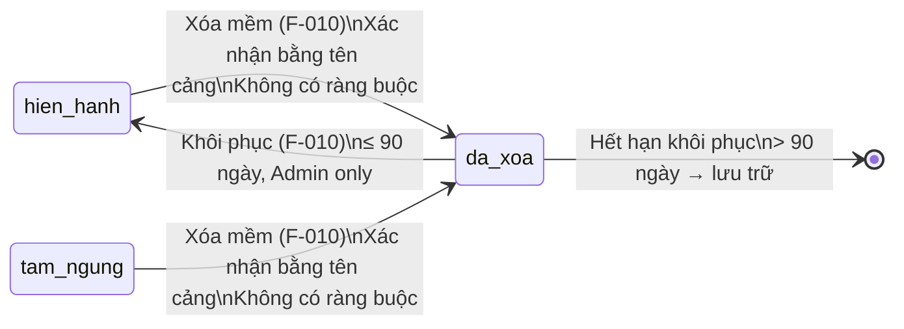

# Quản lý Cảng biển - Xóa

## Summary

> **Consolidation note:** Tính năng này đã được merged với F-093. Toàn bộ nội dung lean-spec dưới đây phản ánh spec hợp nhất của cả hai feature.

Tính năng cho phép người dùng có thẩm quyền (Admin hoặc Lãnh đạo) xóa mềm một Cảng biển khỏi hệ thống KCHTGT hàng hải sau khi xác nhận bằng tên cảng (hoặc gõ "XÓA") và kiểm tra ràng buộc dữ liệu liên quan. Cơ chế soft delete bảo tồn dữ liệu lịch sử, phục vụ kiểm toán và báo cáo thống kê, đồng thời cho phép khôi phục trong vòng 90 ngày. Thành công khi luồng xóa chạy đúng với kiểm tra quyền, kiểm tra ràng buộc, ghi nhật ký và cập nhật trạng thái hiển thị danh sách.

## Scope

| | Items |
|---|---|
| In scope | Giao diện xác nhận xóa (nhập tên cảng); kiểm tra ràng buộc dữ liệu liên quan; kiểm tra trạng thái phê duyệt; soft delete (đánh dấu da_xoa, ghi deleted_at/deleted_by); ghi nhật ký xóa; ẩn khỏi danh sách mặc định; khôi phục trong 90 ngày |
| Out of scope | Hard delete khỏi DB; xóa hàng loạt; cascade delete dữ liệu liên quan; luồng phê duyệt xóa bởi cấp cao hơn (F-011); xuất báo cáo lịch sử xóa |
| Assumptions | "Dữ liệu liên quan chưa xử lý" bao gồm: Bến cảng (berth), Vùng nước (water_zone), lịch sử vận hành đang ở trạng thái active; quyền xóa chỉ dành cho Admin và Lãnh đạo (ROLE_ADMIN, ROLE_LEADER), Chuyên viên Cục/Cảng vụ/Doanh nghiệp cảng KHÔNG có quyền xóa; thời hạn khôi phục mặc định 90 ngày theo quy định lưu trữ hồ sơ hạ tầng |

## Domain Model

### Aggregate Root Reference: port (F-008)

F-010 mở rộng Aggregate Root port đã được định nghĩa tại F-008 — không tạo entity hay bounded context mới. Tính năng này bổ sung hai thuộc tính và mở rộng vòng đời trạng thái với soft-delete.

| Thuộc tính bổ sung | Kiểu dữ liệu | Ràng buộc | Mô tả |
|---|---|---|---|
| deleted_at | timestamp | nullable, default = NULL | Thời điểm xóa mềm; NULL khi đang hoạt động |
| deleted_by | UUID | nullable, default = NULL | ID người dùng thực hiện xóa; NULL khi đang hoạt động |

### Soft-Delete Lifecycle State Transitions

### Pre-Delete Gates

Trước khi thực hiện xóa, hệ thống kiểm tra tuần tự các điều kiện sau. Nếu bất kỳ gate nào thất bại, toàn bộ thao tác bị từ chối:

| Gate | Điều kiện | Khi thất bại |
|---|---|---|
| G-01 — Phân quyền | User có role Admin (ROLE_ADMIN) hoặc Lãnh đạo (ROLE_LEADER) | HTTP 403 — không hiển thị nút xóa |
| G-02 — Trạng thái phê duyệt | port.status ≠ cho_phe_duyet | Từ chối: "Cảng biển đang chờ phê duyệt, không thể xóa" |
| G-03 — Tài sản con | Không có berth/water_zone ở trạng thái active | Hệ thống gọi GET /api/v1/ports/:id/children; nếu berth hoặc water_zone > 0 → HTTP 409 "Cảng này có X berth và Y water_zone liên kết, không thể xóa" |
| G-04 — Xác nhận danh tính | Người dùng nhập chính xác port_name (case-insensitive) hoặc gõ "XÓA" | "Tên cảng không khớp" — hộp thoại vẫn mở |

### Invariants

| # | Invariant | Nguồn | Cơ chế bảo vệ |
|---|---|---|---|
| I-001 | Soft delete only — không bao giờ DELETE vật lý bản ghi port | BR-001 | Backend chỉ SET deleted_at = now(), deleted_by = userId; không có DELETE statement |
| I-002 | Cảng biển có tài sản con (berth/water_zone) active không thể bị xóa | BR-002, AC-003 | GET /api/v1/ports/:id/children kiểm tra ràng buộc; HTTP 409 nếu còn liên kết |
| I-003 | Cảng biển đang chờ phê duyệt không thể bị xóa | BR-003, AC-004 | Gate G-02 chặn trước khi hiển thị hộp thoại |
| I-004 | Mọi hành động xóa (thành công / bị chặn / từ chối quyền) đều được ghi log | BR-006, AC-008 | Log ghi đồng bộ trong transaction; log immutable |
| I-005 | Khôi phục chỉ trong 90 ngày kể từ deleted_at; chỉ Admin được phép | BR-003, AC-006, AC-007 | Backend kiểm tra `deleted_at + 90 days > now()` và role = Admin |

## User Stories

| US-ID | Actor | Goal | Value | Priority |
|---|---|---|---|---|---|
| US-001 | Admin / Lãnh đạo | Xóa mềm một Cảng biển đã chấm dứt hoạt động | Duy trì danh sách cảng biển chính xác, tránh nhầm lẫn trong vận hành | Must Have |
| US-002 | Admin / Lãnh đạo | Được cảnh báo khi cảng còn dữ liệu liên quan chưa xử lý | Tránh xóa nhầm cảng còn đang khai thác hoặc có tài sản con | Must Have |
| US-003 | Admin | Khôi phục Cảng biển đã xóa trong thời hạn 90 ngày | Sửa sai lầm khi xóa nhầm mà không mất dữ liệu | Must Have |
| US-004 | Hệ thống / Kiểm toán | Ghi nhật ký đầy đủ thao tác xóa | Phục vụ kiểm toán, truy vết và báo cáo thống kê tài sản | Must Have |

## Acceptance Criteria

| AC-ID | US-ref | Scenario | Given / When / Then | Constraints |
|---|---|---|---|---|
| AC-001 | US-001 | Xóa thành công với quyền hợp lệ | Given: user có role Admin hoặc Lãnh đạo, Cảng biển không có dữ liệu liên quan chưa xử lý, không trong quá trình phê duyệt; When: user nhập đúng tên Cảng biển (hoặc gõ "XÓA") vào hộp thoại xác nhận và nhấn xác nhận; Then: hệ thống set deleted_at=now(), deleted_by=userId, cảng không hiển thị trong danh sách mặc định, hiển thị thông báo "Đã xóa thành công" | Tên nhập phải khớp chính xác (case-insensitive) với port_name hoặc là "XÓA" |
| AC-002 | US-001 | Từ chối xóa khi thiếu quyền | Given: user có role Chuyên viên Cục (ROLE_SPECIALIST) hoặc Chuyên viên Cảng vụ hoặc Doanh nghiệp cảng hoặc Nhân viên vận hành; When: user cố gắng truy cập chức năng xóa; Then: hệ thống trả về HTTP 403 / hiển thị thông báo không có quyền, không thực hiện bất kỳ thay đổi nào | RBAC kiểm tra tại API layer |
| AC-003 | US-002 | Chặn xóa khi còn dữ liệu liên quan | Given: Cảng biển có berth hoặc water_zone liên kết; When: user kích hoạt xóa; Then: hệ thống gọi GET /api/v1/ports/:id/children, trả về HTTP 409 "Cảng này có X berth và Y water_zone liên kết, không thể xóa", không thực hiện xóa | Kiểm tra trước khi hiển thị hộp thoại xác nhận |
| AC-004 | US-002 | Chặn xóa khi đang trong quá trình phê duyệt | Given: Cảng biển có status=cho_phe_duyet; When: user kích hoạt xóa; Then: hệ thống từ chối với thông báo cảng đang chờ phê duyệt, không hiển thị hộp thoại xác nhận | |
| AC-005 | US-001 | Từ chối khi nhập sai tên xác nhận | Given: hộp thoại xác nhận đang hiển thị; When: user nhập tên không khớp với port_name và cũng không phải "XÓA" rồi nhấn xác nhận; Then: hệ thống hiển thị lỗi "Tên cảng không khớp", không thực hiện xóa, hộp thoại vẫn mở | Không đếm số lần thử sai |
| AC-006 | US-003 | Khôi phục trong 90 ngày | Given: Cảng biển có status=da_xoa và deleted_at trong vòng 90 ngày; When: Admin thực hiện khôi phục; Then: status trở về hien_hanh, deleted_at và deleted_by được xóa, cảng hiển thị lại trong danh sách | Chỉ Admin có quyền khôi phục |
| AC-007 | US-003 | Từ chối khôi phục sau 90 ngày | Given: Cảng biển đã xóa quá 90 ngày; When: Admin cố khôi phục; Then: hệ thống thông báo hết thời hạn khôi phục, hướng dẫn liên hệ lưu trữ theo quy định | |
| AC-008 | US-004 | Ghi nhật ký đầy đủ | Given: bất kỳ thao tác xóa nào (thành công hoặc bị chặn); When: sự kiện xảy ra; Then: hệ thống ghi log với: userId, timestamp (UTC+7), action (DELETE_ATTEMPT / DELETE_SUCCESS / DELETE_BLOCKED), entityId, port_name, lý do chặn (nếu có) | Log không được xóa theo vòng đời tài sản |

## Business Rules

| BR-ID | Rule | Applies to | Exception |
|---|---|---|---|
| BR-001 | Soft delete bắt buộc — chỉ đặt status=da_xoa, ghi deleted_at và deleted_by; không được xóa bản ghi khỏi DB | US-001, AC-001 | Không có ngoại lệ |
| BR-002 | Kiểm tra ràng buộc trước xóa — gọi GET /api/v1/ports/:id/children; nếu berth hoặc water_zone > 0 → HTTP 409 "Cảng này có X berth và Y water_zone liên kết, không thể xóa" | US-002, AC-003 | |
| BR-003 | Kiểm tra trạng thái phê duyệt — Cảng biển có status=cho_phe_duyet không được phép xóa | US-002, AC-004 | |
| BR-004 | Xác nhận — người dùng phải nhập chính xác port_name (case-insensitive) hoặc gõ "XÓA" để xác nhận xóa | US-001, AC-001, AC-005 | |
| BR-005 | Thời hạn khôi phục 90 ngày — Cảng biển đã xóa có thể khôi phục trong 90 ngày kể từ deleted_at; sau đó chỉ xử lý theo quy định lưu trữ hồ sơ | US-003, AC-006, AC-007 | |
| BR-006 | Nhật ký xóa bắt buộc — ghi đầy đủ: userId, timestamp, loại hành động, entityId, port_name, và lý do chặn nếu bị từ chối | US-004, AC-008 | |
| BR-007 | Phân quyền xóa — CHỈ Admin (ROLE_ADMIN) và Lãnh đạo (ROLE_LEADER) mới có quyền xóa mềm; Chuyên viên Cục (ROLE_SPECIALIST), Chuyên viên Cảng vụ, Doanh nghiệp cảng, Nhân viên vận hành đều KHÔNG có quyền xóa | US-001, AC-002 | Khôi phục (US-003) chỉ Admin được phép |
| BR-008 | Ẩn khỏi danh sách mặc định — sau khi xóa, Cảng biển với status=da_xoa không được trả về trong query mặc định danh sách; chỉ hiển thị khi có filter tường minh | AC-001, AC-006 | |

## Non-Functional Requirements

| Area | Requirement | Target |
|---|---|---|
| Performance | API xóa phải hoàn thành trong giới hạn thời gian chấp nhận được | ≤ 2 giây cho kiểm tra ràng buộc + soft delete trên tập dữ liệu thông thường |
| Security | Kiểm tra quyền tại API layer (Spring Security @PreAuthorize); không bao giờ thực hiện xóa dựa vào kiểm tra phía client | RBAC: port:delete permission bắt buộc; log mọi attempt kể cả unauthorized |
| Reliability | Giao dịch xóa phải atomic — soft delete + ghi log trong cùng transaction; nếu log thất bại, rollback xóa | Tỷ lệ thành công ≥ 99.9% trên môi trường production |
| Audit/Logging | Mọi thao tác xóa (thành công, bị chặn, từ chối quyền) phải được ghi vào bảng log với đầy đủ trường theo BR-006 | Log không được phép bị xóa theo lifecycle tài sản; lưu trữ theo quy định hồ sơ KCHTGT |
| Operability | Danh sách Cảng biển đã xóa phải có thể tra cứu bởi Admin (filter theo status=da_xoa); API khôi phục phải tồn tại cho Admin | Giao diện quản trị hiển thị danh sách đã xóa với cột deleted_at, deleted_by |

## Test Scenarios

| TS-ID | AC-ref | Scenario | Type |
|---|---|---|---|
| TS-001 | AC-001 | Xóa thành công Cảng biển không có ràng buộc, nhập đúng tên, user Admin | Happy path - Integration |
| TS-002 | AC-002 | User ROLE_SPECIALIST (Chuyên viên Cục) gọi API xóa — nhận HTTP 403 | Security - Unit |
| TS-003 | AC-002 | User Nhân viên vận hành gọi API xóa — nhận HTTP 403 | Security - Unit |
| TS-004 | AC-003 | Xóa cảng có berth > 0 — HTTP 409 "Cảng này có X berth liên kết" | Negative - Integration |
| TS-005 | AC-003 | Xóa cảng có water_zone > 0 — HTTP 409 "Cảng này có Y water_zone liên kết" | Negative - Integration |
| TS-006 | AC-003 | Xóa cảng không có berth và water_zone — được phép | Edge case - Integration |
| TS-007 | AC-004 | Xóa cảng status=cho_phe_duyet — bị chặn | Negative - Unit |
| TS-008 | AC-005 | Nhập tên xác nhận sai — hộp thoại báo lỗi, không xóa | Negative - UI |
| TS-009 | AC-005 | Nhập tên xác nhận đúng (khác hoa/thường) — được chấp nhận | Edge case - UI |
| TS-010 | AC-006 | Admin khôi phục cảng đã xóa trong 90 ngày — thành công | Happy path - Integration |
| TS-011 | AC-007 | Admin khôi phục cảng đã xóa > 90 ngày — bị từ chối | Negative - Integration |
| TS-012 | AC-008 | Verify log ghi đúng userId, timestamp, entityId sau xóa thành công | Audit - Integration |
| TS-013 | AC-008 | Verify log ghi DELETE_BLOCKED khi xóa bị chặn do ràng buộc | Audit - Integration |
| TS-014 | AC-001 | Kiểm tra transaction rollback khi ghi log thất bại — status không đổi | Reliability - Integration |

## Pipeline Triage

| Question | Answer | Rationale |
|---|---|---|
| Domain model affected? | No — extends existing | Không tạo aggregate root mới; port đã tồn tại (F-008). Bổ sung thuộc tính deleted_at/deleted_by và mở rộng state machine với soft-delete path. Phase 2 (Domain Analysis) đã hoàn thành với tài liệu này: 4 pre-delete gates, 5 invariants, và soft-delete lifecycle được định nghĩa chính thức. |
| Architecture affected? | Yes | Thêm cột deleted_at, deleted_by vào schema; thêm soft-delete filter mặc định trên query; quyền xóa gắn với role Admin và Lãnh đạo (KHÔNG phải permission riêng); cần thiết kế API endpoint xóa + khôi phục, child guard GET /api/v1/ports/:id/children và transaction logic |
| Implementation clear? | No | Cần SA quyết định: cách implement soft-delete filter (Hibernate filter vs query interceptor), cách tích hợp log transaction, API contract cho khôi phục |
| **Verdict** | `Ready for solution architecture` | Domain model đã được formalized (Phase 2 hoàn thành). SA cần giải quyết: soft-delete filter pattern, transaction boundary, API contract cho khôi phục. |
