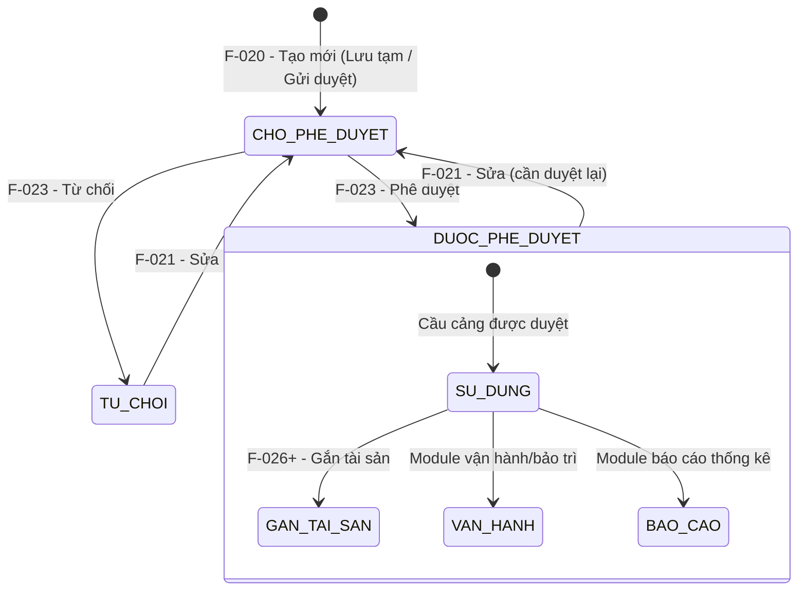

# Đặc tả nghiệp vụ: Tạo mới Cầu cảng

**Tài liệu:** BA Feature Brief
**Feature:** F-020
**Module:** M-002 — Quản lý tài sản KCHTGT Cảng & Bến
**Người viết:** Business Analyst
**Ngày cập nhật:** 2026-07-28

---

## 1. Tổng quan

### 1.1. Tính năng này làm gì?

Cho phép người dùng có thẩm quyền (Admin, Quản lý tài sản) tạo mới một Cầu cảng vào hệ thống quản lý tài sản KCHTGT cảng-bến. Người dùng nhập đầy đủ thông tin kỹ thuật. Cầu cảng sau khi tạo sẽ ở trạng thái "Chờ phê duyệt" và cần được Lãnh đạo/Admin phê duyệt trước khi đưa vào vận hành.

### 1.2. Tại sao cần tính năng này?

Cầu cảng là kết cấu hạ tầng then chốt trực tiếp tiếp nhận tàu và hỗ trợ hoạt động bốc xếp hàng hóa. Việc số hóa quy trình đăng ký và quản lý Cầu cảng giúp đảm bảo thông tin kỹ thuật chính xác (tải trọng, vật liệu, loại kết cấu), phục vụ công tác tính toán năng lực bốc xếp, đánh giá an toàn kết cấu và lập kế hoạch bảo trì, sửa chữa theo chu kỳ. Hiện tại hệ thống quản lý 614 cầu cảng trên toàn quốc.

### 1.3. Luồng hoạt động chính

1. Người dùng đăng nhập hệ thống, vào menu **Quản lý KCHT Hàng Hải > Quản lý cầu cảng**.
2. Hệ thống hiển thị danh sách Cầu cảng.
3. Người dùng nhấn nút **"Tạo mới"**.
4. Hệ thống hiển thị form tạo mới Cầu cảng với các trường rỗng.
5. Người dùng nhập thông tin vào các trường trên form.
6. Hệ thống kiểm tra tất cả các trường thông tin theo validation (xem chi tiết tại Mô tả màn hình).
7. Người dùng chọn một trong ba hành động lưu:
   - **"Lưu tạm":** Lưu cầu cảng với trạng thái "Lưu tạm" (CHO_PHE_DUYET). Cầu cảng chưa được gửi duyệt, có thể sửa tiếp.
   - **"Lưu và gửi phê duyệt":** Lưu và gửi yêu cầu phê duyệt đến cấp có thẩm quyền. Trạng thái chuyển sang "Chờ phê duyệt".
   - **"Lưu và phê duyệt":** (Chỉ dành cho tài khoản có quyền phê duyệt) Lưu và phê duyệt ngay. Trạng thái chuyển sang "Đã phê duyệt".
8. Hệ thống gọi API tạo mới và kiểm tra các quy tắc nghiệp vụ.
9. Nếu thành công: Cầu cảng được lưu với trạng thái tương ứng, hệ thống ghi nhật ký tạo mới, hiển thị thông báo thành công và chuyển hướng về trang danh sách.
10. Nếu thất bại: Thông báo lỗi hiển thị tại trường tương ứng.

---

## 2. Ai dùng? Dùng như thế nào?

Quyền thao tác và xem tính năng được áp dụng theo hệ thống phân quyền tập trung của hệ thống. Mỗi vai trò người dùng sẽ có phạm vi truy cập và thao tác khác nhau trên tính năng này, được kiểm soát bởi cơ chế RBAC (Role-Based Access Control).

### 2.1. Logic phân quyền chung

Các thao tác trong tính năng được bảo vệ bởi các quyền (permissions) tương ứng. Người dùng chỉ có thể thực hiện những thao tác mà vai trò của họ được cấp quyền (xem chi tiết tại tính năng Phân quyền).

### 2.2. Logic phân quyền đặc biệt cho tài khoản Admin Cục

Đối với tài khoản **Admin Cục**, áp dụng logic phân quyền đặc biệt sau:

- **Xem full dữ liệu:** Admin Cục có quyền xem toàn bộ dữ liệu trên hệ thống, không giới hạn phạm vi đơn vị hay khu vực.
- **Xem thông tin người chỉnh sửa:** Với mỗi bản ghi, Admin Cục thấy được thông tin người chỉnh sửa cuối cùng (họ tên, tên đăng nhập).
- **Xem thời gian cập nhật:** Admin Cục thấy được thời gian cập nhật cuối cùng của dữ liệu (timestamp).
- **Xem người tạo mới:** Admin Cục thấy được thông tin người tạo mới bản ghi (họ tên, tên đăng nhập).
- **Xem thời gian tạo mới:** Admin Cục thấy được thời gian tạo mới dữ liệu (timestamp).

> **Ghi chú:** Các trường `người tạo mới`, `thời gian tạo mới`, `người chỉnh sửa`, `thời gian cập nhật` cần được bổ sung vào bảng dữ liệu tương ứng và chỉ hiển thị đối với tài khoản Admin Cục. Với các vai trò khác, các trường này bị ẩn khỏi giao diện.

---

## 3. User Stories

Dưới đây là các câu chuyện người dùng, sắp xếp theo mức độ ưu tiên (Must > Should > Could):

### Mức Must (bắt buộc có)

- **US-020-01:** Là Quản lý tài sản, tôi muốn tạo mới một Cầu cảng với đầy đủ thông tin kỹ thuật để đăng ký tài sản vào hệ thống quản lý.
- **US-020-02:** Là Quản lý tài sản, tôi muốn hệ thống kiểm tra mã cầu cảng không được trùng lặp để đảm bảo tính duy nhất của dữ liệu.
- **US-020-03:** Là Quản lý tài sản, tôi muốn chỉ chọn được Bến cảng mẹ và Cảng biển đang hoạt động để đảm bảo cầu cảng được gán đúng đơn vị hợp lệ.
- **US-020-04:** Là Quản lý tài sản, tôi muốn có thể "Lưu tạm" cầu cảng để chỉnh sửa thêm trước khi gửi phê duyệt.
- **US-020-05:** Là Quản lý tài sản, tôi muốn "Lưu và gửi phê duyệt" để gửi cầu cảng đến cấp có thẩm quyền xem xét.
- **US-020-06:** Là Admin/Lãnh đạo, tôi muốn "Lưu và phê duyệt" ngay để đưa cầu cảng vào sử dụng mà không cần chờ duyệt thêm bước nữa.

### Mức Should (nên có)

- **US-020-07:** Là Quản lý tài sản, tôi muốn nhận được thông báo rõ ràng khi tạo mới thành công hoặc thất bại để biết trạng thái thao tác của mình.
- **US-020-08:** Là Quản lý tài sản, tôi muốn được chuyển hướng về danh sách sau khi tạo mới thành công để tiếp tục công việc.

### Mức Could (có thể có sau)

- **US-020-09:** Là Quản lý tài sản, tôi muốn upload giấy tờ đính kèm ngay khi tạo mới Cầu cảng để hoàn thiện hồ sơ trong một lần thao tác.

---

## 4. Yêu cầu chức năng (Acceptance Criteria)

Mỗi yêu cầu dưới đây mô tả một điều hệ thống phải làm được, kèm theo cách xử lý khi có lỗi hoặc dữ liệu không như mong đợi.

**AC-020-01 — Hiển thị form tạo mới:** Người dùng có vai trò Admin hoặc Quản lý tài sản nhấn nút "Tạo mới" từ danh sách Cầu cảng, hệ thống hiển thị form tạo mới với đầy đủ các nhóm trường: Thông tin cơ bản, Thông tin kỹ thuật, Thời điểm & kiểm định, Số lượng & sản lượng, Phương án bảo đảm ATHH, Công bố mở & đưa vào sử dụng, Tọa độ GIS, File đính kèm. Nếu người dùng không có quyền, nút "Tạo mới" bị ẩn và API trả về 403 Forbidden.

**AC-020-02 — Validation mã cầu cảng:** Hệ thống kiểm tra mã cầu cảng (maCau) tuân thủ chuẩn VN-614, độ dài 6-10 ký tự, duy nhất trong toàn hệ thống. Nếu mã đã tồn tại, hệ thống hiển thị lỗi "Mã cầu cảng đã tồn tại" tại trường và chặn submit. Nếu định dạng không hợp lệ, hiển thị lỗi mô tả quy tắc định dạng.

**AC-020-03 — Validation cảng biển và bến cảng:** Dropdown Cảng biển chỉ hiển thị các Cảng biển đã duyệt, filter theo đơn vị quản lý. Sau khi chọn Cảng biển, dropdown Bến cảng được filter theo Cảng biển đã chọn và chỉ hiển thị bến đã duyệt. Nếu không có Cảng biển/Bến cảng nào đạt điều kiện, dropdown hiển thị trống. Nếu chọn giá trị không hợp lệ, backend trả về 400 Bad Request.

**AC-020-04 — Validation kích thước:** Chiều dài và chiều rộng phải là số thập phân dương (> 0), không vượt quá 500m. Nếu giá trị không hợp lệ, hiển thị lỗi tại trường tương ứng.

**AC-020-05 — Validation số lượng:** Các trường số lượng (số lượng cầu cảng đang khai thác, đã công bố, đang thỏa thuận đầu tư) chỉ được nhập số, tối đa 5 chữ số.

**AC-020-06 — Validation có điều kiện ATHH:** Khi chọn "Có" tại trường "Tiếp nhận tàu có trọng tải lớn hơn thông số QĐ công bố", hai trường Số văn bản và Ngày văn bản trở thành bắt buộc. Khi chọn "Không", clear validation hai trường này.

**AC-020-07 — Lưu tạm thành công:** Người dùng chọn "Lưu tạm", Cầu cảng được lưu với trạng thái "Chờ phê duyệt" (CHO_PHE_DUYET). Bản ghi LichSuThayDoi được tạo. Hiển thị thông báo "Lưu tạm cầu cảng thành công" và chuyển hướng về danh sách. Cầu cảng có thể được chỉnh sửa tiếp (F-021).

**AC-020-08 — Lưu và gửi phê duyệt thành công:** Người dùng chọn "Lưu và gửi phê duyệt", Cầu cảng được lưu và gửi đến cấp phê duyệt. Trạng thái chuyển sang "Chờ phê duyệt". Bản ghi LichSuThayDoi được tạo. Hiển thị thông báo "Đã gửi phê duyệt cầu cảng" và chuyển hướng về danh sách. Cầu cảng xuất hiện trong danh sách chờ phê duyệt của F-023.

**AC-020-09 — Lưu và phê duyệt thành công:** Người dùng có quyền phê duyệt (Admin/Lãnh đạo) chọn "Lưu và phê duyệt", Cầu cảng được lưu và phê duyệt ngay. Trạng thái chuyển sang "Đã phê duyệt" (DUOC_PHE_DUYET). Hiển thị thông báo "Tạo mới và phê duyệt cầu cảng thành công". Cầu cảng sẵn sàng để sử dụng trong các module khác.

**AC-020-10 — Các trường bắt buộc:** Tất cả các trường bắt buộc phải được điền đầy đủ. Nếu thiếu trường nào, hệ thống hiển thị lỗi "Trường này là bắt buộc" và chặn submit.

---

## 5. Quy tắc nghiệp vụ (Business Rules)

Các quy tắc này là "luật chơi" mà mọi thành phần trong hệ thống phải tuân thủ:

**BR-020-01 — Mã cầu cảng duy nhất và bất biến:** Mã cầu cảng là duy nhất trong toàn hệ thống và không thể thay đổi sau khi đã tạo. Mọi yêu cầu thay đổi mã cầu phải thông qua quy trình hủy bỏ và tạo lại.

**BR-020-02 — Cảng biển và Bến cảng phải đã duyệt:** Khi tạo mới Cầu cảng, Cảng biển và Bến cảng được chọn phải ở trạng thái đã duyệt và đang hoạt động. Không được chọn cảng/bến đang "Chờ phê duyệt", "Tạm ngừng" hoặc "Đã xóa".

**BR-020-03 — Thứ tự tạo bắt buộc:** Phải tạo theo thứ tự: Cảng biển → Bến cảng → Cầu cảng. Không thể tạo Cầu cảng nếu chưa có Bến cảng cha đã được duyệt. Tương tự, Bến cảng không thể tạo nếu chưa có Cảng biển cha.

**BR-020-04 — Cầu cảng chưa duyệt thì chưa dùng được:** Cầu cảng sau khi tạo (kể cả "Lưu tạm" hay "Lưu và gửi phê duyệt") đều ở trạng thái chưa được phê duyệt (CHO_PHE_DUYET). Ở trạng thái này, cầu cảng **chưa thể được tham chiếu** bởi bất kỳ module nào khác (không xuất hiện trong dropdown chọn cầu cảng của module Quản lý tài sản, Vận hành, Bảo trì...). Phải qua bước phê duyệt (F-023) để đạt trạng thái "Đã phê duyệt" (DUOC_PHE_DUYET) thì mới có thể sử dụng.

**BR-020-05 — Ghi nhật ký tự động:** Mọi thao tác tạo mới đều được ghi tự động vào LichSuThayDoi để phục vụ kiểm toán và truy vết. Nhật ký bao gồm: mã cầu cảng, người tạo, thời gian tạo, loại hành động (TAO_MOI).

**BR-020-06 — Validation các trường thông tin:** Các trường thông tin cần nhập đúng validation (xem chi tiết tại mục 9.1 Mô tả màn hình). Validation được thực hiện ở cả client-side và server-side.

**BR-020-07 — Đơn vị quản lý mặc định:** Trường Đơn vị quản lý mặc định được điền theo đơn vị của người dùng đăng nhập. Khi tạo mới, người dùng chỉ thấy và chọn được dữ liệu trong phạm vi đơn vị quản lý của mình.

**BR-020-08 — Lọc dữ liệu theo đơn vị quản lý:** Các dropdown Cảng biển, Bến cảng, Luồng hàng hải được lọc theo Đơn vị quản lý đã chọn. Khi thay đổi Đơn vị quản lý, các dropdown phụ thuộc được load lại.

---

## 6. Vòng đời và liên kết với các tính năng khác

> ⚠ **QUAN TRỌNG CHO DEVELOPER:** Tính năng Tạo mới Cầu cảng (F-020) là **bước đầu tiên** trong vòng đời của cầu cảng. Dưới đây là toàn bộ vòng đời và các tính năng liên quan mà developer cần nắm khi phát triển.

### 6.1. Vòng đời cầu cảng



### 6.2. Trạng thái và ý nghĩa

| Trạng thái | Mã | Ý nghĩa | Có thể dùng ở module khác? |
|---|---|---|---|
| Chờ phê duyệt | CHO_PHE_DUYET | Cầu cảng vừa được tạo (lưu tạm hoặc đã gửi duyệt), đang chờ phê duyệt | **❌ Không** — không xuất hiện trong dropdown chọn cầu cảng |
| Đã phê duyệt | DUOC_PHE_DUYET | Cầu cảng đã được phê duyệt, sẵn sàng sử dụng | **✅ Có** — xuất hiện trong tất cả dropdown và module liên quan |
| Từ chối | TU_CHOI | Cầu cảng bị từ chối, cần sửa và gửi lại | **❌ Không** — cần sửa lại (F-021) và gửi duyệt lại |
| Đã xóa | DA_XOA | Cầu cảng bị xóa mềm (F-022) | **❌ Không** — ẩn khỏi toàn bộ hệ thống |

### 6.3. Các tính năng liên quan trực tiếp

Những tính năng này nằm trong cùng module M-002 và developer làm F-020 **cần biết** vì chúng tạo thành chuỗi nghiệp vụ liên tục:

| Feature | Tên | Vai trò | Mối liên kết với F-020 |
|---|---|---|---|
| **F-021** | Cập nhật Cầu cảng | Sửa thông tin sau khi tạo | Sau khi sửa, trạng thái quay về CHO_PHE_DUYET → cần duyệt lại |
| **F-022** | Xóa Cầu cảng | Xóa mềm cầu cảng | Chỉ xóa được nếu không có dữ liệu liên quan. Không tự động xóa cascade. |
| **F-023** | Phê duyệt Cầu cảng | Duyệt/từ chối cầu cảng đã tạo | **Bắt buộc** — cầu cảng tạo từ F-020 phải qua F-023 mới được sử dụng |
| **F-024** | Xem chi tiết Cầu cảng | Xem thông tin cầu cảng | Có thể xem ở mọi trạng thái |
| **F-025** | Lịch sử Cầu cảng | Xem nhật ký thay đổi | Ghi nhận mọi thao tác từ F-020 |

### 6.4. Các module/tính năng sử dụng cầu cảng sau khi đã duyệt

Sau khi cầu cảng được duyệt (DUOC_PHE_DUYET), nó sẽ xuất hiện trong các module sau. Developer cần đảm bảo filter `trangThaiPheDuyet = DUOC_PHE_DUYET` khi xây dựng dropdown chọn cầu cảng:

| Module | Mục đích | Ghi chú |
|---|---|---|
| Quản lý tài sản cầu cảng (F-026+) | Gắn thông tin tài chính (nguyên giá, khấu hao, kiểm kê) | Chỉ chọn cầu cảng đã duyệt |
| Vận hành khai thác | Gắn thông tin vận hành (lượt tàu, sản lượng) | Lọc theo cầu cảng |
| Bảo trì, sửa chữa | Gắn lịch sử bảo trì | Lọc theo cầu cảng |
| Báo cáo thống kê | Biểu 01-N, 02-N, 06-N (TT48) | Chỉ thống kê cầu cảng đã duyệt |
| Tra cứu công khai | Xem thông tin cầu cảng (read-only) | Dữ liệu từ cầu cảng đã duyệt |

### 6.5. Module cha (cầu cảng là con)

Cầu cảng luôn thuộc về một Bến cảng, Bến cảng thuộc về một Cảng biển. Thứ tự tạo bắt buộc:

```markmap
- Cảng biển (CB)
  - Bến cảng (BC) — phải có CB cha đã duyệt
    - Cầu cảng (CC) — phải có BC cha đã duyệt
```

---

## 7. Mô hình dữ liệu

Tính năng này tạo ra/sửa đổi các bảng dữ liệu sau trong cơ sở dữ liệu:

> **Quy ước đánh dấu:**
> - <span style="color:red;font-weight:bold">🔴 Chữ màu đỏ</span> = **trường mới cần thêm** vào bảng hiện có.
> - ~~Chữ gạch ngang~~ = **trường không cần thiết**, cần loại bỏ khỏi bảng.
> - Các trường không được đánh dấu là các trường hiện có, được giữ nguyên.

### 7.1. Bảng CauCang — Thông tin Cầu cảng

Đây là bảng chính, lưu toàn bộ thông tin kỹ thuật và trạng thái của Cầu cảng.

**A. Thông tin cơ bản (root fields — lưu trực tiếp vào CauCang):**

- <span style="color:red;font-weight:bold">**donViQuanLy:** UUID, đơn vị quản lý, bắt buộc. Mặc định = đơn vị của user đăng nhập.</span>
- <span style="color:red;font-weight:bold">**cangBienId:** UUID, khóa ngoại đến Cảng biển, bắt buộc. Chỉ chọn Cảng biển đã duyệt.</span>
- **benCangId:** UUID, khóa ngoại đến Bến cảng, bắt buộc. Filter theo cangBienId. Chỉ chọn Bến cảng đã duyệt.
- <span style="color:red;font-weight:bold">**luongHhId:** UUID, khóa ngoại đến Luồng hàng hải, tùy chọn. Filter theo cangBienId.</span>
- **maCau:** chuỗi 6-10 ký tự, duy nhất toàn hệ thống (unique constraint), không thể sửa sau khi tạo
- **tenCau:** tên cầu cảng, bắt buộc
- <span style="color:red;font-weight:bold">**diaDiem:** chuỗi, địa điểm (Tỉnh/Thành phố), bắt buộc. Danh mục DM_DON_VI_HANH_CHINH.</span>
- <span style="color:red;font-weight:bold">**diaDiemChiTiet:** chuỗi, địa điểm chi tiết, tùy chọn. Tối đa 500 ký tự.</span>
- <span style="color:red;font-weight:bold">**phanCap:** số nguyên, phân cấp công trình, tùy chọn. Danh mục PHAN_CAP_CONG_TRINH.</span>
- **loaiKetCau:** enum, loại kết cấu cầu cảng, bắt buộc
- <span style="color:red;font-weight:bold">**congNangKhaiThac:** chuỗi (multi-select), công năng khai thác, tùy chọn. Danh mục CONG_NANG_KHAI_THAC.</span>
- <span style="color:red;font-weight:bold">**tinhTrang:** số nguyên, tình trạng, bắt buộc. Danh mục TINH_TRANG. Mặc định = 1 (Sử dụng).</span>
- ~~**vatLieuChinh:** chuỗi, vật liệu chính~~ → không có trong hệ thống tham khảo, cần loại bỏ
- ~~**taiTrongThietKe:** số thập phân (T/m²)~~ → không có trong hệ thống tham khảo, cần loại bỏ
- ~~**mucNuocCaoNhat:** số thập phân (mét)~~ → thay bằng doSauKhuNuocHienTai bên dưới

**B. Thông tin kỹ thuật (zobjDataSub — lưu trong COM_DATA_EXT):**

- **chieuDai:** số thập phân (mét), > 0, ≤ 500, bắt buộc
- **chieuRong:** số thập phân (mét), > 0, ≤ 500, bắt buộc
- <span style="color:red;font-weight:bold">**doSauKhuNuocHienTai:** chuỗi, độ sâu khu nước hiện tại, tùy chọn. Tối đa 20 ký tự.</span>
- <span style="color:red;font-weight:bold">**caoDoDayBenThietKe:** chuỗi, cao độ đáy bến thiết kế, tùy chọn. Tối đa 20 ký tự.</span>
- <span style="color:red;font-weight:bold">**coTauKhaiThacTheoCongBo:** chuỗi, cỡ tàu khai thác theo công bố (DWT), tùy chọn. Tối đa 20 ký tự.</span>

**C. Thời điểm & kiểm định (zobjDataSub):**

- <span style="color:red;font-weight:bold">**thoiDiemPheDuyetQuyTrinhBaoTri:** ngày tháng (MM/YYYY), thời điểm phê duyệt quy trình bảo trì công trình, tùy chọn.</span>
- <span style="color:red;font-weight:bold">**thoiDiemChapThuanDanhGiaATCT:** ngày tháng (MM/YYYY), thời điểm được chấp thuận hồ sơ báo cáo đánh giá an toàn công trình (gần nhất), tùy chọn.</span>
- <span style="color:red;font-weight:bold">**thoiDiemKiemDinhGanNhat:** ngày tháng (MM/YYYY), thời điểm kiểm định gần nhất, tùy chọn.</span>

**D. Số lượng & sản lượng (zobjDataSub):**

- <span style="color:red;font-weight:bold">**soLuongCCDangKhaiThac:** số nguyên, số lượng cầu cảng đang khai thác, tùy chọn. Chỉ nhập số, tối đa 5 chữ số.</span>
- <span style="color:red;font-weight:bold">**soLuongCCDaCongBo:** số nguyên, số lượng cầu cảng đã công bố, tùy chọn. Chỉ nhập số, tối đa 5 chữ số.</span>
- <span style="color:red;font-weight:bold">**soLuongCCDangThoaThuanDauTu:** số nguyên, số lượng CC đang được thỏa thuận đầu tư xây dựng, tùy chọn. Chỉ nhập số, tối đa 5 chữ số.</span>
- <span style="color:red;font-weight:bold">**sanLuongHangThongQua:** số thập phân, sản lượng hàng thông qua, tùy chọn.</span>

**E. Phương án bảo đảm ATHH (zobjDataSub):**

- <span style="color:red;font-weight:bold">**tiepNhanTauLonHonQDCB:** số nguyên (0/1), tiếp nhận tàu có trọng tải lớn hơn thông số QĐ công bố, tùy chọn. Danh mục TIEP_NHAN_TAU_CO_TT_LON_HON.</span>
- <span style="color:red;font-weight:bold">**soVanBan:** chuỗi, số văn bản. **Bắt buộc khi** tiepNhanTauLonHonQDCB = '1' (Có).</span>
- <span style="color:red;font-weight:bold">**ngayVanBan:** ngày tháng, ngày văn bản. **Bắt buộc khi** tiepNhanTauLonHonQDCB = '1' (Có).</span>

**F. Công bố mở, đưa vào sử dụng (zobjDataSub):**

- <span style="color:red;font-weight:bold">**thoiDiemCongBoMoDuaVaoSD:** ngày tháng, thời điểm công bố mở, đưa vào sử dụng, tùy chọn.</span>
- <span style="color:red;font-weight:bold">**quyetDinhCongBo:** chuỗi, quyết định công bố / văn bản cho phép khai thác, tùy chọn. Tối đa 200 ký tự.</span>
- <span style="color:red;font-weight:bold">**vanBanThoaThuanDauTu:** chuỗi, văn bản thỏa thuận đầu tư xây dựng, tùy chọn. Tối đa 2000 ký tự.</span>

**G. Metadata & trạng thái:**

- **trangThaiHoatDong:** enum (HIEN_HANH, TAM_NGUNG), mặc định HIEN_HANH
- **trangThaiPheDuyet:** enum (CHO_PHE_DUYET, DUOC_PHE_DUYET, TU_CHOI), mặc định CHO_PHE_DUYET khi tạo mới
- **ghiChu:** text, tùy chọn
- <span style="color:red;font-weight:bold">**createdBy:** UUID, người tạo bản ghi</span>
- **createdAt:** timestamp, thời điểm tạo bản ghi (tự động)
- <span style="color:red;font-weight:bold">**updatedBy:** UUID, người cập nhật gần nhất</span>
- **updatedAt:** timestamp, thời điểm cập nhật gần nhất (tự động)
- **deletedAt:** timestamp, thời điểm xóa mềm (NULL = chưa xóa), tùy chọn
- <span style="color:red;font-weight:bold">**deletedBy:** UUID, người thực hiện xóa</span>

### 7.2. Các bảng phụ trợ

- <span style="color:red;font-weight:bold">**loaiDoiTuong:** enum (DIEM, DUONG, VUNG), loại đối tượng GIS, tùy chọn.</span>
- <span style="color:red;font-weight:bold">**bieuTuong:** chuỗi, biểu tượng bản đồ (icon), tùy chọn. Bắt buộc khi đã chọn loaiDoiTuong.</span>
- <span style="color:red;font-weight:bold">**heQuyChieu:** chuỗi, hệ quy chiếu, tự động = "WGS_84", disabled (không cho sửa).</span>
- <span style="color:red;font-weight:bold">**quyTacHienThi:** chuỗi, quy tắc hiển thị tọa độ, tự động = "Độ/Phút/Giây", disabled (không cho sửa).</span>
- <span style="color:red;font-weight:bold">**phamViKhuNuocNeoBuocTau:** chuỗi (text), phạm vi khu nước neo buộc tàu. Tối đa 2000 ký tự. Form riêng: `registerThongTinPhamVi` trong `FormCrud`.</span>
- <span style="color:red;font-weight:bold">**zlstDataGeo:** danh sách tọa độ GIS (kinh độ, vĩ độ) — lưu trong bảng tọa độ riêng, liên kết qua cauCangId.</span>
- <span style="color:red;font-weight:bold">**zlstFileDk:** danh sách file đính kèm (PDF, ảnh...) — lưu trong bảng GiayTo, liên kết qua entityType="cau-cang" và entityId.</span>

### 7.3. Bảng BenCang — Bến cảng (tham chiếu)

Bảng đã tồn tại, được tham chiếu qua khóa ngoại `benCangId`. Điều kiện: chỉ Bến cảng có `trangThaiHoatDong = HIEN_HANH` mới hiển thị trong dropdown chọn.

### 7.4. Bảng LichSuThayDoi — Nhật ký thay đổi

Bảng ghi nhận tự động mỗi khi Cầu cảng được tạo mới, cập nhật hoặc xóa:

- **id:** UUID, định danh bản ghi nhật ký
- **cauCangId:** UUID, khóa ngoại đến CauCang
- **fieldChanged:** chuỗi, tên trường bị thay đổi
- **oldValue:** text, giá trị cũ (NULL khi tạo mới)
- **newValue:** text, giá trị mới
- **changedBy:** UUID, người thực hiện thay đổi
- **changedAt:** timestamp, thời gian thay đổi (tự động)
- **actionType:** enum (TAO_MOI, CAP_NHAT, PHE_DUYET, TU_CHOI, XOA_MEM)

---

## 8. API Endpoints

Hệ thống cung cấp các API để phục vụ các thao tác liên quan đến tính năng:

| Method | Endpoint | Mô tả | Phân quyền |
|---|---|---|---|
| POST | `/api/v1/cau-cang?action=LUU_TAM` | Lưu tạm Cầu cảng (trạng thái CHO_PHE_DUYET) | Admin, Quản lý tài sản |
| POST | `/api/v1/cau-cang?action=LUU_VA_GUI_PHE_DUYET` | Lưu và gửi phê duyệt (trạng thái CHO_PHE_DUYET, kèm cờ gửi duyệt) | Admin, Quản lý tài sản |
| POST | `/api/v1/cau-cang?action=LUU_VA_PHE_DUYET` | Lưu và phê duyệt ngay (trạng thái DUOC_PHE_DUYET) | Admin, Lãnh đạo |
| GET | `/api/v1/cang-bien?trangThaiHoatDong=HIEN_HANH` | Lấy danh sách Cảng biển đang hoạt động (cho dropdown) | Admin, Quản lý tài sản |
| GET | `/api/v1/ben-cang?trangThaiHoatDong=HIEN_HANH&cangBienId={id}` | Lấy danh sách Bến cảng đang hoạt động, filter theo Cảng biển | Admin, Quản lý tài sản |
| GET | `/api/v1/luong-hh?cangBienId={id}` | Lấy danh sách Luồng hàng hải, filter theo Cảng biển | Admin, Quản lý tài sản |

---

## 9. Chi tiết nghiệp vụ từng phần

### 9.1. Form Tạo mới Cầu cảng

Form tạo mới gồm 7 nhóm thông tin. Dữ liệu được gom thành 2 phần khi gửi API: root fields (lưu trực tiếp vào bảng CauCang) và zobjDataSub (lưu vào COM_DATA_EXT).

#### A. Thông tin cơ bản (root fields)

| STT | Tên trường | Loại điều khiển | Cho phép chỉnh sửa | Bắt buộc | Giá trị mặc định | Mô tả |
| --- | --- | --- | --- | --- | --- | --- |
| 1 | Đơn vị quản lý | SelectOrgCode | Có | Có | Đơn vị của user | Chọn đơn vị quản lý.<br>Mặc định = đơn vị của người dùng đăng nhập.<br>Khi thay đổi, các dropdown Cảng biển/Bến cảng/Luồng HH được lọc lại. |
| 2 | Thuộc cảng biển | Select (Dropdown) | Có | Có | Trống | Chọn Cảng biển cha.<br>Validation: chỉ hiển thị Cảng biển đã duyệt, filter theo đơn vị quản lý.<br>Sau khi tạo, trường này thành read-only. |
| 3 | Thuộc bến cảng | Select (Dropdown) | Có | Có | Trống | Chọn Bến cảng cha.<br>Validation: filter theo Cảng biển + đơn vị quản lý. Chỉ hiển thị Bến cảng đã duyệt. |
| 4 | Thuộc luồng hàng hải | Select (Dropdown) | Có | Không | Trống | Chọn Luồng hàng hải.<br>Filter theo Cảng biển + đơn vị quản lý. Trường tùy chọn. |
| 5 | Mã cầu cảng | Textbox | Có | Có | Trống | Cho phép nhập mã cầu cảng.<br>Validation: tuân thủ chuẩn VN-614, độ dài từ 6 đến 10 ký tự, duy nhất trong toàn hệ thống (kiểm tra real-time).<br>Nếu mã đã tồn tại hiển thị lỗi "Mã cầu cảng đã tồn tại" và chặn submit.<br>Sau khi tạo, mã không thể thay đổi. |
| 6 | Tên cầu cảng | Textarea | Có | Có | Trống | Cho phép nhập tên cầu cảng.<br>Validation: không được để trống, tối đa 255 ký tự. |
| 7 | Địa điểm (Tỉnh/TP) | Select (Dropdown) | Có | Có | Trống | Chọn Tỉnh/Thành phố.<br>Danh mục: DM_DON_VI_HANH_CHINH. |
| 8 | Địa điểm chi tiết | Textarea | Có | Không | Trống | Nhập địa điểm chi tiết.<br>Tối đa 500 ký tự. Trường tùy chọn. |
| 9 | Phân cấp công trình | Select (Dropdown) | Có | Không | Trống | Chọn phân cấp công trình.<br>Danh mục: PHAN_CAP_CONG_TRINH. |
| 10 | Loại kết cấu | Select (Dropdown) | Có | Có | Trống | Chọn loại kết cấu cầu cảng.<br>Danh mục: LOAI_KET_CAU_BC_CC. |
| 11 | Công năng khai thác | Select (Multi-select) | Có | Không | Trống | Chọn công năng khai thác (có thể chọn nhiều).<br>Danh mục: CONG_NANG_KHAI_THAC. |
| 12 | Tình trạng | Select (Dropdown) | Có | Có | 1 (Sử dụng) | Chọn tình trạng.<br>Danh mục: TINH_TRANG. Mặc định = 1 (Sử dụng). |

#### B. Thông tin kỹ thuật (zobjDataSub)

| STT | Tên trường | Loại điều khiển | Cho phép chỉnh sửa | Bắt buộc | Giá trị mặc định | Mô tả |
| --- | --- | --- | --- | --- | --- | --- |
| 13 | Chiều dài | Number Input | Có | Có | Trống | Nhập chiều dài cầu cảng.<br>Đơn vị: mét (m).<br>Validation: giá trị thập phân dương (> 0), không vượt quá 500m, không được để trống. |
| 14 | Chiều rộng | Number Input | Có | Có | Trống | Nhập chiều rộng cầu cảng.<br>Đơn vị: mét (m).<br>Validation: giá trị thập phân dương (> 0), không vượt quá 500m, không được để trống. |
| 15 | Độ sâu khu nước hiện tại | Textbox | Có | Không | Trống | Nhập độ sâu khu nước hiện tại.<br>Tối đa 20 ký tự. |
| 16 | Cao độ đáy bến thiết kế | Textbox | Có | Không | Trống | Nhập cao độ đáy bến thiết kế.<br>Tối đa 20 ký tự. |
| 17 | Cỡ tàu khai thác theo công bố | Textbox | Có | Không | Trống | Nhập cỡ tàu khai thác (DWT).<br>Tối đa 20 ký tự. |

#### C. Thời điểm & kiểm định (zobjDataSub)

| STT | Tên trường | Loại điều khiển | Cho phép chỉnh sửa | Bắt buộc | Giá trị mặc định | Mô tả |
| --- | --- | --- | --- | --- | --- | --- |
| 18 | Thời điểm phê duyệt quy trình bảo trì | DatePicker (MM/YYYY) | Có | Không | Trống | Chọn tháng/năm phê duyệt quy trình bảo trì công trình. |
| 19 | Thời điểm chấp thuận hồ sơ đánh giá ATCT | DatePicker (MM/YYYY) | Có | Không | Trống | Chọn tháng/năm được chấp thuận hồ sơ báo cáo đánh giá an toàn công trình (gần nhất). |
| 20 | Thời điểm kiểm định gần nhất | DatePicker (MM/YYYY) | Có | Không | Trống | Chọn tháng/năm kiểm định gần nhất. |

#### D. Số lượng & sản lượng (zobjDataSub)

| STT | Tên trường | Loại điều khiển | Cho phép chỉnh sửa | Bắt buộc | Giá trị mặc định | Mô tả |
| --- | --- | --- | --- | --- | --- | --- |
| 21 | Số lượng CC đang khai thác | Textbox (number only) | Có | Không | Trống | Chỉ nhập số, tối đa 5 chữ số. |
| 22 | Số lượng CC đã công bố | Textbox (number only) | Có | Không | Trống | Chỉ nhập số, tối đa 5 chữ số. |
| 23 | Số lượng CC đang thỏa thuận đầu tư XD | Textbox (number only) | Có | Không | Trống | Chỉ nhập số, tối đa 5 chữ số. |
| 24 | Sản lượng hàng thông qua | Number Input | Có | Không | Trống | Nhập sản lượng hàng thông qua (số thập phân). |

#### E. Phương án bảo đảm ATHH (zobjDataSub)

| STT | Tên trường | Loại điều khiển | Cho phép chỉnh sửa | Bắt buộc | Giá trị mặc định | Mô tả |
| --- | --- | --- | --- | --- | --- | --- |
| 25 | Tiếp nhận tàu có TT lớn hơn QĐ công bố | Select (Có/Không) | Có | Không | 0 (Không) | Chọn Có/Không.<br>Danh mục: TIEP_NHAN_TAU_CO_TT_LON_HON. |
| 26 | Số văn bản | Textbox | Có | Có (khi #25 = Có) | Trống | Nhập số văn bản.<br>**Bắt buộc khi** trường #25 chọn "Có".<br>Khi #25 chọn "Không", clear validation và giá trị. |
| 27 | Ngày văn bản | DatePicker | Có | Có (khi #25 = Có) | Trống | Chọn ngày văn bản.<br>**Bắt buộc khi** trường #25 chọn "Có".<br>Khi #25 chọn "Không", clear validation và giá trị. |

#### F. Công bố mở, đưa vào sử dụng (zobjDataSub)

| STT | Tên trường | Loại điều khiển | Cho phép chỉnh sửa | Bắt buộc | Giá trị mặc định | Mô tả |
| --- | --- | --- | --- | --- | --- | --- |
| 28 | Thời điểm công bố mở, đưa vào sử dụng | DatePicker | Có | Không | Trống | Chọn ngày công bố mở, đưa vào sử dụng. |
| 29 | Quyết định công bố / VB cho phép khai thác | Textarea | Có | Không | Trống | Nhập số quyết định/văn bản.<br>Tối đa 200 ký tự. |
| 30 | Văn bản thỏa thuận đầu tư xây dựng | Textarea | Có | Không | Trống | Nhập văn bản thỏa thuận.<br>Tối đa 2000 ký tự. |

#### G. Thông tin GIS, Phạm vi & File đính kèm

| STT | Tên trường | Loại điều khiển | Cho phép chỉnh sửa | Bắt buộc | Giá trị mặc định | Mô tả |
| --- | --- | --- | --- | --- | --- | --- |
| G0 | Loại đối tượng | Select (Dropdown) | Có | Không | Trống | Chọn loại đối tượng GIS: Điểm / Đường / Vùng.<br>Khi có chọn loại đối tượng, trường Biểu tượng trở thành bắt buộc. |
| G1 | Biểu tượng | Select (Icon picker) | Có | Có (khi G0 đã chọn) | Trống | Chọn biểu tượng hiển thị trên bản đồ.<br>**Bắt buộc khi** trường G0 đã chọn loại đối tượng.<br>Khi G0 để trống, trường này bị ẩn hoặc disabled. |
| G2 | Hệ quy chiếu | Textbox (disabled) | Không | Không | WGS_84 | Hiển thị hệ quy chiếu mặc định.<br>Luôn = "WGS_84", không cho phép chỉnh sửa. |
| G3 | Quy tắc hiển thị | Textbox (disabled) | Không | Không | Độ/Phút/Giây | Hiển thị quy tắc hiển thị tọa độ mặc định.<br>Luôn = "Độ/Phút/Giây", không cho phép chỉnh sửa. |
| G4 | Phạm vi khu nước neo buộc tàu | Textarea | Có | Không | Trống | Nhập phạm vi khu nước neo buộc tàu.<br>Tối đa 2000 ký tự.<br>Form riêng: `registerThongTinPhamVi` trong `FormCrud`. |
| G5 | Tọa độ GIS | Bảng tọa độ | Có | Không | Trống | Nhập danh sách điểm tọa độ (kinh độ, vĩ độ).<br>Component: LocationInformationForm. |
| G6 | File đính kèm | Upload | Có | Không | Trống | Upload file đính kèm (PDF, ảnh...).<br>Component: UploadFileTable. |

#### H. Nút hành động

| STT | Tên trường | Loại điều khiển | Cho phép chỉnh sửa | Bắt buộc | Giá trị mặc định | Mô tả |
| --- | --- | --- | --- | --- | --- | --- |
|  | Nút "Lưu tạm" | Button | — | — | — | Gọi API với action=LUU_TAM.<br>Lưu với trạng thái CHO_PHE_DUYET, không gửi duyệt.<br>Hiển thị thông báo: "Lưu tạm cầu cảng thành công".<br>Redirect về danh sách. Có thể sửa tiếp. |
|  | Nút "Lưu và gửi phê duyệt" | Button | — | — | — | Gọi API với action=LUU_VA_GUI_PHE_DUYET.<br>Lưu và gửi yêu cầu phê duyệt.<br>Hiển thị thông báo: "Đã gửi phê duyệt cầu cảng".<br>Redirect về danh sách. Cầu cảng chờ duyệt tại F-023. |
|  | Nút "Lưu và phê duyệt" | Button | — | — | — | Chỉ hiển thị cho Admin/Lãnh đạo.<br>Gọi API với action=LUU_VA_PHE_DUYET.<br>Lưu và phê duyệt ngay (DUOC_PHE_DUYET).<br>Hiển thị thông báo: "Tạo mới và phê duyệt cầu cảng thành công".<br>Cầu cảng sẵn sàng sử dụng ngay. |
|  | Nút "Hủy" | Button | — | — | — | Hủy thao tác tạo mới, quay về trang danh sách Cầu cảng.<br>Không lưu dữ liệu đã nhập. |

---

## 10. Yêu cầu phi chức năng

### 10.1. Hiệu năng

- Thời gian phản hồi khi kiểm tra trùng lặp mã cầu cảng (real-time validation) ≤ 500ms
- Thời gian tạo mới (từ lúc nhấn Lưu đến khi redirect) ≤ 2 giây
- Các dropdown phụ thuộc (Cảng biển → Bến cảng → Luồng HH) phản hồi ≤ 300ms khi thay đổi lựa chọn

### 10.2. Khả năng mở rộng

- Hỗ trợ tạo mới đồng thời nhiều Cầu cảng bởi nhiều người dùng khác nhau
- Sẵn sàng tích hợp upload giấy tờ đính kèm trong tương lai (F-105)
- Cấu trúc zobjDataSub cho phép mở rộng thêm trường kỹ thuật mà không cần thay đổi schema bảng chính

### 10.3. Bảo mật

- Phân quyền RBAC được áp dụng trên tất cả các API liên quan đến tính năng
- Mọi request phải kèm JWT token hợp lệ
- Dữ liệu người dùng (createdBy) được lấy từ token, không nhận từ client
- Nút "Lưu và phê duyệt" chỉ hiển thị cho vai trò có quyền phê duyệt (Admin, Lãnh đạo)
- Dữ liệu được lọc theo đơn vị quản lý của người dùng (không thấy dữ liệu ngoài phạm vi)

### 10.4. Độ tin cậy

- Validation được thực hiện ở cả client-side và server-side để đảm bảo dữ liệu hợp lệ
- Unique constraint `maCau` được đảm bảo ở tầng database
- Conditional validation (ATHH) hoạt động chính xác ở cả client và server

### 10.5. Trải nghiệm người dùng

- Giao diện responsive: trên điện thoại (dưới 768px), thanh menu thu gọn
- Có loading skeleton khi đang tải dữ liệu
- Có trạng thái rỗng (empty state) với hướng dẫn thân thiện khi không có Cảng biển/Bến cảng nào đạt điều kiện
- Tuân thủ tiêu chuẩn trợ năng WCAG 2.1 AA

### 10.6. Tuân thủ pháp lý

- Mã cầu cảng tuân thủ chuẩn mã hóa VN-614 theo quy định của Cục Hàng hải Việt Nam
- Dữ liệu tuân thủ Thông tư 48/2017/TT-BGTVT

---

## 11. Yêu cầu giao diện người dùng

> **Nguyên tắc cốt lõi:** Mọi giá trị màu sắc, khoảng cách, kích thước chữ trong giao diện đều được định nghĩa tập trung tại 2 file `frontend/src/theme.ts` (layout, màu nền sidebar/header) và `frontend/src/tokens.ts` (màu chữ, màu trạng thái, thang số). Tuyệt đối không hardcode giá trị hex hay pixel trong component.

### 11.1. Bố cục chung

Màn hình Tạo mới Cầu cảng dùng chung bố cục toàn hệ thống, bao gồm:

- **Thanh menu trái (sidebar):** rộng 272px, nền màu xanh dương đậm `#12468C`. Mục đang chọn được tô màu xanh sáng `#1B84FF`. Khi thu gọn (trên điện thoại), rộng còn 80px và chuyển thành nút hamburger.
- **Thanh tiêu đề trên cùng (header):** cao 64px, nền trắng, chứa tên người dùng và avatar.
- **Vùng nội dung chính:** nền xám nhạt pha xanh `#eaf0f6`, giúp các card trắng bên trong nổi bật hơn.

### 11.2. Hệ thống màu sắc

Mỗi màu sắc trong giao diện được gán một "vai trò" rõ ràng. Developer không được dùng màu theo cảm tính mà phải import đúng token:

| Khi cần... | Dùng token | Màu thực tế |
|---|---|---|
| Tiêu đề trang, số liệu quan trọng | `textPrimary` | `#0c2438` |
| Nhãn field, mô tả | `textSecondary` | `#566a7c` |
| Thời gian, trạng thái phụ, caption | `textTertiary` | `#93a3b3` |
| Nền card, modal, bảng | `surfaceCard` | `#FFFFFF` |
| Nền vùng nội dung chính | `surfacePage` | `#eaf0f6` |
| Viền card, đường kẻ | `borderDefault` | `rgba(11,46,79,0.09)` |
| Nút chính, link | `actionPrimary` | `#0E6FD6` |

### 11.3. Thang số — chỉ dùng giá trị cho phép

**Khoảng cách (spacing):** 4px, 8px, 12px, 16px, 24px, 32px. Trong đó 12px là khoảng cách mặc định giữa các trường trong form (`spaceFormField`), 16px là padding mặc định của card (`spaceMd`).

**Bo góc (radius):** 4px (cho ô textarea), 8px, 12px (cho card), 999px (dạng pill — dùng cho input, select, button).

**Cỡ chữ (font size):** 10px (metadata, caption), 13px (nhãn, nội dung), 15px (tiêu đề card, tiêu đề section), 18px (tiêu đề trang).

**Độ đậm chữ (font weight):** 400 (nội dung), 500 (nhãn, nút), 600 (số liệu quan trọng, tiêu đề).

**Font chữ:** `'Inter', -apple-system, BlinkMacSystemFont, sans-serif` cho toàn bộ văn bản.

> **Cấm tuyệt đối:** spacing 6, 10, 14, 18; radius 6, 7, 10; font-size 12, 14, 16, 24.

### 11.4. Style có sẵn — dùng lại, đừng tự chế

Hệ thống đã định nghĩa sẵn các kiểu dáng phổ biến. Khi cần hiển thị:

- **Thời gian, caption:** dùng `metaStyle` (chữ nhỏ 10px, màu xám nhạt, weight 400)
- **Card nội dung:** dùng `cardStyle` (nền trắng, viền 0.5px, bo góc 12px, padding 16px)
- **Tag trạng thái:** dùng `badgeBaseStyle` (chữ nhỏ, weight 500, padding 2px-8px, pill)
- **Link, nút text:** dùng `actionStyle` (pill, màu actionPrimary, weight 500)
- **Đường kẻ ngăn cách:** dùng `dividerStyle`

### 11.5. Giới hạn màu nhấn — tối đa 3 lần mỗi màn

Màu `actionPrimary` (`#0E6FD6`) là màu nhấn mạnh nhất, dùng cho các hành động chính. Để tránh giao diện bị "rối", màu này chỉ xuất hiện tối đa 3 lần trên toàn bộ màn hình Tạo mới Cầu cảng:

1. Nút "Lưu và gửi phê duyệt" (hành động chính)
2. Breadcrumb link "Quản lý cầu cảng" (điều hướng)
3. Icon tooltip tại trường Mã cầu cảng (nếu có)

Các màu trạng thái (xanh lá cho thành công, vàng cho cảnh báo, đỏ cho lỗi) và màu chữ không tính vào giới hạn này.

### 11.6. Màn hình Form Tạo mới Cầu cảng

Màn hình sử dụng component `FormCrud` (dùng chung cho CB/BC/CC). Do form có nhiều trường (30+), các nhóm thông tin được tổ chức dưới dạng **collapsible sections (thu gọn/mở rộng)** để giao diện gọn gàng, dễ thao tác.

**Quy tắc hiển thị collapsible:**

- Mỗi nhóm thông tin là một block có tiêu đề (header) kèm biểu tượng mũi tên ▼/▶ để đóng/mở.
- **Mặc định:** chỉ nhóm **Thông tin cơ bản** được mở rộng (expand). Tất cả các nhóm còn lại ở trạng thái thu gọn (collapse).
- Khi click vào tiêu đề nhóm, nội dung bên trong trượt xuống/hiện lên.
- Nếu nhóm đang thu gọn có lỗi validation, tiêu đề nhóm hiển thị badge đỏ để người dùng biết cần kiểm tra bên trong.

**Thứ tự các nhóm (từ trên xuống):**

1. **ScreenHeader:** hiển thị đường dẫn breadcrumb "Quản lý KCHT Hàng Hải > Quản lý cầu cảng > Tạo mới".

2. **Thông tin cơ bản** — *Mở rộng mặc định*
   - 12 trường: Đơn vị QL → Tình trạng
   - Đây là nhóm quan trọng nhất, luôn hiển thị khi mở form

3. **Thông tin kỹ thuật** — *Thu gọn mặc định*
   - 5 trường: Chiều dài → Cỡ tàu khai thác

4. **Thời điểm & kiểm định** — *Thu gọn mặc định*
   - 3 trường DatePicker (MM/YYYY)

5. **Số lượng & sản lượng** — *Thu gọn mặc định*
   - 4 trường số

6. **Phương án bảo đảm ATHH** — *Thu gọn mặc định*
   - 3 trường, có conditional validation (trường #26, #27 phụ thuộc #25)

7. **Công bố mở, đưa vào sử dụng** — *Thu gọn mặc định*
   - 3 trường

8. **Thông tin GIS** — *Thu gọn mặc định*
   - 4 trường: Loại đối tượng, Biểu tượng, Hệ quy chiếu, Quy tắc hiển thị

9. **Phạm vi khu nước neo buộc tàu** — *Thu gọn mặc định*
   - Form riêng `registerThongTinPhamVi` trong `FormCrud`
   - Textarea, tối đa 2000 ký tự

10. **Tọa độ GIS** — *Thu gọn mặc định*
    - Bảng tọa độ (kinh độ, vĩ độ)
    - Component: `LocationInformationForm`

11. **File đính kèm** — *Thu gọn mặc định*
    - Khu vực upload file (PDF, ảnh...)
    - Component: `UploadFileTable`

12. **Form actions:** 4 nút luôn hiển thị cố định ở cuối form (không bị ảnh hưởng bởi collapsible):
    - Nút **"Lưu tạm"** (textSecondary, pill outline): Lưu không gửi duyệt
    - Nút **"Lưu và gửi phê duyệt"** (actionPrimary, pill): **Hành động chính**
    - Nút **"Lưu và phê duyệt"** (actionPrimary, pill): Chỉ Admin/Lãnh đạo
    - Nút **"Hủy"** (textSecondary, pill outline): Quay về danh sách

### 11.7. Các trạng thái giao diện

- **Đang tải:** hiển thị spinner/skeleton khi kiểm tra trùng lặp mã hoặc gọi API.
- **Không có Cảng biển/Bến cảng:** dropdown hiển thị trạng thái rỗng "Không có dữ liệu".
- **Lỗi tải dữ liệu:** cảnh báo đỏ + nút "Thử lại".
- **Lỗi validation:** thông báo lỗi đỏ bên dưới mỗi trường không hợp lệ.

### 11.8. Giao diện trên điện thoại

Khi màn hình nhỏ hơn 768px:

- Thanh menu trái thu gọn thành nút hamburger 80px
- Form chuyển thành dạng single column, các section xếp dọc
- Các nút hành động thành dạng full-width, xếp theo thứ tự ưu tiên: Lưu và gửi duyệt → Lưu tạm → Lưu và phê duyệt → Hủy
- Modal thu nhỏ còn 90% chiều rộng màn hình
