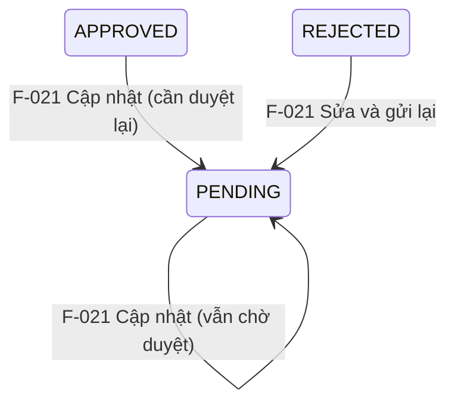

# Quản lý Cầu cảng - Cập nhật

## Summary

Hệ thống cần cho phép người dùng có thẩm quyền cập nhật thông tin kỹ thuật của Cầu cảng (Pier) đã tồn tại nhằm đảm bảo cơ sở dữ liệu phản ánh đúng tình trạng thực tế sau bảo trì, cải tạo hoặc nâng cấp tải trọng. Giải pháp sử dụng biểu mẫu giống hệt Tạo mới (F-020) nhưng có các điểm khác biệt sau: (1) dữ liệu được điền sẵn từ API `GET /api/v1/cau-cang/:id`; (2) ba trường `orgUnitId`, `portId`, `pierCode` ở trạng thái disabled (không thể sửa); (3) hiển thị danh sách file đã đính kèm trước đó, cho phép thêm/xóa; (4) sau khi lưu, `approvalStatus` tự động quay về `PENDING`, yêu cầu phê duyệt lại qua F-023; (5) mọi thay đổi được ghi nhật ký chi tiết vào bảng `ChangeLog`. Giải pháp cung cấp validation chặt chẽ các trường kỹ thuật (designLoad, length, width, structureType, primaryMaterial), ràng buộc thay đổi `berthId` khi có dữ liệu liên quan, và cảnh báo khi Pier đang trong trạng thái đặc biệt (PENDING / soft-deleted). Thành công được đo bằng độ chính xác của dữ liệu kỹ thuật Pier trong CSDL, tính đầy đủ của nhật ký kiểm toán, và khả năng truy vết mọi thay đổi qua vòng đời phê duyệt.

## Scope

| | Items |
|---|---|
| In scope | Giao diện tra cứu và chọn Pier cần cập nhật; Biểu mẫu cập nhật với dữ liệu hiện tại được điền sẵn từ API detail; Ba trường disabled (orgUnitId, portId, pierCode); Validation các trường kỹ thuật (designLoad, length, width, structureType, primaryMaterial, maxWaterLevel); Kiểm tra ràng buộc berthId trước khi lưu; Hiển thị file đã đính kèm + thêm/xóa file; Ghi nhật ký thay đổi tự động (ChangeLog) cho từng trường; Tự động reset approvalStatus về PENDING sau cập nhật; Thông báo kết quả cập nhật cho người dùng; Cảnh báo khi Pier đang trong trạng thái approvalStatus = PENDING hoặc soft-deleted |
| Out of scope | Thay đổi mã pierCode sau khi tạo (không cho phép); Quy trình phê duyệt thay đổi lớn (F-023); Xóa Pier (F-022); Xem lịch sử tất cả phiên bản (F-025); Xuất báo cáo lịch sử cập nhật; Tính toán lại an toàn kết cấu sau cập nhật |
| Assumptions | Người dùng đã đăng nhập và có quyền thuộc đúng orgUnitId của Pier; Pier đã tồn tại trong hệ thống (được tạo qua F-020); pierCode là khóa bất biến sau khi tạo; berthId đích đã tồn tại trong hệ thống; File đính kèm được quản lý riêng qua service upload |

## User Stories

| US-ID | Actor | Goal | Value | Priority |
|---|---|---|---|---|
| US-021-01 | Quản trị viên / Quản lý cảng | Truy cập biểu mẫu cập nhật Pier từ danh sách hoặc trang chi tiết, với dữ liệu được điền sẵn | Không cần nhập lại toàn bộ thông tin, tiết kiệm thời gian tác nghiệp | Must Have |
| US-021-02 | Quản trị viên / Quản lý cảng | Chỉnh sửa thông tin kỹ thuật Pier (pierName, length, width, designLoad, structureType, primaryMaterial, maxWaterLevel, ghi chú) với dữ liệu cũ được điền sẵn; ba trường khóa (orgUnitId, portId, pierCode) hiển thị disabled | Giảm lỗi nhập liệu, đảm bảo thay đổi có chủ ý và đúng ràng buộc kỹ thuật | Must Have |
| US-021-03 | Quản trị viên / Quản lý cảng | Thay đổi berthId của Pier với kiểm tra ràng buộc dữ liệu liên quan | Đảm bảo tính toàn vẹn dữ liệu khi tái cấu trúc phân cấp cảng-bến-cầu | Must Have |
| US-021-04 | Quản trị viên / Quản lý cảng | Nhận cảnh báo khi Pier đang trong trạng thái approvalStatus = PENDING hoặc soft-deleted trước khi thực hiện cập nhật | Tránh tạo xung đột với quy trình phê duyệt đang chạy | Must Have |
| US-021-05 | Hệ thống (tự động) | Ghi nhật ký thay đổi chi tiết (từng trường) sau mỗi lần cập nhật thành công và tự động reset approvalStatus về PENDING | Đảm bảo truy vết kiểm toán, mọi thay đổi phải được duyệt lại | Must Have |
| US-021-06 | Quản trị viên / Quản lý cảng | Nhận thông báo lỗi rõ ràng khi nhập liệu vi phạm validation rules hoặc khi cố gắng thay đổi trường bị khóa | Người dùng tự sửa lỗi mà không cần hỗ trợ kỹ thuật | Must Have |

## Acceptance Criteria

| AC-ID | US-ref | Scenario | Given / When / Then | Constraints |
|---|---|---|---|---|
| AC-021-01 | US-021-01 | Truy cập cập nhật từ danh sách | Given người dùng có role Admin hoặc Quan_ly_cang đang ở trang danh sách Pier; When nhấn nút "Cập nhật" trên một hàng; Then hệ thống gọi GET /api/v1/cau-cang/:id, load toàn bộ dữ liệu hiện tại (kèm danh sách file đính kèm) và điền sẵn vào biểu mẫu; ba trường orgUnitId, portId, pierCode hiển thị disabled | Chỉ Admin và Quan_ly_cang thấy nút cập nhật; user phải thuộc đúng orgUnitId |
| AC-021-02 | US-021-01 | Truy cập cập nhật từ trang chi tiết | Given người dùng có quyền đang ở trang chi tiết Pier; When nhấn nút "Chỉnh sửa"; Then biểu mẫu cập nhật hiển thị với dữ liệu hiện tại được điền sẵn, các trường khóa disabled | Người dùng không có quyền không thấy nút chỉnh sửa |
| AC-021-03 | US-021-01 | Từ chối truy cập với role không đủ quyền | Given người dùng có role Nhan_vien_van_hanh hoặc không thuộc orgUnitId của Pier; When cố truy cập URL cập nhật trực tiếp; Then hệ thống trả về HTTP 403 và không hiển thị biểu mẫu | Kiểm tra phân quyền server-side, không chỉ UI |
| AC-021-04 | US-021-02 | Mã pierCode không thể thay đổi | Given biểu mẫu cập nhật đang hiển thị; When người dùng cố gắng sửa trường pierCode; Then trường pierCode ở trạng thái disabled (read-only), không nhận input | Áp dụng cả ở frontend lẫn backend validation |
| AC-021-05 | US-021-02 | Cập nhật thông tin kỹ thuật hợp lệ lưu thành công, approvalStatus về PENDING | Given người dùng nhập pierName mới hợp lệ và designLoad hợp lệ; When nhấn "Cập nhật"; Then hệ thống lưu dữ liệu, approvalStatus tự động chuyển về PENDING (kể cả trước đó là APPROVED), cập nhật updatedAt, hiển thị thông báo thành công | updatedAt được hệ thống tự gán; nếu Pier trước đó APPROVED thì tạm thời không khả dụng trong dropdown module khác cho đến khi được duyệt lại |
| AC-021-06 | US-021-02 | Validation designLoad | Given người dùng nhập designLoad ≤ 0 hoặc > 20 T/m²; When nhấn "Cập nhật"; Then hệ thống hiển thị lỗi "Tải trọng thiết kế phải là số dương không vượt quá 20 T/m²", không lưu dữ liệu | Đơn vị T/m² |
| AC-021-07 | US-021-02 | Validation kích thước Pier | Given người dùng nhập length hoặc width ≤ 0 hoặc > 500m; When nhấn "Cập nhật"; Then hệ thống hiển thị lỗi tương ứng cho từng trường, không lưu dữ liệu | Áp dụng cho cả chiều dài và chiều rộng |
| AC-021-08 | US-021-03 | Cảnh báo khi thay đổi berthId có dữ liệu liên quan | Given Pier đang có lượt tàu neo đậu hoặc lịch sử kiểm tra kết cấu liên kết; When người dùng thay đổi trường berthId; Then hệ thống hiển thị cảnh báo "Cầu cảng đang có dữ liệu liên quan, thay đổi Bến cảng mẹ yêu cầu phê duyệt" và không cho phép lưu trực tiếp | Yêu cầu quy trình phê duyệt đặc biệt (F-023) |
| AC-021-09 | US-021-03 | Thay đổi berthId khi chưa có dữ liệu liên quan | Given Pier chưa có dữ liệu liên quan (lượt tàu, kiểm tra kết cấu); When người dùng thay đổi berthId sang Bến cảng tồn tại khác và nhấn "Cập nhật"; Then hệ thống lưu thành công, ghi nhật ký thay đổi berthId vào ChangeLog | Bến cảng đích phải tồn tại trong hệ thống |
| AC-021-10 | US-021-04 | Cảnh báo khi Pier đang có approvalStatus = PENDING | Given Pier có approvalStatus = PENDING; When người dùng mở biểu mẫu cập nhật; Then hệ thống hiển thị cảnh báo "Cầu cảng đang trong quá trình phê duyệt" nhưng vẫn cho phép tiếp tục nếu người dùng xác nhận | Cảnh báo, không chặn hoàn toàn |
| AC-021-11 | US-021-04 | Chặn cập nhật Pier đã soft-deleted | Given Pier đã bị xóa mềm (deletedAt IS NOT NULL); When người dùng cố truy cập biểu mẫu cập nhật; Then hệ thống hiển thị thông báo lỗi "Cầu cảng đã bị xóa, không thể cập nhật" và không hiển thị biểu mẫu | |
| AC-021-12 | US-021-05 | Ghi nhật ký sau cập nhật thành công | Given người dùng vừa lưu thành công một thay đổi; When kiểm tra bảng ChangeLog; Then tồn tại bản ghi chứa: pierId, fieldChanged, oldValue, newValue, changedBy (user ID), changedAt với actionType = UPDATE | Mỗi trường thay đổi tạo một bản ghi riêng; các trường không thay đổi không ghi |
| AC-021-13 | US-021-05 | Nhật ký ChangeLog không thể xóa hoặc sửa | Given bản ghi nhật ký đã được ghi; When bất kỳ actor nào cố gắng DELETE hoặc UPDATE bản ghi trong ChangeLog qua API; Then hệ thống từ chối với HTTP 405 hoặc 403 | Áp dụng cả với role Admin |
| AC-021-14 | US-021-06 | Thông báo lỗi rõ ràng khi validation thất bại | Given người dùng nhập dữ liệu không hợp lệ hoặc cố sửa trường disabled; When nhấn "Cập nhật"; Then hệ thống highlight trường lỗi và hiển thị thông điệp lỗi tiếng Việt cụ thể theo từng loại vi phạm | Trường disabled vẫn gửi lên backend nhưng backend bỏ qua giá trị |

## Business Rules

| BR-ID | Rule | Applies to | Exception |
|---|---|---|---|
| BR-021-01 | **Cùng đơn vị quản lý:** Chỉ người dùng thuộc đúng orgUnitId của Pier mới có quyền chỉnh sửa. Backend kiểm tra orgUnitId của user khớp với orgUnitId của Pier; nếu không khớp, trả về HTTP 403. | AC-021-01, AC-021-03 | Không có ngoại lệ |
| BR-021-02 | **Reset phê duyệt khi cập nhật:** Sau khi cập nhật thành công, approvalStatus tự động chuyển về PENDING bất kể trạng thái trước đó là APPROVED hay REJECTED. Nếu Pier trước đó là APPROVED, Pier tạm thời không khả dụng trong dropdown chọn Pier của module khác cho đến khi được duyệt lại qua F-023. | AC-021-05 | Pier đã có approvalStatus = PENDING vẫn giữ nguyên PENDING |
| BR-021-03 | **Ghi nhật ký thay đổi (ChangeLog):** Mọi lần cập nhật đều tạo bản ghi ChangeLog với actionType = 'UPDATE', ghi lại từng trường bị thay đổi (fieldChanged, oldValue, newValue, changedBy, changedAt). Nhật ký không thể xóa hoặc sửa bởi bất kỳ actor nào. Ghi nhật ký và cập nhật Pier phải nằm trong cùng một transaction. | AC-021-12, AC-021-13 | Chỉ ghi các trường thực sự thay đổi; trường không đổi không ghi |
| BR-021-04 | **pierCode bất biến:** pierCode là bất biến sau khi Pier được tạo; không có API nào được phép cập nhật trường này; thay đổi pierCode yêu cầu hủy bỏ Pier và tạo mới. Trường pierCode hiển thị disabled trên form. | AC-021-04, AC-021-05 | Không có ngoại lệ |
| BR-021-05 | **Validation designLoad:** designLoad phải là giá trị dương (> 0), đơn vị T/m², không vượt quá 20 T/m². | AC-021-06 | Không áp dụng nếu trường không được cung cấp (optional field) |
| BR-021-06 | **Validation kích thước:** length và width phải là giá trị dương (> 0), đơn vị m, không vượt quá 500m. | AC-021-07 | Không áp dụng nếu trường không được cung cấp (optional field) |
| BR-021-07 | **Thay đổi berthId:** Việc thay đổi berthId chỉ được phép nếu Pier chưa có dữ liệu liên quan (lượt tàu neo đậu, lịch sử kiểm tra kết cấu); nếu có dữ liệu liên quan, yêu cầu quy trình phê duyệt đặc biệt (F-023). | AC-021-08, AC-021-09 | Không có ngoại lệ |
| BR-021-08 | **Kiểm soát trạng thái + phân quyền + timestamp:** (a) Pier đã soft-deleted (deletedAt IS NOT NULL) không được phép cập nhật; Pier có approvalStatus = PENDING hiển thị cảnh báo nhưng không chặn cập nhật. (b) Chỉ người dùng có role Admin hoặc Quan_ly_cang mới được phép thực hiện cập nhật; kiểm tra phải được thực thi ở tầng API, không chỉ UI. (c) Trường updatedAt được hệ thống tự động cập nhật timestamp hiện tại sau mỗi lần lưu thành công; người dùng không thể tự đặt giá trị này. | AC-021-01, AC-021-02, AC-021-03, AC-021-10, AC-021-11 | Không có ngoại lệ với soft-deleted |

## State Diagram

Trạng thái approvalStatus của Pier khi thực hiện cập nhật:

> **Lưu ý:** Pier đã duyệt (APPROVED) mà bị sửa → approvalStatus quay về PENDING → **tạm thời không khả dụng** trong dropdown chọn Pier của module khác (Quản lý tài sản, Vận hành, Bảo trì...) cho đến khi được duyệt lại qua F-023.

## Non-Functional Requirements

| Area | Requirement | Target |
|---|---|---|
| Performance | API cập nhật (bao gồm validation + kiểm tra ràng buộc berthId + ghi ChangeLog + reset approvalStatus) phải hoàn thành trong thời gian chấp nhận được | ≤ 2 giây (p95) |
| Security | Phân quyền server-side bắt buộc; trường pierCode được bảo vệ ở tầng API (backend bỏ qua nếu có trong payload); ChangeLog immutable | HTTP 403 khi không có quyền; audit log immutable |
| Reliability | Ghi ChangeLog và cập nhật bản ghi Pier phải nằm trong một transaction; nếu một phần thất bại, toàn bộ rollback | 100% consistency giữa Pier và ChangeLog |
| Audit/Logging | Mỗi lần cập nhật thành công ghi đầy đủ: pierId, fieldChanged, oldValue, newValue, changedBy, changedAt, actionType = 'UPDATE' | 100% coverage cho mọi trường bị thay đổi |
| Operability | Thông báo lỗi validation rõ ràng bằng tiếng Việt, tương ứng từng trường; không để lộ stack trace cho người dùng | N/A |

## Test Scenarios

| TS-ID | AC-ref | Scenario | Type |
|---|---|---|---|
| TS-021-01 | AC-021-01 | Happy path: Admin truy cập cập nhật từ danh sách, biểu mẫu load đúng dữ liệu hiện tại của Pier, 3 trường khóa disabled | Integration |
| TS-021-02 | AC-021-03 | Negative: Role Nhan_vien_van_hanh gọi PUT /api/v1/cau-cang/{id} → HTTP 403 | Security / Integration |
| TS-021-03 | AC-021-04 | Negative: Gửi payload có trường pierCode khác → backend bỏ qua / từ chối thay đổi | Unit / Integration |
| TS-021-04 | AC-021-05 | Happy path: Cập nhật pierName và structureType hợp lệ → 200 OK, approvalStatus về PENDING, updatedAt được cập nhật | Integration |
| TS-021-05 | AC-021-06 | Negative: designLoad = -5 và designLoad = 25 → lỗi validation tương ứng, HTTP 400 | Unit |
| TS-021-06 | AC-021-07 | Negative: length = -10 và length = 600 → lỗi validation tương ứng, HTTP 400 | Unit |
| TS-021-07 | AC-021-08 | Negative: Thay đổi berthId khi Pier có lượt tàu neo đậu → HTTP 422 với cảnh báo ràng buộc | Integration |
| TS-021-08 | AC-021-09 | Happy path: Thay đổi berthId khi Pier chưa có dữ liệu liên quan → lưu thành công, ChangeLog ghi berthId | Integration |
| TS-021-09 | AC-021-10 | Edge: Cập nhật Pier có approvalStatus = PENDING → cảnh báo hiển thị, người dùng xác nhận → lưu thành công, approvalStatus vẫn là PENDING | Integration / UI |
| TS-021-10 | AC-021-11 | Negative: Pier đã soft-deleted (deletedAt != null) → HTTP 422 với thông báo lỗi phù hợp | Integration |
| TS-021-11 | AC-021-12 | Audit: Sau cập nhật thành công, ChangeLog có đúng số bản ghi bằng số trường thay đổi, actionType = 'UPDATE' | Integration |
| TS-021-12 | AC-021-13 | Security: Gọi DELETE /api/v1/change-log/{id} với role Admin → HTTP 403 hoặc 405 | Security |
| TS-021-13 | AC-021-12 | Transaction: Nếu ghi ChangeLog thất bại → cập nhật Pier rollback, không có dữ liệu không nhất quán | Integration |

## Pipeline Triage

| Question | Answer | Rationale |
|---|---|---|
| Domain model affected? | No - existing | Sử dụng entity Pier và ChangeLog đã được định nghĩa tại F-020; không tạo aggregate root, bounded context, hoặc domain event mới |
| Architecture affected? | No | CRUD cập nhật trên entity hiện có; cùng pattern với F-020 (tạo mới) và F-009 (cập nhật Cảng biển); ghi ChangeLog trong transaction là pattern đã có |
| Implementation clear? | Yes | Pattern PUT API + transactional audit log + ràng buộc berthId là kiến trúc đã được thiết lập; cần lưu ý reset approvalStatus về PENDING và disable 3 trường khóa; không cần quyết định kiến trúc mới |
| **Verdict** | `Ready for Technical Lead planning` | Thay đổi chỉ mở rộng entity hiện có (F-020 đã định nghĩa Pier + ChangeLog), không có quyết định kiến trúc mới, implementation approach rõ ràng từ pattern F-009/F-020 |
