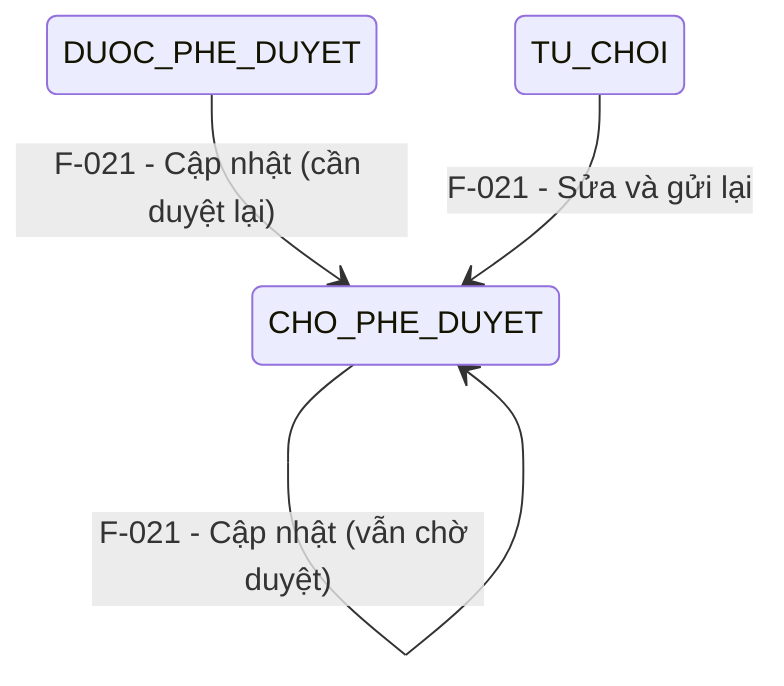

# Đặc tả nghiệp vụ: Cập nhật Cầu cảng

**Tài liệu:** BA Feature Brief
**Feature:** F-021
**Module:** M-002 — Quản lý tài sản KCHTGT Cảng & Bến
**Người viết:** Business Analyst
**Ngày cập nhật:** 2026-07-29

---

## 1. Tổng quan

### 1.1. Tính năng này làm gì?

Cho phép người dùng có thẩm quyền chỉnh sửa thông tin của một Cầu cảng đã tồn tại. **Form và trường dữ liệu giống hệt form Tạo mới (F-020)**, chỉ khác ở các điểm dưới đây.

### 1.2. Luồng hoạt động chính

1. Người dùng chọn một cầu cảng từ danh sách (F-078) → click "Sửa".
2. Hệ thống gọi GET detail để load toàn bộ dữ liệu hiện tại, điền sẵn vào form.
3. Người dùng chỉnh sửa các trường được phép.
4. Người dùng chọn một trong ba hành động lưu (giống F-020).
5. Sau khi cập nhật, trạng thái phê duyệt quay về CHO_PHE_DUYET → cần duyệt lại.

---

## 2. Khác biệt so với Tạo mới (F-020)

> Tham khảo đầy đủ các trường, validation, và UI tại tài liệu F-020. Dưới đây chỉ liệt kê các điểm **khác biệt**.

### 2.1. Trường bị khóa (disabled/read-only)

| Trường | Trạng thái | Lý do |
|---|---|---|
| Đơn vị quản lý | **Disabled** | Không được thay đổi đơn vị quản lý sau khi tạo |
| Thuộc cảng biển | **Disabled** | Không được thay đổi cảng biển cha sau khi tạo |
| Mã cầu cảng | **Disabled** (hiển thị) | Mã là định danh duy nhất, không thể sửa |

### 2.2. Dữ liệu khởi tạo

- **Tạo mới:** Form mở với tất cả trường rỗng.
- **Cập nhật:** Form được điền sẵn toàn bộ dữ liệu hiện tại từ API `GET /api/v1/cau-cang/:id`.

### 2.3. File đính kèm

- **Tạo mới:** Khu vực upload trống, chỉ có nút thêm mới.
- **Cập nhật:** Hiển thị danh sách file đã upload trước đó (kèm `fileUrl`, `fileSize`, `key`). Có thể thêm file mới hoặc xóa file cũ.

### 2.4. Nút hành động

| Tạo mới (F-020) | Cập nhật (F-021) |
|---|---|
| "Lưu tạm" | "Cập nhật" |
| "Lưu và gửi phê duyệt" | "Cập nhật và gửi phê duyệt" |
| "Lưu và phê duyệt" | "Cập nhật và phê duyệt" |

### 2.5. API

| | Tạo mới | Cập nhật |
|---|---|---|
| Method | `POST` | `PUT` |
| Endpoint | `/api/v1/cau-cang?action=...` | `/api/v1/cau-cang/:id?action=...` |
| Load dữ liệu | Không cần | `GET /api/v1/cau-cang/:id` |

---

## 3. Quy tắc nghiệp vụ bổ sung (so với F-020)

**BR-021-01 — Chỉ user cùng đơn vị mới được sửa:** Chỉ người dùng thuộc đúng `donViQuanLy` của cầu cảng mới có quyền chỉnh sửa. Backend kiểm tra `donViQuanLy` của user khớp với `donViQuanLy` của cầu cảng.

**BR-021-02 — Sửa xong phải duyệt lại:** Sau khi cập nhật, `trangThaiPheDuyet` tự động quay về `CHO_PHE_DUYET`. Cầu cảng đang ở trạng thái DUOC_PHE_DUYET mà bị sửa sẽ **tạm thời biến mất** khỏi dropdown chọn cầu cảng của các module khác cho đến khi được duyệt lại (F-023).

**BR-021-03 — Ghi nhật ký thay đổi:** Mọi lần cập nhật đều tạo bản ghi `LichSuThayDoi` với `actionType = CAP_NHAT`, ghi lại từng trường bị thay đổi (fieldChanged, oldValue, newValue, changedBy, changedAt).

---

## 4. Vòng đời & liên kết

> ⚠ **Lưu ý cho dev:** Cầu cảng đã duyệt (DUOC_PHE_DUYET) mà bị sửa → trạng thái quay về CHO_PHE_DUYET → **tạm thời không khả dụng** trong dropdown của module khác (Quản lý tài sản, Vận hành, Bảo trì...) cho đến khi được duyệt lại qua F-023.

### Các tính năng liên quan

| Feature | Liên kết |
|---|---|
| **F-020** | Form giống hệt — tham khảo toàn bộ trường, validation, UI |
| **F-023** | Sau khi cập nhật, cần phê duyệt lại |
| **F-024** | Xem chi tiết — có nút "Chỉnh sửa" điều hướng đến F-021 |
| **F-025** | Lịch sử thay đổi — ghi nhận mọi lần cập nhật |

---

## 5. API Endpoints

| Method | Endpoint | Mô tả |
|---|---|---|
| GET | `/api/v1/cau-cang/:id` | Load dữ liệu hiện tại để điền sẵn vào form |
| PUT | `/api/v1/cau-cang/:id?action=LUU_TAM` | Cập nhật (không gửi duyệt) |
| PUT | `/api/v1/cau-cang/:id?action=LUU_VA_GUI_PHE_DUYET` | Cập nhật và gửi duyệt |
| PUT | `/api/v1/cau-cang/:id?action=LUU_VA_PHE_DUYET` | Cập nhật và phê duyệt ngay (Admin/Lãnh đạo) |

---

## 6. Yêu cầu giao diện người dùng

### 6.1. Màn hình Cập nhật Cầu cảng

Màn hình dùng chung component `FormCrud` với `formMode=EDIT`. **Bố cục, màu sắc, collapsible giống hệt F-020.** Các điểm khác biệt:

1. **ScreenHeader:** "Quản lý KCHT Hàng Hải > Quản lý cầu cảng > Sửa: [tên cầu cảng]".

2. **Form fields pre-filled:** Toàn bộ trường được điền sẵn từ API detail. Các trường bị khóa (đơn vị QL, cảng biển, mã CC) hiển thị disabled.

3. **File đính kèm:** Hiển thị file đã upload + cho phép thêm/xóa.

4. **Form actions:**
   - Nút **"Cập nhật"** (textSecondary, pill outline) — Lưu không gửi duyệt
   - Nút **"Cập nhật và gửi phê duyệt"** (actionPrimary, pill) — **Hành động chính**
   - Nút **"Cập nhật và phê duyệt"** (actionPrimary, pill) — Chỉ Admin/Lãnh đạo
   - Nút **"Hủy"** (textSecondary, pill outline) — Quay về danh sách

---

*Tham khảo toàn bộ trường dữ liệu, validation, mô hình dữ liệu, phi chức năng, và UI chi tiết tại tài liệu F-020.*
