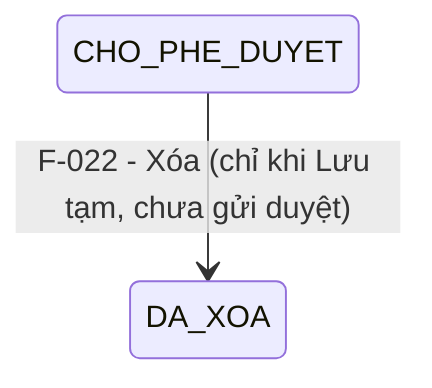

# Đặc tả nghiệp vụ: Xóa Cầu cảng

**Tài liệu:** BA Feature Brief
**Feature:** F-022
**Module:** M-002 — Quản lý tài sản KCHTGT Cảng & Bến
**Người viết:** Business Analyst
**Ngày cập nhật:** 2026-07-29

---

## 1. Tổng quan

### 1.1. Tính năng này làm gì?

Cho phép Admin và Lãnh đạo xóa mềm (soft delete) một Cầu cảng khỏi danh sách hoạt động. Cầu cảng bị xóa **không bị xóa vật lý** — dữ liệu vẫn tồn tại trong CSDL để phục vụ kiểm toán và truy vết.

### 1.2. Luồng hoạt động chính

1. Người dùng (Admin/Lãnh đạo) chọn "Xóa" trên dòng cầu cảng trong danh sách (F-078).
2. Hệ thống hiển thị hộp thoại xác nhận kèm thông tin cầu cảng và cảnh báo.
3. Hệ thống kiểm tra ràng buộc dữ liệu liên quan.
4. Nếu có dữ liệu liên quan → chặn xóa, hiển thị cảnh báo chi tiết.
5. Nếu không → người dùng xác nhận → `DELETE /api/v1/cau-cang/:id`.
6. Backend set `deletedAt = now()` → cầu cảng biến mất khỏi danh sách.

---

## 2. Khác biệt so với các tính năng khác

### 2.1. Xóa mềm (soft delete)

- **Không xóa vật lý** bản ghi khỏi database.
- Chỉ set `deletedAt = current_timestamp`, `deletedBy = current_user`.
- Cầu cảng bị xóa **không còn hiển thị** ở bất kỳ đâu trong hệ thống (danh sách, chi tiết, dropdown...).

### 2.2. Chỉ xóa được khi ở trạng thái Lưu tạm

| Trạng thái | Được xóa? | Lý do |
|---|---|---|
| CHO_PHE_DUYET (Lưu tạm) | ✅ Có | Cầu cảng chưa được duyệt, chưa có dữ liệu liên quan |
| CHO_PHE_DUYET (đã gửi duyệt) | ❌ Không | Đã gửi duyệt, không thể xóa |
| DUOC_PHE_DUYET | ❌ Không | Đã được duyệt, có thể đã có dữ liệu liên quan |
| TU_CHOI | ❌ Không | Cần sửa và gửi duyệt lại, không xóa |

### 2.3. Kiểm tra ràng buộc trước khi xóa

| Ràng buộc | Xử lý |
|---|---|
| Cầu cảng **đang có dữ liệu liên quan** (tài sản, vận hành, bảo trì, sự cố) | ⛔ **Chặn xóa** — hiển thị danh sách dữ liệu liên quan, yêu cầu xử lý trước |
| Cầu cảng **đã bị xóa** (`deletedAt != null`) | ⛔ **Chặn xóa** — thông báo "Cầu cảng đã bị xóa trước đó" |
| Cầu cảng **không có dữ liệu liên quan** | ✅ Cho phép xóa sau khi xác nhận |

### 2.3. Dữ liệu liên quan không tự động xóa cascade

> ⚠ **Rule 4 (từ QLKC_040):** Nếu xóa cầu cảng, toàn bộ dữ liệu liên quan (tài sản, vận hành, bảo trì) **không tự động xóa** — cần xử lý riêng. Dev phải kiểm tra ràng buộc dữ liệu trước khi cho phép xóa.

---

## 3. Quy tắc nghiệp vụ

**BR-022-01 — Chỉ Admin và Lãnh đạo mới được xóa:** Nút "Xóa" chỉ hiển thị cho vai trò Admin và Lãnh đạo. Backend kiểm tra quyền trước khi thực hiện DELETE.

**BR-022-02 — Chỉ xóa được ở trạng thái Lưu tạm:** Chỉ cầu cảng ở trạng thái CHO_PHE_DUYET và chưa được gửi duyệt mới có thể bị xóa. Cầu cảng đã gửi duyệt, đã duyệt, hoặc bị từ chối không được phép xóa.

**BR-022-03 — Xóa mềm, không xóa vật lý:** Xóa cầu cảng là soft delete (`deletedAt` được set). Bản ghi vẫn tồn tại trong database để phục vụ kiểm toán, nhưng không hiển thị ở bất kỳ đâu trong hệ thống.

**BR-022-03 — Kiểm tra dữ liệu liên quan trước khi xóa:** Nếu cầu cảng đang có dữ liệu liên quan (tài sản, vận hành, bảo trì, sự cố) chưa được xử lý, hệ thống chặn xóa và hiển thị cảnh báo chi tiết.

**BR-022-04 — Không tự động xóa cascade:** Xóa cầu cảng không tự động xóa dữ liệu liên quan. Người dùng phải xử lý hoặc di chuyển dữ liệu liên quan trước khi xóa cầu cảng.

**BR-022-05 — Ghi nhật ký xóa:** Mọi thao tác xóa đều tạo bản ghi `LichSuThayDoi` với `actionType = XOA_MEM`.

---

## 4. Vòng đời & liên kết

> Cầu cảng chỉ có thể bị xóa khi đang ở trạng thái CHO_PHE_DUYET và chưa được gửi duyệt. Các trạng thái khác (đã gửi duyệt, đã duyệt, từ chối) không cho phép xóa.

### Các tính năng liên quan

| Feature | Liên kết |
|---|---|
| **F-025** | Lịch sử — ghi nhận thao tác xóa với actionType = XOA_MEM |
| **F-078** | Danh sách — cầu cảng bị xóa không hiển thị (filter `deletedAt IS NULL`) |

---

## 5. API Endpoints

| Method | Endpoint | Mô tả | Phân quyền |
|---|---|---|---|
| DELETE | `/api/v1/cau-cang/:id` | Xóa mềm cầu cảng (set deletedAt) | Admin, Lãnh đạo |

---

## 6. Yêu cầu giao diện người dùng

### 6.1. Hộp thoại xác nhận xóa

Hiển thị khi người dùng click "Xóa" từ danh sách:

1. **Thông tin cầu cảng:** Mã, Tên, Loại, Trạng thái hiện tại.
2. **Cảnh báo:** "Hành động này sẽ xóa cầu cảng khỏi danh sách hoạt động. Dữ liệu vẫn được lưu trữ để phục vụ kiểm toán."
3. **Nếu có dữ liệu liên quan:** Hiển thị danh sách các module đang tham chiếu đến cầu cảng này, kèm thông báo "Vui lòng xử lý dữ liệu liên quan trước khi xóa."
4. **Xác nhận:** Người dùng phải nhập tên cầu cảng vào ô xác nhận trước khi nút "Xóa" được kích hoạt.
5. **Nút hành động:**
   - Nút **"Xóa"** (đỏ, pill) — Chỉ enabled sau khi nhập đúng tên cầu cảng
   - Nút **"Hủy"** (textSecondary, pill outline) — Đóng hộp thoại

### 6.2. Sau khi xóa

- Toast: "Xóa cầu cảng thành công".
- Danh sách F-078 tự động làm mới, cầu cảng không còn hiển thị.
- Nếu đang ở trang chi tiết F-024 → redirect về danh sách.
