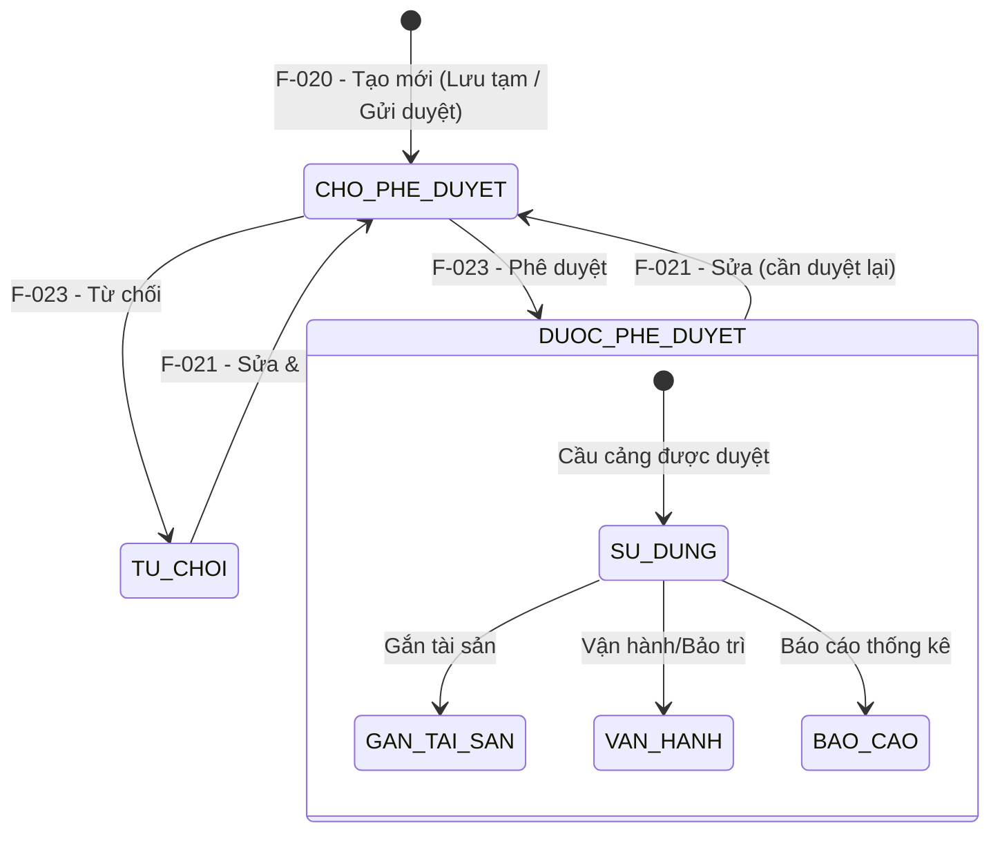

# Đặc tả nghiệp vụ: Xem chi tiết Cầu cảng

**Tài liệu:** BA Feature Brief
**Feature:** F-024
**Module:** M-002 — Quản lý tài sản KCHTGT Cảng & Bến
**Người viết:** Business Analyst
**Ngày cập nhật:** 2026-07-29

---

## 1. Tổng quan

### 1.1. Tính năng này làm gì?

Trang chi tiết hiển thị toàn bộ thông tin của một Cầu cảng cụ thể được chọn từ danh sách (F-078), bao gồm dữ liệu kỹ thuật, trạng thái phê duyệt, giấy tờ đính kèm và các hành động khả dụng theo vai trò. Trang ở chế độ read-only — mọi chỉnh sửa phải thực hiện qua F-081 (Cập nhật Cầu cảng).

### 1.2. Tại sao cần tính năng này?

Cung cấp giao diện xem chi tiết để tất cả các bên liên quan — từ nhân viên vận hành đến quản lý — có thể tiếp cận thông tin chính xác và cập nhật nhất về từng cầu cảng. Điều này hỗ trợ ra quyết định nhanh chóng trong vận hành cảng, kiểm toán tuân thủ và báo cáo quản lý, giúp giảm thiểu sai sót do thiếu thông tin.

### 1.3. Luồng hoạt động chính

1. Người dùng click vào mã hoặc tên cầu cảng trong danh sách (F-078).
2. Hệ thống gọi GET `/api/v1/cau-cang/:id` để lấy toàn bộ thông tin chi tiết (JOIN BenCang, GiayTo).
3. Trang chi tiết hiển thị đầy đủ các nhóm thông tin:
   - Thông tin định danh: mã cầu cảng, tên cầu cảng
   - Bến cảng mẹ: tên bến cảng kèm hyperlink đến trang chi tiết Bến cảng
   - Thông tin kỹ thuật: chiều dài, chiều rộng, loại cầu, loại kết cấu, vật liệu, tải trọng, mực nước
   - Trạng thái: badge màu cho trạng thái hoạt động và trạng thái phê duyệt
   - Metadata: người tạo, thời gian tạo, người cập nhật, thời gian cập nhật (chỉ Admin Cục)
   - Danh sách giấy tờ đính kèm (nếu có) với tên file, kích thước, loại file
4. Người dùng có thể thực hiện các hành động theo vai trò:
   - Tải xuống/in giấy tờ đính kèm
   - Leader/Admin: phê duyệt hoặc từ chối cầu cảng (khi trạng thái là CHO_PHE_DUYET)
   - Quản lý tài sản: chuyển đến trang chỉnh sửa (F-081)
   - Xem lịch sử thay đổi (F-098)
5. Breadcrumb: Trang chủ > Quản lý KCHT Hàng Hải > Quản lý cầu cảng > [tên cầu cảng].

---

## 2. Ai dùng? Dùng như thế nào?

Quyền thao tác và xem tính năng được áp dụng theo hệ thống phân quyền tập trung của hệ thống. Mỗi vai trò người dùng sẽ có phạm vi truy cập và thao tác khác nhau trên tính năng này, được kiểm soát bởi cơ chế RBAC (Role-Based Access Control).

### 2.1. Logic phân quyền chung

Các thao tác trong tính năng được bảo vệ bởi các quyền (permissions) tương ứng. Người dùng chỉ có thể thực hiện những thao tác mà vai trò của họ được cấp quyền (xem chi tiết tại tính năng Phân quyền). Mọi người dùng đã đăng nhập đều có quyền xem chi tiết cầu cảng — đây là quyền cơ bản nhất trong module.

### 2.2. Logic phân quyền đặc biệt cho tài khoản Admin Cục

Đối với tài khoản **Admin Cục**, áp dụng logic phân quyền đặc biệt sau:

- **Xem full dữ liệu:** Admin Cục có quyền xem toàn bộ dữ liệu trên hệ thống, không giới hạn phạm vi đơn vị hay khu vực.
- **Xem thông tin người chỉnh sửa:** Với mỗi bản ghi, Admin Cục thấy được thông tin người chỉnh sửa cuối cùng (họ tên, tên đăng nhập).
- **Xem thời gian cập nhật:** Admin Cục thấy được thời gian cập nhật cuối cùng của dữ liệu (timestamp).
- **Xem người tạo mới:** Admin Cục thấy được thông tin người tạo mới bản ghi (họ tên, tên đăng nhập).
- **Xem thời gian tạo mới:** Admin Cục thấy được thời gian tạo mới dữ liệu (timestamp).

> **Ghi chú:** Các trường `người tạo mới`, `thời gian tạo mới`, `người chỉnh sửa`, `thời gian cập nhật` cần được bổ sung vào bảng dữ liệu tương ứng và chỉ hiển thị đối với tài khoản Admin Cục. Với các vai trò khác, các trường này bị ẩn khỏi giao diện.

---

## 3. User Stories

Dưới đây là các câu chuyện người dùng, sắp xếp theo mức độ ưu tiên (Must > Should > Could):

### Mức Must (bắt buộc có)

- **US-024-01:** Là Nhân viên vận hành, tôi muốn xem toàn bộ thông tin chi tiết của một cầu cảng để nắm được tình trạng hiện tại phục vụ công tác vận hành.
- **US-024-02:** Là Quản lý tài sản, tôi muốn xem đầy đủ các trường kỹ thuật và trạng thái của cầu cảng để kiểm tra thông tin trước khi chỉnh sửa.
- **US-024-03:** Là Lãnh đạo, tôi muốn xem chi tiết cầu cảng và thực hiện phê duyệt/từ chối ngay trên trang chi tiết để tiết kiệm thời gian.

### Mức Should (nên có)

- **US-024-04:** Là Nhân viên vận hành, tôi muốn tải xuống hoặc in các giấy tờ đính kèm của cầu cảng để phục vụ công tác kiểm tra thực tế.
- **US-024-05:** Là Quản lý tài sản, tôi muốn xem lịch sử thay đổi của cầu cảng ngay từ trang chi tiết để biết ai đã thay đổi gì và khi nào.
- **US-024-06:** Là người dùng, tôi muốn có breadcrumb điều hướng rõ ràng để dễ dàng quay lại danh sách hoặc trang Bến cảng cha.

### Mức Could (có thể có sau)

- **US-024-07:** Là người dùng, tôi muốn xem trước (preview) file ảnh JPEG trực tiếp trên trang chi tiết thay vì phải tải xuống.

---

## 4. Yêu cầu chức năng (Acceptance Criteria)

Mỗi yêu cầu dưới đây mô tả một điều hệ thống phải làm được, kèm theo cách xử lý khi có lỗi hoặc dữ liệu không như mong đợi.

**AC-024-01 — Hiển thị đầy đủ thông tin:** Trang chi tiết hiển thị tất cả các trường của entity CauCang: maCau, tenCau, benCangId (tên + link), chieuDai, chieuRong, loaiCau, loaiKetCau, vatLieuChinh, taiTrongThietKe, mucNuocCaoNhat, ghiChu, trangThaiHoatDong, trangThaiPheDuyet, createdAt, updatedAt, createdBy, updatedBy. Nếu API trả về lỗi, hiển thị thông báo lỗi và nút "Thử lại".

**AC-024-02 — Link đến Bến cảng cha:** Trường benCangId hiển thị dưới dạng tên bến cảng kèm hyperlink trỏ đến trang chi tiết BenCang. Nếu bến cảng cha không tồn tại hoặc đã bị xóa, hiển thị tên kèm cảnh báo "(không khả dụng)".

**AC-024-03 — Badge trạng thái theo vòng đời:** Trạng thái hoạt động và trạng thái phê duyệt được hiển thị dưới dạng badge có màu sắc phân biệt, phản ánh đúng vị trí của cầu cảng trong vòng đời (xem mục 6.1):
- trangThaiHoatDong: xanh lá cho HIEN_HANH, vàng cho TAM_NGUNG
- trangThaiPheDuyet: vàng cho CHO_PHE_DUYET, xanh dương cho DUOC_PHE_DUYET, đỏ cho TU_CHOI

**AC-024-04 — Danh sách giấy tờ đính kèm:** Danh sách tệp đính kèm hiển thị tên file, kích thước, loại file và ngày upload. Mỗi file có nút "Tải xuống" và nút "In". Nếu không có file đính kèm, hiển thị "Không có giấy tờ đính kèm".

**AC-024-05 — Hành động theo trạng thái:** Các nút hành động hiển thị động theo trạng thái cầu cảng:
- Khi CHO_PHE_DUYET và người dùng là Leader/Admin: hiển thị "Phê duyệt" + "Từ chối"
- Khi DUOC_PHE_DUYET: ẩn nút phê duyệt/từ chối, hiển thị "Chỉnh sửa" (nếu có quyền)
- Khi TU_CHOI: ẩn nút phê duyệt/từ chối, hiển thị "Chỉnh sửa" (nếu có quyền)
- Nếu người dùng không có quyền tương ứng, nút tương ứng bị ẩn

**AC-024-06 — Breadcrumb điều hướng:** Breadcrumb hiển thị: Trang chủ > Quản lý KCHT Hàng Hải > Quản lý cầu cảng > [tên cầu cảng]. Click "Quản lý cầu cảng" quay lại danh sách F-078. Click tên Bến cảng (trong breadcrumb hoặc chi tiết) quay lại trang chi tiết BenCang.

**AC-024-07 — Metadata cho Admin Cục:** Admin Cục thấy được thông tin người tạo, thời gian tạo, người chỉnh sửa, thời gian cập nhật. Với các vai trò khác, các trường này bị ẩn.

---

## 5. Quy tắc nghiệp vụ (Business Rules)

Các quy tắc này là "luật chơi" mà mọi thành phần trong hệ thống phải tuân thủ:

**BR-024-01 — Xem được ở mọi trạng thái:** Cầu cảng ở bất kỳ trạng thái nào (CHO_PHE_DUYET, DUOC_PHE_DUYET, TU_CHOI, DA_XOA) đều có thể xem chi tiết. Trang chi tiết luôn hiển thị trạng thái hiện tại, không phải lịch sử cũ.

**BR-024-02 — Dữ liệu read-only:** Trang chi tiết là chế độ xem (read-only). Mọi chỉnh sửa phải thực hiện qua F-081 (Cập nhật Cầu cảng). Không có trường nào trên trang chi tiết cho phép nhập liệu trực tiếp.

**BR-024-03 — Phê duyệt từ trang chi tiết:** Leader/Admin có thể phê duyệt hoặc từ chối cầu cảng ngay từ trang chi tiết khi trạng thái là CHO_PHE_DUYET. Hành động này chuyển hướng đến F-082 để xác nhận trước khi thực hiện.

**BR-024-04 — Link Bến cảng cha:** Bến cảng cha hiển thị dưới dạng hyperlink. Nếu bến cảng cha đã bị xóa hoặc không còn hoạt động, hiển thị cảnh báo nhưng vẫn cho phép xem thông tin cầu cảng.

**BR-024-05 — Dữ liệu làm mới tự động:** Thông tin hiển thị trên trang chi tiết được làm mới mỗi khi người dùng truy cập, đảm bảo luôn hiển thị dữ liệu mới nhất. Không cache dữ liệu chi tiết giữa các lần truy cập.

**BR-024-06 — Hiển thị theo vòng đời:** Các nút hành động trên trang chi tiết thay đổi theo trạng thái hiện tại của cầu cảng. Điều này đảm bảo người dùng không thực hiện được hành động không phù hợp với giai đoạn hiện tại trong vòng đời.

**BR-024-07 — Cầu cảng đã duyệt mới dùng được ở module khác:** Nếu cầu cảng đang ở trạng thái CHO_PHE_DUYET hoặc TU_CHOI, trang chi tiết hiển thị cảnh báo "Cầu cảng chưa được phê duyệt, không khả dụng trong các module khác". Nếu ở trạng thái DUOC_PHE_DUYET, hiển thị "Cầu cảng đã được phê duyệt, đang khả dụng".

**BR-024-08 — Cầu cảng phụ thuộc trạng thái cha:** Nếu Bến cảng cha hoặc Cảng biển cha không còn hoạt động (bị xóa, TAM_NGUNG), trạng thái hoạt động của cầu cảng tự động chuyển sang TAM_NGUNG. Trang chi tiết hiển thị cảnh báo "Cầu cảng tạm ngừng hoạt động do Bến cảng/Cảng biển cha không còn khả dụng".

---

## 6. Vòng đời và liên kết với các tính năng khác

> ⚠ **QUAN TRỌNG CHO DEVELOPER:** Trang Xem chi tiết (F-024) là **điểm trung tâm** để xem thông tin cầu cảng và điều hướng đến các tính năng khác. Developer cần hiểu rõ vòng đời cầu cảng để hiển thị đúng trạng thái và hành động.

### 6.1. Vòng đời cầu cảng

Cầu cảng trải qua các trạng thái sau. Trang chi tiết (F-024) hiển thị chính xác vị trí hiện tại của cầu cảng trong vòng đời này:

### 6.2. Trạng thái hiển thị trên trang chi tiết

| Trạng thái | Mã | Badge màu | Hành động có thể thực hiện |
|---|---|---|---|
| Chờ phê duyệt | CHO_PHE_DUYET | Vàng | "Phê duyệt" + "Từ chối" (Leader/Admin), "Chỉnh sửa" (QLTS) |
| Đã phê duyệt | DUOC_PHE_DUYET | Xanh dương | "Chỉnh sửa" (QLTS) |
| Từ chối | TU_CHOI | Đỏ | "Chỉnh sửa" (QLTS) |
| Đã xóa | DA_XOA | Xám | Không có hành động nào |

### 6.3. Quan hệ với F-020 (Tạo mới Cầu cảng)

F-024 là trang đích sau khi tạo mới thành công từ F-020. F-024 hiển thị đúng trạng thái vừa được set từ F-020 (CHO_PHE_DUYET hoặc DUOC_PHE_DUYET).

---

## 7. Mô hình dữ liệu

Tính năng này chỉ đọc dữ liệu, không tạo hay sửa bảng. Các bảng được truy vấn:

> **Quy ước đánh dấu:**
> - 🔴 Chữ màu đỏ = **trường mới cần thêm** vào bảng hiện có.
> - ~~Chữ gạch ngang~~ = **trường không cần thiết**, cần loại bỏ khỏi bảng.
> - Các trường không được đánh dấu là các trường hiện có, được giữ nguyên.

### 7.1. Bảng CauCang — Thông tin Cầu cảng

Bảng chính được truy vấn để hiển thị toàn bộ thông tin cầu cảng. Dữ liệu được lưu thành 2 phần: root fields (lưu trực tiếp vào CauCang) và zobjDataSub (lưu trong COM_DATA_EXT).

> **Quy ước đánh dấu:**
> - 🔴 Chữ màu đỏ = **trường mới cần thêm** vào bảng hiện có.
> - ~~Chữ gạch ngang~~ = **trường không cần thiết**, cần loại bỏ khỏi bảng.
> - Các trường không được đánh dấu là các trường hiện có, được giữ nguyên.

#### A. Root fields — lưu trực tiếp vào CauCang

- **maCau:** mã cầu cảng (duy nhất, read-only)
- **tenCau:** tên cầu cảng
- **donViQuanLy:** đơn vị quản lý (SelectOrgCode)
- **cangBienId:** UUID, khóa ngoại đến Cảng biển
- **benCangId:** UUID, khóa ngoại đến Bến cảng
- **luongHhId:** UUID, khóa ngoại đến Luồng hàng hải (tùy chọn)
- **diaDiem:** địa điểm Tỉnh/TP (DM_DON_VI_HANH_CHINH)
- **diaDiemChiTiet:** địa điểm chi tiết (max 500 ký tự)
- **phanCap:** phân cấp công trình (PHAN_CAP_CONG_TRINH)
- **loaiKetCau:** loại kết cấu cầu cảng (LOAI_KET_CAU_BC_CC)
- **congNangKhaiThac:** công năng khai thác (multi-select, CONG_NANG_KHAI_THAC)
- **tinhTrang:** tình trạng (Dừng khai thác/vận hành), mặc định = 1 (Đang hoạt động)
- **trangThaiHoatDong:** trạng thái hoạt động (HIEN_HANH / TAM_NGUNG) → badge màu
- **trangThaiPheDuyet:** trạng thái phê duyệt (CHO_PHE_DUYET / DUOC_PHE_DUYET / TU_CHOI) → badge màu

#### B. zobjDataSub — Thông tin kỹ thuật (lưu trong COM_DATA_EXT)

- **chieuDai:** chiều dài (mét)
- **chieuRong:** chiều rộng (mét)
- **doSauKhuNuocHienTai:** độ sâu khu nước hiện tại (max 20 ký tự)
- **caoDoDayBenThietKe:** cao độ đáy bến thiết kế (max 20 ký tự)
- **coTauKhaiThacTheoCongBo:** cỡ tàu khai thác theo công bố - DWT (max 20 ký tự)

#### C. zobjDataSub — Thời điểm & kiểm định

- **thoiDiemPheDuyetQuyTrinhBaoTri:** thời điểm phê duyệt quy trình bảo trì (MM/YYYY)
- **thoiDiemChapThuanDanhGiaATCT:** thời điểm chấp thuận hồ sơ đánh giá ATCT gần nhất (MM/YYYY)
- **thoiDiemKiemDinhGanNhat:** thời điểm kiểm định gần nhất (MM/YYYY)

#### D. zobjDataSub — Số lượng & sản lượng

- **soLuongCCDangKhaiThac:** số lượng CC đang khai thác (số, max 5 chữ số)
- **soLuongCCDaCongBo:** số lượng CC đã công bố (số, max 5 chữ số)
- **soLuongCCDangThoaThuanDauTu:** số lượng CC đang thỏa thuận đầu tư XD (số, max 5 chữ số)
- **sanLuongHangThongQua:** sản lượng hàng thông qua (số thập phân)

#### E. zobjDataSub — Phương án bảo đảm ATHH

- **tiepNhanTauLonHonQDCB:** tiếp nhận tàu > thông số QĐ công bố (0:Không / 1:Có)
- **soVanBan:** số văn bản (bắt buộc khi tiepNhanTauLonHonQDCB = 1)
- **ngayVanBan:** ngày văn bản (bắt buộc khi tiepNhanTauLonHonQDCB = 1)

#### F. zobjDataSub — Công bố mở, đưa vào sử dụng

- **thoiDiemCongBoMoDuaVaoSD:** thời điểm công bố mở, đưa vào sử dụng
- **quyetDinhCongBo:** quyết định công bố / VB cho phép khai thác (max 200 ký tự)
- **vanBanThoaThuanDauTu:** văn bản thỏa thuận đầu tư XD (max 2000 ký tự)

#### G. Metadata & trạng thái

- **ghiChu:** ghi chú
- **createdBy:** UUID, người tạo — chỉ hiển thị cho Admin Cục
- **createdAt:** thời gian tạo
- **updatedBy:** UUID, người cập nhật — chỉ hiển thị cho Admin Cục
- **updatedAt:** thời gian cập nhật
- **deletedAt:** thời gian xóa mềm

### 7.2. Bảng BenCang — Bến cảng (JOIN)

Truy vấn JOIN để lấy tên bến cảng và tạo hyperlink.

### 7.3. Bảng GiayTo — Giấy tờ đính kèm

Truy vấn danh sách file đính kèm theo `entityType = "cau-cang"` và `entityId = cauCangId`. Các trường hiển thị: tenFile, kichThuoc, loaiFile, ngayUpload.

### 7.4. Các bảng phụ trợ

- **PheDuyetLog:** danh sách lịch sử phê duyệt của cầu cảng. Gồm: noiDungPheDuyet, ngayPheDuyet, canBoPheDuyet. Truy vấn theo cauCangId.
- **KCHTThuocCauCang:** danh sách kết cấu hạ tầng thuộc cầu cảng. Gồm: tenKCHT, loaiKCHT. Lọc theo loaiKCHT qua dropdown.
- **KeHoachVanHanh:** danh sách kế hoạch vận hành khai thác. Gồm: maKeHoach, tenKeHoach, ngayBatDau, ngayKetThuc. Truy vấn theo cauCangId.
- **KeHoachBaoTri:** danh sách kế hoạch bảo trì. Gồm: maKeHoach, tenKeHoach, thoiGianBatDau, thoiGianKetThuc. Truy vấn theo cauCangId.
- **SuCo:** danh sách sự cố. Gồm: maSuCo, loaiSuCo, diaDiem, thoiGian. Truy vấn theo cauCangId.

- **loaiDoiTuong:** loại đối tượng GIS (Điểm/Đường/Vùng)
- **bieuTuong:** biểu tượng bản đồ (icon)
- **heQuyChieu:** hệ quy chiếu (auto WGS_84)
- **quyTacHienThi:** quy tắc hiển thị tọa độ (auto Độ/Phút/Giây)
- **phamViKhuNuocNeoBuocTau:** phạm vi khu nước neo buộc tàu (max 2000 ký tự)
- **zlstDataGeo:** danh sách tọa độ GIS (kinh độ, vĩ độ)
- **zlstFileDk:** danh sách file đính kèm (PDF, ảnh...)

---

## 8. API Endpoints

Hệ thống cung cấp các API để phục vụ các thao tác liên quan đến tính năng:

| Method | Endpoint | Mô tả | Phân quyền |
|---|---|---|---|
| GET | `/api/v1/cau-cang/:id` | Lấy toàn bộ thông tin chi tiết cầu cảng (JOIN BenCang, GiayTo) | Tất cả người dùng đã đăng nhập |
| GET | `/api/v1/giay-to?entityType=cau-cang&entityId={id}` | Lấy danh sách giấy tờ đính kèm của cầu cảng | Tất cả người dùng đã đăng nhập |
| GET | `/api/v1/giay-to/:id/download` | Tải xuống file đính kèm | Tất cả người dùng đã đăng nhập |

---

## 9. Chi tiết nghiệp vụ từng phần

### 9.1. Trang chi tiết Cầu cảng

Trang chi tiết hiển thị toàn bộ thông tin của một cầu cảng, được tổ chức thành các nhóm. Màn hình sử dụng chế độ read-only, không có trường nào cho phép chỉnh sửa. Các nhóm thông tin phụ ở dạng collapsible, mặc định thu gọn.

#### A. Nhóm Thông tin cơ bản — mở rộng mặc định

| STT | Tên trường | Loại hiển thị | Mô tả |
| --- | --- | --- | --- |
| 1 | Mã cầu cảng | Text (read-only) | Hiển thị mã cầu cảng. Định danh duy nhất, không thể thay đổi. |
| 2 | Tên cầu cảng | Text (read-only) | Hiển thị tên cầu cảng. |
| 3 | Đơn vị quản lý | Text (read-only) | Hiển thị tên đơn vị quản lý. |
| 4 | Thuộc cảng biển | Link (read-only) | Hiển thị tên Cảng biển cha dưới dạng hyperlink. |
| 5 | Thuộc bến cảng | Link (read-only) | Hiển thị tên Bến cảng cha dưới dạng hyperlink. Nếu bến đã bị xóa, hiển thị kèm tag "(không khả dụng)". |
| 6 | Thuộc luồng hàng hải | Text (read-only) | Hiển thị tên Luồng hàng hải (nếu có). |
| 7 | Địa điểm (Tỉnh/TP) | Text (read-only) | Hiển thị tên Tỉnh/Thành phố. |
| 8 | Địa điểm chi tiết | Text (read-only) | Hiển thị địa điểm chi tiết (nếu có). |
| 9 | Phân cấp công trình | Text (read-only) | Hiển thị phân cấp công trình (nếu có). |
| 10 | Loại kết cấu | Text (read-only) | Hiển thị loại kết cấu cầu cảng. |
| 11 | Công năng khai thác | Text (read-only) | Hiển thị công năng khai thác (có thể nhiều giá trị). |
| 12 | Tình trạng | Text (read-only) | Hiển thị tình trạng: Sử dụng / Không sử dụng. |

#### B. Nhóm Thông tin kỹ thuật — mở rộng mặc định

| STT | Tên trường | Loại hiển thị | Mô tả |
| --- | --- | --- | --- |
| 13 | Chiều dài | Number (read-only) | Hiển thị kèm đơn vị mét (m). |
| 14 | Chiều rộng | Number (read-only) | Hiển thị kèm đơn vị mét (m). |
| 15 | Độ sâu khu nước hiện tại | Text (read-only) | Hiển thị độ sâu khu nước hiện tại. |
| 16 | Cao độ đáy bến thiết kế | Text (read-only) | Hiển thị cao độ đáy bến thiết kế. |
| 17 | Cỡ tàu khai thác theo công bố | Text (read-only) | Hiển thị cỡ tàu (DWT). |

#### C. Nhóm Trạng thái — mở rộng mặc định

| STT | Tên trường | Loại hiển thị | Mô tả |
| --- | --- | --- | --- |
| 18 | Trạng thái hoạt động | Badge (read-only) | Badge xanh lá: HIEN_HANH. Badge vàng: TAM_NGUNG. |
| 19 | Trạng thái phê duyệt | Badge (read-only) | Badge vàng: CHO_PHE_DUYET. Badge xanh dương: DUOC_PHE_DUYET. Badge đỏ: TU_CHOI. |
| 20 | Cảnh báo trạng thái | Alert (read-only) | Hiển thị cảnh báo theo trạng thái: "Cầu cảng chưa được phê duyệt, không khả dụng..." hoặc "Cầu cảng đã được phê duyệt, đang khả dụng". |
| 21 | Ngày cập nhật | Text (read-only) | Hiển thị ngày giờ cập nhật gần nhất (dd/MM/yyyy HH:mm). |
| 22 | Cán bộ cập nhật | Text (read-only) | Hiển thị họ tên cán bộ cập nhật gần nhất. |

#### D. Nhóm Thời điểm & kiểm định — thu gọn mặc định

| STT | Tên trường | Loại hiển thị | Mô tả |
| --- | --- | --- | --- |
| 21 | Thời điểm phê duyệt quy trình bảo trì | Text (read-only) | Hiển thị tháng/năm (MM/YYYY). |
| 22 | Thời điểm chấp thuận hồ sơ đánh giá ATCT | Text (read-only) | Hiển thị tháng/năm (MM/YYYY) — gần nhất. |
| 23 | Thời điểm kiểm định gần nhất | Text (read-only) | Hiển thị tháng/năm (MM/YYYY). |

#### E. Nhóm Số lượng & sản lượng — thu gọn mặc định

| STT | Tên trường | Loại hiển thị | Mô tả |
| --- | --- | --- | --- |
| 24 | Số lượng CC đang khai thác | Number (read-only) | Hiển thị số nguyên. |
| 25 | Số lượng CC đã công bố | Number (read-only) | Hiển thị số nguyên. |
| 26 | Số lượng CC đang thỏa thuận đầu tư XD | Number (read-only) | Hiển thị số nguyên. |
| 27 | Sản lượng hàng thông qua | Number (read-only) | Hiển thị số thập phân. |

#### F. Nhóm Phương án bảo đảm ATHH — thu gọn mặc định

| STT | Tên trường | Loại hiển thị | Mô tả |
| --- | --- | --- | --- |
| 28 | Tiếp nhận tàu > thông số QĐ công bố | Text (read-only) | Hiển thị: Có / Không. |
| 29 | Số văn bản | Text (read-only) | Hiển thị khi trường #28 = Có. |
| 30 | Ngày văn bản | Text (read-only) | Hiển thị khi trường #28 = Có. |

#### G. Nhóm Công bố mở, đưa vào sử dụng — thu gọn mặc định

| STT | Tên trường | Loại hiển thị | Mô tả |
| --- | --- | --- | --- |
| 31 | Thời điểm công bố mở, đưa vào sử dụng | Text (read-only) | Hiển thị ngày tháng. |
| 32 | Quyết định công bố / VB cho phép khai thác | Text (read-only) | Hiển thị số quyết định/văn bản. |
| 33 | Văn bản thỏa thuận đầu tư xây dựng | Text (read-only) | Hiển thị văn bản thỏa thuận. |

#### H. Nhóm Thông tin GIS — thu gọn mặc định

| STT | Tên trường | Loại hiển thị | Mô tả |
| --- | --- | --- | --- |
| 34 | Loại đối tượng | Text (read-only) | Hiển thị: Điểm / Đường / Vùng. |
| 35 | Biểu tượng | Icon (read-only) | Hiển thị biểu tượng bản đồ. Chỉ hiển thị khi có loại đối tượng. |
| 36 | Hệ quy chiếu | Text (read-only) | Luôn hiển thị WGS_84. |
| 37 | Quy tắc hiển thị | Text (read-only) | Luôn hiển thị Độ/Phút/Giây. |

#### I. Nhóm Phạm vi & Tọa độ GIS — thu gọn mặc định

| STT | Tên trường | Loại hiển thị | Mô tả |
| --- | --- | --- | --- |
| 38 | Phạm vi khu nước neo buộc tàu | Text (read-only) | Hiển thị nội dung phạm vi (nếu có). |
| 39 | Tọa độ GIS | Table (read-only) | Bảng liệt kê danh sách điểm tọa độ (kinh độ, vĩ độ). |

#### J. Nhóm Giấy tờ đính kèm — mở rộng mặc định

| STT | Tên trường | Loại hiển thị | Mô tả |
| --- | --- | --- | --- |
| 40 | Danh sách file | Table (read-only) | Bảng liệt kê các file đính kèm: tên file, kích thước, loại file, ngày upload. |
| J1 | Nút "Tải xuống" | Button | Tải file về máy. Hiển thị cho tất cả người dùng. |
| J2 | Nút "In" | Button | Mở chức năng in của trình duyệt. Hiển thị cho tất cả người dùng. |

#### K. Nhóm Hành động — luôn hiển thị, cố định cuối trang

| STT | Tên trường | Loại hiển thị | Mô tả |
| --- | --- | --- | --- |
| K1 | Nút "Chỉnh sửa" | Button | Chỉnh sửa thông tin cầu cảng. Chỉ Admin, Quản lý tài sản. |
| K2 | Nút "Phê duyệt" | Button | Phê duyệt cầu cảng. Chỉ Leader/Admin + trạng thái CHO_PHE_DUYET. |
| K3 | Nút "Từ chối" | Button | Từ chối cầu cảng. Chỉ Leader/Admin + trạng thái CHO_PHE_DUYET. |
| K4 | Nút "Lịch sử" | Button | Xem lịch sử thay đổi của cầu cảng. Tất cả người dùng. |

#### L. Tab: Thông tin phê duyệt — thu gọn mặc định

Hiển thị dạng bảng, danh sách các lần phê duyệt của Cảng vụ/Chi cục:

| Cột | Mô tả |
|---|---|
| Nội dung phê duyệt | Mô tả nội dung phê duyệt (phê duyệt mới, phê duyệt sau sửa...) |
| Ngày phê duyệt | Ngày giờ phê duyệt (dd/MM/yyyy HH:mm) |
| Cán bộ phê duyệt | Họ tên cán bộ thực hiện phê duyệt |

#### M. Tab: Kết cấu hạ tầng thuộc cầu cảng — thu gọn mặc định

Hiển thị dạng bảng kèm Dropdown chọn Loại kết cấu hạ tầng để lọc:

| Cột | Mô tả |
|---|---|
| STT | Số thứ tự |
| Tên kết cấu hạ tầng | Tên của kết cấu hạ tầng thuộc cầu cảng |
| Loại kết cấu hạ tầng | Dropdown filter phía trên bảng |
| Thao tác | Nút xem chi tiết kết cấu hạ tầng |

#### N. Tab: Thông tin vận hành khai thác — thu gọn mặc định

Hiển thị dạng bảng:

| Cột | Mô tả |
|---|---|
| Mã kế hoạch | Mã định danh kế hoạch vận hành |
| Tên kế hoạch | Tên kế hoạch vận hành khai thác |
| Ngày bắt đầu | Ngày bắt đầu thực hiện |
| Ngày kết thúc | Ngày kết thúc thực hiện |
| Thao tác | Nút xem chi tiết kế hoạch |

#### O. Tab: Thông tin bảo trì — thu gọn mặc định

Hiển thị dạng bảng:

| Cột | Mô tả |
|---|---|
| Mã kế hoạch | Mã định danh kế hoạch bảo trì |
| Tên kế hoạch | Tên kế hoạch bảo trì |
| Thời gian bắt đầu | Thời điểm bắt đầu bảo trì |
| Thời gian kết thúc | Thời điểm kết thúc bảo trì |
| Thao tác | Nút xem chi tiết kế hoạch |

#### P. Tab: Thông tin sự cố — thu gọn mặc định

Hiển thị dạng bảng:

| Cột | Mô tả |
|---|---|
| Mã sự cố | Mã định danh sự cố |
| Loại sự cố | Phân loại sự cố |
| Địa điểm | Địa điểm xảy ra sự cố |
| Thời gian | Thời điểm xảy ra sự cố |
| Thao tác | Nút xem chi tiết sự cố |

---

## 10. Yêu cầu phi chức năng

### 10.1. Hiệu năng

- Thời gian tải trang chi tiết ≤ 1 giây (bao gồm JOIN BenCang và GiayTo)
- Tải file đính kèm ≤ 3 giây cho file tối đa 10MB

### 10.2. Khả năng mở rộng

- Hỗ trợ hiển thị thêm trường kỹ thuật mới mà không thay đổi cấu trúc trang
- Sẵn sàng tích hợp preview ảnh trực tiếp trong tương lai

### 10.3. Bảo mật

- Phân quyền RBAC được áp dụng trên tất cả các API
- Mọi request phải kèm JWT token hợp lệ
- Các nút hành động (Phê duyệt, Từ chối, Chỉnh sửa) chỉ hiển thị cho vai trò có quyền tương ứng
- Metadata (createdBy, updatedBy) chỉ hiển thị cho Admin Cục

### 10.4. Độ tin cậy

- Dữ liệu được làm mới mỗi khi truy cập trang, không cache dữ liệu cũ
- Nếu Bến cảng cha bị xóa, vẫn hiển thị được thông tin cầu cảng với cảnh báo

### 10.5. Trải nghiệm người dùng

- Giao diện responsive: trên điện thoại (dưới 768px), thanh menu thu gọn
- Có loading skeleton khi đang tải dữ liệu chi tiết
- Các nhóm thông tin phụ (D, E, F, G) ở dạng collapsible, mặc định thu gọn
- Nhóm chính (A, B, C, H) mở rộng mặc định
- Cảnh báo trạng thái hiển thị rõ ràng theo vòng đời
- Tuân thủ tiêu chuẩn trợ năng WCAG 2.1 AA

### 10.6. Tuân thủ pháp lý

- Hiển thị đầy đủ thông tin theo quy định quản lý KCHTGT
- Dữ liệu tải trọng tuân thủ Thông tư 48/2017/TT-BGTVT

---

## 11. Yêu cầu giao diện người dùng

> **Nguyên tắc cốt lõi:** Mọi giá trị màu sắc, khoảng cách, kích thước chữ trong giao diện đều được định nghĩa tập trung tại 2 file `frontend/src/theme.ts` (layout, màu nền sidebar/header) và `frontend/src/tokens.ts` (màu chữ, màu trạng thái, thang số). Tuyệt đối không hardcode giá trị hex hay pixel trong component.

### 11.1. Bố cục chung

Màn hình Xem chi tiết Cầu cảng dùng chung bố cục toàn hệ thống:

- **Thanh menu trái (sidebar):** rộng 272px, nền `#12468C`. Mục đang chọn tô `#1B84FF`. Mobile: 80px, hamburger.
- **Thanh tiêu đề trên cùng (header):** cao 64px, nền trắng, tên người dùng + avatar.
- **Vùng nội dung chính:** nền `#eaf0f6`.

### 11.2. Hệ thống màu sắc

| Khi cần... | Dùng token | Màu thực tế |
|---|---|---|
| Tiêu đề trang, số liệu quan trọng | `textPrimary` | `#0c2438` |
| Nhãn field, mô tả | `textSecondary` | `#566a7c` |
| Thời gian, caption | `textTertiary` | `#93a3b3` |
| Nền card, modal, bảng | `surfaceCard` | `#FFFFFF` |
| Nền vùng nội dung chính | `surfacePage` | `#eaf0f6` |
| Viền card, đường kẻ | `borderDefault` | `rgba(11,46,79,0.09)` |
| Nút chính, link | `actionPrimary` | `#0E6FD6` |

### 11.3. Thang số

**Khoảng cách:** 4px, 8px, 12px, 16px, 24px, 32px. **Bo góc:** 4px, 8px, 12px, 999px. **Cỡ chữ:** 10px, 13px, 15px, 18px. **Font:** `'Inter', -apple-system, BlinkMacSystemFont, sans-serif`.

> **Cấm:** spacing 6, 10, 14, 18; radius 6, 7, 10; font-size 12, 14, 16, 24.

### 11.4. Style có sẵn

- **Thời gian, caption:** `metaStyle`
- **Card nội dung:** `cardStyle`
- **Tag trạng thái:** `badgeBaseStyle`
- **Link, nút text:** `actionStyle`
- **Đường kẻ ngăn cách:** `dividerStyle`

### 11.5. Giới hạn màu nhấn — tối đa 3 lần mỗi màn

1. Link tên Bến cảng mẹ (điều hướng)
2. Nút "Chỉnh sửa" (hành động chính)
3. Nút "Phê duyệt" (khi hiển thị)

### 11.6. Màn hình Chi tiết Cầu cảng

Màn hình sử dụng component `FormCrud` với `formMode=DETAIL`:

1. **ScreenHeader:** breadcrumb "Quản lý KCHT Hàng Hải > Quản lý cầu cảng > [tên cầu cảng]".

2. **Info card — Thông tin cơ bản:** card trắng, label-value pairs cho các trường chính (A).

3. **Info card — Kỹ thuật & Trạng thái:** card trắng, thông số kỹ thuật + badge trạng thái (B + C).

4. **Cảnh báo trạng thái:** alert box nổi bật, màu sắc theo trạng thái (vàng: chưa duyệt, xanh: đã duyệt, đỏ: từ chối).

5. **Collapsible sections:** các nhóm D, E, F, G thu gọn mặc định, mở rộng khi click tiêu đề.

6. **Attachment section:** bảng file đính kèm, mỗi dòng có nút "Tải xuống" + "In".

7. **Action bar:** cố định cuối trang:
   - "Chỉnh sửa" (actionPrimary, pill) — Admin, QLTS
   - "Phê duyệt" (xanh lá, pill) — Leader/Admin, CHO_PHE_DUYET
   - "Từ chối" (đỏ, pill outline) — Leader/Admin, CHO_PHE_DUYET
   - "Lịch sử" (textSecondary, pill outline) — tất cả

### 11.7. Các trạng thái giao diện

- **Đang tải:** skeleton cho toàn bộ card thông tin.
- **Không tìm thấy:** "Cầu cảng không tồn tại" + nút quay lại danh sách.
- **Bến cảng cha không khả dụng:** tên kèm tag "(không khả dụng)".
- **Không có giấy tờ:** "Không có giấy tờ đính kèm".
- **Lỗi tải dữ liệu:** cảnh báo đỏ + nút "Thử lại".

### 11.8. Giao diện trên điện thoại

Khi màn hình nhỏ hơn 768px:

- Sidebar thu gọn hamburger 80px
- Card thông tin xếp dọc toàn màn hình
- Action bar chuyển thành floating action bar cuối màn hình
- File đính kèm hiển thị dạng danh sách đơn giản
