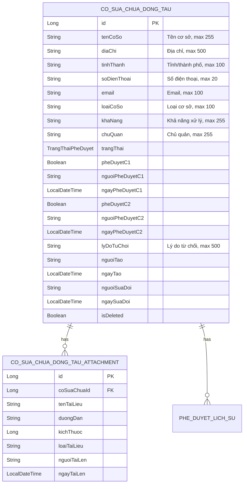
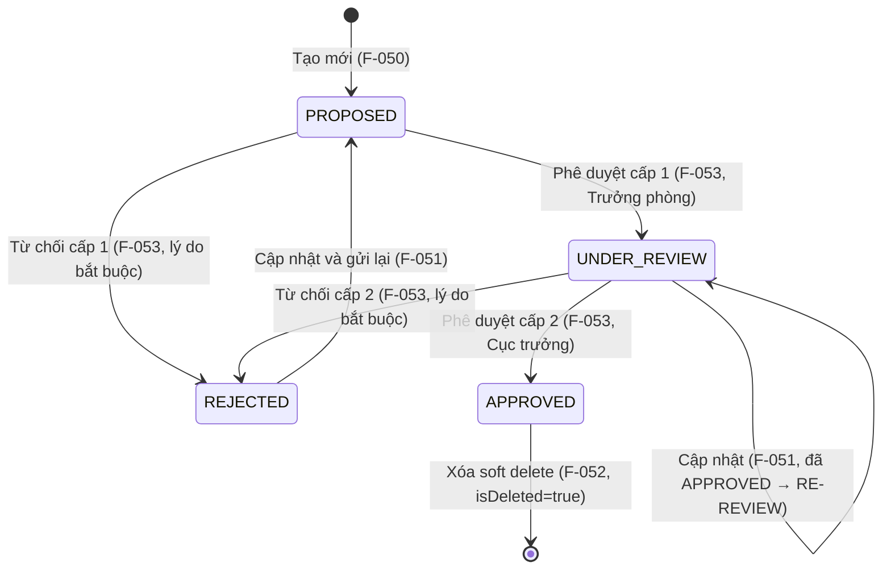

# DESIGN — Cơ sở sửa chữa, đóng tàu (F-050 → F-055)

Module: **M-003 — Quản lý tài sản KCHTGT - Khu nước & VTS**
Nhóm tính năng: **Cơ sở sửa chữa, đóng tàu** (F-050, F-051, F-052, F-053, F-054, F-055)
Stack: **Spring Boot 17+**, **MSSQL Server 2022**, **ReactJS 18+**, **Nginx**, **MinIO**, **GeoServer**
BA Source: `docs/modules/M-003-quan-ly-tai-san-kchtgt-khu-nuoc-vts/ba/00-lean-spec.md`

---

## 1. Architecture Overview

Hệ thống Cơ sở sửa chữa, đóng tàu tuân thủ kiến trúc lớp (layered architecture) chuẩn Spring Boot,
áp dụng cùng pattern phê duyệt 2 cấp (C1: Trưởng phòng → C2: Cục trưởng) như các nhóm Lượng hàng hải và Đê/Kè.

```mermaid
flowchart TD
    subgraph Controller["REST Controllers<br/>com.hanghai.kchtg.cosuachua.controller"]
        C[CoSuaChuaDongTauController<br/>@RestController]
        C1[Auth filter<br/>@PreAuthorize]
    end
    subgraph Service["Business Services<br/>com.hanghai.kchtg.cosuachua.service"]
        S[CoSuaChuaDongTauService<br/>@Service @Transactional]
        S1[Validation layer]
        S2[Approval workflow engine<br/>(2 cấp: phòng → cục)]
    end
    subgraph Repository["Data Access<br/>com.hanghai.kchtg.cosuachua.repository"]
        R[CoSuaChuaDongTauRepository<br/>JpaRepository]
        R1[CoSuaChuaDongTauAttachmentRepository<br/>JpaRepository]
    end
    C --> C1 --> S --> S1 --> S2 --> R --> R1
```

**Lưu ý:**
- `PheDuyetLichSu` được lưu cùng repository `CoSuaChuaDongTauRepository` (FK cùng module M-003).
- MinIO dùng cho `CoSuaChuaDongTauAttachment` (tài liệu đính kèm).
- JWT auth + `@PreAuthorize` filter tại controller layer.
- Trạng thái phê duyệt reuse enum `TrangThaiPheDuyet` (tương tự LuongHangHaiApprovalStatus).

---

## 2. Entity



### Enum: TrangThaiPheDuyet (reuse)

| Value | VN | Mô tả |
|-------|-----|-------|
| `PROPOSED` | Đề xuất | Chờ phê duyệt cấp 1 |
| `UNDER_REVIEW` | Đang xem xét | Đã duyệt cấp 1, chờ duyệt cấp 2 |
| `APPROVED` | Đã phê duyệt | Hoàn tất cả 2 cấp phê duyệt |
| `REJECTED` | Từ chối | Bị từ chối ở cấp 1 hoặc cấp 2 |

### Quan hệ Entity
- `CoSuaChuaDongTau` 1 — * N `CoSuaChuaDongTauAttachment` (OneToMany, CASCADE ALL)
- `CoSuaChuaDongTau` 1 — * N `PheDuyetLichSu` (OneToMany, CASCADE ALL)

---

## 3. Package Structure

```
com.hanghai.kchtg.cosuachua
├── entity
│   ├── CoSuaChuaDongTau.java              — Entity chính, 17+ fields
│   ├── TrangThaiPheDuyet.java             — Enum: PROPOSED, UNDER_REVIEW, APPROVED, REJECTED
│   └── CoSuaChuaDongTauAttachment.java    — Entity đính kèm (MinIO)
├── repository
│   ├── CoSuaChuaDongTauRepository.java      — JpaRepository + custom queries
│   └── PheDuyetLichSuRepository.java        — JpaRepository + findByCoSuaChuaId
├── dto
│   ├── CoSuaChuaDongTauCreateRequest.java   — DTO tạo mới (F-050)
│   ├── CoSuaChuaDongTauUpdateRequest.java   — DTO cập nhật (F-051)
│   ├── CoSuaChuaDongTauResponse.java        — DTO response chung
│   ├── PheDuyetRequest.java                 — DTO phê duyệt (F-053)
│   ├── PheDuyetResponse.java                — DTO response phê duyệt
│   ├── HistoryEntry.java                    — DTO entry lịch sử (F-055)
│   └── CoSuaChuaDongTauAttachmentResponse.java — DTO attachment response
├── service
│   └── CoSuaChuaDongTauService.java         — CRUD + approval workflow (2 cấp)
└── controller
    └── CoSuaChuaDongTauController.java      — REST endpoints, @PreAuthorize
```

---

## 4. API Contract

### 4.1. CRUD Endpoints

| # | Method | Path | Feature | Permission | Request Body | Response | Description |
|---|--------|------|---------|------------|-------------|----------|-------------|
| 1 | `POST` | `/api/v1/co-so-sua-chua` | F-050 | `cosuachua:create` | `CoSuaChuaDongTauCreateRequest` | `ApiResponse<CoSuaChuaDongTauResponse>` | Tạo mới (state → PROPOSED) |
| 2 | `GET` | `/api/v1/co-so-sua-chua` | F-054 | `cosuachua:read` | — | `ApiResponse<Page<CoSuaChuaDongTauResponse>>` | Danh sách (phân trang, exclude soft deleted) |
| 3 | `GET` | `/api/v1/co-so-sua-chua/{id}` | F-054 | `cosuachua:read` | — | `ApiResponse<CoSuaChuaDongTauResponse>` | Xem chi tiết |
| 4 | `PUT` | `/api/v1/co-so-sua-chua/{id}` | F-051 | `cosuachua:update` | `CoSuaChuaDongTauUpdateRequest` | `ApiResponse<CoSuaChuaDongTauResponse>` | Cập nhật |
| 5 | `DELETE` | `/api/v1/co-so-sua-chua/{id}` | F-052 | `cosuachua:delete` | — | `ApiResponse<Void>` | Soft delete (APPROVED only) |

### 4.2. Approval Endpoints

| # | Method | Path | Feature | Permission | Request Body | Response | Description |
|---|--------|------|---------|------------|-------------|----------|-------------|
| 6 | `POST` | `/api/v1/co-so-sua-chua/{id}/approve/c1` | F-053 | `cosuachua:approve:c1` | `PheDuyetRequest` | `ApiResponse<PheDuyetResponse>` | Phê duyệt C1 (PROPOSED → UNDER_REVIEW) |
| 7 | `POST` | `/api/v1/co-so-sua-chua/{id}/approve/c2` | F-053 | `cosuachua:approve:c2` | `PheDuyetRequest` | `ApiResponse<PheDuyetResponse>` | Phê duyệt C2 (UNDER_REVIEW → APPROVED) |

### 4.3. Query Endpoints

| # | Method | Path | Feature | Permission | Request Params | Response | Description |
|---|--------|------|---------|------------|---------------|----------|-------------|
| 8 | `GET` | `/api/v1/co-so-sua-chua/search` | F-054 | `cosuachua:read` | `keyword`, `tinhThanh`, `trangThai`, `page`, `size` | `ApiResponse<KetQuaTimKiemResponse>` | Tìm kiếm động |
| 9 | `GET` | `/api/v1/co-so-sua-chua/status-phe-duyet/{trangThai}` | F-054 | `cosuachua:read` | `trangThai` | `ApiResponse<List<CoSuaChuaDongTauResponse>>` | Lọc trạng thái |
| 10 | `GET` | `/api/v1/co-so-sua-chua/{id}/history` | F-055 | `cosuachua:history` | — | `ApiResponse<List<HistoryEntry>>` | Lịch sử (giảm dần) |

### 4.4. DTO Schemas

**CoSuaChuaDongTauCreateRequest**

| Field | Type | Required | Validation |
|-------|------|----------|------------|
| `tenCoSo` | String | Yes | `@NotBlank`, max 255 |
| `diaChi` | String | Yes | `@NotBlank`, max 500 |
| `tinhThanh` | String | Yes | `@NotBlank`, max 100 |
| `soDienThoai` | String | No | max 20 |
| `email` | String | No | max 100 |
| `loaiCoSo` | String | Yes | `@NotBlank`, max 100 |
| `khaNang` | String | No | max 255 |
| `chuQuan` | String | No | max 255 |

**CoSuaChuaDongTauUpdateRequest**

| Field | Type | Required | Validation |
|-------|------|----------|------------|
| `tenCoSo` | String | No | max 255 |
| `diaChi` | String | No | max 500 |
| `tinhThanh` | String | No | max 100 |
| `soDienThoai` | String | No | max 20 |
| `email` | String | No | max 100 |
| `loaiCoSo` | String | No | max 100 |
| `khaNang` | String | No | max 255 |
| `chuQuan` | String | No | max 255 |

**PheDuyetRequest** (reuse)

| Field | Type | Required | Validation |
|-------|------|----------|------------|
| `quyetDinh` | String | Yes | `@NotBlank` (APPROVED / REJECTED) |
| `lyDo` | String | Yes (khi REJECTED) | `@NotBlank, max 500` |

---

## 5. Business Rules

| Rule ID | Business Rule | Technical Implementation |
|---------|--------------|-------------------------|
| BR-050-01 | Cơ sở sửa chữa, đóng tàu phải được phê duyệt | Entity default state = `PROPOSED` |
| BR-050-02 | Bản ghi mới luôn ở trạng thái `PROPOSED` | `CoSuaChuaDongTauService.create()` sets `trangThai = PROPOSED` |
| BR-050-03 | `tenCoSo` bắt buộc, max 255 | `@NotBlank`, `@Column(length=255)` |
| BR-050-04 | `diaChi` bắt buộc, max 500 | `@NotBlank`, `@Column(length=500)` |
| BR-050-05 | `tinhThanh` bắt buộc, max 100 | `@NotBlank`, `@Column(length=100)` |
| BR-050-06 | `loaiCoSo` bắt buộc, max 100 | `@NotBlank`, `@Column(length=100)` |
| BR-050-07 | `soDienThoai` tùy chọn, max 20 | Nullable |
| BR-050-08 | `email` tùy chọn, max 100 | Nullable |
| BR-050-09 | `khaNang` tùy chọn, max 255 | Nullable |
| BR-050-10 | `chuQuan` tùy chọn, max 255 | Nullable |
| BR-050-11 | Chỉ Chuyên viên (A-003) có quyền tạo | `@PreAuthorize("@auth.check(authentication, 'cosuachua:create')")` |
| BR-051-01 | Cập nhật phải được phê duyệt lại | Sau update → `trangThai = UNDER_REVIEW` nếu APPROVED trước đó |
| BR-051-02 | Chỉ PROPOSED/UNDER_REVIEW được cập nhật trực tiếp | Service kiểm tra `trangThai` |
| BR-051-03 | APPROVED không cho phép cập nhật trực tiếp | `IllegalStateException` |
| BR-051-04 | Mọi thay đổi ghi nhận vào `PheDuyetLichSu` | `PheDuyetLichSuRepository.save()` với `status = UPDATED` |
| BR-051-05 | `nguoiSuaDoi` + `ngaySuaDoi` tự động cập nhật | `@PreUpdate` |
| BR-051-06 | REJECTED có thể cập nhật và gửi lại | Cho phép update khi `trangThai = REJECTED` |
| BR-052-01 | Xóa chỉ với bản ghi APPROVED | Service kiểm tra `trangThai == APPROVED` |
| BR-052-02 | Soft delete — giữ lại với flag `isDeleted` | `isDeleted = true` |
| BR-052-03 | Hành động xóa ghi nhận vào `PheDuyetLichSu` | `status = DELETED` |
| BR-052-04 | Chỉ Chuyên viên có quyền xóa | `@PreAuthorize("@auth.check(authentication, 'cosuachua:delete')")` |
| BR-053-01 | 2 cấp duyệt: trưởng phòng → cục trưởng | 2 endpoint: `/approve/c1` và `/approve/c2` |
| BR-053-02 | Từ chối cấp 1 → gửi lại cho chuyên viên | `trangThai = REJECTED` |
| BR-053-03 | Từ chối cấp 2 → gửi lại cho chuyên viên | `trangThai = REJECTED` |
| BR-053-04 | Lý do từ chối là bắt buộc | `@NotBlank` khi `quyetDinh = REJECTED` |
| BR-053-05 | Thời gian phê duyệt ghi nhận | `ngayPheDuyetC1`/`ngayPheDuyetC2` auto-set |
| BR-053-06 | Hoàn tất 2 cấp → `APPROVED` | `pheDuyetC2 = true`, `trangThai = APPROVED` |
| BR-053-07 | Trưởng phòng chỉ phê duyệt cấp 1 | Controller reject nếu role sai |
| BR-053-08 | Cục trưởng chỉ phê duyệt cấp 2 | Controller reject nếu role sai |
| BR-053-09 | State transitions: PROPOSED → UNDER_REVIEW → APPROVED → REJECTED | Enforced in service |
| BR-053-10 | Mọi quyết định phê duyệt ghi nhận `PheDuyetLichSu` | `PheDuyetLichSuRepository.save()` |
| BR-054-01 | Tất cả roles tra cứu, xem chi tiết | `@PreAuthorize("@auth.check(authentication, 'cosuachua:read')")` |
| BR-054-02 | Văn bản đính kèm xem và tải xuống | MinIO presigned URL |
| BR-054-03 | Bản ghi xóa không hiển thị trong tra cứu | `WHERE isDeleted = false` |
| BR-054-04 | Tra cứu theo trạng thái phê duyệt | `GET /co-so-sua-chua/status-phe-duyet/{trangThai}` |
| BR-054-05 | Tìm kiếm theo tỉnh/thành, loại cơ sở | `GET /co-so-sua-chua/search` |
| BR-055-01 | Theo dõi lịch sử mọi bản ghi | `PheDuyetLichSu` entry tại mỗi hành động |
| BR-055-02 | Lịch sử hiển thị giảm dần | `ORDER BY ngayPheDuyet DESC` |
| BR-055-03 | Chuyên viên xem lịch sử tất cả bản ghi | `@PreAuthorize("@auth.check(authentication, 'cosuachua:history')")` |

---

## 6. State Machine



### State Transition Table

| Từ trạng thái | Hành động | Actor | Trạng thái mới | Ghi chú |
|--------------|----------|-------|---------------|---------|
| `PROPOSED` | Phê duyệt C1 | Trưởng phòng | `UNDER_REVIEW` | Tạo entry PheDuyetLichSu cap=1 |
| `PROPOSED` | Từ chối C1 | Trưởng phòng | `REJECTED` | LyDoTuChoi bắt buộc |
| `UNDER_REVIEW` | Phê duyệt C2 | Cục trưởng | `APPROVED` | Tạo entry PheDuyetLichSu cap=2 |
| `UNDER_REVIEW` | Từ chối C2 | Cục trưởng | `REJECTED` | LyDoTuChoi bắt buộc |
| `REJECTED` | Cập nhật | Chuyên viên | `PROPOSED` | Gửi lại quy trình phê duyệt |
| `APPROVED` | Xóa | Chuyên viên | `APPROVED` (isDeleted=true) | Soft delete |

---

## 7. Naming Conventions

### Java → Database Mapping

| Java Field | DB Column | Type |
|-----------|-----------|------|
| `tenCoSo` | `ten_co_so` | VARCHAR(255) NOT NULL |
| `diaChi` | `dia_chi` | VARCHAR(500) NOT NULL |
| `tinhThanh` | `tinh_thanh` | VARCHAR(100) NOT NULL |
| `soDienThoai` | `so_dien_thoai` | VARCHAR(20) |
| `email` | `email` | VARCHAR(100) |
| `loaiCoSo` | `loai_co_so` | VARCHAR(100) NOT NULL |
| `khaNang` | `kha_nang` | VARCHAR(255) |
| `chuQuan` | `chu_quan` | VARCHAR(255) |
| `trangThai` | `trang_thai` | VARCHAR(30) NOT NULL |
| `pheDuyetC1` | `phe_duyet_c1` | BIT NOT NULL DEFAULT 0 |
| `pheDuyetC2` | `phe_duyet_c2` | BIT NOT NULL DEFAULT 0 |
| `lyDoTuChoi` | `ly_do_tu_choi` | VARCHAR(500) |
| `isDeleted` | `is_deleted` | BIT NOT NULL DEFAULT 0 |

### Quy ước chung
- **Java fields:** camelCase
- **DB columns:** snake_case
- **Table names:** snake_case, không dấu
- **REST paths:** kebab-case
- **Entity names:** không tiền tố `Entity`

---

## 8. Dependencies & Constraints

| Category | Dependency | Ghi chú |
|----------|-----------|---------|
| Spring Boot | 3.x+ | Core framework |
| MSSQL JDBC | Latest | DB connection |
| MinIO | Latest | File storage |
| Lombok | Latest | Boilerplate reduction |

**Constraints:**
- Soft delete bắt buộc (isDeleted = true)
- Approval 2 cấp cứng (C1: Trưởng phòng → C2: Cục trưởng)
- Reuse enum `TrangThaiPheDuyet` từ LuongHangHai/DeKe
- Reuse `PheDuyetLichSu` entity

---

*Design document bởi engineering-system-architect cho module M-003, nhóm Cơ sở sửa chữa, đóng tàu (F-050 → F-055).*
