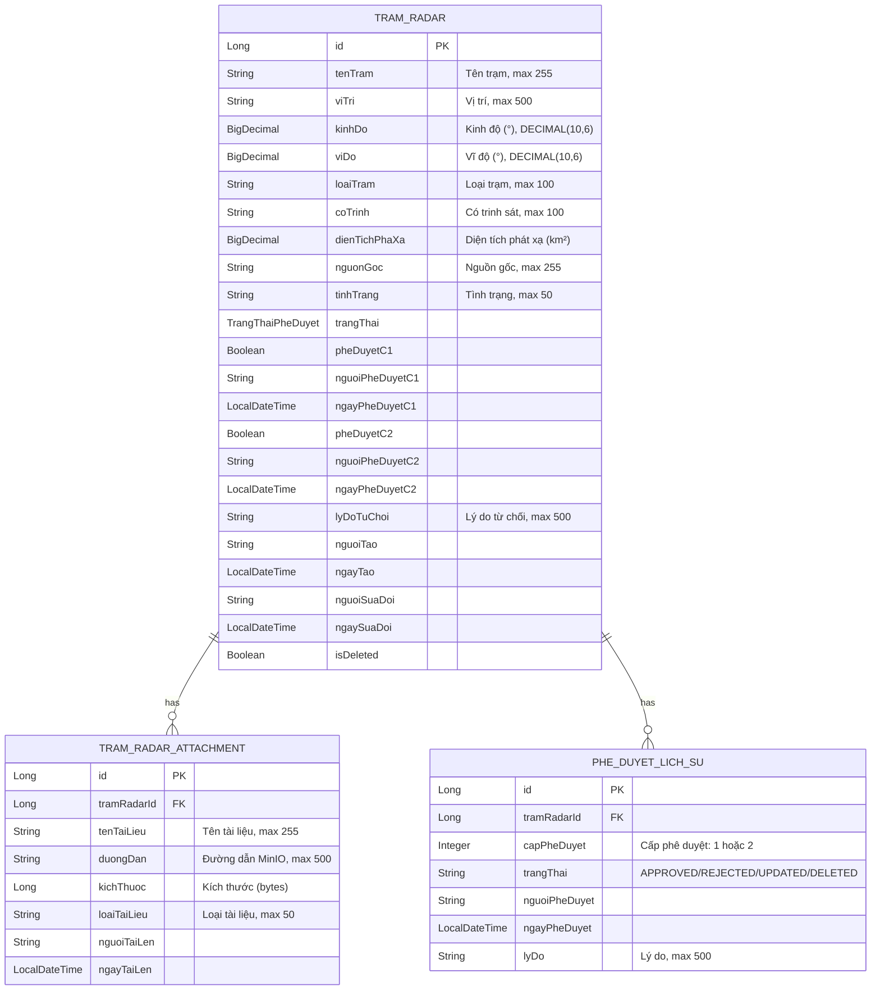
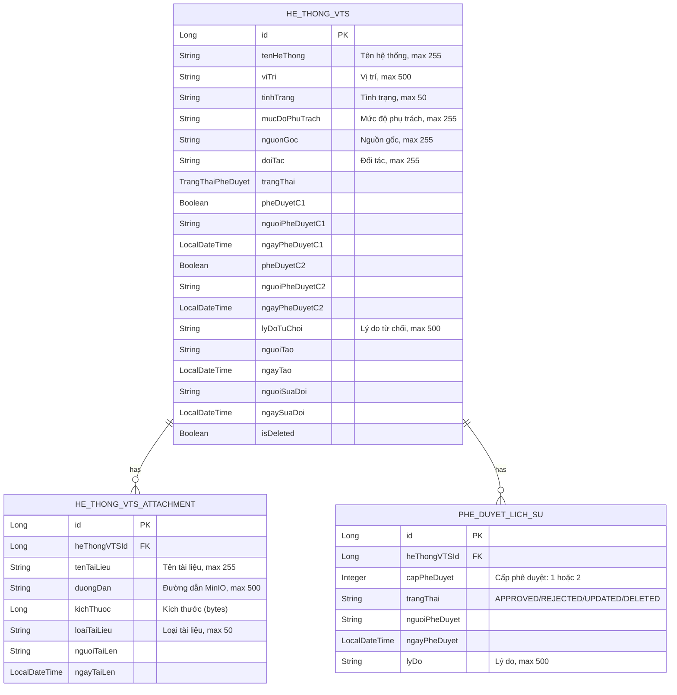
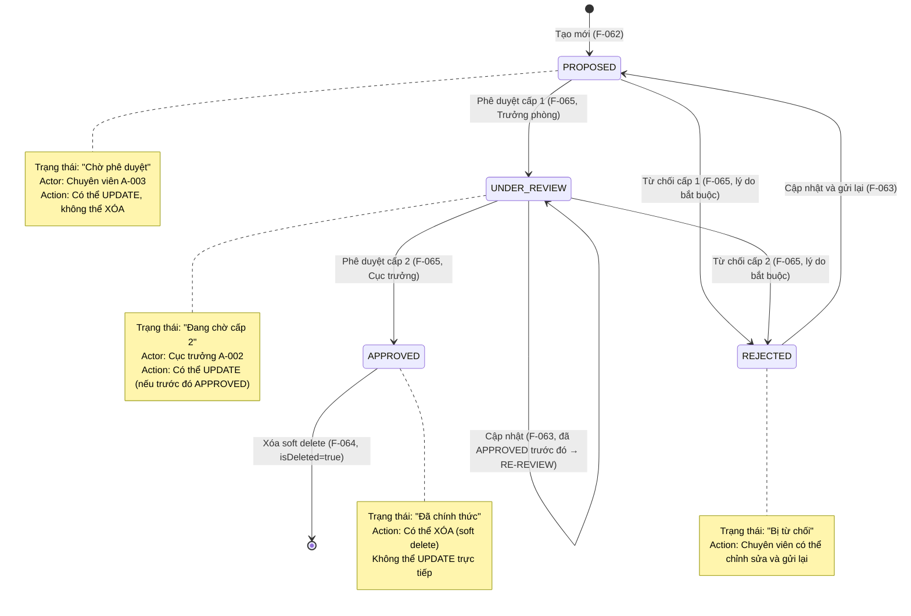

# DESIGN — Trạm radar & Hệ thống VTS (F-056 → F-067)

Module: **M-003 — Quản lý tài sản KCHTGT - Khu nước & VTS**
Nhóm tính năng: **Trạm radar** (F-056 → F-061) và **Hệ thống VTS** (F-062 → F-067)
Stack: **Spring Boot 17+**, **MSSQL Server 2022**, **ReactJS 18+**, **Nginx**, **MinIO**, **GeoServer**
BA Source: `docs/modules/M-003-quan-ly-tai-san-kchtgt-khu-nuoc-vts/ba/00-lean-spec.md`

---

## Section 1: Trạm radar (F-056 → F-061)

### 1. Architecture Overview

Hệ thống Trạm radar tuân thủ kiến trúc lớp (layered architecture) chuẩn Spring Boot,
áp dụng cùng pattern phê duyệt 2 cấp (C1: Trưởng phòng → C2: Cục trưởng) như các nhóm Lượng hàng hải, Đê/Kè và Cơ sở sửa chữa, đóng tàu.

```mermaid
flowchart TD
    subgraph Client["ReactJS Client (F-060, F-061 UI)"]
        U[Người dùng]
    end

    subgraph Nginx["Nginx Reverse Proxy"]
        NX[Nginx → /api/** → Backend]
    end

    subgraph Controller["REST Controllers<br/>com.hanghai.kchtg.tramradar.controller"]
        C[TramRadarController<br/>@RestController]
        C1[Auth filter<br/>@PreAuthorize]
    end

    subgraph Service["Business Services<br/>com.hanghai.kchtg.tramradar.service"]
        S[TramRadarService<br/>@Service @Transactional]
        S1[Validation layer]
        S2[Approval workflow engine<br/>(2 cấp: phòng → cục)]
    end

    subgraph Repository["Data Access<br/>com.hanghai.kchtg.tramradar.repository"]
        R[TramRadarRepository<br/>JpaRepository]
        R1[PheDuyetLichSuRepository<br/>JpaRepository]
    end

    subgraph DB["MSSQL Server 2022"]
        T1[(tram_radar)]
        T2[(tram_radar_attachment)]
        T3[(phe_duyet_lich_su)]
    end

    subgraph External["External Services"]
        M[MinIO — File storage]
    end

    U -->|HTTP/HTTPS| NX
    NX --> C
    C --> C1
    C1 --> S
    S --> S1
    S --> S2
    S1 --> R
    S2 --> R
    R --> T1
    R --> T2
    R --> T3
    S -->|upload/download| M
```

**Lưu ý:**
- `PheDuyetLichSu` được lưu cùng repository `TramRadarRepository` (FK cùng module M-003).
- MinIO dùng cho `TramRadarAttachment` (tài liệu đính kèm).
- JWT auth + `@PreAuthorize` filter tại controller layer.
- Trạng thái phê duyệt reuse enum `TrangThaiPheDuyet` (tương tự LuongHangHaiApprovalStatus).

---

### 2. Entity Relationship Diagram



### Enum: TrangThaiPheDuyet (reuse)

| Value | VN | Mô tả |
|-------|-----|-------|
| `PROPOSED` | Đề xuất | Chờ phê duyệt cấp 1 |
| `UNDER_REVIEW` | Đang xem xét | Đã duyệt cấp 1, chờ duyệt cấp 2 |
| `APPROVED` | Đã phê duyệt | Hoàn tất cả 2 cấp phê duyệt |
| `REJECTED` | Từ chối | Bị từ chối ở cấp 1 hoặc cấp 2 |

### Quan hệ Entity

- `TramRadar` 1 — * N `TramRadarAttachment` (OneToMany, CASCADE ALL)
- `TramRadar` 1 — * N `PheDuyetLichSu` (OneToMany, CASCADE ALL)
- `TramRadarAttachment` ManyToOne → `TramRadar` (tramRadarId FK)
- `PheDuyetLichSu` ManyToOne → `TramRadar` (tramRadarId FK)

---

### 3. Package Structure

```
com.hanghai.kchtg.tramradar
├── entity
│   ├── TramRadar.java                     — Entity chính, 20+ fields, audit timestamps
│   ├── TrangThaiPheDuyet.java             — Enum: PROPOSED, UNDER_REVIEW, APPROVED, REJECTED
│   └── TramRadarAttachment.java           — Entity đính kèm (MinIO)
├── repository
│   ├── TramRadarRepository.java           — JpaRepository + custom queries
│   └── PheDuyetLichSuRepository.java      — JpaRepository + findByTramRadarId
├── dto
│   ├── TramRadarCreateRequest.java        — DTO tạo mới (F-056)
│   ├── TramRadarUpdateRequest.java        — DTO cập nhật (F-057)
│   ├── TramRadarResponse.java             — DTO response chung
│   ├── TramRadarAttachmentResponse.java   — DTO attachment response
│   ├── PheDuyetRequest.java               — DTO phê duyệt (F-059)
│   ├── PheDuyetResponse.java              — DTO response phê duyệt
│   └── HistoryEntry.java                  — DTO entry lịch sử (F-061)
├── service
│   └── TramRadarService.java              — CRUD + approval workflow (2 cấp)
└── controller
    └── TramRadarController.java           — REST endpoints, @PreAuthorize
```

**Pattern tham khảo:** `com.hanghai.kchtg.cosuachua.*` (cùng module M-003, cùng approval workflow)

---

### 4. API Contract

#### 4.1. CRUD Endpoints

| # | Method | Path | Feature | Permission | Request Body | Response | Description |
|---|--------|------|---------|------------|-------------|----------|-------------|
| 1 | `POST` | `/api/v1/tram-radar` | F-056 | `tramradar:create` | `TramRadarCreateRequest` | `ApiResponse<TramRadarResponse>` | Tạo mới trạm radar (state → PROPOSED) |
| 2 | `GET` | `/api/v1/tram-radar` | F-060 | `tramradar:read` | — | `ApiResponse<Page<TramRadarResponse>>` | Danh sách phân trang (exclude soft deleted) |
| 3 | `GET` | `/api/v1/tram-radar/{id}` | F-060 | `tramradar:read` | — | `ApiResponse<TramRadarResponse>` | Xem chi tiết (thông tin phê duyệt + attachment) |
| 4 | `PUT` | `/api/v1/tram-radar/{id}` | F-057 | `tramradar:update` | `TramRadarUpdateRequest` | `ApiResponse<TramRadarResponse>` | Cập nhật bản ghi |
| 5 | `DELETE` | `/api/v1/tram-radar/{id}` | F-058 | `tramradar:delete` | — | `ApiResponse<Void>` | Soft delete bản ghi APPROVED |

#### 4.2. Approval Endpoints

| # | Method | Path | Feature | Permission | Request Body | Response | Description |
|---|--------|------|---------|------------|-------------|----------|-------------|
| 6 | `POST` | `/api/v1/tram-radar/{id}/approve/c1` | F-059 | `tramradar:approve:c1` | `PheDuyetRequest` | `ApiResponse<PheDuyetResponse>` | Phê duyệt cấp 1 (PROPOSED → UNDER_REVIEW) |
| 7 | `POST` | `/api/v1/tram-radar/{id}/approve/c2` | F-059 | `tramradar:approve:c2` | `PheDuyetRequest` | `ApiResponse<PheDuyetResponse>` | Phê duyệt cấp 2 (UNDER_REVIEW → APPROVED) |

#### 4.3. Query Endpoints

| # | Method | Path | Feature | Permission | Request Params | Response | Description |
|---|--------|------|---------|------------|---------------|----------|-------------|
| 8 | `GET` | `/api/v1/tram-radar/search` | F-060 | `tramradar:read` | `keyword`, `tinhThanh`, `trangThai`, `page`, `size` | `ApiResponse<KetQuaTimKiemResponse>` | Tìm kiếm động |
| 9 | `GET` | `/api/v1/tram-radar/status-phe-duyet/{trangThai}` | F-060 | `tramradar:read` | `trangThai` | `ApiResponse<List<TramRadarResponse>>` | Lọc theo trạng thái phê duyệt |
| 10 | `GET` | `/api/v1/tram-radar/{id}/history` | F-061 | `tramradar:history` | — | `ApiResponse<List<HistoryEntry>>` | Lịch sử thay đổi (giảm dần) |

#### 4.4. DTO Schemas

**TramRadarCreateRequest**

| Field | Type | Required | Validation |
|-------|------|----------|------------|
| `tenTram` | String | Yes | `@NotBlank`, max 255 |
| `viTri` | String | Yes | `@NotBlank`, max 500 |
| `kinhDo` | BigDecimal | No | `@DecimalMin("-180")`, `@DecimalMax("180")`, DECIMAL(10,6) |
| `viDo` | BigDecimal | No | `@DecimalMin("-90")`, `@DecimalMax("90")`, DECIMAL(10,6) |
| `loaiTram` | String | No | max 100 |
| `coTrinh` | String | No | max 100 |
| `dienTichPhaXa` | BigDecimal | No | `@Positive`, DECIMAL(10,2) |
| `nguonGoc` | String | No | max 255 |
| `tinhTrang` | String | No | max 50 |

**TramRadarUpdateRequest**

| Field | Type | Required | Validation |
|-------|------|----------|------------|
| `tenTram` | String | No | max 255 |
| `viTri` | String | No | max 500 |
| `kinhDo` | BigDecimal | No | `@DecimalMin("-180")`, `@DecimalMax("180")` |
| `viDo` | BigDecimal | No | `@DecimalMin("-90")`, `@DecimalMax("90")` |
| `loaiTram` | String | No | max 100 |
| `coTrinh` | String | No | max 100 |
| `dienTichPhaXa` | BigDecimal | No | `@Positive` |
| `nguonGoc` | String | No | max 255 |
| `tinhTrang` | String | No | max 50 |

**PheDuyetRequest** (reuse)

| Field | Type | Required | Validation |
|-------|------|----------|------------|
| `quyetDinh` | String | Yes | `@NotBlank` (APPROVED / REJECTED) |
| `lyDo` | String | Yes (khi REJECTED) | `@NotBlank, max 500` |

---

### 5. Business Rules → Technical Mapping

| Rule ID | Business Rule | Technical Implementation |
|---------|--------------|-------------------------|
| BR-056-01 | Trạm radar phải được phê duyệt trước khi chính thức ghi nhận | Entity default state = `PROPOSED` (not APPROVED) |
| BR-056-02 | Bản ghi mới luôn ở trạng thái `PROPOSED` | `TramRadarService.create()` sets `trangThai = PROPOSED` |
| BR-056-03 | `tenTram` bắt buộc, max 255 | `@NotBlank`, `@Column(length=255)` |
| BR-056-04 | `viTri` bắt buộc, max 500 | `@NotBlank`, `@Column(length=500)` |
| BR-056-05 | `kinhDo` tùy chọn, phạm vi [-180, 180] | Nullable, DECIMAL(10,6), validation in DTO |
| BR-056-06 | `viDo` tùy chọn, phạm vi [-90, 90] | Nullable, DECIMAL(10,6), validation in DTO |
| BR-056-07 | `loaiTram` tùy chọn, max 100 | Nullable in entity |
| BR-056-08 | `coTrinh` tùy chọn, max 100 | Nullable in entity |
| BR-056-09 | `dienTichPhaXa` tùy chọn, số thực dương | `@Positive` if present, DECIMAL(10,2) |
| BR-056-10 | `nguonGoc` tùy chọn, max 255 | Nullable in entity |
| BR-056-11 | Chỉ Chuyên viên (A-003) có quyền tạo | `@PreAuthorize("@auth.check(authentication, 'tramradar:create')")` |
| BR-057-01 | Cập nhật phải được phê duyệt lại | Sau update → `trangThai = UNDER_REVIEW` nếu APPROVED trước đó |
| BR-057-02 | Chỉ PROPOSED/UNDER_REVIEW được cập nhật trực tiếp | Service kiểm tra `trangThai` trước khi update |
| BR-057-03 | APPROVED không cho phép cập nhật trực tiếp | `IllegalStateException` nếu trạng thái = APPROVED |
| BR-057-04 | Mọi thay đổi ghi nhận vào `PheDuyetLichSu` | `PheDuyetLichSuRepository.save()` với `status = UPDATED` |
| BR-057-05 | `nguoiSuaDoi` + `ngaySuaDoi` tự động cập nhật | `@PreUpdate` lifecycle callback trong entity |
| BR-057-06 | REJECTED có thể cập nhật và gửi lại | Cho phép update khi `trangThai = REJECTED` |
| BR-058-01 | Xóa chỉ với bản ghi APPROVED | Service kiểm tra `trangThai == APPROVED` trước khi soft delete |
| BR-058-02 | Soft delete — giữ lại với flag `isDeleted` | `isDeleted = true`, tất cả query có `WHERE isDeleted = false` |
| BR-058-03 | Hành động xóa ghi nhận vào `PheDuyetLichSu` | `PheDuyetLichSu` entry với `status = DELETED` |
| BR-058-04 | Chỉ Chuyên viên có quyền xóa | `@PreAuthorize("@auth.check(authentication, 'tramradar:delete')")` |
| BR-059-01 | 2 cấp duyệt: trưởng phòng → cục trưởng | 2 endpoint riêng: `/approve/c1` và `/approve/c2` |
| BR-059-02 | Từ chối cấp 1 → gửi lại cho chuyên viên | `trangThai = REJECTED`, chuyên viên có thể update |
| BR-059-03 | Từ chối cấp 2 → gửi lại cho chuyên viên | `trangThai = REJECTED`, chuyên viên có thể update |
| BR-059-04 | Lý do từ chối là bắt buộc | `PheDuyetRequest.lyDo` `@NotBlank` khi `quyetDinh = REJECTED` |
| BR-059-05 | Thời gian phê duyệt ghi nhận | `ngayPheDuyetC1`/`ngayPheDuyetC2` auto-set `LocalDateTime.now()` |
| BR-059-06 | Hoàn tất 2 cấp → `APPROVED` | Sau approveC2: `pheDuyetC2 = true`, `trangThai = APPROVED` |
| BR-059-07 | Trưởng phòng chỉ phê duyệt cấp 1 | Controller `/approve/c2` reject nếu role không phải Cục trưởng |
| BR-059-08 | Cục trưởng chỉ phê duyệt cấp 2 | Controller `/approve/c1` reject nếu role không phải Trưởng phòng |
| BR-059-09 | State transitions: PROPOSED → UNDER_REVIEW → APPROVED → REJECTED | Enforced in service layer methods |
| BR-059-10 | Mọi quyết định phê duyệt ghi nhận `PheDuyetLichSu` | `PheDuyetLichSuRepository.save()` tại mỗi approve/reject call |
| BR-060-01 | Tất cả roles tra cứu, xem chi tiết | `@PreAuthorize("@auth.check(authentication, 'tramradar:read')")` |
| BR-060-02 | Văn bản đính kèm xem và tải xuống | `TramRadarAttachment` returned in detail response + MinIO presigned URL |
| BR-060-03 | Bản ghi xóa không hiển thị trong tra cứu | Repository query: `WHERE isDeleted = false` (mặc định) |
| BR-060-04 | Tra cứu theo trạng thái phê duyệt | `GET /tram-radar/status-phe-duyet/{trangThai}` |
| BR-060-05 | Tìm kiếm theo tên, vị trí, loại trạm | `GET /tram-radar/search` keyword-based + filters |
| BR-061-01 | Theo dõi lịch sử mọi bản ghi | `PheDuyetLichSu` entry tại mỗi create/update/approve/reject/delete |
| BR-061-02 | Lịch sử hiển thị giảm dần | Repository: `ORDER BY ngayPheDuyet DESC` |
| BR-061-03 | Chuyên viên xem lịch sử tất cả bản ghi | `@PreAuthorize("@auth.check(authentication, 'tramradar:history')")` |

---

### 6. State Machine


### State Transition Table

| Từ trạng thái | Hành động | Actor | Trạng thái mới | Ghi chú |
|--------------|----------|-------|---------------|---------|
| `PROPOSED` | Phê duyệt C1 | Trưởng phòng | `UNDER_REVIEW` | Tạo entry PheDuyetLichSu cap=1 |
| `PROPOSED` | Từ chối C1 | Trưởng phòng | `REJECTED` | LyDoTuChoi bắt buộc, tạo entry PheDuyetLichSu cap=1 |
| `UNDER_REVIEW` | Phê duyệt C2 | Cục trưởng | `APPROVED` | Tạo entry PheDuyetLichSu cap=2 |
| `UNDER_REVIEW` | Từ chối C2 | Cục trưởng | `REJECTED` | LyDoTuChoi bắt buộc, tạo entry PheDuyetLichSu cap=2 |
| `REJECTED` | Cập nhật | Chuyên viên | `PROPOSED` | Gửi lại quy trình phê duyệt |
| `APPROVED` | Xóa | Chuyên viên | `APPROVED` (isDeleted=true) | Soft delete, tạo entry PheDuyetLichSu status=DELETED |

---

### 7. Naming Conventions

### Java → Database Mapping

| Java Field (camelCase) | DB Column (snake_case) | Type |
|------------------------|------------------------|------|
| `tenTram` | `ten_tram` | VARCHAR(255) NOT NULL |
| `viTri` | `vi_tri` | VARCHAR(500) NOT NULL |
| `kinhDo` | `kinh_do` | DECIMAL(10,6) |
| `viDo` | `vi_do` | DECIMAL(10,6) |
| `loaiTram` | `loai_tram` | VARCHAR(100) |
| `coTrinh` | `co_trinh` | VARCHAR(100) |
| `dienTichPhaXa` | `dien_tich_pha_xa` | DECIMAL(10,2) |
| `nguonGoc` | `nguon_goc` | VARCHAR(255) |
| `tinhTrang` | `tinh_trang` | VARCHAR(50) |
| `trangThai` | `trang_thai` | VARCHAR(30) NOT NULL |
| `pheDuyetC1` | `phe_duyet_c1` | BIT NOT NULL DEFAULT 0 |
| `nguoiPheDuyetC1` | `nguoi_phe_duyet_c1` | VARCHAR(100) |
| `ngayPheDuyetC1` | `ngay_phe_duyet_c1` | DATETIME2 |
| `pheDuyetC2` | `phe_duyet_c2` | BIT NOT NULL DEFAULT 0 |
| `nguoiPheDuyetC2` | `nguoi_phe_duyet_c2` | VARCHAR(100) |
| `ngayPheDuyetC2` | `ngay_phe_duyet_c2` | DATETIME2 |
| `lyDoTuChoi` | `ly_do_tu_choi` | VARCHAR(500) |
| `nguoiTao` | `nguoi_tao` | VARCHAR(100) NOT NULL |
| `ngayTao` | `ngay_tao` | DATETIME2 NOT NULL |
| `nguoiSuaDoi` | `nguoi_sua_doi` | VARCHAR(100) |
| `ngaySuaDoi` | `ngay_sua_doi` | DATETIME2 |
| `isDeleted` | `is_deleted` | BIT NOT NULL DEFAULT 0 |

### Attachment Table

| Java Field | DB Column | Type |
|-----------|-----------|------|
| `tramRadarId` | `tram_radar_id` | BIGINT NOT NULL (FK) |
| `tenTaiLieu` | `ten_tai_lieu` | VARCHAR(255) NOT NULL |
| `duongDan` | `duong_dan` | VARCHAR(500) NOT NULL |
| `kichThuoc` | `kich_thuoc` | BIGINT |
| `loaiTaiLieu` | `loai_tai_lieu` | VARCHAR(50) |
| `nguoiTaiLen` | `nguoi_tai_len` | VARCHAR(100) |
| `ngayTaiLen` | `ngay_tai_len` | DATETIME2 |

### History Table (reuse: `phe_duyet_lich_su`)

| Java Field | DB Column | Type |
|-----------|-----------|------|
| `tramRadarId` | `tram_radar_id` | BIGINT NOT NULL (FK) |
| `capPheDuyet` | `cap_phe_duyet` | INT NOT NULL (1 hoặc 2) |
| `trangThai` | `trang_thai` | VARCHAR(30) NOT NULL |
| `nguoiPheDuyet` | `nguoi_phe_duyet` | VARCHAR(100) NOT NULL |
| `ngayPheDuyet` | `ngay_phe_duyet` | DATETIME2 NOT NULL |
| `lyDo` | `ly_do` | VARCHAR(500) |

### Quy ước chung

- **Java fields:** camelCase (ví dụ: `tenTram`, `viTri`, `kinhDo`)
- **DB columns:** snake_case (ví dụ: `ten_tram`, `vi_tri`, `kinh_do`)
- **Table names:** snake_case, không dấu (ví dụ: `tram_radar`, `tram_radar_attachment`, `phe_duyet_lich_su`)
- **Enum values:** UPPER_SNAKE_CASE (ví dụ: `PROPOSED`, `UNDER_REVIEW`, `APPROVED`, `REJECTED`)
- **REST paths:** kebab-case (ví dụ: `/api/v1/tram-radar`, `/approve/c1`, `/status-phe-duyet`)
- **DTO names:** `CreateRequest`, `UpdateRequest`, `Response`, `Entry`
- **Entity names:** không có tiền tố `Entity` (ví dụ: `TramRadar`, không `TramRadarEntity`)

---

### 8. Dependencies & Constraints

### 8.1. Dependencies

| Category | Dependency | Version | Ghi chú |
|----------|-----------|---------|---------|
| Framework | Spring Boot | 3.x+ | Core framework, starter-web, starter-data-jpa, starter-security |
| DB Driver | jtds / MSSQL JDBC | Latest | MSSQL Server 2022 connection |
| ORM | Spring Data JPA + Hibernate | Bundled with Spring Boot | Entity mapping, CRUD, pagination |
| Validation | Hibernate Validator | Bundled | `@NotBlank`, `@Positive`, `@DecimalMin`, `@DecimalMax` |
| Security | Spring Security | Bundled | JWT auth, `@PreAuthorize` |
| File Storage | MinIO Client | Latest | For TramRadarAttachment upload/download |
| Utility | Lombok | Latest | `@Data`, `@Builder`, `@NoArgsConstructor`, `@AllArgsConstructor` |
| Logging | SLF4J + Logback | Bundled | Structured logging |

### 8.2. Shared Dependencies (reuse từ các nhóm trước)

- **`TrangThaiPheDuyet`** enum dùng chung cho toàn bộ module M-003.
- **`PheDuyetLichSu`** entity dùng chung repository (cùng FK namespace).
- **`ApiResponse<T>`** wrapper response reused cho mọi endpoint.
- **`@PreAuthorize`** annotation pattern giống nhau.

### 8.3. No External Dependencies

- **Không tích hợp** với hệ thống bên ngoài (email, SMS, ERP, ...) trong Phase 1.
- **Không dùng** Kafka/RabbitMQ cho messaging — chỉ dùng REST.
- **Không dùng** Redis caching trong Phase 1.
- Chỉ phụ thuộc vào **Spring Boot ecosystem** + **MSSQL** + **MinIO**.

### 8.4. Constraints

| ID | Constraint | Description |
|----|------------|-------------|
| C-056-01 | Soft delete bắt buộc | Tất cả xóa phải dùng `isDeleted = true`, không `DELETE` SQL |
| C-056-02 | Approval 2 cấp cứng | Không cho phép skip cấp 1 → cấp 2; không cho phép role sai phê duyệt sai cấp |
| C-056-03 | Transaction integrity | Mọi write operation (create, update, delete, approve) phải `@Transactional` |
| C-056-04 | Audit timestamps | `@PrePersist` và `@PreUpdate` tự động quản lý `ngayTao` và `ngaySuaDoi` |
| C-056-05 | Pagination trong query | `GET /tram-radar` và `GET /tram-radar/search` phải có `Pageable` |
| C-056-06 | Role-based access control | Mỗi endpoint phải có `@PreAuthorize` annotation với permission tương ứng |
| C-056-07 | API versioning | Tất cả endpoints phải có prefix `/api/v1/` |
| C-056-08 | Response wrapper | Tất cả response phải qua `ApiResponse<T>` wrapper |
| C-056-09 | Coordinates trong giới hạn địa lý | `kinhDo` ∈ [-180, 180], `viDo` ∈ [-90, 90] |
| C-056-10 | Reuse enum TrangThaiPheDuyet | Không tạo enum mới, dùng chung enum với LuongHangHai/DeKe/CoSuaChuaDongTau |

---

## Section 2: Hệ thống VTS (F-062 → F-067)

### 1. Architecture Overview

Hệ thống Hệ thống VTS (Vehicle Tracking System) tuân thủ kiến trúc lớp (layered architecture) chuẩn Spring Boot,
áp dụng cùng pattern phê duyệt 2 cấp (C1: Trưởng phòng → C2: Cục trưởng) như các nhóm trước.

```mermaid
flowchart TD
    subgraph Client["ReactJS Client (F-066, F-067 UI)"]
        U[Người dùng]
    end

    subgraph Nginx["Nginx Reverse Proxy"]
        NX[Nginx → /api/** → Backend]
    end

    subgraph Controller["REST Controllers<br/>com.hanghai.kchtg.vts.controller"]
        C[HeThongVTSController<br/>@RestController]
        C1[Auth filter<br/>@PreAuthorize]
    end

    subgraph Service["Business Services<br/>com.hanghai.kchtg.vts.service"]
        S[HeThongVTSDataService<br/>@Service @Transactional]
        S1[Validation layer]
        S2[Approval workflow engine<br/>(2 cấp: phòng → cục)]
    end

    subgraph Repository["Data Access<br/>com.hanghai.kchtg.vts.repository"]
        R[HeThongVTSRepository<br/>JpaRepository]
        R1[PheDuyetLichSuRepository<br/>JpaRepository]
    end

    subgraph DB["MSSQL Server 2022"]
        T1[(he_thong_vts)]
        T2[(he_thong_vts_attachment)]
        T3[(phe_duyet_lich_su)]
    end

    subgraph External["External Services"]
        M[MinIO — File storage]
    end

    U -->|HTTP/HTTPS| NX
    NX --> C
    C --> C1
    C1 --> S
    S --> S1
    S --> S2
    S1 --> R
    S2 --> R
    R --> T1
    R --> T2
    R --> T3
    S -->|upload/download| M
```

**Lưu ý:**
- `PheDuyetLichSu` được lưu cùng repository `HeThongVTSRepository` (FK cùng module M-003).
- MinIO dùng cho `HeThongVTSAttachment` (tài liệu đính kèm).
- JWT auth + `@PreAuthorize` filter tại controller layer.
- Trạng thái phê duyệt reuse enum `TrangThaiPheDuyet` (tương tự LuongHangHaiApprovalStatus).
- Service được đặt tên `HeThongVTSDataService` để tránh xung đột tên với Spring VTS concept.

---

### 2. Entity Relationship Diagram



### Enum: TrangThaiPheDuyet (reuse)

| Value | VN | Mô tả |
|-------|-----|-------|
| `PROPOSED` | Đề xuất | Chờ phê duyệt cấp 1 |
| `UNDER_REVIEW` | Đang xem xét | Đã duyệt cấp 1, chờ duyệt cấp 2 |
| `APPROVED` | Đã phê duyệt | Hoàn tất cả 2 cấp phê duyệt |
| `REJECTED` | Từ chối | Bị từ chối ở cấp 1 hoặc cấp 2 |

### Quan hệ Entity

- `HeThongVTS` 1 — * N `HeThongVTSAttachment` (OneToMany, CASCADE ALL)
- `HeThongVTS` 1 — * N `PheDuyetLichSu` (OneToMany, CASCADE ALL)
- `HeThongVTSAttachment` ManyToOne → `HeThongVTS` (heThongVTSId FK)
- `PheDuyetLichSu` ManyToOne → `HeThongVTS` (heThongVTSId FK)

---

### 3. Package Structure

```
com.hanghai.kchtg.vts
├── entity
│   ├── HeThongVTS.java                    — Entity chính, 18+ fields, audit timestamps
│   ├── TrangThaiPheDuyet.java             — Enum: PROPOSED, UNDER_REVIEW, APPROVED, REJECTED
│   └── HeThongVTSAttachment.java          — Entity đính kèm (MinIO)
├── repository
│   ├── HeThongVTSRepository.java          — JpaRepository + custom queries
│   └── PheDuyetLichSuRepository.java      — JpaRepository + findByHeThongVTSId
├── dto
│   ├── HeThongVTSCreateRequest.java       — DTO tạo mới (F-062)
│   ├── HeThongVTSUpdateRequest.java       — DTO cập nhật (F-063)
│   ├── HeThongVTSResponse.java            — DTO response chung
│   ├── HeThongVTSAttachmentResponse.java  — DTO attachment response
│   ├── PheDuyetRequest.java               — DTO phê duyệt (F-065)
│   ├── PheDuyetResponse.java              — DTO response phê duyệt
│   └── HistoryEntry.java                  — DTO entry lịch sử (F-067)
├── service
│   └── HeThongVTSDataService.java         — CRUD + approval workflow (2 cấp)
└── controller
    └── HeThongVTSController.java          — REST endpoints, @PreAuthorize
```

**Pattern tham khảo:** `com.hanghai.kchtg.tramradar.*` (cùng module M-003, cùng approval workflow)

---

### 4. API Contract

#### 4.1. CRUD Endpoints

| # | Method | Path | Feature | Permission | Request Body | Response | Description |
|---|--------|------|---------|------------|-------------|----------|-------------|
| 1 | `POST` | `/api/v1/he-thong-vts` | F-062 | `vts:create` | `HeThongVTSCreateRequest` | `ApiResponse<HeThongVTSResponse>` | Tạo mới hệ thống VTS (state → PROPOSED) |
| 2 | `GET` | `/api/v1/he-thong-vts` | F-066 | `vts:read` | — | `ApiResponse<Page<HeThongVTSResponse>>` | Danh sách phân trang (exclude soft deleted) |
| 3 | `GET` | `/api/v1/he-thong-vts/{id}` | F-066 | `vts:read` | — | `ApiResponse<HeThongVTSResponse>` | Xem chi tiết (thông tin phê duyệt + attachment) |
| 4 | `PUT` | `/api/v1/he-thong-vts/{id}` | F-063 | `vts:update` | `HeThongVTSUpdateRequest` | `ApiResponse<HeThongVTSResponse>` | Cập nhật bản ghi |
| 5 | `DELETE` | `/api/v1/he-thong-vts/{id}` | F-064 | `vts:delete` | — | `ApiResponse<Void>` | Soft delete bản ghi APPROVED |

#### 4.2. Approval Endpoints

| # | Method | Path | Feature | Permission | Request Body | Response | Description |
|---|--------|------|---------|------------|-------------|----------|-------------|
| 6 | `POST` | `/api/v1/he-thong-vts/{id}/approve/c1` | F-065 | `vts:approve:c1` | `PheDuyetRequest` | `ApiResponse<PheDuyetResponse>` | Phê duyệt cấp 1 (PROPOSED → UNDER_REVIEW) |
| 7 | `POST` | `/api/v1/he-thong-vts/{id}/approve/c2` | F-065 | `vts:approve:c2` | `PheDuyetRequest` | `ApiResponse<PheDuyetResponse>` | Phê duyệt cấp 2 (UNDER_REVIEW → APPROVED) |

#### 4.3. Query Endpoints

| # | Method | Path | Feature | Permission | Request Params | Response | Description |
|---|--------|------|---------|------------|---------------|----------|-------------|
| 8 | `GET` | `/api/v1/he-thong-vts/search` | F-066 | `vts:read` | `keyword`, `tinhTrang`, `trangThai`, `page`, `size` | `ApiResponse<KetQuaTimKiemResponse>` | Tìm kiếm động |
| 9 | `GET` | `/api/v1/he-thong-vts/status-phe-duyet/{trangThai}` | F-066 | `vts:read` | `trangThai` | `ApiResponse<List<HeThongVTSResponse>>` | Lọc theo trạng thái phê duyệt |
| 10 | `GET` | `/api/v1/he-thong-vts/{id}/history` | F-067 | `vts:history` | — | `ApiResponse<List<HistoryEntry>>` | Lịch sử thay đổi (giảm dần) |

#### 4.4. DTO Schemas

**HeThongVTSCreateRequest**

| Field | Type | Required | Validation |
|-------|------|----------|------------|
| `tenHeThong` | String | Yes | `@NotBlank`, max 255 |
| `viTri` | String | Yes | `@NotBlank`, max 500 |
| `tinhTrang` | String | No | max 50 (tốt, trung bình, kém, ...) |
| `mucDoPhuTrach` | String | No | max 255 |
| `nguonGoc` | String | No | max 255 |
| `doiTac` | String | No | max 255 |

**HeThongVTSUpdateRequest**

| Field | Type | Required | Validation |
|-------|------|----------|------------|
| `tenHeThong` | String | No | max 255 |
| `viTri` | String | No | max 500 |
| `tinhTrang` | String | No | max 50 |
| `mucDoPhuTrach` | String | No | max 255 |
| `nguonGoc` | String | No | max 255 |
| `doiTac` | String | No | max 255 |

**PheDuyetRequest** (reuse)

| Field | Type | Required | Validation |
|-------|------|----------|------------|
| `quyetDinh` | String | Yes | `@NotBlank` (APPROVED / REJECTED) |
| `lyDo` | String | Yes (khi REJECTED) | `@NotBlank, max 500` |

---

### 5. Business Rules → Technical Mapping

| Rule ID | Business Rule | Technical Implementation |
|---------|--------------|-------------------------|
| BR-062-01 | Hệ thống VTS phải được phê duyệt trước khi chính thức ghi nhận | Entity default state = `PROPOSED` (not APPROVED) |
| BR-062-02 | Bản ghi mới luôn ở trạng thái `PROPOSED` | `HeThongVTSDataService.create()` sets `trangThai = PROPOSED` |
| BR-062-03 | `tenHeThong` bắt buộc, max 255 | `@NotBlank`, `@Column(length=255)` |
| BR-062-04 | `viTri` bắt buộc, max 500 | `@NotBlank`, `@Column(length=500)` |
| BR-062-05 | `tinhTrang` tùy chọn, max 50 | Nullable in entity |
| BR-062-06 | `mucDoPhuTrach` tùy chọn, max 255 | Nullable in entity |
| BR-062-07 | `nguonGoc` tùy chọn, max 255 | Nullable in entity |
| BR-062-08 | `doiTac` tùy chọn, max 255 | Nullable in entity |
| BR-062-09 | Chỉ Chuyên viên (A-003) có quyền tạo | `@PreAuthorize("@auth.check(authentication, 'vts:create')")` |
| BR-063-01 | Cập nhật phải được phê duyệt lại | Sau update → `trangThai = UNDER_REVIEW` nếu APPROVED trước đó |
| BR-063-02 | Chỉ PROPOSED/UNDER_REVIEW được cập nhật trực tiếp | Service kiểm tra `trangThai` trước khi update |
| BR-063-03 | APPROVED không cho phép cập nhật trực tiếp | `IllegalStateException` nếu trạng thái = APPROVED |
| BR-063-04 | Mọi thay đổi ghi nhận vào `PheDuyetLichSu` | `PheDuyetLichSuRepository.save()` với `status = UPDATED` |
| BR-063-05 | `nguoiSuaDoi` + `ngaySuaDoi` tự động cập nhật | `@PreUpdate` lifecycle callback trong entity |
| BR-063-06 | REJECTED có thể cập nhật và gửi lại | Cho phép update khi `trangThai = REJECTED` |
| BR-064-01 | Xóa chỉ với bản ghi APPROVED | Service kiểm tra `trangThai == APPROVED` trước khi soft delete |
| BR-064-02 | Soft delete — giữ lại với flag `isDeleted` | `isDeleted = true`, tất cả query có `WHERE isDeleted = false` |
| BR-064-03 | Hành động xóa ghi nhận vào `PheDuyetLichSu` | `PheDuyetLichSu` entry với `status = DELETED` |
| BR-064-04 | Chỉ Chuyên viên có quyền xóa | `@PreAuthorize("@auth.check(authentication, 'vts:delete')")` |
| BR-065-01 | 2 cấp duyệt: trưởng phòng → cục trưởng | 2 endpoint riêng: `/approve/c1` và `/approve/c2` |
| BR-065-02 | Từ chối cấp 1 → gửi lại cho chuyên viên | `trangThai = REJECTED`, chuyên viên có thể update |
| BR-065-03 | Từ chối cấp 2 → gửi lại cho chuyên viên | `trangThai = REJECTED`, chuyên viên có thể update |
| BR-065-04 | Lý do từ chối là bắt buộc | `PheDuyetRequest.lyDo` `@NotBlank` khi `quyetDinh = REJECTED` |
| BR-065-05 | Thời gian phê duyệt ghi nhận | `ngayPheDuyetC1`/`ngayPheDuyetC2` auto-set `LocalDateTime.now()` |
| BR-065-06 | Hoàn tất 2 cấp → `APPROVED` | Sau approveC2: `pheDuyetC2 = true`, `trangThai = APPROVED` |
| BR-065-07 | Trưởng phòng chỉ phê duyệt cấp 1 | Controller `/approve/c2` reject nếu role không phải Cục trưởng |
| BR-065-08 | Cục trưởng chỉ phê duyệt cấp 2 | Controller `/approve/c1` reject nếu role không phải Trưởng phòng |
| BR-065-09 | State transitions: PROPOSED → UNDER_REVIEW → APPROVED → REJECTED | Enforced in service layer methods |
| BR-065-10 | Mọi quyết định phê duyệt ghi nhận `PheDuyetLichSu` | `PheDuyetLichSuRepository.save()` tại mỗi approve/reject call |
| BR-066-01 | Tất cả roles tra cứu, xem chi tiết | `@PreAuthorize("@auth.check(authentication, 'vts:read')")` |
| BR-066-02 | Văn bản đính kèm xem và tải xuống | `HeThongVTSAttachment` returned in detail response + MinIO presigned URL |
| BR-066-03 | Bản ghi xóa không hiển thị trong tra cứu | Repository query: `WHERE isDeleted = false` (mặc định) |
| BR-066-04 | Tra cứu theo trạng thái phê duyệt | `GET /he-thong-vts/status-phe-duyet/{trangThai}` |
| BR-066-05 | Tìm kiếm theo tên, vị trí, tình trạng | `GET /he-thong-vts/search` keyword-based + filters |
| BR-067-01 | Theo dõi lịch sử mọi bản ghi | `PheDuyetLichSu` entry tại mỗi create/update/approve/reject/delete |
| BR-067-02 | Lịch sử hiển thị giảm dần | Repository: `ORDER BY ngayPheDuyet DESC` |
| BR-067-03 | Chuyên viên xem lịch sử tất cả bản ghi | `@PreAuthorize("@auth.check(authentication, 'vts:history')")` |

---

### 6. State Machine



### State Transition Table

| Từ trạng thái | Hành động | Actor | Trạng thái mới | Ghi chú |
|--------------|----------|-------|---------------|---------|
| `PROPOSED` | Phê duyệt C1 | Trưởng phòng | `UNDER_REVIEW` | Tạo entry PheDuyetLichSu cap=1 |
| `PROPOSED` | Từ chối C1 | Trưởng phòng | `REJECTED` | LyDoTuChoi bắt buộc, tạo entry PheDuyetLichSu cap=1 |
| `UNDER_REVIEW` | Phê duyệt C2 | Cục trưởng | `APPROVED` | Tạo entry PheDuyetLichSu cap=2 |
| `UNDER_REVIEW` | Từ chối C2 | Cục trưởng | `REJECTED` | LyDoTuChoi bắt buộc, tạo entry PheDuyetLichSu cap=2 |
| `REJECTED` | Cập nhật | Chuyên viên | `PROPOSED` | Gửi lại quy trình phê duyệt |
| `APPROVED` | Xóa | Chuyên viên | `APPROVED` (isDeleted=true) | Soft delete, tạo entry PheDuyetLichSu status=DELETED |

---

### 7. Naming Conventions

### Java → Database Mapping

| Java Field (camelCase) | DB Column (snake_case) | Type |
|------------------------|------------------------|------|
| `tenHeThong` | `ten_he_thong` | VARCHAR(255) NOT NULL |
| `viTri` | `vi_tri` | VARCHAR(500) NOT NULL |
| `tinhTrang` | `tinh_trang` | VARCHAR(50) |
| `mucDoPhuTrach` | `muc_do_phu_trach` | VARCHAR(255) |
| `nguonGoc` | `nguon_goc` | VARCHAR(255) |
| `doiTac` | `doi_tac` | VARCHAR(255) |
| `trangThai` | `trang_thai` | VARCHAR(30) NOT NULL |
| `pheDuyetC1` | `phe_duyet_c1` | BIT NOT NULL DEFAULT 0 |
| `nguoiPheDuyetC1` | `nguoi_phe_duyet_c1` | VARCHAR(100) |
| `ngayPheDuyetC1` | `ngay_phe_duyet_c1` | DATETIME2 |
| `pheDuyetC2` | `phe_duyet_c2` | BIT NOT NULL DEFAULT 0 |
| `nguoiPheDuyetC2` | `nguoi_phe_duyet_c2` | VARCHAR(100) |
| `ngayPheDuyetC2` | `ngay_phe_duyet_c2` | DATETIME2 |
| `lyDoTuChoi` | `ly_do_tu_choi` | VARCHAR(500) |
| `nguoiTao` | `nguoi_tao` | VARCHAR(100) NOT NULL |
| `ngayTao` | `ngay_tao` | DATETIME2 NOT NULL |
| `nguoiSuaDoi` | `nguoi_sua_doi` | VARCHAR(100) |
| `ngaySuaDoi` | `ngay_sua_doi` | DATETIME2 |
| `isDeleted` | `is_deleted` | BIT NOT NULL DEFAULT 0 |

### Attachment Table

| Java Field | DB Column | Type |
|-----------|-----------|------|
| `heThongVTSId` | `he_thong_vts_id` | BIGINT NOT NULL (FK) |
| `tenTaiLieu` | `ten_tai_lieu` | VARCHAR(255) NOT NULL |
| `duongDan` | `duong_dan` | VARCHAR(500) NOT NULL |
| `kichThuoc` | `kich_thuoc` | BIGINT |
| `loaiTaiLieu` | `loai_tai_lieu` | VARCHAR(50) |
| `nguoiTaiLen` | `nguoi_tai_len` | VARCHAR(100) |
| `ngayTaiLen` | `ngay_tai_len` | DATETIME2 |

### History Table (reuse: `phe_duyet_lich_su`)

| Java Field | DB Column | Type |
|-----------|-----------|------|
| `heThongVTSId` | `he_thong_vts_id` | BIGINT NOT NULL (FK) |
| `capPheDuyet` | `cap_phe_duyet` | INT NOT NULL (1 hoặc 2) |
| `trangThai` | `trang_thai` | VARCHAR(30) NOT NULL |
| `nguoiPheDuyet` | `nguoi_phe_duyet` | VARCHAR(100) NOT NULL |
| `ngayPheDuyet` | `ngay_phe_duyet` | DATETIME2 NOT NULL |
| `lyDo` | `ly_do` | VARCHAR(500) |

### Quy ước chung

- **Java fields:** camelCase (ví dụ: `tenHeThong`, `viTri`, `doiTac`)
- **DB columns:** snake_case (ví dụ: `ten_he_thong`, `vi_tri`, `doi_tac`)
- **Table names:** snake_case, không dấu (ví dụ: `he_thong_vts`, `he_thong_vts_attachment`, `phe_duyet_lich_su`)
- **Enum values:** UPPER_SNAKE_CASE (ví dụ: `PROPOSED`, `UNDER_REVIEW`, `APPROVED`, `REJECTED`)
- **REST paths:** kebab-case (ví dụ: `/api/v1/he-thong-vts`, `/approve/c1`, `/status-phe-duyet`)
- **DTO names:** `CreateRequest`, `UpdateRequest`, `Response`, `Entry`
- **Entity names:** không có tiền tố `Entity` (ví dụ: `HeThongVTS`, không `HeThongVTSEntity`)

---

### 8. Dependencies & Constraints

### 8.1. Dependencies

| Category | Dependency | Version | Ghi chú |
|----------|-----------|---------|---------|
| Framework | Spring Boot | 3.x+ | Core framework, starter-web, starter-data-jpa, starter-security |
| DB Driver | jtds / MSSQL JDBC | Latest | MSSQL Server 2022 connection |
| ORM | Spring Data JPA + Hibernate | Bundled with Spring Boot | Entity mapping, CRUD, pagination |
| Validation | Hibernate Validator | Bundled | `@NotBlank`, `@Positive` |
| Security | Spring Security | Bundled | JWT auth, `@PreAuthorize` |
| File Storage | MinIO Client | Latest | For HeThongVTSAttachment upload/download |
| Utility | Lombok | Latest | `@Data`, `@Builder`, `@NoArgsConstructor`, `@AllArgsConstructor` |
| Logging | SLF4J + Logback | Bundled | Structured logging |

### 8.2. Shared Dependencies (reuse từ các nhóm trước)

- **`TrangThaiPheDuyet`** enum dùng chung cho toàn bộ module M-003.
- **`PheDuyetLichSu`** entity dùng chung repository (cùng FK namespace).
- **`ApiResponse<T>`** wrapper response reused cho mọi endpoint.
- **`@PreAuthorize`** annotation pattern giống nhau.
- **Service naming:** `HeThongVTSDataService` tránh xung đột với Spring VTS.

### 8.3. No External Dependencies

- **Không tích hợp** với hệ thống bên ngoài (email, SMS, ERP, ...) trong Phase 1.
- **Không dùng** Kafka/RabbitMQ cho messaging — chỉ dùng REST.
- **Không dùng** Redis caching trong Phase 1.
- Chỉ phụ thuộc vào **Spring Boot ecosystem** + **MSSQL** + **MinIO**.

### 8.4. Constraints

| ID | Constraint | Description |
|----|------------|-------------|
| C-062-01 | Soft delete bắt buộc | Tất cả xóa phải dùng `isDeleted = true`, không `DELETE` SQL |
| C-062-02 | Approval 2 cấp cứng | Không cho phép skip cấp 1 → cấp 2; không cho phép role sai phê duyệt sai cấp |
| C-062-03 | Transaction integrity | Mọi write operation (create, update, delete, approve) phải `@Transactional` |
| C-062-04 | Audit timestamps | `@PrePersist` và `@PreUpdate` tự động quản lý `ngayTao` và `ngaySuaDoi` |
| C-062-05 | Pagination trong query | `GET /he-thong-vts` và `GET /he-thong-vts/search` phải có `Pageable` |
| C-062-06 | Role-based access control | Mỗi endpoint phải có `@PreAuthorize` annotation với permission tương ứng |
| C-062-07 | API versioning | Tất cả endpoints phải có prefix `/api/v1/` |
| C-062-08 | Response wrapper | Tất cả response phải qua `ApiResponse<T>` wrapper |
| C-062-09 | Reuse enum TrangThaiPheDuyet | Không tạo enum mới, dùng chung enum với LuongHangHai/DeKe/CoSuaChuaDongTau/TramRadar |

---

*Design document bởi engineering-system-architect cho module M-003, nhóm Trạm radar (F-056 → F-061) và Hệ thống VTS (F-062 → F-067).*
*Pattern tham khảo: `com.hanghai.kchtg.cosuachua.*`, `com.hanghai.kchtg.deke.*`, `com.hanghai.kchtg.luonghanghai.*`.*
*Source BA: `docs/modules/M-003-quan-ly-tai-san-kchtgt-khu-nuoc-vts/ba/00-lean-spec.md`.*
