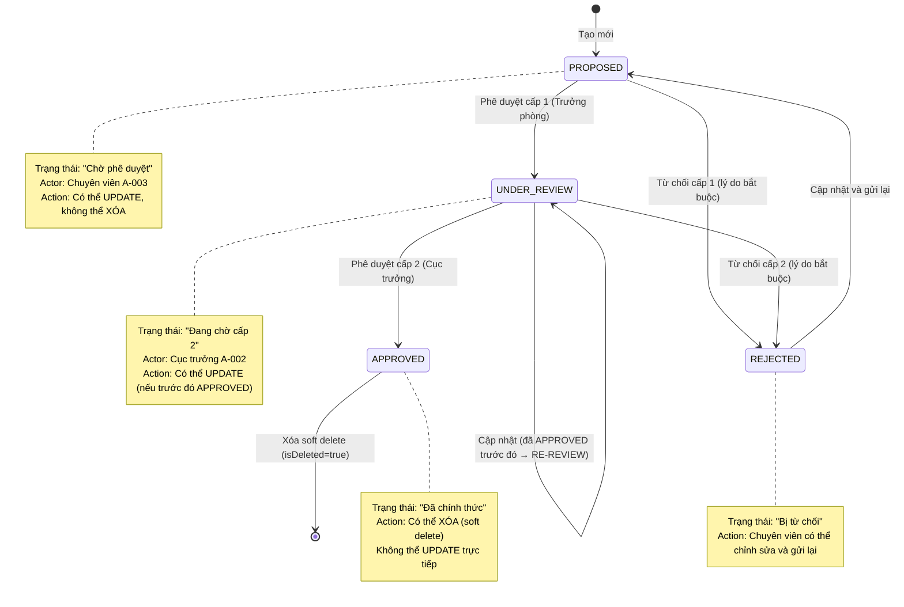
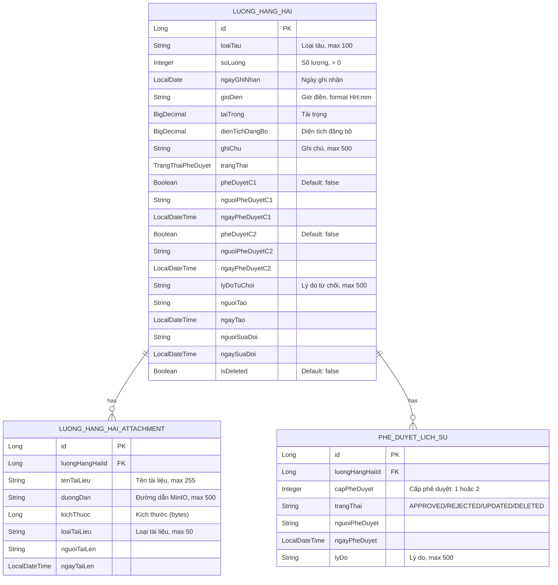
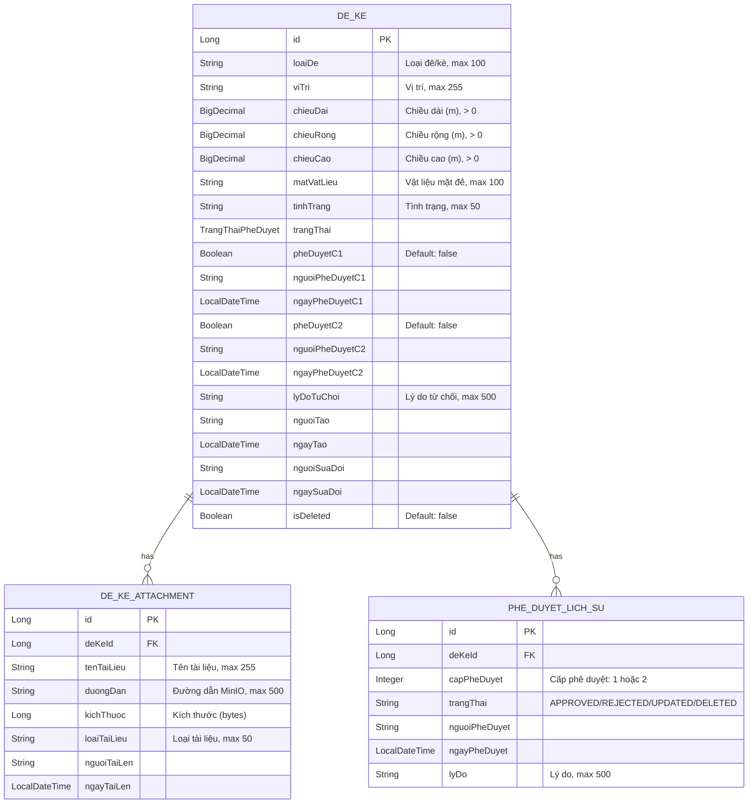
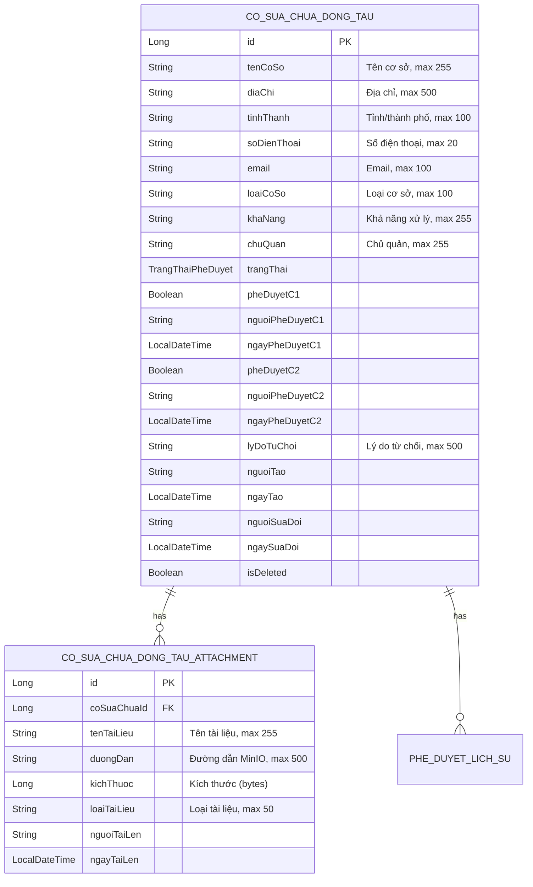
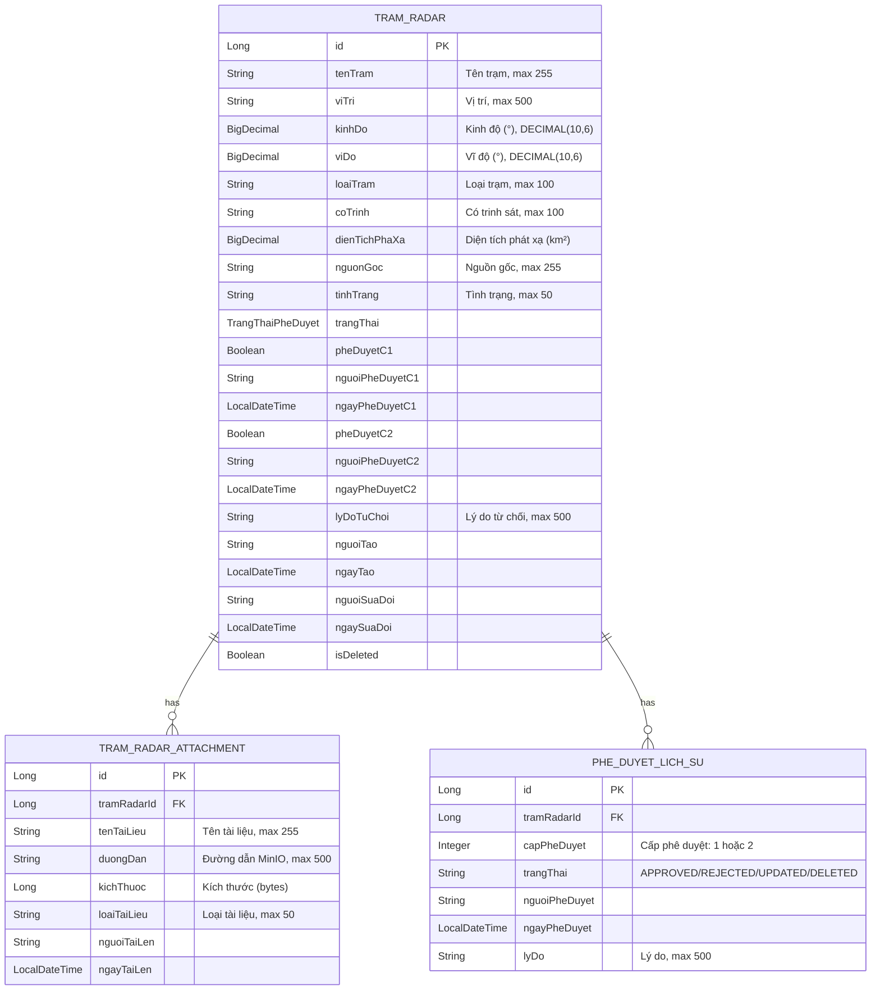

# DESIGN — Quản lý tài sản KCHTGT: Khu nước & VTS (M-003)

Module: **M-003 — Quản lý tài sản KCHTGT - Khu nước & VTS**
5 Entity Groups: Lượng hàng hải, Đê/Kè, CS sửa chữa, Trạm radar, Hệ thống VTS
Features: F-038 → F-067
Stack: Spring Boot 17+, MSSQL Server 2022, ReactJS 18+, Nginx, MinIO, GeoServer
BA Source: `docs/modules/M-003-quan-ly-tai-san-kchtgt-khu-nuoc-vts/ba/00-lean-spec.md`

---

## 1. Shared Architecture Overview

Tất cả 5 entity groups trong module M-003 tuân thủ kiến trúc lớp (layered architecture) chuẩn Spring Boot,
áp dụng cùng pattern phê duyệt 2 cấp (C1: Trưởng phòng → C2: Cục trưởng).

```mermaid
flowchart TD
    subgraph Client["ReactJS Client (UI)"]
        U[Người dùng]
    end
    subgraph Nginx["Nginx Reverse Proxy"]
        NX[Nginx → /api/** → Backend]
    end
    subgraph Controller["REST Controllers"]
        C[<Entity>Controller<br/>@RestController + @PreAuthorize]
    end
    subgraph Service["Business Services"]
        S[<Entity>Service<br/>@Service @Transactional + Approval workflow]
    end
    subgraph Repository["Data Access"]
        R[<Entity>Repository + <Entity>AttachmentRepository + PheDuyetLichSuRepository]
    end
    subgraph DB["MSSQL Server 2022"]
        T1[(<table_name>)]
        T2[(<table_name>_attachment)]
        T3[(phe_duyet_lich_su)]
    end
    subgraph External["MinIO — File storage"]
        M[MinIO]
    end
    U -->|HTTP/HTTPS| NX
    NX --> C
    C --> S
    S --> R
    R --> T1
    R --> T2
    R --> T3
    S -->|upload/download| M
```

**Lưu ý:** `PheDuyetLichSu` dùng chung FK module M-003. MinIO dùng cho attachment. JWT auth + `@PreAuthorize` tại controller. Dùng chung enum `TrangThaiPheDuyet`.

---

## 2. Shared Approval State Machine



### State Transition Table

| Từ trạng thái | Hành động | Actor | Trạng thái mới | Ghi chú |
|--------------|----------|-------|---------------|---------|
| `PROPOSED` | Phê duyệt C1 | Trưởng phòng | `UNDER_REVIEW` | Tạo entry PheDuyetLichSu cap=1 |
| `PROPOSED` | Từ chối C1 | Trưởng phòng | `REJECTED` | LyDoTuChoi bắt buộc, tạo entry PheDuyetLichSu cap=1 |
| `UNDER_REVIEW` | Phê duyệt C2 | Cục trưởng | `APPROVED` | Tạo entry PheDuyetLichSu cap=2 |
| `UNDER_REVIEW` | Từ chối C2 | Cục trưởng | `REJECTED` | LyDoTuChoi bắt buộc, tạo entry PheDuyetLichSu cap=2 |
| `REJECTED` | Cập nhật | Chuyên viên | `PROPOSED` | Gửi lại quy trình phê duyệt |
| `APPROVED` | Xóa | Chuyên viên | `APPROVED` (isDeleted=true) | Soft delete, tạo entry PheDuyetLichSu status=DELETED |

### Enum: TrangThaiPheDuyet (dùng chung cho toàn bộ module M-003)

| Value | VN | Mô tả |
|-------|-----|-------|
| `PROPOSED` | Đề xuất | Chờ phê duyệt cấp 1 |
| `UNDER_REVIEW` | Đang xem xét | Đã duyệt cấp 1, chờ duyệt cấp 2 |
| `APPROVED` | Đã phê duyệt | Hoàn tất cả 2 cấp phê duyệt |
| `REJECTED` | Từ chối | Bị từ chối ở cấp 1 hoặc cấp 2 |

---

## 3. Shared Naming Conventions & Constraints

### Java → Database Mapping Rule

| Java Field (camelCase) | DB Column (snake_case) | Type |
|------------------------|------------------------|------|
| `trangThai` | `trang_thai` | VARCHAR(30) NOT NULL |
| `pheDuyetC1` | `phe_duyet_c1` | BIT NOT NULL DEFAULT 0 |
| `nguoiPheDuyetC1` | `nguoi_phe_duyet_c1` | VARCHAR(100) |
| `ngayPheDuyetC1` | `ngay_phe_duyet_c1` | DATETIME2 |
| `pheDuyetC2` | `phe_duyet_c2` | BIT NOT NULL DEFAULT 0 |
| `nguoiPheDuyetC2` | `nguoi_phe_duyet_c2` | VARCHAR(100) |
| `ngayPheDuyetC2` | `ngay_phe_duyet_c2` | DATETIME2 |
| `lyDoTuChoi` | `ly_do_tu_choi` | VARCHAR(500) |
| `nguoiTao` | `nguoi_tao` | VARCHAR(100) NOT NULL |
| `ngayTao` | `ngay_tao` | DATETIME2 NOT NULL |
| `nguoiSuaDoi` | `nguoi_sua_doi` | VARCHAR(100) |
| `ngaySuaDoi` | `ngay_sua_doi` | DATETIME2 |
| `isDeleted` | `is_deleted` | BIT NOT NULL DEFAULT 0 |

### Attachment Table (shared schema across entities)

| Java Field | DB Column | Type |
|-----------|-----------|------|
| `<entity>Id` | `<table>_id` | BIGINT NOT NULL (FK) |
| `tenTaiLieu` | `ten_tai_lieu` | VARCHAR(255) NOT NULL |
| `duongDan` | `duong_dan` | VARCHAR(500) NOT NULL |
| `kichThuoc` | `kich_thuoc` | BIGINT |
| `loaiTaiLieu` | `loai_tai_lieu` | VARCHAR(50) |
| `nguoiTaiLen` | `nguoi_tai_len` | VARCHAR(100) |
| `ngayTaiLen` | `ngay_tai_len` | DATETIME2 |

### History Table (shared: `phe_duyet_lich_su`)

| Java Field | DB Column | Type |
|-----------|-----------|------|
| `<entity>Id` | `<table>_id` | BIGINT NOT NULL (FK) |
| `capPheDuyet` | `cap_phe_duyet` | INT NOT NULL (1 hoặc 2) |
| `trangThai` | `trang_thai` | VARCHAR(30) NOT NULL |
| `nguoiPheDuyet` | `nguoi_phe_duyet` | VARCHAR(100) NOT NULL |
| `ngayPheDuyet` | `ngay_phe_duyet` | DATETIME2 NOT NULL |
| `lyDo` | `ly_do` | VARCHAR(500) |

### Quy ước chung

- **Java fields:** camelCase (ví dụ: `loaiTau`, `chieuDai`, `tenTram`)
- **DB columns:** snake_case (ví dụ: `loai_tau`, `chieu_dai`, `ten_tram`)
- **Table names:** snake_case, không dấu (ví dụ: `luong_hang_hai`, `de_ke`, `tram_radar`, `he_thong_vts`, `phe_duyet_lich_su`)
- **Enum values:** UPPER_SNAKE_CASE (ví dụ: `PROPOSED`, `UNDER_REVIEW`, `APPROVED`, `REJECTED`)
- **REST paths:** kebab-case (ví dụ: `/api/v1/luong-hang-hai`, `/approve/c1`, `/status-phe-duyet`)
- **DTO names:** `CreateRequest`, `UpdateRequest`, `Response`, `Entry`, `AttachmentResponse`
- **Entity names:** không có tiền tố `Entity` (ví dụ: `LuongHangHai`, không `LuongHangHaiEntity`)

### Constraints (applied to all 5 entities)

| ID | Constraint | Description |
|----|------------|-------------|
| C-001 | Soft delete bắt buộc | Tất cả xóa phải dùng `isDeleted = true`, không `DELETE` SQL |
| C-002 | Approval 2 cấp cứng | Không cho phép skip cấp 1 → cấp 2; không cho phép role sai phê duyệt sai cấp |
| C-003 | Transaction integrity | Mọi write operation (create, update, delete, approve) phải `@Transactional` |
| C-004 | Audit timestamps | `@PrePersist` và `@PreUpdate` tự động quản lý `ngayTao` và `ngaySuaDoi` |
| C-005 | Pagination trong query | List/search endpoints phải có `Pageable` |
| C-006 | Role-based access control | Mỗi endpoint phải có `@PreAuthorize` annotation với permission tương ứng |
| C-007 | API versioning | Tất cả endpoints phải có prefix `/api/v1/` |
| C-008 | Response wrapper | Tất cả response phải qua `ApiResponse<T>` wrapper |

### Dependencies

| Category | Dependency | Version | Ghi chú |
|----------|-----------|---------|---------|
| Framework | Spring Boot | 3.x+ | Core framework, starter-web, starter-data-jpa, starter-security |
| DB Driver | jtds / MSSQL JDBC | Latest | MSSQL Server 2022 connection |
| ORM | Spring Data JPA + Hibernate | Bundled | Entity mapping, CRUD, pagination |
| Validation | Hibernate Validator | Bundled | `@NotBlank`, `@Min`, `@Positive`, `@PastOrPresent`, `@DecimalMin`, `@DecimalMax` |
| Security | Spring Security | Bundled | JWT auth, `@PreAuthorize` |
| File Storage | MinIO Client | Latest | For attachment upload/download |
| Utility | Lombok | Latest | `@Data`, `@Builder`, `@NoArgsConstructor`, `@AllArgsConstructor` |
| Logging | SLF4J + Logback | Bundled | Structured logging |

### No External Dependencies

- **Không tích hợp** với hệ thống bên ngoài (email, SMS, ERP, ...) trong Phase 1.
- **Không dùng** Kafka/RabbitMQ cho messaging — chỉ dùng REST.
- **Không dùng** Redis caching trong Phase 1.
- Chỉ phụ thuộc vào **Spring Boot ecosystem** + **MSSQL** + **MinIO**.

---

## 4. Entity-Specific Design

### 4.1 Lượng hàng hải (F-038 → F-043)

#### 4.1.1 Entity Relationship Diagram



**Quan hệ Entity:**
- `LuongHangHai` 1 — * N `LuongHangHaiAttachment` (OneToMany, CASCADE ALL)
- `LuongHangHai` 1 — * N `PheDuyetLichSu` (OneToMany, CASCADE ALL)
- `LuongHangHaiAttachment` ManyToOne → `LuongHangHai` (luongHangHaiId FK)
- `PheDuyetLichSu` ManyToOne → `LuongHangHai` (luongHangHaiId FK)

#### 4.1.2 Package Structure

```
com.hanghai.kchtg.luonghanghai
├── entity
│   ├── LuongHangHai.java              — Entity chính, 20+ fields, audit timestamps
│   ├── TrangThaiPheDuyet.java         — Enum: PROPOSED, UNDER_REVIEW, APPROVED, REJECTED
│   └── LuongHangHaiAttachment.java    — Entity đính kèm (MinIO)
├── repository
│   ├── LuongHangHaiRepository.java      — JpaRepository + custom queries
│   └── PheDuyetLichSuRepository.java    — JpaRepository + findByLuongHangHaiId
├── dto
│   ├── LuongHangHaiCreateRequest.java   — DTO tạo mới (F-038)
│   ├── LuongHangHaiUpdateRequest.java   — DTO cập nhật (F-039)
│   ├── LuongHangHaiResponse.java        — DTO response chung
│   ├── PheDuyetRequest.java             — DTO phê duyệt (F-041)
│   ├── PheDuyetResponse.java            — DTO response phê duyệt
│   ├── HistoryEntry.java                — DTO entry lịch sử (F-043)
│   └── LuongHangHaiAttachmentResponse.java — DTO attachment response
├── service
│   └── LuongHangHaiService.java         — CRUD + approval workflow (2 cấp)
└── controller
    └── LuongHangHaiController.java      — REST endpoints, @PreAuthorize
```

**Pattern tham khảo:** `com.hanghai.kchtg.vanban.*` (VanBanPhapLy entity, Controller, Service)

#### 4.1.3 API Contract

**CRUD Endpoints**

| # | Method | Path | Feature | Permission | Request Body | Response | Description |
|---|--------|------|---------|------------|-------------|----------|-------------|
| 1 | `POST` | `/api/v1/luong-hang-hai` | F-038 | `luonghanghai:create` | `LuongHangHaiCreateRequest` | `ApiResponse<LuongHangHaiResponse>` | Tạo mới lượng hàng hải (state → PROPOSED) |
| 2 | `GET` | `/api/v1/luong-hang-hai` | F-042 | `luonghanghai:read` | — | `ApiResponse<Page<LuongHangHaiResponse>>` | Danh sách phân trang (loại trừ soft deleted) |
| 3 | `GET` | `/api/v1/luong-hang-hai/{id}` | F-042 | `luonghanghai:read` | — | `ApiResponse<LuongHangHaiResponse>` | Xem chi tiết (thông tin phê duyệt + attachment) |
| 4 | `PUT` | `/api/v1/luong-hang-hai/{id}` | F-039 | `luonghanghai:update` | `LuongHangHaiUpdateRequest` | `ApiResponse<LuongHangHaiResponse>` | Cập nhật bản ghi |
| 5 | `DELETE` | `/api/v1/luong-hang-hai/{id}` | F-040 | `luonghanghai:delete` | — | `ApiResponse<Void>` | Soft delete bản ghi APPROVED |

**Approval Endpoints**

| # | Method | Path | Feature | Permission | Request Body | Response | Description |
|---|--------|------|---------|------------|-------------|----------|-------------|
| 6 | `POST` | `/api/v1/luong-hang-hai/{id}/approve/c1` | F-041 | `luonghanghai:approve:c1` | `PheDuyetRequest` | `ApiResponse<PheDuyetResponse>` | Phê duyệt cấp 1 (PROPOSED → UNDER_REVIEW) |
| 7 | `POST` | `/api/v1/luong-hang-hai/{id}/approve/c2` | F-041 | `luonghanghai:approve:c2` | `PheDuyetRequest` | `ApiResponse<PheDuyetResponse>` | Phê duyệt cấp 2 (UNDER_REVIEW → APPROVED) |

**Query Endpoints**

| # | Method | Path | Feature | Permission | Request Params | Response | Description |
|---|--------|------|---------|------------|---------------|----------|-------------|
| 8 | `GET` | `/api/v1/luong-hang-hai/search` | F-042 | `luonghanghai:read` | `keyword`, `loaiTau`, `trangThai`, `yearStart`, `yearEnd`, `page`, `size` | `ApiResponse<KetQuaTimKiemResponse>` | Tìm kiếm động |
| 9 | `GET` | `/api/v1/luong-hang-hai/status/{trangThai}` | F-042 | `luonghanghai:read` | `trangThai` (enum value) | `ApiResponse<List<LuongHangHaiResponse>>` | Lọc theo trạng thái |
| 10 | `GET` | `/api/v1/luong-hang-hai/{id}/history` | F-043 | `luonghanghai:history` | — | `ApiResponse<List<HistoryEntry>>` | Lịch sử thay đổi (giảm dần) |

#### 4.1.4 DTO Schemas

**LuongHangHaiCreateRequest**

| Field | Type | Required | Validation |
|-------|------|----------|------------|
| `loaiTau` | String | Yes | `@NotBlank`, max 100 |
| `soLuong` | Integer | Yes | `@Min(1)` |
| `ngayGhiNhan` | LocalDate | Yes | `@PastOrPresent` |
| `gioDien` | String | No | Format HH:mm, max 10 |
| `taiTrong` | BigDecimal | No | `@Positive` |
| `dienTichDangBo` | BigDecimal | No | `@Positive` |
| `ghiChu` | String | No | max 500 |

**LuongHangHaiUpdateRequest** (all fields optional, subset of CreateRequest)

**PheDuyetRequest**

| Field | Type | Required | Validation |
|-------|------|----------|------------|
| `quyetDinh` | String | Yes | `@NotBlank` (APPROVED / REJECTED) |
| `lyDo` | String | Yes (khi REJECTED) | `@NotBlank, max 500` |

#### 4.1.5 Business Rules → Technical Mapping

| Rule ID | Business Rule | Technical Implementation |
|---------|--------------|-------------------------|
| BR-038-01 | Lượng hàng hải phải được phê duyệt trước khi chính thức ghi nhận | Entity default state = `PROPOSED` (not APPROVED) |
| BR-038-02 | Bản ghi mới luôn ở trạng thái `PROPOSED` | `LuongHangHaiService.create()` sets `trangThai = PROPOSED` |
| BR-038-03 | `loaiTau` bắt buộc, max 100 | `@NotBlank`, `@Column(length=100)` |
| BR-038-04 | `soLuong` bắt buộc, số nguyên dương | `@Min(1)` in DTO, `> 0` in service |
| BR-038-05 | `ngayGhiNhan` bắt buộc, ≤ ngày hiện tại | `@PastOrPresent` in DTO, validation in service |
| BR-038-06 | `taiTrong` tùy chọn, số thực dương | `@Positive` if present, nullable in entity |
| BR-038-07 | `dienTichDangBo` tùy chọn, số thực dương | `@Positive` if present, nullable in entity |
| BR-038-08 | Chỉ Chuyên viên (A-003) có quyền tạo | `@PreAuthorize("@auth.check(authentication, 'luonghanghai:create')")` |
| BR-039-01 | Cập nhật phải được phê duyệt lại | Sau khi update → `trangThai = UNDER_REVIEW` nếu trước đó là APPROVED |
| BR-039-02 | Chỉ PROPOSED/UNDER_REVIEW được cập nhật trực tiếp | Service kiểm tra `trangThai` trước khi update |
| BR-039-03 | APPROVED không cho phép cập nhật trực tiếp | Service ném `IllegalStateException` nếu trạng thái = APPROVED |
| BR-039-04 | Mọi thay đổi ghi nhận vào `PheDuyetLichSu` | `PheDuyetLichSuRepository.save()` với `status = UPDATED` |
| BR-039-05 | `nguoiSuaDoi` + `ngaySuaDoi` tự động cập nhật | `@PreUpdate` lifecycle callback trong entity |
| BR-039-06 | REJECTED có thể cập nhật và gửi lại | Service cho phép update khi `trangThai = REJECTED` |
| BR-040-01 | Xóa chỉ với bản ghi APPROVED | Service kiểm tra `trangThai == APPROVED` trước khi soft delete |
| BR-040-02 | Soft delete — giữ lại với flag `isDeleted` | `isDeleted = true`, tất cả query có `WHERE isDeleted = false` |
| BR-040-03 | Hành động xóa ghi nhận vào `PheDuyetLichSu` | `PheDuyetLichSu` entry với `status = DELETED` |
| BR-040-04 | Chỉ Chuyên viên có quyền xóa | `@PreAuthorize("@auth.check(authentication, 'luonghanghai:delete')")` |
| BR-041-01 | Phê duyệt 2 cấp: trưởng phòng → cục trưởng | 2 endpoint riêng: `/approve/c1` và `/approve/c2` |
| BR-041-02 | Từ chối cấp 1 → gửi lại cho chuyên viên | `trangThai = REJECTED`, chuyên viên có thể update |
| BR-041-03 | Từ chối cấp 2 → gửi lại cho chuyên viên | `trangThai = REJECTED`, chuyên viên có thể update |
| BR-041-04 | Lý do từ chối là bắt buộc | `PheDuyetRequest.lyDo` `@NotBlank` khi `quyetDinh = REJECTED` |
| BR-041-05 | Thời gian phê duyệt ghi nhận | `ngayPheDuyetC1`/`ngayPheDuyetC2` auto-set `LocalDateTime.now()` |
| BR-041-06 | Hoàn tất 2 cấp → `APPROVED` | Sau khi approveC2: `pheDuyetC2 = true`, `trangThai = APPROVED` |
| BR-041-07 | Trưởng phòng chỉ phê duyệt cấp 1 | Controller `/approve/c2` reject nếu role không phải Cục trưởng |
| BR-041-08 | Cục trưởng chỉ phê duyệt cấp 2 | Controller `/approve/c1` reject nếu role không phải Trưởng phòng |
| BR-041-09 | State transitions: PROPOSED → UNDER_REVIEW → APPROVED → REJECTED | Enforced in service layer methods |
| BR-041-10 | Mọi quyết định phê duyệt ghi nhận `PheDuyetLichSu` | `PheDuyetLichSuRepository.save()` tại mỗi approve/reject call |
| BR-042-01 | Tất cả roles tra cứu, xem chi tiết | `@PreAuthorize("@auth.check(authentication, 'luonghanghai:read')")` |
| BR-042-02 | Văn bản đính kèm xem và tải xuống | `LuongHangHaiAttachment` returned in detail response + MinIO presigned URL |
| BR-042-03 | Bản ghi xóa không hiển thị trong tra cứu | Repository query: `WHERE isDeleted = false` (mặc định) |
| BR-043-01 | Theo dõi lịch sử mọi bản ghi | `PheDuyetLichSu` entry tại mỗi create/update/approve/reject/delete |
| BR-043-02 | Lịch sử hiển thị giảm dần | Repository: `ORDER BY ngayPheDuyet DESC` |
| BR-043-03 | Chuyên viên xem lịch sử tất cả bản ghi | `@PreAuthorize("@auth.check(authentication, 'luonghanghai:history')")` |

---

### 4.2 Đê/Kè (F-044 → F-049)

#### 4.2.1 Entity Relationship Diagram



**Quan hệ Entity:**
- `DeKe` 1 — * N `DeKeAttachment` (OneToMany, CASCADE ALL)
- `DeKe` 1 — * N `PheDuyetLichSu` (OneToMany, CASCADE ALL)
- `DeKeAttachment` ManyToOne → `DeKe` (deKeId FK)
- `PheDuyetLichSu` ManyToOne → `DeKe` (deKeId FK)

#### 4.2.2 Package Structure

```
com.hanghai.kchtg.deke
├── entity
│   ├── DeKe.java                        — Entity chính, 17+ fields, audit timestamps
│   ├── TrangThaiPheDuyet.java           — Enum: PROPOSED, UNDER_REVIEW, APPROVED, REJECTED
│   └── DeKeAttachment.java              — Entity đính kèm (MinIO)
├── repository
│   ├── DeKeRepository.java              — JpaRepository + custom queries
│   └── PheDuyetLichSuRepository.java    — JpaRepository + findByDeKeId
├── dto
│   ├── DeKeCreateRequest.java           — DTO tạo mới (F-044)
│   ├── DeKeUpdateRequest.java           — DTO cập nhật (F-045)
│   ├── DeKeResponse.java                — DTO response chung
│   ├── PheDuyetRequest.java             — DTO phê duyệt (F-047)
│   ├── PheDuyetResponse.java            — DTO response phê duyệt
│   ├── HistoryEntry.java                — DTO entry lịch sử (F-049)
│   └── DeKeAttachmentResponse.java      — DTO attachment response
├── service
│   └── DeKeService.java                 — CRUD + approval workflow (2 cấp)
└── controller
    └── DeKeController.java              — REST endpoints, @PreAuthorize
```

**Pattern tham khảo:** `com.hanghai.kchtg.luonghanghai.*` (cùng module M-003, cùng approval workflow)

#### 4.2.3 API Contract

**CRUD Endpoints**

| # | Method | Path | Feature | Permission | Request Body | Response | Description |
|---|--------|------|---------|------------|-------------|----------|-------------|
| 1 | `POST` | `/api/v1/de-ke` | F-044 | `deke:create` | `DeKeCreateRequest` | `ApiResponse<DeKeResponse>` | Tạo mới đê/kè (state → PROPOSED) |
| 2 | `GET` | `/api/v1/de-ke` | F-048 | `deke:read` | — | `ApiResponse<Page<DeKeResponse>>` | Danh sách phân trang (loại trừ soft deleted) |
| 3 | `GET` | `/api/v1/de-ke/{id}` | F-048 | `deke:read` | — | `ApiResponse<DeKeResponse>` | Xem chi tiết (thông tin phê duyệt + attachment) |
| 4 | `PUT` | `/api/v1/de-ke/{id}` | F-045 | `deke:update` | `DeKeUpdateRequest` | `ApiResponse<DeKeResponse>` | Cập nhật bản ghi |
| 5 | `DELETE` | `/api/v1/de-ke/{id}` | F-046 | `deke:delete` | — | `ApiResponse<Void>` | Soft delete bản ghi APPROVED |

**Approval Endpoints**

| # | Method | Path | Feature | Permission | Request Body | Response | Description |
|---|--------|------|---------|------------|-------------|----------|-------------|
| 6 | `POST` | `/api/v1/de-ke/{id}/approve/c1` | F-047 | `deke:approve:c1` | `PheDuyetRequest` | `ApiResponse<PheDuyetResponse>` | Phê duyệt cấp 1 (PROPOSED → UNDER_REVIEW) |
| 7 | `POST` | `/api/v1/de-ke/{id}/approve/c2` | F-047 | `deke:approve:c2` | `PheDuyetRequest` | `ApiResponse<PheDuyetResponse>` | Phê duyệt cấp 2 (UNDER_REVIEW → APPROVED) |

**Query Endpoints**

| # | Method | Path | Feature | Permission | Request Params | Response | Description |
|---|--------|------|---------|------------|---------------|----------|-------------|
| 8 | `GET` | `/api/v1/de-ke/search` | F-048 | `deke:read` | `keyword`, `loaiDe`, `viTri`, `trangThai`, `page`, `size` | `ApiResponse<KetQuaTimKiemResponse>` | Tìm kiếm động |
| 9 | `GET` | `/api/v1/de-ke/status-phe-duyet/{trangThai}` | F-048 | `deke:read` | `trangThai` (enum value) | `ApiResponse<List<DeKeResponse>>` | Lọc theo trạng thái phê duyệt |
| 10 | `GET` | `/api/v1/de-ke/{id}/history` | F-049 | `deke:history` | — | `ApiResponse<List<HistoryEntry>>` | Lịch sử thay đổi (giảm dần) |

#### 4.2.4 DTO Schemas

**DeKeCreateRequest**

| Field | Type | Required | Validation |
|-------|------|----------|------------|
| `loaiDe` | String | Yes | `@NotBlank`, max 100 (đê/kè) |
| `viTri` | String | Yes | `@NotBlank`, max 255 (vị trí địa lý) |
| `chieuDai` | BigDecimal | Yes | `@Positive` (mét) |
| `chieuRong` | BigDecimal | Yes | `@Positive` (mét) |
| `chieuCao` | BigDecimal | Yes | `@Positive` (mét) |
| `matVatLieu` | String | No | max 100 (bê tông, đất, đá, ...) |
| `tinhTrang` | String | No | max 50 (tốt, trung bình, kém, ...) |

**DeKeUpdateRequest** (all fields optional, subset of CreateRequest)

**PheDuyetRequest** (reuse)

| Field | Type | Required | Validation |
|-------|------|----------|------------|
| `quyetDinh` | String | Yes | `@NotBlank` (APPROVED / REJECTED) |
| `lyDo` | String | Yes (khi REJECTED) | `@NotBlank, max 500` |

#### 4.2.5 Business Rules → Technical Mapping

| Rule ID | Business Rule | Technical Implementation |
|---------|--------------|-------------------------|
| BR-044-01 | Đê/kè phải được phê duyệt trước khi chính thức ghi nhận | Entity default state = `PROPOSED` (not APPROVED) |
| BR-044-02 | Bản ghi mới luôn ở trạng thái `PROPOSED` | `DeKeService.create()` sets `trangThai = PROPOSED` |
| BR-044-03 | `loaiDe` bắt buộc, max 100 (đê/kè) | `@NotBlank`, `@Column(length=100)` |
| BR-044-04 | `viTri` bắt buộc, max 255 | `@NotBlank`, `@Column(length=255)` |
| BR-044-05 | `chieuDai`, `chieuRong`, `chieuCao` bắt buộc, > 0 | `@Positive` in DTO, validation in service |
| BR-044-06 | `matVatLieu` tùy chọn, max 100 | Nullable in entity, max 100 in DTO |
| BR-044-07 | `tinhTrang` tùy chọn, max 50 | Nullable in entity, max 50 in DTO |
| BR-044-08 | Chỉ Chuyên viên (A-003) có quyền tạo | `@PreAuthorize("@auth.check(authentication, 'deke:create')")` |
| BR-045-01 | Cập nhật phải được phê duyệt lại | Sau khi update → `trangThai = UNDER_REVIEW` nếu trước đó là APPROVED |
| BR-045-02 | Chỉ PROPOSED/UNDER_REVIEW được cập nhật trực tiếp | Service kiểm tra `trangThai` trước khi update |
| BR-045-03 | APPROVED không cho phép cập nhật trực tiếp | Service ném `IllegalStateException` nếu trạng thái = APPROVED |
| BR-045-04 | Mọi thay đổi ghi nhận vào `PheDuyetLichSu` | `PheDuyetLichSuRepository.save()` với `status = UPDATED` |
| BR-045-05 | `nguoiSuaDoi` + `ngaySuaDoi` tự động cập nhật | `@PreUpdate` lifecycle callback trong entity |
| BR-045-06 | REJECTED có thể cập nhật và gửi lại | Service cho phép update khi `trangThai = REJECTED` |
| BR-046-01 | Xóa chỉ với bản ghi APPROVED | Service kiểm tra `trangThai == APPROVED` trước khi soft delete |
| BR-046-02 | Soft delete — giữ lại với flag `isDeleted` | `isDeleted = true`, tất cả query có `WHERE isDeleted = false` |
| BR-046-03 | Hành động xóa ghi nhận vào `PheDuyetLichSu` | `PheDuyetLichSu` entry với `status = DELETED` |
| BR-046-04 | Chỉ Chuyên viên có quyền xóa | `@PreAuthorize("@auth.check(authentication, 'deke:delete')")` |
| BR-047-01 | 2 cấp duyệt: trưởng phòng → cục trưởng | 2 endpoint riêng: `/approve/c1` và `/approve/c2` |
| BR-047-02 | Từ chối cấp 1 → gửi lại cho chuyên viên | `trangThai = REJECTED`, chuyên viên có thể update |
| BR-047-03 | Từ chối cấp 2 → gửi lại cho chuyên viên | `trangThai = REJECTED`, chuyên viên có thể update |
| BR-047-04 | Lý do từ chối là bắt buộc | `PheDuyetRequest.lyDo` `@NotBlank` khi `quyetDinh = REJECTED` |
| BR-047-05 | Thời gian phê duyệt ghi nhận | `ngayPheDuyetC1`/`ngayPheDuyetC2` auto-set `LocalDateTime.now()` |
| BR-047-06 | Hoàn tất 2 cấp → `APPROVED` | Sau khi approveC2: `pheDuyetC2 = true`, `trangThai = APPROVED` |
| BR-047-07 | Trưởng phòng chỉ phê duyệt cấp 1 | Controller `/approve/c2` reject nếu role không phải Cục trưởng |
| BR-047-08 | Cục trưởng chỉ phê duyệt cấp 2 | Controller `/approve/c1` reject nếu role không phải Trưởng phòng |
| BR-047-09 | State transitions: PROPOSED → UNDER_REVIEW → APPROVED → REJECTED | Enforced in service layer methods |
| BR-047-10 | Mọi quyết định phê duyệt ghi nhận `PheDuyetLichSu` | `PheDuyetLichSuRepository.save()` tại mỗi approve/reject call |
| BR-048-01 | Tất cả roles tra cứu, xem chi tiết | `@PreAuthorize("@auth.check(authentication, 'deke:read')")` |
| BR-048-02 | Văn bản đính kèm xem và tải xuống | `DeKeAttachment` returned in detail response + MinIO presigned URL |
| BR-048-03 | Bản ghi xóa không hiển thị trong tra cứu | Repository query: `WHERE isDeleted = false` (mặc định) |
| BR-048-04 | Tra cứu theo trạng thái phê duyệt | `GET /de-ke/status-phe-duyet/{trangThai}` filter endpoint |
| BR-048-05 | Tìm kiếm theo vị trí, loại đê/kè | `GET /de-ke/search` keyword-based + filters |
| BR-049-01 | Theo dõi lịch sử mọi bản ghi | `PheDuyetLichSu` entry tại mỗi create/update/approve/reject/delete |
| BR-049-02 | Lịch sử hiển thị giảm dần | Repository: `ORDER BY ngayPheDuyet DESC` |
| BR-049-03 | Chuyên viên xem lịch sử tất cả bản ghi | `@PreAuthorize("@auth.check(authentication, 'deke:history')")` |

---

### 4.3 CS sửa chữa, đóng tàu (F-050 → F-055)

#### 4.3.1 Entity Relationship Diagram



**Quan hệ Entity:**
- `CoSuaChuaDongTau` 1 — * N `CoSuaChuaDongTauAttachment` (OneToMany, CASCADE ALL)
- `CoSuaChuaDongTau` 1 — * N `PheDuyetLichSu` (OneToMany, CASCADE ALL)

#### 4.3.2 Package Structure

```
com.hanghai.kchtg.cosuachua
├── entity
│   ├── CoSuaChuaDongTau.java              — Entity chính, 17+ fields
│   ├── TrangThaiPheDuyet.java             — Enum: PROPOSED, UNDER_REVIEW, APPROVED, REJECTED
│   └── CoSuaChuaDongTauAttachment.java    — Entity đính kèm (MinIO)
├── repository
│   ├── CoSuaChuaDongTauRepository.java      — JpaRepository + custom queries
│   └── PheDuyetLichSuRepository.java        — JpaRepository + findByCoSuaChuaId
├── dto
│   ├── CoSuaChuaDongTauCreateRequest.java   — DTO tạo mới (F-050)
│   ├── CoSuaChuaDongTauUpdateRequest.java   — DTO cập nhật (F-051)
│   ├── CoSuaChuaDongTauResponse.java        — DTO response chung
│   ├── PheDuyetRequest.java                 — DTO phê duyệt (F-053)
│   ├── PheDuyetResponse.java                — DTO response phê duyệt
│   ├── HistoryEntry.java                    — DTO entry lịch sử (F-055)
│   └── CoSuaChuaDongTauAttachmentResponse.java — DTO attachment response
├── service
│   └── CoSuaChuaDongTauService.java         — CRUD + approval workflow (2 cấp)
└── controller
    └── CoSuaChuaDongTauController.java      — REST endpoints, @PreAuthorize
```

#### 4.3.3 API Contract

**CRUD Endpoints**

| # | Method | Path | Feature | Permission | Request Body | Response | Description |
|---|--------|------|---------|------------|-------------|----------|-------------|
| 1 | `POST` | `/api/v1/co-so-sua-chua` | F-050 | `cosuachua:create` | `CoSuaChuaDongTauCreateRequest` | `ApiResponse<CoSuaChuaDongTauResponse>` | Tạo mới (state → PROPOSED) |
| 2 | `GET` | `/api/v1/co-so-sua-chua` | F-054 | `cosuachua:read` | — | `ApiResponse<Page<CoSuaChuaDongTauResponse>>` | Danh sách (phân trang, exclude soft deleted) |
| 3 | `GET` | `/api/v1/co-so-sua-chua/{id}` | F-054 | `cosuachua:read` | — | `ApiResponse<CoSuaChuaDongTauResponse>` | Xem chi tiết |
| 4 | `PUT` | `/api/v1/co-so-sua-chua/{id}` | F-051 | `cosuachua:update` | `CoSuaChuaDongTauUpdateRequest` | `ApiResponse<CoSuaChuaDongTauResponse>` | Cập nhật |
| 5 | `DELETE` | `/api/v1/co-so-sua-chua/{id}` | F-052 | `cosuachua:delete` | — | `ApiResponse<Void>` | Soft delete (APPROVED only) |

**Approval Endpoints**

| # | Method | Path | Feature | Permission | Request Body | Response | Description |
|---|--------|------|---------|------------|-------------|----------|-------------|
| 6 | `POST` | `/api/v1/co-so-sua-chua/{id}/approve/c1` | F-053 | `cosuachua:approve:c1` | `PheDuyetRequest` | `ApiResponse<PheDuyetResponse>` | Phê duyệt C1 (PROPOSED → UNDER_REVIEW) |
| 7 | `POST` | `/api/v1/co-so-sua-chua/{id}/approve/c2` | F-053 | `cosuachua:approve:c2` | `PheDuyetRequest` | `ApiResponse<PheDuyetResponse>` | Phê duyệt C2 (UNDER_REVIEW → APPROVED) |

**Query Endpoints**

| # | Method | Path | Feature | Permission | Request Params | Response | Description |
|---|--------|------|---------|------------|---------------|----------|-------------|
| 8 | `GET` | `/api/v1/co-so-sua-chua/search` | F-054 | `cosuachua:read` | `keyword`, `tinhThanh`, `trangThai`, `page`, `size` | `ApiResponse<KetQuaTimKiemResponse>` | Tìm kiếm động |
| 9 | `GET` | `/api/v1/co-so-sua-chua/status-phe-duyet/{trangThai}` | F-054 | `cosuachua:read` | `trangThai` | `ApiResponse<List<CoSuaChuaDongTauResponse>>` | Lọc trạng thái |
| 10 | `GET` | `/api/v1/co-so-sua-chua/{id}/history` | F-055 | `cosuachua:history` | — | `ApiResponse<List<HistoryEntry>>` | Lịch sử (giảm dần) |

#### 4.3.4 DTO Schemas

**CoSuaChuaDongTauCreateRequest**

| Field | Type | Required | Validation |
|-------|------|----------|------------|
| `tenCoSo` | String | Yes | `@NotBlank`, max 255 |
| `diaChi` | String | Yes | `@NotBlank`, max 500 |
| `tinhThanh` | String | Yes | `@NotBlank`, max 100 |
| `soDienThoai` | String | No | max 20 |
| `email` | String | No | max 100 |
| `loaiCoSo` | String | Yes | `@NotBlank`, max 100 |
| `khaNang` | String | No | max 255 |
| `chuQuan` | String | No | max 255 |

**CoSuaChuaDongTauUpdateRequest** (all fields optional, subset of CreateRequest)

**PheDuyetRequest** (reuse)

| Field | Type | Required | Validation |
|-------|------|----------|------------|
| `quyetDinh` | String | Yes | `@NotBlank` (APPROVED / REJECTED) |
| `lyDo` | String | Yes (khi REJECTED) | `@NotBlank, max 500` |

#### 4.3.5 Business Rules → Technical Mapping

| Rule ID | Business Rule | Technical Implementation |
|---------|--------------|-------------------------|
| BR-050-01 | Cơ sở sửa chữa, đóng tàu phải được phê duyệt | Entity default state = `PROPOSED` |
| BR-050-02 | Bản ghi mới luôn ở trạng thái `PROPOSED` | `CoSuaChuaDongTauService.create()` sets `trangThai = PROPOSED` |
| BR-050-03 | `tenCoSo` bắt buộc, max 255 | `@NotBlank`, `@Column(length=255)` |
| BR-050-04 | `diaChi` bắt buộc, max 500 | `@NotBlank`, `@Column(length=500)` |
| BR-050-05 | `tinhThanh` bắt buộc, max 100 | `@NotBlank`, `@Column(length=100)` |
| BR-050-06 | `loaiCoSo` bắt buộc, max 100 | `@NotBlank`, `@Column(length=100)` |
| BR-050-07 | `soDienThoai` tùy chọn, max 20 | Nullable |
| BR-050-08 | `email` tùy chọn, max 100 | Nullable |
| BR-050-09 | `khaNang` tùy chọn, max 255 | Nullable |
| BR-050-10 | `chuQuan` tùy chọn, max 255 | Nullable |
| BR-050-11 | Chỉ Chuyên viên (A-003) có quyền tạo | `@PreAuthorize("@auth.check(authentication, 'cosuachua:create')")` |
| BR-051-01 | Cập nhật phải được phê duyệt lại | Sau update → `trangThai = UNDER_REVIEW` nếu APPROVED trước đó |
| BR-051-02 | Chỉ PROPOSED/UNDER_REVIEW được cập nhật trực tiếp | Service kiểm tra `trangThai` |
| BR-051-03 | APPROVED không cho phép cập nhật trực tiếp | `IllegalStateException` |
| BR-051-04 | Mọi thay đổi ghi nhận vào `PheDuyetLichSu` | `PheDuyetLichSuRepository.save()` với `status = UPDATED` |
| BR-051-05 | `nguoiSuaDoi` + `ngaySuaDoi` tự động cập nhật | `@PreUpdate` |
| BR-051-06 | REJECTED có thể cập nhật và gửi lại | Cho phép update khi `trangThai = REJECTED` |
| BR-052-01 | Xóa chỉ với bản ghi APPROVED | Service kiểm tra `trangThai == APPROVED` |
| BR-052-02 | Soft delete — giữ lại với flag `isDeleted` | `isDeleted = true` |
| BR-052-03 | Hành động xóa ghi nhận vào `PheDuyetLichSu` | `status = DELETED` |
| BR-052-04 | Chỉ Chuyên viên có quyền xóa | `@PreAuthorize("@auth.check(authentication, 'cosuachua:delete')")` |
| BR-053-01 | 2 cấp duyệt: trưởng phòng → cục trưởng | 2 endpoint: `/approve/c1` và `/approve/c2` |
| BR-053-02 | Từ chối cấp 1 → gửi lại cho chuyên viên | `trangThai = REJECTED` |
| BR-053-03 | Từ chối cấp 2 → gửi lại cho chuyên viên | `trangThai = REJECTED` |
| BR-053-04 | Lý do từ chối là bắt buộc | `@NotBlank` khi `quyetDinh = REJECTED` |
| BR-053-05 | Thời gian phê duyệt ghi nhận | `ngayPheDuyetC1`/`ngayPheDuyetC2` auto-set |
| BR-053-06 | Hoàn tất 2 cấp → `APPROVED` | `pheDuyetC2 = true`, `trangThai = APPROVED` |
| BR-053-07 | Trưởng phòng chỉ phê duyệt cấp 1 | Controller reject nếu role sai |
| BR-053-08 | Cục trưởng chỉ phê duyệt cấp 2 | Controller reject nếu role sai |
| BR-053-09 | State transitions: PROPOSED → UNDER_REVIEW → APPROVED → REJECTED | Enforced in service |
| BR-053-10 | Mọi quyết định phê duyệt ghi nhận `PheDuyetLichSu` | `PheDuyetLichSuRepository.save()` |
| BR-054-01 | Tất cả roles tra cứu, xem chi tiết | `@PreAuthorize("@auth.check(authentication, 'cosuachua:read')")` |
| BR-054-02 | Văn bản đính kèm xem và tải xuống | MinIO presigned URL |
| BR-054-03 | Bản ghi xóa không hiển thị trong tra cứu | `WHERE isDeleted = false` |
| BR-054-04 | Tra cứu theo trạng thái phê duyệt | `GET /co-so-sua-chua/status-phe-duyet/{trangThai}` |
| BR-054-05 | Tìm kiếm theo tỉnh/thành, loại cơ sở | `GET /co-so-sua-chua/search` |
| BR-055-01 | Theo dõi lịch sử mọi bản ghi | `PheDuyetLichSu` entry tại mỗi hành động |
| BR-055-02 | Lịch sử hiển thị giảm dần | `ORDER BY ngayPheDuyet DESC` |
| BR-055-03 | Chuyên viên xem lịch sử tất cả bản ghi | `@PreAuthorize("@auth.check(authentication, 'cosuachua:history')")` |

---

### 4.4 Trạm radar (F-056 → F-061)

#### 4.4.1 Entity Relationship Diagram



**Quan hệ Entity:**
- `TramRadar` 1 — * N `TramRadarAttachment` (OneToMany, CASCADE ALL)
- `TramRadar` 1 — * N `PheDuyetLichSu` (OneToMany, CASCADE ALL)
- `TramRadarAttachment` ManyToOne → `TramRadar` (tramRadarId FK)
- `PheDuyetLichSu` ManyToOne → `TramRadar` (tramRadarId FK)

#### 4.4.2 Package Structure

```
com.hanghai.kchtg.tramradar
├── entity
│   ├── TramRadar.java                     — Entity chính, 20+ fields, audit timestamps
│   ├── TrangThaiPheDuyet.java             — Enum: PROPOSED, UNDER_REVIEW, APPROVED, REJECTED
│   └── TramRadarAttachment.java           — Entity đính kèm (MinIO)
├── repository
│   ├── TramRadarRepository.java           — JpaRepository + custom queries
│   └── PheDuyetLichSuRepository.java      — JpaRepository + findByTramRadarId
├── dto
│   ├── TramRadarCreateRequest.java        — DTO tạo mới (F-056)
│   ├── TramRadarUpdateRequest.java        — DTO cập nhật (F-057)
│   ├── TramRadarResponse.java             — DTO response chung
│   ├── TramRadarAttachmentResponse.java   — DTO attachment response
│   ├── PheDuyetRequest.java               — DTO phê duyệt (F-059)
│   ├── PheDuyetResponse.java              — DTO response phê duyệt
│   └── HistoryEntry.java                  — DTO entry lịch sử (F-061)
├── service
│   └── TramRadarService.java              — CRUD + approval workflow (2 cấp)
└── controller
    └── TramRadarController.java           — REST endpoints, @PreAuthorize
```

#### 4.4.3 API Contract

**CRUD Endpoints**

| # | Method | Path | Feature | Permission | Request Body | Response | Description |
|---|--------|------|---------|------------|-------------|----------|-------------|
| 1 | `POST` | `/api/v1/tram-radar` | F-056 | `tramradar:create` | `TramRadarCreateRequest` | `ApiResponse<TramRadarResponse>` | Tạo mới trạm radar (state → PROPOSED) |
| 2 | `GET` | `/api/v1/tram-radar` | F-060 | `tramradar:read` | — | `ApiResponse<Page<TramRadarResponse>>` | Danh sách phân trang (exclude soft deleted) |
| 3 | `GET` | `/api/v1/tram-radar/{id}` | F-060 | `tramradar:read` | — | `ApiResponse<TramRadarResponse>` | Xem chi tiết (thông tin phê duyệt + attachment) |
| 4 | `PUT` | `/api/v1/tram-radar/{id}` | F-057 | `tramradar:update` | `TramRadarUpdateRequest` | `ApiResponse<TramRadarResponse>` | Cập nhật bản ghi |
| 5 | `DELETE` | `/api/v1/tram-radar/{id}` | F-058 | `tramradar:delete` | — | `ApiResponse<Void>` | Soft delete bản ghi APPROVED |

**Approval Endpoints**

| # | Method | Path | Feature | Permission | Request Body | Response | Description |
|---|--------|------|---------|------------|-------------|----------|-------------|
| 6 | `POST` | `/api/v1/tram-radar/{id}/approve/c1` | F-059 | `tramradar:approve:c1` | `PheDuyetRequest` | `ApiResponse<PheDuyetResponse>` | Phê duyệt cấp 1 (PROPOSED → UNDER_REVIEW) |
| 7 | `POST` | `/api/v1/tram-radar/{id}/approve/c2` | F-059 | `tramradar:approve:c2` | `PheDuyetRequest` | `ApiResponse<PheDuyetResponse>` | Phê duyệt cấp 2 (UNDER_REVIEW → APPROVED) |

**Query Endpoints**

| # | Method | Path | Feature | Permission | Request Params | Response | Description |
|---|--------|------|---------|------------|---------------|----------|-------------|
| 8 | `GET` | `/api/v1/tram-radar/search` | F-060 | `tramradar:read` | `keyword`, `tinhThanh`, `trangThai`, `page`, `size` | `ApiResponse<KetQuaTimKiemResponse>` | Tìm kiếm động |
| 9 | `GET` | `/api/v1/tram-radar/status-phe-duyet/{trangThai}` | F-060 | `tramradar:read` | `trangThai` | `ApiResponse<List<TramRadarResponse>>` | Lọc theo trạng thái phê duyệt |
| 10 | `GET` | `/api/v1/tram-radar/{id}/history` | F-061 | `tramradar:history` | — | `ApiResponse<List<HistoryEntry>>` | Lịch sử thay đổi (giảm dần) |

#### 4.4.4 DTO Schemas

**TramRadarCreateRequest**

| Field | Type | Required | Validation |
|-------|------|----------|------------|
| `tenTram` | String | Yes | `@NotBlank`, max 255 |
| `viTri` | String | Yes | `@NotBlank`, max 500 |
| `kinhDo` | BigDecimal | No | `@DecimalMin("-180")`, `@DecimalMax("180")`, DECIMAL(10,6) |
| `viDo` | BigDecimal | No | `@DecimalMin("-90")`, `@DecimalMax("90")`, DECIMAL(10,6) |
| `loaiTram` | String | No | max 100 |
| `coTrinh` | String | No | max 100 |
| `dienTichPhaXa` | BigDecimal | No | `@Positive`, DECIMAL(10,2) |
| `nguonGoc` | String | No | max 255 |
| `tinhTrang` | String | No | max 50 |

**TramRadarUpdateRequest** (all fields optional, subset of CreateRequest)

**PheDuyetRequest** (reuse)

| Field | Type | Required | Validation |
|-------|------|----------|------------|
| `quyetDinh` | String | Yes | `@NotBlank` (APPROVED / REJECTED) |
| `lyDo` | String | Yes (khi REJECTED) | `@NotBlank, max 500` |

#### 4.4.5 Business Rules → Technical Mapping

| Rule ID | Business Rule | Technical Implementation |
|---------|--------------|-------------------------|
| BR-056-01 | Trạm radar phải được phê duyệt trước khi chính thức ghi nhận | Entity default state = `PROPOSED` (not APPROVED) |
| BR-056-02 | Bản ghi mới luôn ở trạng thái `PROPOSED` | `TramRadarService.create()` sets `trangThai = PROPOSED` |
| BR-056-03 | `tenTram` bắt buộc, max 255 | `@NotBlank`, `@Column(length=255)` |
| BR-056-04 | `viTri` bắt buộc, max 500 | `@NotBlank`, `@Column(length=500)` |
| BR-056-05 | `kinhDo` tùy chọn, phạm vi [-180, 180] | Nullable, DECIMAL(10,6), validation in DTO |
| BR-056-06 | `viDo` tùy chọn, phạm vi [-90, 90] | Nullable, DECIMAL(10,6), validation in DTO |
| BR-056-07 | `loaiTram` tùy chọn, max 100 | Nullable in entity |
| BR-056-08 | `coTrinh` tùy chọn, max 100 | Nullable in entity |
| BR-056-09 | `dienTichPhaXa` tùy chọn, số thực dương | `@Positive` if present, DECIMAL(10,2) |
| BR-056-10 | `nguonGoc` tùy chọn, max 255 | Nullable in entity |
| BR-056-11 | Chỉ Chuyên viên (A-003) có quyền tạo | `@PreAuthorize("@auth.check(authentication, 'tramradar:create')")` |
| BR-057-01 | Cập nhật phải được phê duyệt lại | Sau update → `trangThai = UNDER_REVIEW` nếu APPROVED trước đó |
| BR-057-02 | Chỉ PROPOSED/UNDER_REVIEW được cập nhật trực tiếp | Service kiểm tra `trangThai` trước khi update |
| BR-057-03 | APPROVED không cho phép cập nhật trực tiếp | `IllegalStateException` nếu trạng thái = APPROVED |
| BR-057-04 | Mọi thay đổi ghi nhận vào `PheDuyetLichSu` | `PheDuyetLichSuRepository.save()` với `status = UPDATED` |
| BR-057-05 | `nguoiSuaDoi` + `ngaySuaDoi` tự động cập nhật | `@PreUpdate` lifecycle callback trong entity |
| BR-057-06 | REJECTED có thể cập nhật và gửi lại | Cho phép update khi `trangThai = REJECTED` |
| BR-058-01 | Xóa chỉ với bản ghi APPROVED | Service kiểm tra `trangThai == APPROVED` trước khi soft delete |
| BR-058-02 | Soft delete — giữ lại với flag `isDeleted` | `isDeleted = true`, tất cả query có `WHERE isDeleted = false` |
| BR-058-03 | Hành động xóa ghi nhận vào `PheDuyetLichSu` | `PheDuyetLichSu` entry với `status = DELETED` |
| BR-058-04 | Chỉ Chuyên viên có quyền xóa | `@PreAuthorize("@auth.check(authentication, 'tramradar:delete')")` |
| BR-059-01 | 2 cấp duyệt: trưởng phòng → cục trưởng | 2 endpoint riêng: `/approve/c1` và `/approve/c2` |
| BR-059-02 | Từ chối cấp 1 → gửi lại cho chuyên viên | `trangThai = REJECTED`, chuyên viên có thể update |
| BR-059-03 | Từ chối cấp 2 → gửi lại cho chuyên viên | `trangThai = REJECTED`, chuyên viên có thể update |
| BR-059-04 | Lý do từ chối là bắt buộc | `PheDuyetRequest.lyDo` `@NotBlank` khi `quyetDinh = REJECTED` |
| BR-059-05 | Thời gian phê duyệt ghi nhận | `ngayPheDuyetC1`/`ngayPheDuyetC2` auto-set `LocalDateTime.now()` |
| BR-059-06 | Hoàn tất 2 cấp → `APPROVED` | Sau approveC2: `pheDuyetC2 = true`, `trangThai = APPROVED` |
| BR-059-07 | Trưởng phòng chỉ phê duyệt cấp 1 | Controller `/approve/c2` reject nếu role không phải Cục trưởng |
| BR-059-08 | Cục trưởng chỉ phê duyệt cấp 2 | Controller `/approve/c1` reject nếu role không phải Trưởng phòng |
| BR-059-09 | State transitions: PROPOSED → UNDER_REVIEW → APPROVED → REJECTED | Enforced in service layer methods |
| BR-059-10 | Mọi quyết định phê duyệt ghi nhận `PheDuyetLichSu` | `PheDuyetLichSuRepository.save()` tại mỗi approve/reject call |
| BR-060-01 | Tất cả roles tra cứu, xem chi tiết | `@PreAuthorize("@auth.check(authentication, 'tramradar:read')")` |
| BR-060-02 | Văn bản đính kèm xem và tải xuống | `TramRadarAttachment` returned in detail response + MinIO presigned URL |
| BR-060-03 | Bản ghi xóa không hiển thị trong tra cứu | Repository query: `WHERE isDeleted = false` (mặc định) |
| BR-060-04 | Tra cứu theo trạng thái phê duyệt | `GET /tram-radar/status-phe-duyet/{trangThai}` |
| BR-060-05 | Tìm kiếm theo tên, vị trí, loại trạm | `GET /tram-radar/search` keyword-based + filters |
| BR-061-01 | Theo dõi lịch sử mọi bản ghi | `PheDuyetLichSu` entry tại mỗi create/update/approve/reject/delete |
| BR-061-02 | Lịch sử hiển thị giảm dần | Repository: `ORDER BY ngayPheDuyet DESC` |
| BR-061-03 | Chuyên viên xem lịch sử tất cả bản ghi | `@PreAuthorize("@auth.check(authentication, 'tramradar:history')")` |

---

### 4.5 Hệ thống VTS (F-062 → F-067)

#### 4.5.1 Entity Relationship Diagram


**Quan hệ Entity:**
- `HeThongVTS` 1 — * N `HeThongVTSAttachment` (OneToMany, CASCADE ALL)
- `HeThongVTS` 1 — * N `PheDuyetLichSu` (OneToMany, CASCADE ALL)
- `HeThongVTSAttachment` ManyToOne → `HeThongVTS` (heThongVTSId FK)
- `PheDuyetLichSu` ManyToOne → `HeThongVTS` (heThongVTSId FK)

#### 4.5.2 Package Structure

```
com.hanghai.kchtg.vts
├── entity
│   ├── HeThongVTS.java                    — Entity chính, 18+ fields, audit timestamps
│   ├── TrangThaiPheDuyet.java             — Enum: PROPOSED, UNDER_REVIEW, APPROVED, REJECTED
│   └── HeThongVTSAttachment.java          — Entity đính kèm (MinIO)
├── repository
│   ├── HeThongVTSRepository.java          — JpaRepository + custom queries
│   └── PheDuyetLichSuRepository.java      — JpaRepository + findByHeThongVTSId
├── dto
│   ├── HeThongVTSCreateRequest.java       — DTO tạo mới (F-062)
│   ├── HeThongVTSUpdateRequest.java       — DTO cập nhật (F-063)
│   ├── HeThongVTSResponse.java            — DTO response chung
│   ├── HeThongVTSAttachmentResponse.java  — DTO attachment response
│   ├── PheDuyetRequest.java               — DTO phê duyệt (F-065)
│   ├── PheDuyetResponse.java              — DTO response phê duyệt
│   └── HistoryEntry.java                  — DTO entry lịch sử (F-067)
├── service
│   └── HeThongVTSDataService.java         — CRUD + approval workflow (2 cấp)
│       ※ Service tên `HeThongVTSDataService` để tránh xung đột tên với Spring VTS concept.
└── controller
    └── HeThongVTSController.java          — REST endpoints, @PreAuthorize
```

#### 4.5.3 API Contract

**CRUD Endpoints**

| # | Method | Path | Feature | Permission | Request Body | Response | Description |
|---|--------|------|---------|------------|-------------|----------|-------------|
| 1 | `POST` | `/api/v1/he-thong-vts` | F-062 | `vts:create` | `HeThongVTSCreateRequest` | `ApiResponse<HeThongVTSResponse>` | Tạo mới hệ thống VTS (state → PROPOSED) |
| 2 | `GET` | `/api/v1/he-thong-vts` | F-066 | `vts:read` | — | `ApiResponse<Page<HeThongVTSResponse>>` | Danh sách phân trang (exclude soft deleted) |
| 3 | `GET` | `/api/v1/he-thong-vts/{id}` | F-066 | `vts:read` | — | `ApiResponse<HeThongVTSResponse>` | Xem chi tiết (thông tin phê duyệt + attachment) |
| 4 | `PUT` | `/api/v1/he-thong-vts/{id}` | F-063 | `vts:update` | `HeThongVTSUpdateRequest` | `ApiResponse<HeThongVTSResponse>` | Cập nhật bản ghi |
| 5 | `DELETE` | `/api/v1/he-thong-vts/{id}` | F-064 | `vts:delete` | — | `ApiResponse<Void>` | Soft delete bản ghi APPROVED |

**Approval Endpoints**

| # | Method | Path | Feature | Permission | Request Body | Response | Description |
|---|--------|------|---------|------------|-------------|----------|-------------|
| 6 | `POST` | `/api/v1/he-thong-vts/{id}/approve/c1` | F-065 | `vts:approve:c1` | `PheDuyetRequest` | `ApiResponse<PheDuyetResponse>` | Phê duyệt cấp 1 (PROPOSED → UNDER_REVIEW) |
| 7 | `POST` | `/api/v1/he-thong-vts/{id}/approve/c2` | F-065 | `vts:approve:c2` | `PheDuyetRequest` | `ApiResponse<PheDuyetResponse>` | Phê duyệt cấp 2 (UNDER_REVIEW → APPROVED) |

**Query Endpoints**

| # | Method | Path | Feature | Permission | Request Params | Response | Description |
|---|--------|------|---------|------------|---------------|----------|-------------|
| 8 | `GET` | `/api/v1/he-thong-vts/search` | F-066 | `vts:read` | `keyword`, `tinhTrang`, `trangThai`, `page`, `size` | `ApiResponse<KetQuaTimKiemResponse>` | Tìm kiếm động |
| 9 | `GET` | `/api/v1/he-thong-vts/status-phe-duyet/{trangThai}` | F-066 | `vts:read` | `trangThai` | `ApiResponse<List<HeThongVTSResponse>>` | Lọc theo trạng thái phê duyệt |
| 10 | `GET` | `/api/v1/he-thong-vts/{id}/history` | F-067 | `vts:history` | — | `ApiResponse<List<HistoryEntry>>` | Lịch sử thay đổi (giảm dần) |

#### 4.5.4 DTO Schemas

**HeThongVTSCreateRequest**

| Field | Type | Required | Validation |
|-------|------|----------|------------|
| `tenHeThong` | String | Yes | `@NotBlank`, max 255 |
| `viTri` | String | Yes | `@NotBlank`, max 500 |
| `tinhTrang` | String | No | max 50 (tốt, trung bình, kém, ...) |
| `mucDoPhuTrach` | String | No | max 255 |
| `nguonGoc` | String | No | max 255 |
| `doiTac` | String | No | max 255 |

**HeThongVTSUpdateRequest** (all fields optional, subset of CreateRequest)

**PheDuyetRequest** (reuse)

| Field | Type | Required | Validation |
|-------|------|----------|------------|
| `quyetDinh` | String | Yes | `@NotBlank` (APPROVED / REJECTED) |
| `lyDo` | String | Yes (khi REJECTED) | `@NotBlank, max 500` |

#### 4.5.5 Business Rules → Technical Mapping

| Rule ID | Business Rule | Technical Implementation |
|---------|--------------|-------------------------|
| BR-062-01 | Hệ thống VTS phải được phê duyệt trước khi chính thức ghi nhận | Entity default state = `PROPOSED` (not APPROVED) |
| BR-062-02 | Bản ghi mới luôn ở trạng thái `PROPOSED` | `HeThongVTSDataService.create()` sets `trangThai = PROPOSED` |
| BR-062-03 | `tenHeThong` bắt buộc, max 255 | `@NotBlank`, `@Column(length=255)` |
| BR-062-04 | `viTri` bắt buộc, max 500 | `@NotBlank`, `@Column(length=500)` |
| BR-062-05 | `tinhTrang` tùy chọn, max 50 | Nullable in entity |
| BR-062-06 | `mucDoPhuTrach` tùy chọn, max 255 | Nullable in entity |
| BR-062-07 | `nguonGoc` tùy chọn, max 255 | Nullable in entity |
| BR-062-08 | `doiTac` tùy chọn, max 255 | Nullable in entity |
| BR-062-09 | Chỉ Chuyên viên (A-003) có quyền tạo | `@PreAuthorize("@auth.check(authentication, 'vts:create')")` |
| BR-063-01 | Cập nhật phải được phê duyệt lại | Sau update → `trangThai = UNDER_REVIEW` nếu APPROVED trước đó |
| BR-063-02 | Chỉ PROPOSED/UNDER_REVIEW được cập nhật trực tiếp | Service kiểm tra `trangThai` trước khi update |
| BR-063-03 | APPROVED không cho phép cập nhật trực tiếp | `IllegalStateException` nếu trạng thái = APPROVED |
| BR-063-04 | Mọi thay đổi ghi nhận vào `PheDuyetLichSu` | `PheDuyetLichSuRepository.save()` với `status = UPDATED` |
| BR-063-05 | `nguoiSuaDoi` + `ngaySuaDoi` tự động cập nhật | `@PreUpdate` lifecycle callback trong entity |
| BR-063-06 | REJECTED có thể cập nhật và gửi lại | Cho phép update khi `trangThai = REJECTED` |
| BR-064-01 | Xóa chỉ với bản ghi APPROVED | Service kiểm tra `trangThai == APPROVED` trước khi soft delete |
| BR-064-02 | Soft delete — giữ lại với flag `isDeleted` | `isDeleted = true`, tất cả query có `WHERE isDeleted = false` |
| BR-064-03 | Hành động xóa ghi nhận vào `PheDuyetLichSu` | `PheDuyetLichSu` entry với `status = DELETED` |
| BR-064-04 | Chỉ Chuyên viên có quyền xóa | `@PreAuthorize("@auth.check(authentication, 'vts:delete')")` |
| BR-065-01 | 2 cấp duyệt: trưởng phòng → cục trưởng | 2 endpoint riêng: `/approve/c1` và `/approve/c2` |
| BR-065-02 | Từ chối cấp 1 → gửi lại cho chuyên viên | `trangThai = REJECTED`, chuyên viên có thể update |
| BR-065-03 | Từ chối cấp 2 → gửi lại cho chuyên viên | `trangThai = REJECTED`, chuyên viên có thể update |
| BR-065-04 | Lý do từ chối là bắt buộc | `PheDuyetRequest.lyDo` `@NotBlank` khi `quyetDinh = REJECTED` |
| BR-065-05 | Thời gian phê duyệt ghi nhận | `ngayPheDuyetC1`/`ngayPheDuyetC2` auto-set `LocalDateTime.now()` |
| BR-065-06 | Hoàn tất 2 cấp → `APPROVED` | Sau approveC2: `pheDuyetC2 = true`, `trangThai = APPROVED` |
| BR-065-07 | Trưởng phòng chỉ phê duyệt cấp 1 | Controller `/approve/c2` reject nếu role không phải Cục trưởng |
| BR-065-08 | Cục trưởng chỉ phê duyệt cấp 2 | Controller `/approve/c1` reject nếu role không phải Trưởng phòng |
| BR-065-09 | State transitions: PROPOSED → UNDER_REVIEW → APPROVED → REJECTED | Enforced in service layer methods |
| BR-065-10 | Mọi quyết định phê duyệt ghi nhận `PheDuyetLichSu` | `PheDuyetLichSuRepository.save()` tại mỗi approve/reject call |
| BR-066-01 | Tất cả roles tra cứu, xem chi tiết | `@PreAuthorize("@auth.check(authentication, 'vts:read')")` |
| BR-066-02 | Văn bản đính kèm xem và tải xuống | `HeThongVTSAttachment` returned in detail response + MinIO presigned URL |
| BR-066-03 | Bản ghi xóa không hiển thị trong tra cứu | Repository query: `WHERE isDeleted = false` (mặc định) |
| BR-066-04 | Tra cứu theo trạng thái phê duyệt | `GET /he-thong-vts/status-phe-duyet/{trangThai}` |
| BR-066-05 | Tìm kiếm theo tên, vị trí, tình trạng | `GET /he-thong-vts/search` keyword-based + filters |
| BR-067-01 | Theo dõi lịch sử mọi bản ghi | `PheDuyetLichSu` entry tại mỗi create/update/approve/reject/delete |
| BR-067-02 | Lịch sử hiển thị giảm dần | Repository: `ORDER BY ngayPheDuyet DESC` |
| BR-067-03 | Chuyên viên xem lịch sử tất cả bản ghi | `@PreAuthorize("@auth.check(authentication, 'vts:history')")` |

---

*Design document: engineering-system-architect cho module M-003 (F-038 → F-067), 5 entity groups: Lượng hàng hải, Đê/Kè, CS sửa chữa, đóng tàu, Trạm radar, Hệ thống VTS.*
*Source BA: `docs/modules/M-003-quan-ly-tai-san-kchtgt-khu-nuoc-vts/ba/00-lean-spec.md`.*
*Code pattern reference: `src/main/java/com/hanghai/kchtg/vanban/`.*
