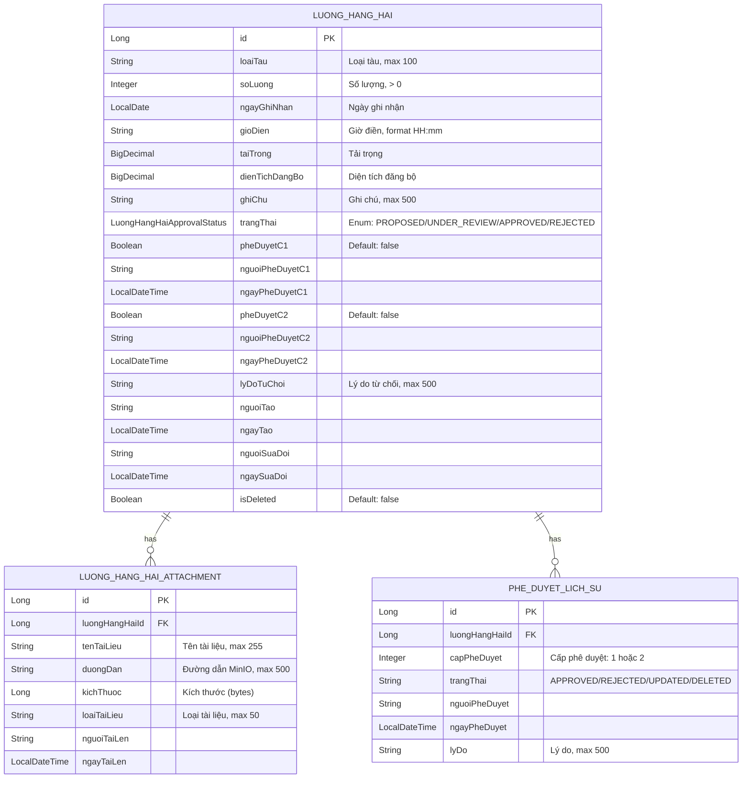
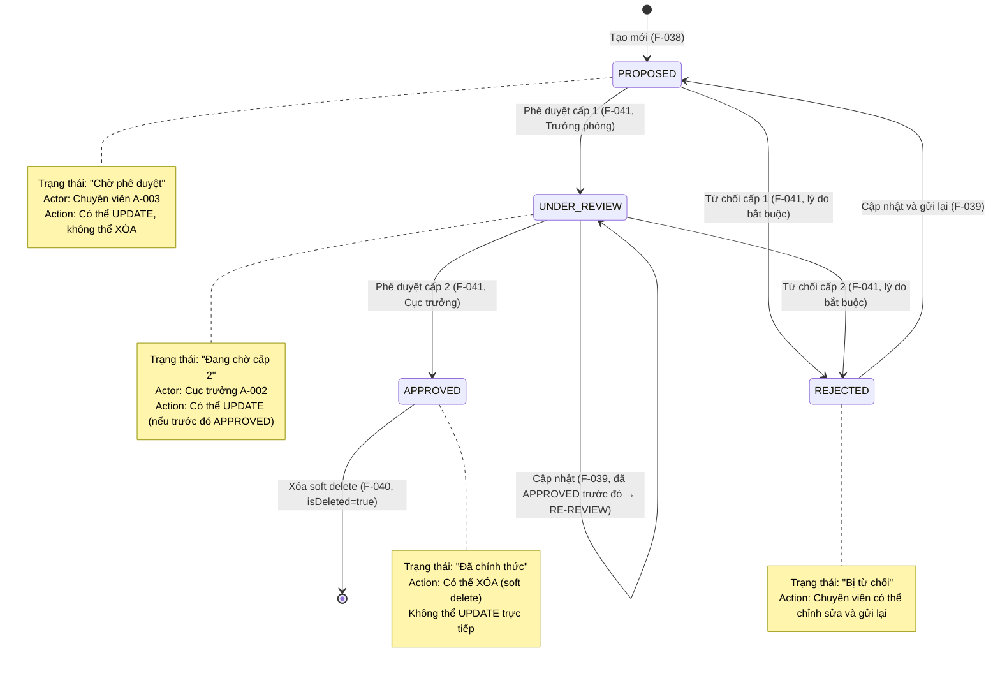

# DESIGN — Lượng hàng hải (F-038 → F-043)

Module: **M-003 — Quản lý tài sản KCHTGT - Khu nước & VTS**
Nhóm tính năng: **Lượng hàng hải** (F-038, F-039, F-040, F-041, F-042, F-043)
Stack: **Spring Boot 17+**, **MSSQL Server 2022**, **ReactJS 18+**, **Nginx**, **MinIO**, **GeoServer**
BA Source: `docs/modules/M-003-quan-ly-tai-san-kchtgt-khu-nuoc-vts/ba/00-lean-spec.md`

---

## 1. Architecture Overview

Hệ thống Lượng hàng hải tuân thủ kiến trúc lớp (layered architecture) chuẩn Spring Boot,
dựa trên pattern của `vanban` module (F-128 → F-135).

```mermaid
flowchart TD
    subgraph Client["ReactJS Client (F-042, F-043 UI)"]
        U[Người dùng]
    end

    subgraph Nginx["Nginx Reverse Proxy"]
        NX[Nginx → /api/** → Backend]
    end

    subgraph Controller["REST Controllers<br/>com.hanghai.kchtg.luonghanghai.controller"]
        C[LuongHangHaiController<br/>@RestController]
        C1[Auth filter<br/>@PreAuthorize]
    end

    subgraph Service["Business Services<br/>com.hanghai.kchtg.luonghanghai.service"]
        S[LuongHangHaiService<br/>@Service @Transactional]
        S1[Validation layer]
        S2[Approval workflow engine]
    end

    subgraph Repository["Data Access<br/>com.hanghai.kchtg.luonghanghai.repository"]
        R[LuongHangHaiRepository<br/>JpaRepository]
        R1[TaiLieuDinhKemRepository<br/>JpaRepository]
    end

    subgraph DB["MSSQL Server 2022"]
        T1[(luong_hang_hai)]
        T2[(luong_hang_hai_attachment)]
        T3[(phe_duyet_lich_su)]
    end

    subgraph External["External Services"]
        M[MinIO — File storage]
    end

    U -->|HTTP/HTTPS| NX
    NX --> C
    C --> C1
    C1 --> S
    S --> S1
    S --> S2
    S1 --> R
    S2 --> R
    R --> T1
    R --> T2
    R --> T3
    S -->|upload/download| M
```

**Lưu ý:**
- `PheDuyetLichSu` được lưu cùng repository `LuongHangHaiRepository` (FK cùng module).
- MinIO dùng cho `LuongHangHaiAttachment` (tài liệu đính kèm).
- JWT auth + `@PreAuthorize` filter tại controller layer.

---

## 2. Entity Relationship Diagram



### Enum: LuongHangHaiApprovalStatus

| Value | VN | Mô tả |
|-------|-----|-------|
| `PROPOSED` | Đề xuất | Chờ phê duyệt cấp 1 |
| `UNDER_REVIEW` | Đang xem xét | Đã duyệt cấp 1, chờ duyệt cấp 2 |
| `APPROVED` | Đã phê duyệt | Hoàn tất cả 2 cấp phê duyệt |
| `REJECTED` | Từ chối | Bị từ chối ở cấp 1 hoặc cấp 2 |

### Quan hệ Entity

- `LuongHangHai` 1 — * N `LuongHangHaiAttachment` (OneToMany, CASCADE ALL)
- `LuongHangHai` 1 — * N `PheDuyetLichSu` (OneToMany, CASCADE ALL)
- `LuongHangHaiAttachment` ManyToOne → `LuongHangHai` (luongHangHaiId FK)
- `PheDuyetLichSu` ManyToOne → `LuongHangHai` (luongHangHaiId FK)

---

## 3. Package Structure

```
com.hanghai.kchtg.luonghanghai
├── entity
│   ├── LuongHangHai.java              — Entity chính, 20+ fields, audit timestamps
│   ├── LuongHangHaiApprovalStatus.java — Enum: PROPOSED, UNDER_REVIEW, APPROVED, REJECTED
│   └── LuongHangHaiAttachment.java     — Entity đính kèm (MinIO)
├── repository
│   ├── LuongHangHaiRepository.java      — JpaRepository + custom queries
│   └── PheDuyetLichSuRepository.java    — JpaRepository + findByLuongHangHaiId
├── dto
│   ├── LuongHangHaiCreateRequest.java   — DTO tạo mới (F-038)
│   ├── LuongHangHaiUpdateRequest.java   — DTO cập nhật (F-039)
│   ├── LuongHangHaiResponse.java        — DTO response chung
│   ├── PheDuyetRequest.java             — DTO phê duyệt (F-041)
│   ├── PheDuyetResponse.java            — DTO response phê duyệt
│   ├── HistoryEntry.java                — DTO entry lịch sử (F-043)
│   └── LuongHangHaiAttachmentResponse.java — DTO attachment response
├── service
│   └── LuongHangHaiService.java         — CRUD + approval workflow (2 cấp)
└── controller
    └── LuongHangHaiController.java      — REST endpoints, @PreAuthorize
```

**Pattern tham khảo:** `com.hanghai.kchtg.vanban.*` (VanBanPhapLy entity, Controller, Service)

---

## 4. API Contract

### 4.1. CRUD Endpoints

| # | Method | Path | Feature | Permission | Request Body | Response | Description |
|---|--------|------|---------|------------|-------------|----------|-------------|
| 1 | `POST` | `/api/v1/luong-hang-hai` | F-038 | `luonghanghai:create` | `LuongHangHaiCreateRequest` | `ApiResponse<LuongHangHaiResponse>` | Tạo mới lượng hàng hải (state → PROPOSED) |
| 2 | `GET` | `/api/v1/luong-hang-hai` | F-042 | `luonghanghai:read` | — | `ApiResponse<Page<LuongHangHaiResponse>>` | Danh sách phân trang (loại trừ soft deleted) |
| 3 | `GET` | `/api/v1/luong-hang-hai/{id}` | F-042 | `luonghanghai:read` | — | `ApiResponse<LuongHangHaiResponse>` | Xem chi tiết (bao gồm thông tin phê duyệt + attachment) |
| 4 | `PUT` | `/api/v1/luong-hang-hai/{id}` | F-039 | `luonghanghai:update` | `LuongHangHaiUpdateRequest` | `ApiResponse<LuongHangHaiResponse>` | Cập nhật bản ghi |
| 5 | `DELETE` | `/api/v1/luong-hang-hai/{id}` | F-040 | `luonghanghai:delete` | — | `ApiResponse<Void>` | Soft delete bản ghi APPROVED |

### 4.2. Approval Endpoints

| # | Method | Path | Feature | Permission | Request Body | Response | Description |
|---|--------|------|---------|------------|-------------|----------|-------------|
| 6 | `POST` | `/api/v1/luong-hang-hai/{id}/approve/c1` | F-041 | `luonghanghai:approve:c1` | `PheDuyetRequest` | `ApiResponse<PheDuyetResponse>` | Phê duyệt cấp 1 (PROPOSED → UNDER_REVIEW) |
| 7 | `POST` | `/api/v1/luong-hang-hai/{id}/approve/c2` | F-041 | `luonghanghai:approve:c2` | `PheDuyetRequest` | `ApiResponse<PheDuyetResponse>` | Phê duyệt cấp 2 (UNDER_REVIEW → APPROVED) |

### 4.3. Query Endpoints

| # | Method | Path | Feature | Permission | Request Params | Response | Description |
|---|--------|------|---------|------------|---------------|----------|-------------|
| 8 | `GET` | `/api/v1/luong-hang-hai/search` | F-042 | `luonghanghai:read` | `keyword`, `loaiTau`, `trangThai`, `yearStart`, `yearEnd`, `page`, `size` | `ApiResponse<KetQuaTimKiemResponse>` | Tìm kiếm động |
| 9 | `GET` | `/api/v1/luong-hang-hai/status/{trangThai}` | F-042 | `luonghanghai:read` | `trangThai` (enum value) | `ApiResponse<List<LuongHangHaiResponse>>` | Lọc theo trạng thái |
| 10 | `GET` | `/api/v1/luong-hang-hai/{id}/history` | F-043 | `luonghanghai:history` | — | `ApiResponse<List<HistoryEntry>>` | Lịch sử thay đổi (giảm dần) |

### 4.4. DTO Schemas

**LuongHangHaiCreateRequest**

| Field | Type | Required | Validation |
|-------|------|----------|------------|
| `loaiTau` | String | Yes | `@NotBlank`, max 100 |
| `soLuong` | Integer | Yes | `@Min(1)` |
| `ngayGhiNhan` | LocalDate | Yes | `@PastOrPresent` |
| `gioDien` | String | No | Format HH:mm, max 10 |
| `taiTrong` | BigDecimal | No | `@Positive` |
| `dienTichDangBo` | BigDecimal | No | `@Positive` |
| `ghiChu` | String | No | max 500 |

**PheDuyetRequest**

| Field | Type | Required | Validation |
|-------|------|----------|------------|
| `quyetDinh` | String | Yes | `@NotBlank` (APPROVED / REJECTED) |
| `lyDo` | String | Yes (khi REJECTED) | `@NotBlank, max 500` |

---

## 5. Business Rules → Technical Mapping

| Rule ID | Business Rule | Technical Implementation |
|---------|--------------|-------------------------|
| BR-038-01 | Lượng hàng hải phải được phê duyệt trước khi chính thức ghi nhận | Entity default state = `PROPOSED` (not APPROVED) |
| BR-038-02 | Bản ghi mới luôn ở trạng thái `PROPOSED` | `LuongHangHaiService.create()` sets `trangThai = PROPOSED` |
| BR-038-03 | `loaiTau` bắt buộc, max 100 | `@NotBlank`, `@Column(length=100)` |
| BR-038-04 | `soLuong` bắt buộc, số nguyên dương | `@Min(1)` in DTO, `> 0` in service |
| BR-038-05 | `ngayGhiNhan` bắt buộc, ≤ ngày hiện tại | `@PastOrPresent` in DTO, validation in service |
| BR-038-06 | `taiTrong` tùy chọn, số thực dương | `@Positive` if present, nullable in entity |
| BR-038-07 | `dienTichDangBo` tùy chọn, số thực dương | `@Positive` if present, nullable in entity |
| BR-038-08 | Chỉ Chuyên viên (A-003) có quyền tạo | `@PreAuthorize("@auth.check(authentication, 'luonghanghai:create')")` |
| BR-039-01 | Cập nhật phải được phê duyệt lại | Sau khi update → `trangThai = UNDER_REVIEW` nếu trước đó là APPROVED |
| BR-039-02 | Chỉ PROPOSED/UNDER_REVIEW được cập nhật trực tiếp | Service kiểm tra `trangThai` trước khi update |
| BR-039-03 | APPROVED không cho phép cập nhật trực tiếp | Service ném `IllegalStateException` nếu trạng thái = APPROVED |
| BR-039-04 | Mọi thay đổi ghi nhận vào `PheDuyetLichSu` | `PheDuyetLichSuRepository.save()` với `status = UPDATED` |
| BR-039-05 | `nguoiSuaDoi` + `ngaySuaDoi` tự động cập nhật | `@PreUpdate` lifecycle callback trong entity |
| BR-039-06 | REJECTED có thể cập nhật và gửi lại | Service cho phép update khi `trangThai = REJECTED` |
| BR-040-01 | Xóa chỉ với bản ghi APPROVED | Service kiểm tra `trangThai == APPROVED` trước khi soft delete |
| BR-040-02 | Soft delete — giữ lại với flag `isDeleted` | `isDeleted = true`, tất cả query có `WHERE isDeleted = false` |
| BR-040-03 | Hành động xóa ghi nhận vào `PheDuyetLichSu` | `PheDuyetLichSu` entry với `status = DELETED` |
| BR-040-04 | Chỉ Chuyên viên có quyền xóa | `@PreAuthorize("@auth.check(authentication, 'luonghanghai:delete')")` |
| BR-041-01 | Phê duyệt 2 cấp: trưởng phòng → cục trưởng | 2 endpoint riêng: `/approve/c1` và `/approve/c2` |
| BR-041-02 | Từ chối cấp 1 → gửi lại cho chuyên viên | `trangThai = REJECTED`, chuyên viên có thể update |
| BR-041-03 | Từ chối cấp 2 → gửi lại cho chuyên viên | `trangThai = REJECTED`, chuyên viên có thể update |
| BR-041-04 | Lý do từ chối là bắt buộc | `PheDuyetRequest.lyDo` `@NotBlank` khi `quyetDinh = REJECTED` |
| BR-041-05 | Thời gian phê duyệt ghi nhận | `ngayPheDuyetC1`/`ngayPheDuyetC2` auto-set `LocalDateTime.now()` |
| BR-041-06 | Hoàn tất 2 cấp → `APPROVED` | Sau khi approveC2: `pheDuyetC2 = true`, `trangThai = APPROVED` |
| BR-041-07 | Trưởng phòng chỉ phê duyệt cấp 1 | Controller `/approve/c2` reject nếu role không phải Cục trưởng |
| BR-041-08 | Cục trưởng chỉ phê duyệt cấp 2 | Controller `/approve/c1` reject nếu role không phải Trưởng phòng |
| BR-041-09 | State transitions: PROPOSED → UNDER_REVIEW → APPROVED → REJECTED | Enforced in service layer methods |
| BR-041-10 | Mọi quyết định phê duyệt ghi nhận `PheDuyetLichSu` | `PheDuyetLichSuRepository.save()` tại mỗi approve/reject call |
| BR-042-01 | Tất cả roles tra cứu, xem chi tiết | `@PreAuthorize("@auth.check(authentication, 'luonghanghai:read')")` |
| BR-042-02 | Văn bản đính kèm xem và tải xuống | `LuongHangHaiAttachment` returned in detail response + MinIO presigned URL |
| BR-042-03 | Bản ghi xóa không hiển thị trong tra cứu | Repository query: `WHERE isDeleted = false` (mặc định) |
| BR-043-01 | Theo dõi lịch sử mọi bản ghi | `PheDuyetLichSu` entry tại mỗi create/update/approve/reject/delete |
| BR-043-02 | Lịch sử hiển thị giảm dần | Repository: `ORDER BY ngayPheDuyet DESC` |
| BR-043-03 | Chuyên viên xem lịch sử tất cả bản ghi | `@PreAuthorize("@auth.check(authentication, 'luonghanghai:history')")` |

---

## 6. State Machine



### State Transition Table

| Từ trạng thái | Hành động | Actor | Trạng thái mới | Ghi chú |
|--------------|----------|-------|---------------|---------|
| `PROPOSED` | Phê duyệt C1 | Trưởng phòng | `UNDER_REVIEW` | Tạo entry PheDuyetLichSu cap=1 |
| `PROPOSED` | Từ chối C1 | Trưởng phòng | `REJECTED` | LyDoTuChoi bắt buộc, tạo entry PheDuyetLichSu cap=1 |
| `UNDER_REVIEW` | Phê duyệt C2 | Cục trưởng | `APPROVED` | Tạo entry PheDuyetLichSu cap=2 |
| `UNDER_REVIEW` | Từ chối C2 | Cục trưởng | `REJECTED` | LyDoTuChoi bắt buộc, tạo entry PheDuyetLichSu cap=2 |
| `REJECTED` | Cập nhật | Chuyên viên | `PROPOSED` | Gửi lại quy trình phê duyệt |
| `APPROVED` | Xóa | Chuyên viên | `APPROVED` (isDeleted=true) | Soft delete, tạo entry PheDuyetLichSu status=DELETED |

---

## 7. Naming Conventions

### Java → Database Mapping

| Java Field (camelCase) | DB Column (snake_case) | Type |
|------------------------|------------------------|------|
| `loaiTau` | `loai_tau` | VARCHAR(100) NOT NULL |
| `soLuong` | `so_luong` | INT NOT NULL |
| `ngayGhiNhan` | `ngay_ghi_nhan` | DATE NOT NULL |
| `gioDien` | `gio_dien` | VARCHAR(10) |
| `taiTrong` | `tai_trong` | DECIMAL |
| `dienTichDangBo` | `dien_tich_dang_bo` | DECIMAL |
| `ghiChu` | `ghi_chu` | VARCHAR(500) |
| `trangThai` | `trang_thai` | VARCHAR(30) NOT NULL |
| `pheDuyetC1` | `phe_duyet_c1` | BIT NOT NULL DEFAULT 0 |
| `nguoiPheDuyetC1` | `nguoi_phe_duyet_c1` | VARCHAR(100) |
| `ngayPheDuyetC1` | `ngay_phe_duyet_c1` | DATETIME2 |
| `pheDuyetC2` | `phe_duyet_c2` | BIT NOT NULL DEFAULT 0 |
| `nguoiPheDuyetC2` | `nguoi_phe_duyet_c2` | VARCHAR(100) |
| `ngayPheDuyetC2` | `ngay_phe_duyet_c2` | DATETIME2 |
| `lyDoTuChoi` | `ly_do_tu_choi` | VARCHAR(500) |
| `nguoiTao` | `nguoi_tao` | VARCHAR(100) NOT NULL |
| `ngayTao` | `ngay_tao` | DATETIME2 NOT NULL |
| `nguoiSuaDoi` | `nguoi_sua_doi` | VARCHAR(100) |
| `ngaySuaDoi` | `ngay_sua_doi` | DATETIME2 |
| `isDeleted` | `is_deleted` | BIT NOT NULL DEFAULT 0 |

### Attachment Table

| Java Field | DB Column | Type |
|-----------|-----------|------|
| `luongHangHaiId` | `luong_hang_hai_id` | BIGINT NOT NULL (FK) |
| `tenTaiLieu` | `ten_tai_lieu` | VARCHAR(255) NOT NULL |
| `duongDan` | `duong_dan` | VARCHAR(500) NOT NULL |
| `kichThuoc` | `kich_thuoc` | BIGINT |
| `loaiTaiLieu` | `loai_tai_lieu` | VARCHAR(50) |
| `nguoiTaiLen` | `nguoi_tai_len` | VARCHAR(100) |
| `ngayTaiLen` | `ngay_tai_len` | DATETIME2 |

### History Table

| Java Field | DB Column | Type |
|-----------|-----------|------|
| `luongHangHaiId` | `luong_hang_hai_id` | BIGINT NOT NULL (FK) |
| `capPheDuyet` | `cap_phe_duyet` | INT NOT NULL (1 hoặc 2) |
| `trangThai` | `trang_thai` | VARCHAR(30) NOT NULL |
| `nguoiPheDuyet` | `nguoi_phe_duyet` | VARCHAR(100) NOT NULL |
| `ngayPheDuyet` | `ngay_phe_duyet` | DATETIME2 NOT NULL |
| `lyDo` | `ly_do` | VARCHAR(500) |

### Quy ước chung

- **Java fields:** camelCase (ví dụ: `loaiTau`, `ngayGhiNhan`)
- **DB columns:** snake_case (ví dụ: `loai_tau`, `ngay_ghi_nhan`)
- **Table names:** snake_case, không dấu (ví dụ: `luong_hang_hai`, `phe_duyet_lich_su`)
- **Enum values:** UPPER_SNAKE_CASE (ví dụ: `PROPOSED`, `UNDER_REVIEW`, `APPROVED`, `REJECTED`)
- **REST paths:** kebab-case (ví dụ: `/api/v1/luong-hang-hai`, `/approve/c1`)
- **DTO names:** `CreateRequest`, `UpdateRequest`, `Response`, `Entry`
- **Entity names:** không có tiền tố `Entity` (ví dụ: `LuongHangHai`, không `LuongHangHaiEntity`)

---

## 8. Dependencies & Constraints

### 8.1. Dependencies

| Category | Dependency | Version | Ghi chú |
|----------|-----------|---------|---------|
| Framework | Spring Boot | 3.x+ | Core framework, starter-web, starter-data-jpa, starter-security |
| DB Driver | jtds / MSSQL JDBC | Latest | MSSQL Server 2022 connection |
| ORM | Spring Data JPA + Hibernate | Bundled with Spring Boot | Entity mapping, CRUD, pagination |
| Validation | Hibernate Validator | Bundled | `@NotBlank`, `@Min`, `@Positive`, `@PastOrPresent` |
| Security | Spring Security | Bundled | JWT auth, `@PreAuthorize` |
| File Storage | MinIO Client | Latest | For LuongHangHaiAttachment upload/download |
| Utility | Lombok | Latest | `@Data`, `@Builder`, `@NoArgsConstructor`, `@AllArgsConstructor` |
| Logging | SLF4J + Logback | Bundled | Structured logging |

### 8.2. No External Dependencies

- **Không tích hợp** với hệ thống bên ngoài (email, SMS, ERP, ...) trong Phase 1.
- **Không dùng** Kafka/RabbitMQ cho messaging — chỉ dùng REST.
- **Không dùng** Redis caching trong Phase 1.
- Chỉ phụ thuộc vào **Spring Boot ecosystem** + **MSSQL** + **MinIO**.

### 8.3. Constraints

| ID | Constraint | Description |
|----|------------|-------------|
| C-001 | Soft delete bắt buộc | Tất cả xóa phải dùng `isDeleted = true`, không `DELETE` SQL |
| C-002 | Approval 2 cấp cứng | Không cho phép skip cấp 1 → cấp 2; không cho phép role sai phê duyệt sai cấp |
| C-003 | Transaction integrity | Mọi write operation (create, update, delete, approve) phải `@Transactional` |
| C-004 | Audit timestamps | `@PrePersist` và `@PreUpdate` tự động quản lý `ngayTao` và `ngaySuaDoi` |
| C-005 | Pagination trong query | `GET /luong-hang-hai` và `GET /luong-hang-hai/search` phải có `Pageable` |
| C-006 | Role-based access control | Mỗi endpoint phải có `@PreAuthorize` annotation với permission tương ứng |
| C-007 | API versioning | Tất cả endpoints phải có prefix `/api/v1/` |
| C-008 | Response wrapper | Tất cả response phải qua `ApiResponse<T>` wrapper |

---

*Design document tạo bởi engineering-system-architect cho module M-003, nhóm Lượng hàng hải.*
*Source BA: `docs/modules/M-003-quan-ly-tai-san-kchtgt-khu-nuoc-vts/ba/00-lean-spec.md` (746 lines).*
*Code pattern reference: `src/main/java/com/hanghai/kchtg/vanban/`.*
