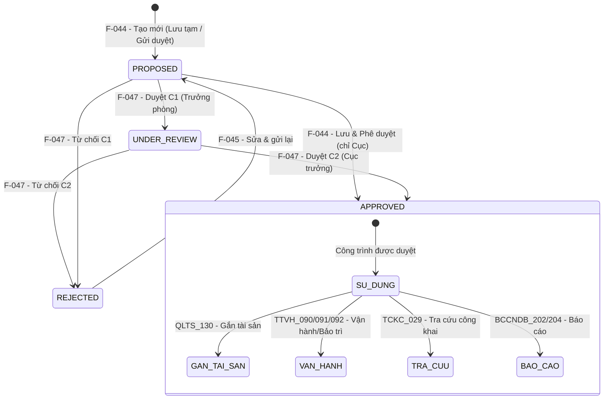

# Đặc tả nghiệp vụ: Quản lý Đê/kè - Tạo mới

**Tài liệu:** BA Feature Brief
**Feature:** F-044
**Module:** M-003 — Quản lý tài sản KCHTGT - Khu nước & VTS
**Người viết:** Business Analyst
**Ngày cập nhật:** 2026-08-10

---

## 1. Tổng quan

### 1.1. Tính năng này làm gì?

Cho phép người dùng có thẩm quyền (Chuyên viên, Trưởng phòng, Cục trưởng) tạo mới một công trình đê/kè (đê chắn sóng, đê chắn cát, kè hướng dòng, kè bảo vệ bờ) vào hệ thống quản lý tài sản KCHTGT khu nước. Người dùng nhập đầy đủ thông tin cơ bản, kỹ thuật, thời gian, tọa độ GIS và file đính kèm. Công trình sau khi tạo sẽ ở trạng thái "Chờ phê duyệt" và cần được phê duyệt trước khi đưa vào vận hành.

### 1.2. Tại sao cần tính năng này?

Đê/kè là công trình bảo vệ bờ quan trọng, đảm bảo an toàn cho hoạt động hàng hải và khai thác cảng trong khu vực. Việc số hóa quy trình đăng ký và quản lý đê/kè giúp đảm bảo thông tin kỹ thuật chính xác (chiều dài, cao trình đỉnh, loại kết cấu), phục vụ công tác đánh giá an toàn kết cấu, lập kế hoạch bảo trì, và gắn tài sản theo quy định. Hệ thống quản lý 4 loại kết cấu chính: đê chắn sóng, đê chắn cát, kè hướng dòng, kè bảo vệ bờ.

### 1.3. Luồng hoạt động chính

1. Người dùng đăng nhập hệ thống, vào menu **Quản lý KCHTGT > Quản lý đê/kè**.
2. Hệ thống hiển thị danh sách đê/kè.
3. Người dùng nhấn nút **"Tạo mới"**.
4. Hệ thống hiển thị form tạo mới với các trường rỗng.
5. Người dùng nhập thông tin vào các trường trên form.
6. Hệ thống kiểm tra tất cả các trường thông tin theo validation (xem chi tiết tại Mô tả màn hình).
7. Người dùng chọn một trong ba hành động lưu:
   - **"Lưu tạm":** Lưu với trạng thái "Chờ phê duyệt" (PROPOSED). Công trình chưa được gửi duyệt, có thể sửa tiếp.
   - **"Lưu và gửi phê duyệt":** Lưu và gửi yêu cầu phê duyệt đến cấp có thẩm quyền. Trạng thái chuyển sang "Chờ phê duyệt".
   - **"Lưu và phê duyệt":** (Chỉ dành cho Cấp Cục) Lưu và phê duyệt ngay. Trạng thái chuyển sang "Đã phê duyệt".
8. Hệ thống gọi API tạo mới và kiểm tra các quy tắc nghiệp vụ.
9. Nếu thành công: Công trình được lưu với trạng thái tương ứng, hệ thống ghi lịch sử phê duyệt, hiển thị thông báo thành công và chuyển hướng về trang danh sách.
10. Nếu thất bại: Thông báo lỗi hiển thị tại trường tương ứng.

---

## 2. Ai dùng? Dùng như thế nào?

Quyền thao tác và xem tính năng được áp dụng theo hệ thống phân quyền tập trung của hệ thống. Mỗi vai trò người dùng sẽ có phạm vi truy cập và thao tác khác nhau trên tính năng này, được kiểm soát bởi cơ chế RBAC (Role-Based Access Control).

### 2.1. Logic phân quyền chung

Các thao tác trong tính năng được bảo vệ bởi các quyền (permissions) tương ứng. Người dùng chỉ có thể thực hiện những thao tác mà vai trò của họ được cấp quyền (xem chi tiết tại tính năng Phân quyền).

### 2.2. Logic phân quyền đặc biệt cho tài khoản Admin Cục

Đối với tài khoản **Admin Cục**, áp dụng logic phân quyền đặc biệt sau:

- **Xem full dữ liệu:** Admin Cục có quyền xem toàn bộ dữ liệu trên hệ thống, không giới hạn phạm vi đơn vị hay khu vực.
- **Xem thông tin người chỉnh sửa:** Với mỗi bản ghi, Admin Cục thấy được thông tin người chỉnh sửa cuối cùng (họ tên, tên đăng nhập).
- **Xem thời gian cập nhật:** Admin Cục thấy được thời gian cập nhật cuối cùng của dữ liệu (timestamp).
- **Xem người tạo mới:** Admin Cục thấy được thông tin người tạo mới bản ghi (họ tên, tên đăng nhập).
- **Xem thời gian tạo mới:** Admin Cục thấy được thời gian tạo mới dữ liệu (timestamp).

> **Ghi chú:** Các trường `người tạo mới`, `thời gian tạo mới`, `người chỉnh sửa`, `thời gian cập nhật` cần được bổ sung vào bảng dữ liệu tương ứng và chỉ hiển thị đối với tài khoản Admin Cục. Với các vai trò khác, các trường này bị ẩn khỏi giao diện.

---

## 3. User Stories

Dưới đây là các câu chuyện người dùng, sắp xếp theo mức độ ưu tiên (Must > Should > Could):

### Mức Must (bắt buộc có)

- **US-044-01:** Là Chuyên viên, tôi muốn tạo mới một công trình đê/kè với đầy đủ thông tin cơ bản và kỹ thuật để đăng ký tài sản vào hệ thống quản lý.
- **US-044-02:** Là Chuyên viên, tôi muốn hệ thống tự động sinh mã đê/kè (DK-{seq}) để đảm bảo tính duy nhất của dữ liệu.
- **US-044-03:** Là Chuyên viên, tôi muốn đơn vị quản lý được điền sẵn theo đơn vị của tôi để tiết kiệm thời gian nhập liệu.
- **US-044-04:** Là Chuyên viên, tôi muốn có thể "Lưu tạm" công trình để chỉnh sửa thêm trước khi gửi phê duyệt.
- **US-044-05:** Là Chuyên viên, tôi muốn "Lưu và gửi phê duyệt" để gửi công trình đến cấp có thẩm quyền xem xét.
- **US-044-06:** Là Cục trưởng, tôi muốn "Lưu và phê duyệt" ngay để đưa công trình vào sử dụng mà không cần chờ duyệt thêm bước nữa.

### Mức Should (nên có)

- **US-044-07:** Là Chuyên viên, tôi muốn nhận được thông báo rõ ràng khi tạo mới thành công hoặc thất bại để biết trạng thái thao tác của mình.
- **US-044-08:** Là Chuyên viên, tôi muốn được chuyển hướng về danh sách sau khi tạo mới thành công để tiếp tục công việc.

### Mức Could (có thể có sau)

- **US-044-09:** Là Chuyên viên, tôi muốn upload file đính kèm (ảnh, bản vẽ, biên bản khảo sát) ngay khi tạo mới để hoàn thiện hồ sơ trong một lần thao tác.

---

## 4. Yêu cầu chức năng (Acceptance Criteria)

Mỗi yêu cầu dưới đây mô tả một điều hệ thống phải làm được, kèm theo cách xử lý khi có lỗi hoặc dữ liệu không như mong đợi.

**AC-044-01 — Hiển thị form tạo mới:** Người dùng có vai trò Chuyên viên, Trưởng phòng hoặc Cục trưởng nhấn nút "Tạo mới" từ danh sách Đê/kè, hệ thống hiển thị form tạo mới với đầy đủ các nhóm trường: Thông tin cơ bản, Thông tin kỹ thuật, Thời gian, Tọa độ GIS, File đính kèm. Nếu người dùng không có quyền, nút "Tạo mới" bị ẩn và API trả về 403 Forbidden.

**AC-044-02 — Mã đê/kè tự động sinh:** Hệ thống tự động sinh mã đê/kè theo định dạng `DK-{seq}` (seq tăng dần), duy nhất trong toàn hệ thống. Mã hiển thị trên form dưới dạng disabled (không cho sửa).

**AC-044-03 — Validation các trường bắt buộc:** Các trường Tên đê kè, Địa điểm (Tỉnh/TP), Địa điểm chi tiết, Loại kết cấu công trình, Chiều dài, Tình trạng là bắt buộc. Nếu thiếu trường nào, hệ thống hiển thị lỗi "Trường này là bắt buộc" và chặn submit.

**AC-044-04 — Validation chiều dài:** Chiều dài phải là số thập phân dương (> 0), không vượt quá 99999m. Nếu giá trị không hợp lệ, hiển thị lỗi tại trường tương ứng.

**AC-044-05 — Đơn vị quản lý mặc định:** Trường Đơn vị quản lý mặc định được điền theo đơn vị của người dùng đăng nhập. Khi tạo mới, người dùng chỉ thấy và chọn được dữ liệu trong phạm vi đơn vị quản lý của mình.

**AC-044-06 — Lưu tạm thành công:** Người dùng chọn "Lưu tạm", công trình được lưu với trạng thái "Chờ phê duyệt" (PROPOSED). Bản ghi approvalHistory được tạo với actionType = TAO_MOI. Hiển thị thông báo "Tạo đê kè thành công" và chuyển hướng về danh sách. Công trình có thể được chỉnh sửa tiếp (F-045).

**AC-044-07 — Lưu và gửi phê duyệt thành công:** Người dùng chọn "Lưu và gửi phê duyệt", công trình được lưu và gửi đến cấp phê duyệt. Trạng thái chuyển sang "Chờ phê duyệt" (PROPOSED). Hiển thị thông báo "Đã gửi phê duyệt đê kè" và chuyển hướng về danh sách. Công trình xuất hiện trong danh sách chờ phê duyệt của F-047.

**AC-044-08 — Lưu và phê duyệt thành công:** Người dùng Cấp Cục chọn "Lưu và phê duyệt", công trình được lưu và phê duyệt ngay. Trạng thái chuyển sang "Đã phê duyệt" (APPROVED), isApprovedLevel1 = isApprovedLevel2 = true. Hiển thị thông báo "Tạo mới và phê duyệt đê kè thành công". Công trình sẵn sàng để sử dụng trong các module khác.

**AC-044-09 — Lọc dữ liệu theo đơn vị quản lý:** Dropdown Thuộc cảng biển được lọc theo Đơn vị quản lý đã chọn. Khi thay đổi Đơn vị quản lý, dropdown Cảng biển được load lại.

---

## 5. Quy tắc nghiệp vụ (Business Rules)

Các quy tắc này là "luật chơi" mà mọi thành phần trong hệ thống phải tuân thủ:

**BR-044-01 — Mã đê/kè tự động sinh và bất biến:** Mã đê/kè được hệ thống tự động sinh theo định dạng `DK-{seq}`, duy nhất trong toàn hệ thống và không thể thay đổi sau khi đã tạo. Người dùng không được phép nhập hoặc sửa mã.

**BR-044-02 — Đơn vị quản lý mặc định theo user:** Trường Đơn vị quản lý mặc định được điền theo đơn vị của người dùng đăng nhập. Trường này sẽ bị disabled khi sửa (F-045).

**BR-044-03 — Cảng biển phải đã duyệt:** Khi chọn Cảng biển (nếu có), chỉ hiển thị các Cảng biển đã duyệt và đang hoạt động. Trường này sẽ bị disabled khi sửa (F-045).

**BR-044-04 — Công trình chưa duyệt thì chưa dùng được:** Công trình sau khi tạo (kể cả "Lưu tạm" hay "Lưu và gửi phê duyệt") đều ở trạng thái chưa được phê duyệt (PROPOSED). Ở trạng thái này, công trình **chưa thể được tham chiếu** bởi bất kỳ module nào khác (không xuất hiện trong dropdown chọn đê/kè của module Gắn tài sản, Vận hành, Bảo trì, Tra cứu công khai...). Phải qua bước phê duyệt (F-047) để đạt trạng thái "Đã phê duyệt" (APPROVED) thì mới có thể sử dụng.

**BR-044-05 — Ghi lịch sử tự động:** Mọi thao tác tạo mới đều được ghi tự động vào bảng `dike_revetment_approval_history` để phục vụ kiểm toán và truy vết. Lịch sử bao gồm: mã đê/kè, người tạo, thời gian tạo, loại hành động (TAO_MOI).

**BR-044-06 — Validation các trường thông tin:** Các trường thông tin cần nhập đúng validation (xem chi tiết tại mục 9.1 Mô tả màn hình). Validation được thực hiện ở cả client-side và server-side.

**BR-044-07 — Đê/kè KHÔNG phụ thuộc VTS:** Module đê/kè thuộc nhóm KCHT_ATHH (An toàn hàng hải), không liên kết với hệ thống VTS. Các trường liên quan đến VTS (fkHtVts, fkTtDhVts) không áp dụng cho đê/kè.

---

## 6. Vòng đời và liên kết với các tính năng khác

> ⚠ **QUAN TRỌNG CHO DEVELOPER:** Tính năng Tạo mới Đê/kè (F-044) là **bước đầu tiên** trong vòng đời của công trình đê/kè. Dưới đây là toàn bộ vòng đời và các tính năng liên quan mà developer cần nắm khi phát triển.

### 6.1. Vòng đời đê/kè



### 6.2. Trạng thái và ý nghĩa

| Trạng thái | Mã | Ý nghĩa | Có thể dùng ở module khác? |
|---|---|---|---|
| Chờ phê duyệt | PROPOSED | Công trình vừa được tạo (lưu tạm hoặc đã gửi duyệt), đang chờ phê duyệt | **❌ Không** — không xuất hiện trong dropdown chọn đê/kè |
| Đang duyệt | UNDER_REVIEW | Đã duyệt C1, đang chờ duyệt C2 | **❌ Không** — chưa thể sử dụng |
| Đã phê duyệt | APPROVED | Công trình đã được duyệt C1+C2, sẵn sàng sử dụng | **✅ Có** — xuất hiện trong tất cả dropdown và module liên quan |
| Từ chối | REJECTED | Công trình bị từ chối, cần sửa và gửi lại | **❌ Không** — cần sửa lại (F-045) và gửi duyệt lại |

### 6.3. Các tính năng liên quan trực tiếp

Những tính năng này nằm trong cùng module M-003 và developer làm F-044 **cần biết** vì chúng tạo thành chuỗi nghiệp vụ liên tục:

| Feature | Tên | Vai trò | Mối liên kết với F-044 |
|---|---|---|---|
| **F-045** | Cập nhật Đê/kè | Sửa thông tin sau khi tạo | Sau khi sửa, trạng thái quay về PROPOSED → cần duyệt lại |
| **F-046** | Xóa Đê/kè | Xóa mềm công trình | Chỉ xóa được bản ghi PROPOSED. APPROVED cần quy trình hủy riêng |
| **F-047** | Phê duyệt Đê/kè | Duyệt 2 cấp (C1+C2) | **Bắt buộc** — công trình tạo từ F-044 phải qua F-047 mới được sử dụng |
| **F-048** | Xem chi tiết Đê/kè | Xem thông tin công trình | Có thể xem ở mọi trạng thái |
| **F-049** | Lịch sử Đê/kè | Xem nhật ký thay đổi | Ghi nhận mọi thao tác từ F-044 |

### 6.4. Các module/tính năng sử dụng đê/kè sau khi đã duyệt

Sau khi công trình được duyệt (APPROVED), nó sẽ xuất hiện trong các module sau. Developer cần đảm bảo filter `approvalStatus = APPROVED` khi xây dựng dropdown chọn đê/kè:

| Module | Mục đích | Ghi chú |
|---|---|---|
| Gắn tài sản (QLTS_130 → PDTS_131) | Gắn thông tin tài chính (nguyên giá, khấu hao) | Chỉ chọn đê/kè đã duyệt |
| Vận hành khai thác (TTVH_090) | Gắn thông tin vận hành | Lọc theo đê/kè |
| Bảo trì, sửa chữa (TTVH_091) | Gắn lịch sử bảo trì | Lọc theo đê/kè |
| Sự cố (TTVH_092) | Ghi nhận sự cố | Lọc theo đê/kè |
| Báo cáo thống kê | BCCNDB_202, BCCNDB_204 | Chỉ thống kê đê/kè đã duyệt |
| Tra cứu công khai (TCKC_029) | Xem thông tin đê/kè (read-only) | Dữ liệu từ đê/kè đã duyệt |
| Tích hợp LGSP | THKCHT_260 (nhận), CSDL_223 (gửi) | Chỉ dữ liệu đã duyệt |

### 6.5. Module cha

Đê/kè thuộc nhóm KCHT_ATHH (An toàn hàng hải), dùng chung infrastructure với các công trình ATHH khác. Có thể liên kết với Cảng biển qua trường `cangBienId`.

```markmap
- Cảng biển (CB)
  - Đê/kè (DK) — có thể trực thuộc Cảng biển
```

---

## 7. Mô hình dữ liệu

Tính năng này tạo ra/sửa đổi các bảng dữ liệu sau trong cơ sở dữ liệu:

> **Quy ước đánh dấu:**
> - <span style="color:red;font-weight:bold">🔴 Chữ màu đỏ</span> = **trường mới cần thêm** vào bảng hiện có.
> - ~~Chữ gạch ngang~~ = **trường không cần thiết**, cần loại bỏ khỏi bảng.
> - Các trường không được đánh dấu là các trường hiện có, được giữ nguyên.

### 7.1. Bảng `dike_revetment` — Thông tin đê/kè

Đây là bảng chính, lưu toàn bộ thông tin kỹ thuật và trạng thái của công trình đê/kè.

**A. Thông tin cơ bản (root fields):**

- <span style="color:red;font-weight:bold">**cangBienId:** UUID, khóa ngoại đến Cảng biển, tùy chọn. Chỉ chọn Cảng biển đã duyệt. Disabled khi sửa (F-045).</span>
- <span style="color:red;font-weight:bold">**donViVanHanhId:** UUID, đơn vị vận hành, tùy chọn. Danh mục DON_VI_KHAI_THAC.</span>
- **orgUnitId:** UUID, đơn vị quản lý, bắt buộc. Mặc định = đơn vị của user đăng nhập. Disabled khi sửa (F-045).
- <span style="color:red;font-weight:bold">**ma:** chuỗi, mã đê kè, duy nhất toàn hệ thống (unique constraint). Tự động sinh: DK-{seq}. Không cho sửa.</span>
- **dikeRevetmentName:** chuỗi (255), tên đê/kè, bắt buộc.
- **location:** chuỗi (200), địa điểm (Tỉnh/TP), bắt buộc. Danh mục Tỉnh/TP.
- <span style="color:red;font-weight:bold">**locationDetail:** chuỗi (500), địa điểm chi tiết, bắt buộc.</span>
- **dikeRevetmentType:** enum, loại kết cấu công trình, bắt buộc. Các giá trị: WAVE_BREAK_REVETMENT (đê chắn sóng), SAND_BREAK_REVETMENT (đê chắn cát), FLOW_GUIDE_REVETMENT (kè hướng dòng), BANK_PROTECTION_REVETMENT (kè bảo vệ bờ), RIVER_DIKE, SAND_DIKE, TRAFFIC.

**B. Thông tin kỹ thuật (root fields):**

- **length:** số thập phân (mét), > 0, ≤ 99999, bắt buộc.
- **height:** số thập phân (mét), tùy chọn.
- **crestElevation:** số thập phân (mét), cao trình đỉnh, tùy chọn.
- ~~**surfaceMaterial:** chuỗi (100), vật liệu bề mặt, tùy chọn.~~

**C. Thông tin thời gian:**

- <span style="color:red;font-weight:bold">**constructionDate:** ngày tháng, thời điểm xây dựng, tùy chọn.</span>
- **commissioningDate:** ngày tháng (năm), thời điểm đưa vào khai thác, tùy chọn.
- <span style="color:red;font-weight:bold">**lastMaintenanceYear:** số nguyên (năm), năm bảo trì gần nhất, tùy chọn.</span>

**D. Trạng thái & metadata:**

- **status:** chuỗi (100), tình trạng, bắt buộc. Các giá trị: Chưa khai thác/vận hành / Đang khai thác/vận hành / Dừng khai thác/vận hành. Danh mục TINH_TRANG.
- **note:** chuỗi (500), ghi chú, tùy chọn.
- **approvalStatus:** enum (PROPOSED, UNDER_REVIEW, APPROVED, REJECTED), mặc định PROPOSED khi tạo mới.
- **isApprovedLevel1:** boolean, đã duyệt cấp 1 (Trưởng phòng), mặc định false.
- **approverLevel1:** chuỗi (100), người duyệt cấp 1.
- **approvedDateLevel1:** ngày tháng, ngày duyệt cấp 1.
- **isApprovedLevel2:** boolean, đã duyệt cấp 2 (Cục trưởng), mặc định false.
- **approverLevel2:** chuỗi (100), người duyệt cấp 2.
- **approvedDateLevel2:** ngày tháng, ngày duyệt cấp 2.
- **rejectionReason:** chuỗi (500), lý do từ chối (khi REJECTED).
- **isDeleted:** boolean, xóa mềm, mặc định false.
- **createdBy:** UUID, người tạo (lấy từ token, không nhận từ client).
- **createdAt:** timestamp, thời điểm tạo (tự động).
- **updatedBy:** UUID, người cập nhật cuối (lấy từ token).
- **updatedAt:** timestamp, thời điểm cập nhật cuối (tự động).

**E. GIS & File đính kèm:**

- <span style="color:red;font-weight:bold">**loaiDoiTuong:** enum (DIEM, DUONG, VUNG), loại đối tượng GIS, tùy chọn.</span>
- <span style="color:red;font-weight:bold">**bieuTuong:** chuỗi, biểu tượng bản đồ (icon), tùy chọn. Bắt buộc khi đã chọn loaiDoiTuong.</span>
- <span style="color:red;font-weight:bold">**heQuyChieu:** chuỗi, hệ quy chiếu, tự động = "WGS_84", disabled (không cho sửa).</span>
- <span style="color:red;font-weight:bold">**quyTacHienThi:** chuỗi, quy tắc hiển thị tọa độ, tự động = "Độ/Phút/Giây", disabled (không cho sửa).</span>
- **spatialId:** UUID, liên kết dữ liệu không gian GIS (tọa độ).
- **attachments:** OneToMany → bảng `dike_revetment_attachment`, danh sách file đính kèm.

### 7.2. Bảng `dike_revetment_attachment` — File đính kèm

Lưu trữ file đính kèm của từng bản ghi đê/kè (ảnh, bản vẽ, biên bản khảo sát...). Liên kết 1-nhiều với `dike_revetment`.

### 7.3. Bảng `dike_revetment_approval_history` — Lịch sử phê duyệt

Bảng ghi nhận tự động mỗi khi công trình được tạo mới, cập nhật, phê duyệt hoặc xóa:

- **id:** UUID, định danh bản ghi lịch sử
- **dikeRevetmentId:** UUID, khóa ngoại đến dike_revetment
- **actionType:** enum (TAO_MOI, CAP_NHAT, PHE_DUYET_C1, PHE_DUYET_C2, TU_CHOI, XOA_MEM)
- **changedBy:** UUID, người thực hiện thay đổi
- **changedAt:** timestamp, thời gian thay đổi (tự động)
- **note:** chuỗi (500), ghi chú thay đổi

---

## 8. API Endpoints

Hệ thống cung cấp các API để phục vụ các thao tác liên quan đến tính năng:

| Method | Endpoint | Mô tả | Phân quyền |
|---|---|---|---|
| POST | `/api/v1/dike-revetment` | Tạo mới đê/kè | `dikerevetment:create` |
| GET | `/api/v1/cang-bien?trangThaiHoatDong=HIEN_HANH` | Lấy danh sách Cảng biển đang hoạt động (cho dropdown) | `dikerevetment:create` |

**Request Body (tạo mới):**

```json
{
  "dikeRevetmentType": "WAVE_BREAK_REVETMENT",
  "location": "Hải Phòng",
  "dikeRevetmentName": "Đê chắn sóng cảng Hải Phòng",
  "length": 850.00,
  "crestElevation": 5.20,
  "commissioningDate": "2019-01-01",
  "height": 12.50,
  "status": "Đang khai thác/vận hành",
  "note": "Đê chắn sóng phía Bắc luồng vào cảng",
  "orgUnitId": "...",
  "attachments": []
}
```

> **Ghi chú:** Các API khác (GET list, GET detail, PUT update, DELETE, approve C1/C2, history) thuộc các tính năng F-045, F-046, F-047, F-048, F-049.

---

## 9. Chi tiết nghiệp vụ từng phần

### 9.1. Form Tạo mới Đê/kè

Form tạo mới gồm 4 nhóm thông tin chính.

#### A. Thông tin cơ bản

| STT | Tên trường | Loại điều khiển | Cho phép chỉnh sửa | Bắt buộc | Giá trị mặc định | Mô tả |
| --- | --- | --- | --- | --- | --- | --- |
| 1 | Đơn vị quản lý | SelectOrgCode | Có | Có | Đơn vị của user | Chọn đơn vị quản lý. Mặc định = đơn vị của người dùng đăng nhập. Khi thay đổi, dropdown Cảng biển được lọc lại. |
| 2 | Thuộc cảng biển | Select (Dropdown) | Có | Không | Trống | Chọn Cảng biển cha. Validation: chỉ hiển thị Cảng biển đã duyệt. Sau khi tạo, trường này thành read-only (disabled khi EDIT). |
| 3 | Đơn vị vận hành | Select (Dropdown) | Có | Không | Trống | Chọn đơn vị vận hành. Danh mục: DON_VI_KHAI_THAC. |
| 4 | Mã đê kè | Textbox (disabled) | Không | Không | DK-{seq} (tự sinh) | Hiển thị mã tự động sinh. Không cho phép chỉnh sửa. |
| 5 | Tên đê kè | Textarea | Có | Có | Trống | Nhập tên công trình. Validation: không được để trống, tối đa 255 ký tự. |
| 6 | Địa điểm (Tỉnh/TP) | Select (Dropdown) | Có | Có | Trống | Chọn Tỉnh/Thành phố. Danh mục: Tỉnh/TP. |
| 7 | Địa điểm chi tiết | Textarea | Có | Có | Trống | Nhập địa điểm chi tiết. Tối đa 500 ký tự. |
| 8 | Loại kết cấu công trình | Select (Dropdown) | Có | Có | Trống | Chọn loại kết cấu: Đê chắn sóng / Đê chắn cát / Kè hướng dòng / Kè bảo vệ bờ. Danh mục: LOAI_KCCT_DE_KE. |

#### B. Thông tin kỹ thuật

| STT | Tên trường | Loại điều khiển | Cho phép chỉnh sửa | Bắt buộc | Giá trị mặc định | Mô tả |
| --- | --- | --- | --- | --- | --- | --- |
| 9 | Chiều dài (m) | Number Input | Có | Có | Trống | Nhập chiều dài công trình. Đơn vị: mét (m). Validation: giá trị thập phân dương (> 0), không vượt quá 99999m. |
| 10 | Chiều cao (m) | Number Input | Có | Không | Trống | Nhập chiều cao công trình. Đơn vị: mét (m). |
| 11 | Cao trình đỉnh (m) | Number Input | Có | Không | Trống | Nhập cao trình đỉnh. Đơn vị: mét (m). |
| 12 | ~~Vật liệu bề mặt~~ | ~~Textbox~~ | ~~Có~~ | ~~Không~~ | ~~Trống~~ | ~~Nhập vật liệu bề mặt (bê tông, đá hộc...). Tối đa 100 ký tự. Trường không cần thiết, cần loại bỏ.~~ |

#### C. Thông tin thời gian

| STT | Tên trường | Loại điều khiển | Cho phép chỉnh sửa | Bắt buộc | Giá trị mặc định | Mô tả |
| --- | --- | --- | --- | --- | --- | --- |
| 13 | Thời điểm xây dựng | DatePicker | Có | Không | Trống | Chọn ngày xây dựng công trình. |
| 14 | Thời điểm đưa vào khai thác | DatePicker (year) | Có | Không | Trống | Chọn năm đưa vào khai thác. |
| 15 | Năm bảo trì gần nhất | DatePicker (year) | Có | Không | Trống | Chọn năm bảo trì gần nhất. |
| 16 | Tình trạng | Select (Dropdown) | Có | Có | Đang khai thác/vận hành | Chọn tình trạng: Chưa khai thác/vận hành / Đang khai thác/vận hành / Dừng khai thác/vận hành. Danh mục: TINH_TRANG. |
| 17 | Ghi chú | Textarea | Có | Không | Trống | Nhập ghi chú. Tối đa 500 ký tự. |

#### D. GIS & File đính kèm

| STT | Tên trường | Loại điều khiển | Cho phép chỉnh sửa | Bắt buộc | Giá trị mặc định | Mô tả |
| --- | --- | --- | --- | --- | --- | --- |
| G0 | Loại đối tượng | Select (Dropdown) | Có | Không | Trống | Chọn loại đối tượng GIS: Điểm / Đường / Vùng. Khi có chọn loại đối tượng, trường Biểu tượng trở thành bắt buộc. |
| G1 | Biểu tượng | Select (Icon picker) | Có | Có (khi G0 đã chọn) | Trống | Chọn biểu tượng hiển thị trên bản đồ. **Bắt buộc khi** trường G0 đã chọn loại đối tượng. Khi G0 để trống, trường này bị ẩn hoặc disabled. |
| G2 | Hệ quy chiếu | Textbox (disabled) | Không | Không | WGS_84 | Hiển thị hệ quy chiếu mặc định. Luôn = "WGS_84", không cho phép chỉnh sửa. |
| G3 | Quy tắc hiển thị | Textbox (disabled) | Không | Không | Độ/Phút/Giây | Hiển thị quy tắc hiển thị tọa độ mặc định. Luôn = "Độ/Phút/Giây", không cho phép chỉnh sửa. |
| G4 | Tọa độ GIS | Bảng tọa độ | Có | Không | Trống | Nhập danh sách điểm tọa độ (kinh độ, vĩ độ). Component: LocationInformationForm. |
| G2 | File đính kèm | Upload | Có | Không | Trống | Upload file đính kèm (PDF, ảnh...). Component: UploadFileTable. |

#### E. Nút hành động

| STT | Tên trường | Loại điều khiển | Cho phép chỉnh sửa | Bắt buộc | Giá trị mặc định | Mô tả |
| --- | --- | --- | --- | --- | --- | --- |
|  | Nút "Lưu tạm" | Button | — | — | — | Lưu với trạng thái PROPOSED, không gửi duyệt. Hiển thị thông báo: "Tạo đê kè thành công". Redirect về danh sách. Có thể sửa tiếp. |
|  | Nút "Lưu và gửi phê duyệt" | Button | — | — | — | Lưu và gửi yêu cầu phê duyệt. Hiển thị thông báo: "Đã gửi phê duyệt đê kè". Redirect về danh sách. Công trình chờ duyệt tại F-047. |
|  | Nút "Lưu và phê duyệt" | Button | — | — | — | Chỉ hiển thị cho Cấp Cục. Lưu và phê duyệt ngay (APPROVED, C1+C2). Hiển thị thông báo: "Tạo mới và phê duyệt đê kè thành công". Công trình sẵn sàng sử dụng ngay. |
|  | Nút "Hủy" | Button | — | — | — | Hủy thao tác tạo mới, quay về trang danh sách Đê/kè. Không lưu dữ liệu đã nhập. |

---

## 10. Yêu cầu phi chức năng

### 10.1. Hiệu năng

- Form tạo mới load trong vòng ≤ 2 giây (bao gồm danh mục: loại kết cấu, tình trạng, đơn vị, cảng biển, tỉnh/TP)
- Lưu bản ghi phản hồi trong ≤ 1 giây
- Upload file ≤ 10MB/file, tổng dung lượng đính kèm ≤ 50MB/bản ghi

### 10.2. Khả năng mở rộng

- Hỗ trợ thêm loại kết cấu công trình mới thông qua danh mục (không cần sửa code)
- Form tạo mới dùng chung component với form sửa (F-045) để giảm trùng lặp code

### 10.3. Bảo mật

- Phân quyền RBAC được áp dụng trên tất cả các API liên quan đến tính năng
- Mọi request phải kèm JWT token hợp lệ
- Chống mass-assignment: các trường `createdBy`, `createdAt`, `updatedBy`, `updatedAt`, `approvalStatus`, `isApprovedLevel1`, `isApprovedLevel2` được set bởi server, không nhận từ client
- Nút "Lưu và phê duyệt" chỉ hiển thị cho Cấp Cục
- Dữ liệu được lọc theo đơn vị quản lý của người dùng (không thấy dữ liệu ngoài phạm vi)

### 10.4. Độ tin cậy

- Validation được thực hiện ở cả client-side và server-side để đảm bảo dữ liệu hợp lệ
- Unique constraint `ma` được đảm bảo ở tầng database
- Transaction rollback nếu lưu file đính kèm thất bại

### 10.5. Trải nghiệm người dùng

- Giao diện responsive: trên điện thoại (dưới 768px), thanh menu thu gọn
- Có loading skeleton khi đang tải dữ liệu
- Có trạng thái rỗng (empty state) với hướng dẫn thân thiện
- Tuân thủ tiêu chuẩn trợ năng WCAG 2.1 AA

### 10.6. Tuân thủ pháp lý

- Dữ liệu đê/kè phải tuân thủ quy định của Cục Hàng hải Việt Nam về quản lý KCHTGT
- Lưu trữ lịch sử phê duyệt tối thiểu 5 năm để phục vụ công tác kiểm toán

---

## 11. Yêu cầu giao diện người dùng

> **Nguyên tắc cốt lõi:** Mọi giá trị màu sắc, khoảng cách, kích thước chữ trong giao diện đều được định nghĩa tập trung tại 2 file `frontend/src/theme.ts` (layout, màu nền sidebar/header) và `frontend/src/tokens.ts` (màu chữ, màu trạng thái, thang số). Tuyệt đối không hardcode giá trị hex hay pixel trong component.

### 11.1. Bố cục chung

Màn hình Tạo mới Đê/kè dùng chung bố cục toàn hệ thống, bao gồm:

- **Thanh menu trái (sidebar):** rộng 272px, nền màu xanh dương đậm `#12468C`. Mục đang chọn được tô màu xanh sáng `#1B84FF`. Khi thu gọn (trên điện thoại), rộng còn 80px và chuyển thành nút hamburger.
- **Thanh tiêu đề trên cùng (header):** cao 64px, nền trắng, chứa tên người dùng và avatar.
- **Vùng nội dung chính:** nền xám nhạt pha xanh `#eaf0f6`, giúp các card trắng bên trong nổi bật hơn.

### 11.2. Hệ thống màu sắc

Mỗi màu sắc trong giao diện được gán một "vai trò" rõ ràng. Developer không được dùng màu theo cảm tính mà phải import đúng token:

| Khi cần... | Dùng token | Màu thực tế |
|---|---|---|
| Tiêu đề trang, số liệu quan trọng | `textPrimary` | `#0c2438` |
| Nhãn field, mô tả | `textSecondary` | `#566a7c` |
| Thời gian, trạng thái phụ, caption | `textTertiary` | `#93a3b3` |
| Nền card, modal, bảng | `surfaceCard` | `#FFFFFF` |
| Nền vùng nội dung chính | `surfacePage` | `#eaf0f6` |
| Viền card, đường kẻ | `borderDefault` | `rgba(11,46,79,0.09)` |
| Nút chính, link | `actionPrimary` | `#0E6FD6` |

### 11.3. Thang số — chỉ dùng giá trị cho phép

**Khoảng cách (spacing):** 4px, 8px, 12px, 16px, 24px, 32px. Trong đó 12px là khoảng cách mặc định giữa các trường trong form (`spaceFormField`), 16px là padding mặc định của card (`spaceMd`).

**Bo góc (radius):** 4px (cho ô textarea), 8px, 12px (cho card), 999px (dạng pill — dùng cho input, select, button).

**Cỡ chữ (font size):** 10px (metadata, caption), 13px (nhãn, nội dung), 15px (tiêu đề card, tiêu đề section), 18px (tiêu đề trang).

**Độ đậm chữ (font weight):** 400 (nội dung), 500 (nhãn, nút), 600 (số liệu quan trọng, tiêu đề).

**Font chữ:** `'Inter', -apple-system, BlinkMacSystemFont, sans-serif` cho toàn bộ văn bản.

> **Cấm tuyệt đối:** spacing 6, 10, 14, 18; radius 6, 7, 10; font-size 12, 14, 16, 24.

### 11.4. Style có sẵn — dùng lại, đừng tự chế

Hệ thống đã định nghĩa sẵn các kiểu dáng phổ biến. Khi cần hiển thị:

- **Thời gian, caption:** dùng `metaStyle` (chữ nhỏ 10px, màu xám nhạt, weight 400)
- **Card nội dung:** dùng `cardStyle` (nền trắng, viền 0.5px, bo góc 12px, padding 16px)
- **Tag trạng thái:** dùng `badgeBaseStyle` (chữ nhỏ, weight 500, padding 2px-8px, pill)
- **Link, nút text:** dùng `actionStyle` (pill, màu actionPrimary, weight 500)
- **Đường kẻ ngăn cách:** dùng `dividerStyle`

### 11.5. Giới hạn màu nhấn — tối đa 3 lần mỗi màn

Màu `actionPrimary` (`#0E6FD6`) là màu nhấn mạnh nhất, dùng cho các hành động chính. Để tránh giao diện bị "rối", màu này chỉ xuất hiện tối đa 3 lần trên toàn bộ màn hình Tạo mới Đê/kè:

1. Nút "Lưu và gửi phê duyệt" (hành động chính)
2. Breadcrumb link "Quản lý đê/kè" (điều hướng)
3. Nút "Lưu và phê duyệt" (nếu là Cấp Cục)

Các màu trạng thái (xanh lá cho thành công, vàng cho cảnh báo, đỏ cho lỗi) và màu chữ không tính vào giới hạn này.

### 11.6. Màn hình Form Tạo mới Đê/kè

Màn hình sử dụng component `FormCrud` dùng chung cho các công trình KCHTGT.

1. **ScreenHeader:** hiển thị đường dẫn breadcrumb "Quản lý KCHTGT Khu nước & VTS > Quản lý đê/kè > Tạo mới".

2. **Thông tin cơ bản** — 8 trường: Đơn vị QL → Loại kết cấu công trình

3. **Thông tin kỹ thuật** — 4 trường: Chiều dài → Vật liệu bề mặt

4. **Thông tin thời gian** — 5 trường: Thời điểm xây dựng → Ghi chú

5. **Tọa độ GIS** — Bảng tọa độ (kinh độ, vĩ độ). Component: `LocationInformationForm`

6. **File đính kèm** — Khu vực upload file. Component: `UploadFileTable`

7. **Form actions:** 4 nút luôn hiển thị cố định ở cuối form:
   - Nút **"Lưu tạm"** (textSecondary, pill outline): Lưu không gửi duyệt
   - Nút **"Lưu và gửi phê duyệt"** (actionPrimary, pill): **Hành động chính**
   - Nút **"Lưu và phê duyệt"** (actionPrimary, pill): Chỉ Cấp Cục
   - Nút **"Hủy"** (textSecondary, pill outline): Quay về danh sách

### 11.7. Các trạng thái giao diện

- **Đang tải:** hiển thị spinner/skeleton khi tải danh mục hoặc gọi API.
- **Không có Cảng biển:** dropdown hiển thị trạng thái rỗng "Không có dữ liệu".
- **Lỗi tải dữ liệu:** cảnh báo đỏ + nút "Thử lại".
- **Lỗi validation:** thông báo lỗi đỏ bên dưới mỗi trường không hợp lệ.

### 11.8. Giao diện trên điện thoại

Khi màn hình nhỏ hơn 768px:

- Thanh menu trái thu gọn thành nút hamburger 80px
- Form chuyển thành dạng single column, các section xếp dọc
- Các nút hành động thành dạng full-width, xếp theo thứ tự ưu tiên: Lưu và gửi duyệt → Lưu tạm → Lưu và phê duyệt → Hủy
- Modal thu nhỏ còn 90% chiều rộng màn hình
