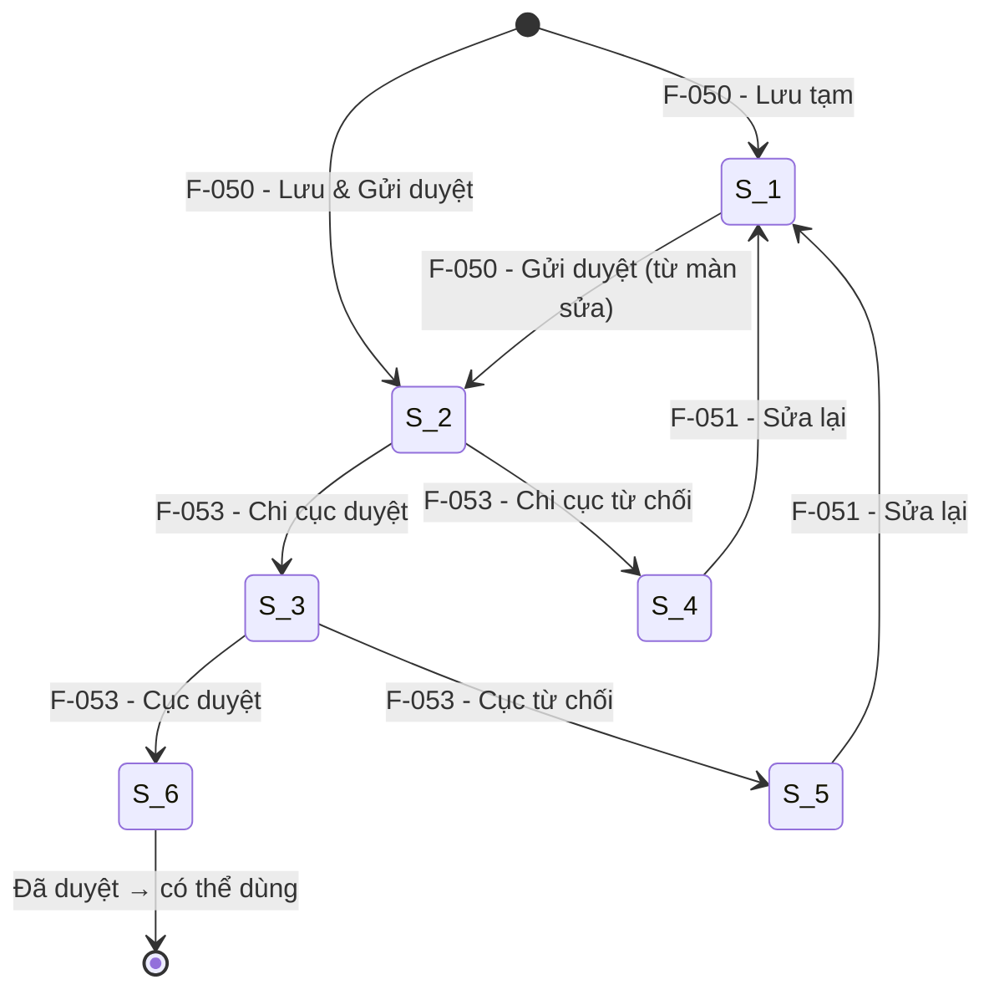

# Đặc tả nghiệp vụ: Quản lý Cơ sở sửa chữa, đóng tàu — Tạo mới

**Tài liệu:** BA Feature Brief
**Feature:** F-050
**Module:** M-003 — Quản lý tài sản KCHTGT khu nước VTS
**Người viết:** Business Analyst
**Ngày cập nhật:** 2026-08-03

---

## 1. Tổng quan

### 1.1. Tính năng này làm gì?

Cho phép **Chuyên viên** tạo mới một bản ghi cơ sở sửa chữa, đóng tàu (CSSCDT) vào hệ thống. Bản ghi bao gồm thông tin cơ bản (tên, địa chỉ, đơn vị quản lý, cảng biển/cầu cảng liên quan), thông tin đặc thù (công năng, loại tàu, năng lực), tọa độ GIS và file đính kèm.

Sau khi tạo, bản ghi có thể được lưu ở trạng thái **Lưu tạm** (S_1) hoặc **gửi thẳng đi phê duyệt** (S_2).

### 1.2. Tại sao cần tính năng này?

Đây là **điểm vào duy nhất** để đưa một cơ sở sửa chữa, đóng tàu mới vào hệ thống. Mọi dữ liệu vận hành, bảo trì, báo cáo thống kê, tra cứu công khai và hiển thị bản đồ sau này đều bắt đầu từ bước tạo mới này.

### 1.3. Luồng hoạt động chính

Chuyên viên truy cập màn hình danh sách CSSCDT → nhấn **Thêm mới** → form tạo mới hiển thị → nhập đầy đủ các trường bắt buộc → chọn một trong các hành động lưu:

| Hành động | Trạng thái sau lưu | Ý nghĩa |
|---|---|---|
| **Lưu tạm** | S_1 (Lưu tạm) | Bản ghi được lưu, có thể sửa tiếp, chưa gửi duyệt |
| **Lưu và gửi phê duyệt** | S_2 (Chờ Chi cục duyệt) | Bản ghi được lưu và chuyển sang luồng phê duyệt |
| **Lưu và phê duyệt** | S_6 (Đã duyệt) | Bản ghi được lưu và phê duyệt ngay (dành cho lãnh đạo) |

> ⚠ **Quan trọng:** Bản ghi ở trạng thái S_1 hoặc S_2 **chưa thể được tham chiếu** bởi bất kỳ module nào khác. Chỉ khi đạt trạng thái S_6 (Đã duyệt) thì mới xuất hiện trong dropdown chọn CSSCDT ở các module vận hành, bảo trì, sự cố, báo cáo và bản đồ.

---

## 2. Ai dùng? Dùng như thế nào?

Quyền thao tác và xem tính năng được áp dụng theo hệ thống phân quyền tập trung của hệ thống. Mỗi vai trò người dùng sẽ có phạm vi truy cập và thao tác khác nhau trên tính năng này, được kiểm soát bởi cơ chế RBAC (Role-Based Access Control).

### 2.1. Logic phân quyền chung

Các thao tác trong tính năng được bảo vệ bởi các quyền (permissions) tương ứng. Người dùng chỉ có thể thực hiện những thao tác mà vai trò của họ được cấp quyền (tại tính năng phân quyền).

### 2.2. Logic phân quyền đặc biệt cho tài khoản Admin Cục

Đối với tài khoản **Admin Cục**, áp dụng logic phân quyền đặc biệt sau:

- **Xem full dữ liệu:** Admin Cục có quyền xem toàn bộ dữ liệu trên hệ thống, không giới hạn phạm vi đơn vị hay khu vực.
- **Xem thông tin người chỉnh sửa:** Với mỗi bản ghi, Admin Cục thấy được thông tin người chỉnh sửa cuối cùng (họ tên, tên đăng nhập).
- **Xem thời gian cập nhật:** Admin Cục thấy được thời gian cập nhật cuối cùng của dữ liệu (timestamp).
- **Xem người tạo mới:** Admin Cục thấy được thông tin người tạo mới bản ghi (họ tên, tên đăng nhập).
- **Xem thời gian tạo mới:** Admin Cục thấy được thời gian tạo mới dữ liệu (timestamp).

> **Ghi chú:** Các trường `người tạo mới`, `thời gian tạo mới`, `người chỉnh sửa`, `thời gian cập nhật` cần được bổ sung vào bảng dữ liệu tương ứng và chỉ hiển thị đối với tài khoản Admin Cục. Với các vai trò khác, các trường này bị ẩn khỏi giao diện.

---

## 3. User Stories

Dưới đây là các câu chuyện người dùng, sắp xếp theo mức độ ưu tiên (Must > Should > Could):

### Mức Must (bắt buộc có)

- **US-050-01:** Là **Chuyên viên**, tôi muốn mở form tạo mới cơ sở sửa chữa, đóng tàu từ màn danh sách để nhập thông tin cơ sở mới.
- **US-050-02:** Là **Chuyên viên**, tôi muốn nhập đầy đủ các trường thông tin cơ bản (tên, địa chỉ, đơn vị quản lý, cảng biển) và được hệ thống kiểm tra tính hợp lệ trước khi lưu để tránh dữ liệu sai.
- **US-050-03:** Là **Chuyên viên**, tôi muốn lưu bản ghi ở trạng thái "Lưu tạm" để có thể quay lại chỉnh sửa sau trước khi gửi duyệt.
- **US-050-04:** Là **Chuyên viên**, tôi muốn chọn "Lưu và gửi phê duyệt" để bản ghi được chuyển thẳng sang luồng phê duyệt mà không cần thao tác riêng.

### Mức Should (nên có)

- **US-050-05:** Là **Chuyên viên**, tôi muốn hệ thống tự động sinh mã cơ sở (theo format `{mã cảng biển}-CSSCDT-{số thứ tự}`) để không phải nhập tay và đảm bảo mã không trùng.
- **US-050-06:** Là **Lãnh đạo**, tôi muốn có tùy chọn "Lưu và phê duyệt" để tạo mới và phê duyệt trong một bước, tiết kiệm thời gian.

### Mức Could (có thể có sau)

- **US-050-07:** Là **Chuyên viên**, tôi muốn xem trước vị trí cơ sở trên bản đồ ngay trong form tạo mới để xác nhận tọa độ chính xác.

---

## 4. Yêu cầu chức năng (Acceptance Criteria)

Mỗi yêu cầu dưới đây mô tả một điều hệ thống phải làm được, kèm theo cách xử lý khi có lỗi hoặc dữ liệu không như mong đợi.

**AC-050-01 — Hiển thị form tạo mới:** Khi Chuyên viên nhấn nút "Thêm mới" trên màn danh sách, hệ thống mở form tạo mới với tất cả các trường ở trạng thái trống (trừ các trường có giá trị mặc định). Nếu không mở được form, hiển thị thông báo lỗi "Không thể mở form tạo mới. Vui lòng thử lại." và nút "Thử lại".

**AC-050-02 — Validate trường bắt buộc:** Khi người dùng nhấn Lưu, hệ thống kiểm tra tất cả các trường bắt buộc (xem danh sách tại mục 6). Trường nào thiếu sẽ được đánh dấu đỏ và hiển thị thông báo lỗi bên dưới. Không cho phép lưu nếu còn trường bắt buộc trống.

**AC-050-03 — Tự động sinh mã CSSCDT:** Sau khi lưu thành công, hệ thống tự động sinh mã cơ sở theo format `{mã cảng biển}-CSSCDT-{seq 6 chữ số}`. Mã này hiển thị ở trường `ma` dưới dạng read-only. Nếu sinh mã thất bại, hiển thị lỗi "Không thể sinh mã cơ sở. Vui lòng thử lại." và rollback transaction.

**AC-050-04 — Lưu tạm:** Khi Chuyên viên chọn "Lưu tạm", bản ghi được lưu với `status = S_1` (Lưu tạm). Sau khi lưu, hiển thị thông báo thành công "Đã lưu cơ sở {tên cơ sở}" và chuyển về màn danh sách. Bản ghi ở trạng thái S_1 cho phép sửa/xóa tiếp.

**AC-050-05 — Lưu và gửi phê duyệt:** Khi Chuyên viên chọn "Lưu và gửi phê duyệt", bản ghi được lưu với `status = S_2` (Chờ Chi cục duyệt). Bản ghi sau đó xuất hiện trong danh sách chờ duyệt của F-053. Nếu gửi duyệt thất bại, bản ghi vẫn được lưu ở trạng thái S_1 và hiển thị cảnh báo "Đã lưu nhưng không thể gửi duyệt. Vui lòng thử gửi duyệt sau."

**AC-050-06 — Lưu và phê duyệt:** Khi Lãnh đạo chọn "Lưu và phê duyệt", bản ghi được lưu với `status = S_6` (Đã duyệt). Tùy chọn này chỉ hiển thị với vai trò có quyền phê duyệt.

**AC-050-07 — Validate dữ liệu đặc thù:** Hệ thống kiểm tra `soLuongTrienDa` chỉ nhận ký tự số, tối đa 5 chữ số. `dienTichNhaXuongKhoBai` là số thập phân ≥ 0, tối đa 20 chữ số với 4 chữ số thập phân. Nếu sai định dạng, hiển thị lỗi cụ thể bên dưới trường tương ứng.

**AC-050-08 — Validate độ dài trường text:** `ten` tối đa 255 ký tự, `diaDiemChiTiet` tối đa 500 ký tự, `ghiChu` tối đa 2000 ký tự. Nếu vượt quá, hiển thị thông báo lỗi và không cho phép lưu.

---

## 5. Quy tắc nghiệp vụ (Business Rules)

Các quy tắc này là "luật chơi" mà mọi thành phần trong hệ thống phải tuân thủ:

**BR-050-01 — Trạng thái mặc định khi tạo mới:** Bản ghi mới tạo mặc định ở trạng thái S_1 (Lưu tạm) nếu chọn "Lưu tạm", hoặc S_2 nếu chọn "Lưu và gửi phê duyệt".

**BR-050-02 — Cơ sở chưa duyệt không được tham chiếu:** Bản ghi ở trạng thái S_1 (Lưu tạm) hoặc đang trong luồng duyệt (S_2→S_5) **không được xuất hiện** trong dropdown chọn CSSCDT của bất kỳ module nào khác. Chỉ bản ghi đạt trạng thái S_6 (Đã duyệt) mới khả dụng để tham chiếu. Khi code `SelectKcht` để chọn CSSCDT, luôn filter `status = DA_PHE_DUYET`.

**BR-050-03 — Mã CSSCDT tự động sinh:** Mã được sinh tự động theo format `{mã cảng biển}-CSSCDT-{seq 6 chữ số}`. Mã là duy nhất trên toàn hệ thống. Người dùng không được nhập tay trường này.

**BR-050-04 — CSSCDT phải thuộc về một cảng biển:** Trường `fkCangBien` là bắt buộc khi tạo mới. Chỉ được chọn các cảng biển đã ở trạng thái "Đã duyệt".

**BR-050-05 — Tọa độ GIS lưu theo hệ quy chiếu WGS-84:** Hệ quy chiếu mặc định là WGS_84, quy tắc hiển thị mặc định là Độ/Phút/Giây. Hai trường này được set tự động và disabled trên form.

**BR-050-06 — Tình trạng mặc định:** Trường `tinhTrang` mặc định = Chưa khai thác/vận hành khi tạo mới.

---

### 5.1. Liên kết với các tính năng khác — Developer cần biết

> ⚠ **Đọc kỹ phần này trước khi code F-050.** Cơ sở sửa chữa đóng tàu không hoạt động độc lập. Dưới đây là toàn bộ vòng đời và các tính năng liên quan mà F-050 là bước khởi đầu.

#### Vòng đời CSSCDT sau khi tạo mới



#### Các feature liên quan trực tiếp trong cùng module M-003

| Feature | Tên | Liên quan đến F-050 như thế nào |
|---|---|---|
| **F-051** | Cập nhật CSSCDT | Sửa bản ghi đã tạo (kể cả S_6 — sửa xong quay về S_1) |
| **F-052** | Xóa CSSCDT | Soft delete bản ghi ở S_1 (chưa gửi duyệt) |
| **F-053** | Phê duyệt CSSCDT | Phê duyệt 2 cấp bản ghi sau khi tạo |
| **F-054** | Xem chi tiết CSSCDT | Xem toàn bộ thông tin bản ghi đã tạo |
| **F-055** | Lịch sử CSSCDT | Xem lịch sử thay đổi của bản ghi |

#### Module bên ngoài M-003 sẽ dùng dữ liệu từ F-050

| Module | Khi nào dùng | Điều kiện |
|---|---|---|
| Tra cứu công khai | Xem thông tin CSSCDT | Chỉ CSSCDT đã duyệt (S_6) |
| Vận hành khai thác | Gắn thông tin vận hành vào CSSCDT | Chỉ CSSCDT đã duyệt (S_6) |
| Bảo trì | Gắn lịch sử bảo trì vào CSSCDT | Chỉ CSSCDT đã duyệt (S_6) |
| Sự cố | Ghi nhận sự cố liên quan CSSCDT | Chỉ CSSCDT đã duyệt (S_6) |
| Báo cáo thống kê | CSSCDT xuất hiện trong báo cáo | Chỉ CSSCDT đã duyệt (S_6) |
| Bản đồ KCHT | Hiển thị vị trí CSSCDT trên bản đồ | Chỉ CSSCDT đã duyệt (S_6) |
| Chia sẻ dữ liệu (LGSP) | Chia sẻ thông tin CSSCDT ra ngoài | Chỉ CSSCDT đã duyệt (S_6) |

> **Tóm tắt:** F-050 tạo bản ghi. Sau đó **phải qua F-053 (phê duyệt)** để đạt S_6 thì mọi module khác mới thấy và dùng được dữ liệu. Khi code F-050, không cần implement các feature trên, nhưng phải thiết kế schema và API sao cho các feature đó có thể kết nối vào sau.

---

## 6. Mô hình dữ liệu

Tính năng này tạo ra/sửa đổi các bảng dữ liệu sau trong cơ sở dữ liệu:

> **Quy ước đánh dấu:**
> - <span style="color:red;font-weight:bold">🔴 Chữ màu đỏ</span> = **trường mới cần thêm** vào bảng hiện có.
> - ~~Chữ gạch ngang~~ = **trường không cần thiết**, cần loại bỏ khỏi bảng.
> - Các trường không được đánh dấu là các trường hiện có, được giữ nguyên.

### 6.1. Bảng `co_sua_chua_dong_tau` — Thông tin chính CSSCDT

Đây là bảng chính, lưu toàn bộ thông tin cơ sở sửa chữa, đóng tàu.

Các trường thông tin:

- **id:** mã số tự tăng, duy nhất cho mỗi dòng
- **ma:** mã CSSCDT, tự động sinh theo format `{mã cảng biển}-CSSCDT-{seq 6 chữ số}`
- **ten:** tên cơ sở sửa chữa, đóng tàu (bắt buộc, tối đa 255 ký tự)
- **fkDonViQl:** mã đơn vị quản lý (bắt buộc, mặc định = đơn vị của user đăng nhập)
- **fkCangBien:** thuộc mã cảng biển (bắt buộc khi tạo mới)
- **fkCauCang:** thuộc mã cầu cảng (không bắt buộc)
- **diaDiem:** mã tỉnh/thành phố (bắt buộc, tham chiếu danh mục DM_DON_VI_HANH_CHINH)
- **diaDiemChiTiet:** địa chỉ chi tiết (bắt buộc, tối đa 500 ký tự)
- **tinhTrang:** tình trạng khai thác/vận hành — Chưa khai thác/vận hành; Đang khai thác/vận hành; Dừng khai thác/vận hành (bắt buộc, mặc định = Chưa khai thác/vận hành)
- **status:** trạng thái phê duyệt — S_1: Lưu tạm, S_2: Chờ Chi cục, S_3: Chờ Cục, S_4: Từ chối CC, S_5: Từ chối Cục, S_6: Đã duyệt, S_0: Đã xóa (mặc định theo hành động lưu)
- **congNangSuDung:** công năng sử dụng (tham chiếu AppParams group `CONG_NANG_SU_DUNG_SCDT`)
- **dienTichNhaXuongKhoBai:** diện tích nhà xưởng, kho bãi (m², Decimal(20,4), ≥ 0)
- **loaiTauDongMoiSuaChua:** loại tàu đóng mới, sửa chữa (tham chiếu AppParams group `LOAI_TAU_SCDT`)
- **coTau:** cỡ tàu (DWT, tối đa 20 ký tự)
- **loaiHinhDoanhNghiep:** loại hình doanh nghiệp (tham chiếu AppParams group `LOAI_HINH_DN_SCDT`)
- **hoatDong:** hoạt động (tham chiếu AppParams group `HOAT_DONG_SCDT`)
- **soLuongTrienDa:** số lượng triền đà (số nguyên, tối đa 5 chữ số)
- **ghiChu:** ghi chú (tối đa 2000 ký tự)
- **loaiDoiTuong:** loại đối tượng GIS — 1: Điểm, 2: Đường, 3: Vùng (tham chiếu AppParams group `LOAI_DOI_TUONG`)
- **bieuTuong:** biểu tượng hiển thị trên bản đồ
- **heQuyChieu:** hệ quy chiếu (mặc định WGS_84, tự động set)
- **quyTacHienThi:** quy tắc hiển thị tọa độ (mặc định Độ/Phút/Giây, tự động set)
- <span style="color:red;font-weight:bold">**nguoiTao:** người tạo bản ghi (họ tên, tên đăng nhập) — chỉ hiển thị với Admin Cục</span>
- <span style="color:red;font-weight:bold">**thoiGianTao:** thời điểm tạo bản ghi — chỉ hiển thị với Admin Cục</span>
- <span style="color:red;font-weight:bold">**nguoiChinhSua:** người chỉnh sửa cuối cùng — chỉ hiển thị với Admin Cục</span>
- <span style="color:red;font-weight:bold">**thoiGianCapNhat:** thời điểm cập nhật cuối cùng — chỉ hiển thị với Admin Cục</span>
- **createdAt:** thời điểm tạo bản ghi (system)
- **updatedAt:** thời điểm cập nhật bản ghi (system)

### 6.2. Bảng `co_sua_chua_dong_tau_geo` — Tọa độ GIS

Lưu danh sách tọa độ GIS của cơ sở. Một CSSCDT có thể có nhiều điểm tọa độ (với loại đối tượng là Đường hoặc Vùng).

- **id:** mã số tự tăng
- **fkCoSuaChua:** khóa ngoại đến `co_sua_chua_dong_tau.id`
- **kinhDo:** kinh độ (decimal)
- **viDo:** vĩ độ (decimal)
- **thuTu:** thứ tự điểm (cho loại Đường/Vùng)

### 6.3. Bảng `co_sua_chua_dong_tau_attachment` — File đính kèm

Lưu danh sách file đính kèm của cơ sở (PDF, ảnh, tài liệu).

- **id:** mã số tự tăng
- **fkCoSuaChua:** khóa ngoại đến `co_sua_chua_dong_tau.id`
- **tenFile:** tên file gốc
- **duongDan:** đường dẫn lưu trữ
- **loaiFile:** loại file (PDF, ảnh...)
- **kichThuoc:** kích thước file (bytes)
- **nguoiUpload:** người upload
- **thoiGianUpload:** thời điểm upload

---

## 7. API Endpoints

Hệ thống cung cấp các API để phục vụ các thao tác liên quan đến tính năng:

| Method | Endpoint | Mô tả | Phân quyền |
|---|---|---|---|
| POST | `/api/v1/co-so-sua-chua?enumActionKcht=LUU_TAM` | Tạo mới và lưu tạm (S_1) | `cosuachua:create` |
| POST | `/api/v1/co-so-sua-chua?enumActionKcht=LUU_VA_GUI_PHE_DUYET` | Tạo mới và gửi duyệt (S_2) | `cosuachua:create` |
| POST | `/api/v1/co-so-sua-chua?enumActionKcht=LUU_VA_PHE_DUYET` | Tạo mới và phê duyệt luôn (S_6) | `cosuachua:approve:c1` + `cosuachua:approve:c2` |

### 7.1. Request Body

```json
{
  "fkDonViQl": "G17.43",
  "fkCangBien": "G17.43.000001",
  "fkCauCang": "G17.43.000001-CC-000001",
  "ten": "Cơ sở sửa chữa tàu biển ABC",
  "diaDiem": "01",
  "diaDiemChiTiet": "Khu công nghiệp tàu thủy, Hải Phòng",
  "tinhTrang": 1,
  "congNangSuDung": 1,
  "dienTichNhaXuongKhoBai": 15000.50,
  "loaiTauDongMoiSuaChua": 2,
  "coTau": "50000 DWT",
  "loaiHinhDoanhNghiep": 1,
  "hoatDong": 1,
  "soLuongTrienDa": 3,
  "ghiChu": "Cơ sở đạt chuẩn ISO 9001",
  "loaiDoiTuong": 1,
  "bieuTuong": "icon-repair",
  "heQuyChieu": "WGS_84",
  "quyTacHienThi": "DO_PHUT_GIAY",
  "toaDo": [
    { "kinhDo": "106.723456", "viDo": "20.823456" }
  ],
  "fileDinhKem": []
}
```

### 7.2. Response thành công (201 Created)

```json
{
  "success": true,
  "data": {
    "id": 412,
    "ma": "G17.43.000001-CSSCDT-000412",
    "ten": "Cơ sở sửa chữa tàu biển ABC",
    "status": "S_1",
    "createdAt": "2026-08-03T10:30:00Z"
  },
  "message": "Đã lưu cơ sở Cơ sở sửa chữa tàu biển ABC"
}
```

---

## 8. Chi tiết nghiệp vụ từng phần

### 8.1. Form tạo mới — Bố cục 3 phần

Form tạo mới được chia thành 3 phần chính, hiển thị trong cùng một trang:

1. **Thông tin chung** — các trường cơ bản của CSSCDT
2. **Thông tin đặc thù** — các trường đặc thù ngành sửa chữa đóng tàu
3. **Tọa độ GIS & File đính kèm** — vị trí trên bản đồ và tài liệu liên quan

### 8.2. Thông tin chung

| # | Field | Label | Component | Required | Ghi chú |
|---|---|---|---|---|---|
| 1 | `fkDonViQl` | Đơn vị quản lý | Select (OrgCode) | ✅ | Mặc định = đơn vị của user đăng nhập |
| 2 | `fkCangBien` | Thuộc cảng biển | Select (KCHT_CB) | ✅ | Chỉ chọn cảng biển đã duyệt, filter theo `fkDonViQl` |
| 3 | `fkCauCang` | Thuộc cầu cảng | Select (KCHT_CC) | | Filter theo `fkDonViQl`, chỉ cầu cảng đã duyệt |
| 4 | `ma` | Mã cơ sở | Input (disabled) | | Tự động sinh sau khi chọn `fkCangBien`, không cho sửa |
| 5 | `ten` | Tên cơ sở | TextArea | ✅ | Tối đa 255 ký tự |
| 6 | `diaDiem` | Địa điểm (Tỉnh/TP) | Select (DM_DON_VI_HANH_CHINH) | ✅ | Danh mục đơn vị hành chính |
| 7 | `diaDiemChiTiet` | Địa điểm chi tiết | TextArea | ✅ | Tối đa 500 ký tự |
| 8 | `tinhTrang` | Tình trạng khai thác/vận hành | Select (AppParams) | ✅ | Chưa khai thác/vận hành; Đang khai thác/vận hành; Dừng khai thác/vận hành. Mặc định = Chưa khai thác/vận hành |

### 8.3. Thông tin đặc thù CSSCDT

| # | Field | Label | Component | Required | Ghi chú |
|---|---|---|---|---|---|
| 9 | `congNangSuDung` | Công năng sử dụng | Select (AppParams) | | Group: `CONG_NANG_SU_DUNG_SCDT` |
| 10 | `dienTichNhaXuongKhoBai` | Diện tích nhà xưởng, kho bãi (m²) | Number (Decimal) | | Decimal(20,4), min = 0 |
| 11 | `loaiTauDongMoiSuaChua` | Loại tàu đóng mới, sửa chữa | Select (AppParams) | | Group: `LOAI_TAU_SCDT` |
| 12 | `coTau` | Cỡ tàu (DWT) | Input | | Tối đa 20 ký tự |
| 13 | `loaiHinhDoanhNghiep` | Loại hình doanh nghiệp | Select (AppParams) | | Group: `LOAI_HINH_DN_SCDT` |
| 14 | `hoatDong` | Hoạt động | Select (AppParams) | | Group: `HOAT_DONG_SCDT` |
| 15 | `soLuongTrienDa` | Số lượng triền đà | Input (Number) | | Chỉ nhập số, tối đa 5 chữ số |
| 16 | `ghiChu` | Ghi chú | TextArea | | Tối đa 2000 ký tự |

### 8.4. Tọa độ GIS & File đính kèm

| # | Field | Label | Component | Required | Ghi chú |
|---|---|---|---|---|---|
| 17 | `loaiDoiTuong` | Loại đối tượng | Select (AppParams) | ✅ | 1: Điểm, 2: Đường, 3: Vùng |
| 18 | `bieuTuong` | Biểu tượng | Select (Icon) | | Icon hiển thị trên bản đồ |
| 19 | `heQuyChieu` | Hệ quy chiếu | Select (disabled) | | Tự động set WGS_84 |
| 20 | `quyTacHienThi` | Quy tắc hiển thị | Select (disabled) | | Tự động set Độ/Phút/Giây |
| 21 | `toaDo` | Tọa độ | Bảng kinh độ/vĩ độ | | Nhập ít nhất 1 điểm với loại Điểm |
| 22 | `fileDinhKem` | File đính kèm | Upload (multi) | | PDF, ảnh, tài liệu |

### 8.5. Quy trình lưu

```
1. Validate form (tất cả các trường required + format)
2. Gom dữ liệu:
   - Các trường thông tin chung + đặc thù → body chính
3. Convert tọa độ: toaDo → chuẩn hóa decimal
4. Xử lý file: fileDinhKem → base64 hoặc multipart upload
5. Gọi API: POST /api/v1/co-so-sua-chua?enumActionKcht={action}
6. Backend:
   a. Validate business rules
   b. Sinh mã CSSCDT tự động
   c. INSERT vào co_sua_chua_dong_tau
   d. INSERT tọa độ vào co_sua_chua_dong_tau_geo
   e. INSERT file vào co_sua_chua_dong_tau_attachment
   f. Return 201 + dữ liệu bản ghi vừa tạo
7. Frontend hiển thị thông báo thành công → redirect về danh sách
```

---

## 9. Yêu cầu phi chức năng

### 9.1. Hiệu năng

- Form tạo mới phải load trong ≤ 2 giây (bao gồm load danh mục AppParams, danh sách cảng biển)
- Lưu bản ghi phải hoàn thành trong ≤ 3 giây (bao gồm upload file nếu có)
- Upload file hỗ trợ tối đa 10MB/file, tổng dung lượng không quá 50MB

### 9.2. Khả năng mở rộng

- Schema thiết kế để dễ dàng thêm trường đặc thù mới trong tương lai mà không cần đổi cấu trúc bảng chính
- API POST hỗ trợ nhận thêm trường mở rộng (extensible)

### 9.3. Bảo mật

- Phân quyền RBAC được áp dụng trên tất cả các API liên quan đến tính năng
- Chỉ user thuộc đúng `fkDonViQl` mới được tạo CSSCDT cho đơn vị đó
- Validate JWT token trên mọi request
- File upload được quét virus trước khi lưu

### 9.4. Độ tin cậy

- Transaction rollback toàn bộ nếu bất kỳ bước nào trong quy trình lưu thất bại (bảng chính, tọa độ, file)
- Mã CSSCDT sinh tự động phải đảm bảo không trùng lặp (unique constraint ở database)

### 9.5. Trải nghiệm người dùng

- Giao diện responsive: trên điện thoại (dưới 768px), form chuyển thành single-column
- Có loading spinner khi đang lưu dữ liệu
- Có thông báo xác nhận khi người dùng nhấn Hủy mà chưa lưu: "Bạn có thay đổi chưa lưu. Bạn có chắc muốn thoát?"
- Tuân thủ tiêu chuẩn trợ năng WCAG 2.1 AA

### 9.6. Tuân thủ pháp lý

- Dữ liệu lưu trữ tuân thủ quy định về quản lý tài sản KCHTGT của Cục Hàng hải
- Nhật ký thao tác (audit log) được ghi lại đầy đủ cho mọi hành động tạo mới

---

## 10. Yêu cầu giao diện người dùng

> **Nguyên tắc cốt lõi:** Mọi giá trị màu sắc, khoảng cách, kích thước chữ trong giao diện đều được định nghĩa tập trung tại 2 file `frontend/src/theme.ts` (layout, màu nền sidebar/header) và `frontend/src/tokens.ts` (màu chữ, màu trạng thái, thang số). Tuyệt đối không hardcode giá trị hex hay pixel trong component.

### 10.1. Bố cục chung

Màn hình tạo mới CSSCDT dùng chung bố cục toàn hệ thống, bao gồm:

- **Thanh menu trái (sidebar):** rộng 272px, nền màu xanh dương đậm `#12468C`. Mục đang chọn được tô màu xanh sáng `#1B84FF`. Khi thu gọn (trên điện thoại), rộng còn 80px và chuyển thành nút hamburger.
- **Thanh tiêu đề trên cùng (header):** cao 64px, nền trắng, chứa tên người dùng và avatar.
- **Vùng nội dung chính:** nền xám nhạt pha xanh `#eaf0f6`, giúp các card trắng bên trong nổi bật hơn.

### 10.2. Hệ thống màu sắc

Mỗi màu sắc trong giao diện được gán một "vai trò" rõ ràng. Developer không được dùng màu theo cảm tính mà phải import đúng token:

| Khi cần... | Dùng token | Màu thực tế |
|---|---|---|
| Tiêu đề trang, số liệu quan trọng | `textPrimary` | `#0c2438` |
| Nhãn field, mô tả | `textSecondary` | `#566a7c` |
| Thời gian, trạng thái phụ, caption | `textTertiary` | `#93a3b3` |
| Nền card, modal, bảng | `surfaceCard` | `#FFFFFF` |
| Nền vùng nội dung chính | `surfacePage` | `#eaf0f6` |
| Viền card, đường kẻ | `borderDefault` | `rgba(11,46,79,0.09)` |
| Nút chính, link | `actionPrimary` | `#0E6FD6` |

### 10.3. Thang số — chỉ dùng giá trị cho phép

**Khoảng cách (spacing):** 4px, 8px, 12px, 16px, 24px, 32px. Trong đó 12px là khoảng cách mặc định giữa các trường trong form (`spaceFormField`), 16px là padding mặc định của card (`spaceMd`).

**Bo góc (radius):** 4px (cho ô textarea), 8px, 12px (cho card), 999px (dạng pill — dùng cho input, select, button).

**Cỡ chữ (font size):** 10px (metadata, caption), 13px (nhãn, nội dung), 15px (tiêu đề card, tiêu đề section), 18px (tiêu đề trang).

**Độ đậm chữ (font weight):** 400 (nội dung), 500 (nhãn, nút), 600 (số liệu quan trọng, tiêu đề).

**Font chữ:** `'Inter', -apple-system, BlinkMacSystemFont, sans-serif` cho toàn bộ văn bản.

> **Cấm tuyệt đối:** spacing 6, 10, 14, 18; radius 6, 7, 10; font-size 12, 14, 16, 24.

### 10.4. Style có sẵn — dùng lại, đừng tự chế

Hệ thống đã định nghĩa sẵn các kiểu dáng phổ biến. Khi cần hiển thị:

- **Thời gian, caption:** dùng `metaStyle` (chữ nhỏ 10px, màu xám nhạt, weight 400)
- **Card nội dung:** dùng `cardStyle` (nền trắng, viền 0.5px, bo góc 12px, padding 16px)
- **Tag trạng thái:** dùng `badgeBaseStyle` (chữ nhỏ, weight 500, padding 2px-8px, pill)
- **Link, nút text:** dùng `actionStyle` (pill, màu actionPrimary, weight 500)
- **Đường kẻ ngăn cách:** dùng `dividerStyle`

### 10.5. Giới hạn màu nhấn — tối đa 3 lần mỗi màn

Màu `actionPrimary` (`#0E6FD6`) là màu nhấn mạnh nhất, dùng cho các hành động chính. Để tránh giao diện bị "rối", màu này chỉ xuất hiện tối đa 3 lần trên toàn bộ màn hình tạo mới CSSCDT:

1. Nút **Lưu tạm** (outline style)
2. Nút **Lưu và gửi phê duyệt** (solid style — primary action)
3. Nút **Lưu và phê duyệt** (chỉ hiển thị với Lãnh đạo)

Các màu trạng thái (xanh lá cho thành công, vàng cho cảnh báo, đỏ cho lỗi) và màu chữ không tính vào giới hạn này.

### 10.6. Màn hình Tạo mới CSSCDT

Màn hình chính sử dụng form layout với 3 section card:

1. **ScreenHeader:** hiển thị đường dẫn breadcrumb "Quản lý tài sản KCHTGT > Cơ sở sửa chữa & đóng tàu > Tạo mới".

2. **Card "Thông tin chung":** chứa 8 trường (xem mục 8.2). Hiển thị dạng 2 cột trên desktop, 1 cột trên mobile.

3. **Card "Thông tin đặc thù":** chứa 8 trường (xem mục 8.3). Có thể collapse/expand. Mặc định expand.

4. **Card "Tọa độ GIS & File đính kèm":** chứa 6 trường (xem mục 8.4). Phần tọa độ là bảng kinh độ/vĩ độ có thể thêm/xóa dòng.

5. **Thanh hành động cuối form (sticky bottom):** luôn hiển thị ở cuối màn hình, gồm 3 nút:
   - **Hủy** (màu xám, outline) — quay về danh sách, có xác nhận nếu có thay đổi chưa lưu
   - **Lưu tạm** (outline, `actionPrimary`) — lưu với S_1
   - **Lưu và gửi phê duyệt** (solid, `actionPrimary`) — lưu với S_2 (primary action)

### 10.7. Các trạng thái giao diện

Giao diện phải xử lý đầy đủ các trạng thái sau:

- **Đang tải:** hiển thị spinner hoặc khung xương (skeleton) khi đang load danh mục (AppParams, danh sách cảng biển) — không hiển thị form trống gây hiểu nhầm.
- **Đang lưu:** nút Lưu chuyển sang trạng thái loading, disabled tất cả các nút để tránh double-submit.
- **Lỗi tải danh mục:** hiển thị cảnh báo đỏ và nút "Thử lại" màu `actionPrimary` cho từng phần bị lỗi.
- **Lỗi lưu:** hiển thị toast thông báo lỗi cụ thể từ server (vd: "Tên cơ sở đã tồn tại", "Mã cảng biển không hợp lệ") và giữ nguyên dữ liệu đã nhập trên form.

### 10.8. Phân quyền hiển thị

Giao diện tự động ẩn/hiện các thành phần dựa trên vai trò người dùng:

| Vai trò | Thấy thành phần nào | Ghi chú |
|---|---|---|
| system-admin | Tất cả | Có nút "Lưu và phê duyệt" |
| admin (Security) | Tất cả | |
| admin-operation | Tất cả (trừ "Lưu và phê duyệt") | |
| admin thường / Cán bộ | Form tạo mới đầy đủ, nút "Lưu tạm" và "Lưu và gửi duyệt" | Không có nút "Lưu và phê duyệt" |
| Lãnh đạo | Form tạo mới đầy đủ + nút "Lưu và phê duyệt" | |
| Admin Cục | Xem full dữ liệu + thông tin người tạo, người sửa, thời gian tạo, thời gian cập nhật | Logic đặc biệt (xem mục 2.2) |

### 10.9. Giao diện trên điện thoại

Khi màn hình nhỏ hơn 768px:

- Thanh menu trái thu gọn thành nút hamburger 80px
- Form chuyển từ 2 cột thành 1 cột
- Card "Thông tin đặc thù" mặc định collapse để tiết kiệm không gian
- Thanh hành động sticky bottom thu gọn: chỉ hiển thị icon + tooltip thay vì text đầy đủ
- Modal xác nhận hủy thu nhỏ còn 90% chiều rộng màn hình
