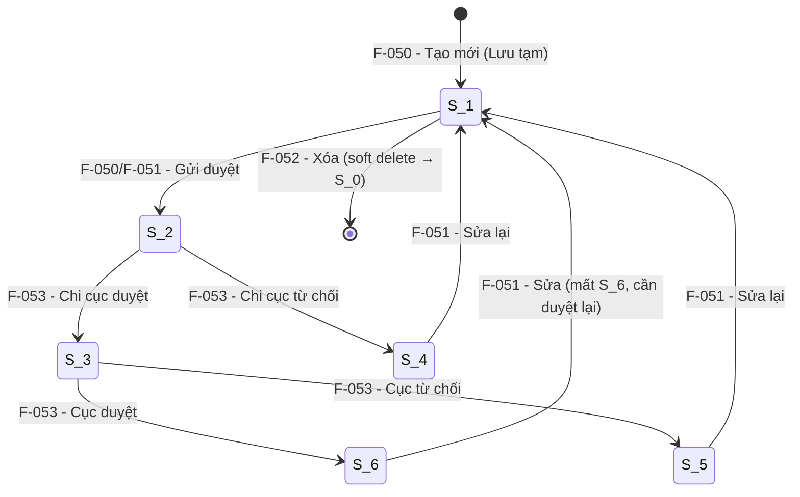

# Đặc tả nghiệp vụ: Quản lý Cơ sở sửa chữa, đóng tàu — Cập nhật

**Tài liệu:** BA Feature Brief
**Feature:** F-051
**Module:** M-003 — Quản lý tài sản KCHTGT khu nước VTS
**Người viết:** Business Analyst
**Ngày cập nhật:** 2026-08-03

---

## 1. Tổng quan

### 1.1. Tính năng này làm gì?

Cho phép **Chuyên viên** cập nhật thông tin của một bản ghi cơ sở sửa chữa, đóng tàu (CSSCDT) đã tồn tại trong hệ thống. Sau khi cập nhật, bản ghi quay về trạng thái chờ phê duyệt và phải được phê duyệt lại trước khi có thể sử dụng.

### 1.2. Tại sao cần tính năng này?

Thông tin cơ sở sửa chữa, đóng tàu thay đổi theo thời gian thực tế (mở rộng, nâng cấp, thay đổi chủ quản lý, thay đổi năng lực). Cập nhật giúp dữ liệu luôn phản ánh đúng thực trạng, đảm bảo các module vận hành, bảo trì, báo cáo thống kê dùng dữ liệu chính xác nhất.

### 1.3. Luồng hoạt động chính

Chuyên viên truy cập màn hình danh sách CSSCDT → chọn bản ghi cần sửa → nhấn **Sửa** → form cập nhật hiển thị với dữ liệu hiện tại → chỉnh sửa các trường cần thay đổi → chọn hành động lưu:

| Hành động | Trạng thái sau lưu | Ý nghĩa |
|---|---|---|
| **Cập nhật** | S_1 (Lưu tạm) | Lưu thay đổi, có thể sửa tiếp, chưa gửi duyệt |
| **Cập nhật và gửi phê duyệt** | S_2 (Chờ Chi cục duyệt) | Lưu thay đổi và gửi thẳng sang luồng phê duyệt |
| **Cập nhật và phê duyệt** | S_6 (Đã duyệt) | Lưu thay đổi và phê duyệt luôn (dành cho lãnh đạo) |

> ⚠ **Quan trọng:** Sau khi cập nhật, trạng thái phê duyệt quay về S_1/S_2. Nếu bản ghi đang ở S_6 (Đã duyệt) trước khi sửa, nó sẽ **tạm thời biến mất** khỏi dropdown chọn CSSCDT ở các module khác cho đến khi được phê duyệt lại (F-053).

---

## 2. Ai dùng? Dùng như thế nào?

Quyền thao tác và xem tính năng được áp dụng theo hệ thống phân quyền tập trung của hệ thống. Mỗi vai trò người dùng sẽ có phạm vi truy cập và thao tác khác nhau trên tính năng này, được kiểm soát bởi cơ chế RBAC (Role-Based Access Control).

### 2.1. Logic phân quyền chung

Các thao tác trong tính năng được bảo vệ bởi các quyền (permissions) tương ứng. Người dùng chỉ có thể thực hiện những thao tác mà vai trò của họ được cấp quyền (tại tính năng phân quyền).

### 2.2. Logic phân quyền đặc biệt cho tài khoản Admin Cục

Đối với tài khoản **Admin Cục**, áp dụng logic phân quyền đặc biệt sau:

- **Xem full dữ liệu:** Admin Cục có quyền xem toàn bộ dữ liệu trên hệ thống, không giới hạn phạm vi đơn vị hay khu vực.
- **Xem thông tin người chỉnh sửa:** Với mỗi bản ghi, Admin Cục thấy được thông tin người chỉnh sửa cuối cùng (họ tên, tên đăng nhập).
- **Xem thời gian cập nhật:** Admin Cục thấy được thời gian cập nhật cuối cùng của dữ liệu (timestamp).
- **Xem người tạo mới:** Admin Cục thấy được thông tin người tạo mới bản ghi (họ tên, tên đăng nhập).
- **Xem thời gian tạo mới:** Admin Cục thấy được thời gian tạo mới dữ liệu (timestamp).

> **Ghi chú:** Các trường `người tạo mới`, `thời gian tạo mới`, `người chỉnh sửa`, `thời gian cập nhật` cần được bổ sung vào bảng dữ liệu tương ứng và chỉ hiển thị đối với tài khoản Admin Cục. Với các vai trò khác, các trường này bị ẩn khỏi giao diện.

---

## 3. User Stories

Dưới đây là các câu chuyện người dùng, sắp xếp theo mức độ ưu tiên (Must > Should > Could):

### Mức Must (bắt buộc có)

- **US-051-01:** Là **Chuyên viên**, tôi muốn mở form cập nhật từ danh sách để chỉnh sửa thông tin cơ sở đã tạo.
- **US-051-02:** Là **Chuyên viên**, tôi muốn form cập nhật hiển thị sẵn dữ liệu hiện tại của bản ghi để tôi biết cần thay đổi gì.
- **US-051-03:** Là **Chuyên viên**, tôi muốn lưu thay đổi ở trạng thái "Lưu tạm" để kiểm tra lại trước khi gửi duyệt.
- **US-051-04:** Là **Chuyên viên**, tôi muốn chọn "Cập nhật và gửi phê duyệt" để thay đổi được chuyển thẳng sang luồng phê duyệt.

### Mức Should (nên có)

- **US-051-05:** Là **Chuyên viên**, tôi muốn các trường `đơn vị quản lý` và `cảng biển` bị khóa không cho sửa khi cập nhật, để tránh làm sai lệch quan hệ cha-con.
- **US-051-06:** Là **Lãnh đạo**, tôi muốn có tùy chọn "Cập nhật và phê duyệt" để sửa và duyệt trong một bước.

### Mức Could (có thể có sau)

- **US-051-07:** Là **Chuyên viên**, tôi muốn xem diff (trước/sau) của các trường đã thay đổi trước khi lưu.

---

## 4. Yêu cầu chức năng (Acceptance Criteria)

Mỗi yêu cầu dưới đây mô tả một điều hệ thống phải làm được, kèm theo cách xử lý khi có lỗi hoặc dữ liệu không như mong đợi.

**AC-051-01 — Hiển thị form cập nhật với dữ liệu cũ:** Khi Chuyên viên nhấn "Sửa" trên một dòng, hệ thống gọi API detail để load toàn bộ dữ liệu hiện tại và đổ vào form. Nếu load thất bại, hiển thị lỗi "Không thể tải dữ liệu cơ sở. Vui lòng thử lại." và nút "Thử lại".

**AC-051-02 — Khóa trường đơn vị quản lý và cảng biển:** Trường `fkDonViQl` và `fkCangBien` ở trạng thái disabled trên form cập nhật, không cho phép thay đổi. Nếu backend nhận được giá trị khác với bản ghi hiện tại, trả về lỗi 422.

**AC-051-03 — Validate trường bắt buộc:** Khi người dùng nhấn Lưu, hệ thống kiểm tra tất cả các trường bắt buộc giống như khi tạo mới. Trường nào thiếu sẽ được đánh dấu đỏ.

**AC-051-04 — Cập nhật (Lưu tạm):** Khi chọn "Cập nhật", bản ghi được lưu với `status = S_1` (Lưu tạm). Hiển thị thông báo "Đã cập nhật cơ sở {tên cơ sở}". Nếu bản ghi trước đó đang ở S_6, nó sẽ biến mất khỏi dropdown tham chiếu của module khác.

**AC-051-05 — Cập nhật và gửi phê duyệt:** Khi chọn "Cập nhật và gửi phê duyệt", bản ghi được lưu với `status = S_2` (Chờ Chi cục duyệt).

**AC-051-06 — Không cho cập nhật bản ghi đã xóa:** Nếu bản ghi có `status = S_0` (Đã xóa), nút Sửa không hiển thị. Nếu cố gọi API, trả về 404 hoặc 410.

**AC-051-07 — Kiểm tra quyền đơn vị:** Chỉ user thuộc đúng `fkDonViQl` của bản ghi mới được phép cập nhật. Nếu không đúng, trả về 403.

**AC-051-08 — Ghi lịch sử thay đổi:** Mỗi lần cập nhật, hệ thống ghi lại thông tin các trường đã thay đổi (tên trường, giá trị cũ, giá trị mới, người thực hiện, thời gian) vào bảng lịch sử để phục vụ F-055.

---

## 5. Quy tắc nghiệp vụ (Business Rules)

Các quy tắc này là "luật chơi" mà mọi thành phần trong hệ thống phải tuân thủ:

**BR-051-01 — Trạng thái sau cập nhật:** Sau khi cập nhật, trạng thái phê duyệt quay về S_1 (nếu chọn "Cập nhật") hoặc S_2 (nếu chọn "Cập nhật và gửi phê duyệt"), bất kể trạng thái trước đó là gì.

**BR-051-02 — Bản ghi S_6 sau khi sửa sẽ mất khả dụng tạm thời:** Nếu bản ghi đang ở S_6 (Đã duyệt) bị sửa, nó quay về S_1/S_2 và **tạm thời biến mất** khỏi tất cả dropdown tham chiếu cho đến khi được phê duyệt lại qua F-053.

**BR-051-03 — Không được sửa đơn vị quản lý và cảng biển:** `fkDonViQl` và `fkCangBien` bị khóa trên form và backend từ chối nếu giá trị thay đổi.

**BR-051-04 — Chỉ user cùng đơn vị mới được sửa:** Backend kiểm tra user đăng nhập có thuộc `fkDonViQl` của bản ghi hay không. Nếu không, trả về 403.

**BR-051-05 — Không được sửa bản ghi đã xóa:** Bản ghi có `status = S_0` không hiển thị nút Sửa và API PUT từ chối.

**BR-051-06 — Ghi lịch sử đầy đủ:** Mọi thay đổi phải được ghi vào bảng lịch sử với đủ thông tin: tên trường, giá trị cũ, giá trị mới, người thực hiện, thời gian.

---

### 5.1. Liên kết với các tính năng khác — Developer cần biết

> ⚠ **Đọc kỹ phần này trước khi code F-051.** Cập nhật là một mắt xích trong vòng đời CSSCDT.

#### Vòng đời CSSCDT — vị trí của F-051



#### Các feature liên quan trực tiếp

| Feature | Tên | Liên quan đến F-051 như thế nào |
|---|---|---|
| **F-050** | Tạo mới CSSCDT | F-051 sửa bản ghi do F-050 tạo ra |
| **F-052** | Xóa CSSCDT | F-051 không dùng được nếu F-052 đã xóa (S_0) |
| **F-053** | Phê duyệt CSSCDT | Sau khi F-051 sửa, phải qua F-053 để duyệt lại |
| **F-054** | Xem chi tiết CSSCDT | Xem dữ liệu trước/sau khi F-051 sửa |
| **F-055** | Lịch sử CSSCDT | F-051 ghi log, F-055 hiển thị log đó |

---

## 6. Mô hình dữ liệu

Tính năng này sử dụng lại các bảng dữ liệu đã định nghĩa ở F-050. Không tạo thêm bảng mới.

### 6.1. Bảng `co_sua_chua_dong_tau` — Cập nhật

Khi cập nhật, các trường sau được phép thay đổi:

- **ten:** tên cơ sở sửa chữa, đóng tàu (bắt buộc, tối đa 255 ký tự)
- **fkCauCang:** thuộc mã cầu cảng (không bắt buộc, có thể thay đổi)
- **diaDiem:** mã tỉnh/thành phố (bắt buộc)
- **diaDiemChiTiet:** địa chỉ chi tiết (bắt buộc, tối đa 500 ký tự)
- **tinhTrang:** tình trạng khai thác/vận hành — Chưa khai thác/vận hành; Đang khai thác/vận hành; Dừng khai thác/vận hành (bắt buộc)
- **congNangSuDung:** công năng sử dụng
- **dienTichNhaXuongKhoBai:** diện tích nhà xưởng, kho bãi (m², Decimal(20,4), ≥ 0)
- **loaiTauDongMoiSuaChua:** loại tàu đóng mới, sửa chữa
- **coTau:** cỡ tàu (DWT, tối đa 20 ký tự)
- **loaiHinhDoanhNghiep:** loại hình doanh nghiệp
- **hoatDong:** hoạt động
- **soLuongTrienDa:** số lượng triền đà (số nguyên, tối đa 5 chữ số)
- **ghiChu:** ghi chú (tối đa 2000 ký tự)
- **loaiDoiTuong:** loại đối tượng GIS
- **bieuTuong:** biểu tượng hiển thị trên bản đồ

Các trường **không được phép thay đổi** khi cập nhật:

- **fkDonViQl:** đơn vị quản lý (disabled)
- **fkCangBien:** thuộc mã cảng biển (disabled)
- **ma:** mã CSSCDT (tự động sinh, không đổi)
- **heQuyChieu:** hệ quy chiếu (WGS_84, không đổi)
- **quyTacHienThi:** quy tắc hiển thị (không đổi)

### 6.2. Bảng `phe_duyet_lich_su` — Lịch sử thay đổi

Mỗi lần cập nhật ghi một dòng mới:

- **id:** mã số tự tăng
- **fkCoSuaChua:** khóa ngoại đến `co_sua_chua_dong_tau.id`
- **loaiThaoTac:** loại thao tác — CAP_NHAT
- **truongThayDoi:** tên trường bị thay đổi
- **giaTriCu:** giá trị trước khi sửa
- **giaTriMoi:** giá trị sau khi sửa
- **nguoiThucHien:** người thực hiện cập nhật
- **thoiGian:** thời điểm cập nhật

---

## 7. API Endpoints

Hệ thống cung cấp các API để phục vụ các thao tác liên quan đến tính năng:

| Method | Endpoint | Mô tả | Phân quyền |
|---|---|---|---|
| GET | `/api/v1/co-so-sua-chua/{id}` | Lấy dữ liệu hiện tại để đổ vào form sửa | `cosuachua:read` |
| PUT | `/api/v1/co-so-sua-chua/{id}?enumActionKcht=LUU_TAM` | Cập nhật và lưu tạm (S_1) | `cosuachua:update` |
| PUT | `/api/v1/co-so-sua-chua/{id}?enumActionKcht=LUU_VA_GUI_PHE_DUYET` | Cập nhật và gửi duyệt (S_2) | `cosuachua:update` |
| PUT | `/api/v1/co-so-sua-chua/{id}?enumActionKcht=LUU_VA_PHE_DUYET` | Cập nhật và phê duyệt luôn (S_6) | `cosuachua:approve:c1` + `cosuachua:approve:c2` |

### 7.1. Request Body

```json
{
  "id": 412,
  "ten": "Cơ sở sửa chữa tàu biển ABC (đã mở rộng)",
  "diaDiem": "01",
  "diaDiemChiTiet": "Khu công nghiệp tàu thủy, Lô 5, Hải Phòng",
  "tinhTrang": "DANG_KHAI_THAC",
  "congNangSuDung": 2,
  "dienTichNhaXuongKhoBai": 25000.00,
  "loaiTauDongMoiSuaChua": 2,
  "coTau": "100000 DWT",
  "loaiHinhDoanhNghiep": 1,
  "hoatDong": 1,
  "soLuongTrienDa": 5,
  "ghiChu": "Đã mở rộng thêm 2 triền đà, nâng cấp ISO 14001",
  "loaiDoiTuong": 1,
  "bieuTuong": "icon-repair-updated",
  "toaDo": [
    { "kinhDo": "106.724000", "viDo": "20.824000" }
  ],
  "fileDinhKem": []
}
```

### 7.2. Response thành công (200 OK)

```json
{
  "success": true,
  "data": {
    "id": 412,
    "ma": "G17.43.000001-CSSCDT-000412",
    "ten": "Cơ sở sửa chữa tàu biển ABC (đã mở rộng)",
    "status": "S_1",
    "updatedAt": "2026-08-03T14:00:00Z"
  },
  "message": "Đã cập nhật cơ sở Cơ sở sửa chữa tàu biển ABC (đã mở rộng)"
}
```

---

## 8. Chi tiết nghiệp vụ từng phần

### 8.1. Form cập nhật — Khác biệt so với Tạo mới

Form cập nhật dùng chung component với F-050, khác ở các điểm sau:

| Khía cạnh | Tạo mới (F-050) | Cập nhật (F-051) |
|---|---|---|
| **Form mode** | CREATE | EDIT |
| **Tiêu đề form** | "Tạo mới cơ sở sửa chữa, đóng tàu" | "Sửa thông tin cơ sở sửa chữa, đóng tàu" |
| **`fkDonViQl`** | Chọn được, mặc định = user | **Disabled**, hiển thị giá trị hiện tại |
| **`fkCangBien`** | Chọn được | **Disabled**, hiển thị giá trị hiện tại |
| **`ma`** | Trống (sẽ tự sinh) | Hiển thị mã hiện tại (read-only) |
| **Dữ liệu khởi tạo** | Form trống + giá trị mặc định | Load từ API detail |
| **Nút hành động** | Lưu tạm / Lưu & Gửi duyệt / Lưu & Duyệt | Cập nhật / Cập nhật & Gửi duyệt / Cập nhật & Duyệt |

### 8.2. Danh sách trường trong form cập nhật

Giống F-050, trừ 3 trường bị khóa. 22 trường chia làm 3 card:

**Card "Thông tin chung"** — 8 trường, trong đó `fkDonViQl` và `fkCangBien` disabled, `ma` read-only.

**Card "Thông tin đặc thù"** — 8 trường, tất cả đều sửa được.

**Card "Tọa độ GIS & File đính kèm"** — 6 trường, tất cả đều sửa được.

### 8.3. Quy trình cập nhật

```
1. User nhấn "Sửa" trên dòng trong danh sách
2. Frontend gọi GET /api/v1/co-so-sua-chua/{id} để lấy dữ liệu hiện tại
3. Đổ dữ liệu vào form, khóa fkDonViQl + fkCangBien
4. User chỉnh sửa các trường cần thay đổi
5. User chọn hành động lưu (Cập nhật / Cập nhật & Gửi duyệt / Cập nhật & Duyệt)
6. Frontend gọi PUT /api/v1/co-so-sua-chua/{id}?enumActionKcht={action}
7. Backend:
   a. Kiểm tra bản ghi tồn tại và status != S_0
   b. Kiểm tra user thuộc fkDonViQl của bản ghi
   c. Kiểm tra fkDonViQl và fkCangBien không bị thay đổi
   d. Validate các trường required + format
   e. So sánh giá trị cũ/mới, ghi log thay đổi vào phe_duyet_lich_su
   f. UPDATE bản ghi với status mới (S_1/S_2/S_6)
   g. UPDATE tọa độ GIS nếu có thay đổi
   h. UPDATE file đính kèm nếu có thay đổi
   i. Return 200 + dữ liệu đã cập nhật
8. Frontend hiển thị thông báo thành công → redirect về danh sách
```

---

## 9. Yêu cầu phi chức năng

### 9.1. Hiệu năng

- Load dữ liệu cũ (GET detail) phải hoàn thành trong ≤ 1 giây
- Lưu cập nhật phải hoàn thành trong ≤ 3 giây (bao gồm so sánh diff và ghi log)

### 9.2. Khả năng mở rộng

- Cơ chế ghi log thay đổi thiết kế để dễ dàng thêm loại thao tác mới
- API PUT hỗ trợ partial update (chỉ gửi các trường thay đổi)

### 9.3. Bảo mật

- Phân quyền RBAC trên tất cả API
- Kiểm tra user thuộc đúng `fkDonViQl` trước khi cho phép sửa
- Không cho phép sửa `fkDonViQl` và `fkCangBien` để tránh chuyển trái phép cơ sở sang đơn vị/cảng khác
- Validate JWT token trên mọi request

### 9.4. Độ tin cậy

- Transaction rollback toàn bộ nếu bất kỳ bước nào thất bại
- Ghi log thay đổi phải thành công trong cùng transaction với UPDATE

### 9.5. Trải nghiệm người dùng

- Giao diện responsive: trên điện thoại (dưới 768px), form chuyển thành single-column
- Có loading spinner khi đang load dữ liệu cũ và khi đang lưu
- Có thông báo xác nhận khi người dùng nhấn Hủy mà chưa lưu
- Các trường disabled hiển thị rõ ràng (màu nền xám nhạt) để user biết không sửa được
- Tuân thủ tiêu chuẩn trợ năng WCAG 2.1 AA

### 9.6. Tuân thủ pháp lý

- Dữ liệu lưu trữ tuân thủ quy định về quản lý tài sản KCHTGT của Cục Hàng hải
- Nhật ký thay đổi (audit log) được ghi đầy đủ, không thể xóa hay sửa

---

## 10. Yêu cầu giao diện người dùng

> **Nguyên tắc cốt lõi:** Mọi giá trị màu sắc, khoảng cách, kích thước chữ trong giao diện đều được định nghĩa tập trung tại 2 file `frontend/src/theme.ts` (layout, màu nền sidebar/header) và `frontend/src/tokens.ts` (màu chữ, màu trạng thái, thang số). Tuyệt đối không hardcode giá trị hex hay pixel trong component.

### 10.1. Bố cục chung

Màn hình cập nhật CSSCDT dùng chung bố cục toàn hệ thống:

- **Thanh menu trái (sidebar):** rộng 272px, nền `#12468C`. Mục đang chọn tô `#1B84FF`.
- **Thanh tiêu đề trên cùng (header):** cao 64px, nền trắng.
- **Vùng nội dung chính:** nền `#eaf0f6`.

### 10.2. Hệ thống màu sắc

| Khi cần... | Dùng token | Màu thực tế |
|---|---|---|
| Tiêu đề trang, số liệu quan trọng | `textPrimary` | `#0c2438` |
| Nhãn field, mô tả | `textSecondary` | `#566a7c` |
| Thời gian, trạng thái phụ, caption | `textTertiary` | `#93a3b3` |
| Nền card, modal, bảng | `surfaceCard` | `#FFFFFF` |
| Nền vùng nội dung chính | `surfacePage` | `#eaf0f6` |
| Viền card, đường kẻ | `borderDefault` | `rgba(11,46,79,0.09)` |
| Nút chính, link | `actionPrimary` | `#0E6FD6` |

### 10.3. Thang số

**Khoảng cách (spacing):** 4px, 8px, 12px, 16px, 24px, 32px.

**Bo góc (radius):** 4px, 8px, 12px, 999px.

**Cỡ chữ:** 10px, 13px, 15px, 18px.

**Độ đậm chữ:** 400, 500, 600.

**Font chữ:** `'Inter', -apple-system, BlinkMacSystemFont, sans-serif`.

> **Cấm tuyệt đối:** spacing 6, 10, 14, 18; radius 6, 7, 10; font-size 12, 14, 16, 24.

### 10.4. Style có sẵn

- **Thời gian, caption:** `metaStyle`
- **Card nội dung:** `cardStyle`
- **Tag trạng thái:** `badgeBaseStyle`
- **Link, nút text:** `actionStyle`
- **Đường kẻ ngăn cách:** `dividerStyle`

### 10.5. Giới hạn màu nhấn — tối đa 3 lần

1. Nút **Cập nhật** (outline style)
2. Nút **Cập nhật và gửi phê duyệt** (solid style — primary action)
3. Nút **Cập nhật và phê duyệt** (chỉ hiển thị với Lãnh đạo)

### 10.6. Màn hình Cập nhật CSSCDT

1. **ScreenHeader:** breadcrumb "Quản lý tài sản KCHTGT > Cơ sở sửa chữa & đóng tàu > Sửa: {tên cơ sở}".

2. **Card "Thông tin chung":** 8 trường, `fkDonViQl` và `fkCangBien` có nền xám nhạt (disabled).

3. **Card "Thông tin đặc thù":** 8 trường, có thể collapse/expand.

4. **Card "Tọa độ GIS & File đính kèm":** 6 trường, tọa độ hiển thị giá trị hiện tại, có thể sửa.

5. **Thanh hành động cuối form (sticky bottom):**
   - **Hủy** (màu xám, outline)
   - **Cập nhật** (outline, `actionPrimary`) — lưu với S_1
   - **Cập nhật và gửi phê duyệt** (solid, `actionPrimary`) — lưu với S_2

### 10.7. Các trạng thái giao diện

- **Đang tải dữ liệu cũ:** hiển thị skeleton form
- **Đang lưu:** nút Cập nhật chuyển sang loading, disabled tất cả nút
- **Lỗi tải:** hiển thị cảnh báo đỏ + nút "Thử lại"
- **Lỗi lưu:** hiển thị toast lỗi cụ thể, giữ nguyên dữ liệu đã nhập
- **Bản ghi đã xóa (S_0):** không hiển thị nút Sửa trên dòng

### 10.8. Phân quyền hiển thị

| Vai trò | Thấy thành phần nào | Ghi chú |
|---|---|---|
| system-admin | Tất cả | Có nút "Cập nhật và phê duyệt" |
| admin (Security) | Tất cả | |
| admin-operation | Tất cả (trừ "Cập nhật và phê duyệt") | |
| admin thường / Cán bộ | Form cập nhật đầy đủ, nút "Cập nhật" và "Cập nhật và gửi duyệt" | Chỉ sửa được bản ghi thuộc đơn vị mình |
| Lãnh đạo | Form cập nhật + nút "Cập nhật và phê duyệt" | |
| Admin Cục | Xem full dữ liệu + thông tin người tạo/sửa/thời gian | Logic đặc biệt (xem mục 2.2) |

### 10.9. Giao diện trên điện thoại

Khi màn hình nhỏ hơn 768px:

- Thanh menu trái thu gọn thành nút hamburger 80px
- Form chuyển từ 2 cột thành 1 cột
- Card "Thông tin đặc thù" mặc định collapse
- Thanh hành động sticky bottom thu gọn: icon + tooltip
