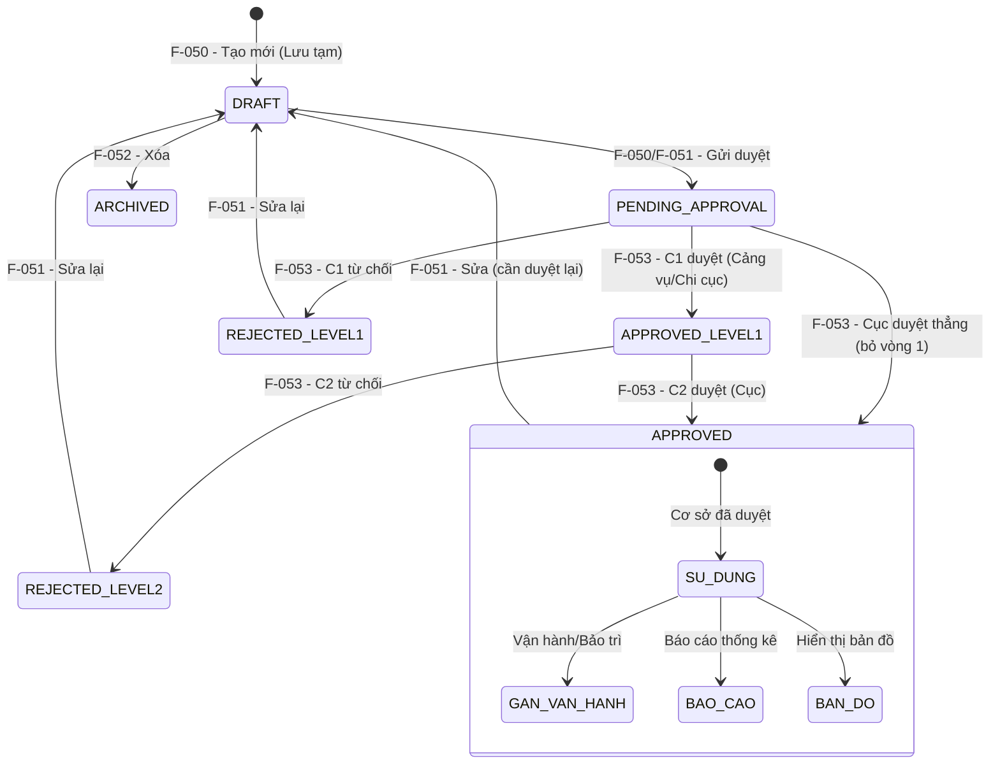

# Đặc tả nghiệp vụ: Xem chi tiết & Danh sách Cơ sở sửa chữa, đóng tàu

> **Consolidation Note:** Feature này là điểm hợp nhất của brief UI **F-XX1 (Danh sách CSSCĐT)** vào brief BE **F-054 (Xem chi tiết CSSCĐT)** — F-054 nay giữ cả **màn hình danh sách (màn hình trung tâm)** và **màn hình chi tiết** của nhóm CSSCĐT. Toàn bộ trạng thái phê duyệt được chuẩn hóa theo **7 trạng thái** của `docs/conventions/approval-2-level-spec.md` mục 3.1 (DRAFT / PENDING_APPROVAL / APPROVED_LEVEL1 / REJECTED_LEVEL1 / REJECTED_LEVEL2 / APPROVED / ARCHIVED), không còn dùng S_0..S_6. Chi tiết merge xem `ba/00-ui-be-merge-report.md`.

**Tài liệu:** BA Feature Brief
**Feature:** F-054
**Module:** M-003 — Quản lý tài sản KCHTGT khu nước VTS
**Người viết:** Business Analyst
**Ngày cập nhật:** 2026-08-23

---

## 1. Tổng quan

### 1.1. Tính năng này làm gì?

Màn hình **danh sách Cơ sở sửa chữa, đóng tàu (CSSCĐT)** là **màn hình chính — điểm vào** của toàn bộ module quản lý CSSCĐT, gộp xem danh sách, tìm kiếm và tra cứu trong một giao diện duy nhất. Từ đây người dùng điều hướng đến tất cả các thao tác khác: tạo mới (F-050), sửa (F-051), xóa (F-052), xem chi tiết (mục 9.1 của tài liệu này), lịch sử (F-055) và phê duyệt (F-053). **Trang chi tiết** hiển thị toàn bộ thông tin của một cơ sở được chọn từ danh sách, bao gồm dữ liệu kỹ thuật, trạng thái phê duyệt, tọa độ GIS, file đính kèm và các hành động khả dụng theo vai trò; trang chi tiết ở chế độ read-only — mọi chỉnh sửa phải thực hiện qua F-051.

### 1.2. Tại sao cần tính năng này?

Đây là màn hình trung tâm để quản lý toàn bộ cơ sở sửa chữa, đóng tàu: người dùng cần một nơi duy nhất để xem tổng quan, lọc, tìm kiếm, và từ đó thực hiện mọi thao tác. Cung cấp giao diện xem chi tiết để tất cả các bên liên quan — từ nhân viên vận hành đến quản lý — có thể tiếp cận thông tin chính xác và cập nhật nhất về từng cơ sở, hỗ trợ ra quyết định nhanh chóng trong vận hành, lập kế hoạch sửa chữa tàu thuyền, kiểm toán tuân thủ và báo cáo quản lý.

### 1.3. Luồng hoạt động chính

1. Người dùng truy cập menu "Cơ sở sửa chữa & đóng tàu" → hệ thống hiển thị bảng danh sách với dữ liệu phân trang (20 dòng/trang mặc định, đổi 10/20/50).
2. Người dùng có thể tìm kiếm (theo `ten`, `diaDiemChiTiet`), lọc (loại hình dịch vụ, trạng thái phê duyệt, tình trạng, đơn vị quản lý, cảng biển, cầu cảng, địa điểm, ngày cập nhật), hoặc nhấn vào một dòng để xem chi tiết / sửa / xóa.
3. Khi click vào mã/tên cơ sở hoặc nhấn nút Xem, hệ thống gọi `GET /api/v1/co-so-sua-chua/:id` để lấy toàn bộ thông tin chi tiết (JOIN CangBien, CauCang).
4. Trên trang chi tiết, người dùng thực hiện các hành động theo vai trò: tải file, chỉnh sửa (F-051), phê duyệt/từ chối (F-053), xóa (F-052), xem lịch sử (F-055).
5. Breadcrumb: Trang chủ > Quản lý tài sản KCHTGT > Cơ sở sửa chữa & đóng tàu > [tên cơ sở].

---

## 2. Ai dùng? Dùng như thế nào?

Quyền thao tác và xem tính năng được áp dụng theo hệ thống phân quyền tập trung, kiểm soát bởi cơ chế RBAC.

### 2.1. Logic phân quyền chung

Các thao tác trong tính năng được bảo vệ bởi các quyền (permissions) tương ứng. Người dùng chỉ có thể thực hiện những thao tác mà vai trò của họ được cấp quyền. Mọi người dùng đã đăng nhập đều có quyền xem danh sách và chi tiết cơ sở — đây là quyền cơ bản nhất trong module. Danh sách luôn được lọc theo đơn vị (`fkDonViQl`/`orgUnitId`) của người dùng đăng nhập — người dùng không thấy cơ sở ngoài phạm vi đơn vị mình, trừ Admin Cục.

### 2.2. Logic phân quyền đặc biệt cho tài khoản Admin Cục

- **Xem full dữ liệu:** Admin Cục có quyền xem toàn bộ dữ liệu trên hệ thống, không giới hạn phạm vi đơn vị hay khu vực.
- **Xem thông tin người chỉnh sửa:** thấy được họ tên, tên đăng nhập người chỉnh sửa cuối cùng.
- **Xem thời gian cập nhật:** thấy được timestamp cập nhật cuối cùng.
- **Xem người tạo mới:** thấy được họ tên, tên đăng nhập người tạo.
- **Xem thời gian tạo mới:** thấy được timestamp tạo.

---

## 3. User Stories

### Mức Must (bắt buộc có)

- **US-LIST-01:** Là **Chuyên viên**, tôi muốn xem danh sách tất cả cơ sở sửa chữa, đóng tàu dưới dạng bảng phân trang.
- **US-LIST-02:** Là **Chuyên viên**, tôi muốn tìm kiếm cơ sở theo tên hoặc địa chỉ.
- **US-LIST-03:** Là **Chuyên viên**, tôi muốn lọc danh sách theo loại hình dịch vụ, trạng thái phê duyệt, tình trạng.
- **US-LIST-04:** Là **Chuyên viên**, tôi muốn thấy các nút thao tác (Xem, Sửa, Xóa, Gửi duyệt) trên mỗi dòng.
- **US-054-01:** Là Chuyên viên, tôi muốn xem toàn bộ thông tin chi tiết của một cơ sở để nắm được tình trạng hiện tại trước khi thao tác tiếp.
- **US-054-02:** Là Quản lý, tôi muốn xem đầy đủ các trường kỹ thuật và trạng thái của cơ sở để kiểm tra thông tin trước khi phê duyệt hoặc chỉnh sửa.
- **US-054-03:** Là Lãnh đạo, tôi muốn xem chi tiết cơ sở và thực hiện phê duyệt/từ chối ngay trên trang chi tiết để tiết kiệm thời gian.

### Mức Should (nên có)

- **US-LIST-05:** Là **Chuyên viên**, tôi muốn thấy số lượng bản ghi theo từng trạng thái dưới dạng tab.
- **US-LIST-06:** Là **Chuyên viên**, tôi muốn bảng tự động refresh sau khi tạo mới/sửa/xóa.
- **US-054-04:** Là Chuyên viên, tôi muốn tải xuống các file đính kèm của cơ sở để phục vụ công tác kiểm tra thực tế.
- **US-054-05:** Là Quản lý, tôi muốn xem lịch sử thay đổi của cơ sở ngay từ trang chi tiết để biết ai đã thay đổi gì và khi nào.
- **US-054-06:** Là người dùng, tôi muốn có breadcrumb điều hướng rõ ràng để dễ dàng quay lại danh sách hoặc trang Cảng biển cha.

### Mức Could (có thể có sau)

- **US-LIST-07:** Là **Chuyên viên**, tôi muốn xuất danh sách ra Excel.
- **US-LIST-08:** Là **Lãnh đạo**, tôi muốn xem danh sách chờ phê duyệt của đơn vị mình.
- **US-054-07:** Là người dùng, tôi muốn xem trước (preview) file ảnh JPEG/PNG trực tiếp trên trang chi tiết thay vì phải tải xuống.
- **US-054-08:** Là Chuyên viên, tôi muốn xem danh sách vận hành/bảo trì/sự cố liên quan đến cơ sở này.

---

## 4. Yêu cầu chức năng (Acceptance Criteria)

**AC-LIST-01 — Hiển thị bảng danh sách:** Khi truy cập menu, hệ thống hiển thị bảng danh sách phân trang 20 dòng/trang. Load thất bại → hiển thị lỗi + nút "Thử lại".

**AC-LIST-02 — Tìm kiếm:** Nhập từ khóa → tìm trong `ten` và `diaDiemChiTiet`. Không có kết quả → "Không tìm thấy cơ sở nào phù hợp."

**AC-LIST-03 — Lọc loại hình:** Dropdown: Tất cả, Sửa chữa, Đóng mới. Chọn → bảng tự động lọc.

**AC-LIST-04 — Lọc trạng thái phê duyệt:** Dropdown: Tất cả, Lưu tạm, Chờ duyệt, Đang xem xét, Đã duyệt, Từ chối. (Hiển thị theo 7 trạng thái chuẩn: Lưu tạm = DRAFT; Chờ duyệt = PENDING_APPROVAL; Đang xem xét = APPROVED_LEVEL1; Đã duyệt = APPROVED; Từ chối = REJECTED_LEVEL1/REJECTED_LEVEL2.)

**AC-LIST-05 — Lọc tình trạng:** Dropdown: Tất cả, Chưa khai thác/vận hành, Đang khai thác/vận hành, Dừng khai thác/vận hành.

**AC-LIST-06 — Lọc theo đơn vị:** Mặc định hiển thị dữ liệu của đơn vị user. Admin Cục thấy toàn bộ.

**AC-LIST-07 — Nút thao tác trên dòng:**
- **Xem:** luôn hiển thị → mở trang chi tiết (mục 9.1)
- **Sửa:** trạng thái ≠ ARCHIVED và có quyền → F-051
- **Xóa:** chỉ hiển thị khi status = DRAFT (Lưu tạm) và có quyền → F-052
- **Gửi duyệt:** chỉ hiển thị khi status = DRAFT (chưa gửi duyệt) và có quyền → chuyển PENDING_APPROVAL
- **Lịch sử:** luôn hiển thị → F-055

**AC-LIST-08 — Phân trang:** Mặc định 20 dòng/trang, cho phép đổi 10/20/50.

**AC-LIST-09 — Sắp xếp:** Click tiêu đề cột → sắp xếp tăng/giảm. Mặc định `updatedAt` giảm dần.

**AC-054-01 — Hiển thị đầy đủ thông tin:** Trang chi tiết hiển thị tất cả các trường của entity CSSCDT. Nếu API trả về lỗi, hiển thị thông báo lỗi và nút "Thử lại".

**AC-054-02 — Link đến Cảng biển cha:** Trường fkCangBien hiển thị dưới dạng tên cảng biển kèm hyperlink. Nếu cảng biển cha không tồn tại hoặc đã bị xóa, hiển thị tên kèm cảnh báo "(không khả dụng)".

**AC-054-03 — Badge trạng thái theo vòng đời:** Tình trạng và trạng thái phê duyệt hiển thị dạng badge màu (xem mục 6.2):
- tinhTrang: xanh lá cho Đang khai thác/vận hành, xám cho Chưa khai thác/vận hành, đỏ cho Dừng khai thác/vận hành
- status: xám cho DRAFT (Lưu tạm), vàng cho PENDING_APPROVAL (Chờ duyệt), xanh dương cho APPROVED_LEVEL1 (Đang xem xét/Chờ Cục duyệt), đỏ cho REJECTED_LEVEL1/REJECTED_LEVEL2, xanh lá cho APPROVED (Đã duyệt)

**AC-054-04 — Danh sách file đính kèm:** Hiển thị tên file, kích thước, loại file, ngày upload. Mỗi file có nút "Tải xuống". Không có file → "Không có file đính kèm".

**AC-054-05 — Hành động theo trạng thái:** Các nút hành động hiển thị động theo trạng thái (xem mục 6.2). Nếu không có quyền, nút tương ứng bị ẩn.

**AC-054-06 — Breadcrumb điều hướng:** Trang chủ > Quản lý tài sản KCHTGT > Cơ sở sửa chữa & đóng tàu > [tên cơ sở].

**AC-054-07 — Metadata cho Admin Cục:** Admin Cục thấy người tạo, thời gian tạo, người chỉnh sửa, thời gian cập nhật. Vai trò khác bị ẩn.

**AC-054-08 — Hiển thị tọa độ GIS:** Bảng tọa độ kèm bản đồ nhỏ + nút "Xem vị trí".

---

## 5. Quy tắc nghiệp vụ (Business Rules)

**BR-LIST-01 — Dữ liệu theo đơn vị:** Danh sách mặc định chỉ hiển thị CSSCDT thuộc `fkDonViQl`/`orgUnitId` của user. Admin Cục và system-admin thấy toàn bộ.

**BR-LIST-02 — Ẩn bản ghi đã xóa:** Bản ghi ở trạng thái `ARCHIVED` (đã xóa lịch sử) không hiển thị trong danh sách chính.

**BR-LIST-03 — Nút Xóa chỉ khi Lưu tạm:** Chỉ bản ghi ở trạng thái `DRAFT` (Lưu tạm, chưa gửi duyệt) mới hiện nút Xóa.

**BR-LIST-04 — Nút Sửa hiện với mọi trạng thái trừ ARCHIVED:** Kể cả `APPROVED`, nhưng sửa xong quay về `DRAFT` (xem F-051).

**BR-LIST-05 — Nút Gửi duyệt chỉ khi chưa gửi:** Chỉ bản ghi ở trạng thái `DRAFT` (chưa từng gửi duyệt) mới hiện nút Gửi duyệt.

**BR-LIST-06 — Nút Lịch sử luôn hiển thị:** Tất cả bản ghi (trừ `ARCHIVED`) đều hiển thị nút Lịch sử, cho phép xem toàn bộ lịch sử thay đổi.

**BR-054-01 — Xem được ở mọi trạng thái:** Cơ sở ở bất kỳ trạng thái nào (DRAFT, PENDING_APPROVAL, APPROVED_LEVEL1, REJECTED_LEVEL1, REJECTED_LEVEL2, APPROVED, ARCHIVED) đều có thể xem chi tiết.

**BR-054-02 — Dữ liệu read-only:** Trang chi tiết là chế độ xem. Mọi chỉnh sửa phải qua F-051.

**BR-054-03 — Phê duyệt từ trang chi tiết:** Leader/Admin có thể phê duyệt/từ chối ngay từ trang chi tiết khi trạng thái phù hợp (PENDING_APPROVAL cho Cấp 1, APPROVED_LEVEL1 cho Cấp 2).

**BR-054-04 — Link Cảng biển cha:** Hiển thị dạng hyperlink. Nếu cảng biển cha đã bị xóa, hiển thị cảnh báo nhưng vẫn cho phép xem thông tin cơ sở.

**BR-054-05 — Dữ liệu làm mới tự động:** Làm mới mỗi khi truy cập, không cache.

**BR-054-06 — Hiển thị theo vòng đời:** Các nút hành động thay đổi theo trạng thái hiện tại.

**BR-054-07 — Cơ sở đã duyệt mới dùng được ở module khác:** Nếu chưa duyệt/từ chối → cảnh báo "Cơ sở chưa được phê duyệt, không khả dụng trong các module khác". Nếu APPROVED → "Cơ sở đã được phê duyệt, đang khả dụng".

---

## 6. Vòng đời và liên kết với các tính năng khác

> ⚠ **QUAN TRỌNG CHO DEVELOPER:** Màn hình Danh sách CSSCDT (mục 9.2) là **điểm vào** của module CSSCDT; trang Xem chi tiết (mục 9.1) là điểm trung tâm để xem thông tin và điều hướng đến các tính năng khác.

### 6.1. Vòng đời CSSCDT (7 trạng thái chuẩn)

### 6.2. Trạng thái hiển thị trên trang chi tiết

| Trạng thái | Mã | Badge màu | Hành động có thể thực hiện |
|---|---|---|---|
| Lưu tạm | DRAFT | Xám | Chỉnh sửa, Xóa, Gửi duyệt |
| Chờ Cảng vụ/Chi cục duyệt | PENDING_APPROVAL | Vàng | Chỉnh sửa, Phê duyệt C1, Từ chối C1 |
| Chờ Cục duyệt | APPROVED_LEVEL1 | Xanh dương | Chỉnh sửa, Phê duyệt C2, Từ chối C2 |
| Bị Cảng vụ/Chi cục trả về | REJECTED_LEVEL1 | Đỏ | Chỉnh sửa |
| Bị Cục trả về | REJECTED_LEVEL2 | Đỏ | Chỉnh sửa |
| Đã duyệt | APPROVED | Xanh lá | Chỉnh sửa |
| Đã xóa (lịch sử) | ARCHIVED | Xám | Không có hành động nào |

### 6.3. Quan hệ với F-050 (Tạo mới)

F-054 là trang đích sau khi tạo mới thành công từ F-050. Hiển thị đúng trạng thái vừa được set từ F-050 (DRAFT hoặc PENDING_APPROVAL hoặc APPROVED).

---

## 7. Mô hình dữ liệu

Tính năng này chỉ đọc dữ liệu, không tạo hay sửa bảng.

### 7.1. Bảng `co_sua_chua_dong_tau` — Thông tin chính

#### A. Thông tin định danh & hành chính

- **ma, ten:** mã và tên cơ sở
- **fkDonViQl:** mã đơn vị quản lý (JOIN lấy tên)
- **fkCangBien:** mã cảng biển (JOIN lấy tên + hyperlink)
- **fkCauCang:** mã cầu cảng (JOIN lấy tên)
- **diaDiem, diaDiemChiTiet:** địa điểm
- **tinhTrang:** tình trạng khai thác/vận hành → badge
- **status:** trạng thái phê duyệt (7 trạng thái chuẩn, lưu dạng số nguyên, map enum `ApprovalStatus`) → badge

#### B. Thông tin đặc thù

- **congNangSuDung, dienTichNhaXuongKhoBai, loaiTauDongMoiSuaChua, coTau, loaiHinhDoanhNghiep, hoatDong, soLuongTrienDa, ghiChu**

#### C. Thông tin GIS

- **loaiDoiTuong, bieuTuong, heQuyChieu, quyTacHienThi**

#### D. Metadata

- **nguoiTao, thoiGianTao:** chỉ hiển thị Admin Cục
- **nguoiChinhSua, thoiGianCapNhat:** chỉ hiển thị Admin Cục
- **createdAt, updatedAt:** system

### 7.2. Bảng `co_sua_chua_dong_tau_geo` — Tọa độ GIS

Truy vấn danh sách tọa độ: kinhDo, viDo, thuTu.

### 7.3. Bảng `co_sua_chua_dong_tau_attachment` — File đính kèm

Truy vấn danh sách file: tenFile, kichThuoc, loaiFile, nguoiUpload, thoiGianUpload.

### 7.4. Bảng `phe_duyet_lich_su` — Lịch sử

Truy vấn danh sách lịch sử: loaiThaoTac, truongThayDoi, giaTriCu, giaTriMoi, nguoiThucHien, thoiGian. Sắp xếp giảm dần theo thời gian.

---

## 8. API Endpoints

| Method | Endpoint | Mô tả | Phân quyền |
|---|---|---|---|
| GET | `/api/v1/co-so-sua-chua?page=&size=&keyword=&orgUnitId=&cangBienId=&cauCangId=&provinceId=&loaiHinhDichVu=&status=&tinhTrang=&ngayCapNhatTu=&ngayCapNhatDen=&sortBy=&sortDir=` | Danh sách CSSCDT phân trang + lọc, giới hạn theo đơn vị user | `kcht:view` |
| GET | `/api/v1/co-so-sua-chua/search?keyword=&status=&tinhTrang=&page=&size=&sortBy=&sortDir=` | Tìm kiếm + lọc động | `kcht:view` |
| GET | `/api/v1/co-so-sua-chua/:id` | Lấy toàn bộ thông tin chi tiết (JOIN) | Tất cả người dùng |
| GET | `/api/v1/co-so-sua-chua/:id/history` | Lấy danh sách lịch sử thay đổi | Tất cả người dùng |
| GET | `/api/v1/co-so-sua-chua/:id/attachments/:fileId/download` | Tải xuống file đính kèm | Tất cả người dùng |

### Query Parameters (danh sách)

| Param | Loại | Mô tả |
|---|---|---|
| `page` | int | Số trang (0-based), mặc định 0 |
| `size` | int | Số dòng/trang, mặc định 20 |
| `keyword` | string | Tìm trong `ten`, `diaDiemChiTiet` |
| `orgUnitId` | UUID | Đơn vị quản lý (backend giới hạn theo quyền; Admin Cục có thể chọn bất kỳ) |
| `cangBienId` | UUID | Thuộc cảng biển |
| `cauCangId` | UUID | Thuộc cầu cảng |
| `provinceId` | UUID | Địa điểm (Tỉnh/Thành phố) |
| `loaiHinhDichVu` | string | SUA_CHUA / DONG_MOI |
| `status` | string | DRAFT, PENDING_APPROVAL, APPROVED_LEVEL1, REJECTED_LEVEL1, REJECTED_LEVEL2, APPROVED, ARCHIVED |
| `tinhTrang` | string | CHUA_KHAI_THAC / DANG_KHAI_THAC / DUNG_KHAI_THAC |
| `ngayCapNhatTu` | date | Lọc từ ngày cập nhật |
| `ngayCapNhatDen` | date | Lọc đến ngày cập nhật |
| `sortBy` | string | Mặc định `updatedAt` |
| `sortDir` | string | asc / desc |

---

## 9. Chi tiết nghiệp vụ từng phần

### 9.1. Trang chi tiết CSSCDT

Trang hiển thị toàn bộ thông tin, tổ chức thành các nhóm. Chế độ read-only. Nhóm phụ dạng collapsible.

#### A. Nhóm Thông tin cơ bản — mở rộng mặc định

| STT | Tên trường | Loại hiển thị | Mô tả |
| --- | --- | --- | --- |
| 1 | Mã cơ sở sửa chữa, đóng tàu | Text (read-only) | Định danh duy nhất, tự động sinh. |
| 2 | Tên cơ sở sửa chữa, đóng tàu | Text (read-only) | |
| 3 | Đơn vị quản lý | Text (read-only) | |
| 4 | Thuộc cảng biển | Link (read-only) | Hyperlink đến Cảng biển cha. Nếu đã xóa → "(không khả dụng)". |
| 5 | Thuộc cầu cảng | Text (read-only) | Trống hiển thị "—". |
| 6 | Địa điểm (Tỉnh/Thành phố) | Text (read-only) | |
| 7 | Địa điểm chi tiết | Text (read-only) | |

#### B. Nhóm Thông tin đặc thù — mở rộng mặc định

| STT | Tên trường | Loại hiển thị |
| --- | --- | --- |
| 8 | Công năng sử dụng | Text (read-only) |
| 9 | Diện tích nhà xưởng, kho bãi (m²) | Number (read-only) |
| 10 | Loại tàu đóng mới, sửa chữa | Text (read-only) |
| 11 | Cỡ tàu (DWT) | Text (read-only) |
| 12 | Loại hình doanh nghiệp | Text (read-only) |
| 13 | Hoạt động | Text (read-only) |
| 14 | Số lượng triền đà | Number (read-only) |
| 15 | Ghi chú | Text (read-only) |

#### C. Nhóm Trạng thái — mở rộng mặc định

| STT | Tên trường | Loại hiển thị |
| --- | --- | --- |
| 16 | Tình trạng khai thác/vận hành | Badge (xanh lá/xám/đỏ) |
| 17 | Trạng thái phê duyệt | Badge (7 trạng thái chuẩn — xem mục 6.2) |
| 18 | Cảnh báo trạng thái | Alert box |
| 19 | Ngày cập nhật | Text (dd/MM/yyyy HH:mm) |
| 20 | Cán bộ cập nhật | Text (chỉ Admin Cục) |

#### D. Nhóm Tọa độ GIS — thu gọn mặc định

Loại đối tượng, Biểu tượng, Hệ quy chiếu (WGS_84), Quy tắc hiển thị (Độ/Phút/Giây), Bảng tọa độ + bản đồ nhỏ + nút "Xem vị trí".

#### E. Nhóm File đính kèm — mở rộng mặc định

Bảng file: tên file, kích thước, loại file, ngày upload. Nút "Tải xuống".

#### F. Nhóm Hành động — cố định cuối trang

| Nút | Điều kiện |
|---|---|
| Chỉnh sửa | status ≠ ARCHIVED + có quyền |
| Xóa | status = DRAFT + có quyền |
| Gửi duyệt | status = DRAFT + có quyền |
| Phê duyệt | Leader/Admin + PENDING_APPROVAL (C1) hoặc APPROVED_LEVEL1 (C2) |
| Từ chối | Leader/Admin + PENDING_APPROVAL (C1) hoặc APPROVED_LEVEL1 (C2) |
| Lịch sử | Tất cả (trừ ARCHIVED) |
| Quay lại | Luôn hiển thị |

#### G. Tab: Thông tin phê duyệt — thu gọn mặc định

Hiển thị dạng bảng, danh sách các lần phê duyệt của cơ sở:

| Cột | Mô tả |
|---|---|
| Cấp phê duyệt | Cấp 1 (Cảng vụ/Chi cục) / Cấp 2 (Cục) |
| Người phê duyệt | Họ tên cán bộ phê duyệt |
| Ngày phê duyệt | Ngày giờ phê duyệt (dd/MM/yyyy HH:mm) |
| Kết quả | Đã duyệt / Từ chối |
| Lý do | Lý do từ chối (nếu có) |

#### H. Tab: Thông tin vận hành khai thác — thu gọn mặc định

Hiển thị dạng bảng:

| Cột | Mô tả |
|---|---|
| Mã kế hoạch | Mã định danh kế hoạch vận hành |
| Tên kế hoạch | Tên kế hoạch vận hành khai thác |
| Ngày bắt đầu | Ngày bắt đầu thực hiện |
| Ngày kết thúc | Ngày kết thúc thực hiện |
| Thao tác | Nút xem chi tiết kế hoạch |

#### I. Tab: Thông tin bảo trì — thu gọn mặc định

Hiển thị dạng bảng:

| Cột | Mô tả |
|---|---|
| Mã kế hoạch | Mã định danh kế hoạch bảo trì |
| Tên kế hoạch | Tên kế hoạch bảo trì |
| Thời gian bắt đầu | Thời điểm bắt đầu bảo trì |
| Thời gian kết thúc | Thời điểm kết thúc bảo trì |
| Thao tác | Nút xem chi tiết kế hoạch |

#### J. Tab: Thông tin sự cố — thu gọn mặc định

Hiển thị dạng bảng:

| Cột | Mô tả |
|---|---|
| Mã sự cố | Mã định danh sự cố |
| Loại sự cố | Phân loại sự cố |
| Địa điểm | Địa điểm xảy ra sự cố |
| Thời gian | Thời điểm xảy ra sự cố |
| Thao tác | Nút xem chi tiết sự cố |

### 9.2. Màn hình Danh sách CSSCDT

#### 9.2.1. Cột hiển thị trên bảng danh sách

| Cột | Nội dung | Ghi chú |
|---|---|---|
| STT | Số thứ tự | Tự động đánh số theo trang |
| Mã cơ sở sửa chữa, đóng tàu | `ma` | Click → mở trang chi tiết (mục 9.1) |
| Tên cơ sở sửa chữa, đóng tàu | `ten` | |
| Đơn vị quản lý | `tenDonViQl` | |
| Thuộc cảng biển | `tenCangBien` | |
| Thuộc cầu cảng | `tenCauCang` | Ẩn nếu trống |
| Địa điểm (Tỉnh/Thành phố) | Tên tỉnh/TP | |
| Loại hình dịch vụ | Badge | Sửa chữa: xanh, Đóng mới: tím |
| Tình trạng khai thác/vận hành | Badge | Chưa khai thác/vận hành: xám, Đang khai thác/vận hành: xanh lá, Dừng khai thác/vận hành: đỏ |
| Trạng thái phê duyệt | Badge | DRAFT (Lưu tạm): xám, PENDING_APPROVAL (Chờ duyệt): vàng, APPROVED_LEVEL1 (Đang xem xét): xanh dương, APPROVED (Đã duyệt): xanh lá, REJECTED_LEVEL1/REJECTED_LEVEL2 (Từ chối): đỏ |
| Cán bộ cập nhật | `nguoiChinhSua` | Họ tên người chỉnh sửa cuối cùng |
| Ngày cập nhật | `updatedAt` | DD/MM/YYYY HH:mm |
| Cán bộ gửi phê duyệt | `nguoiGuiDuyet` | Họ tên người gửi duyệt gần nhất |
| Ngày gửi phê duyệt | `ngayGuiDuyet` | DD/MM/YYYY HH:mm |
| Cán bộ phê duyệt | `nguoiPheDuyet` | Họ tên người phê duyệt mới nhất (cấp 1 hoặc cấp 2) |
| Ngày phê duyệt | `ngayPheDuyet` | DD/MM/YYYY HH:mm. Ngày phê duyệt mới nhất: nếu mới đến cấp 1 thì hiển thị ngày cấp 1, nếu đã đến cấp 2 thì hiển thị ngày cấp 2 |
| Thao tác | Dropdown | Xem, Sửa, Lịch sử (mặc định, luôn hiển thị); Xóa (chỉ hiển thị với trạng thái DRAFT/Lưu tạm); Gửi duyệt (chỉ hiển thị với trạng thái DRAFT chưa gửi duyệt) |

#### 9.2.2. Bộ lọc và tìm kiếm

| # | Field | Component | Ghi chú |
|---|---|---|---|
| 1 | Ô Tìm kiếm | Input + icon | "Tìm theo tên, mã cơ sở sửa chữa đóng tàu" |
| 2 | Đơn vị quản lý | **TreeSelect/Cascader dạng cây** (dựng từ `id`, `name`, `code`, `parentId`; nhãn `MÃ - Tên đơn vị`; tìm kiếm `treeNodeFilterProp="title"`) | Mặc định = đơn vị của user đăng nhập; giữ giá trị `orgUnitId` khi gọi API. Theo `docs/conventions/list-screen-ui-standard.md` |
| 3 | Chọn cảng biển sở hữu | Select (KCHT_CB) | Chỉ cảng biển đã duyệt, filter theo đơn vị |
| 4 | Chọn cầu cảng sở hữu | Select (KCHT_CC) | Chỉ cầu cảng đã duyệt, filter theo đơn vị |
| 5 | Địa điểm (Tỉnh/Thành phố) | Dropdown (DM_DON_VI_HANH_CHINH) | Danh mục đơn vị hành chính |
| 6 | Loại hình dịch vụ | Select | Tất cả / Sửa chữa / Đóng mới |
| 7 | Trạng thái phê duyệt | Select | Tất cả / Lưu tạm / Chờ duyệt / Đã duyệt / Từ chối (7 trạng thái chuẩn) |
| 8 | Tình trạng khai thác/vận hành | Select | Tất cả / Chưa khai thác/vận hành / Đang khai thác/vận hành / Dừng khai thác/vận hành |
| 9 | Ngày cập nhật từ | DatePicker | |
| 10 | Ngày cập nhật đến | DatePicker | |
| 11 | Nút Tìm kiếm | Button outline | |
| 12 | Nút Làm mới | Button text | Reset bộ lọc |

#### 9.2.3. StatusTabs

Tab kèm số lượng: Tất cả, Lưu tạm, Chờ duyệt, Đã duyệt, Từ chối (ánh xạ 7 trạng thái chuẩn: DRAFT → Lưu tạm; PENDING_APPROVAL + APPROVED_LEVEL1 → Chờ duyệt; APPROVED → Đã duyệt; REJECTED_LEVEL1 + REJECTED_LEVEL2 → Từ chối). Tab active có gạch chân `actionPrimary`. Số lượng trong tab được cập nhật theo bộ lọc hiện tại.

#### 9.2.4. Phân trang và sắp xếp

- Mặc định 20 dòng/trang, cho phép đổi 10/20/50.
- Sắp xếp mặc định `updatedAt` giảm dần; click tiêu đề cột để đổi chiều.
- Sau khi lọc/reset, bảng bắt đầu từ scroll ngang `0`; cột đầu tiên không bị cuộn khuất.

---

## 10. Yêu cầu phi chức năng

### 10.1. Hiệu năng
- Tải trang ≤ 1 giây (JOIN + file); tải danh sách lần đầu ≤ 1 giây.
- Tải file ≤ 3 giây (tối đa 10MB).

### 10.2. Khả năng mở rộng
- Dễ thêm trường mới, sẵn sàng preview ảnh.

### 10.3. Bảo mật
- RBAC trên tất cả API. JWT token. Metadata chỉ Admin Cục.

### 10.4. Độ tin cậy
- Làm mới mỗi lần truy cập, không cache. Vẫn hiển thị nếu cảng cha bị xóa.

### 10.5. Trải nghiệm người dùng
- Responsive, skeleton loading, collapsible, cảnh báo trạng thái, WCAG 2.1 AA.

### 10.6. Tuân thủ pháp lý
- Theo quy định KCHTGT Cục Hàng hải. Audit log đầy đủ.

---

## 11. Yêu cầu giao diện người dùng

> **Nguyên tắc cốt lõi:** Màu sắc, khoảng cách, kích thước từ `frontend/src/theme.ts` và `frontend/src/tokens.ts`. Không hardcode.

### 11.1. Hệ thống màu sắc

| Khi cần... | Token | Màu |
|---|---|---|
| Tiêu đề, số liệu | `textPrimary` | `#0c2438` |
| Nhãn field | `textSecondary` | `#566a7c` |
| Caption | `textTertiary` | `#93a3b3` |
| Nền card | `surfaceCard` | `#FFFFFF` |
| Nền trang | `surfacePage` | `#eaf0f6` |
| Viền | `borderDefault` | `rgba(11,46,79,0.09)` |
| Nút chính | `actionPrimary` | `#0E6FD6` |

### 11.2. Thang số

**Spacing:** 4, 8, 12, 16, 24, 32. **Radius:** 4, 8, 12, 999. **Font:** 10, 13, 15, 18. **Weight:** 400, 500, 600. Font: `'Inter', sans-serif`.

> **Cấm:** spacing 6,10,14,18; radius 6,7,10; font-size 12,14,16,24.

### 11.3. Màn hình Chi tiết CSSCDT

1. **ScreenHeader:** breadcrumb "Quản lý tài sản KCHTGT > Cơ sở sửa chữa & đóng tàu > [tên cơ sở]".
2. **Card Thông tin cơ bản:** label-value (nhóm A).
3. **Card Đặc thù & Trạng thái:** thông tin đặc thù + badge (nhóm B + C).
4. **Cảnh báo trạng thái:** alert box theo trạng thái.
5. **Collapsible sections:** Tọa độ GIS (D), Phê duyệt (G), Vận hành khai thác (H), Bảo trì (I), Sự cố (J) — thu gọn mặc định.
6. **Attachment:** bảng file + nút Tải xuống (E).
7. **Action bar cố định cuối trang:** Chỉnh sửa, Phê duyệt, Từ chối, Xóa, Lịch sử, Quay lại.

**Các trạng thái giao diện (chi tiết):**
- Đang tải: skeleton. Không tìm thấy: "Cơ sở không tồn tại". Cảng cha không khả dụng: tag "(không khả dụng)". Không có file: "Không có file đính kèm". Lỗi: cảnh báo đỏ + "Thử lại".

**Giao diện trên điện thoại (chi tiết):** Sidebar 80px, card xếp dọc, action bar floating.

### 11.4. Màn hình Danh sách CSSCDT

Màn hình danh sách sử dụng các component dùng chung toàn hệ thống từ `frontend/src/components/list-view/` — **không được tự tạo lại**:

1. **ScreenHeader:** breadcrumb "Quản lý tài sản KCHTGT > Cơ sở sửa chữa & đóng tàu" + nút **Thêm mới** (solid, `actionPrimary`).

2. **FilterTableLayout** (chứa FilterBar + nội dung chính): thanh lọc ngang theo mục 9.2.2 (ô Tìm kiếm, TreeSelect/Cascader Đơn vị quản lý dạng cây, Select cảng biển/cầu cảng/địa điểm/loại hình/trạng thái/tình trạng, DatePicker từ-đến, nút Tìm kiếm/Làm mới).

3. **StatusTabs:** tab kèm số lượng theo mục 9.2.3 (Tất cả / Lưu tạm / Chờ duyệt / Đã duyệt / Từ chối).

4. **DataTable:** bảng dữ liệu theo mục 9.2.1; cột thao tác là cột cuối cùng và chỉ cột này được cố định bên phải; bảng giữ nguyên chiều cao vùng dữ liệu khi rỗng.

5. **Pagination:** cuối bảng, hiển thị tổng số dòng + số trang + dropdown đổi số dòng/trang (10/20/50).

### 11.5. Các trạng thái giao diện (danh sách)

- **Đang tải:** skeleton table (5 dòng xám).
- **Không có dữ liệu (empty):** icon empty + "Chưa có cơ sở sửa chữa, đóng tàu nào." + nút "Tạo mới".
- **Lỗi tải (error):** cảnh báo đỏ + nút "Thử lại".
- **Có dữ liệu (data):** bảng hiển thị đầy đủ các cột theo mục 9.2.1; sau thao tác tự động refresh, giữ bộ lọc.

### 11.6. Giao diện trên điện thoại (danh sách)

- Sidebar 80px, FilterBar gập/mở, bảng → card, thao tác → nút cuối card.
