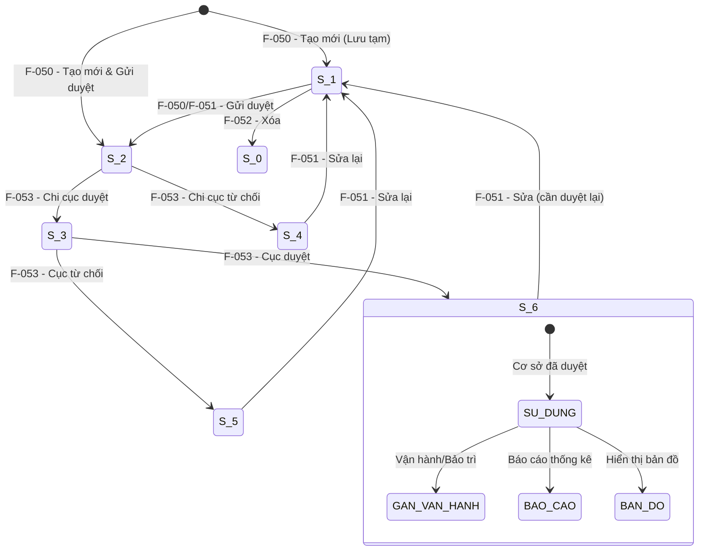

# Đặc tả nghiệp vụ: Xem chi tiết Cơ sở sửa chữa, đóng tàu

**Tài liệu:** BA Feature Brief
**Feature:** F-054
**Module:** M-003 — Quản lý tài sản KCHTGT khu nước VTS
**Người viết:** Business Analyst
**Ngày cập nhật:** 2026-08-04

---

## 1. Tổng quan

### 1.1. Tính năng này làm gì?

Trang chi tiết hiển thị toàn bộ thông tin của một Cơ sở sửa chữa, đóng tàu được chọn từ danh sách, bao gồm dữ liệu kỹ thuật, trạng thái phê duyệt, tọa độ GIS, file đính kèm và các hành động khả dụng theo vai trò. Trang ở chế độ read-only — mọi chỉnh sửa phải thực hiện qua F-051.

### 1.2. Tại sao cần tính năng này?

Cung cấp giao diện xem chi tiết để tất cả các bên liên quan — từ nhân viên vận hành đến quản lý — có thể tiếp cận thông tin chính xác và cập nhật nhất về từng cơ sở. Điều này hỗ trợ ra quyết định nhanh chóng trong vận hành, lập kế hoạch sửa chữa tàu thuyền, kiểm toán tuân thủ và báo cáo quản lý.

### 1.3. Luồng hoạt động chính

1. Người dùng click vào mã hoặc tên cơ sở trong danh sách, hoặc nhấn nút Xem.
2. Hệ thống gọi GET `/api/v1/co-so-sua-chua/:id` để lấy toàn bộ thông tin chi tiết (JOIN CangBien, CauCang).
3. Trang chi tiết hiển thị đầy đủ các nhóm thông tin:
   - Thông tin định danh: mã cơ sở, tên cơ sở
   - Đơn vị quản lý, cảng biển sở hữu (kèm hyperlink), cầu cảng sở hữu
   - Thông tin đặc thù: công năng sử dụng, loại tàu, cỡ tàu, diện tích, số triền đà...
   - Trạng thái: badge màu cho tình trạng khai thác/vận hành và trạng thái phê duyệt
   - Metadata: người tạo, thời gian tạo, người cập nhật, thời gian cập nhật (chỉ Admin Cục)
   - Tọa độ GIS và bản đồ
   - Danh sách file đính kèm
4. Người dùng có thể thực hiện các hành động theo vai trò: tải file, chỉnh sửa (F-051), phê duyệt/từ chối (F-053), xóa (F-052), xem lịch sử (F-055).
5. Breadcrumb: Trang chủ > Quản lý tài sản KCHTGT > Cơ sở sửa chữa & đóng tàu > [tên cơ sở].

---

## 2. Ai dùng? Dùng như thế nào?

Quyền thao tác và xem tính năng được áp dụng theo hệ thống phân quyền tập trung, kiểm soát bởi cơ chế RBAC.

### 2.1. Logic phân quyền chung

Các thao tác trong tính năng được bảo vệ bởi các quyền (permissions) tương ứng. Người dùng chỉ có thể thực hiện những thao tác mà vai trò của họ được cấp quyền. Mọi người dùng đã đăng nhập đều có quyền xem chi tiết cơ sở — đây là quyền cơ bản nhất trong module.

### 2.2. Logic phân quyền đặc biệt cho tài khoản Admin Cục

- **Xem full dữ liệu:** Admin Cục có quyền xem toàn bộ dữ liệu trên hệ thống, không giới hạn phạm vi đơn vị hay khu vực.
- **Xem thông tin người chỉnh sửa:** thấy được họ tên, tên đăng nhập người chỉnh sửa cuối cùng.
- **Xem thời gian cập nhật:** thấy được timestamp cập nhật cuối cùng.
- **Xem người tạo mới:** thấy được họ tên, tên đăng nhập người tạo.
- **Xem thời gian tạo mới:** thấy được timestamp tạo.

---

## 3. User Stories

### Mức Must (bắt buộc có)

- **US-054-01:** Là Chuyên viên, tôi muốn xem toàn bộ thông tin chi tiết của một cơ sở để nắm được tình trạng hiện tại trước khi thao tác tiếp.
- **US-054-02:** Là Quản lý, tôi muốn xem đầy đủ các trường kỹ thuật và trạng thái của cơ sở để kiểm tra thông tin trước khi phê duyệt hoặc chỉnh sửa.
- **US-054-03:** Là Lãnh đạo, tôi muốn xem chi tiết cơ sở và thực hiện phê duyệt/từ chối ngay trên trang chi tiết để tiết kiệm thời gian.

### Mức Should (nên có)

- **US-054-04:** Là Chuyên viên, tôi muốn tải xuống các file đính kèm của cơ sở để phục vụ công tác kiểm tra thực tế.
- **US-054-05:** Là Quản lý, tôi muốn xem lịch sử thay đổi của cơ sở ngay từ trang chi tiết để biết ai đã thay đổi gì và khi nào.
- **US-054-06:** Là người dùng, tôi muốn có breadcrumb điều hướng rõ ràng để dễ dàng quay lại danh sách hoặc trang Cảng biển cha.

### Mức Could (có thể có sau)

- **US-054-07:** Là người dùng, tôi muốn xem trước (preview) file ảnh JPEG/PNG trực tiếp trên trang chi tiết thay vì phải tải xuống.
- **US-054-08:** Là Chuyên viên, tôi muốn xem danh sách vận hành/bảo trì/sự cố liên quan đến cơ sở này.

---

## 4. Yêu cầu chức năng (Acceptance Criteria)

**AC-054-01 — Hiển thị đầy đủ thông tin:** Trang chi tiết hiển thị tất cả các trường của entity CSSCDT. Nếu API trả về lỗi, hiển thị thông báo lỗi và nút "Thử lại".

**AC-054-02 — Link đến Cảng biển cha:** Trường fkCangBien hiển thị dưới dạng tên cảng biển kèm hyperlink. Nếu cảng biển cha không tồn tại hoặc đã bị xóa, hiển thị tên kèm cảnh báo "(không khả dụng)".

**AC-054-03 — Badge trạng thái theo vòng đời:** Tình trạng và trạng thái phê duyệt hiển thị dạng badge màu (xem mục 6.2):
- tinhTrang: xanh lá cho Đang khai thác/vận hành, xám cho Chưa khai thác/vận hành, đỏ cho Dừng khai thác/vận hành
- status: vàng cho Lưu tạm, xanh dương cho Chờ duyệt/Đang xem xét, xanh lá cho Đã duyệt, đỏ cho Từ chối

**AC-054-04 — Danh sách file đính kèm:** Hiển thị tên file, kích thước, loại file, ngày upload. Mỗi file có nút "Tải xuống". Không có file → "Không có file đính kèm".

**AC-054-05 — Hành động theo trạng thái:** Các nút hành động hiển thị động theo trạng thái (xem mục 6.2). Nếu không có quyền, nút tương ứng bị ẩn.

**AC-054-06 — Breadcrumb điều hướng:** Trang chủ > Quản lý tài sản KCHTGT > Cơ sở sửa chữa & đóng tàu > [tên cơ sở].

**AC-054-07 — Metadata cho Admin Cục:** Admin Cục thấy người tạo, thời gian tạo, người chỉnh sửa, thời gian cập nhật. Vai trò khác bị ẩn.

**AC-054-08 — Hiển thị tọa độ GIS:** Bảng tọa độ kèm bản đồ nhỏ + nút "Xem vị trí".

---

## 5. Quy tắc nghiệp vụ (Business Rules)

**BR-054-01 — Xem được ở mọi trạng thái:** Cơ sở ở bất kỳ trạng thái nào (S_1 đến S_6, kể cả S_0) đều có thể xem chi tiết.

**BR-054-02 — Dữ liệu read-only:** Trang chi tiết là chế độ xem. Mọi chỉnh sửa phải qua F-051.

**BR-054-03 — Phê duyệt từ trang chi tiết:** Leader/Admin có thể phê duyệt/từ chối ngay từ trang chi tiết khi trạng thái phù hợp (S_2 cho Cấp 1, S_3 cho Cấp 2).

**BR-054-04 — Link Cảng biển cha:** Hiển thị dạng hyperlink. Nếu cảng biển cha đã bị xóa, hiển thị cảnh báo nhưng vẫn cho phép xem thông tin cơ sở.

**BR-054-05 — Dữ liệu làm mới tự động:** Làm mới mỗi khi truy cập, không cache.

**BR-054-06 — Hiển thị theo vòng đời:** Các nút hành động thay đổi theo trạng thái hiện tại.

**BR-054-07 — Cơ sở đã duyệt mới dùng được ở module khác:** Nếu chưa duyệt/từ chối → cảnh báo "Cơ sở chưa được phê duyệt, không khả dụng trong các module khác". Nếu S_6 → "Cơ sở đã được phê duyệt, đang khả dụng".

---

## 6. Vòng đời và liên kết với các tính năng khác

> ⚠ **QUAN TRỌNG CHO DEVELOPER:** Trang Xem chi tiết (F-054) là điểm trung tâm để xem thông tin CSSCDT và điều hướng đến các tính năng khác.

### 6.1. Vòng đời CSSCDT

### 6.2. Trạng thái hiển thị trên trang chi tiết

| Trạng thái | Mã | Badge màu | Hành động có thể thực hiện |
|---|---|---|---|
| Lưu tạm | S_1 | Vàng | Chỉnh sửa, Xóa, Gửi duyệt |
| Chờ Chi cục duyệt | S_2 | Xanh dương | Chỉnh sửa, Phê duyệt C1, Từ chối C1 |
| Chờ Cục duyệt | S_3 | Xanh dương | Chỉnh sửa, Phê duyệt C2, Từ chối C2 |
| Từ chối Chi cục | S_4 | Đỏ | Chỉnh sửa |
| Từ chối Cục | S_5 | Đỏ | Chỉnh sửa |
| Đã duyệt | S_6 | Xanh lá | Chỉnh sửa |
| Đã xóa | S_0 | Xám | Không có hành động nào |

### 6.3. Quan hệ với F-050 (Tạo mới)

F-054 là trang đích sau khi tạo mới thành công từ F-050. Hiển thị đúng trạng thái vừa được set từ F-050 (S_1 hoặc S_2 hoặc S_6).

---

## 7. Mô hình dữ liệu

Tính năng này chỉ đọc dữ liệu, không tạo hay sửa bảng.

### 7.1. Bảng `co_sua_chua_dong_tau` — Thông tin chính

#### A. Thông tin định danh & hành chính

- **ma, ten:** mã và tên cơ sở
- **fkDonViQl:** mã đơn vị quản lý (JOIN lấy tên)
- **fkCangBien:** mã cảng biển (JOIN lấy tên + hyperlink)
- **fkCauCang:** mã cầu cảng (JOIN lấy tên)
- **diaDiem, diaDiemChiTiet:** địa điểm
- **tinhTrang:** tình trạng khai thác/vận hành → badge
- **status:** trạng thái phê duyệt → badge

#### B. Thông tin đặc thù

- **congNangSuDung, dienTichNhaXuongKhoBai, loaiTauDongMoiSuaChua, coTau, loaiHinhDoanhNghiep, hoatDong, soLuongTrienDa, ghiChu**

#### C. Thông tin GIS

- **loaiDoiTuong, bieuTuong, heQuyChieu, quyTacHienThi**

#### D. Metadata

- **nguoiTao, thoiGianTao:** chỉ hiển thị Admin Cục
- **nguoiChinhSua, thoiGianCapNhat:** chỉ hiển thị Admin Cục
- **createdAt, updatedAt:** system

### 7.2. Bảng `co_sua_chua_dong_tau_geo` — Tọa độ GIS

Truy vấn danh sách tọa độ: kinhDo, viDo, thuTu.

### 7.3. Bảng `co_sua_chua_dong_tau_attachment` — File đính kèm

Truy vấn danh sách file: tenFile, kichThuoc, loaiFile, nguoiUpload, thoiGianUpload.

### 7.4. Bảng `phe_duyet_lich_su` — Lịch sử

Truy vấn danh sách lịch sử: loaiThaoTac, truongThayDoi, giaTriCu, giaTriMoi, nguoiThucHien, thoiGian. Sắp xếp giảm dần theo thời gian.

---

## 8. API Endpoints

| Method | Endpoint | Mô tả | Phân quyền |
|---|---|---|---|
| GET | `/api/v1/co-so-sua-chua/:id` | Lấy toàn bộ thông tin chi tiết (JOIN) | Tất cả người dùng |
| GET | `/api/v1/co-so-sua-chua/:id/history` | Lấy danh sách lịch sử thay đổi | Tất cả người dùng |
| GET | `/api/v1/co-so-sua-chua/:id/attachments/:fileId/download` | Tải xuống file đính kèm | Tất cả người dùng |

---

## 9. Chi tiết nghiệp vụ từng phần

### 9.1. Trang chi tiết CSSCDT

Trang hiển thị toàn bộ thông tin, tổ chức thành các nhóm. Chế độ read-only. Nhóm phụ dạng collapsible.

#### A. Nhóm Thông tin cơ bản — mở rộng mặc định

| STT | Tên trường | Loại hiển thị | Mô tả |
| --- | --- | --- | --- |
| 1 | Mã cơ sở sửa chữa, đóng tàu | Text (read-only) | Định danh duy nhất, tự động sinh. |
| 2 | Tên cơ sở sửa chữa, đóng tàu | Text (read-only) | |
| 3 | Đơn vị quản lý | Text (read-only) | |
| 4 | Thuộc cảng biển | Link (read-only) | Hyperlink đến Cảng biển cha. Nếu đã xóa → "(không khả dụng)". |
| 5 | Thuộc cầu cảng | Text (read-only) | Trống hiển thị "—". |
| 6 | Địa điểm (Tỉnh/Thành phố) | Text (read-only) | |
| 7 | Địa điểm chi tiết | Text (read-only) | |

#### B. Nhóm Thông tin đặc thù — mở rộng mặc định

| STT | Tên trường | Loại hiển thị |
| --- | --- | --- |
| 8 | Công năng sử dụng | Text (read-only) |
| 9 | Diện tích nhà xưởng, kho bãi (m²) | Number (read-only) |
| 10 | Loại tàu đóng mới, sửa chữa | Text (read-only) |
| 11 | Cỡ tàu (DWT) | Text (read-only) |
| 12 | Loại hình doanh nghiệp | Text (read-only) |
| 13 | Hoạt động | Text (read-only) |
| 14 | Số lượng triền đà | Number (read-only) |
| 15 | Ghi chú | Text (read-only) |

#### C. Nhóm Trạng thái — mở rộng mặc định

| STT | Tên trường | Loại hiển thị |
| --- | --- | --- |
| 16 | Tình trạng khai thác/vận hành | Badge (xanh lá/xám/đỏ) |
| 17 | Trạng thái phê duyệt | Badge (vàng/xanh dương/xanh lá/đỏ) |
| 18 | Cảnh báo trạng thái | Alert box |
| 19 | Ngày cập nhật | Text (dd/MM/yyyy HH:mm) |
| 20 | Cán bộ cập nhật | Text (chỉ Admin Cục) |

#### D. Nhóm Tọa độ GIS — thu gọn mặc định

Loại đối tượng, Biểu tượng, Hệ quy chiếu (WGS_84), Quy tắc hiển thị (Độ/Phút/Giây), Bảng tọa độ + bản đồ nhỏ + nút "Xem vị trí".

#### E. Nhóm File đính kèm — mở rộng mặc định

Bảng file: tên file, kích thước, loại file, ngày upload. Nút "Tải xuống".

#### F. Nhóm Hành động — cố định cuối trang

| Nút | Điều kiện |
|---|---|
| Chỉnh sửa | status ≠ S_0 + có quyền |
| Xóa | status = S_1 + có quyền |
| Gửi duyệt | status = S_1 + có quyền |
| Phê duyệt | Leader/Admin + S_2 (C1) hoặc S_3 (C2) |
| Từ chối | Leader/Admin + S_2 (C1) hoặc S_3 (C2) |
| Lịch sử | Tất cả (trừ S_0) |
| Quay lại | Luôn hiển thị |

#### G. Tab: Thông tin phê duyệt — thu gọn mặc định

Hiển thị dạng bảng, danh sách các lần phê duyệt của cơ sở:

| Cột | Mô tả |
|---|---|
| Cấp phê duyệt | Cấp 1 (Chi cục) / Cấp 2 (Cục) |
| Người phê duyệt | Họ tên cán bộ phê duyệt |
| Ngày phê duyệt | Ngày giờ phê duyệt (dd/MM/yyyy HH:mm) |
| Kết quả | Đã duyệt / Từ chối |
| Lý do | Lý do từ chối (nếu có) |

#### H. Tab: Thông tin vận hành khai thác — thu gọn mặc định

Hiển thị dạng bảng:

| Cột | Mô tả |
|---|---|
| Mã kế hoạch | Mã định danh kế hoạch vận hành |
| Tên kế hoạch | Tên kế hoạch vận hành khai thác |
| Ngày bắt đầu | Ngày bắt đầu thực hiện |
| Ngày kết thúc | Ngày kết thúc thực hiện |
| Thao tác | Nút xem chi tiết kế hoạch |

#### I. Tab: Thông tin bảo trì — thu gọn mặc định

Hiển thị dạng bảng:

| Cột | Mô tả |
|---|---|
| Mã kế hoạch | Mã định danh kế hoạch bảo trì |
| Tên kế hoạch | Tên kế hoạch bảo trì |
| Thời gian bắt đầu | Thời điểm bắt đầu bảo trì |
| Thời gian kết thúc | Thời điểm kết thúc bảo trì |
| Thao tác | Nút xem chi tiết kế hoạch |

#### J. Tab: Thông tin sự cố — thu gọn mặc định

Hiển thị dạng bảng:

| Cột | Mô tả |
|---|---|
| Mã sự cố | Mã định danh sự cố |
| Loại sự cố | Phân loại sự cố |
| Địa điểm | Địa điểm xảy ra sự cố |
| Thời gian | Thời điểm xảy ra sự cố |
| Thao tác | Nút xem chi tiết sự cố |

---

## 10. Yêu cầu phi chức năng

### 10.1. Hiệu năng
- Tải trang ≤ 1 giây (JOIN + file)
- Tải file ≤ 3 giây (tối đa 10MB)

### 10.2. Khả năng mở rộng
- Dễ thêm trường mới, sẵn sàng preview ảnh.

### 10.3. Bảo mật
- RBAC trên tất cả API. JWT token. Metadata chỉ Admin Cục.

### 10.4. Độ tin cậy
- Làm mới mỗi lần truy cập, không cache. Vẫn hiển thị nếu cảng cha bị xóa.

### 10.5. Trải nghiệm người dùng
- Responsive, skeleton loading, collapsible, cảnh báo trạng thái, WCAG 2.1 AA.

### 10.6. Tuân thủ pháp lý
- Theo quy định KCHTGT Cục Hàng hải. Audit log đầy đủ.

---

## 11. Yêu cầu giao diện người dùng

> **Nguyên tắc cốt lõi:** Màu sắc, khoảng cách, kích thước từ `frontend/src/theme.ts` và `frontend/src/tokens.ts`. Không hardcode.

### 11.1. Hệ thống màu sắc

| Khi cần... | Token | Màu |
|---|---|---|
| Tiêu đề, số liệu | `textPrimary` | `#0c2438` |
| Nhãn field | `textSecondary` | `#566a7c` |
| Caption | `textTertiary` | `#93a3b3` |
| Nền card | `surfaceCard` | `#FFFFFF` |
| Nền trang | `surfacePage` | `#eaf0f6` |
| Viền | `borderDefault` | `rgba(11,46,79,0.09)` |
| Nút chính | `actionPrimary` | `#0E6FD6` |

### 11.2. Thang số

**Spacing:** 4, 8, 12, 16, 24, 32. **Radius:** 4, 8, 12, 999. **Font:** 10, 13, 15, 18. **Weight:** 400, 500, 600. Font: `'Inter', sans-serif`.

> **Cấm:** spacing 6,10,14,18; radius 6,7,10; font-size 12,14,16,24.

### 11.3. Màn hình Chi tiết CSSCDT

1. **ScreenHeader:** breadcrumb "Quản lý tài sản KCHTGT > Cơ sở sửa chữa & đóng tàu > [tên cơ sở]".
2. **Card Thông tin cơ bản:** label-value (nhóm A).
3. **Card Đặc thù & Trạng thái:** thông tin đặc thù + badge (nhóm B + C).
4. **Cảnh báo trạng thái:** alert box theo trạng thái.
5. **Collapsible sections:** Tọa độ GIS (D), Phê duyệt (G), Vận hành khai thác (H), Bảo trì (I), Sự cố (J) — thu gọn mặc định.
6. **Attachment:** bảng file + nút Tải xuống (E).
7. **Action bar cố định cuối trang:** Chỉnh sửa, Phê duyệt, Từ chối, Xóa, Lịch sử, Quay lại.

### 11.4. Các trạng thái giao diện
- Đang tải: skeleton. Không tìm thấy: "Cơ sở không tồn tại". Cảng cha không khả dụng: tag "(không khả dụng)". Không có file: "Không có file đính kèm". Lỗi: cảnh báo đỏ + "Thử lại".

### 11.5. Giao diện trên điện thoại
- Sidebar 80px, card xếp dọc, action bar floating.
