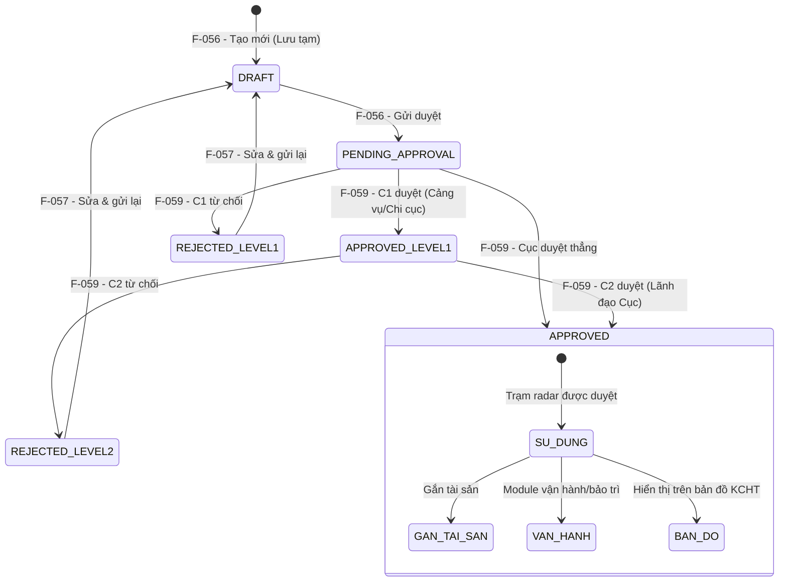

# Đặc tả nghiệp vụ: Quản lý Trạm radar - Tạo mới

**Tài liệu:** BA Feature Brief
**Feature:** F-056
**Module:** M-003 — Quản lý tài sản KCHTGT - Khu nước & VTS
**Người viết:** Business Analyst
**Ngày cập nhật:** 2026-08-07

---

## 1. Tổng quan

### 1.1. Tính năng này làm gì?

Cho phép người dùng có thẩm quyền (Admin, Chuyên viên) tạo mới một Trạm radar vào hệ thống quản lý tài sản KCHTGT khu nước & VTS. Người dùng nhập đầy đủ thông tin kỹ thuật và hành chính. Trạm radar sau khi tạo sẽ ở trạng thái "Lưu tạm" (`DRAFT`) và cần được phê duyệt 2 cấp trước khi đưa vào vận hành.

### 1.2. Tại sao cần tính năng này?

Trạm radar là thiết bị đầu cuối trong hệ thống VTS (Vessel Traffic Service), có vai trò quét và giám sát giao thông tàu thuyền trên biển. Việc số hóa quy trình đăng ký và quản lý Trạm radar giúp đảm bảo thông tin kỹ thuật chính xác (tọa độ, tầm hiệu lực, chiều cao tháp), phục vụ công tác giám sát luồng hàng hải, đánh giá vùng phủ sóng và lập kế hoạch bảo trì thiết bị.

### 1.3. Luồng hoạt động chính

1. Người dùng đăng nhập hệ thống, vào menu **Quản lý KCHTGT > Khu nước & VTS > Trạm radar**.
2. Hệ thống hiển thị danh sách Trạm radar.
3. Người dùng nhấn nút **"Tạo mới"**.
4. Hệ thống hiển thị form tạo mới Trạm radar với các trường rỗng.
5. Người dùng nhập thông tin vào các trường trên form.
6. Hệ thống kiểm tra tất cả các trường thông tin theo validation (xem chi tiết tại Mô tả màn hình).
7. Người dùng chọn một trong ba hành động lưu:
   - **"Lưu tạm":** Lưu trạm radar với trạng thái "Lưu tạm" (`DRAFT`). Trạm radar chưa được gửi duyệt, có thể sửa tiếp.
   - **"Lưu và gửi phê duyệt":** Lưu và gửi yêu cầu phê duyệt đến cấp có thẩm quyền. Trạng thái chuyển sang "Chờ Cảng vụ/Chi cục duyệt" (`PENDING_APPROVAL`).
   - **"Lưu và phê duyệt":** (Chỉ dành cho tài khoản có quyền phê duyệt) Lưu và phê duyệt ngay. Trạng thái chuyển sang "Đã phê duyệt" (`APPROVED`).
8. Hệ thống gọi API tạo mới và kiểm tra các quy tắc nghiệp vụ.
9. Nếu thành công: Trạm radar được lưu với trạng thái tương ứng, hệ thống ghi nhật ký tạo mới, hiển thị thông báo thành công và chuyển hướng về trang danh sách.
10. Nếu thất bại: Thông báo lỗi hiển thị tại trường tương ứng.

---

## 2. Ai dùng? Dùng như thế nào?

Quyền thao tác và xem tính năng được áp dụng theo hệ thống phân quyền tập trung của hệ thống. Mỗi vai trò người dùng sẽ có phạm vi truy cập và thao tác khác nhau trên tính năng này, được kiểm soát bởi cơ chế RBAC (Role-Based Access Control).

### 2.1. Logic phân quyền đặc biệt cho tài khoản Admin Cục

Đối với tài khoản **Admin Cục**, áp dụng logic phân quyền đặc biệt sau:

- **Xem full dữ liệu:** Admin Cục có quyền xem toàn bộ dữ liệu trên hệ thống, không giới hạn phạm vi đơn vị hay khu vực.
- **Xem thông tin người chỉnh sửa:** Với mỗi bản ghi, Admin Cục thấy được thông tin người chỉnh sửa cuối cùng (họ tên, tên đăng nhập).
- **Xem thời gian cập nhật:** Admin Cục thấy được thời gian cập nhật cuối cùng của dữ liệu (timestamp).
- **Xem người tạo mới:** Admin Cục thấy được thông tin người tạo mới bản ghi (họ tên, tên đăng nhập).
- **Xem thời gian tạo mới:** Admin Cục thấy được thời gian tạo mới dữ liệu (timestamp).

> **Ghi chú:** Các trường `người tạo mới`, `thời gian tạo mới`, `người chỉnh sửa`, `thời gian cập nhật` cần được bổ sung vào bảng dữ liệu tương ứng và chỉ hiển thị đối với tài khoản Admin Cục. Với các vai trò khác, các trường này bị ẩn khỏi giao diện.

---

## 3. User Stories

Dưới đây là các câu chuyện người dùng, sắp xếp theo mức độ ưu tiên (Must > Should > Could):

### Mức Must (bắt buộc có)

- **US-056-01:** Là Chuyên viên, tôi muốn tạo mới một Trạm radar với đầy đủ thông tin cơ bản và kỹ thuật để đăng ký tài sản vào hệ thống quản lý.
- **US-056-02:** Là Chuyên viên, tôi muốn hệ thống tự động gán trạng thái "Lưu tạm" (DRAFT) cho bản ghi mới tạo để bản ghi được đưa vào luồng phê duyệt.
- **US-056-03:** Là Chuyên viên, tôi muốn chỉ chọn được Hệ thống VTS và trung tâm điều hành VTS đã được phê duyệt để đảm bảo trạm radar được gán đúng hệ thống hợp lệ.
- **US-056-04:** Là Chuyên viên, tôi muốn có thể "Lưu tạm" trạm radar để chỉnh sửa thêm trước khi gửi phê duyệt.
- **US-056-05:** Là Chuyên viên, tôi muốn "Lưu và gửi phê duyệt" để gửi trạm radar đến cấp có thẩm quyền xem xét.
- **US-056-06:** Là Admin/Lãnh đạo, tôi muốn "Lưu và phê duyệt" ngay để đưa trạm radar vào sử dụng mà không cần chờ duyệt thêm bước nữa.

### Mức Should (nên có)

- **US-056-07:** Là Chuyên viên, tôi muốn nhập tọa độ GIS cho trạm radar để hiển thị vị trí trên bản đồ sau khi được phê duyệt.
- **US-056-08:** Là Chuyên viên, tôi muốn đính kèm file tài liệu (ảnh, PDF) liên quan đến trạm radar khi tạo mới để hoàn thiện hồ sơ trong một lần thao tác.
- **US-056-09:** Là Chuyên viên, tôi muốn nhận được thông báo rõ ràng khi tạo mới thành công hoặc thất bại để biết trạng thái thao tác của mình.

### Mức Could (có thể có sau)

- **US-056-10:** Là Chuyên viên, tôi muốn chọn trạm radar từ danh sách mẫu có sẵn để tạo nhanh.

---

## 4. Yêu cầu chức năng (Acceptance Criteria)

Mỗi yêu cầu dưới đây mô tả một điều hệ thống phải làm được, kèm theo cách xử lý khi có lỗi hoặc dữ liệu không như mong đợi.

**AC-056-01 — Hiển thị form tạo mới:** Người dùng có vai trò Admin hoặc Chuyên viên nhấn nút "Tạo mới" từ danh sách Trạm radar, hệ thống hiển thị form tạo mới với đầy đủ các nhóm trường: Thông tin cơ bản, Thông tin kỹ thuật, Tọa độ GIS, File đính kèm. Nếu người dùng không có quyền, nút "Tạo mới" bị ẩn và API trả về 403 Forbidden.

**AC-056-02 — Tạo mới thành công với dữ liệu hợp lệ:** Khi người dùng nhập đầy đủ và hợp lệ tất cả các trường bắt buộc, hệ thống lưu bản ghi vào database với `approvalStatus = DRAFT`, `approvedLevel1 = false`, `approvedLevel2 = false`. API trả về HTTP 200 kèm thông tin bản ghi vừa tạo.

**AC-056-03 — Tự động gán trạng thái DRAFT:** Dù client có gửi `approvalStatus` hay không, server luôn gán `approvalStatus = DRAFT` khi tạo mới. Không cho phép tạo bản ghi với trạng thái khác.

**AC-056-04 — Validation tên trạm:** `stationName` là bắt buộc, tối đa 255 ký tự. Nếu để trống, hệ thống hiển thị lỗi "Tên trạm không được để trống" tại trường và chặn submit. Validation được thực hiện ở cả client-side và server-side.

**AC-056-05 — Validation vị trí:** `location` là bắt buộc, tối đa 500 ký tự. Nếu để trống, hệ thống hiển thị lỗi "Vị trí không được để trống" tại trường và chặn submit.

**AC-056-06 — Validation tọa độ (nếu nhập):** `longitude` phải nằm trong [-180, 180], `latitude` phải nằm trong [-90, 90]. Nếu ngoài khoảng, hệ thống hiển thị lỗi tại trường tương ứng.

**AC-056-07 — Ghi nhận người tạo:** Hệ thống tự động ghi nhận `createdBy` (ID người dùng hiện tại từ session) và `createdDate` (thời điểm tạo). Không nhận giá trị này từ client.

**AC-056-08 — Lưu tạm thành công:** Người dùng chọn "Lưu tạm", Trạm radar được lưu với trạng thái `DRAFT`. Hiển thị thông báo "Lưu tạm trạm radar thành công" và chuyển hướng về danh sách. Trạm radar có thể được chỉnh sửa tiếp (F-057).

**AC-056-09 — Lưu và gửi phê duyệt thành công:** Người dùng chọn "Lưu và gửi phê duyệt", Trạm radar được lưu và gửi đến cấp phê duyệt. Trạng thái chuyển sang `PENDING_APPROVAL` (Chờ Cảng vụ/Chi cục duyệt). Hiển thị thông báo "Đã gửi phê duyệt trạm radar" và chuyển hướng về danh sách. Trạm radar xuất hiện trong danh sách chờ phê duyệt của F-059.

**AC-056-10 — Lưu và phê duyệt thành công:** Người dùng có quyền phê duyệt (Admin/Lãnh đạo) chọn "Lưu và phê duyệt", Trạm radar được lưu và phê duyệt ngay. Trạng thái chuyển sang `APPROVED`, `approvedLevel1 = true`, `approvedLevel2 = true`. Hiển thị thông báo "Tạo mới và phê duyệt trạm radar thành công". Trạm radar sẵn sàng để sử dụng trong các module khác.

**AC-056-11 — Xử lý lỗi server:** Nếu có lỗi trong quá trình lưu (VD: lỗi kết nối DB, vi phạm constraint), hệ thống trả về HTTP 400 kèm thông báo lỗi cụ thể, không để frontend crash.

**AC-056-12 — Các trường bắt buộc:** Tất cả các trường bắt buộc phải được điền đầy đủ. Nếu thiếu trường nào, hệ thống hiển thị lỗi "Trường này là bắt buộc" và chặn submit.

---

## 5. Quy tắc nghiệp vụ (Business Rules)

Các quy tắc này là "luật chơi" mà mọi thành phần trong hệ thống phải tuân thủ:

**BR-056-01 — Trạng thái mặc định là DRAFT (Lưu tạm):** Mọi bản ghi trạm radar khi tạo mới luôn có `approvalStatus = DRAFT`, bất kể ai tạo. Đây là trạng thái "Lưu tạm" — chưa có hiệu lực sử dụng.

**BR-056-02 — Tên trạm là bắt buộc:** Mỗi trạm radar phải có tên (`stationName`), tối đa 255 ký tự.

**BR-056-03 — Vị trí là bắt buộc:** Mỗi trạm radar phải có vị trí (`location`), tối đa 500 ký tự.

**BR-056-04 — Trạm radar phải thuộc một đơn vị quản lý:** Trường `orgUnitId` xác định đơn vị quản lý trạm radar. Chuyên viên chỉ được tạo trạm trong phạm vi đơn vị của mình. Mặc định được điền theo đơn vị của người dùng đăng nhập.

**BR-056-05 — Hệ thống VTS phải đã duyệt:** Khi chọn Hệ thống VTS (`vtsSystemId`), chỉ hiển thị các VTS đã được phê duyệt (`APPROVED`) và filter theo đơn vị quản lý. Không được chọn VTS đang "Lưu tạm", "Chờ duyệt" hoặc "Bị trả về".

**BR-056-06 — Cascade logic khi thay đổi đơn vị quản lý:** Khi thay đổi `orgUnitId`, tự động clear `vtsSystemId` vì danh sách VTS phụ thuộc vào đơn vị quản lý.

**BR-056-07 — Validation các trường thông tin:** Các trường thông tin cần nhập đúng validation (xem chi tiết tại mục 9.1 Mô tả màn hình). Validation được thực hiện ở cả client-side và server-side.

**BR-056-08 — Trạm radar chưa duyệt thì chưa dùng được:** Trạm radar sau khi tạo ở trạng thái `DRAFT`/`PENDING_APPROVAL`/`APPROVED_LEVEL1` **chưa thể được tham chiếu** bởi bất kỳ module nào khác (không xuất hiện trong dropdown chọn trạm radar của module Vận hành, Bảo trì, Bản đồ...). Phải qua phê duyệt 2 cấp (F-059) để đạt trạng thái `APPROVED` thì mới có thể sử dụng.

---

## 6. Vòng đời và liên kết với các tính năng khác

> ⚠ **QUAN TRỌNG CHO DEVELOPER:** Tính năng Tạo mới Trạm radar (F-056) là **bước đầu tiên** trong vòng đời của trạm radar. Dưới đây là toàn bộ vòng đời và các tính năng liên quan mà developer cần nắm khi phát triển.

### 6.1. Vòng đời trạm radar



### 6.2. Trạng thái và ý nghĩa

| Trạng thái | Mã | Ý nghĩa | Có thể dùng ở module khác? |
|---|---|---|---|
| Lưu tạm | DRAFT | Trạm radar vừa được tạo, chưa gửi duyệt | **❌ Không** — không xuất hiện trong dropdown chọn trạm radar |
| Chờ Cảng vụ/Chi cục duyệt | PENDING_APPROVAL | Đã gửi duyệt, đang chờ phê duyệt cấp 1 | **❌ Không** — không xuất hiện trong dropdown chọn trạm radar |
| Chờ Cục duyệt | APPROVED_LEVEL1 | Đã duyệt C1, đang chờ phê duyệt C2 | **❌ Không** — chưa được dùng |
| Bị trả về | REJECTED_LEVEL1 / REJECTED_LEVEL2 | Bị từ chối ở C1 hoặc C2, cần sửa và gửi lại | **❌ Không** — cần sửa lại (F-057) và gửi duyệt lại |
| Đã phê duyệt | APPROVED | Đã duyệt cả 2 cấp, sẵn sàng sử dụng | **✅ Có** — xuất hiện trong tất cả dropdown và module liên quan |
| Đã xóa | ARCHIVED (isDeleted) | Trạm radar bị xóa mềm (F-058) | **❌ Không** — ẩn khỏi toàn bộ hệ thống |

### 6.3. Các tính năng liên quan trực tiếp

Những tính năng này nằm trong cùng module M-003 và developer làm F-056 **cần biết** vì chúng tạo thành chuỗi nghiệp vụ liên tục:

| Feature | Tên | Vai trò | Mối liên kết với F-056 |
|---|---|---|---|
| **F-057** | Cập nhật Trạm radar | Sửa thông tin sau khi tạo | Sau khi sửa, trạng thái quay về DRAFT (Lưu tạm) → cần duyệt lại |
| **F-058** | Xóa Trạm radar | Xóa mềm trạm radar | Chỉ xóa được bản ghi ở trạng thái APPROVED |
| **F-059** | Phê duyệt Trạm radar | Duyệt 2 cấp (C1: Trưởng phòng, C2: Lãnh đạo Cục) | **Bắt buộc** — trạm radar tạo từ F-056 phải qua F-059 mới được sử dụng |
| **F-060** | Xem chi tiết Trạm radar | Xem thông tin trạm radar | Có thể xem ở mọi trạng thái |
| **F-061** | Lịch sử Trạm radar | Xem nhật ký thay đổi | Ghi nhận mọi thao tác từ F-056 |

### 6.4. Các module/tính năng sử dụng trạm radar sau khi đã duyệt

Sau khi trạm radar được duyệt (`APPROVED`), nó sẽ xuất hiện trong các module sau. Developer cần đảm bảo filter `approvalStatus = APPROVED` khi xây dựng dropdown chọn trạm radar:

| Module | Mục đích | Ghi chú |
|---|---|---|
| Bản đồ KCHT | Hiển thị vị trí trạm radar trên bản đồ | Dùng `longitude`, `latitude`, `coordinates` |
| Quản lý tài sản | Gắn thông tin tài chính (nguyên giá, khấu hao) | Chỉ chọn trạm radar đã duyệt |
| Vận hành khai thác | Gắn thông tin vận hành | Sẽ phát triển sau |
| Bảo trì, sửa chữa | Gắn lịch sử bảo trì | Sẽ phát triển sau |
| Báo cáo thống kê | Tổng hợp số liệu trạm radar | Chỉ thống kê trạm đã duyệt |

### 6.5. Module cha (trạm radar là con)

Trạm radar luôn thuộc về một Hệ thống VTS. Hệ thống VTS thuộc về một Đơn vị quản lý. Thứ tự tạo:

```markmap
- Đơn vị quản lý
  - Hệ thống VTS (F-062) — phải có ĐVQL và được duyệt
    - Trạm radar (F-056) — phải có VTS cha đã duyệt
```

> **Lưu ý:** Hiện tại `vtsSystemId` không bắt buộc ở DB, nhưng đây là liên kết nghiệp vụ quan trọng. Thiếu liên kết này, trạm radar sẽ không hiển thị được trong ngữ cảnh vận hành VTS.

---

## 7. Mô hình dữ liệu

Tính năng này tạo ra/sửa đổi các bảng dữ liệu sau trong cơ sở dữ liệu:

> **Quy ước đánh dấu:**
> - <span style="color:red;font-weight:bold">🔴 Chữ màu đỏ</span> = **trường mới cần thêm** vào bảng hiện có.
> - ~~Chữ gạch ngang~~ = **trường không cần thiết**, cần loại bỏ khỏi bảng.
> - Các trường không được đánh dấu là các trường hiện có, được giữ nguyên.

### 7.0. Thay đổi cấu trúc so với tài liệu gốc

Tài liệu gốc (`F-056` feature-brief cũ) định nghĩa 3 entity rời rạc: `TramRadar` (bảng `tram_radar`), `TramRadarAttachment` (bảng `attachment`), `TramRadarLocation` (bảng `tram_radar_location`). Dựa theo tài liệu tham khảo (`qlkc-060`), mô hình được tổ chức lại:

| Thay đổi | Chi tiết |
|---|---|
| 🏗️ Gộp bảng | ~~`TramRadarLocation`~~ được gộp vào bảng chính + GIS spatial — không cần bảng vị trí riêng |
| 🏗️ Đổi tên bảng | `tram_radar` → `radar_station`; `attachment` → `radar_station_attachment` |
| 🔴 Mở rộng | Thêm 25+ trường từ tài liệu tham khảo (đơn vị quản lý, cảng biển, VTS, trung tâm điều hành VTS, thông số kỹ thuật, GIS) |
| ~~Ẩn~~ | 11 trường kế thừa từ lớp cha `KchtAthhDto` không dùng cho RADAR (xem mục 7.3) |

---

### 7.1. Bảng `radar_station` — Thông tin trạm radar

Đây là bảng chính, lưu toàn bộ thông tin của một trạm radar.

#### A. Thông tin cơ bản

| # | Field | DB Column | Kiểu dữ liệu | Bắt buộc | Mô tả |
|---|---|---|---|---|---|
| 1 | `id` | `id` | UUID (PK) | Có | Tự động sinh (UUID v4) |
| 2 | `stationName` | `station_name` | VARCHAR(255) | **Có** | Tên trạm radar (từ `tenTram` cũ) |
| 3 | `location` | `location` | VARCHAR(500) | **Có** | Vị trí mô tả (từ `viTri` cũ) |
| 4 | <span style="color:red;font-weight:bold">🔴 `orgUnitId`</span> | `org_unit_id` | UUID | Không | Đơn vị quản lý (từ `fkDonViQl`). Mặc định = đơn vị của user |
| 5 | <span style="color:red;font-weight:bold">🔴 `cangBienId`</span> | *chưa có* | UUID (FK → cảng biển) | Không | Thuộc cảng biển (từ `fkCangBien`). Chỉ hiện CB đã duyệt, filter theo `orgUnitId` |
| 6 | `vtsSystemId` | `vts_system_id` | UUID (FK → `vts_system.id`) | Không | Thuộc hệ thống VTS (từ `fkHtVts`). Filter theo `orgUnitId`, chỉ VTS đã APPROVED |
| 7 | <span style="color:red;font-weight:bold">🔴 `ttdhVtsId`</span> | *chưa có* | UUID (FK → Trung tâm điều hành VTS) | Không | Thuộc trung tâm điều hành VTS (từ `fkTtDhVts`). Filter theo `orgUnitId` + `vtsSystemId` |
| 8 | <span style="color:red;font-weight:bold">🔴 `donViKhaiThacId`</span> | *chưa có* | UUID | Không | Đơn vị khai thác (từ `fkDonViKt`). Danh mục `DON_VI_KHAI_THAC` |
| 9 | <span style="color:red;font-weight:bold">🔴 `code`</span> | *chưa có* | VARCHAR(50) | Không | Mã radar, tự động sinh format `RADAR-{seq}` (từ `ma`) |
| 10 | <span style="color:red;font-weight:bold">🔴 `provinceId`</span> | *chưa có* | UUID | **Có** | Địa điểm Tỉnh/TP (từ `diaDiem`). Danh mục `DON_VI_HANH_CHINH` |
| 11 | <span style="color:red;font-weight:bold">🔴 `addressDetail`</span> | *chưa có* | VARCHAR(500) | Không | Địa điểm chi tiết (từ `diaDiemChiTiet`) |
| 12 | <span style="color:red;font-weight:bold">🔴 `unitOfMeasure`</span> | *chưa có* | VARCHAR(50) | Không | Đơn vị tính (từ `donViTinh`). Danh mục `DVT` |
| 13 | <span style="color:red;font-weight:bold">🔴 `quantity`</span> | *chưa có* | INT | **Có** | Số lượng (từ `soLuong`). Max 5 chữ số |
| 14 | `conditionStatus` | `condition_status` | VARCHAR(50) | **Có** | Tình trạng (từ `tinhTrang`). Mặc định = 1. Danh mục `TINH_TRANG` |

> **Ghi chú đối chiếu Excel:** Các trường `stationType` (Loại trạm) và `source` (Nguồn gốc thiết bị) **đã bỏ** — không có trong sheet `QL Trạm radar` (nguồn sự thật).

#### B. Thông tin kỹ thuật (từ `zobjDataSub` trong tài liệu tham khảo)

| # | Field | DB Column | Kiểu dữ liệu | Bắt buộc | Mô tả |
|---|---|---|---|---|---|
| 15 | `towerHeight` | `tower_height` | DECIMAL(20,4) | Không | <span style="color:red;font-weight:bold">🔴</span> Chiều cao tháp radar - m (từ `chieuCaoThapRadar`) |
| 16 | `radarRange` | `radar_range` | DECIMAL(20,0) | Không | <span style="color:red;font-weight:bold">🔴</span> Tầm hiệu lực radar (từ `tamHieuLucRadar`). Max 20 ký tự |
| 17 | `coverage` | `coverage` | VARCHAR(100) | Không | Vùng phủ sóng |
| 18 | `emissionArea` | `emission_area` | DECIMAL(10,2) | Không | Diện tích phát xạ (km²). > 0 |

#### C. GIS & Không gian (từ `zlstDataGeo` & GIS fields trong tài liệu tham khảo)

| # | Field | DB Column | Kiểu dữ liệu | Bắt buộc | Mô tả |
|---|---|---|---|---|---|
| 19 | `spatialId` | `spatial_id` | UUID | Không | Liên kết dữ liệu không gian GIS |
| 20 | `longitude` | *(qua spatial)* | DECIMAL(10,6) | Không | Kinh độ [-180, 180] |
| 21 | `latitude` | *(qua spatial)* | DECIMAL(10,6) | Không | Vĩ độ [-90, 90] |
| 22 | `geometryType` | *(trong DTO, qua spatial)* | ENUM | Không | <span style="color:red;font-weight:bold">🔴</span> Loại đối tượng GIS (từ `loaiDoiTuong`). POINT / POLYGON |
| 23 | `coordinates` | *(trong DTO, qua spatial)* | TEXT | Không | <span style="color:red;font-weight:bold">🔴</span> Tọa độ GIS (từ `toaDo`). WKT hoặc GeoJSON |
| 24 | <span style="color:red;font-weight:bold">🔴 `mapIcon`</span> | *chưa có* | VARCHAR(100) | Không | Biểu tượng trên bản đồ (từ `bieuTuong`) |
| 25 | <span style="color:red;font-weight:bold">🔴 `projection`</span> | *chưa có* | VARCHAR(50) | Không | Hệ quy chiếu (từ `heQuyChieu`). Danh mục `HE_QUY_CHIEU` |
| 26 | <span style="color:red;font-weight:bold">🔴 `displayRule`</span> | *chưa có* | VARCHAR(50) | Không | Quy tắc hiển thị (từ `quyTacHienThi`). Danh mục `QUY_TAC_HIEN_THI` |

#### D. Phê duyệt, Audit & Ghi chú

| # | Field | DB Column | Kiểu dữ liệu | Bắt buộc | Mô tả |
|---|---|---|---|---|---|
| 27 | `approvalStatus` | `approval_status` | INT | **Có** | Trạng thái phê duyệt. Mặc định `DRAFT` (Lưu tạm) |
| 28 | `approvedLevel1` | `approved_level1` | BOOLEAN | **Có** | Đã duyệt C1? Mặc định `false` |
| 29 | `approverLevel1` | `approver_level1` | UUID | Không | Người duyệt C1 |
| 30 | `approvedDateLevel1` | `approved_date_level1` | DATETIME | Không | Ngày duyệt C1 |
| 31 | `approvedLevel2` | `approved_level2` | BOOLEAN | **Có** | Đã duyệt C2? Mặc định `false` |
| 32 | `approverLevel2` | `approver_level2` | UUID | Không | Người duyệt C2 |
| 33 | `approvedDateLevel2` | `approved_date_level2` | DATETIME | Không | Ngày duyệt C2 |
| 34 | `rejectionReason` | `rejection_reason` | VARCHAR(500) | Không | Lý do từ chối |
| 35 | <span style="color:red;font-weight:bold">🔴 `ghiChu`</span> | *chưa có* | VARCHAR(2000) | Không | Ghi chú chung (từ `zobjDataSub.ghiChu`) |
| 36 | `createdBy` | `created_by` | UUID | **Có** | Người tạo (tự động từ session) |
| 37 | `createdDate` | `created_date` | DATETIME | **Có** | Thời điểm tạo (tự động) |
| 38 | `updatedBy` | `updated_by` | UUID | Không | Người sửa cuối |
| 39 | `updatedDate` | `updated_date` | DATETIME | Không | Thời điểm sửa cuối |
| 40 | `isDeleted` | `is_deleted` | BOOLEAN | **Có** | Xóa mềm. Mặc định `false` |
| 41 | `deletedBy` | `deleted_by` | UUID | Không | Người xóa |

> **Cascade logic (từ tài liệu tham khảo):**
> - Khi thay đổi `orgUnitId` → tự động clear `vtsSystemId` + `ttdhVtsId`
> - Khi thay đổi `vtsSystemId` → tự động clear `ttdhVtsId`

---

### 7.2. Bảng `radar_station_attachment` — File đính kèm

| # | Field | DB Column | Kiểu dữ liệu | Bắt buộc | Mô tả |
|---|---|---|---|---|---|
| 1 | `id` | `id` | UUID (PK) | Có | Tự động sinh |
| 2 | `radarStationId` | `radar_station_id` | UUID (FK) | Có | Liên kết đến `radar_station.id` |
| 3 | `fileName` | `file_name` | VARCHAR(255) | Có | Tên file gốc (từ `zlstFileDk`) |
| 4 | `fileUrl` | `file_url` | VARCHAR(500) | Có | Đường dẫn MinIO |
| 5 | <span style="color:red;font-weight:bold">🔴 `fileSize`</span> | *chưa có* | BIGINT | Không | Kích thước file (bytes) |
| 6 | <span style="color:red;font-weight:bold">🔴 `fileType`</span> | *chưa có* | VARCHAR(50) | Không | Loại tài liệu |

---

### 7.3. Các trường bị ẩn — không dùng cho RADAR

Các trường sau tồn tại ở lớp cha `KchtAthhDto` (theo tài liệu tham khảo) nhưng **không áp dụng** cho trạm radar. Các trường này cần được đánh dấu `@JsonIgnore` hoặc loại bỏ khỏi DTO:

| # | Field (cũ) | Lý do không dùng |
|---|---|---|
| 1 | ~~`fkDonViVh`~~ | Radar dùng `donViKhaiThacId` thay thế |
| 2 | ~~`fkNhaTram`~~ | Không thuộc nhà trạm |
| 3 | ~~`fkLuongHh`~~ | Không liên quan luồng hàng hải |
| 4 | ~~`fkLuongHhTuyen`~~ | Không liên quan tuyến luồng |
| 5 | ~~`namDuaVaoSuDung`~~ | Không áp dụng cho radar |
| 6 | ~~`ngayBd`~~ | Không áp dụng |
| 7 | ~~`ngaySc`~~ | Không áp dụng |
| 8 | ~~`loaiKetCauCongTrinh`~~ | Không phải công trình |
| 9 | ~~`chungLoaiDenChinh`~~ | Không phải đèn |
| 10 | ~~`chungLoaiDenDuPhong`~~ | Không phải đèn |
| 11 | ~~`capTramDen`~~ | Không phải trạm đèn |

---

### 7.4. ~~Bảng `tram_radar_location`~~ — ĐÃ GỘP

~~Bảng `TramRadarLocation` (từ tài liệu gốc)~~ được gộp trực tiếp vào bảng `radar_station` thông qua các trường GIS:
- Tọa độ (`longitude`, `latitude`) → lưu trong nhóm GIS của `radar_station`
- Dữ liệu không gian (`spatialId`, `geometryType`, `coordinates`) → lưu qua bảng spatial chung

**Không cần tạo bảng `tram_radar_location` riêng.**

---

## 8. API Endpoints

Hệ thống cung cấp các API để phục vụ các thao tác liên quan đến tính năng:

| Method | Endpoint | Mô tả | Phân quyền |
|---|---|---|---|
| POST | `/api/v1/radar-station?action=LUU_TAM` | Lưu tạm trạm radar (trạng thái DRAFT) | `radarstation:create` |
| POST | `/api/v1/radar-station?action=LUU_VA_GUI_PHE_DUYET` | Lưu và gửi phê duyệt (trạng thái PENDING_APPROVAL) | `radarstation:create` |
| POST | `/api/v1/radar-station?action=LUU_VA_PHE_DUYET` | Lưu và phê duyệt ngay (trạng thái APPROVED) | `radarstation:create` (chỉ Admin/Lãnh đạo) |
| GET | `/api/v1/radar-station/search?keyword=&approvalStatus=APPROVED` | Lấy danh sách Trạm radar đã duyệt (cho dropdown chọn) | `radarstation:read` |
| GET | `/api/v1/vts-system?approvalStatus=APPROVED&orgUnitId={id}` | Lấy danh sách Hệ thống VTS đã duyệt, filter theo đơn vị QL | `vtssystem:read` |

### 8.1. Request Body (POST)

```json
{
  "stationName": "Trạm radar Hải Phòng 1",
  "location": "Đồi Thiên Văn, Hải Phòng",
  "longitude": 106.75,
  "latitude": 20.85,
  "coverage": "Luồng vào cảng Hải Phòng",
  "emissionArea": 120.5,
  "conditionStatus": "GOOD",
  "orgUnitId": "3fa85f64-5717-4562-b3fc-2c963f66afa6",
  "vtsSystemId": "4fa85f64-5717-4562-b3fc-2c963f66afa6",
  "towerHeight": 45.5,
  "radarRange": 50,
  "geometryType": "POINT",
  "coordinates": "POINT(106.75 20.85)"
}
```

### 8.2. Response (200 OK)

```json
{
  "code": 200,
  "message": "Tạo mới thành công",
  "data": {
    "id": "2fa85f64-5717-4562-b3fc-2c963f66afa6",
    "stationName": "Trạm radar Hải Phòng 1",
    "location": "Đồi Thiên Văn, Hải Phòng",
    "approvalStatus": "DRAFT",
    "approvedLevel1": false,
    "approvedLevel2": false,
    "createdDate": "2026-08-07T10:30:00"
  }
}
```

### 8.3. Response lỗi (400 Bad Request)

```json
{
  "code": 400,
  "message": "Tên trạm không được để trống"
}
```

---

## 9. Chi tiết nghiệp vụ từng phần

### 9.1. Form Tạo mới Trạm radar

Form tạo mới gồm 5 nhóm thông tin. Các nhóm được tổ chức dưới dạng **collapsible sections** để giao diện gọn gàng (xem chi tiết tại mục 11.6).

#### A. Thông tin cơ bản (root fields)

| STT | Tên trường | Loại điều khiển | Cho phép chỉnh sửa | Bắt buộc | Giá trị mặc định | Mô tả |
| --- | --- | --- | --- | --- | --- | --- |
| 1 | Đơn vị quản lý | SelectOrgCode | Có | Có | Đơn vị của user | Chọn đơn vị quản lý. Mặc định = đơn vị của người dùng đăng nhập. Khi thay đổi, dropdown Cảng biển/Hệ thống VTS/Trung tâm điều hành VTS được lọc lại. |
| 2 | Thuộc cảng biển | Select (Dropdown) | Có | Không | Trống | Chọn Cảng biển. Validation: chỉ hiển thị Cảng biển đã duyệt, filter theo `orgUnitId`. |
| 3 | Thuộc hệ thống VTS | Select (Dropdown) | Có | Không | Trống | Chọn Hệ thống VTS. Validation: chỉ hiển thị VTS đã duyệt (`APPROVED`), filter theo `orgUnitId`. Khi thay đổi → clear `ttdhVtsId`. |
| 4 | Thuộc trung tâm điều hành VTS | Select (Dropdown) | Có | Không | Trống | Chọn Trung tâm điều hành VTS. Filter theo `orgUnitId` + `vtsSystemId`, chỉ trung tâm điều hành đã duyệt. |
| 5 | Đơn vị khai thác | Select (Dropdown) | Có | Không | Trống | Chọn đơn vị khai thác. Danh mục: `DON_VI_KHAI_THAC`. |
| 6 | Mã radar | Input (disabled) | Không | Không | RADAR-{seq} | Mã radar tự động sinh. Không cho phép chỉnh sửa. |
| 7 | Tên trạm radar | Input | Có | Có | Trống | Nhập tên trạm radar. Validation: không được để trống, tối đa 255 ký tự. |
| 8 | Địa điểm (Tỉnh/Thành phố) | Select (Dropdown) | Có | Có | Trống | Chọn Tỉnh/Thành phố. Danh mục: `DON_VI_HANH_CHINH`. |
| 9 | Địa điểm chi tiết | Input | Có | Không | Trống | Nhập địa điểm chi tiết. Tối đa 500 ký tự. |
| 10 | Đơn vị tính | Select (Dropdown) | Có | Không | Trống | Chọn đơn vị tính. Danh mục: `DVT`. |
| 11 | Số lượng | Input (number) | Có | Có | Trống | Nhập số lượng. Chỉ nhập số, tối đa 5 chữ số. |
| 12 | Tình trạng | Select (Dropdown) | Có | Có | Đang khai thác/vận hành | Chọn tình trạng. Danh mục: `TINH_TRANG`. Các giá trị: Chưa khai thác/vận hành; Đang khai thác/vận hành; Dừng khai thác/vận hành. Mặc định = Đang khai thác/vận hành. |

#### B. Thông tin kỹ thuật (zobjDataSub)

| STT | Tên trường | Loại điều khiển | Cho phép chỉnh sửa | Bắt buộc | Giá trị mặc định | Mô tả |
| --- | --- | --- | --- | --- | --- | --- |
| 13 | Chiều cao tháp radar (m) | Number Input | Có | Không | Trống | Nhập chiều cao tháp radar. DECIMAL(20,4). |
| 14 | Tầm hiệu lực radar | Input | Có | Không | Trống | Nhập tầm hiệu lực radar. Tối đa 20 ký tự. |
| 15 | Ghi chú | TextArea | Có | Không | Trống | Nhập ghi chú. Tối đa 2000 ký tự. |

#### C. Tọa độ GIS

| STT | Tên trường | Loại điều khiển | Cho phép chỉnh sửa | Bắt buộc | Giá trị mặc định | Mô tả |
| --- | --- | --- | --- | --- | --- | --- |
| 16 | Loại đối tượng | Select (Dropdown) | Có | Không | Trống | Chọn loại đối tượng GIS: POINT / POLYGON. Khi có chọn, trường Biểu tượng trở thành bắt buộc. |
| 17 | Biểu tượng | Select (Icon picker) | Có | Có (khi #16 đã chọn) | Trống | Chọn biểu tượng hiển thị trên bản đồ. **Bắt buộc khi** trường #16 đã chọn loại đối tượng. |
| 18 | Hệ quy chiếu | Input (disabled) | Không | Không | WGS_84 | Hiển thị hệ quy chiếu mặc định. Luôn = "WGS_84", không cho phép chỉnh sửa. |
| 19 | Quy tắc hiển thị | Input (disabled) | Không | Không | Độ/Phút/Giây | Hiển thị quy tắc hiển thị tọa độ. Luôn = "Độ/Phút/Giây", không cho phép chỉnh sửa. |
| 20 | Tọa độ GIS | Bảng tọa độ | Có | Không | Trống | Nhập danh sách điểm tọa độ (kinh độ, vĩ độ). Component: LocationInformationForm. |

#### D. File đính kèm

| STT | Tên trường | Loại điều khiển | Cho phép chỉnh sửa | Bắt buộc | Giá trị mặc định | Mô tả |
| --- | --- | --- | --- | --- | --- | --- |
| 21 | File đính kèm | Upload | Có | Không | Trống | Upload file đính kèm (PDF, ảnh...). Component: UploadFileTable. |

#### E. Nút hành động

| STT | Tên trường | Loại điều khiển | Cho phép chỉnh sửa | Bắt buộc | Giá trị mặc định | Mô tả |
| --- | --- | --- | --- | --- | --- | --- |
|  | Nút "Lưu tạm" | Button | — | — | — | Gọi API với action=LUU_TAM. Lưu với trạng thái DRAFT, không gửi duyệt. Hiển thị thông báo: "Lưu tạm trạm radar thành công". Redirect về danh sách. Có thể sửa tiếp. |
|  | Nút "Lưu và gửi phê duyệt" | Button | — | — | — | Gọi API với action=LUU_VA_GUI_PHE_DUYET. Lưu và gửi yêu cầu phê duyệt. Hiển thị thông báo: "Đã gửi phê duyệt trạm radar". Redirect về danh sách. Trạm radar chờ duyệt tại F-059. |
|  | Nút "Lưu và phê duyệt" | Button | — | — | — | Chỉ hiển thị cho Admin/Lãnh đạo. Gọi API với action=LUU_VA_PHE_DUYET. Lưu và phê duyệt ngay (APPROVED). Hiển thị thông báo: "Tạo mới và phê duyệt trạm radar thành công". Trạm radar sẵn sàng sử dụng ngay. |
|  | Nút "Hủy" | Button | — | — | — | Hủy thao tác tạo mới, quay về trang danh sách Trạm radar. Không lưu dữ liệu đã nhập. |

### 9.2. Xử lý đơn vị quản lý (orgUnitId)

- Chuyên viên chỉ được chọn đơn vị quản lý trong phạm vi quyền hạn.
- Mặc định: gán bằng đơn vị của người dùng hiện tại.
- Lãnh đạo Cục / Admin Cục có thể chọn mọi đơn vị.
- Khi thay đổi `orgUnitId` → tự động clear `cangBienId`, `vtsSystemId`, `ttdhVtsId` và load lại danh sách.

### 9.3. Xử lý hệ thống VTS (vtsSystemId) và trung tâm điều hành VTS (ttdhVtsId)

- Select từ danh sách Hệ thống VTS đã được phê duyệt (`APPROVED`), filter theo `orgUnitId`.
- Khi thay đổi `vtsSystemId` → tự động clear `ttdhVtsId`.
- `ttdhVtsId` filter theo `orgUnitId` + `vtsSystemId`, chỉ hiển thị trung tâm điều hành đã duyệt.

### 9.4. Tọa độ GIS

- Có 2 cách nhập tọa độ:
  1. Nhập trực tiếp `longitude` / `latitude` dạng số thập phân.
  2. Nhập qua `coordinates` dạng WKT (Well-Known Text) hoặc GeoJSON, kèm `geometryType`.
- Nếu nhập cả hai, `longitude`/`latitude` được ưu tiên làm nguồn chính.

### 9.5. File đính kèm

- Hỗ trợ upload nhiều file.
- File được lưu trên MinIO, bảng `radar_station_attachment` chỉ lưu đường dẫn.
- Không giới hạn số lượng file trong lần tạo đầu tiên (có thể thêm sau qua F-057).

---

## 10. Yêu cầu phi chức năng

### 10.1. Hiệu năng

- API tạo mới phản hồi trong vòng ≤ 2 giây với dữ liệu hợp lệ.
- Upload file đính kèm xử lý bất đồng bộ, không chặn luồng tạo bản ghi chính.
- Dropdown Hệ thống VTS phản hồi ≤ 300ms khi thay đổi đơn vị quản lý.

### 10.2. Khả năng mở rộng

- Hỗ trợ tạo mới đồng thời nhiều Trạm radar bởi nhiều người dùng khác nhau.
- Sẵn sàng tích hợp thêm trường kỹ thuật từ `zobjDataSub` mà không cần thay đổi schema bảng chính.
- Bảng `radar_station` được thiết kế với các trường phê duyệt (Level 1, Level 2) sẵn sàng cho quy trình 2 cấp.

### 10.3. Bảo mật

- Phân quyền RBAC được áp dụng trên tất cả các API liên quan đến tính năng.
- Mọi request phải kèm JWT token hợp lệ.
- `createdBy` được lấy từ session, không nhận từ client (chống giả mạo).
- Dữ liệu được lọc theo đơn vị quản lý của người dùng (không thấy dữ liệu ngoài phạm vi).

### 10.4. Độ tin cậy

- Validation được thực hiện ở cả client-side và server-side để đảm bảo dữ liệu hợp lệ.
- Sử dụng `@Transactional` để đảm bảo tính toàn vẹn: nếu lưu attachment thất bại, toàn bộ thao tác tạo mới bị rollback.
- Bản ghi được soft delete (không xóa vật lý), đảm bảo khả năng khôi phục.

### 10.5. Trải nghiệm người dùng

- Giao diện responsive: trên điện thoại (dưới 768px), thanh menu thu gọn.
- Có loading skeleton khi đang tải dữ liệu.
- Có trạng thái rỗng (empty state) với hướng dẫn thân thiện khi không có Hệ thống VTS nào đạt điều kiện.
- Hiển thị thông báo thành công/lỗi rõ ràng sau khi submit.
- Tuân thủ tiêu chuẩn trợ năng WCAG 2.1 AA.

### 10.6. Tuân thủ pháp lý

- Dữ liệu trạm radar thuộc nhóm tài sản KCHTGT, phải tuân thủ quy định về quản lý tài sản công.

---

## 11. Yêu cầu giao diện người dùng

> **Nguyên tắc cốt lõi:** Mọi giá trị màu sắc, khoảng cách, kích thước chữ trong giao diện đều được định nghĩa tập trung tại 2 file `frontend/src/theme.ts` (layout, màu nền sidebar/header) và `frontend/src/tokens.ts` (màu chữ, màu trạng thái, thang số). Tuyệt đối không hardcode giá trị hex hay pixel trong component.

### 11.1. Bố cục chung

Màn hình Tạo mới Trạm radar dùng chung bố cục toàn hệ thống, bao gồm:

- **Thanh menu trái (sidebar):** rộng 272px, nền màu xanh dương đậm `#12468C`. Mục đang chọn được tô màu xanh sáng `#1B84FF`. Khi thu gọn (trên điện thoại), rộng còn 80px và chuyển thành nút hamburger.
- **Thanh tiêu đề trên cùng (header):** cao 64px, nền trắng, chứa tên người dùng và avatar.
- **Vùng nội dung chính:** nền xám nhạt pha xanh `#eaf0f6`, giúp các card trắng bên trong nổi bật hơn.

### 11.2. Hệ thống màu sắc

Mỗi màu sắc trong giao diện được gán một "vai trò" rõ ràng. Developer không được dùng màu theo cảm tính mà phải import đúng token:

| Khi cần... | Dùng token | Màu thực tế |
|---|---|---|
| Tiêu đề trang, số liệu quan trọng | `textPrimary` | `#0c2438` |
| Nhãn field, mô tả | `textSecondary` | `#566a7c` |
| Thời gian, trạng thái phụ, caption | `textTertiary` | `#93a3b3` |
| Nền card, modal, bảng | `surfaceCard` | `#FFFFFF` |
| Nền vùng nội dung chính | `surfacePage` | `#eaf0f6` |
| Viền card, đường kẻ | `borderDefault` | `rgba(11,46,79,0.09)` |
| Nút chính, link | `actionPrimary` | `#0E6FD6` |

### 11.3. Thang số — chỉ dùng giá trị cho phép

**Khoảng cách (spacing):** 4px, 8px, 12px, 16px, 24px, 32px. Trong đó 12px là khoảng cách mặc định giữa các trường trong form (`spaceFormField`), 16px là padding mặc định của card (`spaceMd`).

**Bo góc (radius):** 4px (cho ô textarea), 8px, 12px (cho card), 999px (dạng pill — dùng cho input, select, button).

**Cỡ chữ (font size):** 10px (metadata, caption), 13px (nhãn, nội dung), 15px (tiêu đề card, tiêu đề section), 18px (tiêu đề trang).

**Độ đậm chữ (font weight):** 400 (nội dung), 500 (nhãn, nút), 600 (số liệu quan trọng, tiêu đề).

**Font chữ:** `'Inter', -apple-system, BlinkMacSystemFont, sans-serif` cho toàn bộ văn bản.

> **Cấm tuyệt đối:** spacing 6, 10, 14, 18; radius 6, 7, 10; font-size 12, 14, 16, 24.

### 11.4. Style có sẵn — dùng lại, đừng tự chế

Hệ thống đã định nghĩa sẵn các kiểu dáng phổ biến. Khi cần hiển thị:

- **Thời gian, caption:** dùng `metaStyle` (chữ nhỏ 10px, màu xám nhạt, weight 400)
- **Card nội dung:** dùng `cardStyle` (nền trắng, viền 0.5px, bo góc 12px, padding 16px)
- **Tag trạng thái:** dùng `badgeBaseStyle` (chữ nhỏ, weight 500, padding 2px-8px, pill)
- **Link, nút text:** dùng `actionStyle` (pill, màu actionPrimary, weight 500)
- **Đường kẻ ngăn cách:** dùng `dividerStyle`

### 11.5. Giới hạn màu nhấn — tối đa 3 lần mỗi màn

Màu `actionPrimary` (`#0E6FD6`) là màu nhấn mạnh nhất, dùng cho các hành động chính. Để tránh giao diện bị "rối", màu này chỉ xuất hiện tối đa 3 lần trên toàn bộ màn hình Tạo mới Trạm radar:

1. Nút "Tạo mới" (hành động chính)
2. Tiêu đề "Tạo mới Trạm radar" (page title)
3. Icon bắt buộc (*) trên các trường required

Các màu trạng thái (xanh lá cho thành công, vàng cho cảnh báo, đỏ cho lỗi) và màu chữ không tính vào giới hạn này.

### 11.6. Màn hình Form Tạo mới Trạm radar

Màn hình tạo mới sử dụng component `FormCrud`. Do form có nhiều nhóm thông tin, các nhóm được tổ chức dưới dạng **collapsible sections (thu gọn/mở rộng)** để giao diện gọn gàng, dễ thao tác.

**Quy tắc hiển thị collapsible:**

- Mỗi nhóm thông tin là một block có tiêu đề (header) kèm biểu tượng mũi tên ▼/▶ để đóng/mở.
- **Mặc định:** chỉ nhóm **Thông tin cơ bản** được mở rộng (expand). Tất cả các nhóm còn lại ở trạng thái thu gọn (collapse).
- Khi click vào tiêu đề nhóm, nội dung bên trong trượt xuống/hiện lên.
- Nếu nhóm đang thu gọn có lỗi validation, tiêu đề nhóm hiển thị badge đỏ để người dùng biết cần kiểm tra bên trong.

**Thứ tự các nhóm (từ trên xuống):**

1. **ScreenHeader:** hiển thị đường dẫn breadcrumb "Khu nước & VTS > Quản lý Trạm radar > Tạo mới".

2. **Thông tin cơ bản** — *Mở rộng mặc định*
   - 12 trường: Đơn vị quản lý → Tình trạng
   - Đây là nhóm quan trọng nhất, luôn hiển thị khi mở form

3. **Thông tin kỹ thuật** — *Thu gọn mặc định*
   - 3 trường: Chiều cao tháp → Ghi chú

4. **Tọa độ GIS** — *Thu gọn mặc định*
   - 5 trường: Loại đối tượng → Tọa độ GIS
   - Bao gồm Biểu tượng (conditional required), Hệ quy chiếu (disabled), Quy tắc hiển thị (disabled)

5. **File đính kèm** — *Thu gọn mặc định*
   - Khu vực upload file (PDF, ảnh...)
   - Component: `UploadFileTable`

6. **Form actions:** 4 nút luôn hiển thị cố định ở cuối form (không bị ảnh hưởng bởi collapsible):
   - Nút **"Lưu tạm"** (textSecondary, pill outline): Lưu không gửi duyệt
   - Nút **"Lưu và gửi phê duyệt"** (actionPrimary, pill): **Hành động chính**
   - Nút **"Lưu và phê duyệt"** (actionPrimary, pill): Chỉ Admin/Lãnh đạo
   - Nút **"Hủy"** (textSecondary, pill outline): Quay về danh sách

### 11.7. Các trạng thái giao diện

- **Đang tải:** hiển thị spinner/skeleton khi đang gọi API hoặc load dữ liệu dropdown.
- **Không có Hệ thống VTS:** dropdown hiển thị trạng thái rỗng "Chưa có Hệ thống VTS nào được phê duyệt".
- **Lỗi tải dữ liệu:** cảnh báo đỏ + nút "Thử lại".
- **Lỗi validation:** thông báo lỗi đỏ bên dưới mỗi trường không hợp lệ.
- **Đang submit:** disable nút "Tạo mới", hiển thị spinner trong nút.
- **Submit thành công:** hiển thị toast/thông báo "Tạo mới thành công", chuyển hướng về danh sách.
- **Submit thất bại:** hiển thị thông báo lỗi cụ thể (validation error hoặc server error), focus vào trường lỗi đầu tiên.

### 11.8. Phân quyền hiển thị

| Vai trò | Thấy thành phần nào | Ghi chú |
|---|---|---|
| Chuyên viên (A-003) | Form tạo mới đầy đủ, `orgUnitId` mặc định = đơn vị của user | Chỉ tạo trong đơn vị mình |
| Lãnh đạo phòng (A-002) | Form tạo mới đầy đủ, `orgUnitId` cho phép chọn | Có thể chọn đơn vị khác |
| Lãnh đạo Cục (A-004) | Form tạo mới đầy đủ, `orgUnitId` cho phép chọn | Có thể chọn mọi đơn vị |
| Admin Cục | Form tạo mới đầy đủ + mọi đơn vị | Logic đặc biệt (xem mục 2.1) |

### 11.9. Giao diện trên điện thoại

Khi màn hình nhỏ hơn 768px:

- Thanh menu trái thu gọn thành nút hamburger 80px
- Form chuyển thành dạng single column, các section xếp dọc
- Các nút hành động thành dạng full-width, xếp theo thứ tự: Tạo mới → Hủy
- Modal upload file thu nhỏ còn 90% chiều rộng màn hình
