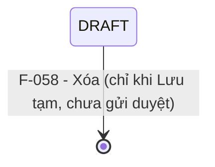

# Đặc tả nghiệp vụ: Quản lý Trạm radar - Xóa

**Tài liệu:** BA Feature Brief
**Feature:** F-058
**Module:** M-003 — Quản lý tài sản KCHTGT - Khu nước & VTS
**Người viết:** Business Analyst
**Ngày cập nhật:** 2026-08-07

---

## 1. Tổng quan

### 1.1. Tính năng này làm gì?

Cho phép Admin và Lãnh đạo xóa mềm (soft delete) một Trạm radar khỏi danh sách hoạt động. Trạm radar bị xóa **không bị xóa vật lý** — dữ liệu vẫn tồn tại trong CSDL để phục vụ kiểm toán và truy vết.

### 1.2. Luồng hoạt động chính

1. Người dùng (Admin/Lãnh đạo) chọn "Xóa" trên dòng trạm radar trong danh sách.
2. Hệ thống hiển thị hộp thoại xác nhận kèm thông tin trạm radar và cảnh báo.
3. Hệ thống kiểm tra ràng buộc dữ liệu liên quan.
4. Nếu có dữ liệu liên quan → chặn xóa, hiển thị cảnh báo chi tiết.
5. Nếu không → người dùng xác nhận → `DELETE /api/v1/radar-station/:id`.
6. Backend set `isDeleted = true`, `deletedBy = current_user` → trạm radar biến mất khỏi danh sách.

---

## 2. Khác biệt so với các tính năng khác

### 2.1. Xóa mềm (soft delete)

- **Không xóa vật lý** bản ghi khỏi database.
- Chỉ set `isDeleted = true`, `deletedBy = current_user`.
- Trạm radar bị xóa **không còn hiển thị** ở bất kỳ đâu trong hệ thống (danh sách, chi tiết, dropdown...).

### 2.2. Chỉ xóa được khi ở trạng thái Lưu tạm

| Trạng thái | Được xóa? | Lý do |
|---|---|---|
| DRAFT (Lưu tạm, chưa gửi duyệt) | ✅ Có | Trạm radar chưa được gửi duyệt, chưa có dữ liệu liên quan |
| PENDING_APPROVAL (Chờ Cảng vụ/Chi cục duyệt) | ❌ Không | Đã gửi duyệt, không thể xóa |
| APPROVED_LEVEL1 (Chờ Cục duyệt) | ❌ Không | Đang trong quy trình phê duyệt |
| APPROVED | ❌ Không | Đã được duyệt, có thể đã có dữ liệu liên quan |
| REJECTED_LEVEL1 / REJECTED_LEVEL2 | ❌ Không | Cần sửa và gửi duyệt lại, không xóa |

### 2.3. Kiểm tra ràng buộc trước khi xóa

| Ràng buộc | Xử lý |
|---|---|
| Trạm radar **đang có dữ liệu liên quan** (tài sản, vận hành, bảo trì, sự cố) | ⛔ **Chặn xóa** — hiển thị danh sách dữ liệu liên quan, yêu cầu xử lý trước |
| Trạm radar **đã bị xóa** (`isDeleted = true`) | ⛔ **Chặn xóa** — thông báo "Trạm radar đã bị xóa trước đó" |
| Trạm radar **không có dữ liệu liên quan** | ✅ Cho phép xóa sau khi xác nhận |

### 2.4. Dữ liệu liên quan không tự động xóa cascade

> ⚠ **Quan trọng:** Nếu xóa trạm radar, toàn bộ dữ liệu liên quan (tài sản, vận hành, bảo trì) **không tự động xóa** — cần xử lý riêng. Dev phải kiểm tra ràng buộc dữ liệu trước khi cho phép xóa.

---

## 3. Quy tắc nghiệp vụ

**BR-058-01 — Chỉ Admin và Lãnh đạo mới được xóa:** Nút "Xóa" chỉ hiển thị cho vai trò Admin và Lãnh đạo. Backend kiểm tra quyền trước khi thực hiện DELETE.

**BR-058-02 — Chỉ xóa được ở trạng thái Lưu tạm:** Chỉ trạm radar ở trạng thái `DRAFT` (Lưu tạm) và chưa được gửi duyệt mới có thể bị xóa. Trạm radar đã gửi duyệt, đang xem xét, đã duyệt, hoặc bị từ chối không được phép xóa.

**BR-058-03 — Xóa mềm, không xóa vật lý:** Xóa trạm radar là soft delete (`isDeleted` được set). Bản ghi vẫn tồn tại trong database để phục vụ kiểm toán, nhưng không hiển thị ở bất kỳ đâu trong hệ thống.

**BR-058-04 — Kiểm tra dữ liệu liên quan trước khi xóa:** Nếu trạm radar đang có dữ liệu liên quan (tài sản, vận hành, bảo trì, sự cố) chưa được xử lý, hệ thống chặn xóa và hiển thị cảnh báo chi tiết.

**BR-058-05 — Không tự động xóa cascade:** Xóa trạm radar không tự động xóa dữ liệu liên quan. Người dùng phải xử lý hoặc di chuyển dữ liệu liên quan trước khi xóa trạm radar.

**BR-058-06 — Ghi nhật ký xóa:** Mọi thao tác xóa đều tạo bản ghi `ApprovalHistory` ghi nhận hành động xóa.

---

## 4. Vòng đời & liên kết

> Trạm radar chỉ có thể bị xóa khi đang ở trạng thái `DRAFT` (Lưu tạm) và chưa được gửi duyệt. Các trạng thái khác (đã gửi duyệt, đang xem xét, đã duyệt, từ chối) không cho phép xóa.

### Các tính năng liên quan

| Feature | Liên kết |
|---|---|
| **F-061** | Lịch sử — ghi nhận thao tác xóa |
| **F-060** | Danh sách — trạm radar bị xóa không hiển thị (filter `isDeleted = false`) |

---

## 5. API Endpoints

| Method | Endpoint | Mô tả | Phân quyền |
|---|---|---|---|
| DELETE | `/api/v1/radar-station/:id` | Xóa mềm trạm radar (set isDeleted = true) | Admin, Lãnh đạo |

---

## 6. Yêu cầu giao diện người dùng

### 6.1. Hộp thoại xác nhận xóa

Hiển thị khi người dùng click "Xóa" từ danh sách:

1. **Thông tin trạm radar:** Mã radar, Tên, Loại, Trạng thái hiện tại.
2. **Cảnh báo:** "Hành động này sẽ xóa trạm radar khỏi danh sách hoạt động. Dữ liệu vẫn được lưu trữ để phục vụ kiểm toán."
3. **Nếu có dữ liệu liên quan:** Hiển thị danh sách các module đang tham chiếu đến trạm radar này, kèm thông báo "Vui lòng xử lý dữ liệu liên quan trước khi xóa."
4. **Xác nhận:** Người dùng phải nhập tên trạm radar vào ô xác nhận trước khi nút "Xóa" được kích hoạt.
5. **Nút hành động:**
   - Nút **"Xóa"** (đỏ, pill) — Chỉ enabled sau khi nhập đúng tên trạm radar
   - Nút **"Hủy"** (textSecondary, pill outline) — Đóng hộp thoại

### 6.2. Sau khi xóa

- Toast: "Xóa trạm radar thành công".
- Danh sách tự động làm mới, trạm radar không còn hiển thị.
- Nếu đang ở trang chi tiết F-060 → redirect về danh sách.
