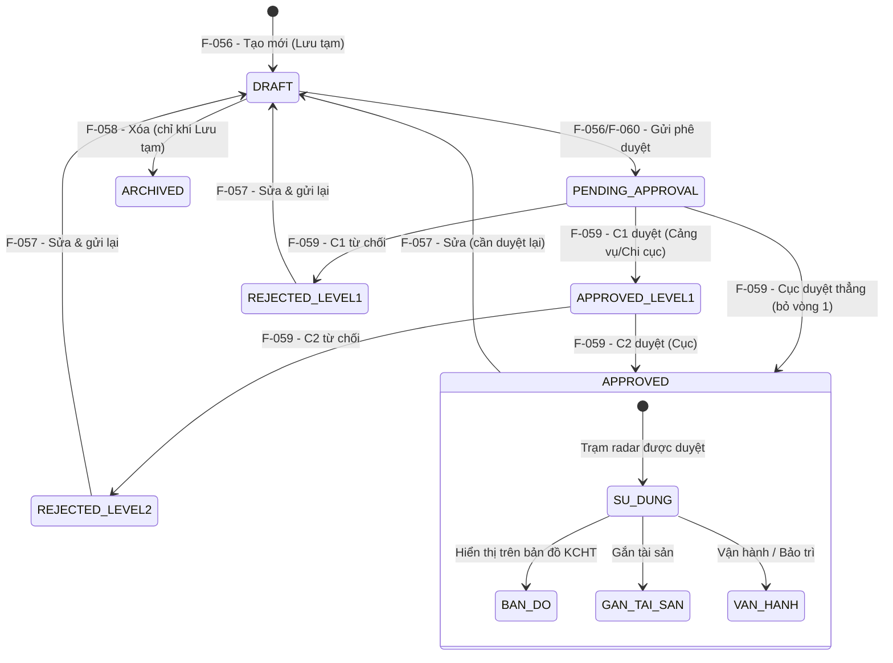

# Đặc tả nghiệp vụ: Quản lý Trạm radar - Danh sách & Xem chi tiết

> **Consolidation Note:** Feature này là điểm hợp nhất của brief UI **F-068 (Danh sách Trạm radar)** vào brief BE **F-060 (Xem chi tiết Trạm radar)** — F-060 nay giữ cả **màn hình danh sách (màn hình trung tâm)** và **màn hình chi tiết** của nhóm Trạm radar. Toàn bộ trạng thái phê duyệt được chuẩn hóa theo **7 trạng thái** của `docs/conventions/approval-2-level-spec.md` mục 3.1 (DRAFT / PENDING_APPROVAL / APPROVED_LEVEL1 / REJECTED_LEVEL1 / REJECTED_LEVEL2 / APPROVED / ARCHIVED); không còn dùng các trạng thái legacy (đề xuất/đang xem xét/từ chối cũ). Chi tiết merge xem `ba/00-ui-be-merge-report.md`.

**Tài liệu:** BA Feature Brief
**Feature:** F-060
**Module:** M-003 — Quản lý tài sản KCHTGT - Khu nước & VTS
**Người viết:** Business Analyst
**Ngày cập nhật:** 2026-08-23

---

## 1. Tổng quan

### 1.1. Tính năng này làm gì?

Giao diện **danh sách Trạm radar** hiển thị toàn bộ các trạm radar thuộc phạm vi quản lý của người dùng, kèm khả năng tìm kiếm nhanh, lọc theo nhiều tiêu chí, phân trang và sắp xếp. Đây là **màn hình trung tâm** của module Trạm radar: từ đây người dùng điều hướng đến toàn bộ các thao tác khác — xem chi tiết, tạo mới, chỉnh sửa, phê duyệt, xóa và xem lịch sử thay đổi. Từ danh sách, người dùng click vào một trạm radar để mở **trang chi tiết** — hiển thị toàn bộ thông tin kỹ thuật, trạng thái phê duyệt, tọa độ GIS, file đính kèm và các hành động khả dụng theo vai trò; trang chi tiết ở chế độ read-only, mọi chỉnh sửa thực hiện qua F-057 (Cập nhật Trạm radar). Nghiệp vụ tham khảo từ màn hình QLKC_060 (Quản lý trạm radar) của hệ thống tham chiếu.

### 1.2. Tại sao cần tính năng này?

Trạm radar là thiết bị đầu cuối trong hệ thống VTS, có vai trò quét và giám sát giao thông tàu thuyền. Cán bộ quản lý tài sản và lãnh đạo cần một giao diện duy nhất để nắm bắt nhanh chóng trạm radar nào đang hoạt động, trạm nào đang chờ phê duyệt, và trạm nào cần xử lý gấp — từ đó hỗ trợ ra quyết định vận hành, phân bổ nguồn lực và giám sát tuân thủ quy trình phê duyệt theo quy định quản lý nhà nước về hàng hải.

### 1.3. Luồng hoạt động chính

1. Người dùng vào menu **Quản lý KCHTGT > Khu nước & VTS > Trạm radar**, hệ thống hiển thị danh sách trạm radar thuộc đơn vị mình.
2. Người dùng tìm kiếm nhanh, chọn bộ lọc hoặc chuyển tab trạng thái để thu hẹp danh sách theo nhu cầu.
3. Người dùng chọn một dòng để xem chi tiết, chỉnh sửa, xóa, phê duyệt hoặc xem lịch sử, tùy theo quyền và trạng thái của trạm radar đó.
4. Khi click vào mã/tên trạm radar hoặc nút "Xem", hệ thống gọi `GET /api/v1/radar-station/:id` để lấy toàn bộ thông tin chi tiết (JOIN VtsSystem) và hiển thị trang chi tiết.
5. Trên trang chi tiết, người dùng thực hiện các hành động theo vai trò: tải file đính kèm, phê duyệt/từ chối (khi trạng thái phù hợp), chỉnh sửa (F-057), xem lịch sử (F-061), xem vị trí trên bản đồ.
6. Breadcrumb: Trang chủ > Khu nước & VTS > Quản lý Trạm radar > [tên trạm radar].

---

## 2. Ai dùng? Dùng như thế nào?

Quyền thao tác và xem tính năng được áp dụng theo hệ thống phân quyền tập trung của hệ thống. Mỗi vai trò người dùng sẽ có phạm vi truy cập và thao tác khác nhau trên tính năng này, được kiểm soát bởi cơ chế RBAC (Role-Based Access Control).

### 2.1. Logic phân quyền chung

Các thao tác trong tính năng được bảo vệ bởi các quyền (permissions) tương ứng. Người dùng chỉ có thể thực hiện những thao tác mà vai trò của họ được cấp quyền (tại tính năng phân quyền). Danh sách luôn được lọc theo `orgUnitId` của người dùng đăng nhập — người dùng không thấy trạm radar ngoài phạm vi đơn vị mình, trừ Admin Cục.

### 2.2. Logic phân quyền đặc biệt cho tài khoản Admin Cục

Đối với tài khoản **Admin Cục**, áp dụng logic phân quyền đặc biệt sau:

- **Xem full dữ liệu:** Admin Cục có quyền xem toàn bộ dữ liệu trên hệ thống, không giới hạn phạm vi đơn vị hay khu vực.
- **Xem thông tin người chỉnh sửa:** Với mỗi bản ghi, Admin Cục thấy được thông tin người chỉnh sửa cuối cùng (họ tên, tên đăng nhập).
- **Xem thời gian cập nhật:** Admin Cục thấy được thời gian cập nhật cuối cùng của dữ liệu (timestamp).
- **Xem người tạo mới:** Admin Cục thấy được thông tin người tạo mới bản ghi (họ tên, tên đăng nhập).
- **Xem thời gian tạo mới:** Admin Cục thấy được thời gian tạo mới dữ liệu (timestamp).

> **Ghi chú:** Các trường `người tạo mới`, `thời gian tạo mới`, `người chỉnh sửa`, `thời gian cập nhật` chỉ hiển thị đối với tài khoản Admin Cục. Với các vai trò khác, các trường này bị ẩn khỏi giao diện.

---

## 3. User Stories

### Mức Must (bắt buộc có)

- **US-068-01:** Là Chuyên viên, tôi muốn xem toàn bộ danh sách Trạm radar thuộc đơn vị mình để nắm được hiện trạng tài sản.
- **US-068-02:** Là Chuyên viên, tôi muốn tìm kiếm nhanh theo tên trạm radar để tra cứu một bản ghi cụ thể mà không cần cuộn qua toàn bộ danh sách.
- **US-068-03:** Là Chuyên viên, tôi muốn lọc theo Hệ thống VTS, Địa điểm và Tình trạng để thu hẹp danh sách theo nhu cầu công việc.
- **US-068-04:** Là Lãnh đạo, tôi muốn thấy ngay các trạm radar đang "Chờ duyệt" qua tab trạng thái để xử lý phê duyệt kịp thời.
- **US-068-05:** Là người dùng bất kỳ, tôi muốn click vào một dòng để xem chi tiết trạm radar đó.
- **US-060-01:** Là Chuyên viên, tôi muốn xem toàn bộ thông tin chi tiết của một trạm radar để nắm được tình trạng hiện tại.
- **US-060-02:** Là Lãnh đạo, tôi muốn xem chi tiết trạm radar và thực hiện phê duyệt/từ chối ngay trên trang chi tiết để tiết kiệm thời gian.
- **US-060-03:** Là Chuyên viên, tôi muốn xem vị trí trạm radar trên bản đồ để kiểm tra tọa độ GIS.

### Mức Should (nên có)

- **US-068-06:** Là Chuyên viên, tôi muốn chuyển đến màn hình chỉnh sửa hoặc xóa trực tiếp từ danh sách để không phải qua trang chi tiết trước.
- **US-068-07:** Là Chuyên viên, tôi muốn xem lịch sử thay đổi của một trạm radar ngay từ danh sách.
- **US-068-08:** Là người dùng, tôi muốn đổi số bản ghi hiển thị mỗi trang (20/100) và đổi hướng sắp xếp theo nhu cầu.
- **US-060-04:** Là Chuyên viên, tôi muốn tải xuống các file đính kèm của trạm radar để phục vụ công tác kiểm tra.
- **US-060-05:** Là Chuyên viên, tôi muốn xem lịch sử thay đổi của trạm radar ngay từ trang chi tiết để biết ai đã thay đổi gì và khi nào.
- **US-060-06:** Là người dùng, tôi muốn có breadcrumb điều hướng rõ ràng để dễ dàng quay lại danh sách.

### Mức Could (có thể có sau)

- **US-068-09:** Là người dùng, tôi muốn điều hướng toàn bộ danh sách chỉ bằng bàn phím (Tab/Enter) mà không cần dùng chuột.
- **US-060-07:** Là người dùng, tôi muốn xem trước (preview) file ảnh trực tiếp trên trang chi tiết thay vì phải tải xuống.

---

## 4. Yêu cầu chức năng (Acceptance Criteria)

**AC-068-01 — Hiển thị danh sách mặc định:** Khi mở màn hình, hệ thống gọi `GET /api/v1/radar-station?page=1&pageSize=20&sortBy=updatedDate&sortOrder=DESC` giới hạn theo `orgUnitId` của người dùng, và hiển thị tối đa 20 bản ghi/trang. Nếu API lỗi, hiển thị cảnh báo đỏ kèm nút "Thử lại".

**AC-068-02 — Phân trang tùy chọn:** Người dùng chọn 20 hoặc 100 bản ghi/trang từ dropdown; bảng tải lại đúng số lượng đã chọn và giữ nguyên các bộ lọc đang áp dụng.

**AC-068-03 — Tìm kiếm nhanh:** Người dùng nhập từ khóa vào ô tìm kiếm (khớp `stationName` hoặc `code`, dạng substring, không phân biệt hoa/thường) và nhấn Enter hoặc chờ debounce 400ms; hệ thống hiển thị kết quả khớp trong vòng 500ms. Nếu không có kết quả, hiển thị trạng thái rỗng (mục 11.7).

**AC-068-04 — Lọc theo Hệ thống VTS:** Dropdown "Thuộc hệ thống VTS" hiển thị các VTS đã được phê duyệt (`APPROVED`), filter theo `orgUnitId`. Chọn một giá trị sẽ lọc bảng chỉ còn trạm radar thuộc hệ thống VTS đó.

**AC-068-05 — Lọc theo Địa điểm:** Dropdown Địa điểm liệt kê các Tỉnh/Thành phố (danh mục `DON_VI_HANH_CHINH`) đang có trạm radar; chọn một giá trị sẽ lọc bảng chỉ còn trạm radar thuộc địa điểm đó.

**AC-068-06 — Lọc theo Tình trạng:** Dropdown "Tình trạng" gồm "Tất cả", "Chưa khai thác/vận hành", "Đang khai thác/vận hành", "Dừng khai thác/vận hành". Chọn một giá trị lọc bảng tương ứng.

**AC-068-07 — Tab trạng thái phê duyệt:** 5 tab "Tất cả / Lưu tạm / Chờ duyệt / Đã duyệt / Bị trả về" mỗi tab hiển thị số lượng bản ghi tương ứng; chuyển tab lọc lại danh sách theo `approvalStatus` mà không mất các bộ lọc khác đang áp dụng.

**AC-068-08 — Cột hiển thị đầy đủ:** Mỗi dòng hiển thị đúng các cột mô tả tại mục 9.2: STT, Mã radar, Tên trạm radar, Đơn vị quản lý, Thuộc cảng biển, Thuộc hệ thống VTS, Thuộc trung tâm điều hành VTS, Đơn vị khai thác, Địa điểm, Đơn vị tính, Số lượng, Tình trạng, Trạng thái phê duyệt, Ngày cập nhật, Cán bộ cập nhật, Thao tác.

**AC-068-09 — Xem chi tiết:** Click vào mã hoặc tên trạm radar (hoặc nút "Xem") điều hướng đến màn hình xem chi tiết (mục 9.1 của tài liệu này) với đúng `id` của dòng được chọn.

**AC-068-10 — Chỉnh sửa:** Nút "Chỉnh sửa" chỉ hiển thị cho Admin hoặc Chuyên viên thuộc đúng `orgUnitId` với trạm radar; click điều hướng đến màn hình chỉnh sửa (F-057) với form được điền sẵn dữ liệu.

**AC-068-11 — Xóa:** Nút "Xóa" chỉ hiển thị khi `approvalStatus = DRAFT` (Lưu tạm, chưa gửi duyệt); click mở hộp thoại xác nhận trước khi gọi `DELETE /api/v1/radar-station/:id`. Nếu trạm radar đang có dữ liệu liên quan, hệ thống chặn xóa và hiển thị cảnh báo.

**AC-068-12 — Phê duyệt:** Nút "Phê duyệt" chỉ hiển thị cho Lãnh đạo/Admin khi `approvalStatus = PENDING_APPROVAL` (C1) hoặc `APPROVED_LEVEL1` (C2); click điều hướng đến màn hình phê duyệt (F-059).

**AC-068-13 — Lịch sử:** Nút "Lịch sử" luôn hiển thị cho mọi vai trò có quyền xem; click điều hướng đến màn hình lịch sử thay đổi (F-061) của trạm radar được chọn.

**AC-068-14 — Trạm radar đã xóa không hiển thị:** Trạm radar ở trạng thái `ARCHIVED` (đã xóa lịch sử) không xuất hiện trong danh sách chính ở bất kỳ bộ lọc nào (chỉ có thể tra cứu lại qua màn hình Lịch sử).

**AC-060-01 — Hiển thị đầy đủ thông tin:** Trang chi tiết hiển thị tất cả các trường của entity RadarStation: mã radar, tên trạm, đơn vị quản lý, cảng biển, hệ thống VTS (tên + link), trung tâm điều hành VTS, đơn vị khai thác, địa điểm, địa điểm chi tiết, đơn vị tính, số lượng, tình trạng, chiều cao tháp, tầm hiệu lực, ghi chú, trạng thái phê duyệt, tọa độ GIS. Nếu API trả về lỗi, hiển thị thông báo lỗi và nút "Thử lại".

**AC-060-02 — Link đến Hệ thống VTS:** Trường `vtsSystemId` hiển thị dưới dạng tên hệ thống VTS kèm hyperlink trỏ đến trang chi tiết VtsSystem. Nếu hệ thống VTS không tồn tại hoặc đã bị xóa, hiển thị tên kèm cảnh báo "(không khả dụng)".

**AC-060-03 — Badge trạng thái:** Trạng thái phê duyệt được hiển thị dưới dạng badge có màu sắc phân biệt theo 7 trạng thái chuẩn:
- `DRAFT`: xám
- `PENDING_APPROVAL`: vàng
- `APPROVED_LEVEL1`: xanh dương nhạt
- `REJECTED_LEVEL1`: đỏ
- `REJECTED_LEVEL2`: đỏ
- `APPROVED`: xanh lá
- `ARCHIVED`: xám (không hiển thị trên màn chi tiết hoạt động)

**AC-060-04 — Danh sách file đính kèm:** Danh sách tệp đính kèm hiển thị tên file, kích thước, loại file và ngày upload. Mỗi file có nút "Tải xuống". Nếu không có file đính kèm, hiển thị "Không có file đính kèm".

**AC-060-05 — Hành động theo trạng thái:** Các nút hành động hiển thị động theo trạng thái trạm radar:
- Khi `PENDING_APPROVAL` và người dùng là Lãnh đạo/Admin: hiển thị "Phê duyệt C1"
- Khi `APPROVED_LEVEL1` và người dùng là Lãnh đạo Cục/Admin: hiển thị "Phê duyệt C2" + "Từ chối"
- Khi `APPROVED`: ẩn nút phê duyệt/từ chối, hiển thị "Chỉnh sửa" (nếu có quyền)
- Khi `REJECTED_LEVEL1`/`REJECTED_LEVEL2`: ẩn nút phê duyệt/từ chối, hiển thị "Chỉnh sửa" (nếu có quyền)

**AC-060-06 — Nút xem vị trí trên bản đồ:** Khi trạm radar có tọa độ GIS, hiển thị nút "Xem vị trí". Click mở modal bản đồ hiển thị tọa độ. Nếu không có tọa độ, nút bị ẩn.

**AC-060-07 — Breadcrumb điều hướng:** Breadcrumb hiển thị: Trang chủ > Khu nước & VTS > Quản lý Trạm radar > [tên trạm radar]. Click "Quản lý Trạm radar" quay lại danh sách.

**AC-060-08 — Metadata cho Admin Cục:** Admin Cục thấy được thông tin người tạo, thời gian tạo, người chỉnh sửa, thời gian cập nhật. Với các vai trò khác, các trường này bị ẩn.

---

## 5. Quy tắc nghiệp vụ (Business Rules)

**BR-068-01 — Phân trang mặc định:** Danh sách hiển thị mặc định 20 bản ghi/trang, có thể đổi sang 100 bản ghi/trang. Không hỗ trợ hiển thị "tất cả" trong một trang.

**BR-068-02 — Sắp xếp mặc định:** Danh sách sắp xếp mặc định theo `updatedDate` giảm dần (bản ghi thay đổi gần nhất lên đầu). Người dùng có thể đổi hướng sắp xếp nhưng không đổi được cột sắp xếp.

**BR-068-03 — Phạm vi dữ liệu theo đơn vị quản lý:** Người dùng chỉ thấy trạm radar thuộc `orgUnitId` của mình. Admin Cục xem được toàn bộ hệ thống và có thể chọn lọc theo đơn vị bất kỳ (mục 2.2).

**BR-068-04 — Tìm kiếm khớp trên nhiều trường:** Từ khóa tìm kiếm được áp dụng đồng thời trên `stationName` và `code` theo kiểu OR — trả về bản ghi khớp ở bất kỳ trường nào.

**BR-068-05 — Lọc theo Hệ thống VTS:** Dropdown "Thuộc hệ thống VTS" chỉ hiển thị VTS ở trạng thái `APPROVED`, filter theo `orgUnitId`.

**BR-068-06 — Ẩn dữ liệu đã xóa:** Trạm radar ở trạng thái `ARCHIVED` (đã xóa lịch sử) bị loại khỏi mọi truy vấn danh sách, không phân biệt bộ lọc đang áp dụng.

**BR-068-07 — Điều kiện hiển thị nút Xóa:** Nút "Xóa" chỉ hiển thị khi đồng thời: (1) `approvalStatus = DRAFT` (Lưu tạm, chưa gửi duyệt), (2) người dùng thuộc đúng `orgUnitId` hoặc có vai trò Admin/Lãnh đạo.

**BR-068-08 — Điều kiện hiển thị nút Phê duyệt:** Nút "Phê duyệt" chỉ hiển thị cho vai trò Lãnh đạo hoặc Admin, và chỉ khi `approvalStatus = PENDING_APPROVAL` (C1) hoặc `APPROVED_LEVEL1` (C2).

**BR-068-09 — Điều kiện hiển thị nút Chỉnh sửa:** Nút "Chỉnh sửa" hiển thị cho Admin hoặc Chuyên viên thuộc đúng đơn vị quản lý với trạm radar, ở mọi trạng thái phê duyệt (kể cả `APPROVED`) — vì sửa một trạm radar đã duyệt sẽ đưa nó quay về `DRAFT` (Lưu tạm) để gửi duyệt lại.

**BR-060-01 — Xem được ở mọi trạng thái:** Trạm radar ở bất kỳ trạng thái nào (DRAFT, PENDING_APPROVAL, APPROVED_LEVEL1, REJECTED_LEVEL1, REJECTED_LEVEL2, APPROVED, ARCHIVED) đều có thể xem chi tiết. Trang chi tiết luôn hiển thị trạng thái hiện tại.

**BR-060-02 — Dữ liệu read-only:** Trang chi tiết là chế độ xem (read-only). Mọi chỉnh sửa phải thực hiện qua F-057 (Cập nhật Trạm radar).

**BR-060-03 — Phê duyệt từ trang chi tiết:** Lãnh đạo/Admin có thể phê duyệt hoặc từ chối trạm radar ngay từ trang chi tiết khi trạng thái phù hợp. Hành động này chuyển hướng đến F-059.

**BR-060-04 — Link Hệ thống VTS:** Hệ thống VTS hiển thị dưới dạng hyperlink. Nếu hệ thống VTS đã bị xóa hoặc không còn hoạt động, hiển thị cảnh báo nhưng vẫn cho phép xem thông tin trạm radar.

**BR-060-05 — Dữ liệu làm mới tự động:** Thông tin hiển thị trên trang chi tiết được làm mới mỗi khi người dùng truy cập, đảm bảo luôn hiển thị dữ liệu mới nhất.

**BR-060-06 — Cảnh báo trạng thái:** Nếu trạm radar chưa được phê duyệt (DRAFT, PENDING_APPROVAL, APPROVED_LEVEL1, REJECTED_LEVEL1, REJECTED_LEVEL2), trang chi tiết hiển thị cảnh báo "Trạm radar chưa được phê duyệt, không khả dụng trong các module khác". Nếu APPROVED, hiển thị "Trạm radar đã được phê duyệt, đang khả dụng".

---

## 6. Vòng đời và liên kết

> ⚠ **QUAN TRỌNG CHO DEVELOPER:** Màn hình Danh sách Trạm radar (mục 9.2) là **màn hình trung tâm** của module Trạm radar — mọi tính năng khác trong nhóm đều xuất phát từ hoặc quay trở lại danh sách này. Trang Xem chi tiết (mục 9.1) là điểm xem thông tin chi tiết và điều hướng đến các tính năng khác.

### 6.1. Vòng đời trạm radar (7 trạng thái chuẩn)



### 6.2. Trạng thái hiển thị trên danh sách

| Trạng thái | Mã | Badge màu | Xuất hiện trong danh sách? |
|---|---|---|---|
| Lưu tạm | DRAFT | Xám | ✅ Có |
| Chờ Cảng vụ/Chi cục duyệt | PENDING_APPROVAL | Vàng | ✅ Có |
| Chờ Cục duyệt | APPROVED_LEVEL1 | Xanh dương nhạt | ✅ Có |
| Bị Cảng vụ/Chi cục trả về | REJECTED_LEVEL1 | Đỏ | ✅ Có |
| Bị Cục trả về | REJECTED_LEVEL2 | Đỏ | ✅ Có |
| Đã duyệt | APPROVED | Xanh lá | ✅ Có |
| Đã xóa (lịch sử) | ARCHIVED | — | ❌ Không |

### 6.3. Các tính năng liên quan trực tiếp

| Tên tính năng | Mối liên kết với Danh sách Trạm radar |
|---|---|
| Xem chi tiết (mục 9.1) | Click mã/tên hoặc nút "Xem" từ danh sách để mở |
| Tạo mới (F-056) | Nút "Tạo mới" trên thanh công cụ của danh sách; sau khi tạo xong quay lại danh sách |
| Cập nhật (F-057) | Nút "Chỉnh sửa" trên mỗi dòng; chỉ hiện theo BR-068-09 |
| Phê duyệt (F-059) | Nút "Phê duyệt" trên mỗi dòng; chỉ hiện theo BR-068-08 |
| Xóa (F-058) | Nút "Xóa" trên mỗi dòng; chỉ hiện theo BR-068-07 |
| Lịch sử (F-061) | Nút "Lịch sử" trên mỗi dòng, luôn hiển thị |

### 6.4. Module cha (trạm radar là con)

Trạm radar luôn thuộc về một Hệ thống VTS. Hệ thống VTS thuộc về một Đơn vị quản lý. Bộ lọc "Thuộc hệ thống VTS" phản ánh đúng thứ tự phân cấp này:

```markmap
- Đơn vị quản lý
  - Hệ thống VTS (F-062) — phải có ĐVQL và được duyệt
    - Trạm radar — phải có VTS cha đã duyệt, hiển thị trong danh sách
```

---

## 7. Mô hình dữ liệu

Tính năng này chỉ đọc dữ liệu (read-only), không tạo hay sửa bảng. Các bảng được truy vấn để phục vụ hiển thị danh sách và chi tiết:

### 7.1. Bảng `radar_station` — Thông tin Trạm radar

Các trường được truy vấn để hiển thị trên bảng danh sách và trang chi tiết:

- **id:** UUID, định danh bản ghi
- **code:** VARCHAR(50), mã radar (RADAR-{seq}) — hiển thị cột "Mã radar"
- **stationName:** VARCHAR(255), tên trạm radar — hiển thị cột "Tên trạm radar", có thể click để mở màn hình xem chi tiết
- **orgUnitId:** UUID, đơn vị quản lý — dùng để giới hạn phạm vi dữ liệu hiển thị
- **cangBienId:** UUID, khóa ngoại đến cảng biển — dùng cho cột "Thuộc cảng biển" và bộ lọc
- **vtsSystemId:** UUID, khóa ngoại đến vts_system — dùng cho cột "Thuộc hệ thống VTS" và bộ lọc
- **ttdhVtsId:** UUID, khóa ngoại đến trung tâm điều hành VTS — dùng cho cột "Thuộc trung tâm điều hành VTS" và bộ lọc
- **donViKhaiThacId:** UUID, đơn vị khai thác — dùng cho cột "Đơn vị khai thác" và bộ lọc
- **provinceId:** UUID, địa điểm (Tỉnh/Thành phố) — dùng cho cột và bộ lọc "Địa điểm"
- **conditionStatus:** VARCHAR(50), tình trạng — badge cột "Tình trạng", dùng cho bộ lọc
- **approvalStatus:** trạng thái phê duyệt (7 trạng thái chuẩn, lưu dạng số nguyên, map enum `ApprovalStatus`) — badge cột "Trạng thái phê duyệt", dùng cho tab lọc
- **updatedDate:** timestamp — hiển thị cột "Ngày cập nhật", dùng làm khóa sắp xếp mặc định
- **isDeleted:** boolean — bản ghi có giá trị true (tương ứng trạng thái `ARCHIVED`) bị loại khỏi mọi kết quả danh sách (BR-068-06)
- **createdBy, createdDate, updatedBy:** chỉ truy vấn và hiển thị bổ sung khi người dùng là Admin Cục (mục 2.2)

### 7.2. Bảng `vts_system` — Hệ thống VTS (JOIN)

Truy vấn JOIN qua `vtsSystemId` để lấy tên hiển thị ở cột "Thuộc hệ thống VTS", tạo hyperlink trên trang chi tiết, và danh sách dropdown lọc (chỉ lấy VTS ở trạng thái `APPROVED`).

### 7.3. Bảng `radar_station_attachment` — File đính kèm

Truy vấn danh sách file đính kèm theo `radarStationId`. Các trường hiển thị: fileName, fileSize, fileType, ngày upload.

### 7.4. Bảng `approval_history` — Lịch sử phê duyệt

Truy vấn danh sách lịch sử phê duyệt của trạm radar. Gồm: approvalLevel, status, approvedBy, approvedDate, reason.

---

## 8. API Endpoints

Hệ thống cung cấp các API để phục vụ các thao tác liên quan đến tính năng:

| Method | Endpoint | Mô tả | Phân quyền |
|---|---|---|---|
| GET | `/api/v1/radar-station?page=&pageSize=&sortBy=&sortOrder=&search=&orgUnitId=&cangBienId=&vtsSystemId=&ttdhVtsId=&donViKhaiThacId=&provinceId=&conditionStatus=&approvalStatus=&tuNgay=&denNgay=` | Lấy danh sách Trạm radar có phân trang, sắp xếp, tìm kiếm và lọc, giới hạn theo đơn vị quản lý của người dùng | Tất cả người dùng đã đăng nhập |
| GET | `/api/v1/vts-system?approvalStatus=APPROVED` | Lấy danh sách Hệ thống VTS đã duyệt cho dropdown lọc | Tất cả người dùng đã đăng nhập |
| GET | `/api/v1/radar-station/:id` | Lấy toàn bộ thông tin chi tiết trạm radar (JOIN VtsSystem) | Tất cả người dùng đã đăng nhập |
| GET | `/api/v1/radar-station/:id/history` | Lấy lịch sử phê duyệt của trạm radar | Tất cả người dùng đã đăng nhập |
| DELETE | `/api/v1/radar-station/:id` | Xóa mềm trạm radar (chỉ khi DRAFT) — được gọi từ nút "Xóa" trên danh sách | Admin, Lãnh đạo hoặc Chuyên viên cùng đơn vị |

---

## 9. Chi tiết nghiệp vụ từng phần

### 9.1. Trang chi tiết Trạm radar

Trang chi tiết hiển thị toàn bộ thông tin của một trạm radar, được tổ chức thành các nhóm. Màn hình sử dụng chế độ read-only.

#### A. Nhóm Thông tin cơ bản — mở rộng mặc định

| STT | Tên trường | Loại hiển thị | Mô tả |
| --- | --- | --- | --- |
| 1 | Mã radar | Text (read-only) | Hiển thị mã radar (RADAR-{seq}). |
| 2 | Tên trạm radar | Text (read-only) | Hiển thị tên trạm radar. |
| 3 | Đơn vị quản lý | Text (read-only) | Hiển thị tên đơn vị quản lý. |
| 4 | Thuộc cảng biển | Text (read-only) | Hiển thị tên Cảng biển (nếu có). |
| 5 | Thuộc hệ thống VTS | Link (read-only) | Hiển thị tên Hệ thống VTS dưới dạng hyperlink. Nếu VTS đã bị xóa, hiển thị kèm tag "(không khả dụng)". |
| 6 | Thuộc trung tâm điều hành VTS | Text (read-only) | Hiển thị tên Trung tâm điều hành VTS (nếu có). |
| 7 | Đơn vị khai thác | Text (read-only) | Hiển thị tên đơn vị khai thác. |

#### B. Nhóm Thông tin hành chính — mở rộng mặc định

| STT | Tên trường | Loại hiển thị | Mô tả |
| --- | --- | --- | --- |
| 8 | Địa điểm (Tỉnh/Thành phố) | Text (read-only) | Hiển thị tên Tỉnh/Thành phố. |
| 9 | Địa điểm chi tiết | Text (read-only) | Hiển thị địa điểm chi tiết (nếu có). |
| 10 | Đơn vị tính | Text (read-only) | Hiển thị đơn vị tính. |
| 11 | Số lượng | Number (read-only) | Hiển thị số lượng. |
| 12 | Tình trạng | Text (read-only) | Hiển thị: Chưa khai thác/vận hành; Đang khai thác/vận hành; Dừng khai thác/vận hành. |

#### C. Nhóm Thông tin kỹ thuật — mở rộng mặc định

| STT | Tên trường | Loại hiển thị | Mô tả |
| --- | --- | --- | --- |
| 13 | Chiều cao tháp radar | Number (read-only) | Hiển thị kèm đơn vị mét (m). |
| 14 | Tầm hiệu lực radar | Text (read-only) | Hiển thị tầm hiệu lực. |
| 15 | Ghi chú | Text (read-only) | Hiển thị ghi chú (nếu có). |

#### D. Nhóm Trạng thái — mở rộng mặc định

| STT | Tên trường | Loại hiển thị | Mô tả |
| --- | --- | --- | --- |
| 16 | Trạng thái phê duyệt | Badge (read-only) | Badge xám: DRAFT. Badge vàng: PENDING_APPROVAL. Badge xanh dương nhạt: APPROVED_LEVEL1. Badge đỏ: REJECTED_LEVEL1/REJECTED_LEVEL2. Badge xanh lá: APPROVED. |
| 17 | Lý do từ chối | Text (read-only) | Hiển thị khi trạng thái là REJECTED_LEVEL1 hoặc REJECTED_LEVEL2. |

#### E. Nhóm Tọa độ GIS — thu gọn mặc định

| STT | Tên trường | Loại hiển thị | Mô tả |
| --- | --- | --- | --- |
| 21 | Loại đối tượng | Text (read-only) | Hiển thị: POINT / POLYGON. |
| 22 | Biểu tượng | Icon (read-only) | Hiển thị biểu tượng bản đồ. |
| 23 | Hệ quy chiếu | Text (read-only) | Luôn hiển thị WGS_84. |
| 24 | Quy tắc hiển thị | Text (read-only) | Luôn hiển thị Độ/Phút/Giây. |
| 25 | Tọa độ GIS | Table (read-only) | Bảng liệt kê danh sách điểm tọa độ (kinh độ, vĩ độ). |
| 26 | Nút "Xem vị trí" | Button | Mở modal bản đồ hiển thị tọa độ. Chỉ hiển thị khi có dữ liệu tọa độ. |

#### F. Nhóm File đính kèm — mở rộng mặc định

| STT | Tên trường | Loại hiển thị | Mô tả |
| --- | --- | --- | --- |
| 27 | Danh sách file | Table (read-only) | Bảng liệt kê các file đính kèm: tên file, kích thước, loại file, ngày upload. |
| 28 | Nút "Tải xuống" | Button | Tải file về máy. Hiển thị cho tất cả người dùng. |

#### G. Nhóm Metadata — chỉ hiển thị cho Admin Cục

| STT | Tên trường | Loại hiển thị | Mô tả |
| --- | --- | --- | --- |
| 29 | Người tạo | Text (read-only) | Hiển thị họ tên người tạo. |
| 30 | Thời gian tạo | Text (read-only) | Hiển thị ngày giờ tạo (dd/MM/yyyy HH:mm). |
| 31 | Người cập nhật | Text (read-only) | Hiển thị họ tên người cập nhật gần nhất. |
| 32 | Thời gian cập nhật | Text (read-only) | Hiển thị ngày giờ cập nhật gần nhất (dd/MM/yyyy HH:mm). |

#### H. Nhóm Hành động — luôn hiển thị, cố định cuối trang

| STT | Tên trường | Loại hiển thị | Mô tả |
| --- | --- | --- | --- |
| H1 | Nút "Chỉnh sửa" | Button | Chỉnh sửa thông tin trạm radar. Chỉ Admin, Chuyên viên. |
| H2 | Nút "Phê duyệt" | Button | Phê duyệt trạm radar. Chỉ Leader/Admin + trạng thái PENDING_APPROVAL (C1) hoặc APPROVED_LEVEL1 (C2). |
| H3 | Nút "Từ chối" | Button | Từ chối trạm radar. Chỉ Leader/Admin + trạng thái PENDING_APPROVAL (C1) hoặc APPROVED_LEVEL1 (C2). |
| H4 | Nút "Lịch sử" | Button | Xem lịch sử thay đổi của trạm radar. Tất cả người dùng. |

#### I. Tab: Thông tin phê duyệt — thu gọn mặc định

Hiển thị dạng bảng, danh sách các lần phê duyệt của trạm radar:

| Cột | Mô tả |
|---|---|
| Cấp phê duyệt | Cấp 1 (Cảng vụ/Chi cục) hoặc Cấp 2 (Lãnh đạo Cục) |
| Nội dung phê duyệt | Mô tả nội dung phê duyệt (phê duyệt mới, phê duyệt sau sửa, từ chối...) |
| Ngày phê duyệt | Ngày giờ phê duyệt (dd/MM/yyyy HH:mm) |
| Cán bộ phê duyệt | Họ tên cán bộ thực hiện phê duyệt |
| Lý do | Lý do phê duyệt/từ chối (nếu có) |

#### J. Tab: Danh sách kết cấu hạ tầng khác thuộc trạm radar — thu gọn mặc định

Hiển thị dạng bảng kèm Dropdown chọn Loại kết cấu hạ tầng để lọc:

| Cột | Mô tả |
|---|---|
| STT | Số thứ tự |
| Tên kết cấu hạ tầng | Tên của kết cấu hạ tầng thuộc trạm radar |
| Loại kết cấu hạ tầng | Dropdown filter phía trên bảng |
| Thao tác | Nút xem chi tiết kết cấu hạ tầng |

#### K. Tab: Thông tin vận hành khai thác — thu gọn mặc định

Hiển thị dạng bảng:

| Cột | Mô tả |
|---|---|
| Mã kế hoạch | Mã định danh kế hoạch vận hành |
| Tên kế hoạch | Tên kế hoạch vận hành khai thác |
| Ngày bắt đầu | Ngày bắt đầu thực hiện |
| Ngày kết thúc | Ngày kết thúc thực hiện |
| Thao tác | Nút xem chi tiết kế hoạch |

#### L. Tab: Thông tin bảo trì — thu gọn mặc định

Hiển thị dạng bảng:

| Cột | Mô tả |
|---|---|
| Mã kế hoạch | Mã định danh kế hoạch bảo trì |
| Tên kế hoạch | Tên kế hoạch bảo trì |
| Thời gian bắt đầu | Thời điểm bắt đầu bảo trì |
| Thời gian kết thúc | Thời điểm kết thúc bảo trì |
| Thao tác | Nút xem chi tiết kế hoạch |

#### M. Tab: Thông tin sự cố — thu gọn mặc định

Hiển thị dạng bảng:

| Cột | Mô tả |
|---|---|
| Mã sự cố | Mã định danh sự cố |
| Loại sự cố | Phân loại sự cố |
| Địa điểm | Địa điểm xảy ra sự cố |
| Thời gian | Thời điểm xảy ra sự cố |
| Thao tác | Nút xem chi tiết sự cố |

### 9.2. Màn hình Danh sách Trạm radar

#### 9.2.1. Cột hiển thị trên bảng danh sách (16 cột)

| STT | Cột | Nguồn dữ liệu | Loại hiển thị | Ghi chú |
|---|---|---|---|---|
| 1 | STT | Tự động đánh số theo trang | Text | |
| 2 | Mã radar | `code` | Text, click để mở màn hình xem chi tiết | Ẩn mặc định |
| 3 | Tên trạm radar | `stationName` | Text, click để mở màn hình xem chi tiết | |
| 4 | Đơn vị quản lý | `orgUnitId` → tên đơn vị | Text | Ẩn trên mobile |
| 5 | Thuộc cảng biển | `cangBienId` → tên cảng biển | Text | Ẩn trên mobile |
| 6 | Thuộc hệ thống VTS | `vtsSystemId` → `vts_system.name` | Text | |
| 7 | Thuộc trung tâm điều hành VTS | `ttdhVtsId` → tên trung tâm điều hành | Text | |
| 8 | Đơn vị khai thác | `donViKhaiThacId` → tên đơn vị | Text | |
| 9 | Địa điểm | `provinceId` → tên Tỉnh/Thành phố | Text | |
| 10 | Đơn vị tính | `unitOfMeasure` | Text | |
| 11 | Số lượng | `quantity` | Number | |
| 12 | Tình trạng | `conditionStatus` | Badge | Xanh lá: Đang khai thác/vận hành; Vàng: Chưa khai thác/vận hành; Đỏ: Dừng khai thác/vận hành |
| 13 | Trạng thái phê duyệt | `approvalStatus` | Badge | Xám: DRAFT (Lưu tạm); Vàng: PENDING_APPROVAL (Chờ Cảng vụ/Chi cục duyệt); Xanh dương nhạt: APPROVED_LEVEL1 (Chờ Cục duyệt); Đỏ: REJECTED_LEVEL1 / REJECTED_LEVEL2; Xanh lá: APPROVED |
| 14 | Ngày cập nhật | `updatedDate` | Text (dd/MM/yyyy HH:mm) | Khóa sắp xếp mặc định |
| 15 | Cán bộ cập nhật | `updatedBy` → họ tên | Text | Ẩn mặc định |
| 16 | Thao tác | — | Nhóm nút | Xem tại mục 9.2.3 |

#### 9.2.2. Bộ lọc và tìm kiếm

| Field | Loại điều khiển | Mô tả |
|---|---|---|
| Tìm kiếm theo tên, mã radar | Input (debounce 400ms) | Tìm theo `stationName` hoặc `code`, khớp substring không phân biệt hoa/thường |
| Tình trạng | Select | Tất cả / Chưa khai thác/vận hành / Đang khai thác/vận hành / Dừng khai thác/vận hành |
| Đơn vị quản lý | **TreeSelect/Cascader dạng cây** (dựng từ `id`, `name`, `code`, `parentId`; nhãn `MÃ - Tên đơn vị`; tìm kiếm `treeNodeFilterProp="title"`) — chỉ hiển thị/thao tác được cho Admin Cục | Giữ giá trị chọn là `orgUnitId` khi gọi API; người dùng thường bị khóa cố định = đơn vị của mình. Theo `docs/conventions/list-screen-ui-standard.md` |
| Thuộc cảng biển | Select (chỉ cảng biển đã duyệt) | Lọc theo `cangBienId`; filter theo `orgUnitId` |
| Thuộc hệ thống VTS | Select (chỉ VTS đã APPROVED) | Lọc theo `vtsSystemId`; filter theo `orgUnitId`. Khi thay đổi → clear bộ lọc trung tâm điều hành VTS |
| Thuộc trung tâm điều hành VTS | Select (chỉ trung tâm điều hành đã duyệt) | Lọc theo `ttdhVtsId`; filter theo `orgUnitId` + `vtsSystemId` |
| Đơn vị khai thác | Select (danh mục `DON_VI_KHAI_THAC`) | Lọc theo `donViKhaiThacId` |
| Địa điểm (Tỉnh/Thành phố) | Select (danh mục `DON_VI_HANH_CHINH`) | Lọc theo `provinceId` |
| Ngày cập nhật | Date Range Picker (Từ ngày - Đến ngày, max 1 năm) | Lọc theo khoảng `updatedDate` |
| Tab trạng thái phê duyệt | StatusTabs (5 tab, có đếm số lượng) | Tất cả / Lưu tạm / Chờ duyệt / Đã duyệt / Bị trả về |

#### 9.2.3. Hành động trên mỗi dòng (gated theo trạng thái)

| Nút | Điều kiện hiển thị | Hành động |
|---|---|---|
| Xem chi tiết | Luôn hiển thị | Điều hướng đến màn hình xem chi tiết (mục 9.1) với `id` |
| Chỉnh sửa | Admin hoặc Chuyên viên cùng `orgUnitId` (BR-068-09), mọi trạng thái | Điều hướng đến màn hình chỉnh sửa (F-057), form điền sẵn dữ liệu |
| Xóa | `approvalStatus = DRAFT` (Lưu tạm) và chưa gửi duyệt (BR-068-07) | Mở hộp thoại xác nhận → `DELETE /api/v1/radar-station/:id` |
| Phê duyệt | Lãnh đạo/Admin và `approvalStatus = PENDING_APPROVAL` (C1) hoặc `APPROVED_LEVEL1` (C2) (BR-068-08) | Điều hướng đến màn hình phê duyệt (F-059) |
| Lịch sử | Luôn hiển thị | Điều hướng đến màn hình lịch sử thay đổi (F-061) |

#### 9.2.4. Phân trang và sắp xếp

- Mặc định: trang 1, 20 bản ghi/trang, sắp xếp `updatedDate` giảm dần.
- Người dùng có thể đổi số bản ghi/trang (20 hoặc 100) — lựa chọn được giữ nguyên khi chuyển trang hoặc đổi bộ lọc.
- Đổi hướng sắp xếp (tăng/giảm) trên cột `updatedDate` bằng cách click tiêu đề cột.

---

## 10. Yêu cầu phi chức năng

### 10.1. Hiệu năng

- Thời gian tải danh sách lần đầu (20 bản ghi) ≤ 1 giây.
- Thời gian tải trang chi tiết ≤ 1 giây (bao gồm JOIN VtsSystem và attachment).
- Thời gian phản hồi khi áp dụng bộ lọc hoặc tìm kiếm ≤ 500ms.
- Dropdown Hệ thống VTS phản hồi ≤ 300ms.
- Tải file đính kèm ≤ 3 giây cho file tối đa 10MB.

### 10.2. Khả năng mở rộng

- Cấu trúc bộ lọc cho phép bổ sung thêm tiêu chí lọc mà không thay đổi API hiện có.
- Sẵn sàng bổ sung export Excel/PDF trong tương lai.

### 10.3. Bảo mật

- Phân quyền RBAC được áp dụng trên tất cả các API liên quan đến tính năng.
- Mọi request phải kèm JWT token hợp lệ.
- Dữ liệu được lọc theo `orgUnitId` của người dùng ở tầng backend, không phụ thuộc vào tham số gửi từ client.
- Các nút Chỉnh sửa/Xóa/Phê duyệt chỉ hiển thị và chỉ được backend chấp nhận khi đúng vai trò và đúng phạm vi đơn vị.
- Metadata (createdBy, updatedBy) chỉ hiển thị cho Admin Cục.

### 10.4. Độ tin cậy

- Dữ liệu danh sách được làm mới sau mỗi thao tác Xóa/Phê duyệt/Chỉnh sửa thành công để tránh hiển thị trạng thái cũ.
- Trạm radar đã xóa mềm (ARCHIVED) không bao giờ xuất hiện lại trong danh sách chính (BR-068-06).
- Dữ liệu chi tiết được làm mới mỗi khi truy cập trang, không cache; nếu VTS cha bị xóa, vẫn hiển thị được thông tin trạm radar với cảnh báo.

### 10.5. Trải nghiệm người dùng

- Giao diện responsive: trên điện thoại (dưới 768px), thanh menu thu gọn.
- Có loading skeleton khi đang tải dữ liệu.
- Có trạng thái rỗng (empty state) với hướng dẫn thân thiện khi không có kết quả tìm kiếm/lọc.
- Các nhóm thông tin phụ và tab (E, I, J, K, L, M) ở dạng collapsible, mặc định thu gọn; nhóm chính (A, B, C, D, F) mở rộng mặc định.
- Tuân thủ tiêu chuẩn trợ năng WCAG 2.1 AA.

---

## 11. Yêu cầu giao diện người dùng

> **Nguyên tắc cốt lõi:** Mọi giá trị màu sắc, khoảng cách, kích thước chữ trong giao diện đều được định nghĩa tập trung tại 2 file `frontend/src/theme.ts` (layout, màu nền sidebar/header) và `frontend/src/tokens.ts` (màu chữ, màu trạng thái, thang số). Tuyệt đối không hardcode giá trị hex hay pixel trong component.

### 11.1. Bố cục chung

Màn hình dùng chung bố cục toàn hệ thống (`frontend/src/components/AppLayout.tsx`), bao gồm:

- **Thanh menu trái (sidebar):** rộng 272px, nền màu xanh dương đậm `#12468C`. Mục đang chọn được tô màu xanh sáng `#1B84FF`. Khi thu gọn (trên điện thoại), rộng còn 80px và chuyển thành nút hamburger.
- **Thanh tiêu đề trên cùng (header):** cao 64px, nền trắng, chứa tên người dùng và avatar.
- **Vùng nội dung chính:** nền xám nhạt pha xanh `#eaf0f6`, giúp các card trắng bên trong nổi bật hơn.

### 11.2. Hệ thống màu sắc

Mỗi màu sắc trong giao diện được gán một "vai trò" rõ ràng. Developer không được dùng màu theo cảm tính mà phải import đúng token:

| Khi cần... | Dùng token | Màu thực tế |
|---|---|---|
| Tiêu đề trang, số liệu quan trọng | `textPrimary` | `#0c2438` |
| Nhãn field, mô tả | `textSecondary` | `#566a7c` |
| Thời gian, trạng thái phụ, caption | `textTertiary` | `#93a3b3` |
| Nền card, modal, bảng | `surfaceCard` | `#FFFFFF` |
| Nền vùng nội dung chính | `surfacePage` | `#eaf0f6` |
| Viền card, đường kẻ | `borderDefault` | `rgba(11,46,79,0.09)` |
| Nút chính, link | `actionPrimary` | `#0E6FD6` |

### 11.3. Thang số — chỉ dùng giá trị cho phép

**Khoảng cách (spacing):** 4px, 8px, 12px, 16px, 24px, 32px. Trong đó 12px là khoảng cách mặc định giữa các trường trong form (`spaceFormField`), 16px là padding mặc định của card (`spaceMd`).

**Bo góc (radius):** 4px (cho ô textarea), 8px, 12px (cho card), 999px (dạng pill — dùng cho input, select, button).

**Cỡ chữ (font size):** 10px (metadata, caption), 13px (nhãn, nội dung), 15px (tiêu đề card, tiêu đề section), 18px (tiêu đề trang).

**Độ đậm chữ (font weight):** 400 (nội dung), 500 (nhãn, nút), 600 (số liệu quan trọng, tiêu đề).

**Font chữ:** `'Inter', -apple-system, BlinkMacSystemFont, sans-serif` cho toàn bộ văn bản.

> **Cấm tuyệt đối:** spacing 6, 10, 14, 18; radius 6, 7, 10; font-size 12, 14, 16, 24.

### 11.4. Style có sẵn — dùng lại, đừng tự chế

Hệ thống đã định nghĩa sẵn các kiểu dáng phổ biến. Khi cần hiển thị:

- **Thời gian, caption:** dùng `metaStyle` (chữ nhỏ 10px, màu xám nhạt, weight 400)
- **Card nội dung:** dùng `cardStyle` (nền trắng, viền 0.5px, bo góc 12px, padding 16px)
- **Tag trạng thái:** dùng `badgeBaseStyle` (chữ nhỏ, weight 500, padding 2px-8px, pill)
- **Link, nút text:** dùng `actionStyle` (pill, màu actionPrimary, weight 500)
- **Đường kẻ ngăn cách:** dùng `dividerStyle`

### 11.5. Giới hạn màu nhấn — tối đa 3 lần mỗi màn

Màu `actionPrimary` (`#0E6FD6`) là màu nhấn mạnh nhất, dùng cho các hành động chính. Để tránh giao diện bị "rối", màu này chỉ xuất hiện tối đa 3 lần trên toàn bộ màn hình danh sách:

1. Nút "Tạo mới" (hành động chính trên thanh công cụ)
2. Đường gạch chân của tab trạng thái đang chọn (StatusTabs)
3. Link "Xem chi tiết" trên mã/tên trạm radar

Các màu trạng thái (xanh lá cho thành công, vàng cho cảnh báo, đỏ cho lỗi) và màu chữ không tính vào giới hạn này.

### 11.6. Màn hình Chi tiết Trạm radar

1. **ScreenHeader:** breadcrumb "Khu nước & VTS > Quản lý Trạm radar > [tên trạm radar]".

2. **Info card — Thông tin cơ bản & Hành chính:** card trắng, label-value pairs (nhóm A + B).

3. **Info card — Kỹ thuật & Trạng thái:** card trắng, thông số kỹ thuật + badge trạng thái (nhóm C + D).

4. **Collapsible sections:** các nhóm E (Tọa độ GIS), I (Thông tin phê duyệt), J (Kết cấu hạ tầng), K (Vận hành khai thác), L (Bảo trì), M (Sự cố) thu gọn mặc định, mở rộng khi click tiêu đề.

5. **Attachment section:** bảng file đính kèm, mỗi dòng có nút "Tải xuống" (nhóm F).

6. **Action bar:** cố định cuối trang với các nút theo vai trò và trạng thái (nhóm H).

**Badge màu trạng thái (chuẩn 7 trạng thái):**

| Trạng thái | Màu badge |
|---|---|
| DRAFT (Lưu tạm) | Xám |
| PENDING_APPROVAL (Chờ Cảng vụ/Chi cục duyệt) | Vàng `#FAAD14` |
| APPROVED_LEVEL1 (Chờ Cục duyệt) | Xanh dương nhạt `#1890FF` |
| REJECTED_LEVEL1 / REJECTED_LEVEL2 (Bị trả về) | Đỏ `#FF4D4F` |
| APPROVED (Đã duyệt) | Xanh lá `#52C41A` |

**Các trạng thái giao diện (chi tiết):**

- **Đang tải:** skeleton cho toàn bộ card thông tin.
- **Không tìm thấy:** "Trạm radar không tồn tại" + nút quay lại danh sách.
- **Hệ thống VTS không khả dụng:** tên kèm tag "(không khả dụng)".
- **Không có file đính kèm:** "Không có file đính kèm".
- **Không có tọa độ:** ẩn nút "Xem vị trí".

**Giao diện trên điện thoại (chi tiết):** khi màn hình nhỏ hơn 768px — Sidebar thu gọn hamburger 80px, card thông tin xếp dọc toàn màn hình, action bar chuyển thành floating cuối màn hình.

### 11.7. Màn hình Danh sách Trạm radar

Màn hình danh sách sử dụng các component dùng chung toàn hệ thống từ `frontend/src/components/list-view/` — **không được tự tạo lại**:

1. **ScreenHeader:** hiển thị đường dẫn breadcrumb "Khu nước & VTS > Quản lý Trạm radar", kèm nút "Tạo mới" ở góc phải.

2. **FilterTableLayout** (chứa FilterBar + nội dung chính): thanh lọc nằm ngang phía trên bảng gồm ô tìm kiếm nhanh (stationName), dropdown "Thuộc hệ thống VTS", dropdown "Địa điểm", dropdown "Tình trạng", **TreeSelect/Cascader "Đơn vị quản lý" dạng cây** (chỉ Admin Cục thao tác được, giữ giá trị `orgUnitId`), và Date Range Picker ngày cập nhật.

3. **StatusTabs:** 5 tab nằm ngang: **"Tất cả", "Lưu tạm", "Chờ duyệt", "Đã duyệt", "Bị trả về"** (ánh xạ 7 trạng thái chuẩn: DRAFT → Lưu tạm; PENDING_APPROVAL + APPROVED_LEVEL1 → Chờ duyệt; APPROVED → Đã duyệt; REJECTED_LEVEL1 + REJECTED_LEVEL2 → Bị trả về). Mỗi tab hiển thị số lượng bản ghi trong nhóm đó. Tab đang chọn có đường gạch chân màu `actionPrimary`.

4. **DataTable:** bảng dữ liệu với tiêu đề cột cố định khi cuộn (sticky header), dòng được tô sáng khi di chuột qua (hover row). Các cột hiển thị theo mục 9.2.1 (16 cột). Cột thao tác là cột cuối cùng và chỉ cột này được cố định bên phải. Bảng giữ nguyên chiều cao vùng dữ liệu khi rỗng (EmptyState nằm trong thân bảng, thanh cuộn ngang ở đáy).

5. **Pagination:** thanh điều hướng trang ở cuối bảng, hiển thị tổng số dòng, số trang, và dropdown chọn số bản ghi/trang (20/100).

**Bốn trạng thái giao diện bắt buộc:**

- **Đang tải:** hiển thị spinner của Ant Design hoặc khung xương (skeleton) — không hiển thị bảng trống gây hiểu nhầm là không có dữ liệu.
- **Không có dữ liệu (empty):** hiển thị biểu tượng và dòng chữ "Không tìm thấy trạm radar nào phù hợp" với màu chữ `textSecondary` và cỡ chữ `fontSizeMd`, kèm gợi ý "Thử điều chỉnh bộ lọc hoặc tạo mới trạm radar".
- **Lỗi tải dữ liệu (error):** hiển thị cảnh báo đỏ và nút "Thử lại" màu `actionPrimary`.
- **Có dữ liệu (data):** bảng hiển thị đầy đủ 16 cột theo mục 9.2.1.

**Phân quyền hiển thị (role-visibility):**

| Vai trò | Thấy thành phần nào | Ghi chú |
|---|---|---|
| Chuyên viên (cùng đơn vị) | Danh sách của đơn vị mình; nút Xem, Chỉnh sửa, Xóa (khi DRAFT), Lịch sử | Không thấy nút Phê duyệt |
| Lãnh đạo phòng | Danh sách của đơn vị mình; nút Xem, Phê duyệt C1 (khi PENDING_APPROVAL), Lịch sử | Phê duyệt cấp 1 |
| Lãnh đạo Cục | Danh sách của đơn vị mình; nút Xem, Phê duyệt C2 (khi APPROVED_LEVEL1), Lịch sử | Phê duyệt cấp 2 |
| Admin | Danh sách của đơn vị mình; đầy đủ mọi nút hành động | |
| Admin Cục | Toàn bộ danh sách trên hệ thống, không giới hạn đơn vị; thêm dropdown lọc theo đơn vị dạng cây; thêm thông tin người tạo/người sửa/thời gian tạo/thời gian cập nhật | Logic đặc biệt (mục 2.2) |

**Giao diện trên điện thoại (danh sách):** khi màn hình nhỏ hơn 768px:

- Thanh menu trái thu gọn thành nút hamburger 80px.
- Bảng dữ liệu chuyển thành dạng thẻ (card): mỗi trạm radar là một card hiển thị Mã, Tên, Hệ thống VTS, hai badge trạng thái, và nhóm nút hành động thu gọn trong menu "...".
- Thanh lọc (FilterBar) chuyển thành panel có thể gập/mở.
- StatusTabs chuyển thành dropdown chọn trạng thái để tiết kiệm không gian ngang.
- Modal xác nhận xóa thu nhỏ còn 90% chiều rộng màn hình.
