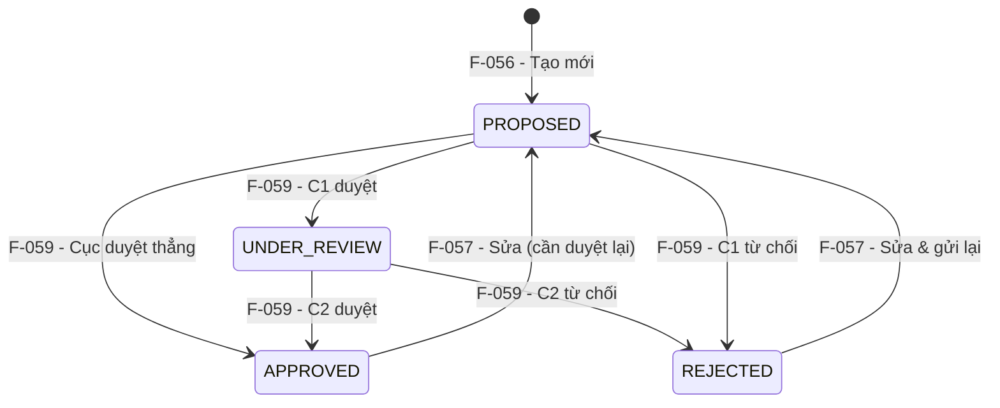

# Đặc tả nghiệp vụ: Quản lý Trạm radar - Xem chi tiết

**Tài liệu:** BA Feature Brief
**Feature:** F-060
**Module:** M-003 — Quản lý tài sản KCHTGT - Khu nước & VTS
**Người viết:** Business Analyst
**Ngày cập nhật:** 2026-08-07

---

## 1. Tổng quan

### 1.1. Tính năng này làm gì?

Trang chi tiết hiển thị toàn bộ thông tin của một Trạm radar cụ thể được chọn từ danh sách, bao gồm dữ liệu kỹ thuật, trạng thái phê duyệt, tọa độ GIS, file đính kèm và các hành động khả dụng theo vai trò. Trang ở chế độ read-only — mọi chỉnh sửa phải thực hiện qua F-057 (Cập nhật Trạm radar).

### 1.2. Tại sao cần tính năng này?

Cung cấp giao diện xem chi tiết để tất cả các bên liên quan — từ chuyên viên kỹ thuật đến lãnh đạo — có thể tiếp cận thông tin chính xác và cập nhật nhất về từng trạm radar. Điều này hỗ trợ ra quyết định trong vận hành VTS, kiểm toán tuân thủ và báo cáo quản lý.

### 1.3. Luồng hoạt động chính

1. Người dùng click vào tên trạm radar trong danh sách.
2. Hệ thống gọi GET `/api/v1/radar-station/:id` để lấy toàn bộ thông tin chi tiết (JOIN VtsSystem).
3. Trang chi tiết hiển thị đầy đủ các nhóm thông tin:
   - Thông tin cơ bản: mã radar, tên trạm, đơn vị quản lý, cảng biển, hệ thống VTS, trung tâm điều hành VTS, đơn vị khai thác
   - Thông tin hành chính: địa điểm, địa điểm chi tiết, đơn vị tính, số lượng, tình trạng
   - Thông tin kỹ thuật: chiều cao tháp, tầm hiệu lực, ghi chú
   - Trạng thái: badge màu cho trạng thái phê duyệt
   - Tọa độ GIS: loại đối tượng, biểu tượng, hệ quy chiếu, quy tắc hiển thị, bảng tọa độ + nút "Xem vị trí" trên bản đồ
   - File đính kèm (nếu có)
   - Metadata: người tạo, thời gian tạo, người cập nhật, thời gian cập nhật (chỉ Admin Cục)
4. Người dùng có thể thực hiện các hành động theo vai trò:
   - Tải xuống file đính kèm
   - Lãnh đạo/Admin: phê duyệt hoặc từ chối trạm radar (khi trạng thái là PROPOSED hoặc UNDER_REVIEW)
   - Chuyên viên: chuyển đến trang chỉnh sửa (F-057)
   - Xem lịch sử thay đổi (F-061)
   - Xem vị trí trên bản đồ
5. Breadcrumb: Trang chủ > Khu nước & VTS > Quản lý Trạm radar > [tên trạm radar].

---

## 2. Ai dùng? Dùng như thế nào?

Quyền thao tác và xem tính năng được áp dụng theo hệ thống phân quyền tập trung của hệ thống. Mỗi vai trò người dùng sẽ có phạm vi truy cập và thao tác khác nhau trên tính năng này, được kiểm soát bởi cơ chế RBAC (Role-Based Access Control).

### 2.1. Logic phân quyền đặc biệt cho tài khoản Admin Cục

Đối với tài khoản **Admin Cục**, áp dụng logic phân quyền đặc biệt sau:

- **Xem full dữ liệu:** Admin Cục có quyền xem toàn bộ dữ liệu trên hệ thống, không giới hạn phạm vi đơn vị hay khu vực.
- **Xem thông tin người chỉnh sửa:** Với mỗi bản ghi, Admin Cục thấy được thông tin người chỉnh sửa cuối cùng (họ tên, tên đăng nhập).
- **Xem thời gian cập nhật:** Admin Cục thấy được thời gian cập nhật cuối cùng của dữ liệu (timestamp).
- **Xem người tạo mới:** Admin Cục thấy được thông tin người tạo mới bản ghi (họ tên, tên đăng nhập).
- **Xem thời gian tạo mới:** Admin Cục thấy được thời gian tạo mới dữ liệu (timestamp).

> **Ghi chú:** Các trường `người tạo mới`, `thời gian tạo mới`, `người chỉnh sửa`, `thời gian cập nhật` chỉ hiển thị đối với tài khoản Admin Cục. Với các vai trò khác, các trường này bị ẩn khỏi giao diện.

---

## 3. User Stories

### Mức Must (bắt buộc có)

- **US-060-01:** Là Chuyên viên, tôi muốn xem toàn bộ thông tin chi tiết của một trạm radar để nắm được tình trạng hiện tại.
- **US-060-02:** Là Lãnh đạo, tôi muốn xem chi tiết trạm radar và thực hiện phê duyệt/từ chối ngay trên trang chi tiết để tiết kiệm thời gian.
- **US-060-03:** Là Chuyên viên, tôi muốn xem vị trí trạm radar trên bản đồ để kiểm tra tọa độ GIS.

### Mức Should (nên có)

- **US-060-04:** Là Chuyên viên, tôi muốn tải xuống các file đính kèm của trạm radar để phục vụ công tác kiểm tra.
- **US-060-05:** Là Chuyên viên, tôi muốn xem lịch sử thay đổi của trạm radar ngay từ trang chi tiết để biết ai đã thay đổi gì và khi nào.
- **US-060-06:** Là người dùng, tôi muốn có breadcrumb điều hướng rõ ràng để dễ dàng quay lại danh sách.

### Mức Could (có thể có sau)

- **US-060-07:** Là người dùng, tôi muốn xem trước (preview) file ảnh trực tiếp trên trang chi tiết thay vì phải tải xuống.

---

## 4. Yêu cầu chức năng (Acceptance Criteria)

**AC-060-01 — Hiển thị đầy đủ thông tin:** Trang chi tiết hiển thị tất cả các trường của entity RadarStation: mã radar, tên trạm, đơn vị quản lý, cảng biển, hệ thống VTS (tên + link), trung tâm điều hành VTS, đơn vị khai thác, địa điểm, địa điểm chi tiết, đơn vị tính, số lượng, tình trạng, chiều cao tháp, tầm hiệu lực, ghi chú, trạng thái phê duyệt, tọa độ GIS. Nếu API trả về lỗi, hiển thị thông báo lỗi và nút "Thử lại".

**AC-060-02 — Link đến Hệ thống VTS:** Trường `vtsSystemId` hiển thị dưới dạng tên hệ thống VTS kèm hyperlink trỏ đến trang chi tiết VtsSystem. Nếu hệ thống VTS không tồn tại hoặc đã bị xóa, hiển thị tên kèm cảnh báo "(không khả dụng)".

**AC-060-03 — Badge trạng thái:** Trạng thái phê duyệt được hiển thị dưới dạng badge có màu sắc phân biệt:
- `PROPOSED`: vàng
- `UNDER_REVIEW`: xanh dương nhạt
- `APPROVED`: xanh lá
- `REJECTED`: đỏ

**AC-060-04 — Danh sách file đính kèm:** Danh sách tệp đính kèm hiển thị tên file, kích thước, loại file và ngày upload. Mỗi file có nút "Tải xuống". Nếu không có file đính kèm, hiển thị "Không có file đính kèm".

**AC-060-05 — Hành động theo trạng thái:** Các nút hành động hiển thị động theo trạng thái trạm radar:
- Khi `PROPOSED` và người dùng là Lãnh đạo/Admin: hiển thị "Phê duyệt C1"
- Khi `UNDER_REVIEW` và người dùng là Lãnh đạo Cục/Admin: hiển thị "Phê duyệt C2" + "Từ chối"
- Khi `APPROVED`: ẩn nút phê duyệt/từ chối, hiển thị "Chỉnh sửa" (nếu có quyền)
- Khi `REJECTED`: ẩn nút phê duyệt/từ chối, hiển thị "Chỉnh sửa" (nếu có quyền)

**AC-060-06 — Nút xem vị trí trên bản đồ:** Khi trạm radar có tọa độ GIS, hiển thị nút "Xem vị trí". Click mở modal bản đồ hiển thị tọa độ. Nếu không có tọa độ, nút bị ẩn.

**AC-060-07 — Breadcrumb điều hướng:** Breadcrumb hiển thị: Trang chủ > Khu nước & VTS > Quản lý Trạm radar > [tên trạm radar]. Click "Quản lý Trạm radar" quay lại danh sách.

**AC-060-08 — Metadata cho Admin Cục:** Admin Cục thấy được thông tin người tạo, thời gian tạo, người chỉnh sửa, thời gian cập nhật. Với các vai trò khác, các trường này bị ẩn.

---

## 5. Quy tắc nghiệp vụ (Business Rules)

**BR-060-01 — Xem được ở mọi trạng thái:** Trạm radar ở bất kỳ trạng thái nào (PROPOSED, UNDER_REVIEW, APPROVED, REJECTED) đều có thể xem chi tiết. Trang chi tiết luôn hiển thị trạng thái hiện tại.

**BR-060-02 — Dữ liệu read-only:** Trang chi tiết là chế độ xem (read-only). Mọi chỉnh sửa phải thực hiện qua F-057 (Cập nhật Trạm radar).

**BR-060-03 — Phê duyệt từ trang chi tiết:** Lãnh đạo/Admin có thể phê duyệt hoặc từ chối trạm radar ngay từ trang chi tiết khi trạng thái phù hợp. Hành động này chuyển hướng đến F-059.

**BR-060-04 — Link Hệ thống VTS:** Hệ thống VTS hiển thị dưới dạng hyperlink. Nếu hệ thống VTS đã bị xóa hoặc không còn hoạt động, hiển thị cảnh báo nhưng vẫn cho phép xem thông tin trạm radar.

**BR-060-05 — Dữ liệu làm mới tự động:** Thông tin hiển thị trên trang chi tiết được làm mới mỗi khi người dùng truy cập, đảm bảo luôn hiển thị dữ liệu mới nhất.

**BR-060-06 — Cảnh báo trạng thái:** Nếu trạm radar chưa được phê duyệt (PROPOSED, UNDER_REVIEW, REJECTED), trang chi tiết hiển thị cảnh báo "Trạm radar chưa được phê duyệt, không khả dụng trong các module khác". Nếu APPROVED, hiển thị "Trạm radar đã được phê duyệt, đang khả dụng".

---

## 6. Vòng đời và liên kết

> ⚠ **QUAN TRỌNG CHO DEVELOPER:** Trang Xem chi tiết (F-060) là **điểm trung tâm** để xem thông tin trạm radar và điều hướng đến các tính năng khác.

### Trạng thái hiển thị trên trang chi tiết

| Trạng thái | Badge màu | Hành động có thể thực hiện |
|---|---|---|
| PROPOSED | Vàng | "Phê duyệt C1" (Lãnh đạo phòng), "Chỉnh sửa" (Chuyên viên) |
| UNDER_REVIEW | Xanh dương nhạt | "Phê duyệt C2" + "Từ chối" (Lãnh đạo Cục), "Chỉnh sửa" (Chuyên viên) |
| APPROVED | Xanh lá | "Chỉnh sửa" (Chuyên viên) |
| REJECTED | Đỏ | "Chỉnh sửa" (Chuyên viên) |

### Các tính năng liên quan

| Feature | Liên kết |
|---|---|
| **F-057** | Chỉnh sửa — nút "Chỉnh sửa" điều hướng đến F-057 |
| **F-059** | Phê duyệt — nút "Phê duyệt C1"/"Phê duyệt C2"/"Từ chối" điều hướng đến F-059 |
| **F-061** | Lịch sử — nút "Lịch sử" điều hướng đến F-061 |

---

## 7. Mô hình dữ liệu

Tính năng này chỉ đọc dữ liệu, không tạo hay sửa bảng. Các bảng được truy vấn:

### 7.1. Bảng `radar_station` — Thông tin trạm radar

Bảng chính được truy vấn để hiển thị toàn bộ thông tin trạm radar. Tham khảo đầy đủ danh sách trường tại F-056 mục 7.1.

### 7.2. Bảng `vts_system` — Hệ thống VTS (JOIN)

Truy vấn JOIN để lấy tên hệ thống VTS và tạo hyperlink.

### 7.3. Bảng `radar_station_attachment` — File đính kèm

Truy vấn danh sách file đính kèm theo `radarStationId`. Các trường hiển thị: fileName, fileSize, fileType, ngày upload.

### 7.4. Bảng `approval_history` — Lịch sử phê duyệt

Truy vấn danh sách lịch sử phê duyệt của trạm radar. Gồm: approvalLevel, status, approvedBy, approvedDate, reason.

---

## 8. API Endpoints

| Method | Endpoint | Mô tả | Phân quyền |
|---|---|---|---|
| GET | `/api/v1/radar-station/:id` | Lấy toàn bộ thông tin chi tiết trạm radar (JOIN VtsSystem) | Tất cả người dùng đã đăng nhập |
| GET | `/api/v1/radar-station/:id/history` | Lấy lịch sử phê duyệt của trạm radar | Tất cả người dùng đã đăng nhập |

---

## 9. Chi tiết nghiệp vụ từng phần

### 9.1. Trang chi tiết Trạm radar

Trang chi tiết hiển thị toàn bộ thông tin của một trạm radar, được tổ chức thành các nhóm. Màn hình sử dụng chế độ read-only.

#### A. Nhóm Thông tin cơ bản — mở rộng mặc định

| STT | Tên trường | Loại hiển thị | Mô tả |
| --- | --- | --- | --- |
| 1 | Mã radar | Text (read-only) | Hiển thị mã radar (RADAR-{seq}). |
| 2 | Tên trạm radar | Text (read-only) | Hiển thị tên trạm radar. |
| 3 | Đơn vị quản lý | Text (read-only) | Hiển thị tên đơn vị quản lý. |
| 4 | Thuộc cảng biển | Text (read-only) | Hiển thị tên Cảng biển (nếu có). |
| 5 | Thuộc hệ thống VTS | Link (read-only) | Hiển thị tên Hệ thống VTS dưới dạng hyperlink. Nếu VTS đã bị xóa, hiển thị kèm tag "(không khả dụng)". |
| 6 | Thuộc trung tâm điều hành VTS | Text (read-only) | Hiển thị tên Trung tâm điều hành VTS (nếu có). |
| 7 | Đơn vị khai thác | Text (read-only) | Hiển thị tên đơn vị khai thác. |

#### B. Nhóm Thông tin hành chính — mở rộng mặc định

| STT | Tên trường | Loại hiển thị | Mô tả |
| --- | --- | --- | --- |
| 8 | Địa điểm (Tỉnh/Thành phố) | Text (read-only) | Hiển thị tên Tỉnh/Thành phố. |
| 9 | Địa điểm chi tiết | Text (read-only) | Hiển thị địa điểm chi tiết (nếu có). |
| 10 | Đơn vị tính | Text (read-only) | Hiển thị đơn vị tính. |
| 11 | Số lượng | Number (read-only) | Hiển thị số lượng. |
| 12 | Tình trạng | Text (read-only) | Hiển thị: Chưa khai thác/vận hành; Đang khai thác/vận hành; Dừng khai thác/vận hành. |

#### C. Nhóm Thông tin kỹ thuật — mở rộng mặc định

| STT | Tên trường | Loại hiển thị | Mô tả |
| --- | --- | --- | --- |
| 13 | Chiều cao tháp radar | Number (read-only) | Hiển thị kèm đơn vị mét (m). |
| 14 | Tầm hiệu lực radar | Text (read-only) | Hiển thị tầm hiệu lực. |
| 15 | Ghi chú | Text (read-only) | Hiển thị ghi chú (nếu có). |

#### D. Nhóm Trạng thái — mở rộng mặc định

| STT | Tên trường | Loại hiển thị | Mô tả |
| --- | --- | --- | --- |
| 16 | Trạng thái phê duyệt | Badge (read-only) | Badge vàng: PROPOSED. Badge xanh dương nhạt: UNDER_REVIEW. Badge xanh lá: APPROVED. Badge đỏ: REJECTED. |
| 17 | Lý do từ chối | Text (read-only) | Hiển thị khi trạng thái là REJECTED. |

#### E. Nhóm Tọa độ GIS — thu gọn mặc định

| STT | Tên trường | Loại hiển thị | Mô tả |
| --- | --- | --- | --- |
| 21 | Loại đối tượng | Text (read-only) | Hiển thị: POINT / POLYGON. |
| 22 | Biểu tượng | Icon (read-only) | Hiển thị biểu tượng bản đồ. |
| 23 | Hệ quy chiếu | Text (read-only) | Luôn hiển thị WGS_84. |
| 24 | Quy tắc hiển thị | Text (read-only) | Luôn hiển thị Độ/Phút/Giây. |
| 25 | Tọa độ GIS | Table (read-only) | Bảng liệt kê danh sách điểm tọa độ (kinh độ, vĩ độ). |
| 26 | Nút "Xem vị trí" | Button | Mở modal bản đồ hiển thị tọa độ. Chỉ hiển thị khi có dữ liệu tọa độ. |

#### F. Nhóm File đính kèm — mở rộng mặc định

| STT | Tên trường | Loại hiển thị | Mô tả |
| --- | --- | --- | --- |
| 27 | Danh sách file | Table (read-only) | Bảng liệt kê các file đính kèm: tên file, kích thước, loại file, ngày upload. |
| 28 | Nút "Tải xuống" | Button | Tải file về máy. Hiển thị cho tất cả người dùng. |

#### G. Nhóm Metadata — chỉ hiển thị cho Admin Cục

| STT | Tên trường | Loại hiển thị | Mô tả |
| --- | --- | --- | --- |
| 29 | Người tạo | Text (read-only) | Hiển thị họ tên người tạo. |
| 30 | Thời gian tạo | Text (read-only) | Hiển thị ngày giờ tạo (dd/MM/yyyy HH:mm). |
| 31 | Người cập nhật | Text (read-only) | Hiển thị họ tên người cập nhật gần nhất. |
| 32 | Thời gian cập nhật | Text (read-only) | Hiển thị ngày giờ cập nhật gần nhất (dd/MM/yyyy HH:mm). |

#### H. Nhóm Hành động — luôn hiển thị, cố định cuối trang

| STT | Tên trường | Loại hiển thị | Mô tả |
| --- | --- | --- | --- |
| H1 | Nút "Chỉnh sửa" | Button | Chỉnh sửa thông tin trạm radar. Chỉ Admin, Chuyên viên. |
| H2 | Nút "Phê duyệt" | Button | Phê duyệt trạm radar. Chỉ Leader/Admin + trạng thái PROPOSED hoặc UNDER_REVIEW. |
| H3 | Nút "Từ chối" | Button | Từ chối trạm radar. Chỉ Leader/Admin + trạng thái PROPOSED hoặc UNDER_REVIEW. |
| H4 | Nút "Lịch sử" | Button | Xem lịch sử thay đổi của trạm radar. Tất cả người dùng. |

#### I. Tab: Thông tin phê duyệt — thu gọn mặc định

Hiển thị dạng bảng, danh sách các lần phê duyệt của trạm radar:

| Cột | Mô tả |
|---|---|
| Cấp phê duyệt | Cấp 1 (Trưởng phòng) hoặc Cấp 2 (Lãnh đạo Cục) |
| Nội dung phê duyệt | Mô tả nội dung phê duyệt (phê duyệt mới, phê duyệt sau sửa, từ chối...) |
| Ngày phê duyệt | Ngày giờ phê duyệt (dd/MM/yyyy HH:mm) |
| Cán bộ phê duyệt | Họ tên cán bộ thực hiện phê duyệt |
| Lý do | Lý do phê duyệt/từ chối (nếu có) |

#### J. Tab: Danh sách kết cấu hạ tầng khác thuộc trạm radar — thu gọn mặc định

Hiển thị dạng bảng kèm Dropdown chọn Loại kết cấu hạ tầng để lọc:

| Cột | Mô tả |
|---|---|
| STT | Số thứ tự |
| Tên kết cấu hạ tầng | Tên của kết cấu hạ tầng thuộc trạm radar |
| Loại kết cấu hạ tầng | Dropdown filter phía trên bảng |
| Thao tác | Nút xem chi tiết kết cấu hạ tầng |

#### K. Tab: Thông tin vận hành khai thác — thu gọn mặc định

Hiển thị dạng bảng:

| Cột | Mô tả |
|---|---|
| Mã kế hoạch | Mã định danh kế hoạch vận hành |
| Tên kế hoạch | Tên kế hoạch vận hành khai thác |
| Ngày bắt đầu | Ngày bắt đầu thực hiện |
| Ngày kết thúc | Ngày kết thúc thực hiện |
| Thao tác | Nút xem chi tiết kế hoạch |

#### L. Tab: Thông tin bảo trì — thu gọn mặc định

Hiển thị dạng bảng:

| Cột | Mô tả |
|---|---|
| Mã kế hoạch | Mã định danh kế hoạch bảo trì |
| Tên kế hoạch | Tên kế hoạch bảo trì |
| Thời gian bắt đầu | Thời điểm bắt đầu bảo trì |
| Thời gian kết thúc | Thời điểm kết thúc bảo trì |
| Thao tác | Nút xem chi tiết kế hoạch |

#### M. Tab: Thông tin sự cố — thu gọn mặc định

Hiển thị dạng bảng:

| Cột | Mô tả |
|---|---|
| Mã sự cố | Mã định danh sự cố |
| Loại sự cố | Phân loại sự cố |
| Địa điểm | Địa điểm xảy ra sự cố |
| Thời gian | Thời điểm xảy ra sự cố |
| Thao tác | Nút xem chi tiết sự cố |

---

## 10. Yêu cầu phi chức năng

### 10.1. Hiệu năng

- Thời gian tải trang chi tiết ≤ 1 giây (bao gồm JOIN VtsSystem và attachment)
- Tải file đính kèm ≤ 3 giây cho file tối đa 10MB

### 10.2. Bảo mật

- Phân quyền RBAC trên tất cả các API
- Các nút hành động chỉ hiển thị cho vai trò có quyền tương ứng
- Metadata (createdBy, updatedBy) chỉ hiển thị cho Admin Cục

### 10.3. Độ tin cậy

- Dữ liệu được làm mới mỗi khi truy cập trang, không cache
- Nếu VTS cha bị xóa, vẫn hiển thị được thông tin trạm radar với cảnh báo

### 10.4. Trải nghiệm người dùng

- Giao diện responsive: trên điện thoại (dưới 768px), thanh menu thu gọn
- Có loading skeleton khi đang tải dữ liệu chi tiết
- Các nhóm thông tin phụ và tab (E, I, J, K, L, M) ở dạng collapsible, mặc định thu gọn
- Nhóm chính (A, B, C, D, F) mở rộng mặc định
- Tuân thủ tiêu chuẩn trợ năng WCAG 2.1 AA

---

## 11. Yêu cầu giao diện người dùng

> **Nguyên tắc cốt lõi:** Mọi giá trị màu sắc, khoảng cách, kích thước chữ trong giao diện đều được định nghĩa tập trung tại `frontend/src/theme.ts` và `frontend/src/tokens.ts`. Tuyệt đối không hardcode.

### 11.1. Bố cục chung

- **Sidebar:** rộng 272px, nền `#12468C`. Mobile: 80px, hamburger.
- **Header:** cao 64px, nền trắng.
- **Vùng nội dung:** nền `#eaf0f6`.

### 11.2. Hệ thống màu sắc

| Vai trò | Token | Màu |
|---|---|---|
| Tiêu đề trang, số liệu quan trọng | `textPrimary` | `#0c2438` |
| Nhãn field, mô tả | `textSecondary` | `#566a7c` |
| Nền card | `surfaceCard` | `#FFFFFF` |
| Nền trang | `surfacePage` | `#eaf0f6` |
| Nút chính, link | `actionPrimary` | `#0E6FD6` |

### 11.3. Badge màu trạng thái

| Trạng thái | Màu badge |
|---|---|
| PROPOSED | Vàng `#FFC107` |
| UNDER_REVIEW | Xanh dương nhạt `#03A9F4` |
| APPROVED | Xanh lá `#4CAF50` |
| REJECTED | Đỏ `#F44336` |

### 11.4. Màn hình Chi tiết Trạm radar

1. **ScreenHeader:** breadcrumb "Khu nước & VTS > Quản lý Trạm radar > [tên trạm radar]".

2. **Info card — Thông tin cơ bản & Hành chính:** card trắng, label-value pairs (nhóm A + B).

3. **Info card — Kỹ thuật & Trạng thái:** card trắng, thông số kỹ thuật + badge trạng thái (nhóm C + D).

4. **Collapsible sections:** các nhóm E (Tọa độ GIS), I (Thông tin phê duyệt), J (Kết cấu hạ tầng), K (Vận hành khai thác), L (Bảo trì), M (Sự cố) thu gọn mặc định, mở rộng khi click tiêu đề.

5. **Attachment section:** bảng file đính kèm, mỗi dòng có nút "Tải xuống" (nhóm F).

6. **Action bar:** cố định cuối trang với các nút theo vai trò và trạng thái (nhóm H).

### 11.5. Các trạng thái giao diện

- **Đang tải:** skeleton cho toàn bộ card thông tin.
- **Không tìm thấy:** "Trạm radar không tồn tại" + nút quay lại danh sách.
- **Hệ thống VTS không khả dụng:** tên kèm tag "(không khả dụng)".
- **Không có file đính kèm:** "Không có file đính kèm".
- **Không có tọa độ:** ẩn nút "Xem vị trí".

### 11.6. Giao diện trên điện thoại

Khi màn hình nhỏ hơn 768px:

- Sidebar thu gọn hamburger 80px
- Card thông tin xếp dọc toàn màn hình
- Action bar chuyển thành floating cuối màn hình
