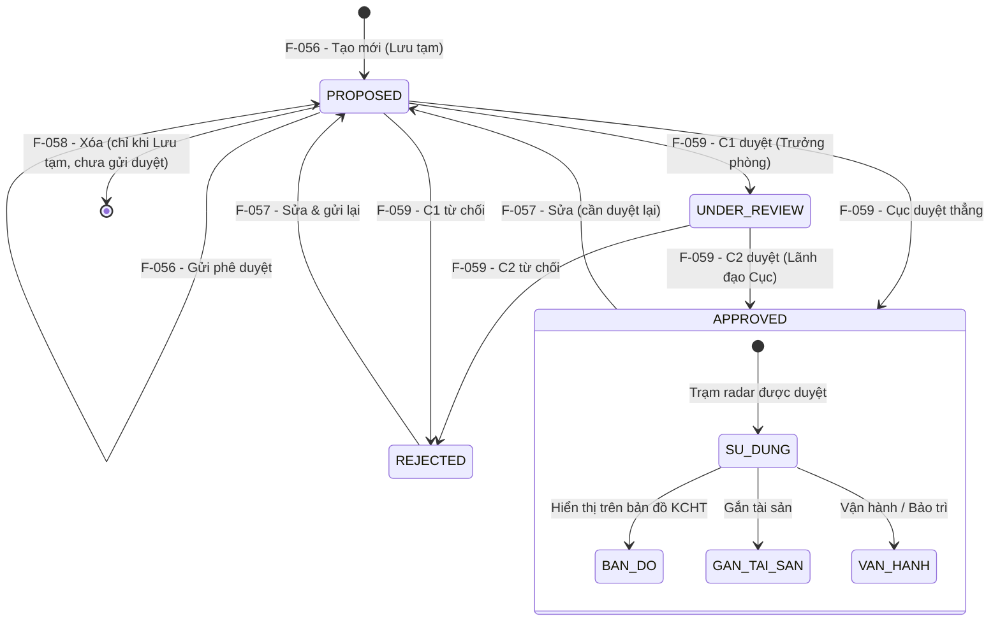

# Đặc tả nghiệp vụ: Danh sách Trạm radar

**Tài liệu:** BA Feature Brief
**Feature:** F-068
**Module:** M-003 — Quản lý tài sản KCHTGT - Khu nước & VTS
**Người viết:** Business Analyst
**Ngày cập nhật:** 2026-08-07

---

## 1. Tổng quan

### 1.1. Tính năng này làm gì?

Giao diện danh sách Trạm radar hiển thị toàn bộ các trạm radar thuộc phạm vi quản lý của người dùng, kèm khả năng tìm kiếm nhanh, lọc theo nhiều tiêu chí, phân trang và sắp xếp. Đây là màn hình trung tâm của module Trạm radar: từ đây người dùng điều hướng đến toàn bộ các thao tác khác — xem chi tiết, tạo mới, chỉnh sửa, phê duyệt, xóa và xem lịch sử thay đổi. Nghiệp vụ tham khảo từ màn hình QLKC_060 (Quản lý trạm radar) của hệ thống tham chiếu.

### 1.2. Tại sao cần tính năng này?

Trạm radar là thiết bị đầu cuối trong hệ thống VTS, có vai trò quét và giám sát giao thông tàu thuyền. Cán bộ quản lý tài sản và lãnh đạo cần một giao diện duy nhất để nắm bắt nhanh chóng trạm radar nào đang hoạt động, trạm nào đang chờ phê duyệt, và trạm nào cần xử lý gấp — từ đó hỗ trợ ra quyết định vận hành, phân bổ nguồn lực và giám sát tuân thủ quy trình phê duyệt theo quy định quản lý nhà nước về hàng hải.

### 1.3. Luồng hoạt động chính

1. Người dùng vào menu **Quản lý KCHTGT > Khu nước & VTS > Trạm radar**, hệ thống hiển thị danh sách trạm radar thuộc đơn vị mình.
2. Người dùng tìm kiếm nhanh, chọn bộ lọc hoặc chuyển tab trạng thái để thu hẹp danh sách theo nhu cầu.
3. Người dùng chọn một dòng để xem chi tiết, chỉnh sửa, xóa, phê duyệt hoặc xem lịch sử, tùy theo quyền và trạng thái của trạm radar đó.

---

## 2. Ai dùng? Dùng như thế nào?

Quyền thao tác và xem tính năng được áp dụng theo hệ thống phân quyền tập trung của hệ thống. Mỗi vai trò người dùng sẽ có phạm vi truy cập và thao tác khác nhau trên tính năng này, được kiểm soát bởi cơ chế RBAC (Role-Based Access Control).

### 2.1. Logic phân quyền chung

Các thao tác trong tính năng được bảo vệ bởi các quyền (permissions) tương ứng. Người dùng chỉ có thể thực hiện những thao tác mà vai trò của họ được cấp quyền (tại tính năng phân quyền). Danh sách luôn được lọc theo `orgUnitId` của người dùng đăng nhập — người dùng không thấy trạm radar ngoài phạm vi đơn vị mình, trừ Admin Cục.

### 2.2. Logic phân quyền đặc biệt cho tài khoản Admin Cục

Đối với tài khoản **Admin Cục**, áp dụng logic phân quyền đặc biệt sau:

- **Xem full dữ liệu:** Admin Cục có quyền xem toàn bộ dữ liệu trên hệ thống, không giới hạn phạm vi đơn vị hay khu vực.
- **Xem thông tin người chỉnh sửa:** Với mỗi bản ghi, Admin Cục thấy được thông tin người chỉnh sửa cuối cùng (họ tên, tên đăng nhập).
- **Xem thời gian cập nhật:** Admin Cục thấy được thời gian cập nhật cuối cùng của dữ liệu (timestamp).
- **Xem người tạo mới:** Admin Cục thấy được thông tin người tạo mới bản ghi (họ tên, tên đăng nhập).
- **Xem thời gian tạo mới:** Admin Cục thấy được thời gian tạo mới dữ liệu (timestamp).

> **Ghi chú:** Các trường `người tạo mới`, `thời gian tạo mới`, `người chỉnh sửa`, `thời gian cập nhật` cần được bổ sung vào bảng dữ liệu tương ứng và chỉ hiển thị đối với tài khoản Admin Cục. Với các vai trò khác, các trường này bị ẩn khỏi giao diện.

---

## 3. User Stories

Dưới đây là các câu chuyện người dùng, sắp xếp theo mức độ ưu tiên (Must > Should > Could):

### Mức Must (bắt buộc có)

- **US-068-01:** Là Chuyên viên, tôi muốn xem toàn bộ danh sách Trạm radar thuộc đơn vị mình để nắm được hiện trạng tài sản.
- **US-068-02:** Là Chuyên viên, tôi muốn tìm kiếm nhanh theo tên trạm radar để tra cứu một bản ghi cụ thể mà không cần cuộn qua toàn bộ danh sách.
- **US-068-03:** Là Chuyên viên, tôi muốn lọc theo Hệ thống VTS, Địa điểm và Tình trạng để thu hẹp danh sách theo nhu cầu công việc.
- **US-068-04:** Là Lãnh đạo, tôi muốn thấy ngay các trạm radar đang "Chờ phê duyệt" qua tab trạng thái để xử lý phê duyệt kịp thời.
- **US-068-05:** Là người dùng bất kỳ, tôi muốn click vào một dòng để xem chi tiết trạm radar đó.

### Mức Should (nên có)

- **US-068-06:** Là Chuyên viên, tôi muốn chuyển đến màn hình chỉnh sửa hoặc xóa trực tiếp từ danh sách để không phải qua trang chi tiết trước.
- **US-068-07:** Là Chuyên viên, tôi muốn xem lịch sử thay đổi của một trạm radar ngay từ danh sách.
- **US-068-08:** Là người dùng, tôi muốn đổi số bản ghi hiển thị mỗi trang (20/100) và đổi hướng sắp xếp theo nhu cầu.

### Mức Could (có thể có sau)

- **US-068-09:** Là người dùng, tôi muốn điều hướng toàn bộ danh sách chỉ bằng bàn phím (Tab/Enter) mà không cần dùng chuột.

---

## 4. Yêu cầu chức năng (Acceptance Criteria)

Mỗi yêu cầu dưới đây mô tả một điều hệ thống phải làm được, kèm theo cách xử lý khi có lỗi hoặc dữ liệu không như mong đợi.

**AC-068-01 — Hiển thị danh sách mặc định:** Khi mở màn hình, hệ thống gọi `GET /api/v1/radar-station?page=1&pageSize=20&sortBy=updatedDate&sortOrder=DESC` giới hạn theo `orgUnitId` của người dùng, và hiển thị tối đa 20 bản ghi/trang. Nếu API lỗi, hiển thị cảnh báo đỏ kèm nút "Thử lại".

**AC-068-02 — Phân trang tùy chọn:** Người dùng chọn 20 hoặc 100 bản ghi/trang từ dropdown; bảng tải lại đúng số lượng đã chọn và giữ nguyên các bộ lọc đang áp dụng.

**AC-068-03 — Tìm kiếm nhanh:** Người dùng nhập từ khóa vào ô tìm kiếm (khớp `stationName` hoặc `code`, dạng substring, không phân biệt hoa/thường) và nhấn Enter hoặc chờ debounce 400ms; hệ thống hiển thị kết quả khớp trong vòng 500ms. Nếu không có kết quả, hiển thị trạng thái rỗng (mục 11.7).

**AC-068-04 — Lọc theo Hệ thống VTS:** Dropdown "Thuộc hệ thống VTS" hiển thị các VTS đã được phê duyệt (`APPROVED`), filter theo `orgUnitId`. Chọn một giá trị sẽ lọc bảng chỉ còn trạm radar thuộc hệ thống VTS đó.

**AC-068-05 — Lọc theo Địa điểm:** Dropdown Địa điểm liệt kê các Tỉnh/Thành phố (danh mục `DON_VI_HANH_CHINH`) đang có trạm radar; chọn một giá trị sẽ lọc bảng chỉ còn trạm radar thuộc địa điểm đó.

**AC-068-06 — Lọc theo Tình trạng:** Dropdown "Tình trạng" gồm "Tất cả", "Chưa khai thác/vận hành", "Đang khai thác/vận hành", "Dừng khai thác/vận hành". Chọn một giá trị lọc bảng tương ứng.

**AC-068-07 — Tab trạng thái phê duyệt:** 5 tab "Tất cả / Đề xuất / Đang xem xét / Đã phê duyệt / Từ chối" mỗi tab hiển thị số lượng bản ghi tương ứng; chuyển tab lọc lại danh sách theo `approvalStatus` mà không mất các bộ lọc khác đang áp dụng.

**AC-068-08 — Cột hiển thị đầy đủ:** Mỗi dòng hiển thị đúng các cột mô tả tại mục 9.1: STT, Mã radar, Tên trạm radar, Đơn vị quản lý, Thuộc cảng biển, Thuộc hệ thống VTS, Thuộc trung tâm điều hành VTS, Đơn vị khai thác, Địa điểm, Đơn vị tính, Số lượng, Tình trạng, Trạng thái phê duyệt, Ngày cập nhật, Cán bộ cập nhật, Thao tác.

**AC-068-09 — Xem chi tiết:** Click vào mã hoặc tên trạm radar (hoặc nút "Xem") điều hướng đến màn hình xem chi tiết (F-060) với đúng `id` của dòng được chọn.

**AC-068-10 — Chỉnh sửa:** Nút "Chỉnh sửa" chỉ hiển thị cho Admin hoặc Chuyên viên thuộc đúng `orgUnitId` với trạm radar; click điều hướng đến màn hình chỉnh sửa (F-057) với form được điền sẵn dữ liệu.

**AC-068-11 — Xóa:** Nút "Xóa" chỉ hiển thị khi `approvalStatus = PROPOSED` và trạm radar chưa được gửi phê duyệt; click mở hộp thoại xác nhận trước khi gọi `DELETE /api/v1/radar-station/:id`. Nếu trạm radar đang có dữ liệu liên quan, hệ thống chặn xóa và hiển thị cảnh báo.

**AC-068-12 — Phê duyệt:** Nút "Phê duyệt" chỉ hiển thị cho Lãnh đạo/Admin khi `approvalStatus = PROPOSED` hoặc `UNDER_REVIEW`; click điều hướng đến màn hình phê duyệt (F-059).

**AC-068-13 — Lịch sử:** Nút "Lịch sử" luôn hiển thị cho mọi vai trò có quyền xem; click điều hướng đến màn hình lịch sử thay đổi (F-061) của trạm radar được chọn.

**AC-068-14 — Trạm radar đã xóa không hiển thị:** Trạm radar có `isDeleted = true` không xuất hiện trong danh sách chính ở bất kỳ bộ lọc nào (chỉ có thể tra cứu lại qua màn hình Lịch sử).

---

## 5. Quy tắc nghiệp vụ (Business Rules)

Các quy tắc này là "luật chơi" mà mọi thành phần trong hệ thống phải tuân thủ:

**BR-068-01 — Phân trang mặc định:** Danh sách hiển thị mặc định 20 bản ghi/trang, có thể đổi sang 100 bản ghi/trang. Không hỗ trợ hiển thị "tất cả" trong một trang.

**BR-068-02 — Sắp xếp mặc định:** Danh sách sắp xếp mặc định theo `updatedDate` giảm dần (bản ghi thay đổi gần nhất lên đầu). Người dùng có thể đổi hướng sắp xếp nhưng không đổi được cột sắp xếp.

**BR-068-03 — Phạm vi dữ liệu theo đơn vị quản lý:** Người dùng chỉ thấy trạm radar thuộc `orgUnitId` của mình. Admin Cục xem được toàn bộ hệ thống và có thể chọn lọc theo đơn vị bất kỳ (mục 2.2).

**BR-068-04 — Tìm kiếm khớp trên nhiều trường:** Từ khóa tìm kiếm được áp dụng đồng thời trên `stationName` và `code` theo kiểu OR — trả về bản ghi khớp ở bất kỳ trường nào.

**BR-068-05 — Lọc theo Hệ thống VTS:** Dropdown "Thuộc hệ thống VTS" chỉ hiển thị VTS ở trạng thái `APPROVED`, filter theo `orgUnitId`.

**BR-068-06 — Ẩn dữ liệu đã xóa:** Trạm radar có `isDeleted = true` bị loại khỏi mọi truy vấn danh sách, không phân biệt bộ lọc đang áp dụng.

**BR-068-07 — Điều kiện hiển thị nút Xóa:** Nút "Xóa" chỉ hiển thị khi đồng thời: (1) `approvalStatus = PROPOSED` và chưa gửi phê duyệt, (2) người dùng thuộc đúng `orgUnitId` hoặc có vai trò Admin/Lãnh đạo.

**BR-068-08 — Điều kiện hiển thị nút Phê duyệt:** Nút "Phê duyệt" chỉ hiển thị cho vai trò Lãnh đạo hoặc Admin, và chỉ khi `approvalStatus = PROPOSED` hoặc `UNDER_REVIEW`.

**BR-068-09 — Điều kiện hiển thị nút Chỉnh sửa:** Nút "Chỉnh sửa" hiển thị cho Admin hoặc Chuyên viên thuộc đúng đơn vị quản lý với trạm radar, ở mọi trạng thái phê duyệt (kể cả `APPROVED`) — vì sửa một trạm radar đã duyệt sẽ đưa nó quay về `PROPOSED`.

---

## 6. Vòng đời và liên kết với các tính năng khác

> ⚠ **QUAN TRỌNG CHO DEVELOPER:** Danh sách Trạm radar là **màn hình trung tâm** của module Trạm radar — mọi tính năng khác trong nhóm đều xuất phát từ hoặc quay trở lại danh sách này.

### 6.1. Vòng đời trạm radar



### 6.2. Trạng thái hiển thị trên danh sách

| Trạng thái | Mã | Badge màu | Xuất hiện trong danh sách? |
|---|---|---|---|
| Đề xuất (Lưu tạm) | PROPOSED (chưa gửi duyệt) | Xám | ✅ Có |
| Đề xuất (đã gửi duyệt) | PROPOSED (đã gửi duyệt) | Vàng | ✅ Có |
| Đang xem xét | UNDER_REVIEW | Xanh dương nhạt | ✅ Có |
| Đã phê duyệt | APPROVED | Xanh lá | ✅ Có |
| Từ chối | REJECTED | Đỏ | ✅ Có |
| Đã xóa | (isDeleted = true) | — | ❌ Không |

### 6.3. Các tính năng liên quan trực tiếp

| Tên tính năng | Mối liên kết với Danh sách Trạm radar |
|---|---|
| Xem chi tiết (F-060) | Click mã/tên hoặc nút "Xem" từ danh sách để mở |
| Tạo mới (F-056) | Nút "Tạo mới" trên thanh công cụ của danh sách; sau khi tạo xong quay lại danh sách |
| Cập nhật (F-057) | Nút "Chỉnh sửa" trên mỗi dòng; chỉ hiện theo BR-068-09 |
| Phê duyệt (F-059) | Nút "Phê duyệt" trên mỗi dòng; chỉ hiện theo BR-068-08 |
| Xóa (F-058) | Nút "Xóa" trên mỗi dòng; chỉ hiện theo BR-068-07 |
| Lịch sử (F-061) | Nút "Lịch sử" trên mỗi dòng, luôn hiển thị |

### 6.4. Module cha (trạm radar là con)

Trạm radar luôn thuộc về một Hệ thống VTS. Hệ thống VTS thuộc về một Đơn vị quản lý. Bộ lọc "Thuộc hệ thống VTS" phản ánh đúng thứ tự phân cấp này:

```markmap
- Đơn vị quản lý
  - Hệ thống VTS (F-062) — phải có ĐVQL và được duyệt
    - Trạm radar — phải có VTS cha đã duyệt, hiển thị trong danh sách
```

---

## 7. Mô hình dữ liệu

Tính năng này chỉ đọc dữ liệu (read-only), không tạo hay sửa bảng. Các bảng được truy vấn để phục vụ hiển thị danh sách và bộ lọc:

### 7.1. Bảng `radar_station` — Thông tin Trạm radar

Các trường được truy vấn để hiển thị trên bảng danh sách và phục vụ bộ lọc:

- **id:** UUID, định danh bản ghi
- **code:** VARCHAR(50), mã radar (RADAR-{seq}) — hiển thị cột "Mã radar"
- **stationName:** VARCHAR(255), tên trạm radar — hiển thị cột "Tên trạm radar", có thể click để mở màn hình xem chi tiết
- **orgUnitId:** UUID, đơn vị quản lý — dùng để giới hạn phạm vi dữ liệu hiển thị
- **cangBienId:** UUID, khóa ngoại đến cảng biển — dùng cho cột "Thuộc cảng biển" và bộ lọc
- **vtsSystemId:** UUID, khóa ngoại đến vts_system — dùng cho cột "Thuộc hệ thống VTS" và bộ lọc
- **ttdhVtsId:** UUID, khóa ngoại đến trung tâm điều hành VTS — dùng cho cột "Thuộc trung tâm điều hành VTS" và bộ lọc
- **donViKhaiThacId:** UUID, đơn vị khai thác — dùng cho cột "Đơn vị khai thác" và bộ lọc
- **provinceId:** UUID, địa điểm (Tỉnh/Thành phố) — dùng cho cột và bộ lọc "Địa điểm"
- **conditionStatus:** VARCHAR(50), tình trạng — badge cột "Tình trạng", dùng cho bộ lọc
- **approvalStatus:** VARCHAR(30), trạng thái phê duyệt — badge cột "Trạng thái phê duyệt", dùng cho tab lọc
- **updatedDate:** timestamp — hiển thị cột "Ngày cập nhật", dùng làm khóa sắp xếp mặc định
- **isDeleted:** boolean — bản ghi có giá trị true bị loại khỏi mọi kết quả danh sách (BR-068-06)
- **createdBy, createdDate, updatedBy:** chỉ truy vấn và hiển thị bổ sung khi người dùng là Admin Cục (mục 2.2)

### 7.2. Bảng `vts_system` — Hệ thống VTS (JOIN)

Truy vấn JOIN qua `vtsSystemId` để lấy tên hiển thị ở cột "Thuộc hệ thống VTS" và danh sách dropdown lọc (chỉ lấy VTS ở trạng thái `APPROVED`).

---

## 8. API Endpoints

Hệ thống cung cấp các API để phục vụ các thao tác liên quan đến tính năng:

| Method | Endpoint | Mô tả | Phân quyền |
|---|---|---|---|
| GET | `/api/v1/radar-station?page=&pageSize=&sortBy=&sortOrder=&search=&orgUnitId=&cangBienId=&vtsSystemId=&ttdhVtsId=&donViKhaiThacId=&provinceId=&conditionStatus=&approvalStatus=&tuNgay=&denNgay=` | Lấy danh sách Trạm radar có phân trang, sắp xếp, tìm kiếm và lọc, giới hạn theo đơn vị quản lý của người dùng | Tất cả người dùng đã đăng nhập |
| GET | `/api/v1/vts-system?approvalStatus=APPROVED` | Lấy danh sách Hệ thống VTS đã duyệt cho dropdown lọc | Tất cả người dùng đã đăng nhập |
| DELETE | `/api/v1/radar-station/:id` | Xóa mềm trạm radar — được gọi từ nút "Xóa" trên danh sách | Admin, Lãnh đạo hoặc Chuyên viên cùng đơn vị |

---

## 9. Chi tiết nghiệp vụ từng phần

### 9.1. Cột hiển thị trên bảng danh sách

| STT | Cột | Nguồn dữ liệu | Loại hiển thị | Ghi chú |
|---|---|---|---|---|
| 1 | STT | Tự động đánh số theo trang | Text | |
| 2 | Mã radar | `code` | Text, click để mở màn hình xem chi tiết | Ẩn mặc định |
| 3 | Tên trạm radar | `stationName` | Text, click để mở màn hình xem chi tiết | |
| 4 | Đơn vị quản lý | `orgUnitId` → tên đơn vị | Text | Ẩn trên mobile |
| 5 | Thuộc cảng biển | `cangBienId` → tên cảng biển | Text | Ẩn trên mobile |
| 6 | Thuộc hệ thống VTS | `vtsSystemId` → `vts_system.name` | Text | |
| 7 | Thuộc trung tâm điều hành VTS | `ttdhVtsId` → tên trung tâm điều hành | Text | |
| 8 | Đơn vị khai thác | `donViKhaiThacId` → tên đơn vị | Text | |
| 9 | Địa điểm | `provinceId` → tên Tỉnh/Thành phố | Text | |
| 10 | Đơn vị tính | `unitOfMeasure` | Text | |
| 11 | Số lượng | `quantity` | Number | |
| 12 | Tình trạng | `conditionStatus` | Badge | Xanh lá: Đang khai thác/vận hành; Vàng: Chưa khai thác/vận hành; Đỏ: Dừng khai thác/vận hành |
| 13 | Trạng thái phê duyệt | `approvalStatus` | Badge | Xám: PROPOSED (Lưu tạm); Vàng: PROPOSED (đã gửi); Xanh nhạt: UNDER_REVIEW; Xanh lá: APPROVED; Đỏ: REJECTED |
| 14 | Ngày cập nhật | `updatedDate` | Text (dd/MM/yyyy HH:mm) | Khóa sắp xếp mặc định |
| 15 | Cán bộ cập nhật | `updatedBy` → họ tên | Text | Ẩn mặc định |
| 16 | Thao tác | — | Nhóm nút | Xem tại mục 9.3 |

### 9.2. Bộ lọc và tìm kiếm

| Field | Loại điều khiển | Mô tả |
|---|---|---|
| Tìm kiếm theo tên, mã radar | Input (debounce 400ms) | Tìm theo `stationName` hoặc `code`, khớp substring không phân biệt hoa/thường |
| Tình trạng | Select | Tất cả / Chưa khai thác/vận hành / Đang khai thác/vận hành / Dừng khai thác/vận hành |
| Đơn vị quản lý | Select (SelectOrgCode) — chỉ hiển thị/thao tác được cho Admin Cục | Người dùng thường bị khóa cố định = đơn vị của mình |
| Thuộc cảng biển | Select (chỉ cảng biển đã duyệt) | Lọc theo `cangBienId`; filter theo `orgUnitId` |
| Thuộc hệ thống VTS | Select (chỉ VTS đã APPROVED) | Lọc theo `vtsSystemId`; filter theo `orgUnitId`. Khi thay đổi → clear bộ lọc trung tâm điều hành VTS |
| Thuộc trung tâm điều hành VTS | Select (chỉ trung tâm điều hành đã duyệt) | Lọc theo `ttdhVtsId`; filter theo `orgUnitId` + `vtsSystemId` |
| Đơn vị khai thác | Select (danh mục `DON_VI_KHAI_THAC`) | Lọc theo `donViKhaiThacId` |
| Địa điểm (Tỉnh/Thành phố) | Select (danh mục `DON_VI_HANH_CHINH`) | Lọc theo `provinceId` |
| Ngày cập nhật | Date Range Picker (Từ ngày - Đến ngày, max 1 năm) | Lọc theo khoảng `updatedDate` |
| Tab trạng thái phê duyệt | StatusTabs (5 tab, có đếm số lượng) | Tất cả / Đề xuất / Đang xem xét / Đã phê duyệt / Từ chối |

### 9.3. Hành động trên mỗi dòng

| Nút | Điều kiện hiển thị | Hành động |
|---|---|---|
| Xem chi tiết | Luôn hiển thị | Điều hướng đến màn hình xem chi tiết (F-060) với `id` |
| Chỉnh sửa | Admin hoặc Chuyên viên cùng `orgUnitId` (BR-068-09) | Điều hướng đến màn hình chỉnh sửa (F-057), form điền sẵn dữ liệu |
| Xóa | `approvalStatus = PROPOSED` và chưa gửi duyệt (BR-068-07) | Mở hộp thoại xác nhận → `DELETE /api/v1/radar-station/:id` |
| Phê duyệt | Lãnh đạo/Admin và `approvalStatus = PROPOSED` hoặc `UNDER_REVIEW` (BR-068-08) | Điều hướng đến màn hình phê duyệt (F-059) |
| Lịch sử | Luôn hiển thị | Điều hướng đến màn hình lịch sử thay đổi (F-061) |

### 9.4. Phân trang và sắp xếp

- Mặc định: trang 1, 20 bản ghi/trang, sắp xếp `updatedDate` giảm dần.
- Người dùng có thể đổi số bản ghi/trang (20 hoặc 100) — lựa chọn được giữ nguyên khi chuyển trang hoặc đổi bộ lọc.
- Đổi hướng sắp xếp (tăng/giảm) trên cột `updatedDate` bằng cách click tiêu đề cột.

---

## 10. Yêu cầu phi chức năng

### 10.1. Hiệu năng

- Thời gian tải danh sách lần đầu (20 bản ghi) ≤ 1 giây.
- Thời gian phản hồi khi áp dụng bộ lọc hoặc tìm kiếm ≤ 500ms.
- Dropdown Hệ thống VTS phản hồi ≤ 300ms.

### 10.2. Khả năng mở rộng

- Cấu trúc bộ lọc cho phép bổ sung thêm tiêu chí lọc mà không thay đổi API hiện có.
- Sẵn sàng bổ sung export Excel/PDF trong tương lai.

### 10.3. Bảo mật

- Phân quyền RBAC được áp dụng trên tất cả các API liên quan đến tính năng.
- Mọi request phải kèm JWT token hợp lệ.
- Dữ liệu được lọc theo `orgUnitId` của người dùng ở tầng backend, không phụ thuộc vào tham số gửi từ client.
- Các nút Chỉnh sửa/Xóa/Phê duyệt chỉ hiển thị và chỉ được backend chấp nhận khi đúng vai trò và đúng phạm vi đơn vị.

### 10.4. Độ tin cậy

- Dữ liệu danh sách được làm mới sau mỗi thao tác Xóa/Phê duyệt/Chỉnh sửa thành công để tránh hiển thị trạng thái cũ.
- Trạm radar đã xóa mềm không bao giờ xuất hiện lại trong danh sách chính (BR-068-06).

### 10.5. Trải nghiệm người dùng

- Giao diện responsive: trên điện thoại (dưới 768px), thanh menu thu gọn.
- Có loading skeleton khi đang tải dữ liệu.
- Có trạng thái rỗng (empty state) với hướng dẫn thân thiện khi không có kết quả tìm kiếm/lọc.
- Tuân thủ tiêu chuẩn trợ năng WCAG 2.1 AA.

---

## 11. Yêu cầu giao diện người dùng

> **Nguyên tắc cốt lõi:** Mọi giá trị màu sắc, khoảng cách, kích thước chữ trong giao diện đều được định nghĩa tập trung tại 2 file `frontend/src/theme.ts` (layout, màu nền sidebar/header) và `frontend/src/tokens.ts` (màu chữ, màu trạng thái, thang số). Tuyệt đối không hardcode giá trị hex hay pixel trong component.

### 11.1. Bố cục chung

Màn hình Danh sách Trạm radar dùng chung bố cục toàn hệ thống, bao gồm:

- **Thanh menu trái (sidebar):** rộng 272px, nền màu xanh dương đậm `#12468C`. Mục đang chọn được tô màu xanh sáng `#1B84FF`. Khi thu gọn (trên điện thoại), rộng còn 80px và chuyển thành nút hamburger.
- **Thanh tiêu đề trên cùng (header):** cao 64px, nền trắng, chứa tên người dùng và avatar.
- **Vùng nội dung chính:** nền xám nhạt pha xanh `#eaf0f6`, giúp các card trắng bên trong nổi bật hơn.

### 11.2. Hệ thống màu sắc

Mỗi màu sắc trong giao diện được gán một "vai trò" rõ ràng. Developer không được dùng màu theo cảm tính mà phải import đúng token:

| Khi cần... | Dùng token | Màu thực tế |
|---|---|---|
| Tiêu đề trang, số liệu quan trọng | `textPrimary` | `#0c2438` |
| Nhãn field, mô tả | `textSecondary` | `#566a7c` |
| Thời gian, trạng thái phụ, caption | `textTertiary` | `#93a3b3` |
| Nền card, modal, bảng | `surfaceCard` | `#FFFFFF` |
| Nền vùng nội dung chính | `surfacePage` | `#eaf0f6` |
| Viền card, đường kẻ | `borderDefault` | `rgba(11,46,79,0.09)` |
| Nút chính, link | `actionPrimary` | `#0E6FD6` |

### 11.3. Thang số — chỉ dùng giá trị cho phép

**Khoảng cách (spacing):** 4px, 8px, 12px, 16px, 24px, 32px. Trong đó 12px là khoảng cách mặc định giữa các trường trong form (`spaceFormField`), 16px là padding mặc định của card (`spaceMd`).

**Bo góc (radius):** 4px (cho ô textarea), 8px, 12px (cho card), 999px (dạng pill — dùng cho input, select, button).

**Cỡ chữ (font size):** 10px (metadata, caption), 13px (nhãn, nội dung), 15px (tiêu đề card, tiêu đề section), 18px (tiêu đề trang).

**Độ đậm chữ (font weight):** 400 (nội dung), 500 (nhãn, nút), 600 (số liệu quan trọng, tiêu đề).

**Font chữ:** `'Inter', -apple-system, BlinkMacSystemFont, sans-serif` cho toàn bộ văn bản.

> **Cấm tuyệt đối:** spacing 6, 10, 14, 18; radius 6, 7, 10; font-size 12, 14, 16, 24.

### 11.4. Style có sẵn — dùng lại, đừng tự chế

Hệ thống đã định nghĩa sẵn các kiểu dáng phổ biến. Khi cần hiển thị:

- **Thời gian, caption:** dùng `metaStyle` (chữ nhỏ 10px, màu xám nhạt, weight 400)
- **Card nội dung:** dùng `cardStyle` (nền trắng, viền 0.5px, bo góc 12px, padding 16px)
- **Tag trạng thái:** dùng `badgeBaseStyle` (chữ nhỏ, weight 500, padding 2px-8px, pill)
- **Link, nút text:** dùng `actionStyle` (pill, màu actionPrimary, weight 500)
- **Đường kẻ ngăn cách:** dùng `dividerStyle`

### 11.5. Giới hạn màu nhấn — tối đa 3 lần mỗi màn

Màu `actionPrimary` (`#0E6FD6`) là màu nhấn mạnh nhất, dùng cho các hành động chính. Để tránh giao diện bị "rối", màu này chỉ xuất hiện tối đa 3 lần trên toàn bộ màn hình Danh sách Trạm radar:

1. Nút "Tạo mới" (hành động chính trên thanh công cụ)
2. Đường gạch chân của tab trạng thái đang chọn (StatusTabs)
3. Link "Xem chi tiết" trên mã/tên trạm radar

Các màu trạng thái (xanh lá cho thành công, vàng cho cảnh báo, đỏ cho lỗi) và màu chữ không tính vào giới hạn này.

### 11.6. Màn hình Danh sách Trạm radar

Màn hình chính sử dụng các component dùng chung toàn hệ thống từ `frontend/src/components/list-view/` — không được tự tạo lại:

1. **ScreenHeader:** hiển thị đường dẫn breadcrumb "Khu nước & VTS > Quản lý Trạm radar", kèm nút "Tạo mới" ở góc phải.

2. **FilterBar:** thanh lọc nằm ngang phía trên bảng, gồm: ô tìm kiếm nhanh (stationName), dropdown "Thuộc hệ thống VTS", dropdown "Địa điểm", dropdown "Tình trạng", và dropdown "Đơn vị quản lý" (chỉ Admin Cục thao tác được).

3. **StatusTabs:** 5 tab nằm ngang: "Tất cả", "Đề xuất", "Đang xem xét", "Đã phê duyệt", "Từ chối". Mỗi tab hiển thị số lượng bản ghi trong nhóm đó. Tab đang chọn có đường gạch chân màu `actionPrimary`.

4. **DataTable:** bảng dữ liệu với tiêu đề cột cố định khi cuộn (sticky header), dòng được tô sáng khi di chuột qua (hover row). Các cột hiển thị:

| Cột | Nội dung | Loại điều khiển | Cho phép chỉnh sửa | Bắt buộc | Giá trị mặc định | Ghi chú |
|---|---|---|---|---|---|---|---|
| STT | Số thứ tự dòng | Text (tự động) | Không | Có | Tự động đánh số | |
| Mã radar | `code` | Text (link) | Không | Có | — | Click mở màn hình xem chi tiết; Ẩn mặc định |
| Tên trạm radar | `stationName` | Text (link) | Không | Có | — | Click mở màn hình xem chi tiết |
| Đơn vị quản lý | Tên đơn vị | Text | Không | Có | — | Ẩn trên mobile |
| Thuộc cảng biển | Tên cảng biển | Text | Không | Không | — | Ẩn trên mobile |
| Thuộc hệ thống VTS | Tên `vts_system` | Text | Không | Không | — | |
| Thuộc trung tâm điều hành VTS | Tên trung tâm điều hành | Text | Không | Không | — | |
| Đơn vị khai thác | Tên đơn vị | Text | Không | Không | — | |
| Địa điểm | Tên Tỉnh/Thành phố | Text | Không | Không | — | |
| Đơn vị tính | `unitOfMeasure` | Text | Không | Không | — | |
| Số lượng | `quantity` | Number | Không | Không | — | |
| Tình trạng | `conditionStatus` | Badge | Không | Có | — | Xanh lá/Vàng/Đỏ |
| Trạng thái phê duyệt | `approvalStatus` | Badge | Không | Có | — | Xám/Vàng/Xanh nhạt/Xanh lá/Đỏ |
| Ngày cập nhật | `updatedDate` | Text | Không | Có | — | Khóa sắp xếp mặc định |
| Cán bộ cập nhật | `updatedBy` → họ tên | Text | Không | Không | — | Ẩn mặc định |
| Thao tác | Nhóm nút | Button group | Không | Có | — | Xem/Sửa/Xóa/Phê duyệt/Lịch sử theo phân quyền |

5. **Pagination:** thanh điều hướng trang ở cuối bảng, hiển thị tổng số dòng, số trang, và dropdown chọn số bản ghi/trang (20/100).

### 11.7. Các trạng thái giao diện

Giao diện phải xử lý đầy đủ các trạng thái sau:

- **Đang tải:** hiển thị spinner của Ant Design hoặc khung xương (skeleton) — không hiển thị bảng trống gây hiểu nhầm là không có dữ liệu.
- **Không có dữ liệu:** hiển thị biểu tượng và dòng chữ "Không tìm thấy trạm radar nào phù hợp" với màu chữ `textSecondary` và cỡ chữ `fontSizeMd`, kèm gợi ý "Thử điều chỉnh bộ lọc hoặc tạo mới trạm radar".
- **Lỗi tải dữ liệu:** hiển thị cảnh báo đỏ và nút "Thử lại" màu `actionPrimary`.

### 11.8. Phân quyền hiển thị

Giao diện tự động ẩn/hiện các thành phần dựa trên vai trò người dùng:

| Vai trò | Thấy thành phần nào | Ghi chú |
|---|---|---|
| Chuyên viên (cùng đơn vị) | Danh sách của đơn vị mình; nút Xem, Chỉnh sửa, Xóa (khi đủ điều kiện), Lịch sử | Không thấy nút Phê duyệt |
| Lãnh đạo phòng | Danh sách của đơn vị mình; nút Xem, Phê duyệt (khi PROPOSED), Lịch sử | Phê duyệt C1 |
| Lãnh đạo Cục | Danh sách của đơn vị mình; nút Xem, Phê duyệt (khi PROPOSED/UNDER_REVIEW), Lịch sử | Phê duyệt C1 + C2 |
| Admin | Danh sách của đơn vị mình; đầy đủ mọi nút hành động | |
| Admin Cục | Toàn bộ danh sách trên hệ thống, không giới hạn đơn vị; thêm dropdown lọc theo đơn vị; thêm thông tin người tạo/người sửa/thời gian tạo/thời gian cập nhật | Logic đặc biệt (mục 2.2) |

### 11.9. Giao diện trên điện thoại

Khi màn hình nhỏ hơn 768px:

- Thanh menu trái thu gọn thành nút hamburger 80px.
- Bảng dữ liệu chuyển thành dạng thẻ (card): mỗi trạm radar là một card hiển thị Mã, Tên, Hệ thống VTS, hai badge trạng thái, và nhóm nút hành động thu gọn trong menu "...".
- Thanh lọc (FilterBar) chuyển thành panel có thể gập/mở.
- StatusTabs chuyển thành dropdown chọn trạng thái để tiết kiệm không gian ngang.
- Modal xác nhận xóa thu nhỏ còn 90% chiều rộng màn hình.
